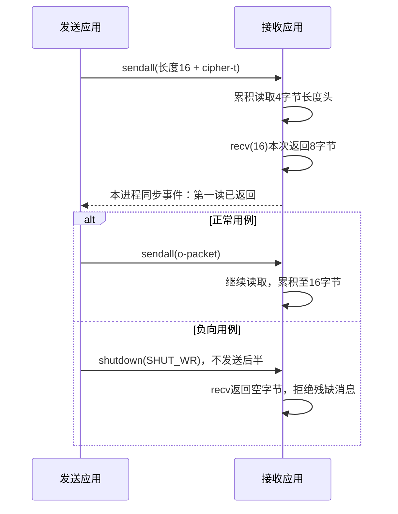

# LAB-001：一次 recv，不等于一条应用消息

这是一份为博客准备的**真实运行示例实验**。脚本由 Codex 编写并在本地回环地址执行；它不代表作者已经独立复现，也不属于公司产品验证。

实验只回答一个问题：应用声明要读 16 字节时，单次 `recv(16)` 是否保证返回完整消息？

## 实际结果

最终运行开始时间：2026-09-29 03:56:13 UTC（北京时间 11:56:13）。CPython 3.14.4，Linux 7.0.0-34-generic，x86_64。仅绑定 `127.0.0.1`、由系统分配临时端口。无第三方 Python 依赖，无外网访问，无网络配置修改，无管理员权限需求。

| 用例 | 读长度头 | 第一次读正文 | 后续读取 | 判定 |
| --- | --- | --- | --- | --- |
| 正常 | 请求 4，收到 4，声明长度 16 | `recv(16)` 收到 8：`cipher-t` | 收到 8：`o-packet` | 累积后精确恢复 `cipher-to-packet` |
| 提前 EOF | 请求 4，收到 4，声明长度 16 | `recv(16)` 收到 8：`cipher-t` | `recv(8)` 返回空字节 | 识别不完整消息，不作为成功结果接受 |

**2 个用例通过，15 条断言通过。** 原始记录是 [evidence/run-03.json](evidence/run-03.json)，标准错误文件 [evidence/run-03.stderr.log](evidence/run-03.stderr.log) 为空，命令实际退出码为 0。表格是对原始 JSON 的整理，不是重建的终端输出。

## 为什么能稳定观察到“第一次没读完”

应用帧是 `4 字节大端长度 + 16 字节正文`。发送线程第一次 `sendall()` 写入长度头和 8 字节前半正文；只有接收线程的第一次正文 `recv()` 返回并设置事件后，发送线程才会写剩余 8 字节。这个同步安排保证第一读不可能看到后半部分，避免通过 `sleep()` 猜测调度。



图中的同步事件属于测试代码，不是网络协议消息。箭头表示应用 API 操作，不表示抓包中的 TCP 段。

TCP 向应用提供按序字节流；`recv(n)` 的 `n` 是单次最多接收的字节数。消息分帧需要应用协议自行约定。本例选择长度前缀；其他协议可以选择固定长度、分隔符等规则。[RFC 9293 §2.2](https://www.rfc-editor.org/rfc/rfc9293.html#section-2.2)、[Python socket.recv 文档](https://docs.python.org/3/library/socket.html#socket.socket.recv)

## 先手工观察：两个终端

下面是独立手工路径，尚未计入上面的自动执行证据。两个终端均运行 `python3 -q`：`python3` 启动解释器，`-q` 隐藏开场说明；看到 `>>>` 后逐块输入代码。代码块不含提示符，不要一次把两个终端的代码合在一起。多行 `def`/`while` 最后输入空行结束。

### 1. 接收端终端 A：开始监听

```python
import socket, struct
listener = socket.socket(socket.AF_INET, socket.SOCK_STREAM)
listener.settimeout(120)
listener.bind(("127.0.0.1", 0))
listener.listen(1)
print(listener.getsockname()[1])
```

`AF_INET` 选择 IPv4，`SOCK_STREAM` 选择 TCP。`bind` 的端口参数 0 请系统分配临时端口；`listen(1)` 允许等待接入。最后一行会显示本次端口，请记下。`settimeout(120)` 为人工切换终端保留两分钟；超时后重新开始这一轮。不需 `sudo`，不会监听外部网卡。

### 2. 发送端终端 B：只发前半

```python
import socket, struct
port = int(input("输入终端 A 显示的端口："))
sender = socket.create_connection(("127.0.0.1", port), timeout=120)
sender.sendall(struct.pack("!I", 16) + b"cipher-t")
```

`input` 读取本次实际端口，`int` 转为整数。`!I` 表示四字节无符号整数、网络字节序；`b"..."` 是字节串。第一写包含 4 字节长度头与 8 字节正文。**此时停在终端 B，不发送后半。**

### 3. 回到终端 A：查看第一读

```python
conn, _ = listener.accept()
conn.settimeout(120)

def read_exact(sock, count):
    data = bytearray()
    while len(data) < count:
        chunk = sock.recv(count - len(data))
        if not chunk:
            raise EOFError("消息尚未读完，对端已关闭写方向")
        data.extend(chunk)
    return bytes(data)

length = struct.unpack("!I", read_exact(conn, 4))[0]
first = conn.recv(length)
print(length, len(first), repr(first))
```

`accept` 获得新连接。`read_exact` 只在累积到指定长度时返回，空字节表示 EOF，应立即停止。`recv(length)` 刻意只调用一次；这次可能读到 1～8 字节，不能读到完整的 16 字节，因为后半还没发送。自动实验本次实收 8 字节；不能把它写成所有系统每次必然实收 8 字节。

### 4. 终端 B：发后半并关闭写方向

```python
sender.sendall(b"o-packet")
sender.shutdown(socket.SHUT_WR)
```

`sendall` 尝试写完给定字节串或抛出异常；不承诺对方一次 `recv` 读完。`SHUT_WR` 表示本方向不再发送，已排队的内容仍能被对方读取。

### 5. 终端 A：按应用长度收齐

```python
remaining = read_exact(conn, length - len(first))
message = first + remaining
print(len(message), repr(message))
assert message == b"cipher-to-packet"
conn.close()
listener.close()
```

预期得到 16 字节完整消息。`assert` 检查内容；未满足时抛异常。再在终端 B 执行 `sender.close()`，两端执行 `exit()` 退出。没有常驻服务或系统配置需要清理。

### 6. 故障注入：提前 EOF

重新执行步骤 1～3，在步骤 4 **不执行第二次 sendall**，只执行 `sender.shutdown(socket.SHUT_WR)`。步骤 5 的 `read_exact` 应抛出 `EOFError`，不得把前 8 字节当完整消息。异常后仍按步骤 5 关闭 socket。若出现 `ConnectionRefusedError`，检查是否使用了本轮真实端口、终端 A 是否仍在监听；若出现 `TimeoutError`，检查终端操作顺序和是否停顿超过两分钟。

## 然后自动回归

终端离开 Python 解释器后，在 shell 中逐条执行：

```sh
cd tcp-stream-lab
python3 --version
timeout 20s python3 tcp_stream_lab.py --case all > evidence/run-local.json 2> evidence/run-local.stderr.log
echo $?
python3 -m json.tool evidence/run-local.json
sha256sum tcp_stream_lab.py evidence/run-local.json
sha256sum -c SHA256SUMS
```

- `cd` 改变工作目录。这里使用下载后解压的实验目录相对路径；`evidence/run-local.json` 是相对这个目录的路径。若素材被放到其他目录，只修改第一行。
- `python3 --version` 显示本机 Python 版本，不执行实验。
- `timeout 20s` 给整个回归再加一道 20 秒上限；实验内部每次 socket 操作和同步等待上限 2 秒，线程回收等待上限 3 秒。
- `tcp_stream_lab.py` 是解释器读取的脚本参数，不需可执行权限；因此未使用 `./`。`--case all` 同时跑正常和负向用例，可换成 `normal` 或 `early_eof`。
- `>` 将标准输出写入 JSON 文件，`2>` 将标准错误单独保存；两者会覆盖同名文件，下一次可改为 `run-local-02`。不使用管道、后台 `&`、`$!` 或环境变量，这个最小实验不需要它们。
- 紧接着的 `echo $?` 查看上一条命令退出状态；成功为 0，GNU `timeout` 超时通常为 124。必须在其他命令前读取。
- `python3 -m json.tool` 只格式化查看刚才的原始 JSON。确认顶层 `passed` 为 `true`，并查看每次实际 `recv` 和每项断言。
- `sha256sum` 计算脚本和新结果的指纹。`sha256sum -c SHA256SUMS` 校验本素材已有文件是否被改动；自己重跑的时间和调度记录可不同，不能要求新结果与这里的 JSON 哈希相同。

自动脚本用 `threading.Event` 代替手工切换两个终端。`run_case()` 执行一次实验，`sender()` 控制分两次发送或提前 EOF，`receive()` 原样记录每次返回的字节，正常和负向用例均汇总显式断言。脚本使用异常而不是只依赖 Python `assert` 来处理必要的读取边界。

## 已确认与边界

- 已确认：本次 `recv(16)` 可以只返回 8 字节；长度前缀加累积读取恢复了完整应用消息；提前 EOF 被识别。
- 未确认：线上 VPN 的任何实际行为、TCP 分段、IP 包数量、网卡卸载、TLS/TLCP 或 OpenVPN 的分帧、性能瓶颈。这里没有抓包，因此没有 PCAP 或 Wireshark 界面步骤，也不声称“发送两个 TCP 包”。
- 这个受控实验让两个正文片段对应两次成功读取，但这不构成一般的 send/recv 一一对应关系；变化调度后可出现其他返回长度。
- `duration_seconds` 是自动回归的运行记录，不是吞吐、延迟或性能基准数据。
- 仅覆盖一个短消息及提前 EOF；长度头截断、非法超大长度、多个连续消息、重传、超时恢复等未在本次用例中验证。
- 公开正文可以从此引出“读取隧道或 TLS 上层协议时，先找到应用分帧规则”的下一问题；不能直接推广为所有 VPN 协议已经验证。

## 原始记录与可公开范围

`run-03` 是包含最终脚本 SHA-256 的成功结果。本文提供最终脚本、原始 JSON、空的 stderr 和哈希清单。

最终脚本 SHA-256：`12ebd5b920a1054389a44e93f6d522f51e81e2253f5a6543cce4bf49db36292f`。完整文件指纹见 [SHA256SUMS](SHA256SUMS)。输出不包含主机名、用户名、外部 IP、公司源码、客户信息或内部网络结构。

作者的学习验收仍待完成：能解释 `recv(16)` 的 16 为什么不是消息承诺；能手工完成正常路径；能修改正文并相应修改长度；能诊断提前 EOF 并说明为什么不能接受残缺消息。
