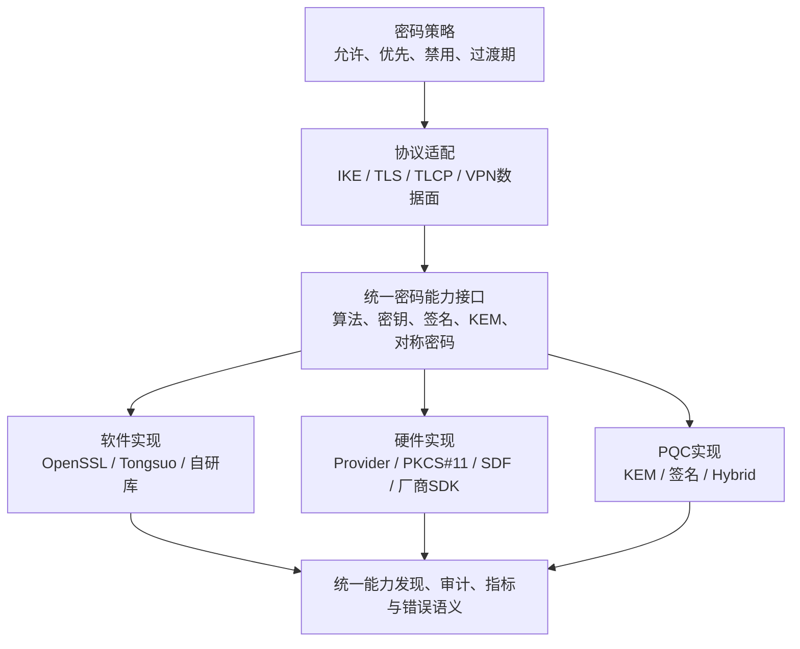
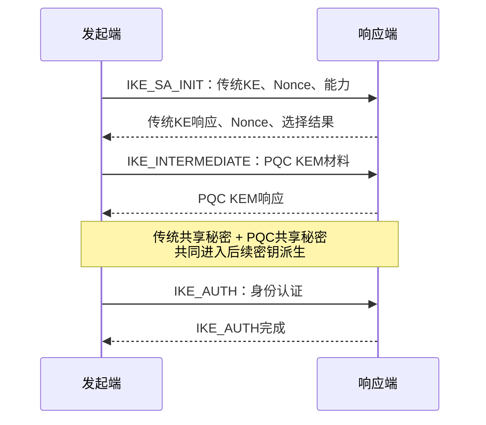

> 本文描述候选目标架构和验证门槛。产品是否支持 Provider、SDF、PKCS#11、特定密码卡或 PQC 协议扩展，必须在源码交付后确认。

## 1. 目标不是“多支持几个算法”

密码敏捷是指：在不重写整个业务和协议主体的前提下，能够发现、选择、替换、迁移和停用密码算法、密钥、证书、软件库与硬件设备，并保持安全和业务连续性。

关键不是把所有接口包成一层，而是保证算法身份、密钥句柄、错误、并发、回退和生命周期语义不会被抽象层掩盖。

## 2. 第一阶段：建立密码资产清单

源码到货后先回答：

- 哪些协议和数据面使用了哪些算法；
- 算法名称、数字ID、OID和库内部标识如何映射；
- 私钥、会话密钥、PSK、证书和随机数在哪里产生、保存、使用和销毁；
- 哪些调用进入软件库，哪些进入HSM/密码卡/UKey；
- 构建时链接什么，运行时实际加载什么；
- 禁用算法、设备离线或证书错误时是否会降级。

NIST 的 PQC 迁移工作同样把“密码发现/清单”和“互操作验证”视为迁移的基础。没有清单，就无法知道更换算法会影响哪些协议、设备和客户。

## 3. 第二阶段：建立可替换的密码能力层

推荐把职责拆开：

| 层 | 负责什么 | 不应负责什么 |
| --- | --- | --- |
| 协议层 | 协商、状态机、报文、密钥派生时机 | 直接散落调用某厂商SDK |
| 密码策略层 | 允许算法、优先级、强度、过渡和禁用 | 偷偷改变协议协商结果 |
| 密码能力层 | 算法和密钥操作、能力发现、错误统一 | 吞掉设备错误或静默回退 |
| 设备适配层 | Provider/PKCS#11/SDF/SDK、会话和句柄 | 让业务代码理解每家设备私有细节 |
| 观测与审计 | 实现身份、设备身份、调用和失败统计 | 输出私钥或会话密钥 |

接口至少要表达：算法、参数、密钥来源、是否允许导出、同步/异步模式、设备能力、失败是否可回退以及调用审计标识。

## 4. 第三阶段：密码卡与HSM接入

不要把“能调用一次 SM2 签名”当作接入完成。需要验证：

1. 密钥是否在设备内产生或导入，私钥是否不可导出；
2. 多线程和高并发下会话池、句柄和队列是否安全；
3. 设备掉线、超时、重启、满负载时协议怎样失败；
4. 是否存在软件回退，回退是否由明确策略控制并被审计；
5. 签名/解封等控制面操作与高频数据面加解密是否分开设计；
6. 更换另一类设备时，协议主体是否无需修改。

HSM适合保护长期私钥，不等于所有流量都应经过HSM。数据面是否使用密码卡，要由吞吐、调用延迟、批处理、DMA、队列和密钥边界共同决定。

## 5. 第四阶段：PQC从PoC进入协议

PQC接入需要区分三件事：

- **KEM/密钥建立**：优先应对“现在收集、未来解密”；
- **数字签名**：影响证书、PKI、固件签名和身份认证；
- **Hybrid**：让会话秘密同时依赖传统算法与PQC算法，降低迁移期单一新算法的不确定性。

IKEv2 已有 RFC 9370 定义多重密钥交换框架，可通过额外密钥交换把多个共享秘密纳入密钥派生；较大的交换还涉及 IKE_INTERMEDIATE 与分片边界。具体 ML-KEM 标识、实现版本和互通对象必须固定后再开发。

对 SSL/TLS 路线也应先固定协议版本、密码库、标准组标识、客户端生态和证书方案。库“支持 ML-KEM”不等于产品已经完成协商、策略、日志、互通和回退控制。

## 6. 验证门槛

| 能力 | 不能只看 | 至少还要证明 |
| --- | --- | --- |
| 新算法注册 | API返回成功 | 双端协商、真实执行路径、错误用例 |
| 密码卡接入 | Provider/SDK加载 | 密钥不出设备、调用统计、掉线策略、无静默回退 |
| PQC Hybrid | 一次握手成功 | 双秘密进入KDF、传统/PQC单边失败、rekey、互通、分片 |
| 数据面国密 | 控制面使用国密 | 实际SA/密钥、数据通道算法、负面测试和性能 |
| 密码敏捷 | 有统一接口 | 可替换实现、策略迁移、资产清单、兼容与回滚 |

## 7. 可量化的阶段成果

- 能从配置追到协议选择、密码接口、运行库/设备和原始证据；
- 新增一种软件实现或设备适配时，协议主体不需要散点修改；
- 可明确禁止回退，并能从审计判断实际使用的软件/硬件实现；
- 建立传统、国密、Hybrid PQC 的互通和负面测试矩阵；
- 给出签名、建链、吞吐、P99、并发与设备利用率基线；
- 算法或设备迁移有灰度、回滚、证书/密钥更新和兼容方案。

## 参考资料

- [NIST CSWP 39upd1：Considerations for Achieving Crypto Agility](https://csrc.nist.gov/pubs/cswp/39/upd1/considerations-for-achieving-crypto-agility/final)
- [NIST NCCoE：Migration to Post-Quantum Cryptography](https://www.nccoe.nist.gov/applied-cryptography/migration-to-pqc)
- [RFC 9370：Multiple Key Exchanges in IKEv2](https://datatracker.ietf.org/doc/html/rfc9370)
- [NIST：Post-Quantum Cryptography Publications](https://csrc.nist.gov/Projects/post-quantum-cryptography/publications)
