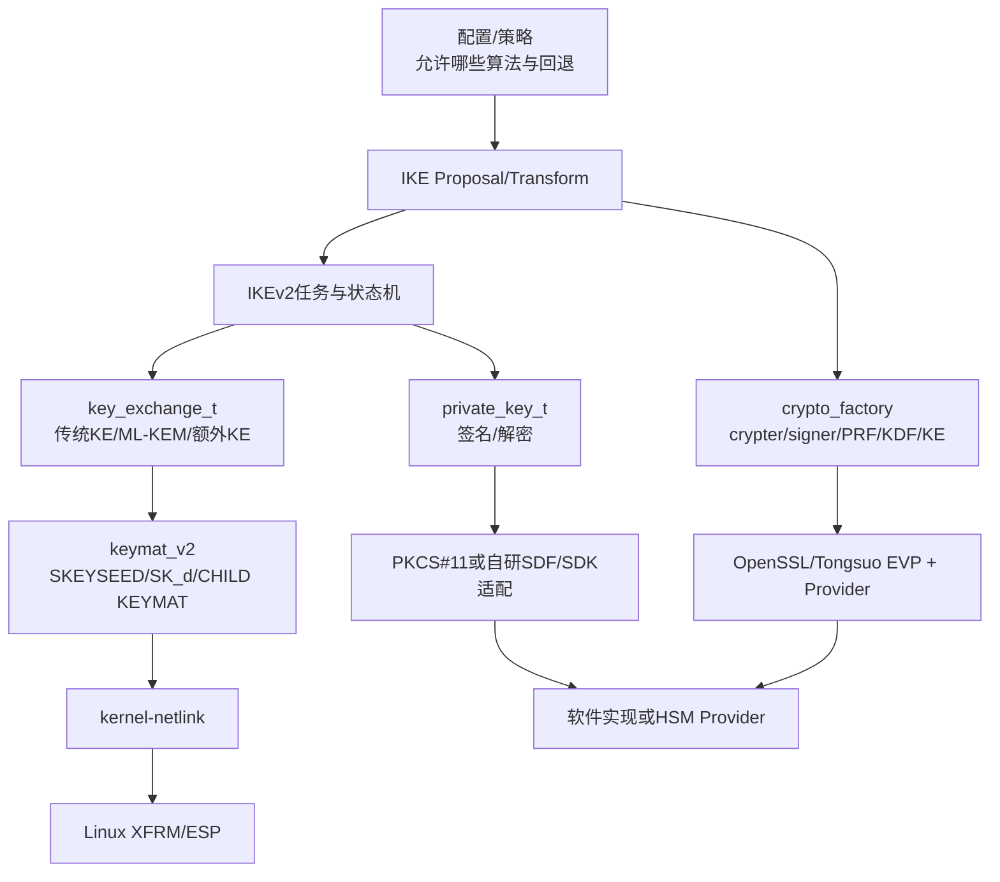
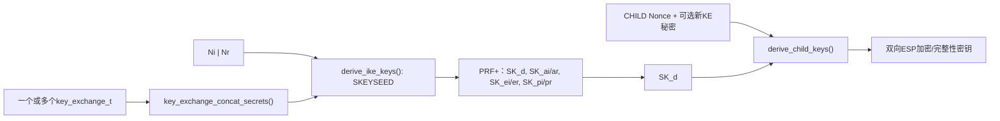

## 1. 先给出最重要的架构判断

协议接入要检查的不是一个“国密开关”，而是几个职责不同的接缝：



“链接了Tongsuo”只表示密码库可被调用。strongSwan还必须认识算法、把它放进Proposal、注册实现构造器、在KDF/认证处选择正确语义，并在ESP场景把内核认识的名称和密钥交给XFRM。

## 2. Proposal从文本进入算法工厂

固定基线：strongSwan 6.0.3，Commit `472dcd8bb50a91f156b725ff56992352b573f7dd`。

| 阶段 | 文件与函数 | 输入 | 输出/下一站 |
| --- | --- | --- | --- |
| VICI读取proposal | `src/libcharon/plugins/vici/vici_config.c:637 parse_proposal()` | 文本如`aes256-sha256-prfsha256-modp2048` | 调用`proposal_create_from_string()` |
| 文本分词 | `src/libstrongswan/crypto/proposal/proposal.c:1390 proposal_create_from_string()` | 以`-`分隔的关键字 | `proposal_t`中的Transform集合 |
| 关键字表 | `src/libstrongswan/crypto/proposal/proposal_keywords_static.txt` | 名称 | Transform类型、内部枚举、密钥长度 |
| 实现选择 | `src/libstrongswan/crypto/crypto_factory.c:162/195/228/292/487` | 算法枚举 | crypter、AEAD、signer、PRF、KE实例 |
| 插件注册 | `src/libstrongswan/plugins/openssl/openssl_plugin.c:360起` | 插件feature表 | 哪些枚举由OpenSSL插件提供 |

上游6.0.3的OpenSSL插件注册AES、SHA2、HMAC、KDF和ML-KEM等能力，但在这份未改造上游中搜索不到`ENCR_SM4`、`HASH_SM3`、`PRF_HMAC_SM3`等strongSwan内部枚举。因此Tongsuo默认Provider虽然有SM2/SM3/SM4，strongSwan也不会自动把任意Provider算法变成IKE Transform；仍需增加协议枚举/关键字/注册和实现映射。

## 3. Tongsuo Provider处在什么位置

固定基线：Tongsuo 8.4.0。

Tongsuo的默认Provider已经登记：

- SM3：`providers/defltprov.c:130`；
- SM4-ECB/CBC/CTR/OFB/CFB/GCM/CCM：`providers/defltprov.c:220`；
- SM2DH：`providers/defltprov.c:290`；
- SM2签名：`providers/defltprov.c:318`；
- SM2加解密：`providers/defltprov.c:341`；
- SM2 Key Management：`providers/defltprov.c:401`；
- 统一分发入口：`providers/defltprov.c:427 deflt_query()`按`OSSL_OP_*`返回算法表。

应用通过`EVP_CIPHER_fetch()`、`EVP_MD_fetch()`、`EVP_SIGNATURE_fetch()`、`EVP_KEM_fetch()`等接口让OpenSSL Core根据算法名和属性查询Provider。strongSwan的openssl插件在初始化时会加载OpenSSL配置和Provider，并在`openssl_plugin.c:830`起处理FIPS/base/legacy/default Provider。

但要注意两层限制：

1. strongSwan插件必须先提供对应内部算法枚举和构造器；
2. 厂商HSM Provider必须实现调用链实际使用的operation，不是只让`openssl list -providers`显示成功。

## 4. HSM/密码卡有三条候选接入路线

### 路线A：OpenSSL Provider

适合让已有EVP调用透明选择软件或硬件实现。优势是上层改动集中；风险是某些legacy API、私钥URI、并发、错误和回退语义可能不兼容。验收要看Provider身份和设备调用计数，不能只看加载日志。

### 路线B：PKCS#11

strongSwan上游已有较清晰的私钥路径：

```text
pkcs11_plugin.c:227 注册 private_key_t
→ pkcs11_private_key_connect() 查找对象
→ pkcs11_library.c:1116 获取 C_GetFunctionList
→ private_key_t.sign()
→ C_OpenSession / C_SignInit / C_Sign
```

关键位置是`src/libstrongswan/plugins/pkcs11/pkcs11_private_key.c:421 sign()`和`:537 decrypt()`。这非常适合长期身份私钥不出设备，但不能由一次签名就推断ESP大流量也在卡上执行。

### 路线C：SDF/厂商SDK适配

在Tongsuo 8.4.0当前源码中没有检出SDF/SKF业务接口实现。这不表示不能接，而是通常需要：

- 厂商提供OpenSSL Provider，把SDF/SDK封装在Provider内部；或
- 编写strongSwan密码插件/私钥适配，实现`private_key_t`、`crypter_t`、`signer_t`、`key_exchange_t`等接口；或
- 建立独立的密码服务层，再由协议插件调用。

最终路线必须根据目标产品实际代码、板卡SDK、密钥是否允许导出、调用时延和数据面位置决定，当前不能替产品拍板。

## 5. shared secret如何进入KDF

strongSwan IKEv2真正的密钥链在`src/libcharon/sa/ikev2/keymat_v2.c`：



- `keymat_v2.c:239 derive_ike_keys()`取Proposal中的PRF、加密和完整性算法；
- `:305 key_exchange_concat_secrets()`合并一个或多个共享秘密；
- `:339`按初始IKE公式生成SKEYSEED；
- `:391`起用PRF+产生七组IKE密钥；
- `:536 derive_child_keys()`以`SK_d`和CHILD相关Nonce/额外KE秘密产生双向ESP密钥。

所以接PQC时不能只“注册一个KEM”。还要确认：线上如何协商、谁发公钥/密文、多个秘密的顺序和编码、失败是否中止、最终秘密是否真的进入该KDF路径，以及rekey是否同样处理。

## 6. strongSwan 6.0.3已有的PQC支点

源码已确认：

- `crypto/key_exchange.h:73-75`定义ML-KEM-512/768/1024方法ID 35/36/37；
- `proposal_keywords_static.txt:181-183`定义`mlkem512/768/1024`关键字；
- `plugins/ml/ml_plugin.c:46`注册软件ML-KEM；
- `plugins/ml/ml_kem.c:982 ml_kem_create()`创建实现；
- `plugins/openssl/openssl_plugin.c:531`在OpenSSL 3.5条件下注册OpenSSL ML-KEM；
- `sa/ikev2/tasks/ike_init.c:558`起识别一个主KE和额外KE；
- `keymat_v2.c:305/612`把额外共享秘密纳入IKE或CHILD密钥派生。

这说明上游已经提供很好的PQC实验支点。当前已用固定6.0.3源码独立构建并完成`X25519 + ML-KEM-768`正向建链、IKE_INTERMEDIATE、CHILD_SA、XFRM/ESP和“移除所有ML-KEM提供方后必须失败”的负向测试，详见[strongSwan PQC-IKE参考原型与综合网关接入方案](strongSwan%20PQC-IKE参考原型与综合网关接入方案.md)。该结果仍不能证明目标产品采用同一版本或接口；到货后必须再做上游、目标产品实现和产品运行三方对照。

## 7. CHILD密钥如何进入Linux XFRM

`kernel-netlink`把协议内部结果翻译为Linux数据面：

- `kernel_netlink_ipsec.c:284 lookup_algorithm()`把内部Transform ID映射为内核算法名；
- `:1736 add_sa()`构造`XFRM_MSG_NEWSA/UPDSA`；
- `:1920`起设置AEAD或普通加密算法、密钥和ICV；
- `:1976`起设置完整性算法和截断长度；
- 内核收到后创建XFRM state，Policy负责决定哪些业务包进入该SA。

因此：charon能用Tongsuo完成IKE的SM算法，不等于Linux内核已支持ESP的SM算法；HSM完成SM2签名，也不等于ESP数据面流量经过密码卡。这两类“只改了一半”必须在验收矩阵中分开检查。

## 8. 源码到货后要问的五个决定性问题

1. 协议层使用的是自研状态机、strongSwan/OpenVPN分支，还是其他组件？
2. 密码抽象层的接口能否表达软件/Provider/SDF/PKCS#11以及禁止回退？
3. 长期私钥和高频会话密钥分别在哪里，是否允许离开设备？
4. PQC共享秘密到底在哪个函数进入KDF，传统+PQC组合规则是什么？
5. 协议成功、设备调用和数据面真实生效分别用什么独立证据证明？
