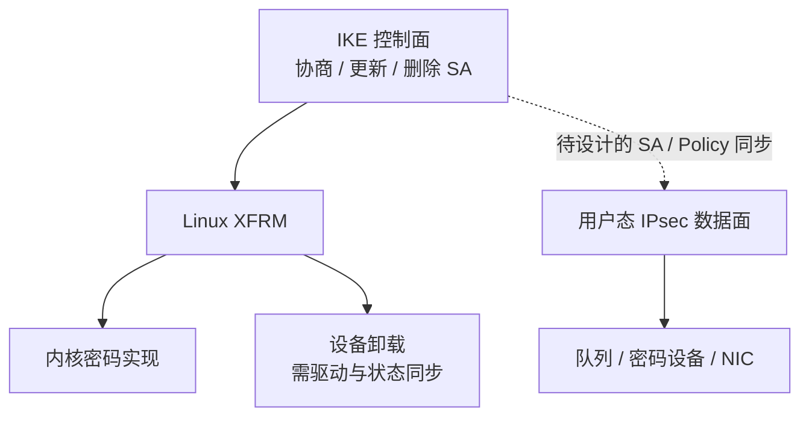

## 先画责任，再画快路径

讨论绕过内核时，常见说法是减少拷贝、中断或调度开销。但一个 VPN 数据面还需要查策略、找到正确 SA、处理序列号、防重放、换钥和错误计数。路径变短后，这些职责仍然存在。

本文的判断是：在确认瓶颈之前，先列出迁移后谁负责这些工作。下面的比较是公开实现的职责分析，没有给出吞吐提升结论。

## 三种变化并不相同

Linux XFRM device 文档区分 crypto offload 与 packet offload。前者把密码运算交给设备，后者进一步把包封装等 IPsec 处理交给设备，并需要内核与设备维护相应 SA/策略状态。支持范围取决于驱动和硬件。[XFRM device 文档](https://docs.kernel.org/networking/xfrm/xfrm_device.html)

AF_XDP 则把包交给使用共享 UMEM 和队列的用户态程序。它有 copy 与 zero-copy 模式；能创建 AF_XDP Socket 不等于目标网卡已经进入 zero-copy 路径。[AF_XDP 文档](https://docs.kernel.org/networking/af_xdp.html)

DPDK 的 ipsec-secgw 展示用户态安全网关数据面。官方明确说明该示例没有实现 IKE，SA 和策略由手工设置；因此它不能直接替代动态协商的完整 VPN。[DPDK 26.07 ipsec-secgw](https://doc.dpdk.org/guides/sample_app_ug/ipsec_secgw.html)

虚线是设计工作，并不表示 strongSwan 与任意 DPDK 应用已经可以直接连接。

## 一份职责迁移表

| 职责 | 内核 XFRM 路线的核查点 | 用户态快路径必须回答 |
| --- | --- | --- |
| 策略与 SA 查找 | policy、state、方向与 reqid | 分类规则和 SA 表如何同步 |
| 重放保护 | SA 状态与窗口 | 多队列并发怎样维护窗口 |
| 序列号 | 每个出站 SA 的计数 | 分核后如何避免重复和越界 |
| Rekey | 新旧 SA 的并存、切换与删除 | 在途包与对象回收怎样处理 |
| 可观测性 | XFRM / 接口 / 驱动统计 | 新路径有哪些独立计数与抓包点 |
| 失败行为 | 安装错误、设备拒绝、状态过期 | 流量是丢弃、排队还是按批准策略回退 |

这不是对某个 DPDK 示例支持状态的逐项声明，而是迁移设计的验收清单。具体能力必须绑定所用库、示例版本、驱动和配置。

## 密码卡不一定在热点路径上

长期身份私钥进 HSM，可能影响握手时延；逐包对称运算卸载，可能影响 ESP 吞吐。这两个实验使用不同负载，不能互相代替。对小包路径，设备调用、排队和 DMA 的成本也需要测量，不能只引用算法裸算速度。

应先读[密码接口地图](/articles/crypto-provider-kdf-map/)，确认到底是哪个消费者在调用设备，再读[性能画像方法](/articles/vpn-benchmark-method/)决定测什么。

## 待验证：一次有对照的迁移实验

**测试方案示例，尚未执行**：固定机器、NUMA 位置、算法、隧道数、包长、方向和测试时长，先保留 XFRM 基线，再比较一个明确的候选路径。

同时记录应用吞吐、外层 PPS、丢包、尾时延、每核 CPU、协议错误和重放计数。用相同业务端点验证保护范围，避免优化后只是改变了流量路径或绕过密码处理。

性能测试之外，至少注入以下故障：持续流量中 rekey、乱序与重放、删除正在使用的 SA、设备复位、接收队列耗尽。观察旧密钥何时停止使用、失败包有没有明文旁路、资源能否回收。

## 决策出口

如果热点是配置锁或 IKE 签名延迟，换数据面并不直接回答问题。如果热点确实在逐包内核处理，再比较多队列、亲和性、已有卸载与用户态路径的收益和维护成本。

是否引入 DPDK，应由一组同条件测量和负向测试决定。本文尚无这组数据，因此保留选择条件，不给出默认升级结论。
