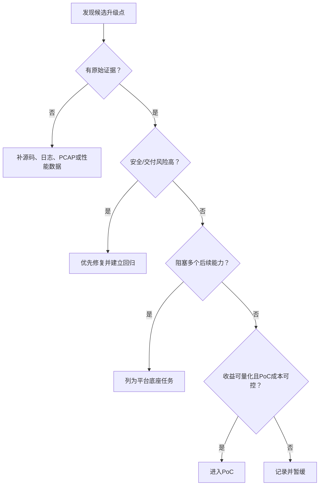

> 本文用于源码到货后的首轮技术体检。它的目的不是立刻提出大改造，而是把“感觉可以升级”转化为事实、风险、量化指标和可排期的工程候选项。

## 1. 先建立产品事实，不急着提出方案

每个发现都用同一张记录卡：

| 字段 | 应记录什么 |
| --- | --- |
| 当前事实 | 版本、文件/模块、进程、配置、接口或实测行为 |
| 原始依据 | 源码位置、构建日志、运行版本、PCAP、系统状态或测试数据 |
| 问题 | 正确性、安全、性能、可靠性、可维护性或产品能力缺口 |
| 影响 | 影响的客户场景、故障范围、资源成本或交付风险 |
| 候选路线 | 至少一个低成本方案和一个结构性方案 |
| 验证方法 | PoC、负面测试、Benchmark、互通或故障注入 |
| 决策状态 | 已确认、待补证据、待Mentor/产品确认、暂缓 |

不要从“我要用 DPDK”开始，而要从“64B 包下 PPS 不达标，Profiling 显示每包系统调用和拷贝占比过高”开始。

## 2. 九个检查域

### 2.1 代码与供应链

- 源码、分支、Commit、补丁、子模块和二进制是否完整；
- 第三方组件版本、许可证、CVE和自研边界是否清楚；
- 构建是否依赖供应商私服、临时文件或未交付工具；
- 相同输入能否生成可安装、功能一致的产物；
- SBOM、签名发布、升级和回滚是否存在。

可形成的升级项：离线构建、依赖锁定、CI、制品签名、SBOM、漏洞响应流程。

### 2.2 系统架构与配置链

- Web/API、数据库或配置文件怎样到达 VPN 进程；
- 配置是否有 Schema、默认值、校验、迁移和审计；
- 服务之间通过文件、命令、RPC、消息还是共享库通信；
- 配置失败、部分成功和重启后恢复怎样处理。

可形成的升级项：统一配置模型、事务化下发、配置差异、回滚和可观察状态。

### 2.3 IPsec与SSL VPN协议链

- 支持哪些 IKE/TLS/TLCP 版本、认证方式、算法和扩展；
- rekey、DPD、NAT-T、分片、漫游和异常报文怎样处理；
- 控制面成功后，数据面状态由谁安装和维护；
- 是否存在静默降级、配置与协商结果不一致或“假成功”。

可形成的升级项：互通矩阵、严格策略、负面测试、状态机可观测和问题诊断工具。

### 2.4 密码与密钥生命周期

- 算法、证书、密钥、密码库、Provider/Engine/SDK在哪里使用；
- 私钥是否可导出，设备失败时是否回退到软件；
- 数据面密钥是否进入内核或硬件，何时销毁；
- 密码卡替换是否会侵入协议主体；
- 能否枚举系统正在使用的密码资产。

可形成的升级项：密码资产清单、统一密码接口、设备能力发现、策略Profile、失败审计和PQC Hybrid。

### 2.5 数据面与性能

- IPsec 走 XFRM、用户态还是专用硬件；SSL VPN 走 TUN、DCO还是自研通道；
- 网卡、队列、中断、路由、Netfilter、NAT、拷贝和密码调用的开销在哪里；
- 大包吞吐、小包PPS、并发隧道、建链速度、P99和CPU/bit是多少；
- 单连接、并发、rekey、长稳和故障恢复是否都测过。

可形成的升级项：普通Linux调优、批处理、多线程、密码卸载、XFRM/DCO、AF_XDP或DPDK评估。

### 2.6 可靠性、HA与恢复

- 进程崩溃、设备掉线、链路抖动、证书过期和磁盘满时如何表现；
- 主备是否同步配置、会话、SA、密钥和审计状态；
- 升级失败能否回滚，重启后是否保留不应保留的状态；
- 是否有看门狗、限流、熔断和资源耗尽保护。

### 2.7 可观测与可诊断

- 能否从一次连接ID关联配置、握手、SA、数据面、用户和审计；
- 日志是否有级别、速率限制、脱敏和时间同步；
- 是否暴露隧道、重传、失败原因、队列、丢包、密码设备和系统资源指标；
- PCAP、日志、系统状态和源码能否相互印证。

### 2.8 管理、身份与策略

- 管理员、设备、用户、UKey、证书和资源如何建模；
- 权限是否最小化，策略冲突如何解释；
- VPN、防火墙、零信任和安全认证是否重复维护身份与策略；
- API是否稳定、可审计并支持自动化。

### 2.9 平台扩展与生态

- 支持哪些CPU架构、国产操作系统、网卡、密码卡和虚拟化环境；
- 第三方VPN、CA、HSM、SIEM和管理平台怎样互通；
- 多站点、多链路、多租户或云部署是否有真实需求；
- 硬件/厂商绑定会带来多大替换成本。

## 3. 如何决定优先级

不要用复杂公式制造精确假象。先回答五个问题，并保存理由：

1. 不解决会不会造成安全、交付或重大客户风险？
2. 证据是否足以证明问题存在？
3. 是否阻塞后续多个能力？
4. 能否用小型改动或 PoC 快速验证？
5. 团队能否长期维护，而不是只能依赖单个供应商？

## 4. 源码到货后的首轮输出

建议形成六份可持续更新的资产：

1. 产品组件、版本、许可证与来源清单；
2. 进程、线程、配置、协议、密码和数据面架构图；
3. 构建、部署、升级和回滚手册；
4. IPsec/SSL VPN 功能、互通、负面与性能基线；
5. 风险与升级候选 Backlog；
6. 每个重大选择对应的技术决策记录（ADR）。

## 5. 红线信号

出现以下情况时，不应急着做新功能：

- 无法从源码独立构建；
- 运行产物与交付源码无法对应；
- 私有二进制或在线服务不可替代；
- 算法配置、协商结果和数据面状态不一致；
- 密码设备失败后静默回退；
- 核心模块没有负面测试和回滚；
- 性能数字缺少固定环境、原始数据或复测方法；
- 供应商源码、密钥或客户材料被放入未经批准的仓库。

这份清单的价值，是让升级路线从“技术兴趣”变成可解释、可验证、可排序的产品工程。
