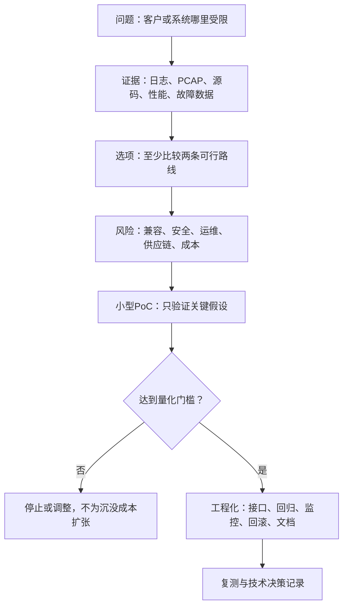

> 本文保留技术路线的判断框架；具体实现仍需源码、构建和实测验证。

## 1. 先说结论：升级不是不断增加技术名词

安全网关的升级应围绕真实问题展开：产品能否接住、协议是否正确、密码能力能否替换、性能是否达到目标、运维是否可控、业务是否需要向多站点和云延伸。

顺序很重要。若源码尚不能独立构建、运行路径尚不清楚，直接引入 DPDK 或 PQC，只会把未知问题叠加在一起。

## 3. 产品演进的六条主线

### 3.1 源码接管与工程底座

解决“离开原厂后能否继续维护”的问题。核心成果不是读完代码，而是形成版本清单、离线构建、安装升级、回滚、运行身份确认、回归测试和故障手册。

### 3.2 协议正确性与安全边界

解决“连接成功是否真的正确和安全”的问题。需要分别闭环 IKE/IPsec 与 TLS/TLCP/SSL VPN 的协商、认证、密钥、数据面、rekey、异常处理和降级策略。

### 3.3 密码敏捷、密码设备与PQC

解决“换算法、换密码库、换密码卡是否必须重写协议主体”的问题。先建立密码资产清单和统一接口，再接入软件密码、HSM/密码卡与 PQC Hybrid，最后验证互通、失败策略和密钥边界。

### 3.4 性能与高速数据面

解决“系统具体慢在哪里”的问题。先做可复现 Benchmark 和 Profiling，再按照普通 Linux 优化、批处理/并发、密码卸载、XFRM/DCO、AF_XDP、DPDK/DPU 的阶梯选择方案。

### 3.5 产品化与可运营能力

解决“功能能否长期稳定交付”的问题，包括统一配置、HA、可观测、审计、升级、SBOM、漏洞响应、自动化测试和远程诊断。它们不是附属工作，而是商用品质的一部分。

### 3.6 多站点、零信任与云化

解决“从单台VPN设备如何扩展为安全网络平台”的问题。只有客户场景明确需要多链路、多站点、集中策略或按应用授权时，才进入 SD-WAN、ZTNA、SASE 和多租户路线。

## 4. 当前、下一阶段和远期

| 优先级 | 应做什么 | 进入条件 | 完成标志 |
| --- | --- | --- | --- |
| 当前 | 接管方法、上游比较基线、源码验收问题、知识库 | 源码尚未到位 | 到货后可以按清单快速建立真实地图 |
| 第一阶段 | 构建部署、组件清单、配置链、协议链、密码链、数据面链 | 获得合规授权的源码和环境 | 能独立完成小改动、回归和常见故障定位 |
| 第二阶段 | 国密能力核查、密码抽象、密码卡适配、PQC PoC | 产品事实和协议边界已确认 | 能替换实现、证明密钥边界并处理失败/回退 |
| 第三阶段 | 性能基线、Profiling、低成本优化和卸载评估 | 有明确硬件、场景和性能目标 | 吞吐、PPS、P99、CPU/bit等指标可复测 |
| 后续 | SD-WAN、ZTNA、SASE、DPDK/DPU产品化 | 客户需求与现有瓶颈提供证据 | 不是演示，而是可运营、可升级、可诊断 |

## 5. 每个升级提案都必须经过同一闭环

提案至少回答：

1. 当前问题是什么，影响哪些用户或指标？
2. 哪条原始证据证明问题存在？
3. 为什么现有机制解决不了？
4. 候选方案各自的收益、代价和锁定风险是什么？
5. 最小 PoC 要推翻或证实哪个假设？
6. 功能、安全、性能、回滚的通过条件是什么？

## 6. 这个板块怎样使用

- 收到源码后，先用《安全网关升级空间评估清单》建立事实和候选 Backlog；
- 涉及算法、证书、密钥或密码设备时，进入《密码敏捷、密码卡与PQC演进路线》；
- 遇到吞吐、PPS、延迟或CPU问题时，进入《性能优化与高速数据面演进路线》；
- 需要判断行业方向时，阅读《综合安全VPN网关演进路线与业界实践》；
- 需要把工作变成个人技术价值时，使用《安全网关技术Owner路线图与价值证明》。

## 7. 核心判断

真正稀缺的不是“知道许多新名词”，而是能把一个模糊的升级想法变成可验证的问题，找到真实代码和数据路径，比较方案，完成实现与回归，并让团队以后能够重复这套方法。
