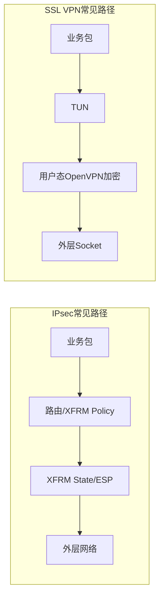

> 本文给出性能升级的判断顺序，不预设产品必须使用 DPDK、AF_XDP、DCO或某种硬件。路线选择只能来自目标平台上的可复现数据。

## 1. 先区分四类性能问题

| 问题 | 典型指标 | 可能瓶颈 |
| --- | --- | --- |
| 建链慢 | 每秒建链数、握手P99 | 证书验证、签名、PQC大报文、状态机、锁 |
| 吞吐低 | Gbit/s、CPU/bit | 对称密码、拷贝、单线程、内核路径、设备调用 |
| 小包能力低 | PPS、cycles/packet | 系统调用、队列、中断、每包查表、DMA固定开销 |
| 规模或稳定性差 | 并发隧道、内存、重协商成功率 | SA表、定时器、锁、内存生命周期、设备会话 |

只测一条大包单连接吞吐，无法代表商用网关性能。

## 2. 两类VPN的数据面不能混为一谈



IPsec 可能主要受 XFRM、Linux Crypto API、Netfilter和硬件卸载影响；SSL VPN 传统路径还要考虑 TUN、用户态事件循环、系统调用和数据通道线程。若使用 DCO 或自研内核模块，边界又会变化。

## 3. 性能工程的正确顺序

### 3.1 建立可复现基线

固定硬件、CPU频率、电源模式、NUMA、网卡和驱动、MTU、算法、包长、方向、隧道数、并发、测试时长与流量模型。保存：

- 吞吐、PPS、平均/P95/P99、丢包和抖动；
- 每核CPU、软中断、上下文切换、内存和队列；
- 建链、rekey、断线恢复和长稳结果；
- 原始命令、日志、配置、版本Hash和数据文件。

### 3.2 用Profiling缩小范围

依次判断：

```text
网卡/队列/软中断
→ 路由、Netfilter、conntrack、XFRM或TUN
→ 用户态事件循环、锁、内存和拷贝
→ 密码算法或密码设备调用
→ SA/Policy查找与业务策略
```

工具可以帮助采样，但最终结论必须落到线程、函数、队列、调用次数或等待时间。

### 3.3 从低成本到高成本优化

| 阶段 | 典型手段 | 何时进入下一阶段 |
| --- | --- | --- |
| 普通Linux | IRQ/队列/CPU亲和、MTU、路由与Netfilter精简 | 已排除错误配置且仍不达目标 |
| 程序实现 | 批处理、减少拷贝/分配/锁、并行事件循环 | Profiling证明热点在程序路径 |
| 密码实现 | 向量化、批量、异步、密码卡/QAT | 密码计算或设备等待占主要成本 |
| 内核/卸载 | XFRM offload、OpenVPN DCO、NIC crypto | 用户态往返或内核软件密码成瓶颈 |
| 渐进快路径 | XDP/AF_XDP | 需要保留部分Linux协作且包路径仍受限 |
| 专用数据面 | DPDK/VPP、SmartNIC/DPU/ASIC | 有明确高PPS目标且团队能承担复杂度 |

## 4. DPDK不是默认答案

DPDK通过用户态轮询、批量处理、大页、内存池、多队列和CPU绑定降低通用内核逐包开销，也能通过 Cryptodev/`rte_security` 对接密码能力。但它不会自动提供：

- IKE/TLS控制面和身份认证；
- 动态SA生命周期与rekey；
- 完整防火墙、NAT、HA、管理和审计；
- 国密/PQC算法和目标密码卡驱动；
- 与Linux慢路径、控制面和诊断工具的工程整合。

DPDK官方 `ipsec-secgw` 是数据面示例，适合研究SP/SA、查表和Cryptodev，不应直接等同于商用安全网关。

进入DPDK评估前至少满足：有量化目标、现有路径基线、热点证据、较低成本路线已评估、控制面到数据面的SA同步设计清楚、目标平台驱动和运维能力可承担。

## 5. 密码卡加速为什么可能没有效果

一次密码运算很快，不代表完整VPN快。对小包逐个同步提交硬件时，PCIe/DMA、锁、队列和上下文切换的固定成本可能超过加密本身。

需要共同考虑：

- 批量大小与等待延迟；
- 同步还是异步；
- 每核队列与NUMA位置；
- 会话和密钥句柄能否复用；
- 数据拷贝次数与DMA映射；
- 设备满载、超时和回退策略；
- 控制面私钥操作与数据面高频操作是否分离。

## 6. 任何优化都不能破坏的边界

- Nonce/IV不得重复，序列号和防重放窗口必须正确；
- rekey、并发和双向密钥不能错配；
- 异步完成顺序不能破坏报文顺序和生命周期；
- 设备失败不得绕过认证、完整性或明确的失败策略；
- 快路径必须与策略、路由、NAT、审计和慢路径一致；
- 优化后必须跑功能、负面、互通、稳定性和性能回归。

## 7. 能证明价值的性能成果

好的成果表达不是“接入了DPDK”，而是：

> 在固定硬件、算法、包长和隧道规模下，通过Profiling确认瓶颈位于某线程/函数/队列；采用某项改动后，吞吐、PPS或P99改善多少，CPU/bit下降多少；同时功能、rekey、异常和长稳回归均通过，剩余瓶颈是什么。

这种结果才能支持产品选择，也能区分架构判断与技术名词堆砌。

## 参考资料

- [DPDK：Cryptography Device Library](https://doc.dpdk.org/guides/prog_guide/cryptodev_lib.html)
- [DPDK：IPsec Security Gateway Sample Application](https://doc.dpdk.org/guides/sample_app_ug/ipsec_secgw.html)
- [Linux Kernel Documentation：XFRM Device Offload](https://docs.kernel.org/networking/xfrm_device.html)
