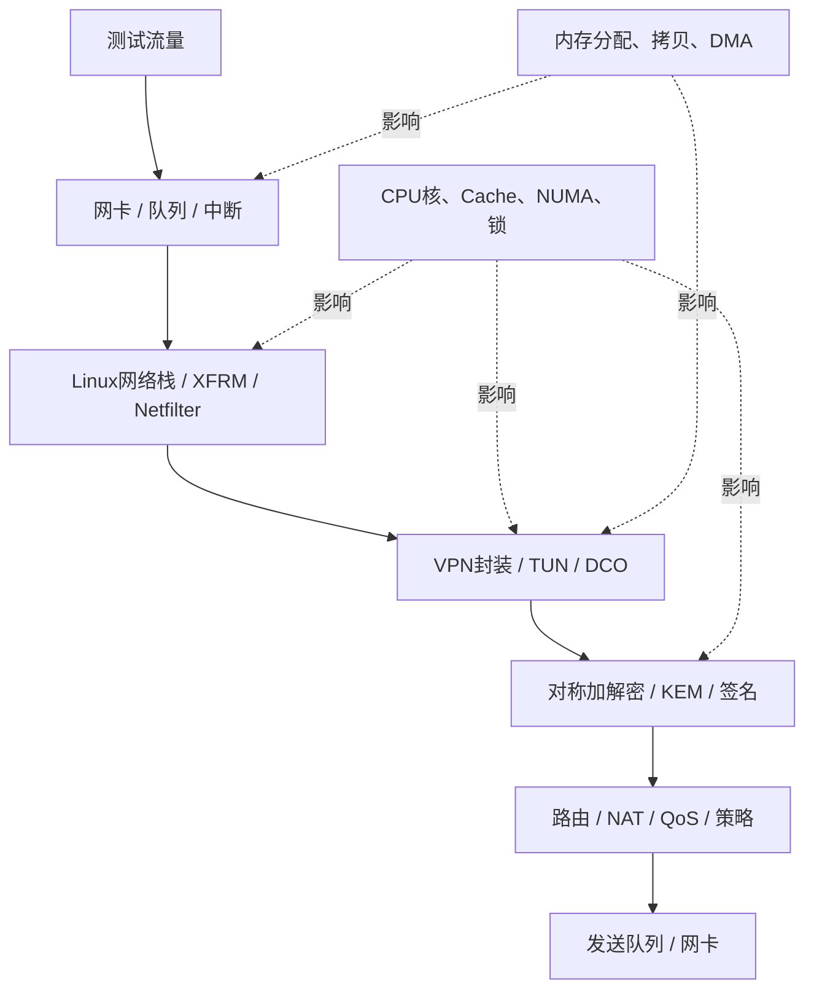
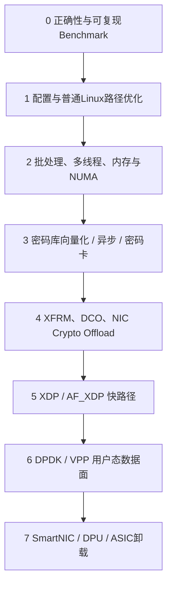
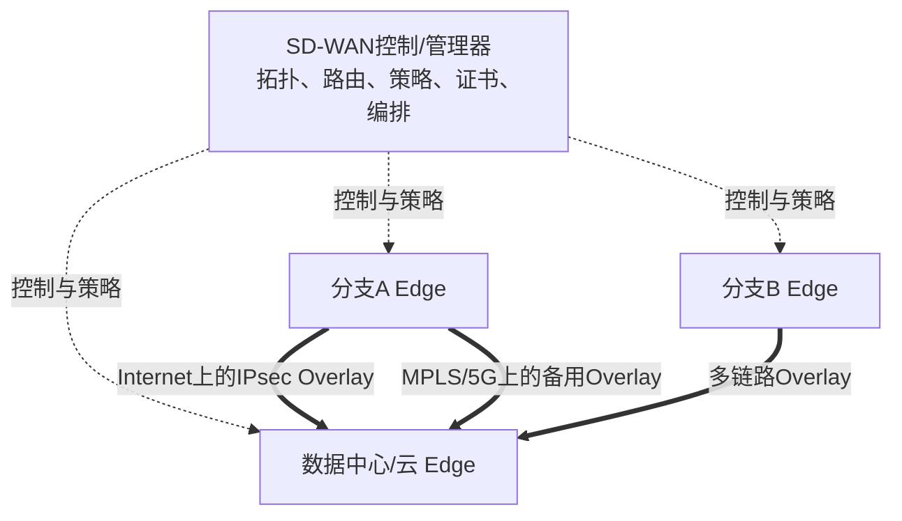
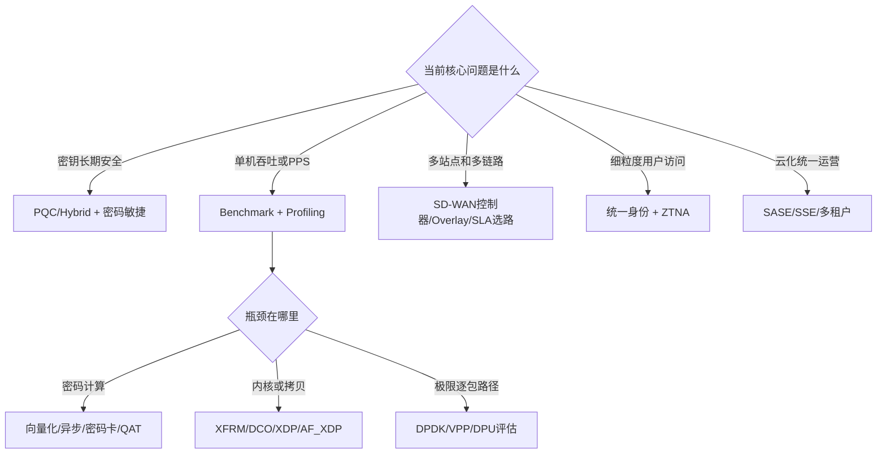

> 本文回答三个问题：综合安全 VPN 网关接下来还能演进什么；DPDK、硬件卸载、SD-WAN、SASE 等技术分别解决什么问题；截至 2026-09-27，公开可核实的业界产品大致做到哪一步。本文是路线研究，不代表公司已经决定采用这些技术，也不代表厂商宣称的能力已经过我们的独立测试。

## 1. 结论先行：未来不是“不断加名词”

一个有竞争力的后量子综合安全网关，需要依次解决五类问题：


对应关系是：

| 技术方向 | 主要解决什么 | 不能替代什么 |
| --- | --- | --- |
| 密码敏捷/PQC | 算法迁移、抗量子密钥建立、降低密码替换成本 | 不能自动提高数据面吞吐 |
| Profiling与Linux优化 | 找到真实瓶颈，改善现有路径 | 不能替代协议正确性和测试 |
| DCO/XFRM/硬件卸载 | 减少用户态切换或把加解密交给内核/设备 | 不能自动提供完整控制面 |
| AF_XDP/DPDK/VPP | 降低通用内核逐包开销，构建高速可控数据面 | 不是现成的 VPN/防火墙/SD-WAN产品 |
| SD-WAN | 多站点编排、Overlay、链路测量和应用选路 | 不是“提高单机密码算法速度” |
| 零信任/ZTNA | 从“进了内网”转向按身份和资源授权 | 不是另一种数据面加速方式 |
| SASE/SSE | 将广域网连接和安全能力云服务化、统一运营 | 不能靠一台本地设备独立完成 |
| HA/可观测/自动化 | 保障持续运行、定位和规模化维护 | 不是附属功能，而是产品化基础 |

正确的路线不是“先上 DPDK，再做 SD-WAN”，而是先确认产品问题，再选择能解决该问题的技术。

## 2. 先确定产品底座：接管能力比新功能更优先

在采购源码到达后，第一阶段目标应是让团队真正拥有产品：

- 固定源码版本、依赖、补丁和许可证；
- 能离线构建、安装、升级和回滚；
- 画出进程、线程、IPC、配置和数据包真实路径；
- 将 Web/API 配置追踪到 VPN 进程、内核和硬件；
- 建立功能、互通、负面、HA、性能和安全回归；
- 让日志、PCAP、系统状态和版本 Hash 能共同证明结果。

如果底座不清楚，直接增加 DPDK、PQC 或 SD-WAN 会扩大不可控范围。新技术的每条执行路径都需要落回同一闭环：

```text
需求
→ 配置和策略
→ 源码模块/函数
→ 构建产物
→ 运行进程与实际库
→ 控制面状态
→ 数据面真实流量
→ 正向/负面/性能回归
```

## 3. 性能优化：先定位瓶颈，再选择技术

### 3.1 “VPN慢”可能慢在完全不同的位置



同样是“吞吐不够”，根因可能是：

- 单线程状态机或用户态事件循环；
- 小包 PPS 过高；
- 用户态/内核态反复拷贝；
- TUN 每包读写与系统调用；
- XFRM、Netfilter、conntrack 或 NAT；
- 密码算法实现、每包设备调用或 DMA 开销；
- 锁竞争、内存申请、Cache Miss、NUMA 跨节点访问；
- MTU、分片、重传、队列丢包；
- 网卡队列、软中断、IRQ 亲和或调度；
- 连接建立、证书验证、PQC 大报文导致的控制面压力。

### 3.2 性能工作必须从基线开始

至少建立四类指标：

| 维度 | 指标 | 为什么不能只看一个数 |
| --- | --- | --- |
| 数据面能力 | Gbit/s、PPS、包长分布 | 大包吞吐高不代表小包转发能力强 |
| 体验 | 平均/P95/P99延迟、抖动、丢包 | 平均值会掩盖尾延迟和周期性停顿 |
| 控制面 | 每秒建链数、并发隧道、重协商成功率 | 稳态吞吐不能代表建链风暴承载力 |
| 资源 | 每核利用率、Cycles/packet、内存、Cache Miss | 才能判断瓶颈和容量成本 |

基线应固定：硬件、BIOS、电源模式、CPU绑定、NUMA、网卡、驱动、MTU、算法、隧道数、包长、方向、并发和测试时长。否则优化前后数字不可比较。

### 3.3 推荐的优化阶梯



不是每个产品都要走到第 7 层。某一层达到目标后，继续向下会增加开发、驱动、硬件绑定、运维和故障诊断成本。

## 4. DPDK到底解决什么问题

### 4.1 它的价值

**DPDK（Data Plane Development Kit）**提供用户态高速包处理框架。典型思想包括：

- 用户态轮询网卡队列，减少中断和通用内核路径开销；
- 大页内存、内存池和 `mbuf` 降低动态分配成本；
- 多队列与 CPU 核绑定提高并行性；
- 批量收发包提高每次函数调用的有效工作量；
- `cryptodev`、`rte_security` 对接软件或硬件密码设备；
- 可构建 ACL、路由、QoS、IPsec 和自定义流水线。


### 4.2 它不是什么

DPDK 官方 `ipsec-secgw` 是学习数据面和 Cryptodev 的示例，不是可直接交付的完整 VPN 产品。产品仍需要：

- IKE/TLS 等控制协议和身份认证；
- 配置、升级、HA、审计和告警；
- 完整的防火墙、NAT、路由和异常路径；
- 动态 SA 生命周期、rekey、并发与故障恢复；
- 驱动、硬件兼容、NUMA调优和长期维护；
- 与普通 Linux 管理面、慢路径和诊断工具协作。

### 4.3 什么时候值得用

只有同时满足以下条件，DPDK 才应进入正式方案评估：

1. 已有可复现的性能目标和现有路径基线；
2. Profiling 证明瓶颈主要在逐包数据路径，而不是业务逻辑、密码卡调用方式或错误配置；
3. XFRM、DCO、批处理、CPU/队列调优仍无法达到目标；
4. 团队能承担独占/绑定网卡、HugePage、CPU核、NUMA和驱动运维；
5. 控制面与高速数据面的 SA/Policy 同步接口已经设计清楚；
6. 对国密算法、密码卡和目标国产平台有可用 PMD/适配方案。

如果目标只是中等带宽、通用硬件和快速交付，优化 Linux XFRM、DCO 或硬件 Crypto Offload 往往更经济。

## 5. XFRM、DCO、AF_XDP、DPDK和硬件卸载怎样选择

| 路线 | 主要优势 | 主要代价 | 更适合的场景 |
| --- | --- | --- | --- |
| Linux XFRM | 成熟内核 IPsec、路由/Netfilter生态完整 | 通用路径开销，定制国密/硬件支持需核对 | 标准 IPsec 网关的首选基线 |
| OpenVPN DCO | 将 OpenVPN 数据通道下沉内核，保留用户态控制面 | 算法和平台支持受模块能力约束 | SSL VPN 用户态数据面成为瓶颈时 |
| XDP/eBPF | 在内核早期快速过滤、统计、重定向 | 复杂状态与密码处理受模型限制 | DDoS前置过滤、可观测、简单快路径 |
| AF_XDP | 用户态高速收发，同时保留部分内核协作 | 队列、内存和程序模型更复杂 | 需要渐进式用户态快路径时 |
| DPDK/VPP | 完整用户态高速流水线、批处理和设备生态 | 开发运维成本高，与内核网络工具分离 | 高 PPS、强定制、专用设备 |
| QAT/密码卡 | 卸载密码计算，保留现有包路径的可能性较大 | 小包/单次调用开销、驱动、DMA和会话管理 | Profiling证明密码计算是瓶颈时 |
| SmartNIC/DPU/ASIC | 进一步卸载包处理和IPsec，节省主机CPU | 硬件绑定、功能边界和排障复杂 | 高端设备、云边缘、大规模虚拟化 |

一个关键原则：**算法核快，不等于 VPN 快**。如果每个 64 字节包都同步调用一次密码卡，PCIe、DMA、锁和上下文切换可能比加密本身更贵；需要批处理、异步队列和并发会话共同设计。

## 6. SD-WAN解决的不是“单条隧道不够快”

传统站点 VPN 主要回答“两个端点如何安全通信”。SD-WAN 还要回答：

- 数百/数千站点怎样自动上线和建立拓扑；
- Internet、MPLS、专线、5G 多条 Underlay 怎样统一使用；
- 哪条路径当前丢包、延迟、抖动更合适；
- 语音、视频、办公、备份分别走哪条链路；
- 如何集中分发路由、分段、QoS 和安全策略；
- 链路“没有断但质量变差”时如何检测并切换；
- 云应用和分支怎样就近接入，而不全部绕回总部。



### 6.1 一个完整SD-WAN至少需要什么

| 能力 | 解决的问题 |
| --- | --- |
| ZTP/设备身份 | 新站点如何安全、批量上线 |
| Overlay与拓扑编排 | Hub-Spoke、Full Mesh如何自动建立 |
| 路由与分段 | 不同租户、部门和业务如何隔离 |
| 链路探测 | 持续测量时延、丢包、抖动和可达性 |
| 应用识别 | 不只按IP，还按业务选择路径和策略 |
| SLA选路与故障恢复 | Brownout或硬故障时自动切换 |
| 集中策略 | 避免逐台设备手工维护 |
| 可观测与分析 | 看见站点、路径、应用和体验问题 |
| 安全融合 | 防火墙、VPN、ZTNA、IPS等与选路协同 |

因此 SD-WAN 应建立在已经可靠的 VPN、路由、防火墙、身份、管理和可观测能力之上，而不是替代它们。

## 7. 继续向零信任、SASE和云演进

### 7.1 零信任与ZTNA

传统 VPN 常在认证后给用户一个较大的网络访问面。ZTNA 更关注“某个身份和设备是否能访问某个应用”，并可结合设备状态和持续评估缩小权限。

适合综合网关的演进顺序：

```text
统一身份与证书
→ 统一资源和访问策略
→ VPN与ZTNA共享认证/审计
→ 按应用而非只按网段授权
→ 持续评估与会话撤销
```

### 7.2 SASE/SSE

- **SSE**侧重云交付安全服务，如安全 Web 网关、CASB、ZTNA、FWaaS 等；
- **SASE**把 SD-WAN 的连接能力与 SSE 安全能力组合起来，强调分布式边缘和统一策略；
- 对本地硬件厂商而言，更现实的路线可能是先做好 Edge、统一策略/API和可观测，再逐步提供集中控制器、虚拟化实例和云节点。

### 7.3 多租户与服务化

走向托管服务或云平台时，需要补齐：

- 租户级配置、路由、日志、密钥和资源隔离；
- API版本、配额、计费、审计和操作授权；
- 灰度升级、配置迁移、容灾和跨区域部署；
- 控制器与边缘断连时的自治策略；
- 供应链、SBOM、签名升级和漏洞响应。

这些往往比新增一个协议字段更决定产品能否规模化运营。

## 8. 业界公开进展：已经做到哪一步

下表只记录厂商官方公开材料能够支持的结论。“产品支持”不等于我们已经验证互通、性能、认证或全部硬件型号。

| 厂商/项目 | 公开做到的阶段 | 对我们的启示 | 仍需谨慎 |
| --- | --- | --- | --- |
| Cisco | Cisco 8000 系列安全路由器文档已经给出 IKEv2 Hybrid ML-KEM 配置、强制/可选策略和 SA 验证；Catalyst SD-WAN 已有集中控制、IPsec Overlay、分段、BFD与应用SLA选路 | PQC不是孤立算法，而是进入 IKE Proposal、Child SA rekey、运行命令和 SD-WAN Edge | 型号、软件版本、互通对象和发布状态必须逐项核对 |
| Palo Alto Networks | Prisma SD-WAN ION 6.8.1+ 文档支持 RFC 8784 PPK、RFC 9370/9242 Additional KE 和 ML-KEM；PAN-OS/Prisma SD-WAN 已将 NGFW、Overlay和应用选路产品化 | 展示了“VPN + PQC + SD-WAN策略”的一体化方向 | 官方文档同时指出特定版本FIPS状态、降级限制和两端能力一致要求 |
| Fortinet | FortiOS 7.6.1 文档提供 IKEv2 Hybrid PQC Key Exchange；7.6.5 文档进一步覆盖 Agentless/SSL VPN 的纯PQC与Hybrid TLS组，并公开 ML-DSA/SLH-DSA 认证方向；FortiGate长期使用专用ASIC加速安全与SD-WAN | 覆盖了 IPsec、TLS、签名、硬件加速和 SD-WAN 的多层演进样本 | 一些算法仍非最终标准；不同平台、FIPS模式和硬件卸载支持不同 |
| Cloudflare | 2022年起在TLS部署Hybrid PQC；2026年官方宣布Hybrid ML-KEM IPsec正式可用，并公布与Cisco、Fortinet分支连接器互通 | 说明TLS已进入大规模生产，IPsec正在从标准与试验走向多厂商互通 | 云服务路径与本地网关产品的管理、硬件和合规要求不同 |
| Google/Chrome/BoringSSL | Chrome桌面端曾全量启用Hybrid Kyber，随后随FIPS 203迁移到 `X25519MLKEM768`，并在BoringSSL实现ML-KEM | 展示了密码敏捷的真实成本：算法标准化后，代码点、实现和生态必须迁移 | 浏览器TLS部署不等于VPN网关、证书和IPsec均已PQC化 |
| NVIDIA BlueField | 官方BSP说明以 strongSwan 分支和 DOCA 插件配合 IPsec Packet Offload，并可与OVS卸载协作 | 控制面保留成熟协议栈、数据面交给DPU是可行架构之一 | 是特定硬件/软件栈；PQC、国密与目标平台能力仍要另行验证 |
| DPDK | `ipsec-secgw` 示例展示多核队列、ACL/SP/SA、Cryptodev、Inline/Lookaside Offload和NAT-T等数据面机制 | 是学习和验证高速IPsec数据面的好参照 | 示例不等于包含完整IKE、管理、HA、审计的商用网关 |

### 8.1 可以从行业现状得出的判断

1. **PQC密钥建立已经从库级实验进入TLS大规模部署和IPsec产品化早期阶段**；
2. **Hybrid是主流过渡方式**，纯PQC并不是默认唯一答案；
3. **IPsec具体ML-KEM互通比TLS晚**，必须固定标准草案/正式版本、算法ID和产品版本；
4. **领先安全厂商的竞争点不是单一VPN**，而是 VPN、NGFW、SD-WAN、ZTNA、云管理、ASIC/硬件加速共同形成系统；
5. **性能路线并不只有DPDK**，厂商广泛使用内核、专用ASIC、DPU、Crypto Offload或自研数据面；
6. **合规状态和功能状态不同**：算法已实现，不代表密码模块已经完成对应认证。

## 10. 决策树：遇到需求时先问什么



## 12. 自测题

1. 为什么 DPDK 不应该是性能优化的第一步？
2. 密码卡单次 SM4 运算很快，为什么 VPN 吞吐仍可能很低？
3. SD-WAN 相比手工配置多条 IPsec 隧道，多了哪四类关键能力？
4. XFRM、DCO、AF_XDP 和 DPDK 分别适合哪一层问题？
5. 为什么厂商官方宣布“支持PQC”后仍要检查版本、互通、认证和回退？
6. 对采购源码而言，为什么构建/发布/回归能力优先于立即增加新技术？

## 参考资料

### PQC与厂商产品

- [Cisco：Post-Quantum Cryptography on Cisco 8000 Series Secure Routers for IKEv2](https://www.cisco.com/c/en/us/td/docs/routers/ios-xe/security-vpn/security-vpn/m-pqc-ikev2.html)
- [Palo Alto Networks：Post-Quantum Cryptography for Prisma SD-WAN](https://docs.paloaltonetworks.com/prisma-sd-wan/administration/prisma-sd-wan-sites-and-devices/prisma-sd-wan-ports-and-interfaces/post-quantum-cryptography-overview)
- [Fortinet：PQC for IPsec Key Exchange in FortiOS 7.6.1](https://docs.fortinet.com/document/fortigate/7.6.0/new-features/229631/enhancing-security-with-post-quantum-cryptography-for-ipsec-key-exchange-7-6-1)
- [Fortinet：PQC for Agentless VPN in FortiOS 7.6.5](https://docs.fortinet.com/document/fortigate/7.6.0/new-features/043632/post-quantum-cryptography-for-agentless-vpn-7-6-5)
- [Cloudflare：Post-quantum encryption for IPsec is generally available](https://blog.cloudflare.com/post-quantum-ipsec/)
- [Google：A new path for Kyber/ML-KEM on the web](https://security.googleblog.com/2024/09/a-new-path-for-kyber-on-web.html)

### 数据面与性能

- [DPDK 24.07：IPsec Security Gateway Sample Application](https://doc.dpdk.org/guides-24.07/sample_app_ug/ipsec_secgw.html)
- [NVIDIA BlueField DPU BSP：strongSwan/DOCA与IPsec Packet Offload](https://docs.nvidia.com/nvidia-bluefield-dpu-bsp-v4-7-0-documentation.pdf)
- [Intel QAT Programmer's Guide](https://cdrdv2-public.intel.com/843378/743912-qat-programmers-guide-rev007.pdf)

### SD-WAN

- [Cisco Catalyst SD-WAN Solution Overview](https://www.cisco.com/c/en/us/td/docs/routers/sdwan/26x-later/solution/cisco-catalyst-sd-wan-solution-overview/solution.html)
- [Cisco Catalyst SD-WAN Application-Aware Routing](https://www.cisco.com/c/en/us/td/docs/routers/sdwan/26x-later/policies/policies-configuration-guide/AAR/app-aware-routing.html)
- [Fortinet Secure SD-WAN](https://www.fortinet.com/products/sd-wan)
- [Palo Alto Networks：About SD-WAN](https://docs.paloaltonetworks.com/sd-wan/getting-started/about-sd-wan)
