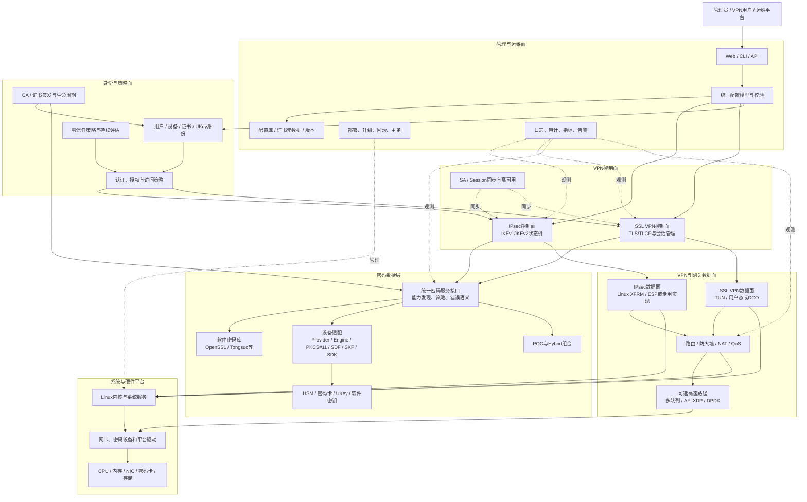
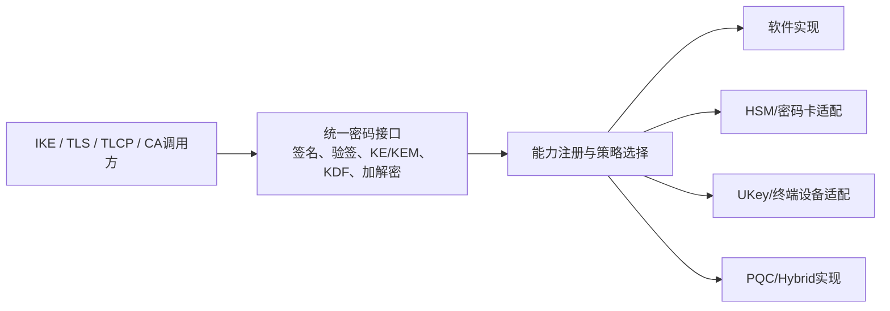
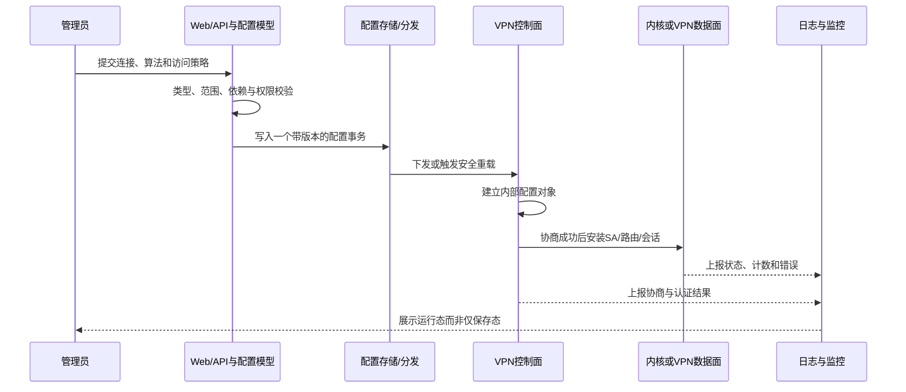

> 本文选取通用职责划分与候选接口设计，不描述任何已采用的产品架构。

## 1. 结论先行

这类产品不能只理解成“IPsec、SSL VPN、零信任和证书服务装在同一台设备上”。真正需要形成的是一套分层且可替换的安全网关：

```text
统一管理与配置
→ 统一身份和访问策略
→ IPsec / SSL VPN 等安全接入协议
→ 统一密码能力与密钥边界
→ Linux或专用高速数据面
→ 可观测、可升级、可回归验证
```

其中最重要的架构原则是：

1. 协议逻辑不直接绑定某一家密码卡 SDK；
2. 控制面协商成功与数据面真实保护必须分别验证；
3. 传统算法、国密算法和 PQC 能力通过统一接口注册和选择；
4. 管理配置必须能追踪到运行进程、内核状态和真实报文；
5. 性能优化必须建立在测量结果上，不能预先把 DPDK 当作必选项。

## 3. 一张图看懂整体架构



这张图表达的是职责边界，而不是进程数量。供应商可能把多个职责做在同一进程，也可能拆成多个服务；源码到货后必须再绘制“实际进程图”。

## 4. 六个层次分别解决什么问题

### 4.1 管理与运维面

它负责把人的意图变成稳定、可审计的系统状态。

| 模块 | 输入 | 输出 | 接管时重点 |
| --- | --- | --- | --- |
| Web / CLI / API | 管理员操作、自动化请求 | 结构化配置请求 | 权限控制、接口版本、参数校验 |
| 配置模型 | 地址、算法、身份、策略 | 统一内部模型 | 同一含义不能在多个模块重复解释 |
| 配置存储 | 已校验配置 | 持久化版本 | 事务、备份、迁移、敏感字段保护 |
| 生命周期 | 软件包、镜像、配置版本 | 部署或回滚结果 | 离线构建、升级兼容、失败回滚 |
| 可观测 | 各层事件与计数 | 日志、审计、指标、告警 | 能否从业务故障定位到协议和数据面 |

关键判断：Web 页面显示“保存成功”只说明配置入口接受了请求，不说明 VPN 进程已加载，更不说明真实流量已加密。

### 4.2 身份与策略面

它回答三个问题：谁在连接、允许访问什么、凭什么相信这个身份。

- 用户身份：账号、证书、UKey、MFA等；
- 设备身份：设备证书、终端状态和设备标识；
- 访问策略：源、目标、服务、时间和安全条件；
- 证书生命周期：签发、更新、吊销、信任链；
- 零信任：不是另一条隧道，而是在身份与策略层持续作出访问判断。

【待源码确认】目标产品产品的零信任、证书服务器与两类 VPN 是否共享身份库和策略模型，还是四套相互独立的系统。

### 4.3 VPN控制面

控制面负责协商“怎样保护通信”，但通常不直接搬运全部业务流量。

IPsec 路线的候选实现：

```text
配置
→ IKE状态机
→ 身份认证与密钥交换
→ IKE_SA / CHILD_SA
→ 将ESP算法、SPI、密钥、流量选择器交给数据面
```

SSL VPN 路线的候选实现：

```text
配置
→ TLS或TLCP握手
→ 身份认证与会话密钥
→ VPN会话与数据通道密钥
→ TUN/DCO承载业务IP包
```

【上游参照】strongSwan 常用 `charon` 承担 IKE 控制面；OpenVPN 将 TLS 控制通道和 VPN 数据通道都组织在用户态程序中。产品的真实实现必须以交付源码和运行进程为准。

### 4.4 密码敏捷层

密码敏捷不是“支持很多算法”的列表，而是能在不重写业务协议的前提下替换算法实现、密钥载体和密码设备。



必须守住的边界：

- 厂商 SDK 不应散落在 IKE、SSL VPN、零信任和证书服务主体代码中；
- 私钥操作与大流量对称加解密必须分开描述；
- HSM 完成一次 SM2 签名，不代表 ESP 或 SSL VPN 数据流量经过密码卡；
- 设备失败时是否回退到软件、能否回退、如何告警，必须由安全策略明确规定；
- PQC Hybrid 的组合方式、密钥派生和降级策略属于协议安全设计，不能只由插件加载决定。

### 4.5 数据面

数据面回答的是“每一个业务包最终怎样走”。

IPsec 的典型 Linux 路径：


SSL VPN 的典型路径：


【待源码确认】产品 IPsec 是 Linux XFRM、用户态 ESP 还是专用硬件路径；SSL VPN 是用户态、DCO 还是自研内核模块。这些差异决定构建、排障和性能优化方法。

### 4.6 系统与硬件平台

这一层包含：

- Linux内核、网络栈、Netfilter、XFRM、TUN/TAP；
- 网卡和密码设备驱动；
- 国产 CPU/操作系统的 ABI、指令集和交叉编译工具链；
- 启动、服务管理、文件系统、升级和安全加固；
- 物理密码卡、HSM、UKey及其密钥边界。

OpenWrt 是面向嵌入式网络设备的 Linux 发行版和构建体系，可作为一种平台方案，但不是“国密 VPN 必须使用的协议组件”。是否采用要看供应商底座、硬件资源、产品管理模型和后续维护成本。

## 5. 一条配置怎样真正生效

以下是目标闭环，而不是特定产品已经确认的调用链：



一个配置项至少有五种不同状态：

```text
文本已填写
≠ 语法已解析
≠ 语义校验通过
≠ 运行进程已采用
≠ 真实业务流量经过该路径
```

因此后续产品验证必须建立：

`需求 → 配置字段 → 内部对象 → 运行进程 → 内核/数据面状态 → 原始报文与负面测试`。

## 6. VPN与密码能力怎样协作

### 6.1 IPsec建链与数据传输

```mermaid
sequenceDiagram
    participant L as 本端IKE
    participant LC as 本端密码能力
    participant R as 对端IKE
    participant K as Linux/专用ESP数据面
    participant B as 业务流量

    L->>R: IKE协商算法、Nonce和密钥交换材料
    L->>LC: 密钥交换、签名/验签、KDF
    LC-->>L: 共享秘密或密码运算结果
    L<->>R: 身份认证并建立IKE_SA
    L<->>R: 协商CHILD_SA、SPI和流量选择器
    L->>K: 下发双向算法、密钥、SPI、Policy
    B->>K: 明文IP包命中策略
    K-->>B: 以ESP保护后发出
```

设计审查必须分开回答：

1. IKE 控制面使用了什么算法和认证方式？
2. CHILD_SA 最终选择了什么 ESP 算法？
3. 谁将 SA 安装到数据面？
4. 软件库、内核或密码卡中的哪一个实现真正处理了业务包？

### 6.2 SSL VPN建链与数据传输

```mermaid
sequenceDiagram
    participant C as 客户端
    participant G as SSL VPN控制面
    participant P as 密码能力
    participant T as TUN/DCO数据面
    participant N as 内网

    C<->>G: TLS或TLCP握手与身份认证
    G->>P: 签名、验签、KE/KDF等运算
    P-->>G: 密码运算结果
    C<->>G: 建立VPN控制通道并协商数据通道参数
    C->>T: 业务IP包进入虚拟网卡
    T->>T: 使用数据通道密钥加密/封装
    T->>N: 网关解封装后路由、过滤或NAT
```

控制通道使用 TLCP 或 SM 算法，仍不能自动证明数据通道使用 SM4。两条通道必须分别找到算法协商、密钥来源和运行证据。

## 7. 建议的源码模块布局

下列目录是便于接管和重构的**目标布局模板**，不是目标产品产品的实际目录：

```text
gateway/
├── management/          # Web、CLI、API、升级和运维
├── config-model/        # 统一配置模型、校验、迁移和持久化
├── identity-policy/     # 用户、设备、证书、授权和零信任策略
├── vpn/
│   ├── ipsec/           # IKE控制面与IPsec产品适配
│   └── ssl/             # TLS/TLCP控制面与SSL VPN会话
├── crypto/
│   ├── api/             # 稳定的业务侧密码接口
│   ├── registry/        # 能力注册、选择和策略
│   ├── software/        # 软件密码库适配
│   ├── hsm/             # SDF/PKCS#11/厂商SDK适配
│   └── pqc/             # PQC与Hybrid组合实现
├── dataplane/
│   ├── xfrm/            # XFRM/ESP控制与观测
│   ├── tun/             # SSL VPN虚拟网卡路径
│   └── fastpath/        # 测量后才启用的高速路径
├── platform/            # 操作系统、驱动、板卡和硬件抽象
├── observability/       # 日志、审计、指标和诊断包
├── tests/               # 单元、互通、负面、性能和回归测试
├── packaging/           # 构建、安装、升级、镜像与SBOM
└── docs/                # 架构、接口、构建、测试和运维文档
```

源码到货后不要立即搬目录。先建立“供应商实际目录 → 上述职责域”的映射，再决定是否重构。贸然重排目录会扩大补丁、构建和升级风险。

## 8. 模块接口需要明确到什么程度

| 边界 | 最少应说明的输入 | 最少应说明的输出 | 关键失败语义 |
| --- | --- | --- | --- |
| 管理面 → VPN | 连接、身份、算法、TS、生命周期 | 配置版本和加载结果 | 保存失败、校验失败、加载失败必须区分 |
| VPN → 密码层 | 算法ID、密钥句柄、待签名/加密数据 | 运算结果或明确错误 | 不允许无日志静默回退 |
| VPN → 数据面 | SPI、方向、算法、密钥、TS、生命周期 | 已安装的SA/Policy标识 | 内核不支持算法时必须建链失败或明确受限 |
| 身份策略 → VPN | 身份、认证结果、授权范围 | 允许/拒绝及策略版本 | 认证成功不等于拥有任意网络访问权 |
| 数据面 → 观测 | 包数、字节数、丢包、错误、CPU | 可关联到隧道/用户的指标 | 不能只有全局统计，无法定位单隧道问题 |
| 高可用 → 会话状态 | SA/Session必要状态 | 对端可恢复的同步结果 | 私钥和瞬时密钥的复制边界必须审查 |

## 9. PQC应该接在哪里

PQC 不应作为孤立的“算法演示按钮”，而应沿协议真实链路接入：

```text
能力注册
→ Proposal/扩展协商
→ 传统KE与PQC KEM各自产生秘密
→ 按明确规则组合秘密
→ 进入既有KDF和SA/会话密钥生命周期
→ 处理不支持、失败、重传、重协商和降级
→ 互通、负面和性能验证
```

【目标设计】优先把传统算法、国密与 PQC 共用的能力发现、密钥句柄、错误处理和测试接口抽象稳定，再实现具体 Hybrid 方案。

【待决策】具体采用哪个标准草案/正式标准、Transform/Extension 标识、组合 KDF、证书体系和兼容策略，必须由标准、互通对象和产品需求共同决定。

## 10. 产品源码到货后的第一轮架构核对

| 编号 | 必须回答的问题 | 应取得的原始材料 |
| --- | --- | --- |
| A-01 | IPsec与SSL VPN分别使用什么组件、版本和补丁？ | SBOM、源码commit/压缩包hash、补丁清单 |
| A-02 | 有哪些长期运行进程，进程如何启动和通信？ | 服务文件、启动脚本、进程树、IPC说明 |
| A-03 | Web配置怎样进入VPN和内核？ | API、配置模型、生成文件、重载调用链 |
| A-04 | IKE、TLS/TLCP和数据通道分别在哪里实现？ | 目录、核心对象、入口函数、构建目标 |
| A-05 | 密码库版本是什么，运行时实际加载哪个库？ | 链接信息、运行映射、版本输出、hash |
| A-06 | HSM/密码卡怎样接入，私钥能否离开设备？ | 接口层源码、SDK依赖、密钥生命周期文档 |
| A-07 | ESP和SSL VPN数据面在哪里执行？ | XFRM/TUN/DCO/内核模块或专用数据面证据 |
| A-08 | PQC代码是否已清理，扩展点是否真实存在？ | 搜索结果、依赖、许可证、Dummy扩展示例 |
| A-09 | 如何构建、安装、升级和回滚？ | 离线构建环境、工具链、脚本、产物清单 |
| A-10 | 如何证明功能、安全和性能？ | 测试用例、原始日志、PCAP、监控和benchmark |

## 11. 从“功能可用”到“可以负责”的验证闭环

每项核心能力都按同一条链关闭：


典型“假成功”包括：

- 配置写了 SM4，但协商结果或内核 SA 仍是 AES；
- IKE 建立成功，但 CHILD_SA/XFRM 未安装；
- TLS/TLCP 握手成功，但 SSL VPN 数据通道仍使用另一套算法；
- Provider 或密码卡初始化成功，但关键运算从未进入设备；
- 新二进制构建成功，但运行进程仍加载旧文件；
- 首次连接成功，但 rekey、并发、大包或设备故障时断流。

## 参考基线

- 当前项目边界：[GM-VPN项目首页](GM-VPN%20项目首页.md)
- VPN与密码能力总览：[GM-VPN国密VPN技术总览](GM-VPN%20国密%20VPN%20技术总览.md)
- strongSwan上游基线：6.0.3，commit `472dcd8bb50a91f156b725ff56992352b573f7dd`
- 当前上游源码位置：`/path/to/workspace/learning-sources/strongswan-6.0.3`
