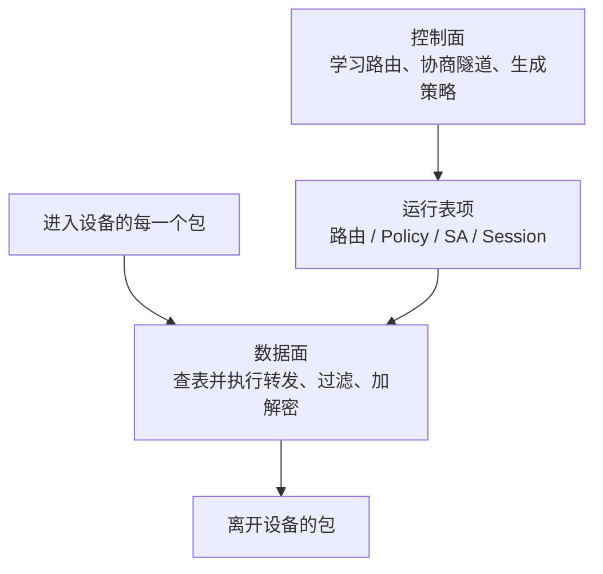
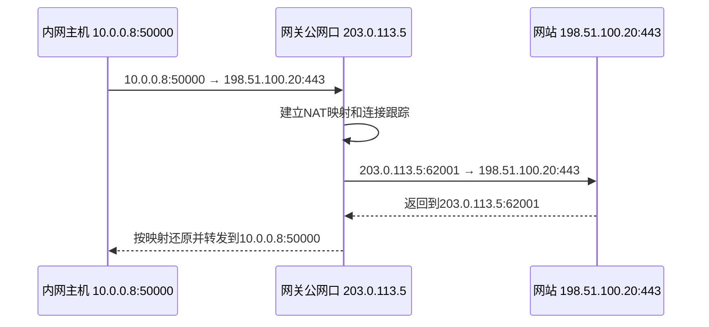
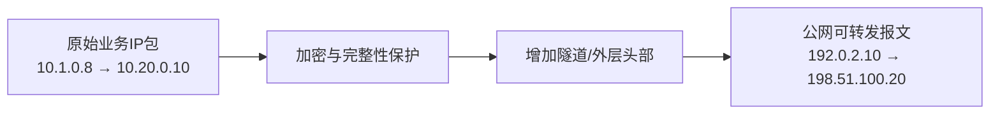
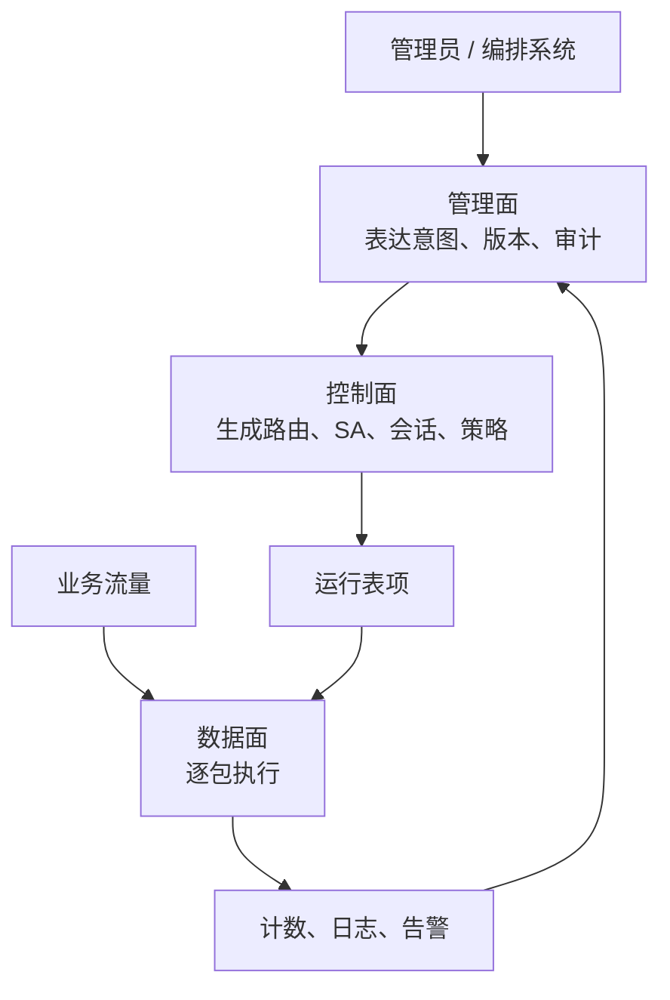
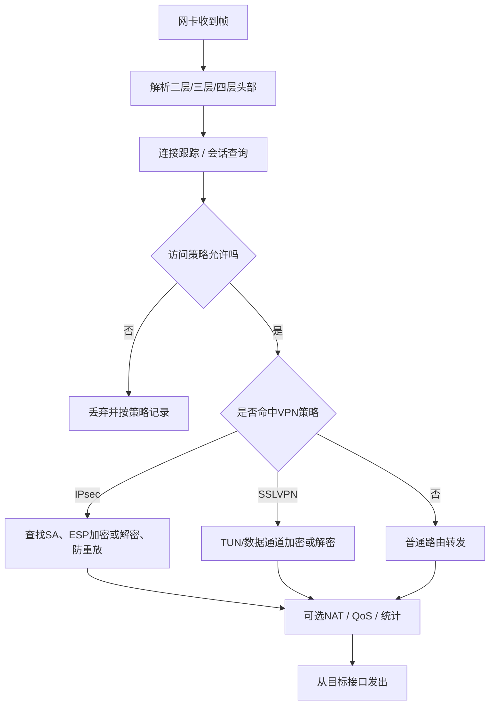

> 本文面向刚进入安全网关领域的研发人员。目标不是背诵定义，而是先建立一张稳定的系统地图：一个数据包从哪里来、经过谁、发生什么变化、最后到哪里去。后续学习 VPN、IPsec、TLS、PQC、DPDK 和 SD-WAN 时，都应把新概念放回这张地图。

## 1. 先看一张总图

假设分支机构中的员工访问总部服务器 `10.20.0.10`，两端通过互联网互联：


这条路径中有三类不同问题：

1. **连通问题**：路由是否知道下一跳，地址是否可达；
2. **安全问题**：谁可以访问什么，报文是否加密、认证、审计；
3. **性能问题**：每秒能处理多少包，延迟多大，CPU、内存、网卡或密码设备是否成为瓶颈。

安全网关不是一个单独协议，而是把这些能力组织成可配置、可观察、可升级的产品。

## 2. 网络最小基础

### 2.1 数据包、帧、连接分别是什么

| 名词 | 人话解释 | 在网关中为什么重要 |
| --- | --- | --- |
| 以太网帧 | 同一二层网络中传输的基本单元，包含源/目的 MAC | 网关收包首先从网卡得到帧；VLAN、桥接工作在这一层 |
| IP 包 | 跨网络传输的基本单元，包含源/目的 IP | 路由、防火墙、IPsec、TUN 都围绕 IP 包工作 |
| TCP 段 | TCP 在 IP 包中的负载，带序号、确认、端口 | 防火墙可跟踪连接状态；TLS 通常运行在 TCP 之上 |
| UDP 数据报 | 无连接、开销较小的传输单元 | IKE、ESP 的 NAT-T、OpenVPN 常使用 UDP |
| 五元组 | 源 IP、目的 IP、源端口、目的端口、协议 | 防火墙、NAT、负载均衡和流量统计常用它识别一条流 |
| 会话/连接 | 系统对一组关联报文保存的运行状态 | 网关需要记录超时、方向、身份、策略、密钥与计数 |

不要把“连接”理解为线上存在一根真实管道。网络中实际传输的是一个个报文；所谓连接，是两端和中间设备保存了足够的状态，从而把这些报文视为同一段通信。

### 2.2 交换、路由和转发

- **交换（Switching）**：主要根据 MAC 地址在同一个二层网络内转发帧。
- **路由（Routing）**：根据目的 IP 和路由表，决定 IP 包下一步从哪个接口、发往哪个下一跳。
- **转发（Forwarding）**：真正对每一个包执行查表、修改头部并发出的动作。
- **控制面**决定“表中应该有什么”，**数据面**按照这些表处理每一个包。



### 2.3 路由器、网关和下一跳

**路由器**是专门在多个 IP 网络之间转发报文的设备或软件。**网关**是更宽泛的角色：它位于不同网络、协议或安全域的交界处，代表一侧访问另一侧。路由器可以是网关，防火墙、VPN 设备、API 网关也都可能承担网关角色。

终端上的“默认网关”通常就是：目的地址没有更精确路由时，把包交给这个下一跳。

正确理解：

```text
网关描述“处在边界并代为处理”的角色
路由器描述“根据IP路由转发”的能力
安全网关描述“在边界执行安全控制”的产品
```

### 2.4 经常出现在配置和排障中的基础词

| 名词 | 最小正确理解 | 看到问题时先检查什么 |
| --- | --- | --- |
| IP地址 | 标识一个网络接口在某个IP网络中的地址 | 地址、掩码、是否冲突、是否属于预期接口 |
| 子网/CIDR | 用前缀长度表示一段地址范围，例如 `10.0.0.0/24` | 两端是否误判为同一网段，路由前缀是否过宽或过窄 |
| MAC地址 | 二层接口标识，只在当前二层传播范围内直接使用 | 邻居表、交换/VLAN、虚拟网卡状态 |
| ARP/NDP | IPv4/IPv6把下一跳IP解析为链路层邻居信息 | 邻居是否可达、是否解析到错误接口 |
| VLAN | 在同一物理网络上划分逻辑二层广播域 | Tag、PVID、Trunk/Access和两端VLAN号 |
| DNS | 把域名解析为地址等记录 | 解析结果、使用的DNS服务器、分流/VPN DNS策略 |
| DHCP | 自动分配地址、网关、DNS等参数 | 地址池、租期、默认网关和路由下发 |
| 端口 | TCP/UDP头中的服务/会话标识，不是物理网口 | 协议是TCP还是UDP、监听地址、端口是否被策略允许 |
| Socket | 应用与内核网络栈交互的编程接口和运行对象 | 本地/远端地址、状态、阻塞方式和进程归属 |
| MTU | 一条链路一次可承载的最大网络层报文尺寸 | 隧道额外头部、分片、PMTUD和大包不通 |
| MSS | TCP单个报文段可承载的最大TCP数据量 | 隧道下是否需要MSS Clamp，是否出现重传 |
| RTT | 一次往返所需时间 | 路径距离、排队、重传和链路切换 |
| 带宽/吞吐 | 理论承载能力/实际成功传输速率 | 测试方向、协议开销、CPU和丢包 |
| PPS | 每秒处理的数据包数量 | 小包场景、每包固定开销和队列能力 |

排障时不要只问“能不能 ping”。`ping` 通常只能证明某种 ICMP 往返可达，不能证明 TCP/UDP 服务、VPN 策略、MTU、认证和应用层都正确。

## 3. 防火墙、NAT和状态跟踪

### 3.1 防火墙到底做什么

NIST 将防火墙描述为控制不同安全状态网络或主机之间流量的设备或程序。它的核心不是“阻止一切”，而是根据安全策略决定：

```text
谁（源、用户、设备）
→ 在什么条件下
→ 可以访问什么目标和服务
→ 需要记录、限速、检查还是拒绝
```

常见层次：

| 类型 | 主要观察对象 | 能回答的问题 |
| --- | --- | --- |
| 无状态包过滤 | 单个包头 | 这个源/目的/端口是否允许？ |
| 状态防火墙 | 连接跟踪状态 | 这是已建立连接的返回包，还是异常新包？ |
| 应用层防火墙/代理 | HTTP、DNS、TLS 元数据或应用内容 | 这是哪个应用、用户或业务动作？ |
| 下一代防火墙（NGFW） | 会话、应用、用户、威胁特征 | 是否需要入侵检测、恶意软件检测、应用控制？ |

### 3.2 NAT不是防火墙

**NAT（Network Address Translation）**负责改写地址或端口，典型用途是让多个内网地址共享一个公网地址。它可能顺带让外部难以直接发起连接，但这不等于完整安全策略。



防火墙决定“放不放”，NAT决定“地址怎样改”，两者经常由同一台设备处理，但职责不同。

## 4. VPN和隧道

### 4.1 VPN解决什么问题

**VPN（Virtual Private Network，虚拟专用网络）**利用共享或不可信网络，为指定用户、设备或站点建立逻辑隔离的通信关系。安全 VPN 通常还提供：

- 对端身份认证；
- 数据机密性；
- 数据完整性与来源认证；
- 防重放；
- 访问范围和路由控制。

VPN 的“虚拟”表示这些端点不需要一条独占物理专线；“专用”表示逻辑上只允许特定成员和流量进入。

### 4.2 隧道、封装和加密不是一回事



- **封装**：把一个报文作为另一个报文的负载，使它能够穿过中间网络；封装本身不保证保密。
- **加密**：使没有密钥的人无法理解内容；加密本身不一定解决路由和隧道承载。
- **隧道**：在两个逻辑端点之间承载被封装的流量；安全隧道通常同时使用加密、完整性和认证。

### 4.3 IPsec VPN和SSL VPN的坐标

| 对比项 | IPsec VPN | SSL/TLS VPN |
| --- | --- | --- |
| 典型位置 | 网络层 | TLS 之上的远程接入或隧道应用 |
| 控制面 | 常用 IKE 协商身份、算法和 SA | TLS/TLCP 握手，加上 VPN 自身会话控制 |
| 数据面 | ESP，常由 Linux XFRM、内核或硬件处理 | 用户态 VPN 程序、TUN，或 DCO/内核模块 |
| 常见用途 | 站点到站点、主机到站点 | 远程办公、细粒度应用或网络接入 |
| 关键误区 | IKE 成功不等于 ESP 正常 | TLS 成功不等于 VPN 数据通道已使用同一算法 |

## 5. TUN、TAP、虚拟网卡和代理

| 名词 | 工作层次 | 接收到什么 | 常见用途 |
| --- | --- | --- | --- |
| TUN | 三层 | IP 包 | 路由式 VPN，通常更适合远程接入和站点隧道 |
| TAP | 二层 | 以太网帧 | 需要广播、非 IP 协议或二层桥接的场景 |
| 代理（Proxy） | 通常在应用层或传输层 | 连接或应用请求 | 代表客户端访问目标，可做认证、审计、内容处理 |
| VPN 隧道 | 网络层或覆盖网络 | 一组被保护的业务流量 | 让应用像连接到另一个网络一样通信 |

VPN 不等于“代理升级版”。两者都可能改变流量路径，但代理通常终止并重新发起连接，VPN 更常承载原有 IP 流量。

## 6. 安全网关中三种“平面”

### 6.1 管理面

管理面面对管理员和自动化系统，负责 Web、CLI、API、配置持久化、升级、审计和权限控制。

### 6.2 控制面

控制面建立运行状态，例如：

- IKE 协商 `IKE_SA` 与 `CHILD_SA`；
- TLS/TLCP 完成握手和身份认证；
- 路由协议学习可达前缀；
- SD-WAN 控制器分发拓扑和策略。

### 6.3 数据面

数据面对每一个业务包执行查表、转发、过滤、NAT、加解密、QoS 和统计。它决定最终吞吐、PPS、延迟和抖动。



出现故障时，要先问它停在哪个平面。例如“页面保存成功但隧道不通”，只证明管理面接受了配置，控制面或数据面仍可能失败。

## 7. 与综合安全网关相关的重要名词

| 名词 | 最小正确理解 | 它不等于什么 |
| --- | --- | --- |
| 安全网关 | 位于网络/安全域边界，组合连接、访问控制、加密和审计能力 | 不是单独一个 VPN 进程 |
| NGFW | 在状态防火墙基础上增加应用识别、威胁检测等能力 | 不代表天然支持任意 VPN/PQC |
| IDS/IPS | 检测/阻断恶意或异常流量 | 不负责建立 VPN 密钥 |
| 零信任 | 按身份、设备状态、资源和上下文持续授权 | 不是“另一种隧道协议” |
| ZTNA | 把零信任原则用于应用访问 | 不等于给终端整网段访问权 |
| SD-WAN | 用集中策略、覆盖网络和链路测量管理多站点 WAN | 不是单纯“更快的 VPN” |
| SASE | 将广域网连接与云交付安全能力组合 | 不是单台硬件的功能清单 |
| Overlay | 建在现有网络之上的逻辑网络或隧道 | 不等于底层光纤、Internet、MPLS |
| Underlay | 真正提供 IP 可达性的底层承载网络 | 不负责理解上层业务策略 |
| 高可用（HA） | 通过冗余、状态同步和故障切换降低中断 | 不只是准备一台备用机器 |
| 负载均衡 | 把请求/流量分配给多个实例或路径 | 不等于链路自动选优的全部能力 |
| QoS | 对不同流量分类、排队、限速或保障 | 不能凭空增加总带宽 |
| PKI | 证书、CA、信任、吊销和生命周期体系 | 不只是“生成一张证书” |
| HSM/密码卡 | 在受控边界内保存密钥或执行密码运算 | 一次签名进入设备不代表数据面已卸载 |
| Provider/Engine/PKCS#11/SDF | 上层软件连接密码实现或设备的接口/适配机制 | 它们不是协议本身 |
| DPDK | 用户态高速收发包与数据面开发框架 | 不是完整 VPN、IKE 或 SD-WAN 产品 |

## 8. 一个数据包经过综合安全网关时发生什么



真实产品的顺序可能因入站/出站方向、内核钩子、硬件卸载和实现架构而不同。源码到货后需要用代码、日志、抓包和系统状态确认实际路径，不能把这张教学图当成产品事实。

## 9. 初学者最容易混淆的八组概念

1. **网关与路由器**：网关是边界角色，路由器是一类转发实现。
2. **防火墙与 NAT**：前者执行访问策略，后者改写地址/端口。
3. **隧道与加密**：可以封装但不加密，也可以加密一段内容却不构成网络隧道。
4. **认证与授权**：认证确认“你是谁”，授权决定“你能做什么”。
5. **控制面与数据面**：协商成功不等于每个业务包都正确通过。
6. **带宽与 PPS**：相同吞吐下，小包需要处理更多包，往往更吃 CPU。
7. **延迟与吞吐**：吞吐高不代表单包等待时间短。
8. **功能支持与产品可用**：能跑通一次不代表具备升级、回滚、审计、HA、异常处理和长期维护能力。

## 10. 学完后的最低掌握门槛

你应该能够不看文档完成以下复述：

- 画出终端、分支网关、互联网、总部网关和服务器；
- 解释路由、防火墙、NAT、VPN 分别对数据包做什么；
- 说明管理面、控制面、数据面的区别；
- 解释 IPsec VPN 与 SSL VPN 的控制通道和数据通道；
- 说明 DPDK、SD-WAN、PQC 分别解决性能、广域网管理和抗量子密码迁移问题，三者不能互相替代。

## 11. 自测题

1. 页面显示“VPN 已启用”，为什么不能证明流量已加密？
2. 一台设备既做路由又做防火墙，这两种职责怎样区分？
3. NAT 改写地址以后，为什么还需要连接跟踪？
4. TUN 收到的是哪一层的数据？TAP 又是什么？
5. IKE/TLS 握手成功后，还需要从哪些数据面状态证明隧道可用？
6. SD-WAN 为什么通常会使用 VPN 隧道，但不能等同于 VPN？

## 参考资料

- [NIST 防火墙术语](https://csrc.nist.gov/glossary/term/firewall)
- [NIST SP 800-77 Rev.1：Guide to IPsec VPNs](https://csrc.nist.gov/pubs/sp/800/77/r1/final)
- [NIST SP 800-113：Guide to SSL VPNs](https://csrc.nist.gov/pubs/sp/800/113/final)
- [RFC 7359：IPsec 与 SSL/TLS VPN 隧道术语及泄漏问题](https://www.rfc-editor.org/info/rfc7359/)
- [Cisco Catalyst SD-WAN Solution Overview](https://www.cisco.com/c/en/us/td/docs/routers/sdwan/26x-later/solution/cisco-catalyst-sd-wan-solution-overview/solution.html)
