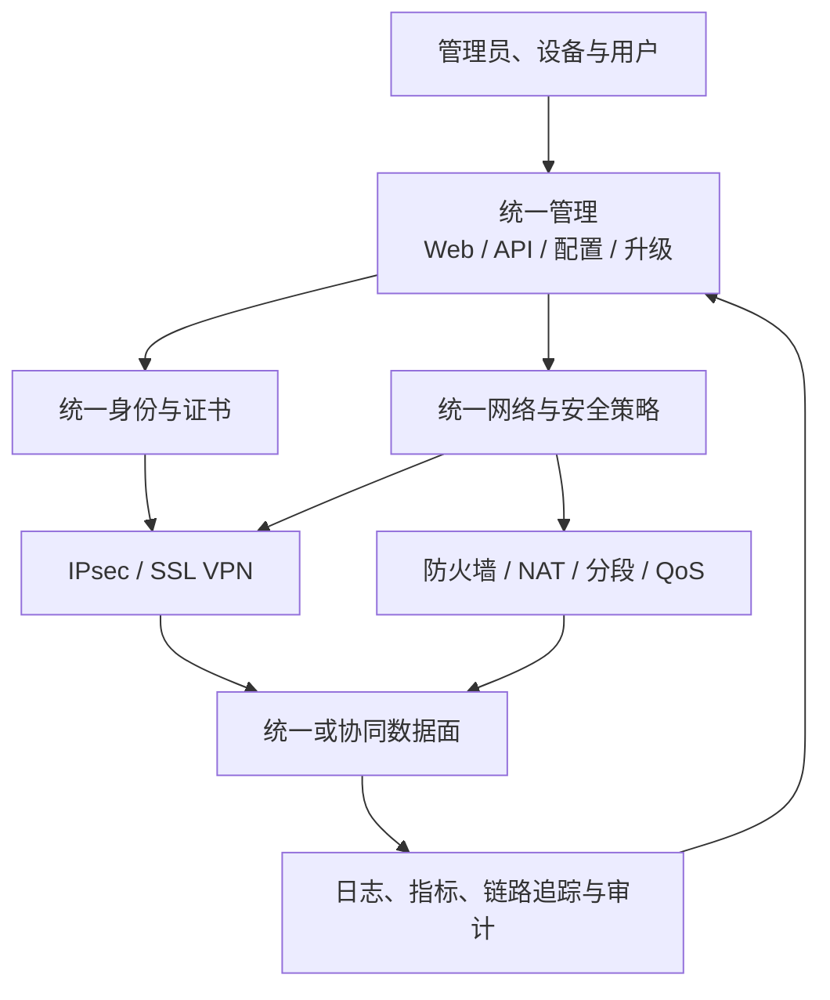

> 本文讨论从“能建立VPN隧道”向“可管理、可运营的安全网络平台”演进。SD-WAN、ZTNA和SASE是否投入，取决于公司产品定位和客户需求，不是源码到货后的默认任务。

## 1. 一台商用网关不只是两套VPN协议栈



协议功能如果缺少配置校验、审计、升级、HA和诊断，只能算能力原型，不能算可运营产品。

## 2. 先做统一管理与可观测

优先打通：

- 配置从 Web/API 到进程、内核和硬件的真实链路；
- 用户、设备、证书、隧道、资源和策略的统一标识；
- 一次连接从请求、认证、SA/会话到数据面的关联ID；
- 指标、日志、告警、审计和诊断包；
- 配置版本、灰度、回滚和失败恢复；
- HA状态同步与主备切换边界。

这些能力既降低现场支持成本，也是以后集中控制器、零信任和SD-WAN的共同底座。

## 3. 从VPN向零信任演进

传统远程接入通常以“用户进入某个网络”为中心；ZTNA更关注“某个身份、设备和环境能否访问某个应用或资源”。合理顺序是：

```text
统一身份与证书
→ 资源建模
→ 最小权限策略
→ 设备状态与持续评估
→ 会话撤销和动态授权
→ VPN与ZTNA共享审计和策略
```

零信任不是简单换一种隧道。它会引入身份、终端状态、应用代理、策略决策点和持续评估等新边界。

## 4. 从站点VPN向SD-WAN演进

站点VPN解决安全连接；SD-WAN进一步解决多站点、多链路和集中编排：

- ZTP和设备身份；
- Overlay拓扑与自动建隧道；
- 路由分发和网络分段；
- 延迟、丢包、抖动和可达性探测；
- 按应用与SLA选路；
- 故障与质量劣化时切换；
- 集中策略、版本、升级和诊断。

只有客户确实面临大规模站点、多运营商链路或手工运维成本时，这条路线才有优先级。

## 5. 从设备向SASE/服务化演进

SASE把广域网连接与云交付安全能力组合起来。对设备厂商，更现实的渐进路线通常是：

```text
稳定的边缘网关
→ 统一API和集中控制
→ 虚拟网关与云节点
→ 多租户、配额和计费
→ 云端安全服务与就近接入
```

每一步都要补齐租户隔离、密钥和日志隔离、控制器断连自治、灰度升级、容灾、数据合规和运营成本。

## 6. 怎样判断某个平台能力值得投入

| 候选能力 | 应先出现的真实信号 | 不足以立项的理由 |
| --- | --- | --- |
| 集中管理 | 多设备配置不一致、升级和排障成本明显 | “大厂都有控制器” |
| SD-WAN | 多站点、多链路、应用SLA和自动切换需求 | “IPsec隧道已经很多” |
| ZTNA | 需要按用户/设备/应用授权并持续评估 | “VPN显得传统” |
| SASE | 分布式用户、云应用、多租户运营场景明确 | “这是行业趋势” |
| 多租户 | 同一平台需要隔离客户、资源、策略和日志 | “以后可能做云” |

## 7. 平台路线的验收方式

- 新设备能否安全、自动、可审计地上线；
- 策略冲突是否可解释，变更是否可回滚；
- 控制器断连后边缘是否按预期自治；
- 链路劣化、设备故障和版本升级是否能恢复；
- 用户、设备、应用、隧道和日志是否能统一追踪；
- 多租户之间配置、流量、密钥和审计是否隔离；
- 平台能力是否减少配置时间、故障时间和人工错误。

平台升级的最终价值，不是页面和功能数量，而是能否把分散的网络、安全、密码和运维能力组织成可靠、可规模化交付的系统。
