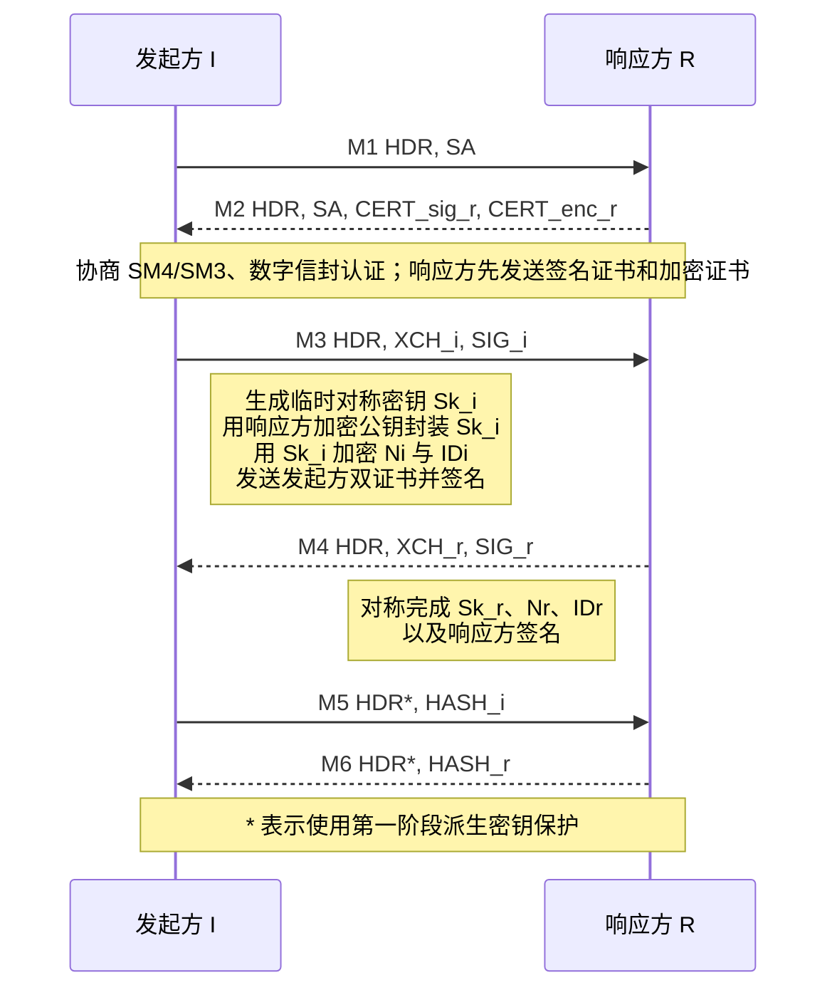

> 研究对象：未经国密改造的 strongSwan 6.0.3 上游源码，commit `472dcd8bb50a91f156b725ff56992352b573f7dd`<br>
> 对照标准：GM/T 0022—2023《IPSec VPN 技术规范》<br>
> 研究类型：标准到源码的静态差距分析，不代表任何厂商产品已经按本文实现

## 1. 先给结论

GM/T 0022—2023 规定的密钥交换协议属于 **IKEv1/ISAKMP 的两阶段体系**：第一阶段使用主模式，第二阶段使用快速模式；报文头版本为 `0x11`，即主版本 1、次版本 1。

但它不能被理解成“RFC 2409 IKEv1 把 AES、SHA、RSA 换成 SM4、SM3、SM2”。标准还改变了第一阶段的证书发送时机、密钥交换载荷、认证方法、签名输入、SKEYID 派生和初始 IV。因此，对 strongSwan 上游的合规改造至少会进入：

```text
协议画像与版本识别
→ Payload 编解码
→ Main Mode 状态机
→ 双证书与 SM2 数字信封
→ IKEv1 keymat
→ Quick Mode HASH/KEYMAT
→ 国密算法实现与编号映射
→ CHILD_SA / Linux XFRM
```

IKEv2 是另一条路线。若保持 IKEv2 的 `IKE_SA_INIT / IKE_AUTH / CREATE_CHILD_SA` 语义，只增加 SM2、SM3、SM4，主要工作确实集中在算法注册、Transform 映射、密码后端、证书认证和 XFRM 映射；但在没有另一份适用标准或双方互通规范的前提下，它应称为 **“IKEv2 国密算法扩展”**，不能称为 GM/T 0022—2023 的合规实现。

## 2. 三条路线必须分开

| 路线 | 协议语义 | 对 strongSwan 的改造深度 | 能否直接称为 GM/T 0022 合规 |
| --- | --- | --- | --- |
| RFC/IETF IKEv1 | RFC 2409 风格 Main Mode + Quick Mode，DH `KE + Nonce` | 上游已有 | 否 |
| GM/T 0022—2023 | IKEv1/ISAKMP 衍生的 1.1 画像，双证书 + SM2 数字信封 + 专用 KDF | 状态机、载荷、认证、keymat、算法和数据面都要检查 | 是，前提是完整实现并通过验证 |
| IKEv2 + SM 算法 | 保留 IKEv2 状态机，扩展算法/编号/证书/数据面 | 通常比 GM/T 0022 路线浅，但仍需完整闭环 | 否；除非另有明确适用标准或互通 profile |

这里最容易犯的错误，是把“用了 SM 算法”“能和同一私有补丁互通”和“符合 GM/T 0022”当作同一件事。

## 3. GM/T 0022 第一阶段到底改了什么

### 3.1 标准主模式的六条消息



其中标准定义的抽象内容为：

```text
XCH_i = SM2_Encrypt(Sk_i, PubEnc_r)
      | SM4_Encrypt(Ni, Sk_i)
      | SM4_Encrypt(IDi, Sk_i)
      | CERT_sig_i
      | CERT_enc_i

SIG_i = Sign(PrivateSign_i,
             Sk_i | Ni | IDi | CERT_enc_i)
```

响应方的 `XCH_r / SIG_r` 对称处理。

### 3.2 这与上游 strongSwan Main Mode 的根本差异

上游 `main_mode.c` 的状态只有：

```text
MM_INIT → MM_SA → MM_KE → MM_AUTH
```

发起方主要执行：

```text
M1: build_i(MM_INIT) → SA
M3: build_i(MM_SA)   → create_dh() + add_nonce_ke()
M5: build_i(MM_KE)   → ID + build_auth()
```

也就是说，上游依赖 DH 公共值和 Nonce，再在第 5、6 条完成身份认证；GM/T 0022 则在第 2 条引入双证书，在第 3、4 条完成 SM2 数字信封和签名，第 5、6 条发送 HASH。二者的消息内容和状态含义都不同。

因此不能只在上游的 `create_dh()` 后面换一个“SM2 算法对象”。真正的改造需要给 GM/T 0022 建立独立、可识别的协议画像，并让每个状态只接受该画像规定的载荷组合。

## 4. 标准报文与上游 Payload 的差距

### 4.1 版本号

GM/T 0022 报文图规定版本字段为 `0x11`。

上游 `src/libcharon/encoding/payloads/ike_header.h` 固定：

```c
#define IKEV1_MAJOR_VERSION 1
#define IKEV1_MINOR_VERSION 0
```

【改造含义】不能全局把 `1.0` 改成 `1.1`，否则会破坏普通 IKEv1。更合理的方向是增加显式 profile/版本分支，并检查 `task_manager_v1.c` 创建报文及接收端版本校验链。

### 4.2 对称密钥载荷

GM/T 0022 定义类型值 `128` 的对称密钥载荷。该载荷承载“用对端 SM2 加密公钥加密后的临时对称密钥”。标准的第 3、4 条报文还规定 Nonce、ID、证书和签名的顺序及保护关系。

上游 `src/libcharon/encoding/payloads/payload.h` 的 IKEv1 类型包含 `SA/KE/ID/CERT/HASH/SIGNATURE/NONCE` 等，但没有 GM/T 的类型 `128`。

【改造含义】至少需要：

- 新的 payload type 与对象；
- 编码规则、解码规则、长度检查和 payload factory 注册；
- Main Mode 每个状态的允许载荷规则；
- 对未知/重复/错序载荷的安全拒绝；
- Wireshark 或内部解析工具对该私有/标准扩展载荷的识别。

不能用一条日志代替真实线上编码。

### 4.3 双证书不是“加载两张证书”这么简单

标准区分：

- 编码值 `4`：签名证书；
- 编码值 `5`：加密证书。

两张证书承担不同角色：签名证书证明身份并验证 `SIG_i/SIG_r`；加密证书的公钥用于封装对方生成的临时对称密钥。

上游 `isakmp_cert_pre.c`、`isakmp_cert_post.c` 和凭据管理框架能处理 IKEv1 证书，但没有天然表达 GM/T 0022 的“签名证书 + 加密证书”成对选择、发送、校验和用途约束。

【改造含义】需要在凭据选择、证书编码值、用途校验、私钥选择及认证器之间建立明确的角色关系，不能只从一个证书列表随便取两张证书。

## 5. Proposal/Transform：算法编号必须带协议上下文

GM/T 0022 给出了本协议画像内的算法/认证值，例如：

| 语义 | GM/T 0022 值 |
| --- | ---: |
| 第一阶段 SM4 加密算法 | `129` |
| 第一阶段 SM3 杂凑算法 | `20` |
| 数字信封认证方法 | `10` |
| SM2 非对称算法类型 | `2` |
| ESP SM4-CBC | `127` |
| ESP SM4-GCM | `130` |
| ESP/AH HMAC-SM3 | `20` |

上游映射位于：

```text
src/libcharon/encoding/payloads/proposal_substructure.c
  map_encr[]
  map_integ[]
  map_prf[]
  map_esp[]
  map_ah[]
  map_auth[]
  add_to_proposal_v1_ike()
  add_to_proposal_v1()
  set_from_proposal_v1_ike()
  set_from_proposal_v1()
```

上游这些表没有上述 SM 算法映射。更重要的是，上游 IKEv1 已把认证方法值 `10` 解释为 `IKEV1_AUTH_ECDSA_384`，而 GM/T 0022 在 1.1 画像中把 `10` 解释为数字信封认证。

【改造含义】绝不能在全局枚举中粗暴改写整数 `10` 的含义。解析和生成必须同时知道：

```text
协议版本/profile + 字段所属编号空间 + 数值
```

这也是为什么 GM/T 0022 应作为独立协议画像处理，而不是给普通 IKEv1 映射表直接追加几行。

## 6. keymat：不是把 PRF 换成 HMAC-SM3 就结束

### 6.1 上游公式依赖 DH 共享秘密

上游 `src/libcharon/sa/ikev1/keymat_v1.c:derive_ike_keys()` 首先调用：

```c
dh->get_shared_secret(dh, &g_xy)
```

签名认证路径的核心输入包括：

```text
SKEYID   = prf(Ni | Nr, g^xy)
SKEYID_d = prf(SKEYID, g^xy | CKY-I | CKY-R | 0)
SKEYID_a = prf(SKEYID, SKEYID_d | g^xy | CKY-I | CKY-R | 1)
SKEYID_e = prf(SKEYID, SKEYID_a | g^xy | CKY-I | CKY-R | 2)
IV       = HASH(g^xi | g^xr)
```

### 6.2 GM/T 0022 的输入不同

标准规定：

```text
SKEYID   = PRF(HASH(Ni | Nr), CKY-I | CKY-R)
SKEYID_d = PRF(SKEYID, CKY-I | CKY-R | 0)
SKEYID_a = PRF(SKEYID, SKEYID_d | CKY-I | CKY-R | 1)
SKEYID_e = PRF(SKEYID, SKEYID_a | CKY-I | CKY-R | 2)
初始 IV  = HASH(Sk_i | Sk_r)
```

这些公式不含上游的 `g^xy / g^xi / g^xr`，而使用数字信封流程得到的 `Sk_i / Sk_r` 和 `Ni / Nr`。

【改造含义】`derive_ike_keys()` 的函数入参、密钥材料来源、公式和 IV 初始化都要为 GM/T profile 建立专用路径。只给 crypto factory 注册 `PRF_HMAC_SM3`，会得到“算法对象能创建，但派生公式仍是 RFC IKEv1”的半成品。

### 6.3 身份 HASH 与签名也不同

上游 `keymat_v1.c:get_hash()` 计算的是包含 DH 公共值的 RFC 风格 `HASH_I/HASH_R`。GM/T 0022 的 `HASH_i/HASH_r` 使用 Cookie、SA、ID 等指定输入，且第 3、4 条的 `SIG_i/SIG_r` 还覆盖临时对称密钥、Nonce、ID 和对方需要绑定的加密证书材料。

上游公钥认证器按原有 `HASH_I/HASH_R` 签名，不能直接承担 GM/T 数字信封签名语义。候选落点包括：

```text
src/libcharon/sa/ikev1/keymat_v1.c
  get_hash()

src/libcharon/sa/ikev1/authenticators/pubkey_v1_authenticator.c

src/libcharon/sa/ikev1/phase1.c
  build_auth()
  verify_auth()
```

实现时宜增加 GM/T 专用认证器/辅助对象，避免用大量条件分支污染普通 IKEv1。

## 7. Quick Mode 与 ESP 数据面

GM/T 0022 的第二阶段仍是三条快速模式消息，`quick_mode.c` 的任务框架、双向 SPI、CHILD_SA 和安装流程有较高复用价值，但不能未经核对直接沿用。

### 7.1 HASH 顺序

标准定义：

```text
HASH_1 = PRF(SKEYID_a, MsgID | Ni | SA [| IDci | IDcr])
HASH_2 = PRF(SKEYID_a, MsgID | Ni | SA | Nr [| IDci | IDcr])
HASH_3 = PRF(SKEYID_a, 0 | MsgID | Ni | Nr)
```

上游 `keymat_v1.c:get_hash_phase2()` 对 `HASH(1)` 使用“`MsgID | HASH 之后的完整报文`”。而上游 `quick_mode.c` 的发送顺序是 `SA → Nonce → ...`，因此实际拼接为 `MsgID | SA | Ni ...`，与标准要求的 `MsgID | Ni | SA ...` 不同。

【改造含义】不能只替换 PRF；应为 GM/T profile 明确构造 HASH 输入，避免依赖通用的“按线上 payload 顺序整体哈希”。`HASH_2/3` 也要按标准逐字节测试。

### 7.2 KEYMAT 与双向 SA

标准的方向密钥以 `SKEYID_d`、协议、SPI、`Ni/Nr` 为输入并按需扩展。上游 `derive_child_keys()`、`quick_mode.c:install()` 和 `child_sa->install()` 的整体抽象可复用，但要验证：

- 发起/响应方向的 SPI 与密钥没有互换；
- SM4-CBC 的加密密钥和 HMAC-SM3 完整性密钥长度正确；
- SM4-GCM 不再附加独立 HMAC-SM3；
- SM4-GCM KEYMAT 包含 16 字节密钥和 4 字节 salt；
- ESN、序列号、AAD、IV 和 16 字节鉴别标签符合标准；
- rekey 后新旧 SA 的生命周期和方向仍正确。

### 7.3 Tongsuo 不能替代 Linux XFRM

Tongsuo/OpenSSL 插件可以提供用户态 IKE 所需的 SM2/SM3/SM4 原语，但默认内核数据面中，ESP 包由 Linux XFRM 处理。

因此还要闭合：

```text
proposal 中的 ESP 算法
→ CHILD_SA 方向密钥
→ kernel-netlink 算法名和密钥下发
→ Linux Crypto API 实现
→ xfrm state / policy
→ 真实 ESP 包
```

只证明 strongSwan 链接了 Tongsuo，不能证明 ESP 数据面已经使用 SM4/HMAC-SM3。

## 8. 标准要求到源码候选落点

| 标准要求 | 上游现状 | 主要源码候选点 | 修改性质 |
| --- | --- | --- | --- |
| Header 版本 `0x11` | IKEv1 固定 1.0 | `ike_header.h`、`task_manager_v1.c`、接收端版本校验 | profile/协议识别 |
| 主模式 M2 双证书 | 普通 IKEv1 不在此处按角色发送双证书 | `main_mode.c`、`isakmp_cert_pre.c`、凭据管理 | 状态机 + 凭据角色 |
| Payload 128 对称密钥 | 上游无此类型 | `payload.h`、payload factory、编码/解析规则 | 新 Payload |
| M3/M4 数字信封 | 上游发送 DH KE + Nonce | `main_mode.c`、`phase1.c`、新增数字信封辅助对象 | 状态机深改 |
| 数字信封认证值 10 | 上游值 10 已表示 ECDSA-384 | `proposal_substructure.c`、`authenticator.h` | profile 隔离 |
| SM2 签名/加密双密钥 | 上游公钥认证主要面向单认证用途 | `credentials/`、OpenSSL/Tongsuo plugin、认证器 | 密码与凭据扩展 |
| GM/T SKEYID/IV 公式 | 上游依赖 DH `g^xy` | `keymat_v1.c:derive_ike_keys()` | 专用 keymat 路径 |
| GM/T HASH_i/HASH_r | 上游 HASH 包含 DH 公共值 | `keymat_v1.c:get_hash()`、认证器 | 认证输入改变 |
| Quick Mode HASH 顺序 | 上游按 payload 线上顺序计算 | `keymat_v1.c:get_hash_phase2()`、`quick_mode.c` | 专用 HASH 构造 |
| SM4/SM3 Transform | 上游映射表无相应项 | `proposal_substructure.c`、算法 enum/keyword | 算法与 wire 映射 |
| SM4-GCM salt/ICV | 上游仅对已有 AEAD 特例处理 | `keymat_v1.c:derive_child_keys()`、算法定义 | keymat 长度/AEAD |
| ESP 下发 XFRM | 上游无目标算法映射保证 | `child_sa.c`、`kernel_netlink_ipsec.c`、目标内核 | 用户/内核边界 |

这里的“主要源码候选点”是静态分析入口，不是最终补丁清单。真正实现时还要沿构造器、接口和测试用例补齐调用链。

## 9. IKEv2 在本研究中的正确位置

IKEv2 源码仍然值得研究，因为它是国际主流协议，也是未来 PQC、互通和产品演进的重要底座。但本知识库必须保持以下命名纪律：

```text
GM/T 0022—2023 国密 IPsec
    = IKEv1/ISAKMP 衍生 1.1 画像 + 国密 ESP

IKEv2 + SM2/SM3/SM4
    = IKEv2 国密算法扩展（需另行定义编号、证书、KDF和互通边界）
```

如果 IKEv2 仍保留标准状态机和 KDF 语义，候选改造链是：

```text
算法 enum / keyword
→ IKEv2 Transform ID/profile
→ crypto factory/provider
→ SM2 证书与签名
→ keymat_v2 参数
→ CHILD_SA
→ XFRM
```

这条路线不能复用 GM/T 0022 的 IKEv1 数值，因为 IKEv1、IKEv2、TLS 和 ESP 是不同编号空间。

## 10. 本次源码分析已经证明什么

### 已确认

- GM/T 0022 使用两阶段 Main Mode / Quick Mode，Header 版本为 1.1；
- 标准主模式采用双证书、SM2 数字信封和专用派生公式；
- strongSwan 6.0.3 上游实现的是 IKEv1 1.0 的 DH/Nonce 主模式；
- 上游缺少 GM/T 对称密钥载荷 128、相应算法映射和专用 keymat；
- GM/T 0022 路线必须深改 IKEv1 协议链，不能只注册算法；
- IKEv2 算法扩展与 GM/T 0022 是两件事。

### 尚未证明

- 目标产品或其他待采购产品采用 strongSwan 的具体版本和补丁结构；
- 厂商是否完整实现 GM/T 0022，还是使用兼容/私有 profile；
- 目标 Linux 内核对 SM4-CBC、SM4-GCM、HMAC-SM3 的 XFRM 支持情况；
- 实际证书格式、HSM 接口、算法编号兼容策略和互通结果；
- 上述候选改造点在某一产品中的最终文件位置。

## 11. 后续拿到厂商代码时怎么核查

按下列顺序比“搜索 SM4”更可靠：

1. 找版本判断：是否能区分普通 IKEv1 `1.0` 与 GM/T `1.1`；
2. 找 payload type `128` 的定义、解析、编码和异常测试；
3. 找主模式六条消息的状态分支，核对 M2 至 M6 的载荷顺序；
4. 找双证书的角色标识和用途校验；
5. 找数字信封的 SM2 加密/解密及 SM4 临时密钥使用点；
6. 找 `SKEYID_d/a/e`、初始 IV、`HASH_i/r` 的字节级公式；
7. 找 Quick Mode `HASH_1/2/3` 和 KEYMAT；
8. 找 SM4/HMAC-SM3 到 XFRM 的算法名、密钥长度和 AEAD 参数；
9. 用抓包、双方日志、`ip xfrm state/policy` 和负面测试证明真实执行路径。

## 参考资料

- GM/T 0022—2023《IPSec VPN 技术规范》：第 6.1.2 节、6.1.5 节、6.1.6 节及相关算法表
- strongSwan 6.0.3 上游源码，commit `472dcd8bb50a91f156b725ff56992352b573f7dd`
- 本库：[IPsec 协议体系解读与流程图](IPsec%20协议体系解读与流程图.md)
- 本库：[strongSwan 上游源码研究与国密改造点定位](strongSwan%20上游源码研究与国密改造点定位.md)
