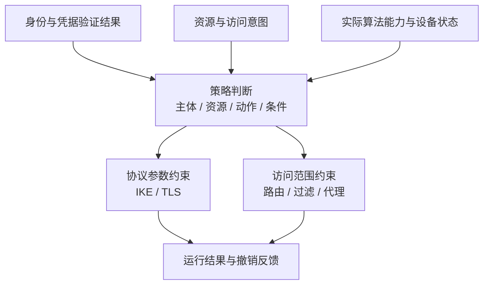

## 隧道建立之后，还有一个问题

IKE 或 TLS 完成认证，回答的是一次协议会话中的身份与密码学验证问题。某个身份是否能访问某个资源、是否满足设备状态要求、是否必须使用指定算法，是另一组策略问题。证书有效并不能自动推出对全部内网资源的访问权。

NIST SP 800-207 用策略引擎、策略管理员和策略执行点描述零信任体系中的决策与执行职责。本文借用其职责分离，不把“一台设备上有身份认证和防火墙”直接称为完整零信任架构。[NIST SP 800-207](https://csrc.nist.gov/pubs/sp/800/207/final)

## 三类输入不能互相冒充

下面是**候选控制面模型，尚未落地**。

第一类输入是身份：谁发起请求、由什么凭据证明、认证发生在什么时候。第二类是授权条件：允许到达的资源、端口、动作与有效期。第三类是能力：本机与对端能否完成所需密码运算、设备当前是否可用。

“策略要求 ML-KEM”不是算法实现已加载的证据；“Provider 能创建 ML-KEM 对象”也不是对端支持对应协议交换的证据。至少要分别记录配置允许集合、实现可用集合、线上协商集合以及最终使用结果。

## 用一个例子检查责任边界

**示例场景**：远程用户 Alice 允许访问测试网段中的一个 Git 服务，必须使用组织批准的混合密钥交换；本例没有对应真实用户或网络。

| 判断 | 应检查的输入 | 失败后的设计选择 |
| --- | --- | --- |
| 身份是否可信 | 凭据链、用途、有效期、撤销状态 | 拒绝该身份建立访问 |
| 资源是否允许 | 身份到资源的策略、请求动作 | 只拒绝未授权资源，还是拒绝整个会话须明确 |
| 算法约束是否满足 | 本地实现、对端协商、组合规则 | require 失败应拒绝，不静默放宽 |
| 运行态是否仍符合 | 会话代次、设备健康、策略版本 | 撤销、重协商或等待到期，须有明确语义 |

表中的 `require` 是本文的策略表达示例，不是声称所有协议栈都有同名配置项。将它翻译为 strongSwan Proposal 或 TLS 配置时，还要检查具体软件版本支持的表达能力。

## 统一接口不等于抹平协议差异

IKE Traffic Selector、路由前缀、应用资源标识和 TLS 证书身份不是同一种对象。一个三层 IPsec 隧道也不会天然识别 HTTP 路径。控制面可以共享主体和资源模型，但必须让 adapter 明确报告“可表达”“需其他执行点配合”“不可表达”，而不是偷偷扩大授权范围。

密码策略同样如此：IKE 的多重 KE 与 TLS 的密钥交换组有各自的消息、标识与状态机。统一策略可以表达安全目标，不能把两种协议的线上编号直接互换。可从[密码接口地图](/articles/crypto-provider-kdf-map/)和[PQC 基础](/articles/pqc-gateway-fundamentals/)继续追踪具体接缝。

## 撤销是最容易缺的一半

初始授权可用不代表生命周期完整。假设策略删除了某用户的权限，当前 IKE SA、CHILD_SA、OpenVPN 会话和已有连接跟踪条目应如何处理？答案取决于产品约束，但必须可观察。

一个可审查的设计应给出撤销对象的稳定 ID、撤销触发时间、各执行点完成时间，以及未完成时的告警。不要把“新连接被阻止”作为“已有连接也已切断”的替代结果。

## 待做的四组负向测试

本文尚未执行这些用例，建议先在单一协议与资源上做代表性闭环：

- 身份合法、资源未授权：握手是否成功与业务是否拒绝分别记录。
- 策略要求算法存在但实现缺失：确认拒绝原因，并检查没有未批准的软件回退。
- 认证完成后撤销权限：比较新连接、既有业务流和重连的行为。
- 更换策略版本但保留旧会话：明确何时需要 rekey、重新认证或主动删除，而不是假定版本自动传播。

这条链的核心是：策略输出能映射到具体执行点，执行结果能反向关联到策略版本。只画一个“统一控制面”矩形，尚未回答这个问题。
