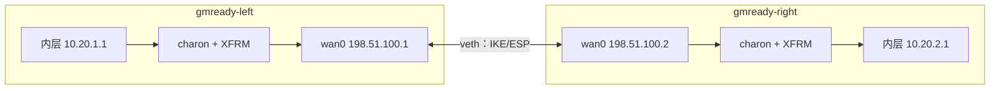

> **原稿实验记录**：以下保留原稿中的实验方法、观察与结果。本页未提供完整原始证据包，脚本路径是原实验资产的定位信息，不是本站下载地址。本次整理没有重跑实验，也不把这些记录标为已公开复核的实测结果。


## 1. 实验目标与边界

本实验把 strongSwan 6.0.3 当作国际 IKEv2 的可观察参考实现，验证：

- PSK和RSA证书认证；
- `IKE_SA_INIT → IKE_AUTH → CHILD_SA`；
- Proposal/Transform选择；
- `swanctl --list-sas`；
- Linux XFRM state/policy；
- 外层PCAP中的IKEv2和双向ESP。

它没有使用SM2/SM3/SM4，也不证明GM/T 0022或供应商产品符合性。

## 2. 一台虚拟机为什么能模拟两台Linux

Linux network namespace会隔离网卡、地址、路由、Socket和XFRM数据库。两个namespace之间用一对veth相连，各自运行一个charon，协议视角相当于两台Linux：



差别在于两端仍共享同一台虚拟机的CPU和存储，所以它适合协议与工具训练，不适合代表物理设备性能。

## 3. 手工学习路径

工作目录：

```bash
cd <workspace>/nethsecurity-main/artifacts/2026-W40/task-pre-source-gateway-readiness
```

`cd`只是切换当前目录；绝对路径从`/`开始，`./lab/...`表示执行当前目录下的脚本。以下命令需要`sudo`，因为network namespace、veth和XFRM都属于内核网络管理能力。

### 3.1 先确认程序身份

```bash
<workspace>/nethsecurity-main/artifacts/ipsec-guomi-poc-2026-08-24/install/sbin/swanctl --version
sha256sum <workspace>/nethsecurity-main/artifacts/ipsec-guomi-poc-2026-08-24/install/libexec/ipsec/charon
```

第一条确认使用的strongSwan工具版本，第二条给二进制生成不可混淆的指纹。Hash相同只能证明文件相同，不能证明它已运行；还要结合进程路径和日志。

### 3.2 手工建立两端网络

```bash
sudo ip netns add gmready-left
sudo ip netns add gmready-right
sudo ip link add gmrl0 type veth peer name gmrr0
sudo ip link set gmrl0 netns gmready-left
sudo ip link set gmrr0 netns gmready-right
sudo ip -n gmready-left link set gmrl0 name wan0
sudo ip -n gmready-right link set gmrr0 name wan0
sudo ip -n gmready-left addr add 198.51.100.1/24 dev wan0
sudo ip -n gmready-right addr add 198.51.100.2/24 dev wan0
sudo ip -n gmready-left link set lo up
sudo ip -n gmready-right link set lo up
sudo ip -n gmready-left link set wan0 up
sudo ip -n gmready-right link set wan0 up
```

`ip -n <名称>`表示在指定namespace中执行；veth像一根虚拟网线，两端移动进不同namespace。此时只能证明外层网络形成，还没有VPN。

### 3.3 配置里最关键的四行

```ini
version = 2
proposals = aes256-sha256-prfsha256-modp2048
local { auth = psk }
esp_proposals = aes256-sha256
```

IKE Proposal依次表示控制面加密、完整性、PRF和密钥交换组；ESP Proposal表示数据面加密和完整性。证书场景只把认证改为`pubkey`并为两端加载证书/私钥，IKE和ESP算法仍相同。

### 3.4 观察协商、SA和XFRM

charon启动并通过VICI加载配置后，按顺序执行：

```bash
swanctl --initiate --child protected-net --uri unix:///tmp/gmready-left.vici
swanctl --list-sas --uri unix:///tmp/gmready-left.vici
sudo ip netns exec gmready-left ip -s xfrm state
sudo ip netns exec gmready-left ip -s xfrm policy
sudo ip netns exec gmready-left ping -I 10.20.1.1 -c 5 10.20.2.1
sudo ip netns exec gmready-left ip -s xfrm state
```

正确结果的层次是：

1. `IKE_SA ... ESTABLISHED`：控制面建立；
2. `CHILD_SA ... INSTALLED`：子SA已交给数据面；
3. XFRM有双向SPI、算法、密钥和Policy；
4. Ping通过且XFRM包计数增长；
5. 外层抓包出现双向ESP。

只看到第一层不能证明业务数据可用。

### 3.5 抓包的终端与Wireshark双轨

终端捕获：

```bash
sudo ip netns exec gmready-left tcpdump -i wan0 -nn -s 0 -w ikev2.pcap \
  'udp port 500 or udp port 4500 or esp'
```

反斜杠表示命令下一行继续；单引号防止shell改写过滤表达式。Wireshark打开PCAP后使用显示过滤器：

```text
isakmp || esp
```

展开 `Internet Security Association and Key Management Protocol`：

- Exchange Type 34：IKE_SA_INIT；
- Exchange Type 35：IKE_AUTH；
- Exchange Type 37：INFORMATIONAL；
- Initiator/Response标志用于区分请求和响应；
- ESP包展开后能看到SPI和Sequence Number，看不到内层Ping正文。

### 3.6 清理

```bash
sudo ip netns del gmready-left
sudo ip netns del gmready-right
```

删除namespace会清除其中的地址、路由和XFRM状态。异常中断时先确认没有遗留实验charon，再清理。

## 4. 自动回归路径

自动脚本及原始证据保存在本地受限实验资产目录；知识库只同步不含私钥、PSK和XFRM会话密钥的方法与结论。

手工理解上述对象后，用脚本重复：

```bash
sudo ./lab/run-ikev2-standard-lab.sh psk
sudo ./lab/run-ikev2-standard-lab.sh cert
```

脚本会生成临时配置与7天有效测试证书，保存原始终端、双方charon日志、PCAP、SA、XFRM和Hash，结束时删除namespace。测试私钥只在本地`build/`产生，不进入文档仓库。

## 5. 本次真实结果

| 场景 | IKE | 认证 | CHILD/ESP | 业务与XFRM | PCAP |
| --- | --- | --- | --- | --- | --- |
| PSK | AES-CBC-256 / HMAC-SHA2-256 / PRF-SHA2-256 / MODP-2048 | 双方PSK成功 | AES-CBC-256 / HMAC-SHA2-256-128 | 5/5 Ping；双向计数0→5 | 16包：2 INIT、2 AUTH、10 ESP、2 DELETE |
| 证书 | 同上 | 双方RSA-SHA256成功，证书链到测试CA | 同上 | 5/5 Ping；双向计数0→5 | 18包；IKE_AUTH因证书较大双向各分2片 |

PSK最终回归目录：`psk-20260928-162930`；PCAP SHA-256：`4df23dcbb9078500836aeb567606931fddffb2acdca719878e2fb79313954718`。

证书最终回归目录：`cert-20260928-163537`；PCAP SHA-256：`5bfb19ab6b1d1f8660224c5d5dc9ae684022ee8b25a2f78fbf8521b1be5769fa`。

## 6. 对未来目标产品代码的价值

相同用例到货后要做三方对照：

```text
RFC/国际标准预期
↕
strongSwan 6.0.3参考报文、状态与源码
↕
目标产品实现的报文、状态、源码和错误行为
```

不是要求目标产品必须长得像strongSwan，而是用已知正确的行为基线迅速识别：状态停在哪、Proposal为何不匹配、认证是否完成、SA有没有安装，以及控制面成功后数据面为何仍不通。
