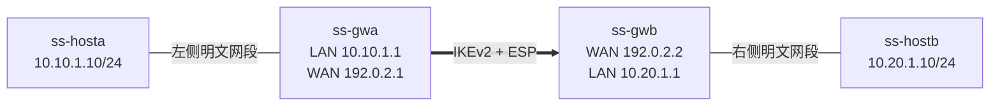

> **原稿实验记录**：以下保留原稿中的实验方法、观察与结果。本页未提供完整原始证据包，脚本路径是原实验资产的定位信息，不是本站下载地址。本次整理没有重跑实验，也不把这些记录标为已公开复核的实测结果。


> 实验目标：只使用一台Linux虚拟机，模拟两侧内网主机和两台strongSwan网关，建立一条标准IKEv2/IPsec隧道，并用日志、PCAP和Linux XFRM共同证明它成立。<br>
> 实测环境：Ubuntu 26.04.1、strongSwan 6.0.4、Linux 7.0.0；源码配套文档基于strongSwan 6.0.3，上游主链在本实验涉及位置基本一致，但源码结论仍以各自版本为准。<br>
> 边界：本实验使用PSK、AES和SHA-256建立标准IKEv2隧道，不代表GM/T 0022，不包含SM2/SM3/SM4，也不是性能或跨厂商互通测试。

## 1. 先回答：一台虚拟机够不够

对于第一次掌握strongSwan配置、IKE协商、CHILD_SA、XFRM和ESP，一台虚拟机不仅够，而且比先连续阅读大量文档更有效。

Linux的网络命名空间可以在同一个内核中创建相互隔离的网络环境。实验使用四个命名空间：



这个模型能真实验证：

- 两个独立的`charon-systemd`实例；
- 双方各自的`swanctl.conf`；
- IKE_SA_INIT和IKE_AUTH；
- 双向CHILD_SA、SPI和Traffic Selector；
- 两个网关命名空间各自的XFRM state/policy；
- `10.10.1.10`到`10.20.1.10`的跨网段业务流量；
- 网关外侧接口上的IKE和ESP报文。

它不能代替：

- 两台物理设备或两个不同内核之间的互通；
- 真实NAT、防火墙、丢包和公网环境；
- 异厂商设备互通；
- 吞吐、时延、并发和密码卡性能测试；
- 国密协议合规性验证。

所以最佳顺序不是“先把源码文档全部读完”，而是：

```text
跑通最小标准隧道
→ 看懂配置与系统结果
→ 制造一个明确失败
→ 再用五条源码链解释为什么
→ 最后学习证书、国密和源码修改
```

## 2. 这次实测已经得到了什么

实验实际完成了以下结果：

| 检查点 | 实测结果 | 它证明什么 |
| --- | --- | --- |
| 配置加载 | 两端各加载1条连接和同一实验PSK | VICI配置入口有效 |
| IKE_SA_INIT | 选择`AES_CBC_256/HMAC_SHA2_256/PRF_HMAC_SHA2_256/MODP_2048` | 双方IKE proposal存在交集 |
| IKE_AUTH | `gw-a`与`gw-b`的PSK身份认证成功 | 双方持有匹配凭据并完成认证 |
| CHILD_SA | ESP proposal为`AES_CBC_256/HMAC_SHA2_256_128` | 数据面算法与IKE算法分开协商 |
| Traffic Selector | `10.10.1.0/24 === 10.20.1.0/24` | 指定的两侧内网进入隧道 |
| XFRM | 网关A存在双向state及`out/in/fwd` policy | 协商结果已经交给Linux内核 |
| 业务流量 | 4次ping全部成功，双向state各增加4个包、336字节 | 不是只建立控制面，真实数据经过SA |
| PCAP | 保存IKE和ESP原始报文，可看到SPI与Sequence | 公网侧存在受保护数据流量 |
| 负面测试 | 不兼容IKE proposal返回`NO_PROPOSAL_CHOSEN` | 配置中的proposal真正参与协商 |

原始实验资产位于：

```text
/path/to/workspace/
└── artifacts/2026-W39/task-strongswan-single-vm-lab/
    ├── lab/config/             双方strongSwan和swanctl配置
    ├── scripts/                逐步脚本、回归脚本和清理脚本
    └── evidence/
        ├── raw/                原始日志、PCAP、XFRM和ping输出
        └── derived/            字段提取、脱敏XFRM摘要和哈希
```

> **原始XFRM状态可能包含密钥**
> `ip xfrm state`会打印ESP方向密钥。本实验将原始文件限制为组内可读，并另存脱敏摘要。不要把原始XFRM state上传到GitHub、报告或聊天工具。
>

## 3. 开始前先懂六个词

| 术语 | 人话解释 | 本实验中的实体 |
| --- | --- | --- |
| 网络命名空间 | 一台Linux里隔离出来的一套网卡、路由和网络状态 | `ss-hosta/ss-gwa/ss-gwb/ss-hostb` |
| veth pair | 两端相连的一根虚拟网线 | 内网主机到网关、两个网关WAN互连 |
| IKE_SA | 保护双方协商和管理消息的控制面安全关联 | `gw-a-to-b[1]` |
| CHILD_SA | 承载实际IPsec业务数据的安全关联 | `lan-a-to-b{1}` |
| Traffic Selector | 规定哪些内层流量必须进入CHILD_SA | 两侧`/24`内网 |
| XFRM | Linux内核的IPsec策略和数据变换框架 | state负责怎样加密，policy负责哪些流量加密 |

## 4. 命令行最小基础

第一次操作前，先明确这些符号：

| 写法 | 含义 |
| --- | --- |
| `cd 路径` | 切换当前工作目录 |
| `/home/...` | 从根目录开始的绝对路径，不依赖当前位置 |
| `./脚本名` | 执行当前目录中的脚本；Linux默认不会自动搜索当前目录 |
| `sudo 命令` | 以管理员权限执行；创建命名空间、XFRM和抓包需要该权限 |
| `命令 > 文件` | 把标准输出保存到文件并覆盖原内容 |
| `命令 2>&1` | 把错误输出也合并到标准输出 |
| `命令 \| tee 文件` | 终端显示的同时保留原始输出 |
| `命令 &` | 在后台运行，终端继续执行下一条命令 |
| `$!` | 最近一个后台进程的PID |
| 引号`"..."` | 把包含空格或变量的内容作为一个完整参数 |
| 环境变量 | 只影响当前进程及其子进程的“运行参数”，例如`STRONGSWAN_CONF=...` |

实验目录：

```bash
cd /path/to/workspace/artifacts/2026-W39/task-strongswan-single-vm-lab
```

检查当前位置和文件：

```bash
pwd
find . -maxdepth 3 -type f | sort
```

## 5. 第一步：检查环境，而不是立即改配置

手工检查关键命令：

```bash
command -v ip
command -v swanctl
command -v charon-systemd
command -v tcpdump
command -v tshark
```

查看实际软件版本：

```bash
dpkg-query -W -f='${Package} ${Version}\n' \
    strongswan strongswan-swanctl strongswan-libcharon libstrongswan

uname -r
ip -Version
```

对应检查脚本：

```bash
./scripts/00-check-prereqs.sh
```

这里不需要`sudo`，因为它只读取版本，不修改网络状态。

## 6. 第二步：理解并建立四节点拓扑

### 6.1 命名空间是怎样创建的

代表性手工命令：

```bash
sudo ip netns add ss-hosta
sudo ip netns add ss-gwa
sudo ip netns add ss-gwb
sudo ip netns add ss-hostb
```

查看结果：

```bash
sudo ip netns list
```

`ip netns add`创建隔离网络环境，但此时里面还没有虚拟网线和IP地址。

### 6.2 veth怎样连接两个命名空间

下面命令创建一对虚拟网卡：

```bash
sudo ip link add ss_ha type veth peer name ss_ga_l
```

它像一根两头的网线：从`ss_ha`送入的数据会从`ss_ga_l`出来。随后把两端移动到不同命名空间：

```bash
sudo ip link set ss_ha netns ss-hosta
sudo ip link set ss_ga_l netns ss-gwa
```

同理还要建立：

```text
ss-hosta ↔ ss-gwa
ss-gwa   ↔ ss-gwb
ss-gwb   ↔ ss-hostb
```

### 6.3 地址和路由为什么这样配

| 节点 | 接口 | 地址 | 路由职责 |
| --- | --- | --- | --- |
| 左侧主机 | `host0` | `10.10.1.10/24` | 默认网关`10.10.1.1` |
| 网关A | `lan0` | `10.10.1.1/24` | 连接左侧内网 |
| 网关A | `wan0` | `192.0.2.1/30` | IKE/IPsec端点 |
| 网关B | `wan0` | `192.0.2.2/30` | IKE/IPsec端点 |
| 网关B | `lan0` | `10.20.1.1/24` | 连接右侧内网 |
| 右侧主机 | `host0` | `10.20.1.10/24` | 默认网关`10.20.1.1` |

网关还必须允许转发：

```bash
sudo ip netns exec ss-gwa sysctl -w net.ipv4.ip_forward=1
sudo ip netns exec ss-gwb sysctl -w net.ipv4.ip_forward=1
```

`ip netns exec ss-gwa`表示“进入`ss-gwa`的网络环境执行后面的命令”。如果不进入，修改的是宿主网络，而不是实验网关。

执行完整拓扑脚本：

```bash
sudo ./scripts/01-setup-topology.sh
```

执行后必须自己查看一次：

```bash
sudo ip -n ss-gwa address
sudo ip -n ss-gwa route
sudo ip -n ss-gwb address
sudo ip -n ss-gwb route
```

`-n ss-gwa`是`ip netns exec ss-gwa ip ...`的简写。

## 7. 第三步：读懂双方`swanctl.conf`

### 7.1 网关A完整核心配置

```text
connections {
    gw-a-to-b {
        version = 2
        local_addrs = 192.0.2.1
        remote_addrs = 192.0.2.2
        proposals = aes256-sha256-modp2048

        local {
            auth = psk
            id = gw-a
        }
        remote {
            auth = psk
            id = gw-b
        }

        children {
            lan-a-to-b {
                mode = tunnel
                local_ts = 10.10.1.0/24
                remote_ts = 10.20.1.0/24
                esp_proposals = aes256-sha256
                start_action = none
                dpd_action = restart
            }
        }
    }
}

secrets {
    ike-lab {
        id-a = gw-a
        id-b = gw-b
        secret = lab-only-psk-change-me
    }
}
```

### 7.2 每个字段到底控制什么

| 配置 | 输入给谁 | 最终影响 |
| --- | --- | --- |
| `version = 2` | `ike_cfg` | 只使用IKEv2 task manager |
| `local_addrs` | IKE socket和配置匹配 | 本端从`192.0.2.1`发送 |
| `remote_addrs` | 发起和peer匹配 | 对端为`192.0.2.2` |
| `proposals` | IKE_SA_INIT | IKE控制面的加密、完整性、PRF和KE |
| `local.id` | IKE_AUTH | 本端声明身份`gw-a` |
| `remote.id` | IKE_AUTH验证 | 只接受身份`gw-b` |
| `local_ts` | CHILD_SA/TSi | 左侧哪些内层流量进入隧道 |
| `remote_ts` | CHILD_SA/TSr | 右侧哪些内层流量进入隧道 |
| `esp_proposals` | CHILD_SA | ESP数据面的算法组合 |
| `mode = tunnel` | XFRM state | 保存完整内层IP包并增加外层IP头 |
| `start_action = none` | 配置加载 | 只加载，不自动发起，便于手工观察 |
| `secret` | IKE_AUTH | 实验双方共享的认证秘密 |

最容易混淆的是：

```text
proposals      → 保护IKE控制面
esp_proposals  → 保护业务数据面
```

二者不是同一个配置，也不能通过“控制面使用某算法”推断ESP数据面一定使用该算法。

### 7.3 网关B为什么不是复制粘贴

网关B必须把视角反过来：

```text
local_addrs  = 192.0.2.2
remote_addrs = 192.0.2.1
local.id     = gw-b
remote.id    = gw-a
local_ts     = 10.20.1.0/24
remote_ts    = 10.10.1.0/24
```

同一份strongSwan代码既可作为发起方也可作为响应方；差异主要来自运行配置、当前角色和状态机分支，不需要维护“客户端源码”和“服务端源码”两套主体。

## 8. 第四步：启动两个独立的`charon-systemd`

运行：

```bash
sudo ./scripts/02-start-daemons.sh
```

这一步做了三件事：

1. 在`ss-gwa`和`ss-gwb`中分别启动一个`charon-systemd`；
2. 给两个实例指定不同VICI套接字；
3. 启动VICI原始日志订阅。

核心命令形态是：

```bash
sudo ip netns exec ss-gwa env \
    STRONGSWAN_CONF=/绝对路径/gw-a/strongswan.conf \
    /usr/sbin/charon-systemd
```

- `env 名称=值 命令`只给这个进程设置环境变量；
- `STRONGSWAN_CONF`告诉进程读取哪份守护进程配置；
- 两个进程位于不同网络命名空间，所以可以同时监听UDP 500/4500。

### 8.1 为什么实验使用临时`swanctl`副本

Ubuntu的AppArmor配置只允许系统路径`/usr/sbin/swanctl`访问默认的`/run/charon.vici`。本实验同时运行两个实例，必须使用两个不同套接字。

脚本把`swanctl`复制到临时实验目录，以避免修改系统AppArmor规则。这是当前受控桌面环境的兼容措施：

```text
/tmp/strongswan-single-vm-lab/swanctl-lab
```

正常单实例部署仍应使用：

```text
/usr/sbin/swanctl ↔ /run/charon.vici
```

不要在生产环境把VICI套接字设为所有用户可写；生产环境应使用受控路径、用户和用户组权限。

## 9. 第五步：加载配置、主动发起并验证

### 9.1 先给响应方加载配置

```bash
sudo ip netns exec ss-gwb \
    /tmp/strongswan-single-vm-lab/swanctl-lab \
    --load-all \
    --uri unix:///tmp/strongswan-single-vm-lab/gw-b.vici \
    --file /tmp/strongswan-single-vm-lab/gw-b/swanctl.conf \
    --noprompt
```

为什么先加载B？因为A发出第一个IKE_SA_INIT请求时，B必须已经有一条可匹配的响应方配置。

再加载A：

```bash
sudo ip netns exec ss-gwa \
    /tmp/strongswan-single-vm-lab/swanctl-lab \
    --load-all \
    --uri unix:///tmp/strongswan-single-vm-lab/gw-a.vici \
    --file /tmp/strongswan-single-vm-lab/gw-a/swanctl.conf \
    --noprompt
```

### 9.2 `load-all`不等于建立隧道

加载后查看：

```bash
sudo ip netns exec ss-gwa \
    /tmp/strongswan-single-vm-lab/swanctl-lab \
    --list-conns \
    --uri unix:///tmp/strongswan-single-vm-lab/gw-a.vici
```

这里只能证明`charon`已经保存配置，不能证明IKE、认证、CHILD_SA或ESP成功。

### 9.3 主动建立`lan-a-to-b`

```bash
sudo ip netns exec ss-gwa \
    /tmp/strongswan-single-vm-lab/swanctl-lab \
    --initiate \
    --uri unix:///tmp/strongswan-single-vm-lab/gw-a.vici \
    --child lan-a-to-b
```

实测关键日志：

```text
selected proposal: IKE:AES_CBC_256/HMAC_SHA2_256_128/
                   PRF_HMAC_SHA2_256/MODP_2048

IKE_SA gw-a-to-b[1] established

selected proposal: ESP:AES_CBC_256/HMAC_SHA2_256_128/NO_EXT_SEQ

CHILD_SA lan-a-to-b{1} established
with SPIs ... and TS 10.10.1.0/24 === 10.20.1.0/24
```

日志中必须分别找到IKE和ESP proposal。只看到`IKE_SA established`，仍不能证明业务数据面成立。

### 9.4 查看运行时SA

```bash
sudo ip netns exec ss-gwa \
    /tmp/strongswan-single-vm-lab/swanctl-lab \
    --list-sas \
    --uri unix:///tmp/strongswan-single-vm-lab/gw-a.vici \
    --raw
```

应检查：

- IKE_SA状态是`ESTABLISHED`；
- CHILD_SA状态是`INSTALLED`；
- `mode=TUNNEL`；
- `local-ts`和`remote-ts`正确；
- `spi-in`和`spi-out`都存在；
- IKE算法和ESP算法与配置相符。

## 10. 第六步：查看Linux XFRM，而不是只信strongSwan日志

### 10.1 state回答“怎样处理包”

```bash
sudo ip -n ss-gwa -s xfrm state
```

网关A应有两个方向：

```text
out: 192.0.2.1 → 192.0.2.2，使用对端为接收方向选择的SPI
in:  192.0.2.2 → 192.0.2.1，使用本端为接收方向选择的SPI
```

每条state还包含：

- `reqid`；
- `mode tunnel`；
- 加密与完整性算法；
- 方向密钥；
- 防重放窗口；
- 包数和字节数。

> **不要截图或提交真实密钥**
> `ip xfrm state`的`enc`和`auth-trunc`后面是实际ESP方向密钥。学习时可以理解字段，但报告中必须使用脱敏摘要。
>

### 10.2 policy回答“哪些包需要处理”

```bash
sudo ip -n ss-gwa -s xfrm policy
```

关键策略：

```text
out: 10.10.1.0/24 → 10.20.1.0/24
in:  10.20.1.0/24 → 10.10.1.0/24
fwd: 10.20.1.0/24 → 10.10.1.0/24
```

`out`负责从左向右的转发包匹配；`in/fwd`负责对端解密后进入并继续转发的包。policy模板中的`reqid`、mode和外层地址必须能关联到state。

## 11. 第七步：发送真实业务流量

从左侧内网主机发送：

```bash
sudo ip netns exec ss-hosta \
    ping -I 10.10.1.10 -c 4 10.20.1.10
```

实测结果：

```text
4 packets transmitted, 4 received, 0% packet loss
```

再查看网关A state计数：

```bash
sudo ip -n ss-gwa -s xfrm state
```

实测双向state分别出现：

```text
336 bytes, 4 packets
```

这组结果的证明力比单独ping更强：

```text
ping成功
+ CHILD_SA已安装
+ XFRM双向计数增长
+ 公网PCAP存在对应SPI
= 业务流量确实经过IPsec SA
```

## 12. 第八步：终端与Wireshark双轨抓包

原始PCAP：

```text
artifacts/2026-W39/task-strongswan-single-vm-lab/
evidence/raw/gw-a-wan-ike-esp-original.pcap
```

### 12.1 终端查看

```bash
tshark \
    -r /tmp/strongswan-lab-analysis.pcap \
    -Y 'isakmp || esp || udp.port == 4500' \
    -T fields \
    -e frame.number \
    -e ip.src \
    -e ip.dst \
    -e udp.srcport \
    -e udp.dstport \
    -e esp.spi \
    -e esp.sequence
```

本环境的AppArmor限制`tshark`直接读取项目目录，所以自动脚本会临时复制PCAP到`/tmp`分析，再删除副本。它没有修改系统安全策略。

### 12.2 Wireshark查看IKE

1. 打开原始PCAP；
2. 显示过滤器输入：

```text
isakmp
```

3. 选中IKE_SA_INIT请求；
4. 在中间的协议树展开：

```text
Internet Security Association and Key Management Protocol
├── Security Association
│   └── Proposal / Transform
├── Key Exchange
└── Nonce
```

重点看：

- Initiator SPI与Responder SPI；
- Exchange Type是否为IKE_SA_INIT；
- SA中的加密、PRF、完整性和DH Transform；
- KE Payload和Nonce是否存在。

IKE_AUTH已经受到IKE密钥保护，未提供会话密钥时Wireshark不能直接展开内部ID、AUTH和TS，这正是加密生效的正常表现。

### 12.3 Wireshark查看ESP

显示过滤器：

```text
esp || udp.port == 4500
```

选择ESP报文并展开：

```text
Encapsulating Security Payload
├── SPI
└── Sequence Number
```

核对：

- 外层地址是`192.0.2.1 ↔ 192.0.2.2`；
- SPI与`swanctl --list-sas`及`ip xfrm state`一致；
- Sequence Number随同一方向的数据包递增；
- 公网侧不能看到`10.10.1.10 → 10.20.1.10`的内层ICMP内容。

如果Wireshark把某些NAT-T数据只显示为UDP/4500，可右键该会话选择“Decode As”，确认UDP端口按IKE/ESP-in-UDP解析；不要根据密文字节猜测算法。

## 13. 第九步：做一次proposal不匹配负面测试

正向成功只能证明当前组合能用。为了证明proposal真正参与协商，把网关B的IKE proposal改成：

```text
aes128-sha256-modp2048
```

网关A仍只允许：

```text
aes256-sha256-modp2048
```

二者没有共同的加密Transform，因此响应方应拒绝IKE_SA_INIT。

运行：

```bash
sudo ./scripts/04-proposal-mismatch-test.sh
```

实测结果：

```text
parsed IKE_SA_INIT response 0 [ N(NO_PROP) ]
received NO_PROPOSAL_CHOSEN notify error
initiate failed
```

负面测试完成后，脚本会恢复网关B的正常配置，但不会自动声称隧道仍然存在；如果要继续使用，需要重新发起。

这次失败可以映射到源码第三链：

```text
对端SA Payload
→ process_sa_payload()
→ ike_cfg->select_proposal()
→ proposal_select()
→ 找不到共同proposal
→ NO_PROPOSAL_CHOSEN
```

## 14. 手工学习路径与自动回归路径

### 14.1 第一次学习：逐步执行

推荐依次运行，每一步停下来检查：

```bash
cd /path/to/workspace/artifacts/2026-W39/task-strongswan-single-vm-lab

./scripts/00-check-prereqs.sh
sudo ./scripts/01-setup-topology.sh
sudo ip -n ss-gwa address
sudo ip -n ss-gwa route

sed -n '1,220p' lab/config/gw-a/swanctl.conf
sed -n '1,220p' lab/config/gw-b/swanctl.conf

sudo ./scripts/02-start-daemons.sh
sudo ./scripts/03-load-connect-verify.sh

sed -n '1,120p' evidence/raw/gw-a-sas-original.txt
sed -n '1,160p' evidence/derived/gw-a-xfrm-state-after-ping-redacted.txt
sed -n '1,80p' evidence/derived/ike-esp-packet-fields.tsv

sudo ./scripts/04-proposal-mismatch-test.sh
sudo ./scripts/05-sanitize-evidence.sh
sudo ./scripts/99-cleanup.sh
```

第一次不要只运行`run-all.sh`。你需要亲眼看到“拓扑存在但还没有SA”“配置加载但还没有隧道”“CHILD_SA建立后state/policy出现”“ping后计数增长”这四次状态变化。

### 14.2 以后回归：一键执行

理解过一遍后，用自动脚本检查环境没有退化：

```bash
sudo ./scripts/run-all.sh
```

它会保留成功后的实验环境，方便继续查看。结束时执行：

```bash
sudo ./scripts/99-cleanup.sh
```

一键脚本的作用是可重复验证，不是替代你理解配置和命令。

## 15. 把实操映射回五条源码链

| 实操动作 | 运行对象/结果 | 应阅读的源码链 |
| --- | --- | --- |
| `--load-all`读取`swanctl.conf` | `ike_cfg/peer_cfg/child_cfg`进入配置后端 | [链一：配置到IKE_SA](strongSwan%20五链源码精读%2001%20配置到%20IKE_SA.md) |
| `--initiate --child lan-a-to-b` | checkout/create `IKE_SA`并排队任务 | 链一 |
| UDP 500/4500收到IKE消息 | receiver、job、SA manager、task manager | [链二：IKE报文到协议任务](strongSwan%20五链源码精读%2002%20IKE报文到协议任务.md) |
| 日志出现`selected proposal` | proposal选择、KE、Nonce、keymat | [链三：Proposal与KE到密钥](strongSwan%20五链源码精读%2003%20Proposal与KE到密钥.md) |
| `ip xfrm state/policy`出现 | `child_create → child_sa → kernel-netlink` | [链四：CHILD_SA到XFRM](strongSwan%20五链源码精读%2004%20CHILD_SA到XFRM.md) |
| ping引起state计数和ESP报文增长 | Linux policy/state查询与ESP加解密 | [链五：业务IP包到ESP](strongSwan%20五链源码精读%2005%20业务IP包到ESP.md) |

这就是正确的源码学习顺序：先知道某个函数在解释哪个实际现象，再深入函数内部；不要脱离运行对象孤立地背函数名。

## 16. 本实验遇到的工程问题及修正

| 问题 | 根因 | 修正 | 可迁移经验 |
| --- | --- | --- | --- |
| `swanctl: unrecognized option --uri` | 当前打包版本要求操作名先出现 | 使用`--load-all --uri ...` | 先读当前二进制的`--help`，不要机械复制命令 |
| VICI文件存在但连接被拒绝 | 客户端不在对应网络命名空间，随后又受AppArmor路径限制 | 客户端进入同一命名空间，并使用临时实验副本 | 文件存在不等于运行路径可达；检查命名空间和安全策略 |
| 抓包脚本不能收尾 | 外层PID不能可靠管理命名空间内子进程 | 协议过滤并按关键包数量结束 | 自动化必须验证进程边界和清理行为 |
| `tshark`不能读项目PCAP | Ubuntu AppArmor限制读取路径 | 临时复制到`/tmp`分析，不放宽系统策略 | 先采用最小权限兼容方案 |
| XFRM证据包含方向密钥 | `ip xfrm state`的正常输出 | 原始文件限制权限，文档只用脱敏摘要 | 原始证据也必须进行敏感性分级 |

这些问题不是“无关杂事”。它们体现了真实工程闭环：区分配置错误、协议失败、命名空间边界、系统安全策略和证据工具问题。

## 17. 你现在应怎样学习这套实验

### 第一遍：只建立因果关系

你需要能口述：

```text
swanctl加载配置
→ charon发起IKE_SA_INIT
→ 双方选择IKE proposal并完成KE/Nonce
→ IKE_AUTH用PSK认证身份
→ CHILD_SA选择ESP proposal和TS
→ kernel-netlink安装XFRM state/policy
→ 明文包命中policy
→ state把它封装为ESP
→ 对端按SPI查state、解密并转发
```

### 第二遍：自己改三个受控变量

1. 把两端IKE加密都改为`aes128`，确认协商结果同步变化；
2. 只改一端，确认出现`NO_PROPOSAL_CHOSEN`；
3. 把网关A的`remote_ts`写错，观察CHILD_SA或业务流量停在哪一层。

每次都要记录：

```text
改了哪一项
→ 预期影响哪个阶段
→ 实际日志是什么
→ PCAP是什么
→ XFRM是否出现
→ ping结果是什么
```

### 第三遍：带着结果读源码

优先追踪这些问题：

- `proposals`在哪里被解析成`proposal_t`？
- `--initiate`怎样得到`peer_cfg`并创建`IKE_SA`？
- 对端SA Payload怎样进入`proposal_select()`？
- CHILD方向密钥怎样映射到入站和出站state？
- `local_ts/remote_ts`怎样变成`out/in/fwd` policy？
- ping为什么不再经过`charon`，而直接走Linux XFRM？

## 18. 掌握门槛

完成下面检查后，才算掌握这次实操：

- [ ] 不看拓扑图也能画出四个命名空间、接口和地址；
- [ ] 能解释IKE proposal和ESP proposal为什么分开；
- [ ] 能解释`local.id/remote.id`与`local_ts/remote_ts`的区别；
- [ ] 能手工完成配置加载、主动发起、查看SA和清理；
- [ ] 能从日志分别找出IKE_SA和CHILD_SA成功；
- [ ] 能把`swanctl`中的SPI对应到XFRM和PCAP；
- [ ] 能解释XFRM state与policy的职责区别；
- [ ] 能用计数器证明4个ping包实际经过SA；
- [ ] 能制造proposal不匹配并解释`NO_PROPOSAL_CHOSEN`；
- [ ] 能说明单虚拟机实验不能证明哪些产品结论。

## 19. 下一步，不要立刻进入国密

完成本实验的讲解和复现后，按以下顺序扩展：

```text
本实验：IKEv2 + PSK + 标准算法
→ 改为双向证书认证
→ 增加rekey、DPD和故障恢复
→ 增加真实防火墙/NAT与MTU测试
→ 对照五条源码链做一个小修改
→ 再进入SM算法扩展或GM/T 0022协议差距
```

证书认证是下一步，因为安全网关实际产品通常不会只依赖简单PSK；但第一次实验先用PSK减少PKI变量，能够把注意力集中在IKE、CHILD_SA和XFRM主链上。
