> 文档版本：V1.0  
> 编制日期：2026-09-18  
> 适用对象：研发、测试、技术支持、项目实施与验收人员  
> 阅读说明：本文中的流程图使用 Mermaid 语法，需在支持 Mermaid 的 Markdown 阅读器中查看。

## 1. 文档目的与适用范围

本文从工程实现和验收角度梳理 IPsec 协议体系，覆盖 IPsec 架构、IKEv1、GM/T 0022—2023、IKEv2、ESP、AH、SPD、SAD、算法编号、密钥派生、抗重放和 NAT 穿越等关键内容。

本文重点回答以下问题：

- IKE、ESP、AH、SPD 和 SAD 分别负责什么；
- 为什么 IKE SA 是双向控制通道，而 IPsec SA 是单向数据通道；
- IKEv1 主模式“6 个报文”和快速模式“3 个报文”各做了什么；
- GM/T 0022—2023 与国际 IKEv1 的差异为什么不能简化成“替换算法”；
- IKEv2 改进了什么，以及国密算法编号在 IKEv2 中应如何处理；
- 握手成功为什么不能等同于 VPN 数据面可用；
- 代码、抓包、日志和互操作测试应如何形成完整证据链。

> 合规声明：本文是工程解读，不替代标准原文。实现和验收时，应以采购文件指定版本、正式标准文本、主管部门要求和双方确认的协议配置文件为准。

## 2. 一页结论

1. **IPsec 不是一个单独协议。** 它由策略、密钥协商和数据保护机制共同组成。
2. **IKE 是控制面。** 它完成算法协商、身份认证、密钥派生和 SA 管理。
3. **ESP/AH 是数据面。** 它们按 SAD 中的参数实际保护业务报文。
4. **IPsec SA 是单向的。** 双向通信至少需要入站、出站两条 SA，各自具有 SPI、密钥、序列号和抗重放状态。
5. **算法名不能替代线上的编号。** 对端依据协议版本、字段命名空间、编号和参数解释算法，而不是依据代码中的字符串。
6. **GM/T 0022—2023 属于 IKEv1/ISAKMP 衍生的两阶段体系，但不是 RFC 2409 IKEv1 1.0 的简单算法替换。** 它使用报文版本 1.1，并在报文结构、认证方式、双证书、密钥材料、派生公式和快速模式细节上作了专门规定。
7. **IKEv2 + SM 算法是另一条扩展路线。** 它不等于 GM/T 0022 合规实现；使用时需要另一份适用标准或双方明确的扩展配置文件和编号映射。
8. **握手成功不代表 VPN 验收通过。** 还必须证明 SPD 命中、双向 SA 生效、业务包实际经过 ESP/AH、抗重放有效、路由和访问控制正确。

## 3. IPsec 总体架构

### 3.1 控制面与数据面

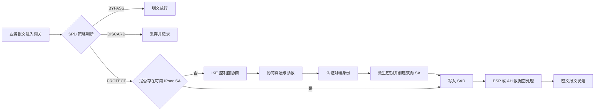

IPsec 的三类核心状态如下：

| 对象 | 作用 | 典型内容 |
|---|---|---|
| SPD（安全策略数据库） | 决定某类流量如何处理 | 五元组/网段、方向、PROTECT/BYPASS/DISCARD、隧道端点、所需保护模板 |
| SAD（安全关联数据库） | 保存已经建立的数据面 SA | SPI、目的地址、协议、算法、密钥、模式、序列号、抗重放窗口、生命周期 |
| IKE SA | 保护和管理后续 IKE 控制消息 | 双方身份、协商算法、控制面加密/完整性密钥、消息 ID、生命周期 |

### 3.2 IKE SA 与 IPsec SA 的方向性

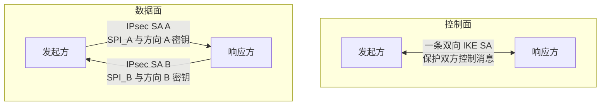

IPsec SA 之所以设计成单向，是因为两个方向的发送者、SPI、发送序列号、接收抗重放窗口、流量规模、生命周期和密钥更新时点都可能不同。接收方为其入站 SA 选择 SPI，因此两个方向会有不同的 SPI 和密钥材料。

IKE SA 常被描述为“双向”，是因为同一逻辑控制关联同时维护双方的 IKE 加密、完整性和消息状态；但 IKEv2 内部仍派生 `SK_ei/SK_er`、`SK_ai/SK_ar` 等方向性密钥。

## 4. 核心对象与报文字段

### 4.1 SA 的唯一定位

入站 IPsec SA 通常依据以下组合定位：

```text
目的 IP 地址 + 安全协议号（ESP 或 AH）+ SPI
```

其中 SPI 是接收方分配给发送方使用的 32 位标识。SPI 不是密钥，也不是算法编号。

### 4.2 Nonce、IV、会话密钥和序列号

| 名称 | 主要作用 | 是否保密 | 工程要求 |
|---|---|---|---|
| Nonce | 提供新鲜性、参与密钥派生、防止不同会话得到相同结果 | 通常不需要 | 随机性/唯一性符合协议要求，不得固定复用 |
| IV/Nonce | 使相同明文在同一密钥下不会总得到相同密文 | 通常不需要 | 满足具体加密模式的唯一性或不可预测性要求 |
| 会话密钥 | 实际执行对称加密或完整性保护 | 必须 | 按方向隔离、限制生命周期、安全清零 |
| 序列号 | 抗重放、构造 AEAD Nonce/AAD | 不需要 | 单调递增，结合滑动窗口处理，溢出前换 SA |

ESP 序列号通常不加密，因为接收方需要在解密前利用 `SPI + Sequence Number` 找到 SA 并执行低成本的抗重放预检查。序列号虽然可见，但必须受到完整性校验或 AEAD AAD 的保护，攻击者不能在不破坏认证标签的情况下篡改它。

## 5. IKEv1：RFC 2409 主模式与快速模式

IKEv1 通常分两个阶段：

- 第一阶段建立 IKE/ISAKMP SA，用于保护后续控制消息；
- 第二阶段快速模式建立成对的 IPsec SA，用于保护业务数据。

### 5.1 主模式：6 个报文

以下以数字签名认证为例。`HDR*` 表示首部之后的负载已使用第一阶段协商出的加密状态保护。

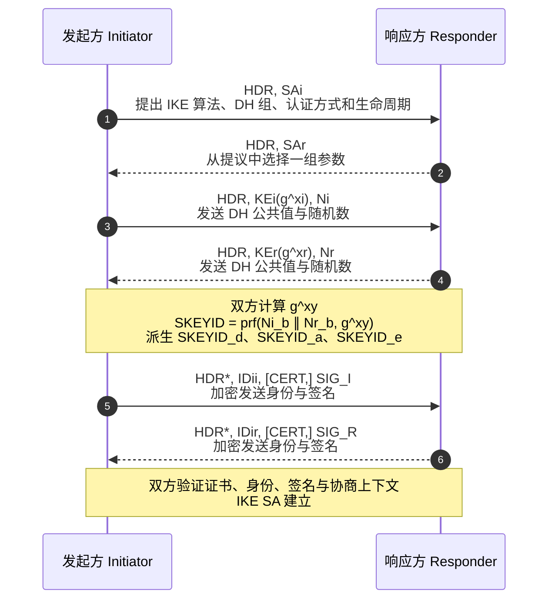

签名认证场景下的关键派生关系为：

```text
SKEYID   = prf(Ni_b | Nr_b, g^xy)
SKEYID_d = prf(SKEYID, g^xy | CKY-I | CKY-R | 0)
SKEYID_a = prf(SKEYID, SKEYID_d | g^xy | CKY-I | CKY-R | 1)
SKEYID_e = prf(SKEYID, SKEYID_a | g^xy | CKY-I | CKY-R | 2)
```

三类密钥材料的用途：

| 密钥材料 | 用途 |
|---|---|
| `SKEYID_d` | 派生非 IKE SA，即 ESP/AH 的 KEYMAT |
| `SKEYID_a` | IKE 控制消息认证 |
| `SKEYID_e` | IKE 控制消息加密 |

第一条加密消息的 IV 由双方 DH 公共值相关材料散列得到；CBC 后续消息按照 RFC 2409 的规则衔接前一密文块。IV 不是密钥。

### 5.2 快速模式：3 个报文

快速模式不是“2 个报文”，而是三条消息；第三条确认双方已经对同一协商结果达成一致。

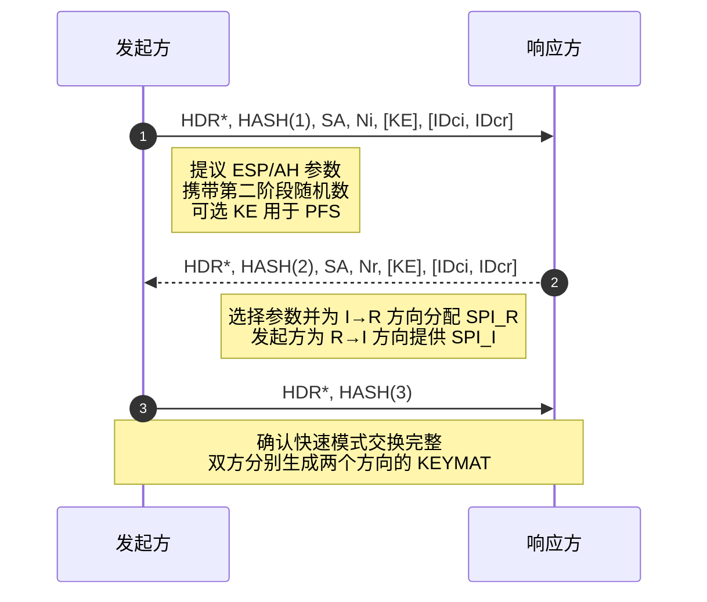

无 PFS 时，方向性 KEYMAT 的核心输入包括：

```text
KEYMAT = prf(SKEYID_d, protocol | SPI | Ni_b | Nr_b)
```

启用快速模式 PFS 时，还会加入新的 DH 共享秘密。由于两个方向使用不同的接收方 SPI，派生出的 KEYMAT 也不同。

### 5.3 IKEv1 完整生命周期

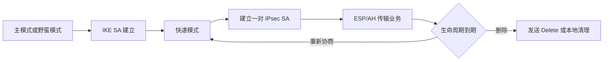

野蛮模式报文更少，但身份保护和抗离线攻击能力通常弱于主模式；是否允许应由产品安全策略明确规定。

## 6. GM/T 0022—2023：IKEv1/ISAKMP 衍生的 1.1 国密协议画像

### 6.1 不能把它理解成“把 AES 换成 SM4”

GM/T 0022—2023 仍采用第一阶段主模式、第二阶段快速模式，因此属于 IKEv1/ISAKMP 家族；但其 Header 版本字段为 `0x11`，不能与上游 RFC 2409 风格的 IKEv1 1.0 画等号。它在以下方面具有专用语义：

- IKE 版本和算法/认证编号；
- 签名证书与加密证书的双证书用途；
- 主模式第 2～4 个报文中的证书和数字信封结构；
- `Ski/Skr`、`Ni/Nr`、`SKEYID` 及后续密钥派生关系；
- 主模式加密初始 IV 的构造；
- 快速模式 HASH 输入顺序与数据面 KEYMAT 生成；
- SM4-GCM 的密钥、Salt、IV、AAD 和认证标签组织方式。

因此，只在密码库中增加 SM2/SM3/SM4，不能证明协议实现符合该标准。

### 6.2 国密主模式流程

下图用抽象字段展示 GM/T 0022—2023 的关键语义；确切编码和校验范围应以标准原文为准。

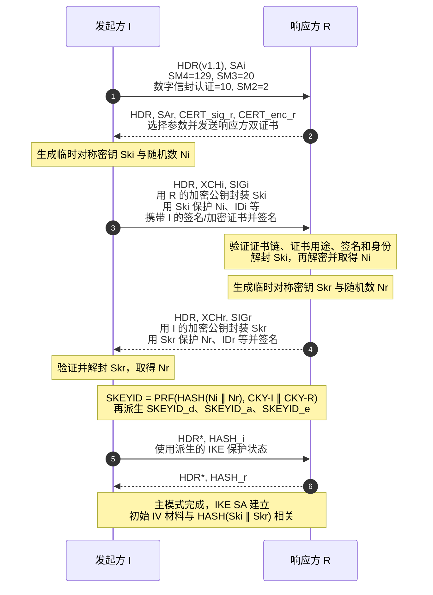

这里最容易混淆的三个概念是：

| 概念 | 正确含义 | 不是 |
|---|---|---|
| `Ski` | 发起方生成、用于数字信封内部数据保护的临时对称密钥 | DH 公共值、双方共同秘密、ESP 业务密钥 |
| `Skr` | 响应方生成的另一把临时对称密钥 | 与 Ski 相同的一把双向密钥 |
| `Ni/Nr` | 双方随机数，参与会话新鲜性和密钥派生 | IV、SPI、直接的数据面密钥 |

该路径的派生结构可概括为：

```text
SKEYID   = PRF(HASH(Ni | Nr), CKY-I | CKY-R)
SKEYID_d = PRF(SKEYID, CKY-I | CKY-R | 0)
SKEYID_a = PRF(SKEYID, SKEYID_d | CKY-I | CKY-R | 1)
SKEYID_e = PRF(SKEYID, SKEYID_a | CKY-I | CKY-R | 2)
```

与 RFC 2409 签名认证路径相比，这些公式不再以 DH 共享秘密 `g^xy` 为核心输入。其安全性不能脱离完整的数字信封、签名、证书验证、随机数生成和消息校验机制单独判断。

### 6.3 国密快速模式与数据密钥

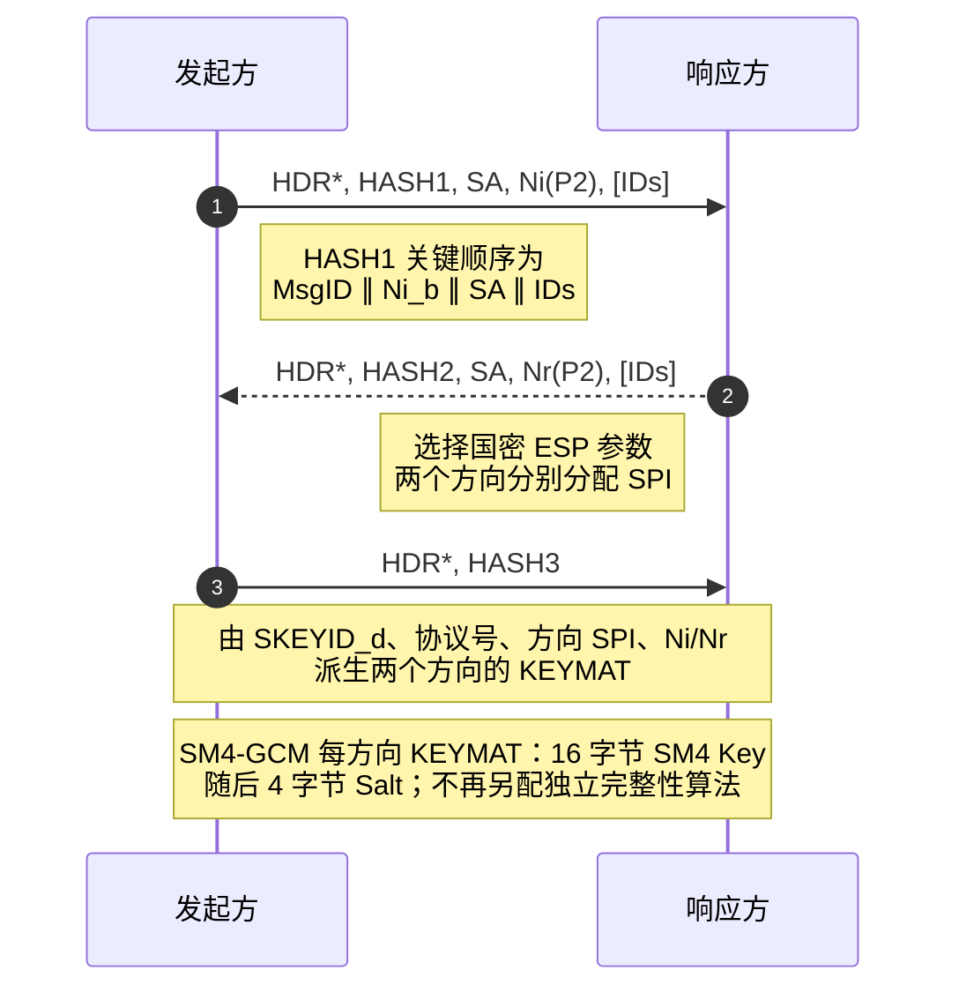

需要特别检查快速模式 HASH 的字段顺序。即使字段看起来相同，输入顺序不同也会导致双方验证失败；这类差异通常必须反映到报文处理和测试向量中。

### 6.4 与国际 IKEv1 的核心差异

| 观察点 | RFC 2409 常见签名路径 | GM/T 0022—2023 指定路径 | 工程影响 |
|---|---|---|---|
| 密钥建立核心 | DH 交换 `KEi/KEr` 并计算 `g^xy` | 双向数字信封交换 `Ski/Skr` 和 `Ni/Nr` | 报文状态机、密码调用和 KDF 输入均不同 |
| 证书 | 通常一张签名/认证证书 | 签名证书与加密证书分工 | 证书解析、用途校验、密钥选择和 HSM 接口不同 |
| 认证方式编号 | 按 IANA/IKEv1 注册语义 | `10` 具有国密数字信封语义 | 不能脱离配置文件仅按整数解释 |
| 主模式消息 | M3/M4 为 KE 与 Nonce，M5/M6 传身份与签名 | M2 起交换证书，M3/M4 为 XCH 与签名，M5/M6 为 HASH | 不能复用原 RFC 状态机只换算法 |
| SKEYID 派生 | 输入包括 DH 共享秘密 | 输入为 `HASH(Ni∥Nr)` 与 Cookie | KDF 实现和测试向量不同 |
| 快速模式 HASH | RFC 定义的载荷顺序 | 存在国标规定的专用顺序 | 编码顺序和验签输入必须精确一致 |
| 数据面 AEAD | 依具体扩展定义 | 规定 SM4-GCM Key、Salt 和 AAD 组织 | ESP 快速路径、Nonce 构造和抓包解析不同 |

对 strongSwan 6.0.3 上游的逐文件差距，见 [GM/T 0022—2023 与 strongSwan 6.0.3 上游差距分析](GM-T%200022-2023%20与%20strongSwan%206.0.3%20上游差距分析.md)。

## 7. IKEv2：流程、改进与国密编号问题

### 7.1 基本交换：4 个报文、2 次往返

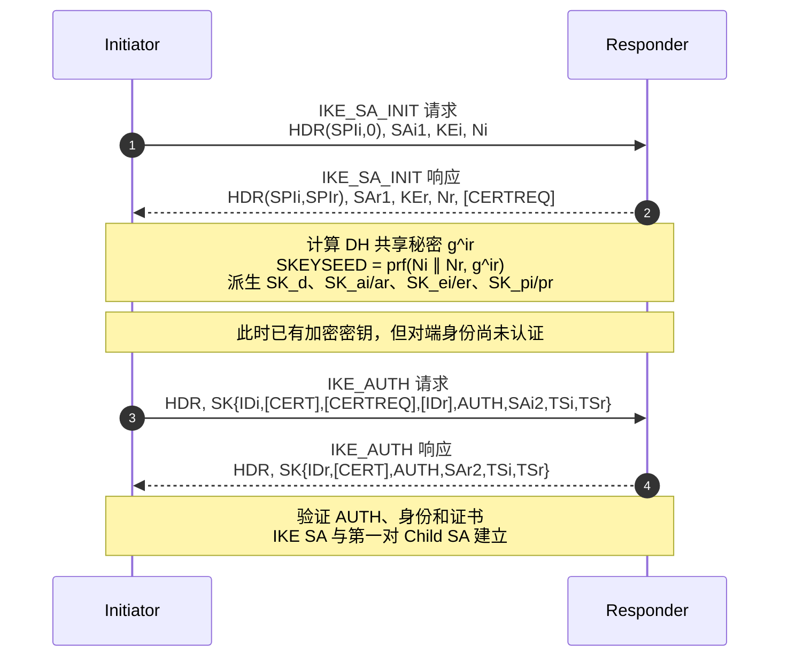

第一对 Child SA 的方向性 KEYMAT 由 `SK_d` 与双方 Nonce 等输入通过 `prf+` 扩展得到。以后使用 `CREATE_CHILD_SA` 创建或重协商 Child SA，也可重协商 IKE SA；需要 Child SA PFS 时，应在该交换中携带新的 KE。`INFORMATIONAL` 用于删除、错误通知和存活检测等管理操作。

### 7.2 IKEv2 相对 IKEv1 的主要改进

| 维度 | IKEv1 | IKEv2 |
|---|---|---|
| 基本结构 | 第一阶段、第二阶段及多种模式 | `IKE_SA_INIT`、`IKE_AUTH`、`CREATE_CHILD_SA`、`INFORMATIONAL` 四类交换 |
| 建立开销 | 主模式 6 条 + 快速模式 3 条 | 基本路径 4 条消息即可建立 IKE SA 和首个 Child SA |
| 状态管理 | 多套语义和历史兼容路径 | 统一消息 ID、请求/响应模型和错误通知 |
| NAT/移动性/扩展 | 多依赖扩展和实现经验 | 扩展框架更规整，NAT 穿越等能力集成度更高 |
| 可靠性 | UDP 重传与状态处理较复杂 | 明确定义请求方重传和消息配对 |
| 密钥隔离 | `SKEYID_d/a/e` | 控制面按方向拆分 `SK_ai/ar`、`SK_ei/er` 等 |

### 7.3 提议匹配与错误分支

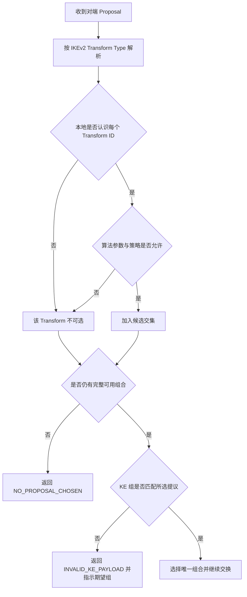

### 7.4 IKEv2 中如何扩展国密算法

双方不是在通信时临时询问“编号是什么意思”，而是在产品发布或部署前就已经实现并配置了相同的协议映射。在线协商只能寻找双方已知算法集合的交集。

截至 2026-09-18，[IANA IKEv2 Parameters](https://www.iana.org/assignments/ikev2-parameters/) 注册表中没有正式注册的 SM2、SM3、SM4 Transform 编号。相关 IETF 草案《Using ShangMi (SM) Cipher Suites in IKEv2》已经过期，草案中的编号仍为 TBD，不能当作正式标准编号。

工程上如需 IKEv2 + 国密算法，应形成明确的、双方一致的扩展配置文件，至少规定以下内容；该路线不应直接标注为 GM/T 0022 合规：

- IKEv2 版本和适用场景；
- `ENCR`、`PRF`、`INTEG`、`DH/KE`、认证/签名的具体编号；
- 编号是否使用 IANA Private Use 范围及冲突管理方法；
- SM2 曲线、签名编码、用户标识 `ZA`、SM3/SM4 模式和参数；
- AEAD 的 Key、Salt、IV、AAD、Tag 长度；
- 证书模型、认证载荷计算规则和测试向量；
- 至少两家实现的互操作结果。

绝对不能直接复制 IKEv1 国标编号或 TLS 的国密编号到 IKEv2。不同协议的编号空间彼此独立。

## 8. 算法编号为什么会“不一致”

### 8.1 线上语义不是只有一个整数

算法的准确线上语义应理解为：

```text
协议 + 版本 + 所在字段/命名空间 + 编号 + 参数
```

例如整数 `10` 在某一 IKEv1 认证方法空间里可能表示一种国际注册算法，而在特定国密配置文件中可能表示数字信封认证。只比较整数会产生严重误判。

### 8.2 三层映射模型

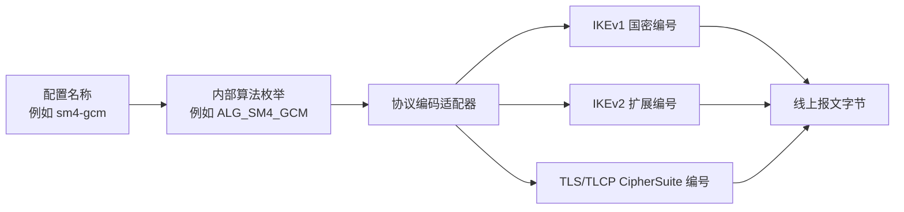

推荐在代码中分离：

1. 面向用户的算法名称；
2. 密码库/硬件密码模块的内部算法 ID；
3. 每种协议及版本的线上编号。

这样可以避免“同一算法只有一个全局编号”的错误设计。

### 8.3 协商的真实含义

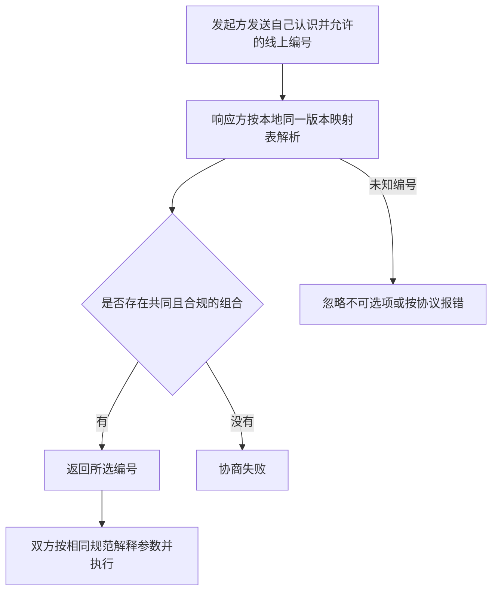

协商解决的是“共同支持哪个已定义算法”，不是“动态学习未知编号的含义”。

## 9. ESP、AH 与 IP 数据保护

### 9.1 ESP 与 AH 的职责

| 协议 | 机密性 | 完整性/来源认证 | 抗重放 | 典型使用情况 |
|---|---|---|---|---|
| ESP | 支持 | 支持；AEAD 同时完成加密与认证 | 支持 | 主流 IPsec VPN 数据保护 |
| AH | 不支持 | 支持，并覆盖部分不可变 IP 首部字段 | 支持 | 较少使用；与 NAT 兼容性较差 |

AEAD 算法（如 GCM）已经同时提供机密性和完整性，不应再为同一 ESP SA 配置独立完整性算法，除非具体配置文件另有明确规定。

### 9.2 隧道模式与传输模式

| 模式 | 被保护内容 | 外层首部 | 典型场景 |
|---|---|---|---|
| 传输模式 | 原 IP 包的上层载荷 | 保留原 IP 首部 | 主机到主机 |
| 隧道模式 | 整个原始 IP 包 | 增加新的外层 IP 首部 | 网关到网关、远程接入 VPN |

### 9.3 ESP 报文概念结构

```text
外层 IP 首部 | ESP SPI | ESP Sequence Number | Payload Data | Padding |
Pad Length | Next Header | Integrity Check Value / AEAD Tag
```

其中显式 IV 通常位于 `Payload Data` 的前部；具体布局取决于算法配置文件。

### 9.4 出站处理流程

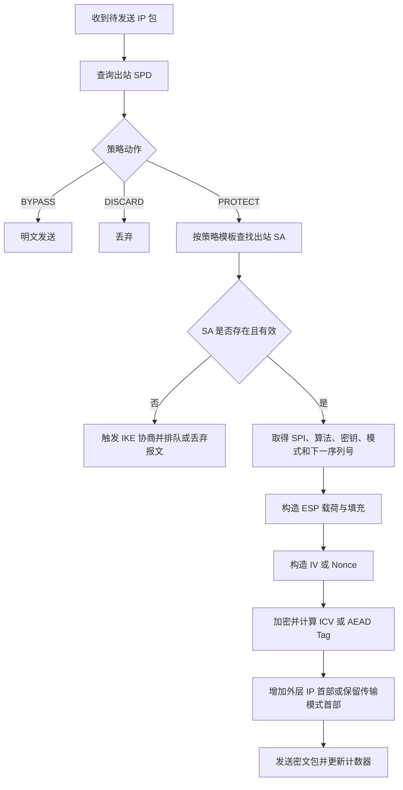

### 9.5 入站处理与抗重放

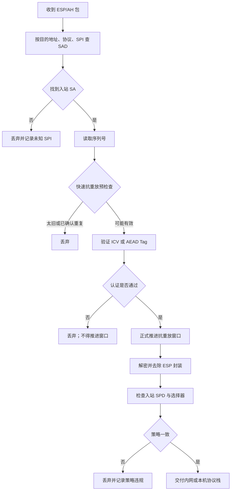

先做低成本预检查可以减少伪造高序列号报文造成的密码运算消耗，但**不能在认证通过前永久推进窗口**。否则攻击者可以伪造一个高序列号包，把真正合法的后续报文排除在窗口之外。

### 9.6 SM4-GCM 数据面要点

按适用国密配置文件实现时，典型的方向性材料包括：

```text
SM4 Key：16 字节
Salt：4 字节
显式 IV：8 字节
Nonce：Salt | Explicit IV
AAD：SPI | Sequence Number（启用扩展序列号时按相应规则）
Tag：通常 16 字节，最终以指定配置文件为准
```

GCM 最重要的工程约束是同一密钥下 Nonce 不得重复。序列号即将耗尽时必须提前重协商 SA，而不能回绕继续使用。

## 10. NAT 穿越与工程边界

NAT 会修改 IP 地址和端口，使原始 ESP/AH 处理面临兼容问题。NAT-T 通常通过 IKE 检测 NAT，并将 ESP 封装到 UDP 中传输。NAT-T 是传输封装与可达性机制，不是新的密码算法，也不会替代 ESP 的加密和完整性保护。

AH 会保护部分 IP 首部字段，因此与 NAT 的修改行为天然冲突；工程中远程接入和网关 VPN 通常以 ESP 为主。

## 11. 代码定位指南

| 功能域 | 代码中应能找到的模块 | 重点检查项 |
|---|---|---|
| 报文编解码 | IKE header/payload、ESP/AH parser/serializer | 长度、字节序、未知载荷、关键载荷、边界检查 |
| 状态机 | Main/Quick、IKE_SA_INIT/IKE_AUTH/CREATE_CHILD_SA | 消息顺序、重传、错误分支、超时、并发 SA |
| Proposal 匹配 | Transform/CipherSuite 注册表和选择器 | 编号命名空间、参数匹配、降级控制、未知编号 |
| 密钥派生 | PRF、PRF+、SKEYID、KEYMAT、KDF | 输入顺序、方向隔离、长度扩展、测试向量 |
| 证书与身份 | 证书链、用途、身份绑定、签名验签 | 双证书分工、有效期、吊销、算法约束、HSM 密钥选择 |
| 密码提供者 | SM2/SM3/SM4、AES、SHA、DH/ECDH | 算法参数、随机数、错误返回、侧信道和密钥清零 |
| SA 管理 | IKE SA、Child/IPsec SA、生命周期 | 两方向 SPI/密钥、重协商、删除、并发一致性 |
| SPD/SAD | 策略匹配与 SA 查询 | 五元组/网段、优先级、方向、隧道端点、策略回查 |
| ESP/AH 快速路径 | 封装、解封、GCM/CBC、ICV | Nonce/IV、AAD、Tag、填充、序列号溢出 |
| 抗重放 | 滑动窗口和扩展序列号 | 认证前预检、认证后推进、乱序、重复、窗口边界 |

## 12. 验收与证据链

### 12.1 不应只要求“一段代码”

协议能力通常跨越报文编解码、状态机、证书、KDF、密码库、SA 管理和数据面。对无法由单一代码段证明的要求，应组合以下证据：

1. **标准和配置文件声明**：准确到标准号、年份、协议版本和工作模式；
2. **线上编号映射表**：列出字段、十六进制编号、算法、参数和来源；
3. **代码位置**：关键处理函数、状态机分支和配置入口；
4. **抓包证据**：逐字节验证报文版本、载荷顺序、算法编号和 SPI；
5. **安全日志**：协商结果、证书校验、SA 建立和错误原因；
6. **测试向量**：验证 HASH、KDF、签名、加密、GCM AAD/Tag；
7. **互操作测试**：与独立实现完成正向通信；
8. **负向测试**：错误编号、错误签名、篡改报文、重放、过期证书、算法不匹配；
9. **数据面验证**：握手后通过真实业务流量，证明 SPD/SAD 和双向 ESP/AH 均已生效。

### 12.2 最小验收场景

| 场景 | 期望结果 |
|---|---|
| 双方存在共同提议 | 选择唯一合规组合并建立 SA |
| 无共同提议 | 明确失败，不得静默降级到禁用算法 |
| 未知/冲突算法编号 | 拒绝或忽略该项，不得误映射 |
| 证书用途错误 | 签名证书与加密证书不得混用 |
| 签名、HASH 或 AUTH 被篡改 | 握手失败且不得安装 SA |
| ESP Tag/ICV 被篡改 | 丢弃，不交付明文，不推进抗重放窗口 |
| 重放相同 ESP 包 | 首包可接受，重复包被丢弃 |
| 高序列号伪造包 | 认证失败，不能挤掉后续合法报文 |
| 单方向 SA 缺失 | 对应方向业务失败，日志能定位具体 SPI/SA |
| SA 生命周期到期 | 正确重协商或停止使用旧 SA，不得序列号回绕 |

## 13. 常见误区

- **误区：支持 SM2/SM3/SM4 就支持国密 IPsec。** 事实：还需匹配协议版本、线上编号、报文结构、证书模型、密钥派生和数据面格式。
- **误区：IKE 握手成功就代表 VPN 可用。** 事实：还需证明双向 IPsec SA、SPD、路由和真实业务流量。
- **误区：Ski/Skr 是 ESP 业务密钥。** 事实：它们是 GM/T 0022 指定主模式数字信封中的临时对称密钥。
- **误区：主模式派生出的三个 SKEYID 分别就是快速模式、认证和 ESP 密钥。** 事实：`SKEYID_d` 是后续 KEYMAT 的派生根；`SKEYID_a/e` 保护 IKE 控制面，实际 ESP 密钥还需按方向和 SPI 派生。
- **误区：IPsec SA 双向共用一个 SPI 和序列号。** 事实：两个方向是独立 SA。
- **误区：序列号可见就不安全。** 事实：序列号无需保密，但必须受完整性保护并参与抗重放。
- **误区：IKEv2 自带国密编号。** 事实：必须检查正式注册表和项目约定，不能跨协议复制编号。

## 14. 标准与参考资料

### 14.1 国际标准

- [RFC 4301 — Security Architecture for the Internet Protocol](https://www.rfc-editor.org/rfc/rfc4301.html)
- [RFC 4302 — IP Authentication Header](https://www.rfc-editor.org/rfc/rfc4302.html)
- [RFC 4303 — IP Encapsulating Security Payload](https://www.rfc-editor.org/rfc/rfc4303.html)
- [RFC 2409 — The Internet Key Exchange (IKE)](https://www.rfc-editor.org/rfc/rfc2409.html)
- [RFC 7296 — Internet Key Exchange Protocol Version 2 (IKEv2)](https://www.rfc-editor.org/rfc/rfc7296.html)
- [IANA — Internet Key Exchange Version 2 (IKEv2) Parameters](https://www.iana.org/assignments/ikev2-parameters/)
- [Expired IETF Draft — Using ShangMi (SM) Cipher Suites in IKEv2](https://datatracker.ietf.org/doc/draft-guo-ipsecme-ikev2-using-shangmi/)

### 14.2 国内标准

- [GM/T 0022—2023《IPSec VPN 技术规范》标准信息页](https://std.samr.gov.cn/hb/search/stdHBDetailed?id=1BF26B7AA001FD76E06397BE0A0A81D8)

> 使用提醒：标准信息页只能用于确认标准名称、编号和状态；实现时应取得正式标准文本，并根据项目约定确认是否存在补充配置文件、检测规范或行业要求。
