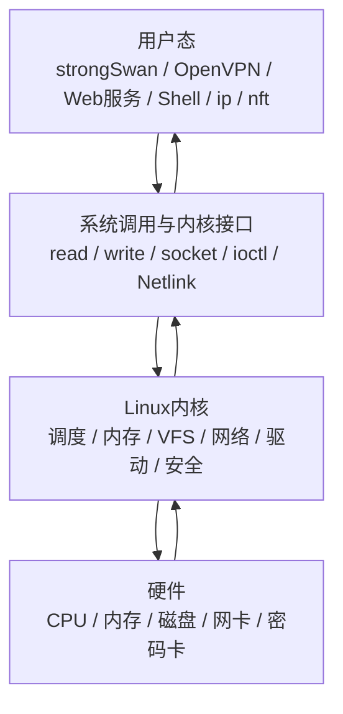
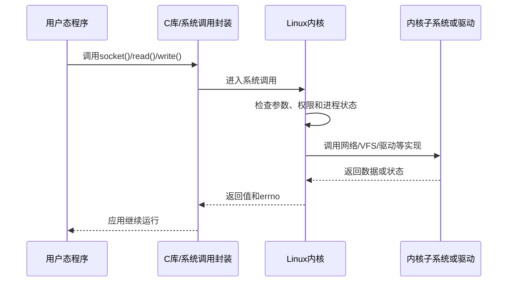
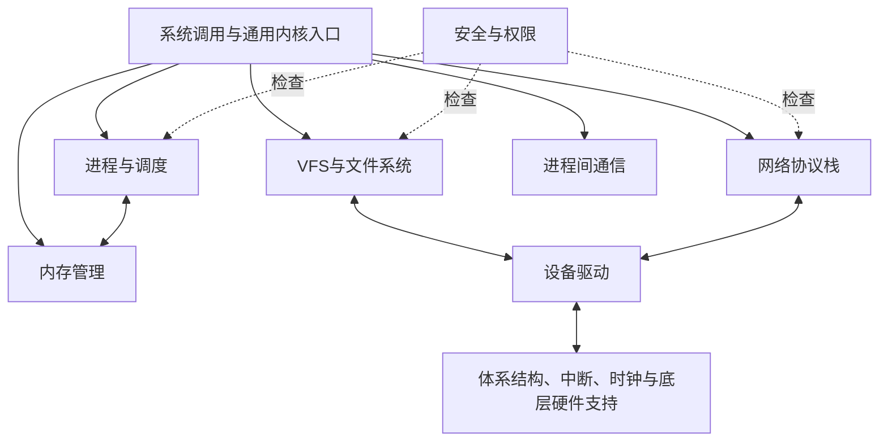
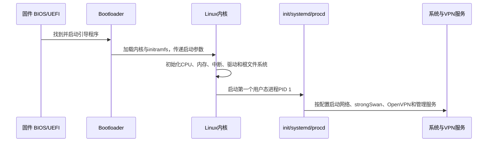
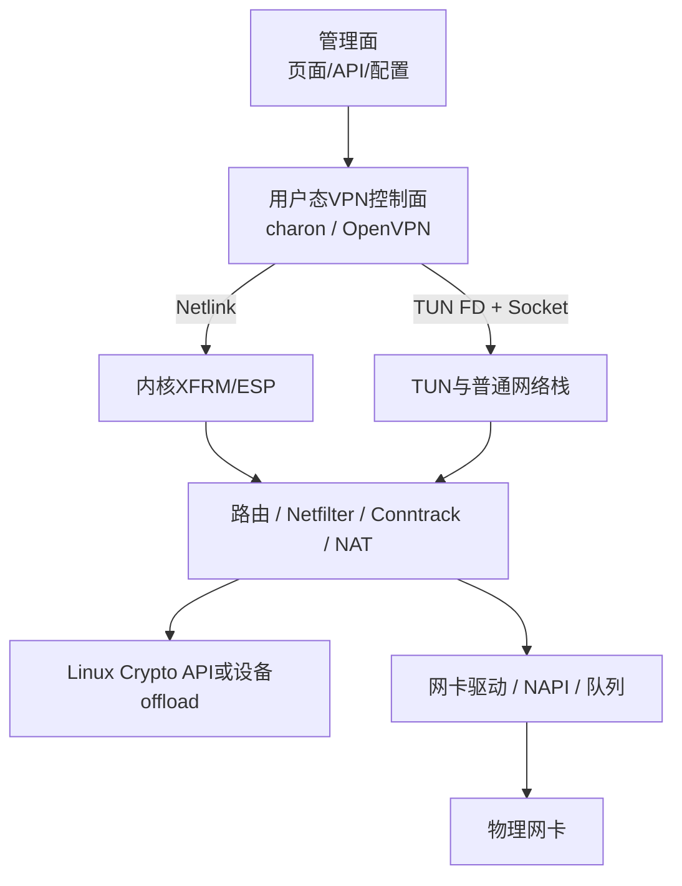

如果把一台Linux网关比作一家公司：

- 硬件是办公楼、机器和道路；
- 用户态程序是执行具体业务的部门，例如strongSwan、OpenVPN和Web管理服务；
- Linux内核是统一管理CPU、内存、设备、文件和网络的基础运行系统；
- Shell、`ip`、`nft`等命令是管理员与系统交互的工具。

Linux内核不是整个Linux系统，也不是某个VPN程序。它位于应用与硬件之间，为所有程序提供受控制、可共享的底层能力。

---

## 1. Linux、Linux发行版和Linux内核不是同一个概念

### 1.1 Linux内核

Linux内核负责：

```text
管理CPU运行谁
管理物理与虚拟内存
管理磁盘和文件系统
管理网卡及网络协议栈
管理各种设备驱动
提供进程间通信、安全隔离和权限检查
```

内核运行在CPU的特权级，可以访问硬件和整个系统内存。普通应用不能随意操作这些资源，只能通过内核提供的接口请求服务。

### 1.2 Linux发行版

Ubuntu、Debian、OpenWrt等发行版通常包含：

```text
Linux内核
+ 系统库（例如glibc或musl）
+ init与服务管理
+ Shell和命令行工具
+ 软件包管理器
+ 配置、服务和应用程序
```

所以“Ubuntu 24.04”和“Linux 6.x内核”是不同层次的版本。两个发行版可能使用相近内核，也可能带有不同补丁、配置和驱动。

### 1.3 用户态程序

strongSwan的`charon`、OpenVPN、Nginx、数据库和管理后台都属于用户态程序。它们有各自的虚拟地址空间，默认不能直接读取其他进程或内核内存。



---

## 2. 为什么需要内核

假设没有内核，每个应用都要自己解决：

- 当前CPU应该运行哪个程序；
- 内存地址会不会与其他程序冲突；
- 怎样读写不同型号的磁盘和网卡；
- 多个程序如何共享同一块网卡；
- 谁有权限读取文件、监听端口或修改路由；
- 硬件中断到来时由谁处理。

这不仅重复，而且无法安全协作。内核的核心价值可以概括为两点：

1. **抽象硬件**：应用使用Socket、文件和进程等统一对象，不必直接适配每种网卡与磁盘；
2. **管理与隔离资源**：决定CPU、内存、设备和网络能力怎样被不同程序安全共享。

---

## 3. 用户态怎样请求内核工作

### 3.1 系统调用是主要入口

应用调用`read()`、`write()`、`socket()`或`mmap()`时，最终需要通过系统调用进入内核。系统调用会完成特权级切换、参数检查、权限检查和具体子系统处理，然后把结果返回应用。



程序中看似普通的函数并不一定都进入内核，例如纯字符串处理通常只在用户态执行；涉及文件、网络、进程、内存映射或设备时，往往需要系统调用。

### 3.2 `/proc`、`/sys`和Netlink也是接口

- `/proc`：展示进程和大量内核运行状态，例如`/proc/interrupts`；
- `/sys`：以对象层次展示设备、驱动、队列等内核对象；
- Netlink：用户态与内核交换结构化网络配置和事件，例如路由、接口、Netfilter与XFRM；
- `ioctl`：对文件描述符所代表的设备或对象执行特定控制，例如创建TUN设备。

`ip route`不是自己维护另一套路由表。它通过Netlink读取或修改内核路由对象；`nft`同样把规则提交给内核执行。

---

## 4. Linux内核由哪些主要部分组成

内核各子系统并不是互不联系的独立程序，而是在同一个内核地址空间中协作。Linux通常被称为宏内核架构，同时支持把大量功能编译成可加载模块；“宏内核”不等于所有功能必须永远编进一个不可拆分文件。



### 4.1 进程管理与调度器

职责：

- 创建、退出、等待进程和线程；
- 保存每个任务的运行状态；
- 决定哪个可运行任务获得CPU；
- 完成上下文切换、定时器和信号处理；
- 支持优先级、实时调度、CPU亲和性与控制组。

对网关的影响：OpenVPN用户态数据面能否得到足够CPU、`charon`建链任务是否及时处理、软中断和业务线程怎样争用CPU，都与调度有关。

调度不是简单地“每个进程固定轮流运行”。现代Linux会综合调度类别、权重、可运行状态、CPU拓扑和亲和性等因素。官方调度文档也说明，普通任务调度机制在持续演进，例如CFS正在让位于EEVDF相关实现，因此学习时应理解目标和观测方法，不要把某一版本的内部细节当作永远不变。[Linux scheduler documentation](https://docs.kernel.org/scheduler/)

### 4.2 内存管理

职责：

- 为每个进程提供独立虚拟地址空间；
- 把虚拟地址映射到物理内存；
- 分配和回收用户态、内核态内存；
- 支持页缓存、内存映射、缺页处理和交换；
- 管理NUMA、HugePage、内存压力和回收。

对网关的影响：数据包缓冲、连接表、SA对象、TLS/IKE状态、OpenVPN队列和DPDK HugePage都依赖内存管理。内存泄漏、频繁分配、NUMA跨节点访问或缓存不友好，都会降低性能。

Linux官方内存管理文档把虚拟内存、按需分页、用户与内核分配、文件映射等都归入这一子系统。[Linux memory management](https://docs.kernel.org/admin-guide/mm/)

### 4.3 VFS与文件系统

VFS（Virtual File System）是在不同文件系统之上的统一抽象。应用使用`open()`、`read()`、`write()`等接口，无论底层是ext4、tmpfs、procfs还是其他实现。

关键对象的入门理解：

| 对象 | 简单作用 |
| --- | --- |
| superblock | 一次挂载文件系统的总体信息 |
| inode | 一个文件对象的元数据与操作能力 |
| dentry | 路径名组成部分与目录项缓存 |
| file | 某次已打开文件的运行时对象 |
| FD | 当前进程文件描述符表中的索引 |

官方VFS文档说明，VFS既为用户程序提供统一文件系统接口，也允许多种具体文件系统实现共存；用户态FD会定位到内核中的`file`对象及其操作方法。[Linux VFS overview](https://docs.kernel.org/filesystems/vfs.html)

对网关的影响：配置、证书、日志、设备节点和Socket都可以通过文件描述符参与统一的等待与读写模型。`/dev/net/tun`本身就是设备节点。

### 4.4 网络协议栈

职责：

- Socket接口；
- Ethernet、ARP/邻居子系统；
- IPv4/IPv6、路由与策略路由；
- TCP、UDP、ICMP等协议；
- Netfilter、Conntrack、NAT；
- 网络命名空间、bridge、veth、VLAN和VRF；
- XFRM、ESP与部分网络卸载；
- qdisc、流量控制、网卡队列与NAPI。

这是VPN网关最需要深入的内核部分，但也不能孤立学习：网络包占用内存、由CPU调度处理、通过驱动进入网卡，并受到安全权限和Namespace隔离。

### 4.5 设备驱动

驱动把统一内核接口连接到具体硬件：网卡、磁盘、USB、PCIe设备、密码卡等。

以网卡为例，驱动负责：

- 初始化设备和队列；
- 管理DMA描述符环；
- 处理中断并调度NAPI；
- 把收到的包交给网络栈；
- 把待发送包交给硬件；
- 暴露offload和统计能力。

HSM或密码卡并不是“安装SDK就自动进入VPN路径”。还需要驱动、用户态接口或内核密码/卸载接口，以及上层协议栈真实调用证据。

### 4.6 进程间通信（IPC）

IPC让进程或线程交换数据与同步状态，包括：

- pipe和FIFO；
- Unix Domain Socket；
- 共享内存；
- 信号量、futex与各种同步原语；
- 信号；
- Netlink等面向内核通信的机制。

网关管理服务、VPN守护进程、日志进程和Web后台经常通过Socket、消息总线或共享状态协作。IPC错误可能表现为“界面配置成功，但底层服务没有收到”。

### 4.7 安全与隔离

内核执行：

- 用户、组和文件权限；
- capabilities，例如修改网络配置需要的`CAP_NET_ADMIN`；
- Namespace与cgroup隔离；
- LSM框架以及SELinux、AppArmor等安全模块；
- seccomp系统调用过滤；
- 密钥保管相关内核设施。

`root`权限不是一个程序应当长期拥有全部能力的理由。产品化网关需要按进程职责缩小权限，并验证失败和降权路径。

### 4.8 中断、时钟与体系结构支持

内核还负责：

- 响应硬件中断；
- 管理时钟、定时器和时间；
- 处理系统调用入口和CPU异常；
- 支持x86、ARM64等体系结构；
- 完成启动早期的硬件初始化。

VPN中的重传、DPD、rekey、会话超时和高精度性能测量都离不开时间与定时器；网卡收包则与中断、NAPI和软中断密切相关。

---

## 5. Linux启动时内核处于什么位置



这解释了两个边界：

- 内核启动成功不代表VPN服务已经启动；
- VPN进程运行不代表所需内核模块、算法、XFRM或网卡驱动能力都存在。

---

## 6. 在VPN网关项目中，各层分别做什么



### IPsec/strongSwan

```text
charon在用户态完成IKE协商
→ 通过Netlink安装XFRM Policy与State
→ Linux内核逐包执行ESP
```

### OpenVPN传统数据面

```text
Linux路由把内层IP包送到TUN
→ OpenVPN用户态读取、加密
→ 通过UDP/TCP Socket交回Linux内核
→ 内核路由、排队并经网卡发出
```

### 密码算法

- IKE/TLS/TLCP用户态密码可能由OpenSSL、Tongsuo、Provider或HSM接口完成；
- XFRM/ESP软件数据面通常使用Linux Crypto API；
- 密码卡数据面需要明确的内核驱动或卸载路径；
- DCO、XFRM offload、XDP和DPDK都会改变包在哪一层被处理，必须基于源码和运行证据确认。

---

## 7. Linux内核源码目录怎样看

不需要从第一行开始阅读。先把常见目录放回子系统：

| 目录 | 主要内容 | 与网关的关系 |
| --- | --- | --- |
| `arch/` | x86、ARM64等体系结构相关实现 | 系统调用、中断、原子操作、CPU特性 |
| `block/` | 块设备I/O层 | 固件、日志和存储性能 |
| `crypto/` | Linux Crypto API和部分算法 | XFRM、内核密码能力 |
| `drivers/` | 网卡、PCI、USB、TUN等驱动 | NIC、TUN、密码卡 |
| `fs/` | VFS与具体文件系统 | 配置、证书、日志、proc/sysfs |
| `include/` | 公共头文件和数据结构声明 | 阅读结构体和接口契约 |
| `init/` | 内核启动与初始化 | 启动链和内核参数 |
| `ipc/` | System V IPC等 | 进程协作的一部分 |
| `kernel/` | 调度、信号、定时器等核心功能 | 线程运行、rekey定时器、同步 |
| `mm/` | 内存管理 | 包缓冲、连接表、性能 |
| `net/` | 网络协议栈和网络子系统 | 路由、TCP/IP、Netfilter、XFRM |
| `security/` | LSM等安全框架 | 进程权限和系统加固 |
| `tools/` | perf、testing等配套工具 | 性能和内核验证 |

阅读某个问题时只进入相关链条。例如“IPsec已建链但业务不通”：

```text
strongSwan CHILD_SA安装
→ net/xfrm/
→ net/ipv4/esp4.c或IPv6对应实现
→ 路由与Netfilter
→ net/core/与网卡驱动
```

不要因为出现`skb`就通读整个`net/core/`。

---

## 8. 用几条命令认识正在运行的内核

### 8.1 查看内核与系统身份

```bash
uname -a
cat /proc/version
cat /etc/os-release
```

前两项回答内核版本和构建信息；`os-release`回答发行版身份。它们不是同一个版本。

### 8.2 查看已加载模块

```bash
lsmod
```

这只能看到当前以模块形式加载的功能。直接编入内核的功能不会因为`lsmod`没有显示就不存在。

### 8.3 查看CPU、内存和进程

```bash
lscpu
free -h
ps -e -o pid,ppid,stat,comm
```

这些是用户态工具读取内核暴露的状态，不是直接扫描硬件。

### 8.4 查看网络内核对象

```bash
ip -br link
ip route
ss -s
nft list ruleset
ip -s xfrm state
ip -s xfrm policy
```

> **XFRM State可能包含会话密钥**
> `ip xfrm state`通常会显示认证或加密密钥，只能在受控终端本地核对；截图、提交Git或对外发送前必须脱敏。
>

### 8.5 查看内核日志

```bash
dmesg --level=err,warn
```

内核日志能看到驱动、内存、设备和协议错误，但“没有错误日志”不等于功能已正确执行。某些系统限制普通用户读取`dmesg`，这是安全策略而不是命令失效。

---

## 9. 最容易出现的错误理解

| 错误理解 | 正确理解 |
| --- | --- |
| Linux就是Ubuntu | Ubuntu是包含Linux内核和用户态软件的发行版 |
| strongSwan属于内核 | strongSwan主体在用户态，ESP通常由内核XFRM执行 |
| OpenVPN的所有包都在内核加密 | 传统OpenVPN数据通道在用户态处理，内核负责TUN、Socket和转发 |
| 加载模块就证明功能在使用 | 模块存在只证明能力可能可用，还要证明真实执行路径 |
| 内核支持SM4就证明IPsec用了SM4 | 还要核对协商、XFRM State、计数、PCAP和负面测试 |
| DPDK是更快的Linux网络栈 | DPDK通常让应用绕开或替代一部分传统内核数据路径，代价是重新承担大量能力 |
| 内核代码必须全部学会 | 工程师应掌握系统地图和关键链条，再按问题下钻 |

---

## 10. 学完本篇，你应该能讲清楚

1. Linux内核与Ubuntu、OpenWrt、Shell和VPN程序分别是什么关系？
2. 用户态程序为什么不能直接随意操作网卡和物理内存？
3. 系统调用、`/proc`、`/sys`、Netlink和`ioctl`分别如何连接用户态与内核？
4. 调度、内存、VFS、网络、驱动、安全子系统分别解决什么问题？
5. strongSwan/IPsec和OpenVPN分别在哪些阶段进入内核？
6. 为什么只看`lsmod`、配置文件或“连接成功”都不足以证明真实数据路径？

如果能沿着“用户程序 → 内核接口 → 子系统 → 驱动 → 硬件”复述一个VPN包，就可以进入后面的内核收发包、Netfilter、TUN和XFRM专题。

---

## 11. 权威资料

- [The Linux Kernel documentation](https://docs.kernel.org/)
- [Linux scheduler](https://docs.kernel.org/scheduler/)
- [Linux memory management](https://docs.kernel.org/admin-guide/mm/)
- [Linux VFS overview](https://docs.kernel.org/filesystems/vfs.html)
- [Linux networking documentation](https://docs.kernel.org/networking/index.html)
- [Linux driver APIs](https://docs.kernel.org/driver-api/index.html)
