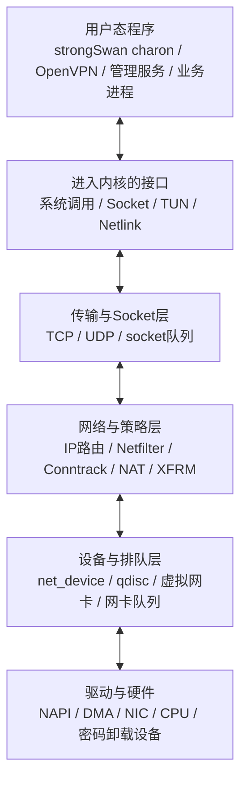
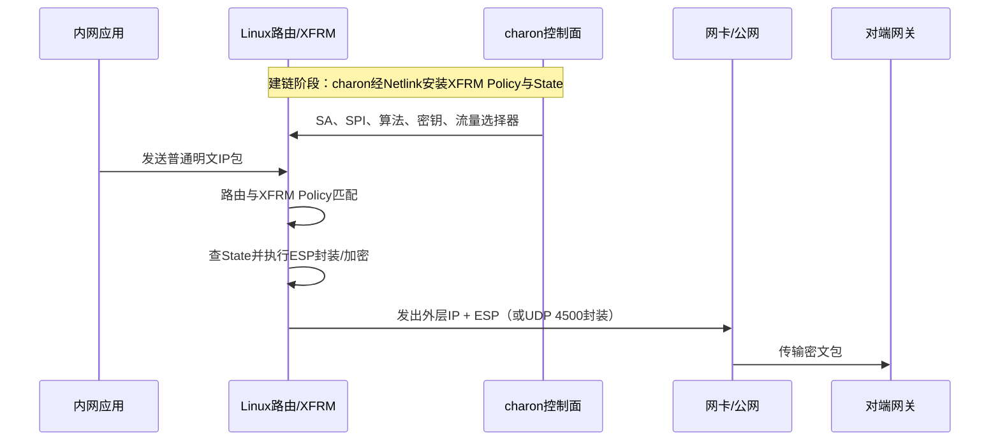
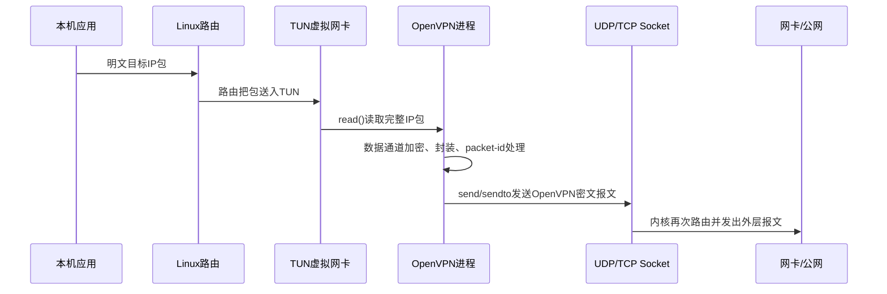
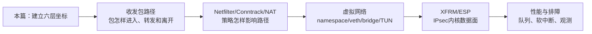
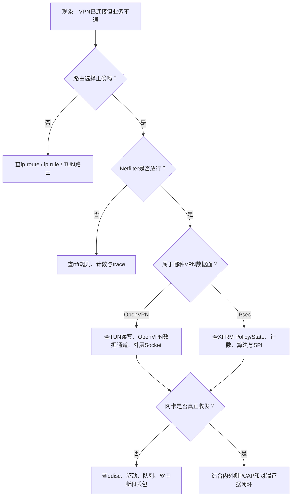

这套专题不准备把你训练成“通读Linux内核的人”，而是让你真正接通安全网关中最重要的一条链：

```text
管理配置或业务程序
→ 系统调用
→ Socket/TUN/Netlink
→ Linux网络栈
→ 路由、Netfilter、Conntrack、NAT
→ XFRM/ESP或OpenVPN用户态数据通道
→ 网卡驱动和物理网络
```

学完后的目标不是背函数名，而是面对“VPN已连接但业务不通”“吞吐下降”“策略没命中”“数据包究竟在哪里加密”时，能先判断问题属于哪一层，再用对应证据缩小范围。

---

## 1. 先建立一张总地图

把一台Linux安全网关看成六层，后面的所有名词都必须放回这张图中理解。



这六层里，最容易混淆的是“应用做了什么”和“内核替应用做了什么”。

- strongSwan的`charon`主要负责IKE控制面：协商、认证、派生密钥，并通过Netlink把SA和策略下发给内核。正常的ESP业务包不必逐包返回`charon`处理。
- OpenVPN传统数据面是用户态路径：内核把明文IP包交给TUN，OpenVPN进程读取、加密后通过UDP/TCP Socket再次交回内核；反向流量则解密后写回TUN。
- Linux内核负责真实转发、路由、过滤、NAT、队列和驱动；采用XFRM时，还负责ESP封装、校验、加解密与防重放。

这就是为什么只理解IKE或TLS握手还不够。握手成功只证明控制面完成了一部分工作，无法单独证明内核策略命中、ESP可用、TUN路由正确或业务能够转发。

---

## 2. 一个业务包的两条VPN路径

### 2.1 strongSwan/IPsec：控制面下发，内核逐包处理



这里的关键分工是：

```text
charon决定“应建立什么安全关系”
Linux XFRM执行“每个包怎样按安全关系处理”
```

因此，排查IPsec要同时看三组事实：

1. `charon`日志和IKE抓包：控制面是否协商成功；
2. `ip -s xfrm state/policy`：内核是否存在正确的SA与策略，计数是否增长；
3. 业务包、路由、防火墙和公网PCAP：数据面是否真正经过ESP路径。

### 2.2 OpenVPN：同一业务包两次经过内核，中间由用户态加密



这里有两个容易误判的点：

- TUN里出现明文是设计使然，不表示VPN没有加密；判断公网是否加密要看物理网卡上的外层报文。
- TLS/TLCP控制通道采用某种算法，不等于OpenVPN数据通道自动采用同一种算法；两者的密钥和包处理链需要分别验证。

---

## 3. 内核里真正传递的对象是什么

### 3.1 文件描述符：用户态握住的“句柄”

应用调用`socket()`、`open("/dev/net/tun")`后得到一个整数文件描述符（FD）。FD不是数据包，也不是内核对象本身，而是当前进程文件表中的索引。`read()`、`write()`、`sendmsg()`等系统调用通过它找到内核中的Socket或TUN对象。

### 3.2 `struct sk_buff`：内核网络栈中的包及其说明书

Linux网络栈通常用`struct sk_buff`（常简称`skb`）在各层之间携带一个网络包及其元数据。更准确地说，`skb`本体主要是描述信息，实际数据缓冲区可能单独存在、被多个对象共享或使用分片结构。官方内核文档把它称为Linux网络代码中表示数据包的主要结构，并专门解释了它与数据缓冲区、校验和及分段卸载的关系。[Linux sk_buff documentation](https://docs.kernel.org/networking/skbuff.html)

你暂时不需要背结构体全部字段，先抓住六类信息：

| 信息 | 回答的问题 |
| --- | --- |
| 数据起点与长度 | 包的头和载荷在哪里 |
| MAC/网络/传输层偏移 | Ethernet、IP、TCP/UDP头从哪里开始 |
| 输入/输出设备 | 包从哪个设备进、准备从哪个设备出 |
| 协议与路由结果 | 这是IPv4、IPv6还是其他协议，下一跳是什么 |
| Netfilter/Conntrack信息 | 防火墙与连接跟踪怎样看待这个流 |
| 校验和、GSO/GRO等状态 | 哪些工作由内核或网卡延后、合并、卸载 |

### 3.3 `struct net_device`：内核看到的网络设备

物理网卡、TUN/TAP、veth、bridge等在内核中都会呈现为网络设备。它们的底层实现不同，但上层路由和网络栈可以通过相对统一的设备抽象发送、接收和统计报文。

这也是Linux能把“虚拟隧道接口”和“真实网卡”接在同一套路由、Netfilter和队列体系中的基础。

---

## 4. 学习边界：你要掌握到什么颗粒度

### 核心掌握

你需要能够：

- 画出本机流量和转发流量的收发包路径；
- 解释`skb`、网络设备、Socket队列、路由、Netfilter和XFRM在路径中的位置；
- 分清OpenVPN的TUN用户态数据面与IPsec的XFRM内核数据面；
- 用系统状态、计数器、日志和PCAP确定包停在哪一层；
- 从一个可观察现象找到对应的内核子系统和关键源码入口。

### 工程会用

你应该能借助文档完成：

- 查看路由、策略路由、接口、队列、Netfilter、Conntrack与XFRM状态；
- 使用`ss`、`ip`、`nft`、`conntrack`、`ethtool`、`nstat`和`perf`收集证据；
- 读懂关键内核函数的输入、输出和下一跳；
- 设计一个命名空间、veth、路由和TUN相关的小型实验。

### 暂不展开

目前不要求：

- 从零编写网卡驱动或内核模块；
- 记忆所有`skb`字段和每个Netfilter优先级；
- 通读整个`net/`目录；
- 在没有性能数据前就引入XDP、AF_XDP或DPDK；
- 把某个Linux版本的内部函数名当成跨版本稳定API。

---

## 5. 这套专题怎样读



每篇都用同一个方法：

```text
先看系统位置
→ 再跟一个真实数据包
→ 再认关键对象
→ 再定位关键函数
→ 最后用命令和反例验证
```

不要把源码函数单独抄进笔记。每看到一个函数，都回答四个问题：

1. 谁在什么条件下调用它？
2. 输入的包或对象处于什么状态？
3. 它改变了什么状态或做了什么判断？
4. 成功和失败分别把对象交给谁？

---

## 6. 你最终要形成的故障定位闭环



这张图体现了一个重要工程原则：不要一看到“VPN不通”就继续修改密码算法，也不要一看到CPU高就立即上DPDK。先找到数据包最后一次被确认出现的位置，再进入下一层。

---

## 7. 本篇掌握检查

1. 为什么`charon`建链成功不能证明ESP业务包能够通过？
2. OpenVPN发送一个业务包时，为什么同一个包会以明文和密文形态两次进入Linux网络路径？
3. FD、内核Socket、`skb`和网络设备分别解决什么问题？
4. 如果TUN接口计数增长、外层物理网卡计数不增长，你会优先检查哪几层？
5. 如果公网PCAP有ESP，但内网目标收不到包，为什么还不能认定是加密算法的问题？

能够不用术语堆砌、沿图说明这五题后，再进入下一篇。

---

## 8. 权威资料入口

- [Linux Networking Documentation](https://docs.kernel.org/networking/index.html)
- [Linux Networking and Network Devices APIs](https://docs.kernel.org/networking/kapi.html)
- [Linux `sk_buff` documentation](https://docs.kernel.org/networking/skbuff.html)
- [Linux TUN/TAP documentation](https://docs.kernel.org/networking/tuntap.html)
- [Linux XFRM documentation](https://docs.kernel.org/networking/xfrm/index.html)
- [network_namespaces(7)](https://man7.org/linux/man-pages/man7/network_namespaces.7.html)

本文中的源码入口以Linux主线网络栈的稳定概念为坐标。未来接管产品代码时，应先确认产品内核版本、补丁集、硬件卸载和发行版配置，再核对准确行号与实际执行路径。
