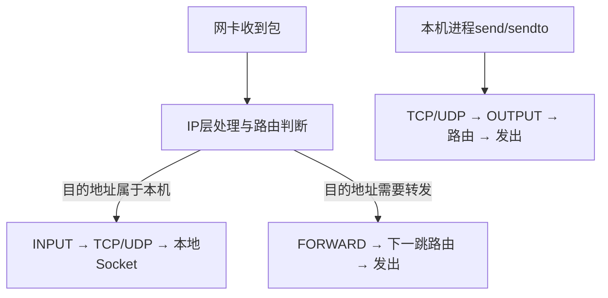
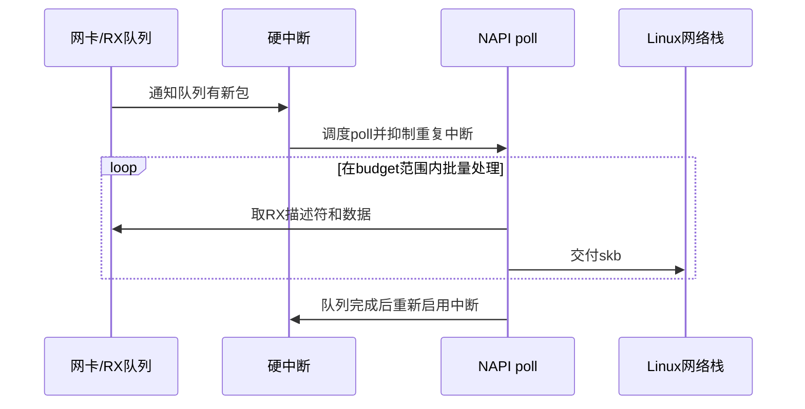
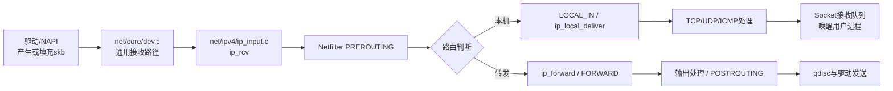
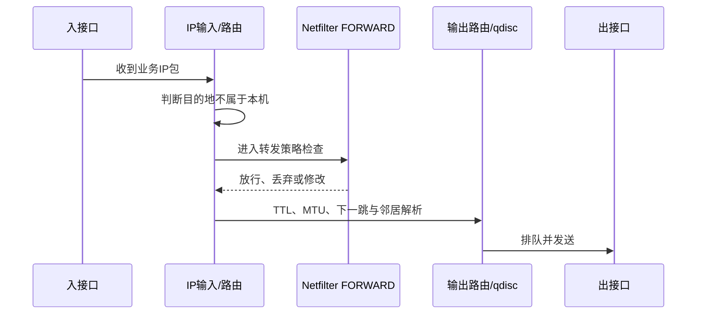

本篇只解决一个问题：**一个包从网卡进入Linux以后，怎样被送给本机进程或转发出去；反向发送时又怎样到达网卡。**

先理解普通收发包路径，后面的Netfilter、TUN和XFRM才能各就各位。否则你看到某个函数或计数器，只会知道它存在，不知道它位于整条链的哪里。

---

## 1. 先区分三种路径

同一台网关上的IP包并不都走同一条路。



| 路径 | 典型场景 | 最容易误看的地方 |
| --- | --- | --- |
| 本地输入 | IKE、OpenVPN、HTTPS管理端口收到外部报文 | 误把到本机进程的包当作转发流量 |
| 本地输出 | `charon`、OpenVPN或管理进程主动发包 | 误以为必经FORWARD链 |
| 网关转发 | LAN客户端访问另一网络 | 只看本机Socket，忽略该包根本不交给本地应用 |

VPN网关同时大量使用三种路径。IKE和OpenVPN控制报文通常是本地输入/输出；被网关转发的业务流量则涉及FORWARD；XFRM会在普通IP路径上增加策略匹配和变换。

---

## 2. 入站：网卡收到包以后发生什么

### 2.1 从线缆到内存：NIC、DMA与RX Ring

网卡先接收链路上的帧。它通常不会让CPU逐字节搬运数据，而是使用DMA把数据写入预先准备的内存缓冲区，并在接收描述符环（RX Ring）中更新状态。

你可以把RX Ring理解成网卡驱动和网卡共同维护的一圈“待处理包槽位”。它解决的是高速到包时如何减少频繁分配和CPU搬运。

### 2.2 为什么不能每个包都完整中断一次

如果每个包都触发一次完整硬中断，高PPS下CPU会被中断淹没。Linux使用NAPI把“中断通知”和“批量轮询处理”结合起来：

1. 新包到达，网卡触发中断；
2. 驱动暂时抑制该队列的进一步中断并调度NAPI实例；
3. 内核在轮询预算内批量回收RX描述符、构造包并交给网络栈；
4. 队列清空或本轮预算结束后，决定继续调度还是重新启用中断。

Linux官方文档将NAPI描述为内核网络栈使用的事件处理机制，通常由设备中断调度，处理工作一般运行在软中断上下文中。[Linux NAPI documentation](https://docs.kernel.org/networking/napi.html)



### 2.3 驱动怎样把包交给网络栈

驱动从RX队列取出数据，准备`struct sk_buff`或等价的页/分片表示，填写协议、设备、校验和与卸载状态，然后交给通用网络接收路径。

关键源码坐标通常包括：

| 位置 | 代表性入口 | 作用 |
| --- | --- | --- |
| 网卡驱动 | 各驱动的NAPI `poll`回调 | 从硬件RX Ring回收包 |
| `net/core/dev.c` | `netif_receive_skb()`及其内部接收路径 | 把驱动交来的包送入协议栈 |
| Ethernet处理 | `eth_type_trans()`等 | 识别上层协议并设置包类型 |
| GRO路径 | `napi_gro_receive()`等 | 在允许时聚合同一流的小包，降低后续处理次数 |

`netif_receive_skb()`被官方内核API文档描述为从设备向上层协议处理器传递接收缓冲区的主要函数之一，调用环境通常是软中断上下文。[Linux networking KAPI](https://docs.kernel.org/networking/kapi.html)

注意：不同内核版本、驱动和硬件卸载会改变具体调用细节。工程中应把这些函数当作源码坐标，而不是不经验证地声称每个产品都逐行经过同一分支。

---

## 3. `skb`沿协议栈向上走

以一个IPv4包为例，简化路径如下：



### 3.1 `ip_rcv()`并不是“处理完IPv4”

它是IPv4输入链的一个入口，负责必要的包检查并把包继续送到Netfilter和路由相关路径。真正的重要设计是：**每个函数只完成当前层的职责，并通过回调、协议注册或下一阶段函数继续传递`skb`。**

### 3.2 路由判断是分叉点

路由不仅回答“从哪个接口发出”，还决定包是交给本机还是转发。可以用下面的心智模型理解：

```text
输入：目的地址、源地址、入接口、Mark、策略路由规则、命名空间等
处理：查询路由和策略
输出：本地交付，或一个包含下一跳与输出设备的路由结果
```

如果一个包被错误地判定为本地目标，继续检查FORWARD链毫无意义；如果它应当转发却没有开启IP转发，Socket层也看不到它。

### 3.3 本地交付如何到达Socket

IP层根据协议号把包交给TCP、UDP等传输层。传输层再根据地址、端口、网络命名空间和Socket状态查找目标Socket：

- UDP通常把完整数据报排入接收队列；
- TCP先处理序列号、确认、重传、乱序和状态机，再把连续字节交给Socket接收缓冲；
- 当队列从不可读变为可读时，等待中的线程或`epoll`观察者可被唤醒。

因此，`epoll_wait()`返回可读，并不是网络包绕过内核直接“通知”应用，而是前面的驱动、协议栈和Socket队列已经把状态推进到可读。

---

## 4. 转发：为什么网关不需要为每个业务流创建Socket

转发包的目的地址不是网关本机。完成入站检查和路由判断后，内核执行转发路径，并查询下一跳路由、TTL/Hop Limit、MTU以及输出设备。



关键源码坐标：

- `net/ipv4/ip_forward.c`中的`ip_forward()`：IPv4转发主路径坐标；
- `net/ipv4/ip_output.c`：IPv4输出和下一跳发送相关路径；
- `net/core/dev.c`中的`__dev_queue_xmit()`：进入设备发送排队的重要坐标；
- `net/sched/`：qdisc与流量控制实现所在区域。

这里没有业务应用Socket，因为Linux作为路由器处理三层包。防火墙、NAT、XFRM和流量控制可以在这条路径上生效，但它们不要求一个用户进程逐包接收普通转发流量。

---

## 5. 出站：本地进程调用`send()`以后发生什么

以UDP为例，简化路径如下：


每一层解决的问题不同：

| 层 | 主要工作 | 失败的典型表现 |
| --- | --- | --- |
| Socket/传输层 | 端口、协议状态、发送缓冲 | `send`报错、阻塞或队列积压 |
| IP与路由 | 源/目的地址、下一跳、MTU | 无路由、选错出口、PMTU问题 |
| Netfilter/NAT | 策略、状态、地址转换 | 被DROP、源地址未转换、状态异常 |
| qdisc | 软件排队、整形、调度 | 延迟增长、丢包、队列拥塞 |
| 驱动/NIC | 描述符、DMA、物理发送 | TX error、ring满、链路问题 |

OpenVPN的外层UDP/TCP报文就是从这里发出；`charon`发送IKE报文也走本地输出路径。两者都不是“VPN专用内核通道”，而是使用普通Socket进入网络栈。

---

## 6. GRO、GSO、TSO和校验和卸载为什么会影响抓包

为了降低每包处理成本，Linux和网卡可能合并或延后工作：

- GRO：接收侧把同一流的多个包聚合成较大的`skb`，减少上层处理次数；
- GSO：发送侧允许协议栈先处理一个较大的逻辑包，稍后再分段；
- TSO：由网卡执行TCP分段；
- checksum offload：校验和可能在网卡发送时才真正写入，或由硬件在接收时验证。

所以在本机抓包时看到“大包”“校验和错误”或包数与线上不同，不应立即判断网络异常。先确认抓包点和卸载状态：

```bash
ethtool -k eth0
ip -s link show dev eth0
```

抓包工具看到的是路径某一位置上的软件表示，不一定等于线缆上的最终帧。需要严格验证时，应结合对端或镜像口抓包。

---

## 7. 逐层观察，不要先改参数

下面是一组只读检查。接口名请按实际环境替换。

### 7.1 接口、地址和链路计数

```bash
ip -br link
ip -br address
ip -s link show dev eth0
```

观察：接口是否UP、地址是否正确、RX/TX包数是否随实验增长、drop/error是否增加。

### 7.2 路由和策略路由

```bash
ip route show table all
ip rule show
ip route get 203.0.113.10
```

`ip route get`比只看默认路由更有价值，因为它让内核针对一个具体目的地址给出实际选择。

### 7.3 Socket与队列

```bash
ss -s
ss -lntup
ss -tin
```

观察：进程是否监听正确地址和端口，TCP状态是什么，发送/接收队列是否持续积压。

### 7.4 协议统计与软中断

```bash
nstat -az
cat /proc/softirqs
cat /proc/net/softnet_stat
```

`/proc/net/softnet_stat`是每CPU的十六进制统计，字段随内核版本演进。使用前应查对应内核文档或源码，不要把第三列、第四列等固定解释复制到所有系统。

### 7.5 驱动与队列

```bash
ethtool -i eth0
ethtool -l eth0
ethtool -S eth0
```

不是所有驱动都支持全部查询。缺少字段表示当前驱动未提供，不等于值为零。

---

## 8. 一次典型故障怎样定位

现象：客户端能建立VPN，但访问内网服务超时。

错误做法是立刻修改协议或密码代码。正确顺序是找“最后一个确认点”：

1. 客户端是否真的产生目标业务包；
2. VPN入口的TUN或XFRM计数是否增长；
3. 路由查询是否选择内网接口；
4. FORWARD策略是否放行；
5. 出接口TX是否增长；
6. 内网目标或中间链路是否收到；
7. 回包是否沿对称或允许的路径返回。


每确认一格，就排除其左侧的大部分假设。只有确认包进入了具体密码处理路径并在那里失败，才应优先修改密码实现。

---

## 9. 源码阅读方法

建议在对应Linux源码树中按下面顺序读，而不是从`net/core/dev.c`第一行开始：

```text
一个可观察入口
→ 一个主函数
→ 它对skb做的核心判断
→ 成功下一跳
→ 丢包/错误下一跳
→ 关联计数器或tracepoint
```

第一轮只跟这些坐标：

| 目标 | 目录/文件坐标 | 先回答什么 |
| --- | --- | --- |
| 通用接收 | `net/core/dev.c` | 驱动交来的包怎样分派 |
| IPv4输入 | `net/ipv4/ip_input.c` | 包怎样进入路由和本地交付 |
| IPv4转发 | `net/ipv4/ip_forward.c` | 哪些条件允许继续转发 |
| IPv4输出 | `net/ipv4/ip_output.c` | 输出包怎样走向设备 |
| UDP | `net/ipv4/udp.c` | 如何查找Socket并排队 |
| TCP | `net/ipv4/tcp_input.c`、`tcp_output.c` | TCP状态和字节流怎样推进 |

不要一次展开所有宏和内联函数。先能把一条正常路径讲通，再通过失败现象进入局部分支。

---

## 10. 本篇掌握检查

1. NAPI为什么同时需要中断和轮询，而不是只选一种？
2. 本地输入、转发、本地输出三条路径怎样从路由决策上区分？
3. `epoll`观察到Socket可读之前，数据至少经过了哪些内核层？
4. 为什么本机PCAP中的“大包”或“错误校验和”不一定是线上真实异常？
5. 一个转发包没有到达出接口时，你怎样用计数器找到最后确认点？

---

## 11. 权威资料

- [Linux NAPI](https://docs.kernel.org/networking/napi.html)
- [Linux Networking and Network Devices APIs](https://docs.kernel.org/networking/kapi.html)
- [Linux `sk_buff`](https://docs.kernel.org/networking/skbuff.html)
- [Linux network scaling: RSS/RPS/RFS/XPS](https://docs.kernel.org/networking/scaling.html)
- [socket(7)](https://man7.org/linux/man-pages/man7/socket.7.html)
- [epoll(7)](https://man7.org/linux/man-pages/man7/epoll.7.html)
