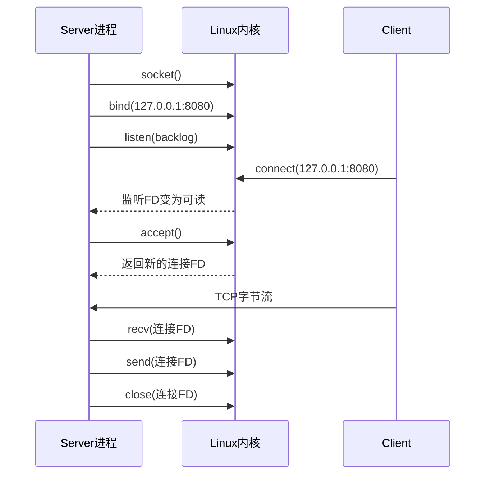
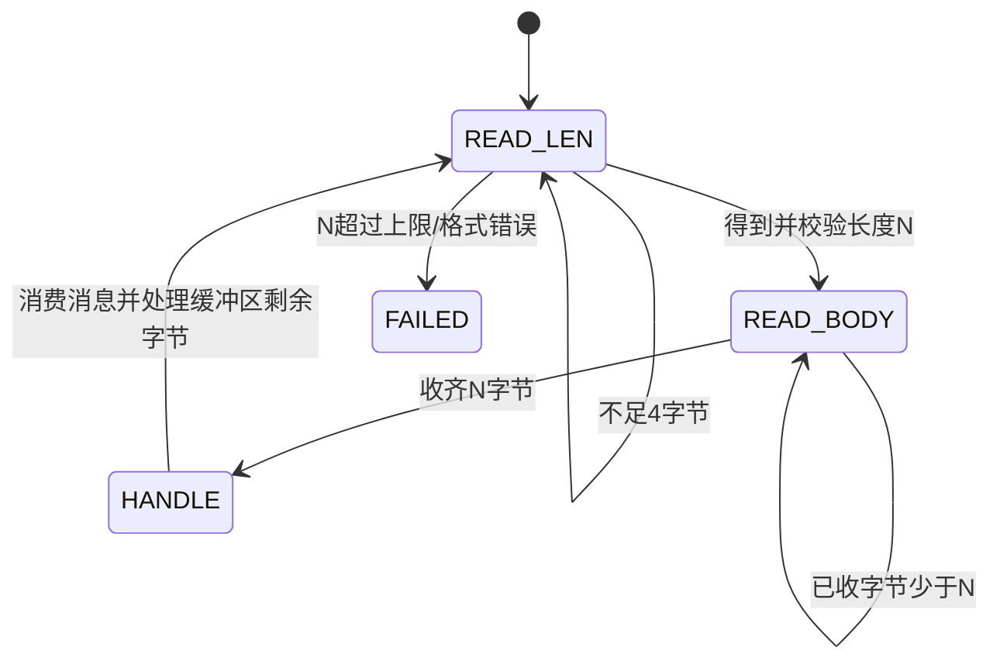
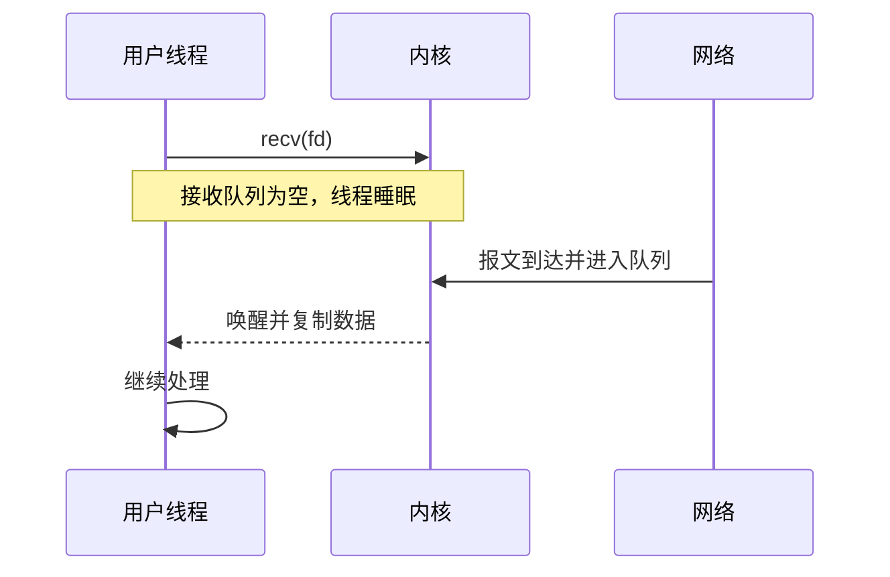

> **配套材料**：本文引用的网络编程示例与只读快照脚本见[源码与使用说明](/downloads/network-examples.zip)。解压后保留 `examples/` 目录结构；脚本未在本次发布中重新实测。


> 本文从一个TCP Echo Server出发，解释Socket、地址、端口、监听队列、连接FD、TCP字节流、UDP数据报以及正常/异常关闭。目标不是从空白默写代码，而是能读懂、运行、修改并诊断一条真实收发链路。

## 1. Socket到底是什么

人话解释：**Socket是进程使用内核网络能力的一扇门**。

程序调用：

```c
int fd = socket(AF_INET, SOCK_STREAM, 0);
```

产生的不是一个“网络包”，而是：

1. 内核创建一个Socket对象；
2. 当前进程的FD表增加一个入口；
3. 返回一个整数`fd`，以后程序用它引用该对象。


### 1.1 三个参数分别决定什么

| 参数 | 示例 | 决定什么 |
| --- | --- | --- |
| 地址族 | `AF_INET`、`AF_INET6` | 使用IPv4还是IPv6地址格式 |
| 类型 | `SOCK_STREAM`、`SOCK_DGRAM` | 字节流还是数据报语义 |
| 协议 | 通常为`0` | 由前两个参数选择默认协议，如TCP或UDP |

错误理解：`SOCK_STREAM`表示程序每次发送一条完整消息。
正确理解：它只提供有序可靠的字节流，消息边界必须由应用协议定义。

## 2. 地址、端口和字节序

服务端常见地址结构：

```c
struct sockaddr_in addr = {
    .sin_family = AF_INET,
    .sin_port = htons(8080),
    .sin_addr.s_addr = htonl(INADDR_LOOPBACK),
};
```

每个字段的作用：

- `sin_family`告诉内核怎样解释这块结构；
- `sin_port`是传输层端口，`htons()`把主机字节序转换为网络字节序；
- `sin_addr`是IPv4地址；`INADDR_LOOPBACK`对应本机回环范围；
- 调用`bind()`时通常把它转换成通用的`struct sockaddr *`，长度另行传递。

端口不是进程编号。它是协议栈用于分发TCP/UDP流量的标识。一个服务最终由“协议、地址、端口”等条件共同定位。

## 3. TCP Server六个核心动作



### 3.1 `socket()`：创建内核通信端点

成功返回非负FD，失败返回`-1`并设置`errno`。必须检查返回值，否则后续报错会掩盖真正根因。

### 3.2 `bind()`：声明本地地址

`bind()`把Socket和本地地址/端口关联。常见失败包括：

- `EADDRINUSE`：端口已被占用，或旧连接状态影响重新绑定；
- `EACCES`：权限或安全策略不允许；
- 地址不是本机可用地址。

`SO_REUSEADDR`不是“无条件抢占端口”，它只是调整地址复用规则，仍需理解当前监听和TCP状态。

### 3.3 `listen()`：把Socket变为监听Socket

监听FD不负责承载某个客户端的业务字节流。它代表一个服务入口，内核为到来的连接维护队列。`backlog`也不是“最大在线用户数”的简单同义词。

### 3.4 `accept()`：取出一条已建立连接

`accept()`返回一个**新的连接FD**：

```text
listen_fd = 3   持续接受后续连接
client_fd = 4   只代表客户端A
client_fd = 5   只代表客户端B
```

监听FD继续存在。关闭某个`client_fd`不会关闭整个服务。

Linux上，新连接FD不能被默认理解为继承监听FD的`O_NONBLOCK`。工程代码可使用`accept4(..., SOCK_NONBLOCK | SOCK_CLOEXEC)`原子设置所需标志，或者显式调用`fcntl()`。

### 3.5 `recv()`：从内核接收队列复制数据

对TCP Socket，返回值必须分类：

| 返回值 | 含义 | 正确动作 |
| --- | --- | --- |
| `> 0` | 本次得到的字节数 | 处理这些字节；可能还不是完整消息 |
| `0` | 对端完成有序关闭，读方向到达EOF | 停止继续读，按状态处理剩余输出 |
| `-1, EINTR` | 被信号中断 | 通常重试当前调用 |
| `-1, EAGAIN/EWOULDBLOCK` | 非阻塞模式下现在没有数据 | 等待后续就绪，不是断线 |
| 其他`-1` | 真正错误 | 记录`errno`，转失败/关闭路径 |

### 3.6 `send()`：把数据交给内核发送队列

返回正数表示本次接收了多少字节，可能小于要求长度。正确程序必须保存未发送部分：

```c
size_t off = 0;
while (off < len) {
    ssize_t n = send(fd, buf + off, len - off, MSG_NOSIGNAL);
    if (n > 0) {
        off += (size_t)n;
        continue;
    }
    /* EINTR重试；EAGAIN留给事件循环；其余错误进入失败路径 */
}
```

在阻塞式教学代码中循环等待可以接受；在非阻塞服务器中，不能在这里忙等，而要把`off`保存在连接对象中，等可写事件再继续。

`MSG_NOSIGNAL`可以避免向已关闭连接写入时进程被`SIGPIPE`默认终止，但仍必须处理`EPIPE`等错误。

## 4. TCP是字节流：最容易产生的错误

假设发送端：

```c
send(fd, "HELLO", 5, 0);
send(fd, "WORLD", 5, 0);
```

接收端可能看到：

```text
HELLOWORLD
```

也可能先收到`HEL`，随后收到`LOWORLD`。TCP只保证字节有序、可靠地交付，不保存应用调用边界。

### 4.1 应用怎样恢复消息边界

常用方法：

| 方法 | 示例 | 风险/适用场景 |
| --- | --- | --- |
| 固定长度 | 每条记录64字节 | 格式固定，空间可能浪费 |
| 分隔符 | 一行以`\n`结束 | 必须限制最大长度并处理转义 |
| 长度前缀 | `4字节长度 + payload` | 二进制协议常用，必须校验长度和溢出 |
| 自描述格式 | HTTP头、TLV | 灵活，但解析器更复杂 |

长度前缀解析状态可以表示为：



这是理解TLS Record、OpenVPN控制消息和很多二进制协议解析器的重要基础。

## 5. FIN、半关闭、RST和TIME_WAIT

### 5.1 FIN与`recv()==0`

FIN表示对端不会再发送更多字节，但不必然表示本端不能继续发送。这就是TCP全双工和半关闭：

```text
对端 shutdown(SHUT_WR)
→ 本端 recv()最终返回0
→ 本端仍可发送剩余响应
→ 完成后再关闭写方向或close
```

如果一看到`recv()==0`就立即丢弃所有待发送缓存，代理可能截断响应。

### 5.2 RST

RST表示连接被复位。程序可能在读写时看到`ECONNRESET`、`EPIPE`等错误。不能把它与正常EOF混成一种情况，因为日志、重试和审计含义不同。

### 5.3 TIME_WAIT

主动完成连接关闭的一方通常进入`TIME_WAIT`，目的是处理网络中的旧报文并确保关闭可靠。大量短连接可能产生很多`TIME_WAIT`，但“看到很多就全部调内核参数消除”不是正确诊断。先判断连接模型、谁主动关闭、是否可复用长连接以及端口范围。

## 6. UDP与TCP的根本差异

UDP Server最小主线：

```text
socket(SOCK_DGRAM)
→ bind
→ recvfrom / sendto
→ close
```

没有`listen()`和`accept()`。每个数据报携带来源地址，内核保留单个数据报边界。

| 维度 | TCP | UDP |
| --- | --- | --- |
| 抽象 | 有序可靠字节流 | 尽力而为数据报 |
| 连接建立 | 三次握手 | 无传输层握手 |
| 消息边界 | 不保留 | 保留 |
| 丢包/乱序处理 | TCP内核处理 | 应用协议决定 |
| 拥塞控制 | TCP提供 | 应用自行设计或使用上层协议 |
| 典型VPN用途 | OpenVPN TCP、TLS承载 | IKE、NAT-T、OpenVPN UDP |

`connect()`也可用于UDP，但它不创建TCP那样的连接；它主要固定默认对端并让程序使用`send()/recv()`，同时影响错误传递与过滤行为。

UDP一次`recvfrom()`提供的缓冲区太小时，数据报可能被截断，剩余部分不会像TCP那样在下次继续交付。因此协议必须限制并校验报文长度。

## 7. 阻塞是什么意思

阻塞不是程序“死掉”，而是当前线程进入等待，直到条件满足、超时、被信号中断或发生错误。



阻塞模型适合第一条教学链、简单工具和连接数很少的程序。问题不是“阻塞一定差”，而是一个线程被某条连接长期占用后无法处理其他工作。并发方案可以是多进程、多线程、协程或非阻塞事件循环，各有成本。

## 8. 手工实验：先观察，再自动化

配套文件：

```text
examples/network-programming/blocking_echo_server.c
examples/network-programming/epoll_echo_server.c
examples/network-programming/Makefile
```

### 8.1 编译

在仓库根目录执行：

```bash
cd examples/network-programming
make
```

- `cd`切换工作目录；
- `make`按`Makefile`调用编译器；
- 成功后得到`blocking_echo_server`和`epoll_echo_server`；
- 编译警告也应处理，不能只看退出码为0。

### 8.2 启动阻塞服务器

终端A：

```bash
./blocking_echo_server 18080
```

`./`表示运行当前目录中的文件，`18080`是传给程序的端口参数。

终端B：

```bash
nc 127.0.0.1 18080
```

输入一行内容，应收到原样回显。另开终端执行：

```bash
ss -lntp 'sport = :18080'
```

观察监听地址、端口、进程与FD。再执行：

```bash
strace -f -e trace=network,read,write,close ./blocking_echo_server 18081
```

然后连接`18081`，观察`socket`、`bind`、`listen`、`accept`、`recvfrom/sendto`或等价系统调用的实际时间线。

### 8.3 制造一个可解释的现象

保持第一个`nc`连接不发送数据，再尝试第二个客户端。阻塞示例一次只处理一个已接受连接，所以第二个连接即使进入内核队列，也不会立即得到业务处理。

这不是TCP不能并发，而是**用户态程序的控制流选择**造成的。下一篇会用非阻塞和epoll解决它。

## 9. 从现象定位问题的最小工具集

| 工具 | 回答什么 | 不能单独证明什么 |
| --- | --- | --- |
| `ss -lntup` | 谁监听、连接状态、地址端口 | 业务消息是否正确 |
| `/proc/<pid>/fd` | 进程当前持有哪些FD | FD对应业务对象的全部语义 |
| `lsof -p <pid>` | 进程资源的可读视图 | 每次系统调用顺序 |
| `strace -f -e trace=network` | 真实系统调用、返回值和错误码 | 内核内部所有处理细节 |
| `tcpdump`/Wireshark | 网络上真实报文和时序 | 用户态为何做出某个状态决策 |
| 程序日志 | 业务状态和上下文 | 如果日志可能写错，不能替代系统证据 |

正确闭环是：源码说明程序应该做什么，系统调用说明它实际请求了什么，系统状态说明内核现在保存什么，PCAP说明线上出现了什么。

## 10. 常见错误与审查清单

- 忽略系统调用返回值或只打印“失败”不记录`errno`；
- 把TCP一次`recv()`当成一条完整消息；
- 假设`send()`总能写完；
- 把`recv()==0`当作错误，或反过来把RST当作正常EOF；
- 对网络输入声明任意长度数组或信任对端长度；
- 未限制连接数、消息长度、缓存和等待时间；
- 关闭连接时遗漏与它绑定的缓存、TLS对象、定时器或表项；
- 只做成功测试，不测慢客户端、突然断线、超长输入和端口占用。

## 11. 掌握检查

1. `socket()`返回的整数与内核Socket对象是什么关系？
2. 监听FD为什么不能直接替代连接FD读业务数据？
3. `recv()`的正数、0、`EAGAIN`和其他负数分别是什么含义？
4. 如何证明TCP不保存一次`send()`的消息边界？
5. 为什么UDP读取缓冲区过小与TCP部分读取不是同一回事？
6. 什么是半关闭，代理为什么必须正确传播它？
7. 怎样用`ss + strace + PCAP`区分“没连接”“连接了但没收”“收了但程序没处理”？

## 参考资料

- [Linux `socket(7)`手册](https://man7.org/linux/man-pages/man7/socket.7.html)
- [Linux `accept(2)`手册](https://man7.org/linux/man-pages/man2/accept.2.html)
- [Linux `tcp(7)`手册](https://man7.org/linux/man-pages/man7/tcp.7.html)
- [Linux `udp(7)`手册](https://man7.org/linux/man-pages/man7/udp.7.html)
- [Linux `recv(2)`手册](https://man7.org/linux/man-pages/man2/recv.2.html)
- [Linux `send(2)`手册](https://man7.org/linux/man-pages/man2/send.2.html)
