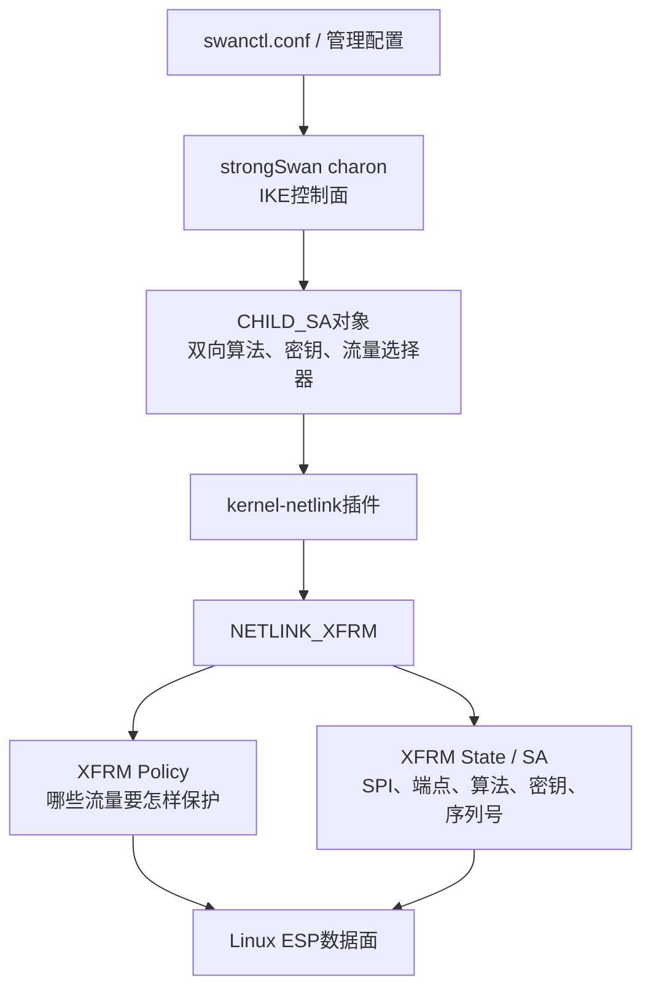
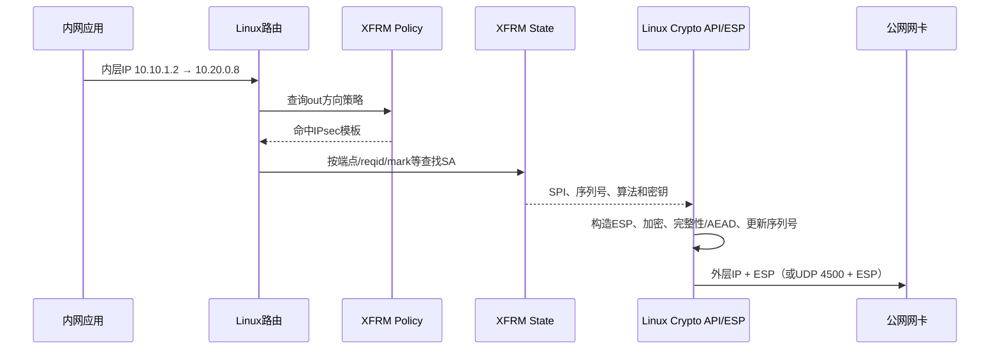
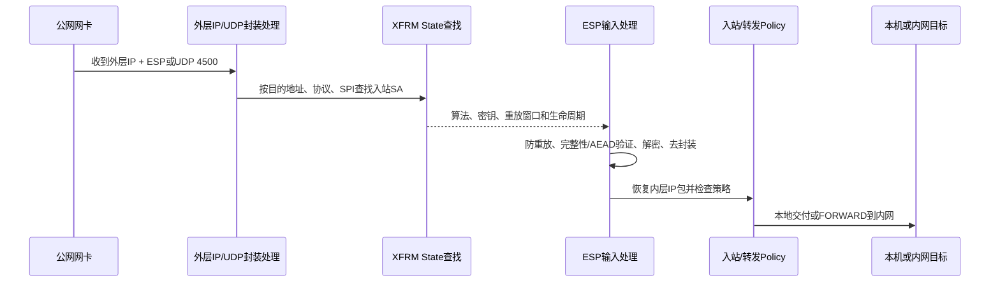
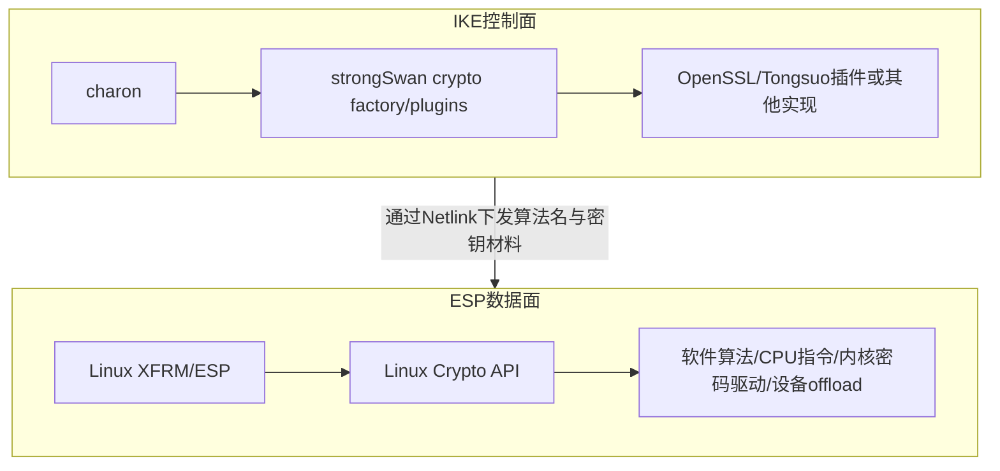
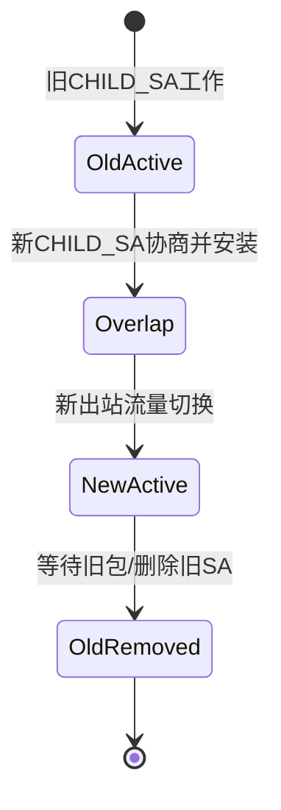

strongSwan的`charon`负责IKE协商，但Linux内核通常负责ESP业务数据。二者之间靠XFRM用户接口和Netlink连接。

本篇要彻底讲清：

```text
IKE协商结果
→ strongSwan生成CHILD_SA
→ kernel-netlink编码XFRM消息
→ 内核安装Policy和State
→ 普通业务包命中Policy
→ 内核按State执行ESP
```

这条链是判断“IPsec到底有没有真正生效”的核心。

---

## 1. XFRM是什么

XFRM是Linux内核的IP变换框架。IPsec使用它表达：

- 哪些流量需要保护；
- 使用哪条安全关联（SA）；
- SPI、方向、端点、模式和算法是什么；
- 加解密密钥、完整性算法和防重放状态是什么；
- 入站解密后的流量是否满足预期策略。

官方内核文档把XFRM作为网络栈中的独立框架，并提供用户接口、设备卸载等专题。[Linux XFRM framework](https://docs.kernel.org/networking/xfrm/index.html)

### XFRM不等于strongSwan



strongSwan可以协商、派生并下发；XFRM可以由strongSwan、`ip xfrm`或其他控制程序配置。XFRM本身不负责IKE认证和协商。

---

## 2. Policy与State为什么必须分开

### 2.1 Policy：选择哪些包

XFRM Policy更像“匹配条件 + 需要应用的保护模板”。常见字段包括：

- 方向：`out`、`in`、`fwd`；
- 源/目的网段和可选的协议、端口；
- 优先级、Mark、接口ID等；
- 要求的模式、端点和协议模板。

它回答：

> 这个内层业务包是否应该被IPsec保护，或者这个解密后的入站包是否符合允许的安全策略？

### 2.2 State：怎样处理已经选中的包

XFRM State是内核中的SA，常见字段包括：

- 外层源/目的地址；
- ESP/AH协议；
- SPI；
- tunnel/transport模式；
- 加密、认证或AEAD算法与密钥；
- 序列号、防重放窗口和生命周期；
- UDP封装、ESN、offload等属性。

它回答：

> 已经决定使用IPsec后，具体用哪条单向SA、哪个SPI和哪组算法处理包？

### 2.3 一个类比及其边界

可以暂时类比：

```text
Policy = 匹配业务流量的规则
State  = 执行ESP所需的具体会话材料
```

但不要把Policy等同于普通防火墙规则，也不要把State等同于双向隧道。IPsec SA通常是单向的，因此一条双向CHILD_SA会在内核体现为至少两个方向的状态和相应策略。

---

## 3. 从strongSwan CHILD_SA到内核XFRM

### 3.1 输入从哪里来

IKE协商确定了：

- 双方Traffic Selector（TS）；
- ESP Proposal与最终算法；
- SA端点、模式和封装；
- 双方SPI；
- 从IKE KEYMAT派生的双向ESP密钥；
- 生命周期、重放窗口等参数。

strongSwan把这些信息组织在CHILD_SA及相关对象中，再调用内核接口安装SA与Policy。

### 3.2 strongSwan侧关键链

以strongSwan 6.0.3上游结构为坐标，可从以下路径下钻：

```text
IKE任务完成CHILD_SA协商
→ child_sa_t.install()
→ kernel_interface_t.add_sa() / add_policy()
→ kernel-netlink插件
→ netlink消息 XFRM_MSG_NEWSA / XFRM_MSG_NEWPOLICY
→ Linux内核XFRM用户接口
```

在固定源码树中需要重点核对：

- `src/libcharon/sa/child_sa.c`：CHILD_SA生命周期与安装入口；
- `src/libcharon/kernel/kernel_interface.c`：charon统一内核能力接口；
- `src/libcharon/plugins/kernel_netlink/kernel_netlink_ipsec.c`：SA/Policy参数编码与Netlink交互；
- `src/libcharon/plugins/kernel_netlink/kernel_netlink_shared.c`：共享Netlink收发支持。

函数名和参数会随版本变化，真正接管产品时必须以供应商固定版本、补丁和构建插件为准。

### 3.3 内核侧关键链

内核XFRM用户接口的重要坐标：

- `net/xfrm/xfrm_user.c`：接收和解析用户态XFRM Netlink消息；
- `net/xfrm/xfrm_state.c`：State/SA管理与查找；
- `net/xfrm/xfrm_policy.c`：Policy管理、查找和bundle构建；
- `net/xfrm/xfrm_output.c`：出站变换框架；
- `net/xfrm/xfrm_input.c`：入站变换框架；
- `net/ipv4/esp4.c`、`net/ipv6/esp6.c`：ESP协议族相关实现。

设计上的关键点是：用户态只在建链、更新、删除或查询时发送控制消息，内核保存运行时对象并逐包处理，不需要每个ESP包都向`charon`询问。

---

## 4. 出站：明文业务包怎样变成ESP

以隧道模式为例：客户端网段`10.10.1.0/24`访问对端网段`10.20.0.0/24`。



### 4.1 每一步的输入与输出

| 步骤 | 输入 | 输出/状态变化 |
| --- | --- | --- |
| 路由 | 内层IP包、路由规则、Mark | 下一跳和可能的XFRM查找 |
| Policy匹配 | 流量选择器、方向、优先级 | 不保护、丢弃或要求某类IPsec模板 |
| State查找 | 模板、端点、reqid、Mark等 | 可用的单向SA |
| ESP输出 | 明文`skb`、SPI、密钥、序列号 | ESP头、密文、认证标签/ICV |
| 外层发送 | 封装后的包 | 经路由、Netfilter、qdisc和网卡发出 |

### 4.2 没有匹配State时会怎样

取决于Policy、acquire流程和控制程序状态，可能产生XFRM acquire事件等待密钥管理程序建立SA，也可能返回错误或丢包。不能把所有“Policy有、State无”的现象都概括成一种固定日志，应同时看：

```bash
ip xfrm monitor
ip -s xfrm policy
ip -s xfrm state
nstat -az | grep -i xfrm
```

### 4.3 NAT-T

存在NAT时，ESP常封装在UDP 4500中。这里不是把IKE数据和ESP混成同一种内容，而是使用UDP外壳帮助ESP穿越NAT设备：

```text
外层IP
→ UDP 4500
→ Non-ESP Marker（仅某些IKE报文）或ESP内容
→ 加密的内层业务包
```

抓包时需要区分UDP 4500中的IKE与ESP封装，不能仅凭端口断言具体内容。

---

## 5. 入站：ESP怎样恢复为内层业务包



### 5.1 SPI为什么重要

SPI由接收方选择，出现在ESP头中。接收方结合目的地址和IPsec协议等信息，用SPI找到正确的入站SA。SPI不是加密密钥，也不要求保密；它更像加密上下文的查找编号。

### 5.2 为什么先做防重放与完整性

入站处理必须拒绝重复、篡改或使用错误SA的包。具体顺序取决于算法模式和实现，但安全目标包括：

- 序列号不应被攻击者无限重复利用；
- 未通过完整性或AEAD验证的明文不能被当作可信业务包继续转发；
- 生命周期和策略不符的包应被拒绝。

### 5.3 解密成功仍不等于业务成功

恢复出的内层包还要经过路由、入站策略及可能的FORWARD/INPUT规则。常见情况是：

```text
公网ESP计数增长
XFRM入站State计数增长
但FORWARD规则丢弃内层包
```

这不是ESP失败，而是解密后的网关转发策略问题。

---

## 6. 算法与密钥究竟在哪里执行

### 6.1 IKE算法和ESP算法是两条实现链



所以：

> strongSwan链接Tongsuo并能在IKE中使用某算法，不等于Linux内核ESP已经支持该算法。

要让ESP使用SM4、HMAC-SM3或其他国密组合，至少要闭合：

```text
双方ESP Proposal能协商
→ strongSwan把选择结果映射成内核可识别的算法名/参数
→ 当前内核Crypto API存在兼容实现
→ XFRM能创建SA
→ 实际业务计数增长并排除AES等替代算法
```

### 6.2 怎样查内核算法能力

```bash
grep -E '^(name|driver|module|priority)' /proc/crypto
```

`/proc/crypto`只说明内核注册了哪些密码实现，不证明某条SA一定使用了它。还要查看：

```bash
ip -s xfrm state
```

并结合控制面选择结果、安装日志、业务计数和负面测试。

### 6.3 HSM或密码卡的边界

IKE中的SM2签名私钥可以通过Provider、Engine、PKCS#11或厂商接口留在HSM/密码卡内；但ESP是逐包高频数据面，通常走内核Crypto API或专门的XFRM/inline offload路径。

“握手调用了密码卡”不能推出“所有ESP流量都经过密码卡”。要证明数据面硬件卸载，需要设备、驱动、XFRM offload配置、SA标志、硬件计数与性能数据共同支持。Linux提供[XFRM device offload](https://docs.kernel.org/networking/xfrm/xfrm_device.html)接口，但具体硬件和驱动是否实现必须实测。

---

## 7. Rekey时为什么可能同时存在多条State

IPsec不能等旧密钥完全删除后再开始协商新密钥，否则会产生断流窗口。典型rekey阶段可能短暂重叠：



这意味着`ip xfrm state`中短时看到新旧SPI并存不一定是泄漏。需要结合生命周期、计数是否迁移、删除事件和持续时间判断。

危险情况包括：

- 新SA安装失败却删除旧SA；
- 出站已切换、对端入站未准备好；
- Policy仍引用错误模板；
- rekey后计数停在旧SPI；
- 序列号或ESN处理不一致；
- 旧密钥长期不回收。

所以“第一次建链成功”不足以证明产品可用，必须包含rekey回归。

---

## 8. 用四类证据证明ESP路径

### 8.1 控制面：协商了什么

查看strongSwan日志和IKE PCAP，确认选中的CHILD_SA Proposal、Traffic Selector、模式和安装结果。只看配置文件不够，因为对端可能选择另一候选Proposal或协商失败。

### 8.2 内核状态：安装了什么

```bash
ip -s xfrm state
ip -s xfrm policy
ip xfrm monitor
```

> **不要外发XFRM密钥**
> `ip xfrm state`通常会显示ESP认证/加密密钥。它适合在受控终端核对算法、SPI和计数，但原始输出不得直接进入Git、截图、聊天或外发报告。共享前必须把`auth`、`auth-trunc`、`enc`、`aead`等行中的十六进制密钥替换为`<redacted-key>`；仓库配套快照脚本默认只保存已脱敏版本。
>

重点不是截图“有几行”，而是核对：

- 双向端点和SPI；
- 算法及参数；
- `in/out/fwd`策略；
- Traffic Selector；
- reqid、mark、if_id（如果产品使用）；
- 生命周期和包/字节计数。

### 8.3 外部报文：线上看到什么

公网抓包应看到ESP，或在NAT-T场景看到UDP 4500中的ESP封装。公网不应直接出现被保护的内层业务载荷。

Wireshark原生能识别标准Transform和已知密钥场景，但对私有算法ID、厂商扩展或未知国密组合可能只显示数值/加密载荷。显示名称不是协议正确性的唯一判断；编号一致性、运行状态和负面测试同样重要。

### 8.4 业务与反例：是否真的依赖这条SA

至少设计一个反向验证：

- 临时停止一端对应SA或改变选择器，业务应按预期中断；
- 发送不匹配Traffic Selector的流量，不应被错误保护；
- 篡改或重放ESP包应被拒绝；
- rekey前后业务应连续且SPI/计数切换；
- 删除内核目标算法后，SA安装应明确失败，不能静默回退到其他算法。

安全测试环境中执行，且必须有恢复步骤。

---

## 9. 常见XFRM故障矩阵

| 现象 | 更可能的层 | 先看什么 |
| --- | --- | --- |
| IKE成功，`ip xfrm state`为空 | CHILD_SA安装、kernel-netlink或权限/内核能力 | charon安装日志、`ip xfrm monitor` |
| State存在，Policy没有 | Policy安装或TS映射 | `ip -s xfrm policy`、Netlink错误 |
| Policy/State都有，出站计数不增 | 路由、选择器、mark/if_id或流量没到 | `ip route get`、Policy selector、入口PCAP |
| 出站计数增，对端无入站 | 外层路由、防火墙、NAT-T或链路 | 公网两端PCAP、接口计数 |
| 入站ESP到达，State错误计数增 | SPI/端点/算法/密钥/重放问题 | `nstat` Xfrm统计、SA参数、对端日志 |
| 入站State计数增，内网不通 | 解密后路由/FORWARD/NAT/回程 | 内侧PCAP、nft计数、回程路由 |
| 初始正常，rekey后断流 | 新旧SA切换或删除时序 | SPI/生命周期、rekey日志、连续流量 |
| CPU高但带宽低 | 密码实现、软中断、单队列、MTU、锁/拷贝等 | `perf`、队列/IRQ、分包和XFRM统计 |

### XFRM统计

```bash
cat /proc/net/xfrm_stat
nstat -az | grep -i xfrm
```

字段名比“看到一个非零值”更重要。应把测试前后差值与同一批业务流量对应起来，而不是引用机器长期累计值。

---

## 10. PQC与XFRM的关系

PQC首先影响的是密钥建立和认证控制面，例如IKE中的混合密钥交换或后量子签名。只要最终仍协商标准ESP算法，XFRM逐包数据路径可以保持不变：

```text
IKE传统KE + PQC KEM
→ 组合共享秘密
→ IKE KDF
→ CHILD_SA KEYMAT
→ 现有ESP算法和XFRM State
```

如果同时改变ESP算法或密钥长度，就需要内核Crypto API、XFRM映射、硬件卸载和互通端共同支持。

因此“接入PQC”必须明确范围：

- 只改IKE密钥建立；
- 改认证签名；
- 改ESP数据算法；
- 或三者组合。

不明确范围就无法判断内核是否需要改造，也无法设计验收证据。

---

## 11. 本篇掌握检查

1. XFRM Policy和State分别回答什么问题？为什么双向隧道需要单向SA？
2. `charon`完成IKE协商后，哪些信息通过kernel-netlink交给内核？
3. 为什么strongSwan链接Tongsuo不能证明ESP已经使用SM4？
4. 入站ESP计数增长但内网服务不通时，下一步为什么应看解密后的路由和FORWARD？
5. 如何用控制面、内核状态、PCAP和负面测试四类证据证明一条ESP路径？
6. PQC Hybrid IKE为什么不必然要求修改每包ESP数据面？

---

## 12. 权威资料

- [Linux XFRM framework](https://docs.kernel.org/networking/xfrm/index.html)
- [Linux XFRM device offload](https://docs.kernel.org/networking/xfrm/xfrm_device.html)
- [Linux IPsec corner cases](https://docs.kernel.org/networking/ipsec.html)
- [Linux `ip-xfrm(8)` manual](https://man7.org/linux/man-pages/man8/ip-xfrm.8.html)
- 本知识库：[strongSwan五链04：CHILD_SA到XFRM](strongSwan%20五链源码精读%2004%20CHILD_SA到XFRM.md)
- 本知识库：[strongSwan五链05：业务IP包到ESP](strongSwan%20五链源码精读%2005%20业务IP包到ESP.md)
