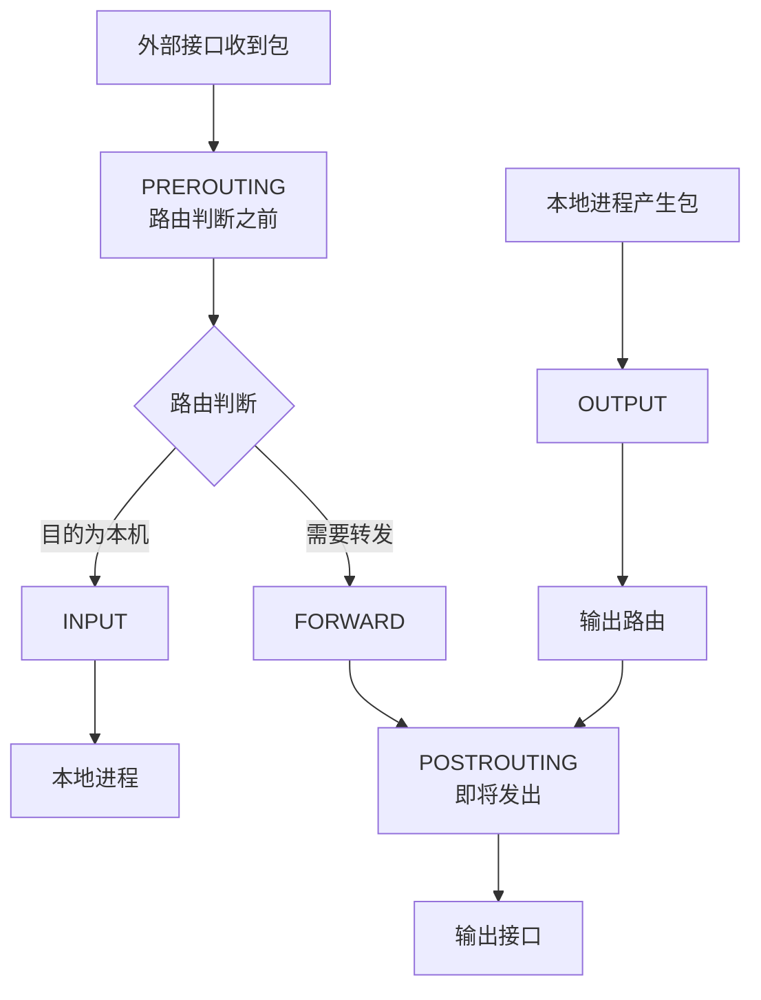
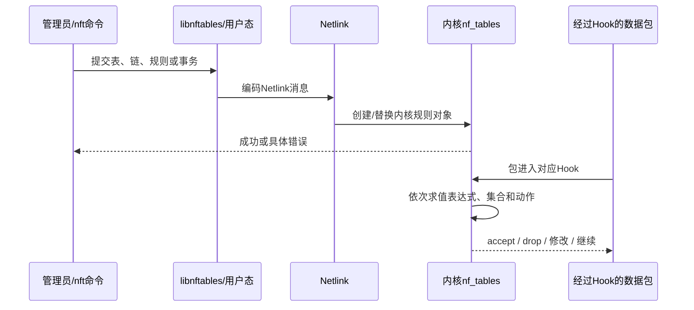
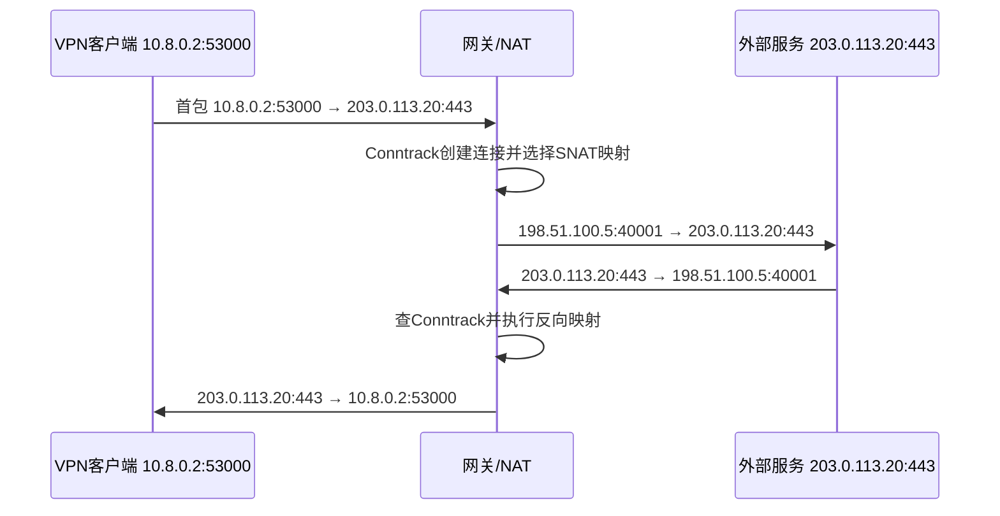
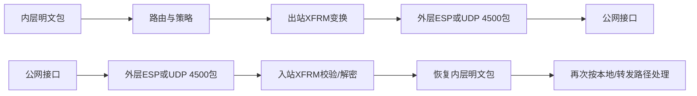

Netfilter不是一个单独的“防火墙程序”，而是Linux网络栈中的一组挂接点和基础设施。nftables是用户态配置工具和规则语言；它通过Netlink把规则交给内核，真正逐包执行规则的是内核。

本篇的目标是把四个常被混用的概念分开：

```text
Netfilter：内核网络路径上的规则挂接框架
nftables：配置和管理内核规则的现代用户态接口
Conntrack：记录双向连接/流状态的子系统
NAT：依据连接状态修改地址或端口的功能
```

---

## 1. 五个关键Hook怎样嵌入包路径

先看简化后的IPv4/IPv6通用心智模型：



| Hook | 看见什么包 | 常见用途 |
| --- | --- | --- |
| PREROUTING | 所有刚进入、尚未完成路由判断的包 | DNAT、标记、早期过滤 |
| INPUT | 路由后确定交给本机的包 | 保护IKE、OpenVPN、管理口等本地服务 |
| FORWARD | 经本机转发到其他网络的包 | 控制VPN客户端访问哪些网段 |
| OUTPUT | 本机进程产生的包 | 控制本地服务对外连接、设置Mark |
| POSTROUTING | 已决定出口、即将发送的包 | SNAT/MASQUERADE、末端策略 |

最重要的判断不是“某条规则写在哪个文件”，而是：**这个包是本地输入、本地输出还是转发？在当前Hook之前，路由和地址是否已经改变？**

---

## 2. nftables规则怎样真正生效



规则不是由`nft`进程常驻逐包执行。命令完成后，即使退出终端，内核中的规则仍继续工作。内核侧重要源码坐标包括：

- `net/netfilter/core.c`：Netfilter Hook注册与调用的核心坐标；
- `net/netfilter/nf_tables_api.c`：nftables对象与Netlink API相关实现；
- `net/netfilter/nft_*.c`：各类表达式、动作和扩展；
- 协议族和Hook的具体接入点分布在IPv4、IPv6、bridge等网络代码中。

官方[nftables项目文档](https://www.netfilter.org/projects/nftables/)和[nftables wiki](https://wiki.netfilter.org/wiki-nftables/index.php/Main_Page)是规则语义与使用方式的权威入口。

---

## 3. Conntrack到底记录什么

Conntrack把正向和反向报文识别为同一个逻辑连接，并保存状态、超时、协议细节、NAT映射等信息。它不是抓取并永久保存全部数据包。

### 3.1 五元组和双向Tuple

对TCP/UDP，常见识别信息可简化为：

```text
源IP、目的IP、源端口、目的端口、协议
```

Conntrack同时维护原方向和回复方向。这样回包即使地址已被NAT修改，内核仍能找到同一个连接并执行反向转换。

### 3.2 常见状态不是TCP状态机的简单复印

| Conntrack状态 | 人话解释 |
| --- | --- |
| NEW | 已看到属于新连接的包，但不等于TCP只处于某一个固定状态 |
| ESTABLISHED | 已确认双向通信，或该流已满足协议跟踪条件 |
| RELATED | 与已有连接有关联，例如某些控制协议派生的数据流或ICMP错误 |
| INVALID | 无法归入有效跟踪状态，可能是异常、过期、校验或资源问题 |
| UNTRACKED | 明确跳过连接跟踪的包 |

源码坐标主要在`net/netfilter/nf_conntrack_core.c`及各协议跟踪模块。阅读时先找：

```text
包的tuple怎样提取
→ 哈希表怎样查找或创建条目
→ 状态怎样更新
→ 超时怎样管理
→ 销毁时释放什么资源
```

---

## 4. NAT为什么通常只在首包决定映射

NAT需要同一连接的后续包保持一致转换，否则通信无法稳定。典型流程是：



后续包不是每次重新随机选择一个NAT结果，而是复用连接中保存的映射。NAT核心源码坐标包括`net/netfilter/nf_nat_core.c`等。官方[nftables NAT说明](https://wiki.netfilter.org/wiki-nftables/index.php/Performing_Network_Address_Translation_%28NAT%29)强调NAT链和有状态转换的配置方法。

### 4.1 SNAT、MASQUERADE与DNAT

- SNAT：明确把源地址/端口改成指定值，适合固定外网地址；
- MASQUERADE：根据出口接口当前地址做源NAT，常用于动态地址，但有额外状态语义；
- DNAT：修改目的地址/端口，常用于端口映射或把入口流量送到内部服务。

NAT不等于防火墙。地址转换成功不代表流量已被允许；防火墙放行也不代表返回路径所需的NAT已经建立。

---

## 5. VPN网关中三类典型规则

### 5.1 保护网关本机服务

IKE、NAT-T、OpenVPN和管理界面的目标地址通常是网关本机，因此主要涉及INPUT链：

```text
UDP 500/4500 → strongSwan/IKE
OpenVPN监听端口 → OpenVPN进程
HTTPS/SSH → 管理服务
```

如果只在FORWARD链放行这些端口，仍可能无法连接，因为包不会进入FORWARD。

### 5.2 控制VPN用户访问内网

解密或从TUN进入的业务包需要从VPN侧转发到LAN，重点是：

```text
路由存在
IP转发开启
FORWARD允许VPN网段 → 目标网段
返回流量有正确路由或必要的SNAT
```

### 5.3 远程用户经网关访问互联网

若业务要求全隧道上网，常需要FORWARD放行并在公网出口做SNAT/MASQUERADE。若只访问公司内网，不应因为“教程方便”自动添加全网NAT；规则必须来自产品策略。

---

## 6. Netfilter与IPsec/XFRM的顺序为什么不能只背一句话

常见简化说法是“先防火墙再加密”或“先解密再防火墙”。它们只能描述某个方向、某个Hook或某类策略，不能覆盖完整路径。

真实系统需要区分：

- 入站还是出站；
- 内层明文还是外层ESP/UDP封装；
- 本地流量还是转发流量；
- 是否使用route-based XFRM interface；
- 哪个Hook和优先级；
- 内核版本和厂商补丁；
- 是否有硬件/设备卸载。

一个更稳妥的心智模型是：



然后使用规则计数、`nft monitor trace`、`ip -s xfrm`、内外侧抓包去确认产品的实际顺序，而不是用一张通用图代替运行证据。

---

## 7. 逐步检查命令

以下命令以读取状态为主。部分系统需要管理员权限才能看到完整规则或连接表。

### 7.1 查看规则和计数器

```bash
nft list ruleset
nft -a list ruleset
```

`-a`显示rule handle，便于后续定位具体规则。规则中应尽量带计数器，才能确认真实包是否命中。

### 7.2 查看连接跟踪

```bash
conntrack -L
conntrack -S
```

观察五元组、状态、超时、原方向/回复方向以及drop/insert_failed等统计。不要把“表中存在条目”直接等同于应用请求成功。

### 7.3 观察实时变化

```bash
conntrack -E
nft monitor trace
```

这两条可能产生大量输出，应先缩小实验流量并在测试环境使用。`nft monitor trace`需要规则或环境启用相应跟踪条件，不能假设默认就显示所有包。

### 7.4 核对内核转发和路由

```bash
sysctl net.ipv4.ip_forward
ip route get 10.20.0.10 from 10.8.0.2
ip rule show
```

即使防火墙全部放行，没有有效路由或未开启转发，包仍不会成为正常的三层转发流量。

---

## 8. 常见“假成功”

| 表面现象 | 实际可能缺失 | 应补的证据 |
| --- | --- | --- |
| nft命令返回成功 | 规则未位于实际经过的family/hook | 规则计数和trace |
| FORWARD已accept | 路由错误、回程缺失、rp_filter或邻居失败 | `ip route get`、双向抓包、接口计数 |
| Conntrack有ESTABLISHED | 应用层响应仍可能失败 | Socket/应用日志和完整往返流量 |
| 配置了MASQUERADE | 包未经过对应POSTROUTING链 | NAT映射、规则计数、线上地址 |
| IPsec已连接 | 解密后流量仍被FORWARD丢弃 | XFRM计数与防火墙计数同步观察 |
| OpenVPN能ping隧道端点 | 到业务网段的转发/NAT尚未成立 | 实际业务目标与返回路径验证 |

---

## 9. 一个可复用的排障顺序

```text
1. 明确包是本地输入、本地输出还是转发
2. 用ip route get确认路由分支
3. 查看接口RX/TX与drop
4. 查看nft规则、计数器和实际family/hook
5. 查看Conntrack正反方向及NAT映射
6. 若有VPN，再分别查看TUN或XFRM数据面
7. 在入口、出口和对端抓取同一次可识别的测试流量
```

这一顺序不是说所有故障都固定由路由开始，而是强迫我们先确认包的身份和路径，再讨论策略语义。

---

## 10. 本篇掌握检查

1. 为什么访问网关本机的IKE端口主要看INPUT，而不是FORWARD？
2. Conntrack的ESTABLISHED和TCP状态机中的ESTABLISHED为什么不能简单画等号？
3. NAT为什么需要保存正反向映射，而不能每个包独立改地址？
4. nftables规则加载成功后，逐包执行规则的是谁？
5. 如何证明一个解密后的IPsec包被防火墙丢弃，而不是ESP解密失败？

---

## 11. 权威资料

- [nftables project](https://www.netfilter.org/projects/nftables/)
- [nftables wiki](https://wiki.netfilter.org/wiki-nftables/index.php/Main_Page)
- [nftables NAT](https://wiki.netfilter.org/wiki-nftables/index.php/Performing_Network_Address_Translation_%28NAT%29)
- [nftables man page](https://netfilter.org/projects/nftables/manpage.html)
- [Linux networking sysctl](https://docs.kernel.org/admin-guide/sysctl/net.html)
