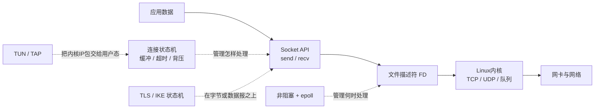
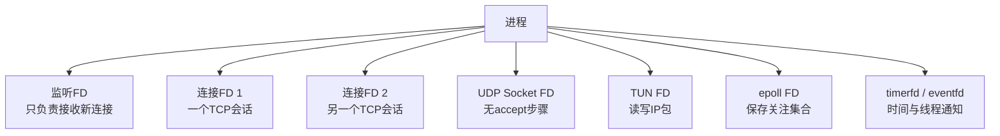
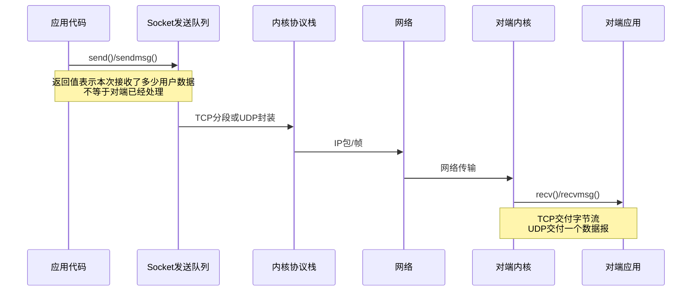
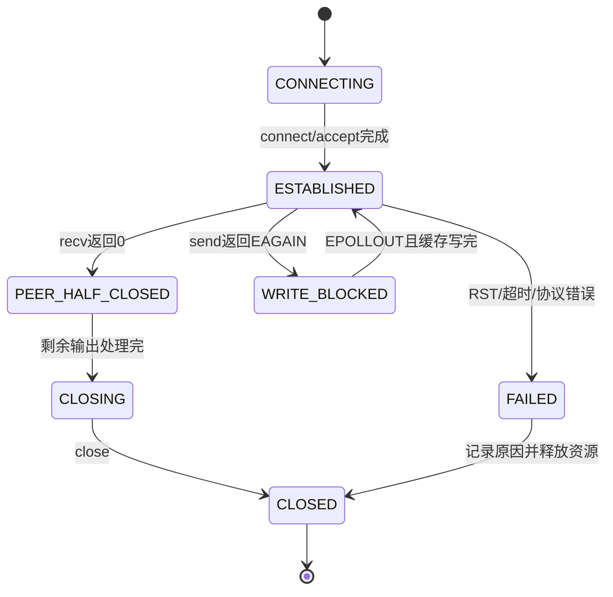
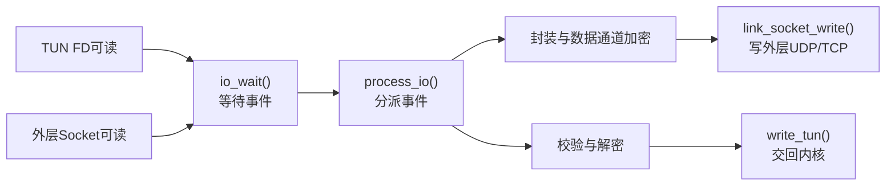
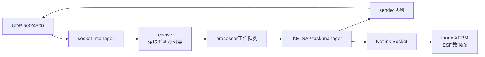
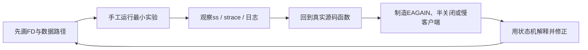

> **配套材料**：本文引用的网络编程示例与只读快照脚本见[源码与使用说明](/downloads/network-examples.zip)。解压后保留 `examples/` 目录结构；脚本未在本次发布中重新实测。


> 本专题不是让读者背诵一批系统调用，而是建立一条稳定的理解链：应用数据怎样进入进程，进程怎样借助文件描述符和内核通信，事件循环怎样同时管理大量连接，VPN 又怎样把 TUN、外层 Socket、密码状态机和路由系统连接起来。

## 1. 先给出专题地图



读懂这张图要先分清四个主体：

1. **应用程序**决定协议语义，例如一条消息怎样分帧、何时关闭、失败是否重试；
2. **Socket API**是应用进入内核网络功能的入口；
3. **内核**维护 TCP 状态、UDP 数据报、收发队列、路由和网卡交互；
4. **事件循环和状态机**是用户态程序组织并发连接、超时、缓冲和协议步骤的方法。

`epoll`不会替程序收包，TLS不会替程序管理连接，TUN也不是物理网卡。它们各自解决不同层的问题。

## 2. 本专题由四篇文档组成

| 阅读顺序 | 文档 | 核心问题 | 掌握门槛 |
| --- | --- | --- | --- |
| 1 | 本导览 | 网络程序在整台网关里处于什么位置 | 能画出用户态、内核、FD和网络的关系 |
| 2 | [Linux Socket、TCP与UDP工程基础](Linux%20Socket、TCP与UDP工程基础.md) | 一条连接怎样建立、收发和结束 | 能解释六个Server调用、TCP字节流与UDP数据报 |
| 3 | [非阻塞I/O、epoll与连接状态机](非阻塞I-O、epoll与连接状态机.md) | 一个线程怎样安全管理很多连接 | 能正确处理`EAGAIN`、部分读写、LT/ET和背压 |
| 4 | [从网络编程到VPN网关](从网络编程到VPN网关：TUN、事件循环与源码映射.md) | 基础机制怎样进入OpenVPN、strongSwan和未来网关 | 能从一份报文追到TUN、Socket、事件循环和源码函数 |

配套最小实验位于仓库的 `examples/network-programming/`。示例只负责展示机制，不是生产服务器模板。

## 3. 一个网络程序实际拥有三张地图

### 3.1 资源地图：进程持有哪些FD



FD（File Descriptor，文件描述符）只是进程中的小整数，但它引用内核对象。不同FD的行为不同：

- 监听FD上的“可读”通常意味着有连接可`accept()`；
- 已连接TCP FD上的“可读”可能意味着有数据、收到FIN，或者出现错误；
- UDP FD的一次读取对应一个数据报，不能用TCP字节流的方式理解；
- TUN FD读出的是内核准备发往隧道的IP包；
- epoll FD本身管理一组被关注的FD。

所以排障时只说“Socket有问题”远远不够，必须回答：哪个进程、哪个FD、什么类型、处于什么状态、等待什么事件。

### 3.2 数据地图：字节或报文从哪里到哪里



程序调用`send()`成功，只说明内核接受了部分或全部数据，不说明：

- 数据已经到达对端；
- 对端应用已经`recv()`；
- 对端已经完成业务处理；
- 网络中不会发生后续错误。

这也是为什么可靠服务还需要应用层确认、超时、重试和幂等设计。

### 3.3 状态地图：这个连接现在允许做什么



高质量网络代码的核心不是“调用成功”，而是：每个返回值都能推动状态迁移，每条失败路径都能释放资源，每个等待都有上限。

## 4. 从最小TCP Server开始，但不要停在六个函数

经典TCP Server主线是：

```text
socket
→ setsockopt（按需）
→ bind
→ listen
→ accept
→ recv/send
→ shutdown/close
```

这条线解决“如何跑通第一条连接”。工程程序随后还必须回答：

- 一次`recv()`没有读到完整业务消息怎么办；
- 一次`send()`只写出一部分怎么办；
- 对端不发数据，线程是否会永久阻塞；
- 同时有一万个连接，怎样避免一连接一线程的巨大成本；
- 对端读取太慢，输出缓存增长到多大时必须暂停上游；
- FIN、RST、超时和协议错误分别怎样收尾；
- 地址是IPv4、IPv6还是域名，如何处理多个解析结果；
- TLS握手返回“还要等可读/可写”时怎样接回事件循环。

后两篇文档就是依次回答这些问题。

## 5. TCP、UDP和虚拟网卡不是三选一

| 对象 | 程序看到什么 | 是否有连接状态 | 消息边界 | 网关中的典型位置 |
| --- | --- | --- | --- | --- |
| TCP Socket | 连续字节流 | 有 | 不保留 | 管理接口、TLS隧道、代理 |
| UDP Socket | 独立数据报 | 无`accept()`连接 | 保留单个数据报边界 | IKE、NAT-T、OpenVPN UDP外层 |
| TUN | 三层IP包 | 由程序自行组织会话 | 每次读写通常是一整个IP包 | SSL VPN用户态数据面 |
| TAP | 二层以太网帧 | 由程序自行组织会话 | 每次读写一帧 | 二层桥接场景 |
| Netlink Socket | 内核与用户态控制消息 | 按协议定义 | 消息化 | strongSwan下发XFRM SA/Policy |

正确理解是：一个VPN进程可能同时持有TUN FD、UDP/TCP Socket FD、控制Socket、定时器和事件通知FD。事件循环把这些入口统一组织起来。

## 6. 网络编程能力怎样迁移到VPN源码

### 6.1 OpenVPN

OpenVPN 2.7.4是事件驱动程序。简化链路如下：



网络编程基础让你能区分：事件通知、实际读写、协议处理和缓冲区所有权。OpenVPN的加密代码并没有代替这些基础机制。

### 6.2 strongSwan

strongSwan的`charon`不是OpenVPN式的单一TUN转发程序。典型IKE控制面链路是：



这里的网络编程能力用于理解UDP Socket、线程/任务队列、消息所有权和Netlink；ESP业务包通常由Linux XFRM处理，不经过charon的每包用户态事件循环。

## 7. 学习时只抓五条不变量

面对任何网络源码，都先回答：

1. **入口FD是什么**：监听Socket、连接Socket、UDP、TUN还是Netlink？
2. **输入单位是什么**：字节流、数据报、IP包、以太网帧还是控制消息？
3. **谁保存状态**：内核TCP、用户态连接对象、TLS对象还是IKE SA？
4. **下一步由什么触发**：函数直接调用、epoll事件、定时器还是工作队列？
5. **失败如何收尾**：错误码怎样转换成状态，哪些缓冲和FD必须释放？

源码再大，也只是把这五件事拆进更多结构体、回调和模块。

## 8. 推荐的学习闭环



不要以“代码看过一遍”为完成。至少亲手完成一个代表性闭环：

- 跑通一条TCP连接；
- 用`ss`和`strace`看到FD与系统调用；
- 把FD设为非阻塞并正确识别`EAGAIN`；
- 用epoll同时管理监听FD和连接FD；
- 制造慢客户端，观察部分写入和背压；
- 最后在OpenVPN或strongSwan里找到同一种机制的真实位置。

## 9. 掌握检查

完成专题后，应能不用背代码回答：

1. 监听FD与`accept()`返回的连接FD有什么区别？
2. 为什么TCP的一次`send()`不能对应对端一次`recv()`？
3. 非阻塞`recv()`返回`EAGAIN`为什么不是断线？
4. epoll通知“可读”后，程序为什么仍必须处理EOF和错误？
5. 为什么一个VPN进程可能同时需要TUN FD和UDP Socket FD？
6. OpenVPN用户态数据路径和strongSwan+XFRM数据路径的根本差异是什么？
7. 当发送缓存持续增长时，正确动作为什么不是继续无限读取上游？

## 参考资料

- [Linux `socket(7)`手册](https://man7.org/linux/man-pages/man7/socket.7.html)
- [Linux `accept(2)`手册](https://man7.org/linux/man-pages/man2/accept.2.html)
- [Linux `epoll(7)`手册](https://man7.org/linux/man-pages/man7/epoll.7.html)
- [Linux内核TUN/TAP文档](https://docs.kernel.org/networking/tuntap.html)
- [OpenVPN Main Event Loop开发文档](https://build.openvpn.net/doxygen/group__eventloop.html)
