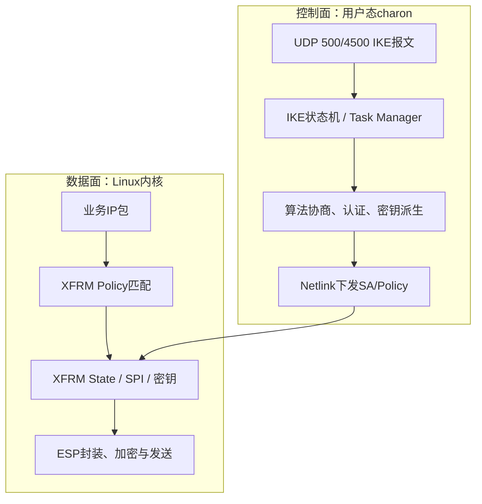
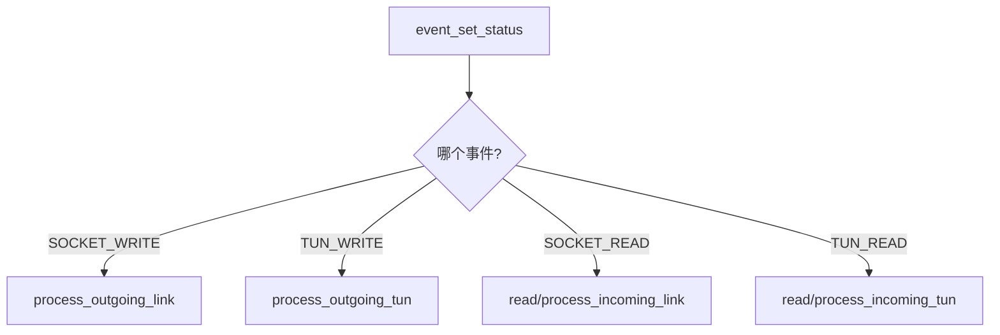
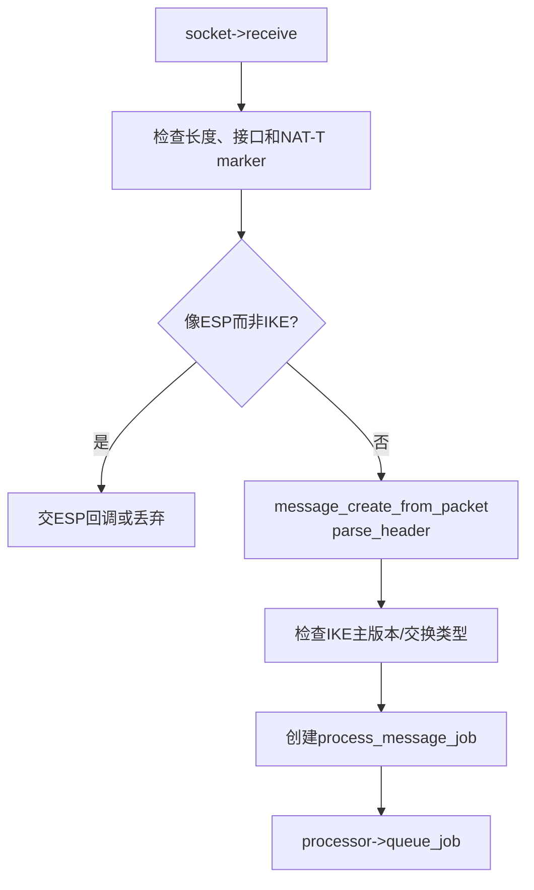
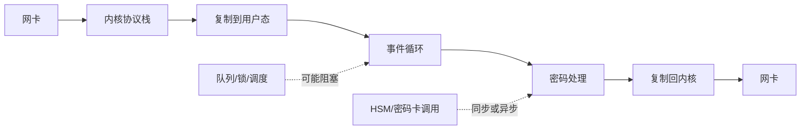
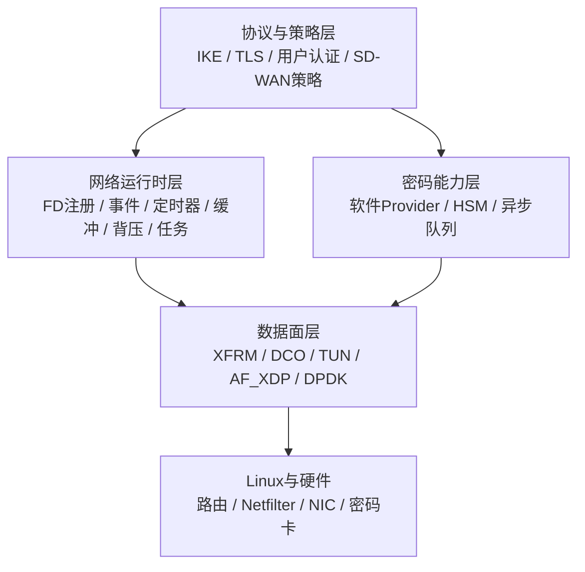

> 本文把Socket、epoll和连接状态机放回VPN网关。重点回答：OpenVPN为什么同时需要TUN和外层Socket；strongSwan为什么主要处理IKE控制报文而不是每个ESP业务包；Netlink怎样把用户态控制结果交给Linux XFRM；未来性能优化应先看哪条数据路径。

## 1. 先分清两种VPN数据路径

### 1.1 OpenVPN传统用户态路径


用户态OpenVPN进程要同时处理两类输入：

- TUN可读：内核交给VPN的明文IP包；
- 外层Socket可读：网络发来的OpenVPN报文。

因此它天然适合事件循环。数据必须在TUN、用户态缓冲区、密码处理和外层Socket之间流动。

### 1.2 strongSwan + Linux XFRM路径



charon通过Socket收发IKE控制报文，协商出SA和密钥，再通过Netlink把结果交给内核。正常内核XFRM模式下，稳定态业务包不需要逐包回到charon。

所以两者的网络编程重点不同：

| 系统 | 用户态重点 | 内核重点 |
| --- | --- | --- |
| OpenVPN传统路径 | TUN + 外层Socket + 事件循环 + 用户态数据通道 | 路由、TUN驱动、物理网络 |
| strongSwan/XFRM | IKE UDP Socket + 任务队列 + Netlink控制 | XFRM Policy/State与ESP逐包处理 |

## 2. TUN/TAP为什么能把内核流量交给程序

### 2.1 TUN是三层虚拟网卡

程序打开`/dev/net/tun`并通过`ioctl(TUNSETIFF)`创建或附着设备：

```c
int fd = open("/dev/net/tun", O_RDWR | O_CLOEXEC);

struct ifreq ifr = {0};
ifr.ifr_flags = IFF_TUN | IFF_NO_PI;
strncpy(ifr.ifr_name, "tun0", IFNAMSIZ - 1);

ioctl(fd, TUNSETIFF, &ifr);
```

之后同时出现两个视角：


- 内核把路由到`tun0`的IP包交给TUN驱动；
- VPN进程从FD读取这个IP包；
- VPN解密得到远端IP包后写回FD；
- 内核把写入包当作从`tun0`收到，再进行路由、Netfilter和本地交付。

TAP的单位是以太网帧，包含MAC头，适合二层桥接；TUN的单位是IP包，更适合典型三层VPN。

### 2.2 TUN FD不是隧道本身

TUN只提供“内核与用户态交换IP包”的接口。真正的隧道还需要：

- 对端发现和外层网络传输；
- 身份认证与密钥建立；
- 加密、完整性和防重放；
- 会话状态、重协商、超时与错误处理；
- 路由、地址分配、访问控制和审计。

“成功创建tun0”不能证明VPN已加密，更不能证明国密或PQC真实生效。

## 3. OpenVPN 2.7.4：从事件循环看整个程序

以下位置基于本地固定上游快照`OpenVPN 2.7.4`。行号只用于该快照定位，版本升级后应先按函数名重新搜索。

### 3.1 最外层循环

`src/openvpn/openvpn.c:57`的`tunnel_point_to_point()`清楚展示主循环：

```text
pre_select(c)
→ io_wait(c, p2p_iow_flags(c))
→ process_io(c, link_socket)
→ 下一轮
```

对应含义：

1. `pre_select()`处理定时器、TLS、待发送数据等，并计算下一轮关注事件；
2. `io_wait()`统一等待TUN、外层Socket、管理接口、DCO或超时；
3. `process_io()`根据返回标志调用真正的数据处理函数。

这就是通用事件循环的三段式：**准备关注集合 → 等待事件 → 推进状态**。

### 3.2 `io_wait()`怎样统一多个FD

`src/openvpn/forward.c:2164`的`io_wait()`：

- 用`event_reset()`重置本轮集合；
- 用`multi_io_process_flags()`注册Socket和TUN读写需求；
- 可加入DCO和管理接口事件；
- 在`event_wait()`等待；
- 把返回事件编码进`event_set_status`。

源码注释在`forward.c:2202`列出了六类场景：TCP/UDP可读、TCP/UDP可写、TUN可读、TUN可写、信号和超时。

`src/openvpn/forward.c:2287`的`process_io()`再分派：



这说明“读Socket”和“处理OpenVPN报文”是两个阶段；“读TUN”和“加密外发”也不是同一个函数。

### 3.3 OpenVPN怎样封装epoll差异

OpenVPN没有把所有代码直接绑死在`epoll_*`上，而是在`src/openvpn/event.c`建立`event_set`抽象，并提供epoll、poll、select和Windows等后端。

Linux epoll后端关键位置：

| 函数 | 固定快照位置 | 作用 |
| --- | --- | --- |
| `ep_ctl()` | `event.c:573` | 把通用读写标志转换为`EPOLLIN/EPOLLOUT`并调用`epoll_ctl()` |
| `ep_wait()` | `event.c:610` | 调用`epoll_wait()`并转回通用事件格式 |
| `ep_init()` | `event.c:650` | 创建epoll FD、分配事件数组并注册函数表 |
| `event_set_init()` | `event.c:1187`附近 | 按平台和配置选择可用事件后端 |

这是值得学习的设计：上层数据通道依赖“注册事件、等待事件”这个能力接口，而不是到处直接调用Linux专用API。未来迁移平台时，变化集中在事件后端。

## 4. strongSwan 6.0.3：Socket、任务队列和Netlink怎样协作

以下位置基于本地`strongSwan 6.0.3`提交`472dcd8bb50a91f156b725ff56992352b573f7dd`。

### 4.1 Socket Manager负责选择实际Socket实现

`src/libcharon/network/socket_manager.c:58`的`receiver()`最终调用：

```c
status = this->socket->receive(this->socket, packet);
```

`socket_manager`自己不是Linux UDP实现；它管理由插件注册的`socket_t`实现。这个抽象使charon能更换Socket后端，而上层receiver仍调用统一接口。

### 4.2 Receiver进行入口分类，不完成整个IKE交换

`src/libcharon/network/receiver.c:464`的`receive_packets()`大致执行：



固定快照中的关键位置：

- `receiver.c:475`：从Socket取得`packet_t`；
- `receiver.c:510`：根据端口和Non-ESP Marker区分NAT-T场景；
- `receiver.c:536`：从报文创建`message_t`并解析头；
- `receiver.c:545`：区分IKEv1/IKEv2主版本；
- `receiver.c:630`：把消息处理任务放入processor队列。

所以receiver是入口过滤和任务投递层，真正IKE SA查找、协议任务和状态推进发生在后续worker执行的消息处理任务中。

### 4.3 Sender使用队列解耦协议处理和实际发送

`src/libcharon/network/sender.c:141`的`send_packets()`：

1. 用互斥锁保护发送队列；
2. 队列为空时等待条件变量；
3. 取出一个`packet_t`；
4. 调用`charon->socket->send()`；
5. 销毁报文对象。

`sender.c:217`把这个发送循环作为高优先级job加入processor。协议状态机不必直接承担底层发送等待，但必须明确packet所有权何时转移。

### 4.4 Netlink是控制面进入XFRM的桥

strongSwan的kernel-netlink插件使用`AF_NETLINK` Socket和内核通信：

- `kernel_netlink_ipsec.c:1736`附近的`add_sa()`组装SA消息；
- `kernel_netlink_ipsec.c:1793`选择`XFRM_MSG_NEWSA`或`XFRM_MSG_UPDSA`；
- `kernel_netlink_shared.c:216`的`write_msg()`用`sendto()`发送Netlink消息；
- `kernel_netlink_shared.c:698`创建`socket(AF_NETLINK, SOCK_RAW, protocol)`；
- `kernel_netlink_ipsec.c:4366`创建`NETLINK_XFRM`控制Socket。

这条链把网络编程概念扩展到“本机进程与内核子系统通信”：它仍是Socket和消息，但对端不是远程主机，而是内核Netlink协议。

## 5. 把基础概念映射到两个真实项目

| 基础概念 | OpenVPN 2.7.4 | strongSwan 6.0.3 |
| --- | --- | --- |
| 外层Socket | VPN报文的UDP/TCP传输 | IKE UDP 500/4500 |
| 虚拟网卡FD | 传统用户态数据面使用TUN/TAP | 正常XFRM模式通常不需要TUN逐包转发 |
| 事件等待 | `event_set`抽象，Linux可落到epoll | receiver/sender作业、线程与队列模型 |
| 用户态状态机 | TLS控制通道、Key State、数据通道 | IKE SA、Task Manager、Exchange任务 |
| 内核控制通道 | DCO、路由/设备操作等 | Netlink下发XFRM SA/Policy |
| 业务数据加密 | 用户态OpenVPN或DCO | Linux XFRM/ESP |
| 背压位置 | TUN、外层Socket、用户态队列 | IKE任务/发送队列；ESP背压主要在内核数据面 |

## 6. 一个包在OpenVPN里的完整网络编程视角

假设应用把目的为`10.20.0.10`的IP包路由到`tun0`：

| 步骤 | 输入 | 处理者 | 输出 | 可观察证据 |
| --- | --- | --- | --- | --- |
| 1 | 应用业务数据 | 内核TCP/IP与路由 | 发往tun0的IP包 | `ip route get`、TUN抓包 |
| 2 | TUN可读事件 | OpenVPN事件循环 | 选中TUN_READ | 调试日志、系统调用跟踪 |
| 3 | 明文IP包 | `read_tun()`及后续数据通道 | OpenVPN内部buffer | `strace read`，源码断点 |
| 4 | 内部buffer | 压缩/封装/加密链 | OpenVPN外层报文 | 加密函数日志、单测 |
| 5 | 外层报文 | `link_socket_write()` | UDP/TCP进入内核 | `strace sendmsg`、外网PCAP |
| 6 | 外层IP包 | 内核路由和网卡 | 网络中的密文 | Wireshark只能看到外层和密文 |

反向路径依次是：Socket可读→读取外层报文→验证/解密→写TUN→内核路由到应用或内网。

## 7. 一个IKE报文在strongSwan里的完整网络编程视角

| 步骤 | 输入 | 处理者 | 输出 | 可观察证据 |
| --- | --- | --- | --- | --- |
| 1 | UDP 500/4500报文 | Linux UDP Socket | `packet_t` | PCAP、`ss -lunp`、日志 |
| 2 | `packet_t` | receiver | 已解析头的`message_t` | receiver日志、源码断点 |
| 3 | `message_t` | processor工作队列 | `process_message_job`被worker执行 | job负载、线程栈 |
| 4 | IKE消息 | IKE SA/Task Manager | 响应、密钥或CHILD SA参数 | IKE日志、PCAP |
| 5 | SA/Policy参数 | kernel-netlink | `XFRM_MSG_NEWSA/NEWPOLICY` | Netlink跟踪、charon日志 |
| 6 | XFRM状态 | Linux内核 | ESP数据路径可用 | `ip xfrm state/policy`、ESP PCAP |

IKE建立成功不等于ESP一定可用。Netlink下发可能因算法名、密钥长度、内核能力或策略冲突失败；必须同时检查charon协商日志和XFRM系统状态。

## 8. 网络编程知识怎样指导性能优化

性能工作先画数据移动和等待点：



不同优化解决不同问题：

| 观测到的瓶颈 | 先考虑什么 | 不应直接得出的结论 |
| --- | --- | --- |
| 单事件循环CPU满 | 批处理、减少拷贝/分配、拆分耗时任务 | 立即重写成DPDK |
| TUN系统调用和复制明显 | DCO、多队列TUN、批处理、内核路径 | 算法核一定慢 |
| XFRM/Netfilter占CPU | 规则、队列、offload、内核profiling | charon状态机需要重写 |
| 密码计算占主要cycles | SIMD、异步、密码卡、批处理 | 每包同步调板卡一定更快 |
| 锁和队列等待高 | 明确对象归属、分片、减少共享 | 线程越多越快 |
| 小包PPS受限 | 每包固定开销、批量收发、XDP/AF_XDP/DPDK评估 | 大包吞吐代表小包能力 |

先用`perf`、火焰图、系统调用统计、CPU/队列指标和可复现流量确认瓶颈，再选择DCO、XFRM offload、AF_XDP、DPDK或DPU。

## 9. 面向未来综合安全网关的网络运行时分层



密码敏捷不仅需要算法接口，也需要网络运行时支持异步完成、超时、取消、并发和背压。例如HSM操作如果可能排队，协议状态机不能同步卡住整个I/O线程；完成结果必须带着正确会话上下文回到所属状态机。

## 10. 源码阅读方法：从FD反向追踪

面对采购代码或陌生网关源码，推荐按下面顺序：

1. 找进程入口和主循环；
2. 搜索`socket/open/ioctl/epoll_create`，列出所有FD类型；
3. 找注册事件的位置，记录每个FD关联的回调或标签；
4. 找实际`recv/read/send/write`位置，确认输入输出单位；
5. 找缓冲区和连接/会话结构体，确认所有权；
6. 找超时、关闭和错误分支；
7. 从协议日志回到状态机，再回到I/O入口；
8. 用`strace/perf/ss/PCAP`验证实际执行路径；
9. 最后才考虑修改或优化。

这比从目录第一行顺序通读更快，因为网络程序最终必须围绕FD、事件、状态和数据所有权组织。

## 11. 最容易出现的假理解

- “会写epoll服务器，就看懂了OpenVPN”：还缺TUN、双通道、密码状态和平台抽象；
- “strongSwan收UDP，所以ESP也在这个UDP读取循环里处理”：正常XFRM数据面不是这样；
- “TUN出现IP地址，所以隧道已经安全”：TUN只证明虚拟接口和路由的一部分；
- “Socket可读就一定有业务数据”：也可能是EOF、错误或新连接；
- “使用异步HSM就一定更快”：还取决于批处理、队列深度、DMA和完成通知；
- “换成DPDK就不需要状态机”：高速收包并不替代IKE/TLS、密钥生命周期和错误处理。

## 12. 掌握检查

1. 为什么OpenVPN进程需要同时等待TUN和外层Socket？
2. TUN的`read()`和`write()`分别代表包向哪个方向流动？
3. OpenVPN的`event_set`抽象解决了什么平台问题？
4. `io_wait()`与`process_io()`为什么要分开？
5. strongSwan receiver为什么把`message_t`交给processor，而不是在收包线程完成全部IKE处理？
6. Netlink Socket与远程UDP Socket有哪些相同点和不同点？
7. 为什么`ip xfrm state`是IKE协商日志之外必须核对的证据？
8. 如果VPN吞吐低，如何通过数据路径判断应该先看密码、TUN、XFRM、Netfilter还是网卡？

## 参考资料

- [Linux内核TUN/TAP文档](https://docs.kernel.org/networking/tuntap.html)
- [Linux Netlink文档](https://docs.kernel.org/userspace-api/netlink/intro.html)
- [OpenVPN Main Event Loop开发文档](https://build.openvpn.net/doxygen/group__eventloop.html)
- [OpenVPN上游仓库](https://github.com/OpenVPN/openvpn)
- [strongSwan上游仓库](https://github.com/strongswan/strongswan)
- [strongSwan内核IPsec插件文档](https://docs.strongswan.org/docs/latest/plugins/kernelIpsec.html)
