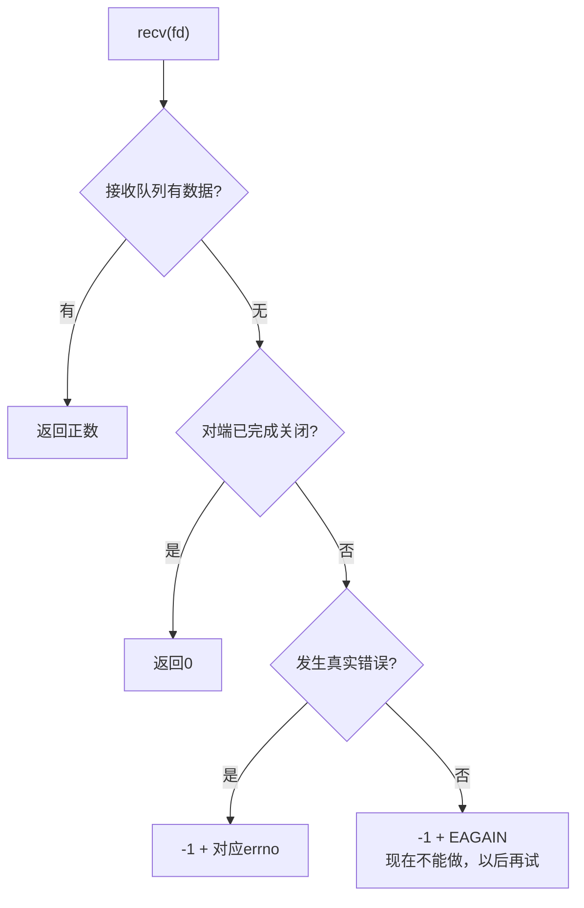
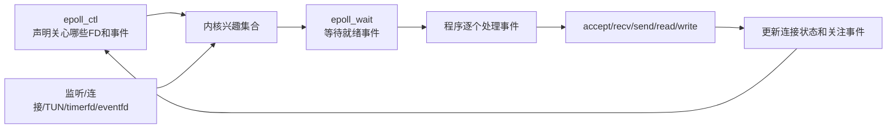
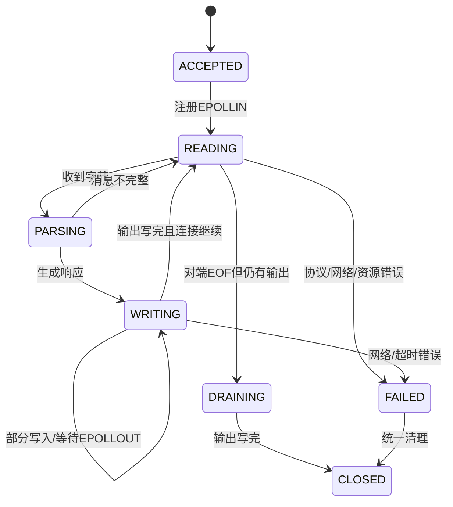
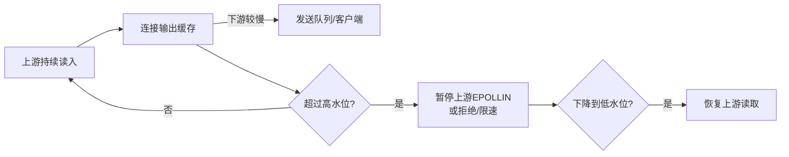
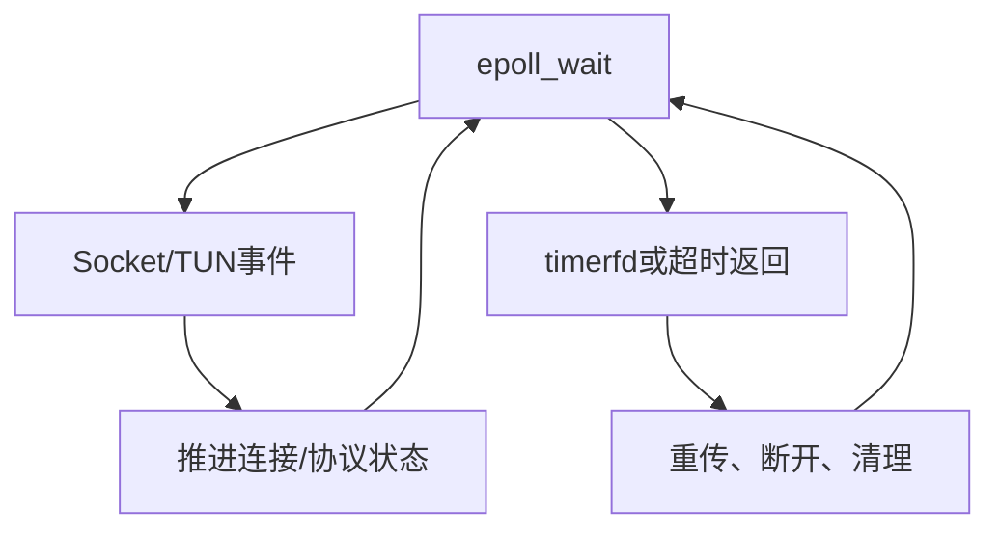
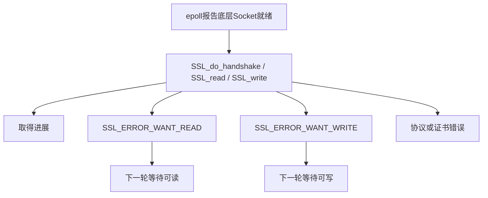

> **配套材料**：本文引用的网络编程示例与只读快照脚本见[源码与使用说明](/downloads/network-examples.zip)。解压后保留 `examples/` 目录结构；脚本未在本次发布中重新实测。


> 本文解决一个具体问题：当一个线程不能被某条连接长期占住时，怎样用非阻塞I/O、epoll、连接对象和缓冲区同时推进很多会话。重点不是背`epoll_*`函数，而是理解“就绪通知”和“协议状态推进”是两件事。

## 1. 为什么只设置`O_NONBLOCK`还不够

阻塞Socket在当前条件不满足时让线程睡眠；非阻塞Socket立即返回，把控制权交还给程序。

```c
int flags = fcntl(fd, F_GETFL, 0);
fcntl(fd, F_SETFL, flags | O_NONBLOCK);
```

以`recv()`为例：



如果程序在`EAGAIN`后立刻无限重试：

```c
while (recv(fd, buf, sizeof(buf), 0) < 0 && errno == EAGAIN) {
    /* 错误：忙循环，可能占满一个CPU核 */
}
```

它只是把“阻塞等待”变成“高CPU空转”。程序还需要一种机制，等条件可能满足时再被唤醒。Linux上的典型机制就是epoll。

## 2. epoll只负责报告就绪

epoll的心智模型：



三个核心调用：

```c
int epfd = epoll_create1(EPOLL_CLOEXEC);
epoll_ctl(epfd, EPOLL_CTL_ADD, fd, &ev);
int n = epoll_wait(epfd, events, maxevents, timeout_ms);
```

- `epoll_create1()`创建epoll实例并返回epoll FD；
- `epoll_ctl()`增加、修改或删除被关注FD；
- `epoll_wait()`返回本轮可能就绪的事件列表。

**就绪不是完成**。`EPOLLIN`只表示一次读取现在可能取得进展，也可能同时伴随EOF或错误；`EPOLLOUT`只表示发送队列有空间，不表示程序全部待发数据已经写完。

## 3. 为什么还会遇到`EAGAIN`

即使epoll刚报告就绪，真正调用I/O时仍可能出现`EAGAIN`：

- 另一个线程已经先读走数据；
- 事件和实际调用之间状态发生变化；
- ET模式要求一次尽量读空，最后用`EAGAIN`标记本轮边界；
- 接受连接时，异步错误可能使队列情况变化；
- 程序一次处理多个逻辑阶段，后一步暂时不能继续。

所以正确关系是：

```text
epoll：减少无意义尝试，告诉程序哪些FD值得检查
recv/send：给出本次真实结果
errno：解释为什么暂时或永久失败
连接状态机：决定下一步等待什么
```

## 4. LT与ET怎样选择

### 4.1 LT：条件仍成立就继续提醒

LT（Level Triggered，水平触发）是默认模式。如果接收队列里还有未读数据，后续`epoll_wait()`仍会报告可读。

优点：容错更容易，教学和大多数常规服务更清晰。
代价：如果程序每次只处理一点数据，可能收到更多重复通知。

### 4.2 ET：只在状态边沿变化时重点提醒

ET（Edge Triggered，边沿触发）通常配合`EPOLLET`和非阻塞FD。收到事件后应持续读/写，直到`EAGAIN`：

```c
for (;;) {
    ssize_t n = recv(fd, buf, sizeof(buf), 0);
    if (n > 0) {
        consume(buf, (size_t)n);
        continue;
    }
    if (n == 0) {
        mark_peer_eof(conn);
        break;
    }
    if (errno == EINTR) {
        continue;
    }
    if (errno == EAGAIN || errno == EWOULDBLOCK) {
        break;  /* 本轮已经读空 */
    }
    fail_connection(conn, errno);
    break;
}
```

如果ET模式只读一次，队列中仍有数据但没有新的边沿变化，连接可能长时间得不到再次处理。

### 4.3 不要把ET当成天然高性能

真实性能取决于工作量、批处理、公平性、缓存、锁、系统调用、协议处理和硬件。ET可能减少通知，也可能因为单个FD一次处理过多而饿死其他连接。先用LT写对状态机和回归，再用Profiling决定是否改变。

## 5. 事件循环不是一串`if`，而是状态机执行器

每条连接至少需要保存：

```c
struct connection {
    int fd;
    enum conn_state state;
    unsigned char inbuf[8192];
    size_t in_used;
    unsigned char outbuf[8192];
    size_t out_off;
    size_t out_used;
    bool peer_eof;
    uint64_t last_active_ms;
};
```

字段的意义：

- `fd`把用户态对象连接到内核Socket；
- `state`说明当前能接受哪些事件；
- 输入缓冲解决TCP消息可能分段或粘连；
- 输出偏移解决部分写入；
- `peer_eof`保存半关闭事实；
- 活动时间用于超时和资源回收。

### 5.1 一个基本状态机



### 5.2 事件关注必须随状态变化

永远关注`EPOLLOUT`通常会造成忙唤醒，因为TCP Socket在发送队列有空间时经常可写。更合理的规则：

```text
没有待发送数据：不关注EPOLLOUT
send出现部分写入或EAGAIN：保存剩余数据并关注EPOLLOUT
缓存写完：取消EPOLLOUT
```

这就是“状态驱动兴趣集合”。

## 6. 监听FD也必须循环`accept`

在非阻塞服务中：

```c
for (;;) {
    int cfd = accept4(listen_fd, NULL, NULL, SOCK_NONBLOCK | SOCK_CLOEXEC);
    if (cfd >= 0) {
        add_connection(cfd);
        continue;
    }
    if (errno == EINTR) {
        continue;
    }
    if (errno == EAGAIN || errno == EWOULDBLOCK) {
        break;
    }
    log_accept_error(errno);
    break;
}
```

尤其在ET模式中，一次只`accept()`一个连接会留下队列中的其他连接。监听FD与连接FD都必须遵守“处理到当前不能继续”的原则。

## 7. 部分写入与输出缓冲

假设应用需要发送10 KiB，但`send()`本次只接受4 KiB：

```text
outbuf: [0........................10239]
已完成: [0........4095]
待发送: [4096.....................10239]
out_off = 4096
out_used = 10240
```

程序不能丢弃缓存，也不能从头重发。下一次可写时必须从`out_off`继续。

```c
while (c->out_off < c->out_used) {
    ssize_t n = send(c->fd,
                     c->outbuf + c->out_off,
                     c->out_used - c->out_off,
                     MSG_NOSIGNAL);
    if (n > 0) {
        c->out_off += (size_t)n;
        continue;
    }
    if (n < 0 && errno == EINTR) {
        continue;
    }
    if (n < 0 && (errno == EAGAIN || errno == EWOULDBLOCK)) {
        enable_epollout(c);
        return;
    }
    fail_connection(c, errno);
    return;
}

c->out_off = c->out_used = 0;
disable_epollout(c);
```

## 8. 背压是资源策略，不是一个API

当上游产生数据的速度大于下游发送速度，输出缓存持续增长：



必须明确：

- 每连接最大输入/输出缓存；
- 全局最大连接和内存预算；
- 高水位/低水位；
- 超过上限时暂停、丢弃还是关闭；
- 哪些消息可重试，哪些必须保持顺序；
- 日志和指标怎样暴露压力。

没有上限的“可靠缓存”最终会变成内存耗尽攻击面。

## 9. 超时怎样进入同一个事件循环

网络程序不只等待FD可读写，还要处理：

- 连接建立超时；
- 首包/认证超时；
- 空闲超时；
- 协议重传；
- 定期清理和统计。

Linux可用`timerfd`把时间事件也表示为FD并放进epoll。另一种方式是让`epoll_wait()`使用距离最近定时器的超时值，返回后处理到期任务。



关键是采用单调时钟计算持续时间，避免系统墙上时间调整造成误判。

## 10. 多线程并不自动让事件循环更快

常见模型：

| 模型 | 优点 | 风险 |
| --- | --- | --- |
| 单事件循环 | 状态归属清楚、少锁 | 单核上限、耗时任务会阻塞全局 |
| 一个acceptor + 多worker | 连接可分片到CPU | 迁移、队列和负载均衡复杂 |
| `SO_REUSEPORT`多监听 | 内核把新流分散给多个worker | 状态共享、连接分布和调试复杂 |
| I/O线程 + 任务线程池 | I/O和CPU任务分离 | 对象生命周期、回调顺序和背压更难 |

在VPN中，密码计算、证书验证、压缩、策略查询或HSM调用都可能阻塞事件循环。正确方向不是立即堆线程，而是先测量耗时，再明确哪些对象能并行、顺序约束在哪里、完成结果怎样安全回到所属会话。

## 11. TLS接入非阻塞事件循环

TLS把自己的状态机叠在Socket之上：



`WANT_READ/WANT_WRITE`不是普通业务错误，它告诉事件循环：TLS当前步骤暂未完成，下次需要什么底层条件。同一个`SSL_write()`也可能要求先等可读，因为TLS内部可能需要处理握手或控制记录。

因此必须保存TLS对象和握手阶段，不能把一次函数调用未完成当成连接失败。

## 12. 配套epoll实验

编译后启动：

```bash
cd examples/network-programming
make
./epoll_echo_server 18082
```

同时打开多个客户端：

```bash
nc 127.0.0.1 18082
```

实验顺序：

1. 客户端A保持连接但不输入；客户端B发送内容，确认B仍能得到响应；
2. 同时建立多个客户端，用`ss -ntp 'sport = :18082'`观察连接；
3. 在某个客户端按`Ctrl-D`发送EOF，观察服务器关闭该连接但继续服务其他客户端；
4. 使用`strace -f -e epoll_wait,epoll_ctl,accept4,recvfrom,sendto,close`观察事件循环；
5. 阅读`epoll_echo_server.c`，找到`EAGAIN`、EOF和`EPOLL_CTL_DEL`的处理位置；
6. 尝试删掉`set_nonblocking(cfd)`或删除`EAGAIN`分支，预测并验证行为变化，之后恢复代码。

该示例有意只实现小型Echo逻辑，没有完整输出队列、高低水位、超时和TLS。它证明的是epoll调度骨架，不证明生产就绪。

## 13. 代码审查时优先寻找的缺陷

- FD未设置非阻塞，却在ET处理循环中读到“应该EAGAIN”为止；
- `epoll_event.data`保存的对象已被释放，发生悬空指针；
- 关闭FD但未从连接表移除，或FD复用后旧事件污染新连接；
- 永久关注`EPOLLOUT`造成CPU忙唤醒；
- 一条连接无限读写，其他FD饥饿；
- 忘记处理`EPOLLERR`、`EPOLLHUP`、`EPOLLRDHUP`及真实`SO_ERROR`；
- 把`EINTR`、`EAGAIN`、EOF和永久错误合并；
- 输出缓存无上限，没有背压；
- 连接对象由I/O线程和worker同时释放；
- TLS的`WANT_READ/WANT_WRITE`没有改变下一轮兴趣集合。

## 14. 掌握检查

1. 非阻塞FD为什么不能靠无限重试推进？
2. epoll报告可读为什么仍可能在真正读取时得到`EAGAIN`？
3. LT和ET各自要求程序遵守什么规则？
4. 为什么只在有待发送数据时才关注`EPOLLOUT`？
5. 输出偏移量怎样避免部分写入后的重复发送？
6. 背压为什么既是稳定性能力，也是安全边界？
7. TLS的`WANT_WRITE`为什么可能由一次读操作触发？
8. 如何设计一个不会被单个大流量连接饿死的处理预算？

## 参考资料

- [Linux `epoll(7)`手册](https://man7.org/linux/man-pages/man7/epoll.7.html)
- [Linux `epoll_ctl(2)`手册](https://man7.org/linux/man-pages/man2/epoll_ctl.2.html)
- [Linux `epoll_wait(2)`手册](https://man7.org/linux/man-pages/man2/epoll_wait.2.html)
- [Linux `fcntl(2)`手册](https://man7.org/linux/man-pages/man2/fcntl.2.html)
- [Linux `timerfd_create(2)`手册](https://man7.org/linux/man-pages/man2/timerfd_create.2.html)
