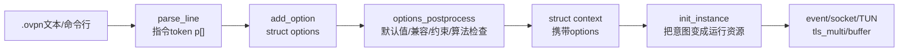
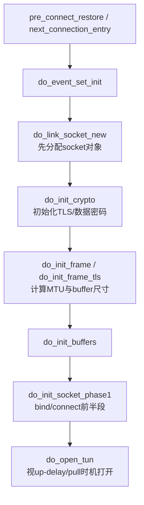

> 源码基线：OpenVPN 2.7.4 上游，官方 tag `v2.7.4` 对应提交 `8e9e91f`  
> 本文只回答一件事：`.ovpn` 文本中的配置如何变成 `struct options`，又如何被 `init_instance()` 消费为可运行的 socket、TUN、TLS、密码和事件对象。  
> 下一条链：[OpenVPN 控制报文如何进入 TLS 状态机](OpenVPN%20六链源码精读%2002%20控制报文到TLS状态机.md)

## 1. 先看结论：配置不是被逐行“执行”



两次转换的性质完全不同：

1. **语法与语义转换**：字符串变成 `struct options` 中的字段，然后校验组合是否合法。
2. **配置与运行转换**：`init_instance()` 根据配置创建真正的 fd、buffer、TLS 对象和 TUN/TAP。

因此：

> 配置解析成功不等于连接成功；算法名被 `add_option()` 写入也不等于密码后端可用、对端选中或数据通道真正使用。

## 2. 输入从哪里来

OpenVPN 配置至少有三个入口：

| 输入形式 | 例子 | 入口 | 最终是否走 `add_option()` |
| --- | --- | --- | --- |
| 命令行 | `openvpn --config client.ovpn --verb 4` | `options_parse.c:450 parse_argv()` | 是 |
| 配置文件 | `client.ovpn` 内每一行 | `options_parse.c:346 read_config_file()` | 是 |
| 服务端 PUSH | `PUSH_REPLY,route ...,data-ciphers ...` | `options_parse.c:512 apply_push_options()` | 是，但受更严的 permission mask 约束 |

这是一个关键设计：多种来源最终共用同一套字段写入与权限校验，从而避免“文件允许什么、PUSH 又能绕过规则”。

## 3. 第一段：`openvpn_main()` 建立配置容器

`src/openvpn/openvpn.c:153 openvpn_main()` 是进程总入口。与本链有关的顺序是：

```text
CLEAR(c)
→ init_static()
→ context_clear_all_except_first_time(&c)
→ gc_init(&c.gc)
→ init_options(&c.options)
→ parse_argv(&c.options, ...)
→ init_early(&c)
→ options_postprocess(&c.options, ...)
→ context_init_1(&c)
→ tunnel_point_to_point() 或 tunnel_server()
```

### 3.1 为什么先 `init_options()`

`struct options` 不是只存文件中明写的项。它还包含默认值、编译特性影响下的初值和后续规范化的结果。所以必须先建立合法的默认状态，再用用户配置覆盖。

### 3.2 为什么 `init_early()` 介于 parse 和 postprocess 之间

`openvpn.c:104 init_early()` 会提前加载配置指定的 OpenSSL Provider。注释明确说明，选项后处理与 OpenSSL 信息查询依赖这一步。

这意味着算法可用性检查不能完全在纯文本阶段完成；它受运行时密码库和已加载 Provider 影响。

## 4. 第二段：一行文本如何变成 `p[]`

`options_parse.c:346 read_config_file()` 逐行读取文件：

```c
while (fgets(line, sizeof(line), fp))
{
    if (parse_line(line + offset, p, SIZE(p) - 1, ...))
    {
        bypass_doubledash(&p[0]);
        add_option(options, p, ...);
    }
}
```

不要只把 `p[]` 理解成“字符串数组”，而要看成解析后的指令：

```text
文本：data-ciphers AES-256-GCM:AES-128-GCM

p[0] = "data-ciphers"
p[1] = "AES-256-GCM:AES-128-GCM"
p[2] = NULL
```

`parse_line()` 还要处理引号、转义、注释和空白。因此下游 `add_option()` 不应重复实现字符级语法，它聚焦指令语义。

### 4.1 inline 块为什么是特殊输入

`.ovpn` 可以包含：

```text
<ca>
-----BEGIN CERTIFICATE-----
...
</ca>
```

`check_inline_file_via_fp()` 会继续读取多行并把其视为一个选项的值。这也是为什么 `read_config_file()` 会用 `lines_inline` 修正行号：如果不修正，后续错误位置会错位。

## 5. 第三段：`add_option()` 是配置的中央语义分发器

`src/openvpn/options.c:5589 add_option()` 是一个很长的 `if/else if` 链。它长不代表设计混乱；这个函数正在集中回答四个问题：

1. `p[0]` 是不是已知指令？
2. 参数数量和格式是否正确？
3. 当前来源的 `permission_mask` 是否允许这个指令？
4. 通过后应写入 `struct options` 的哪个字段？

例如 `options.c:8441-8450`：

```c
else if ((streq(p[0], "data-ciphers") || streq(p[0], "ncp-ciphers"))
         && p[1] && !p[2])
{
    VERIFY_PERMISSION(OPT_P_GENERAL | OPT_P_INSTANCE);
    options->ncp_ciphers = p[1];
}
```

这里证明的只是：

```text
指令名被识别
→ 参数形式合法
→ 来源权限允许
→ 原始字符串写入options->ncp_ciphers
```

它还没有证明 cipher 真的可用。

## 6. 第四段：`options_postprocess()` 把“各自合法”变成“组合合法”

文本解析只能检查单个指令。真实配置还需要跨字段约束，例如：

- 客户端/服务端模式与地址参数是否匹配；
- `dev tun` / `dev tap` 与 topology 是否合理；
- TLS 模式是否有必要的凭据；
- `data-ciphers` 列表是否可解析且后端支持；
- 旧版兼容选项应该怎样转换。

`options.c:3775-3783` 中：

```text
设置默认NCP ciphers
→ 处理向后兼容
→ 处理PRF选项
→ 处理单个cipher
→ mutate_ncp_cipher_list()
→ 不支持或过长则报错退出
```

`ssl_ncp.c:96 mutate_ncp_cipher_list()` 是继续追查数据算法列表的下一个入口。如果做 SM4 数据通道改造，不能只在 `add_option()` 添一个名字，还必须检查这条规范化与后端可用性链。

## 7. 第五段：`options` 如何进入 `context`

`openvpn_main()` 中的 `struct context c` 是栈上创建的总运行对象，其内直接包含 `struct options options`。

`context_init_1(&c)` 完成第一级上下文初始化，随后根据 `c.options.mode` 分流：

```text
MODE_POINT_TO_POINT → tunnel_point_to_point(&c)
MODE_SERVER         → tunnel_server(&c)
```

客户端/点对点路径中，`tunnel_point_to_point()` 设置 `c->mode = CM_P2P`，调用 `init_instance_handle_signals()`，内部最终进入 `init_instance()`。

这里要区分：

- `options.mode`：配置层选择 P2P 或 server；
- `context.mode`：运行层还会区分顶层 server listener、UDP child、TCP child 等角色。

## 8. 第六段：`init_instance()` 按依赖顺序创建真正资源

`src/openvpn/init.c:4436 init_instance()` 不是随意列出一堆 init。其顺序反映了对象依赖：



### 8.1 为什么密码初始化要早于 buffer

buffer 尺寸要考虑 cipher 块大小、AEAD tag、OpenVPN 包头、TLS 控制包开销和网络 MTU。所以必须先知道密码与帧参数，再分配工作 buffer。

### 8.2 `do_init_crypto()` 的三条路

`init.c:3525 do_init_crypto()` 根据配置分流：

```text
shared_secret_file 存在 → 静态密钥模式
tls_server/tls_client    → do_init_crypto_tls()
两者都没有           → none（明文警告）
```

现代需要身份认证和动态换钥的 VPN 主要走 TLS 分支。

### 8.3 `do_init_crypto_tls()` 的关键输出

`init.c:3245 do_init_crypto_tls()` 先从 `options` 组装一份 `struct tls_options to`：

- 客户端还是服务端；
- 握手、轮换、超时时间；
- 证书校验策略；
- 数据 cipher 配置；
- `tls-auth/tls-crypt` 包装；
- DCO 是否启用。

然后在 `init.c:3464`：

```c
c->c2.tls_multi = tls_multi_init(&to);
```

这是本链的关键终点：配置已经从 `options` 转换为当前连接周期内可推进的 `tls_multi`。

## 9. 完整的对象传递表

| 阶段 | 当前形态 | 关键函数 | 下一个消费者 |
| --- | --- | --- | --- |
| 读文件 | 一行 `char[]` | `read_config_file()` | `parse_line()` |
| 分词 | `char *p[]` | `parse_line()` | `add_option()` |
| 写入配置 | `struct options` | `add_option()` | `options_postprocess()` |
| 校验与规范化 | 内部一致的 `options` | `options_postprocess()` | `context_init_1()/init_instance()` |
| 初始化 TLS 配置 | `struct tls_options` | `do_init_crypto_tls()` | `tls_multi_init()` |
| 初始化运行资源 | `context.c1/c2` | `init_instance()` | 主事件循环 |

## 10. 国密改造怎样映射到这条链

以“增加 TLCP 双证书配置”为例，最小需求链应是：

```text
新配置项（协议模式、签名证书/私钥、加密证书/私钥）
→ options.h中有独立字段
→ add_option()识别并校验参数
→ options_postprocess()校验成对凭据与模式约束
→ init/do_init_crypto_tls_c1把配置传给TLS backend
→ ssl_openssl.c创建正确协议方法并分别加载两套凭据
```

如果只在 `ssl_openssl.c` 通过环境变量或硬编码路径读第二张证书，可以做 PoC，但不是完整的产品配置模型：输入约束、敏感数据管理、多实例、热重载和错误反馈都需要另外完成。

## 11. 失败现象怎样反推位置

| 现象 | 优先检查 | 原因边界 |
| --- | --- | --- |
| `Unrecognized option` | `parse_line/add_option` 是否识别指令 | 还没进入 TLS |
| `data-ciphers list contains unsupported ciphers` | `mutate_ncp_cipher_list()` 与后端 cipher 枚举 | 还没和对端协商 |
| 证书/私钥文件打不开 | TLS root context 初始化 | 还没创建可用 `key_state` |
| TUN 打不开 | `do_open_tun()`、权限、驱动 | TLS 能力未必有问题 |
| 配置对但连接无响应 | socket phase、地址解析、防火墙 | 不应立即怀疑密码代码 |

## 12. 跟读练习

### 练习 A：只追一个配置项

选择 `data-ciphers`，在源码中依次找到：

1. `add_option()` 的命中分支；
2. `options->ncp_ciphers` 后续的 `mutate_ncp_cipher_list()`；
3. `do_init_crypto_tls()` 将它复制到 `tls_options.config_ncp_ciphers`；
4. `ssl_ncp.c` 协商选择最佳 cipher 的函数。

要求自己说出每一步中数据的 C 类型与下一个消费者。

### 练习 B：故意输入一个不支持的 cipher

只需记录三件事：

- 错误在解析、postprocess、TLS 协商还是数据 key 初始化阶段出现；
- 当时是否已发出网络包；
- 这个失败能证明哪个校验层真的在起作用。

## 13. 掌握检查

1. `parse_line()` 和 `add_option()` 的责任有什么不同？
2. 为什么 Provider 要在 `options_postprocess()` 之前加载？
3. 为什么 `data-ciphers` 被写入 `options` 不代表已经使用该算法？
4. `init_instance()` 中为什么要先确定 crypto/frame 再分配 buffer？
5. 增加一个 TLCP 双证书选项时，至少要穿过哪几层？
