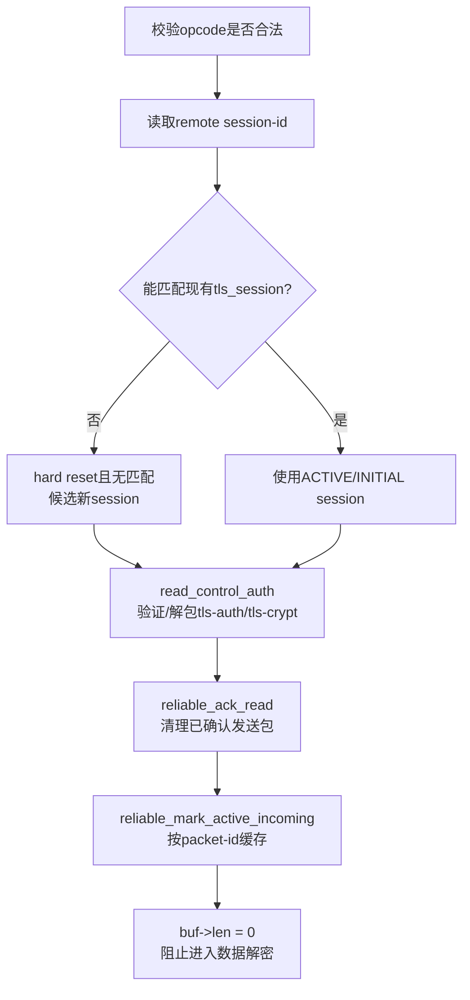
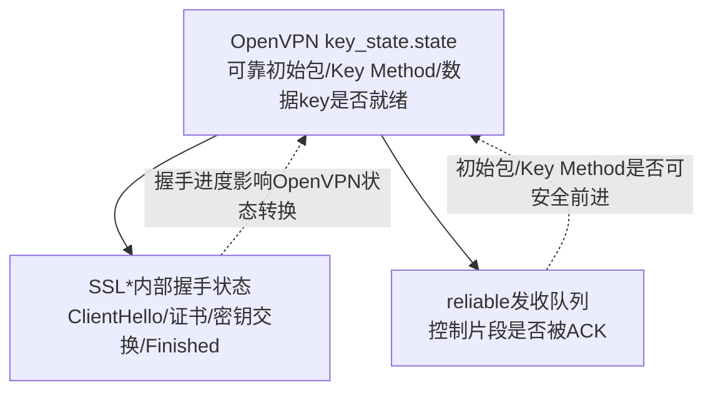

> 源码基线：OpenVPN 2.7.4 上游，官方 tag `v2.7.4` 对应提交 `8e9e91f`  
> 本文只回答：从 UDP/TCP socket 收到一个 OpenVPN 控制包后，它如何经过 opcode 分流、包装验证、session 匹配、可靠传输和 Memory BIO，最终驱动密码库的 TLS 状态机。  
> 上一条链：[配置到运行上下文](OpenVPN%20六链源码精读%2001%20配置到运行上下文.md) · 下一条链：[TLS 握手到数据通道密钥](OpenVPN%20六链源码精读%2003%20TLS握手到数据通道密钥.md)

## 1. OpenVPN 为什么不能把 TLS 直接绑到 socket

普通 HTTPS 常建立在有序、可靠的 TCP 字节流上。OpenVPN 的外层传输可以是 UDP，并且同一个外层端口还要同时承载：

- TLS 握手与 OpenVPN 控制命令；
- 数据通道业务包；
- ACK、重传、session-id、key-id；
- 可选 `tls-auth`、`tls-crypt` 或 `tls-crypt-v2` 的外层保护。

所以 OpenVPN 必须在 TLS 之上、外层 socket 之下提供自己的包装和可靠传输：


## 2. 入口：事件循环看到 `SOCKET_READ`

P2P 模式的主循环在 `openvpn.c:73-91`：

```text
pre_select(c)
→ io_wait(c, p2p_iow_flags(c))
→ process_io(c, socket)
```

`forward.c:2287 process_io()` 检查 `event_set_status`。当 `SOCKET_READ` 就绪时：

```text
read_incoming_link(c, sock)
→ process_incoming_link(c, sock)
→ process_incoming_link_part1(...)
```

`read_incoming_link()` 调用 `link_socket_read()`，将外层报文放入 `c->c2.buf`。这个时候程序只知道“收到一个 OpenVPN 外层包”，还没有确定它是控制包还是数据包。

## 3. 第一个决定性函数：`tls_pre_decrypt()`

`process_incoming_link_part1()` 在 `forward.c:1070` 调用：

```c
tls_pre_decrypt(c->c2.tls_multi, &c->c2.from,
                &c->c2.buf, &co, floated, &ad_start)
```

函数输入/输出不只是一个布尔值：

| 参数 | 进入时 | 返回后意义 |
| --- | --- | --- |
| `multi` | 该隧道的 TLS/session/key 总状态 | 可能更新 session、reliable 队列和错误计数 |
| `from` | 外层来源地址 | 用于会话匹配与地址验证 |
| `buf` | 原始 OpenVPN 外层包 | 控制包会被本层消费并清零；数据包会前移到密文载荷 |
| `opt` | `NULL` | 数据包返回对应 key-id 的 `crypto_options *`；控制包保持 `NULL` |
| `ad_start` | `NULL` | AEAD 需要认证的 OpenVPN 包头起点 |

### 3.1 opcode 分流

`ssl.c:3578-3585`：

```text
pkt_firstbyte = *BPTR(buf)
op = pkt_firstbyte >> P_OPCODE_SHIFT

P_DATA_V1/P_DATA_V2
    → handle_data_channel_packet()
    → return false

其他合法opcode
    → 继续按控制包处理
```

返回 `false` 不代表错误，而是告诉调用者：这是数据包，后续应调用 `openvpn_decrypt()`。返回 `true` 则表示这是已被控制通道接管的包。

## 4. 第二段：控制包先定位会话，再进 TLS

`tls_pre_decrypt()` 对控制包的处理顺序可概括为：



### 4.1 session-id 和 key-id 不是一件事

- **session-id**：用来找 `tls_session`，区分不同的 OpenVPN 控制会话。
- **key-id**：用来找当前 session 内对应的密钥代际。
- **packet-id**：用于可靠传输排序、ACK 和防重复。

三者分别回答：“属于哪次会话”、“属于哪代 key”、“在这条可靠字节序列中是第几片”。

### 4.2 `read_control_auth()` 在 TLS 之前

如果配置了 `tls-auth` / `tls-crypt`，`read_control_auth()` 会先验证或解包 OpenVPN 控制包外层。它和 TLS 证书验证不是同一层：

```text
OpenVPN外层包装验证（可选）
→ 控制包进入reliable层
→ TLS状态机处理握手
→ X.509证书/身份验证
```

所以 `tls-auth` 通过不能代表证书可信；证书校验通过也不代表配置了外层 `tls-crypt`。

## 5. 第三段：`reliable` 把 UDP 包还原成 TLS 可消费的顺序

TLS 需要按顺序消费字节流。UDP 可以丢包、乱序和重复，因此 OpenVPN 的 `reliable.c` 承担：

- 为控制片段分配 packet-id；
- 保存未收到 ACK 的发送片段；
- 按序缓存收到的片段；
- 对缺失或超时片段重传；
- 只把当前序号期待的 ciphertext 交给 TLS。

`tls_pre_decrypt()` 在 `ssl.c:3855-3899` 处理 ACK 并将新片段标记到 `rec_reliable`。它没有立即直接调用 `SSL_read()`，因为还需要等待排序和主循环的安全推进。

## 6. 第四段：谁真正推进 TLS 状态机

收包链把控制 ciphertext 放入 reliable 队列后，主循环的下一轮 `pre_select()` 会调用：

```text
forward.c:178 check_tls()
→ ssl.c:3206 tls_multi_process()
→ ssl.c:3009 tls_process()
→ ssl.c:2735 tls_process_state()
```

职责分层：

| 函数 | 它管的颗粒度 |
| --- | --- |
| `check_tls()` | 把 TLS 活动接入 OpenVPN 主事件循环，处理返回状态和下次唤醒时间 |
| `tls_multi_process()` | 遍历 `tls_multi` 中需要处理的 active/initial session |
| `tls_process()` | 管理一个 session 的 primary/lame-duck key、重协商和循环推进 |
| `tls_process_state()` | 执行一次具体状态转换、BIO I/O、Key Method 读写和 reliable 发包 |

## 7. 第五段：从 `rec_reliable` 到 Memory BIO

`tls_process_state()` 的接收方向：

```text
reliable_get_entry_sequenced(ks->rec_reliable)
→ read_incoming_tls_ciphertext(&entry->buf, ks, ...)
→ key_state_write_ciphertext(&ks->ks_ssl, buf)
→ BIO_write(ks_ssl->ct_in, ...)
```

`key_state_ssl_init()` 在 `ssl_openssl.c:2218` 创建：

```text
SSL_new(ssl_ctx->ctx)
→ ssl_bio = BIO_f_ssl()
→ ct_in = BIO_s_mem()
→ ct_out = BIO_s_mem()
→ SSL_set_accept_state()或SSL_set_connect_state()
→ SSL_set_bio(ssl, ct_in, ct_out)
```

可以把三个 BIO 理解为：

- `ct_in`：OpenVPN 把收到的 TLS ciphertext 喂给 `SSL *` 的入口；
- `ct_out`：`SSL *` 生成的 TLS ciphertext 出口；
- `ssl_bio`：OpenVPN 以明文视角调用 TLS 读写的包装。

## 8. 第六段：TLS 状态机的输出怎样回到网络

TLS 握手往往在消费一段输入后生成新的 ciphertext。发送链是：

```text
SSL内部状态机产生ciphertext
→ ct_out Memory BIO
→ key_state_read_ciphertext()
→ check_outgoing_ciphertext()
→ 写入send_reliable队列
→ reliable_send()
→ write_control_auth()
→ to_link
→ process_outgoing_link()
→ link_socket_write()
```

`tls_process_state()` 在 `ssl.c:2785-2805` 优先从 `send_reliable` 取可发控制包，用 `write_control_auth()` 加上 OpenVPN 外层控制头与包装保护，最后放入 `to_link`。

注意：在 OpenVPN 层面抓包时，你看到的不是纯 TLS record 直接从 socket 发出，而是外面还有 OpenVPN 控制包格式。

## 9. OpenVPN 状态和 TLS 状态不要混淆

`key_state.state` 如 `S_INITIAL`、`S_START`、`S_SENT_KEY`、`S_GOT_KEY`、`S_ACTIVE` 是 **OpenVPN 自己的 key/session 状态**。密码库内部还有 TLS/TLCP 握手状态。



`ssl.c:2763-2769` 甚至把 OpenVPN 初始三次包交互的完成判定为“本端初始包已获得 ACK”。这不是 TLS Finished 的同义词。

## 10. TLCP 改造真正应当落在哪里

从这条链可以得出：

- OpenVPN 的 opcode、session-id、ACK、reliable 和 Memory BIO 运载模型原则上可以继续复用；
- TLS 还是 TLCP，主要是 Memory BIO 后面的 `SSL *` 应采用什么协议方法、证书模型和密码套件；
- 但不能只换 `SSL_CTX_new()` 一行就宣称完成，还需检查双证书加载、验证、Exporter 语义、错误处理、重协商与回退。

上游 2.7.4 的 `ssl_openssl.c:103/121` 使用常规 OpenSSL server/client method 创建 `SSL_CTX`。任何 Tongsuo/TLCP 分支都必须以实际 patch 和运行时库身份再确认，不能把本地 PoC 当上游事实。

## 11. 失败现象和定位路径

| 现象 | 说明至少走到 | 优先检查 |
| --- | --- | --- |
| `TLS Error: unknown opcode` | 已从 socket 读到包并进入 `tls_pre_decrypt()` | 端口流量是否真是 OpenVPN、版本/包格式 |
| `session-id not found` | opcode 被当作控制包 | 包长、外层封装、损坏或错误解包 |
| `local/remote key IDs out of sync` | 已匹配 session，但密钥代际不一致 | 重协商、一端重启、旧包 |
| `TLS key negotiation failed ...` | OpenVPN key state 在时限内没前进到 active | 网络丢包、重传、TLS 错误、证书问题 |
| `TLS handshake failed` | TLS backend/BIO 已被调用 | 密码库 error stack、协议版本、cipher、证书 |

## 12. 跟读练习

### 练习 A：画出一个入站控制包

从 `process_io()` 开始，手动写出以下链条，每步补一句“当前 buffer 里是什么”：

```text
process_io
→ read_incoming_link
→ process_incoming_link_part1
→ tls_pre_decrypt
→ read_control_auth
→ reliable_mark_active_incoming
→ tls_multi_process/tls_process_state
→ key_state_write_ciphertext
→ ct_in BIO
```

### 练习 B：故意用错误 `tls-auth` key

观察错误是在 TLS 证书日志之前还是之后出现。若外层验证已拒绝包，TLS 状态机不应收到有效握手字节。

## 13. 掌握检查

1. OpenVPN over UDP 为什么还能满足 TLS 对有序字节流的需求？
2. `tls_pre_decrypt()` 返回 `true` 和 `false` 分别表示什么？
3. `tls-auth` 验证与 X.509 证书验证在链条中的先后关系是什么？
4. `ct_in`、`ct_out`、`ssl_bio` 分别是什么方向？
5. 为什么收到一个控制包后不一定在同一个函数栈里立即完成 TLS 握手？
