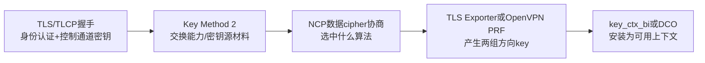
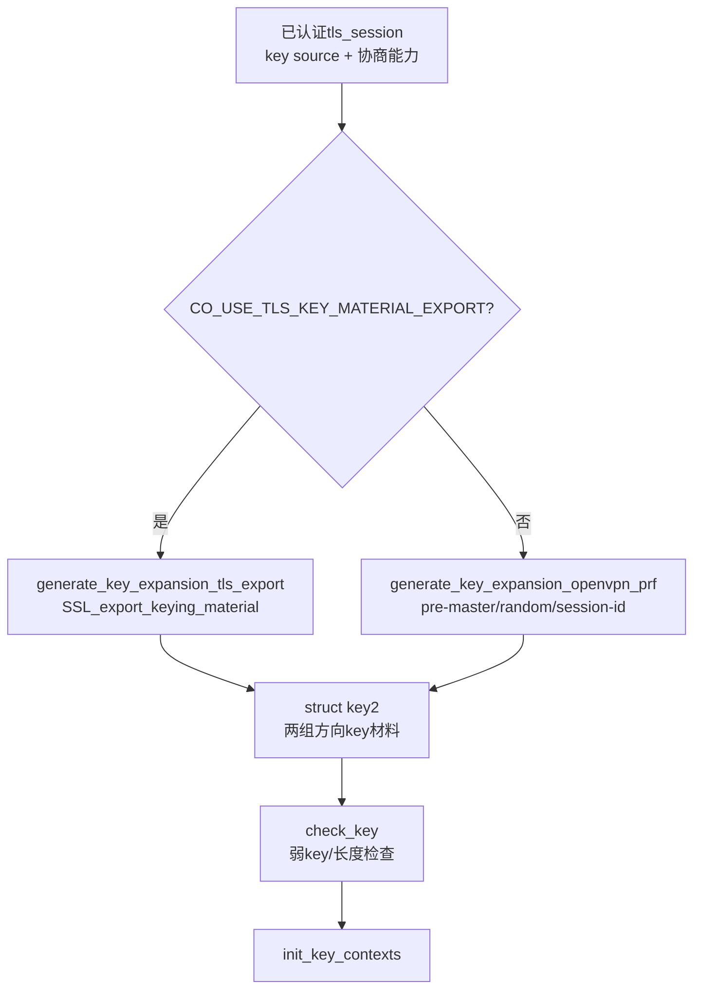
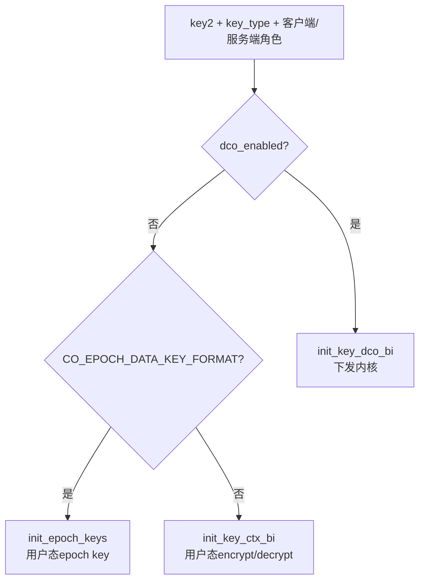

> 源码基线：OpenVPN 2.7.4 上游，官方 tag `v2.7.4` 对应提交 `8e9e91f`  
> 本文只回答：TLS 握手及身份认证成功后，OpenVPN 如何交换/导出密钥材料、协商数据 cipher、派生双向 key，并将它安装到用户态 `crypto_options` 或 DCO。  
> 上一条链：[控制报文到 TLS 状态机](OpenVPN%20六链源码精读%2002%20控制报文到TLS状态机.md) · 下一条链：[TUN 明文到外层密文](OpenVPN%20六链源码精读%2004%20TUN明文到外层密文.md)

## 1. 先把五件事彻底分开



| 概念 | 它回答的问题 |
| --- | --- |
| TLS/TLCP cipher suite | 控制通道 record 和握手使用什么算法 |
| `data-ciphers` / NCP | OpenVPN 业务数据包使用什么 cipher |
| Key Method 2 | 在已加密 TLS 控制通道中交换 OpenVPN 能力、认证字段和密钥源材料 |
| TLS Exporter / OpenVPN PRF | 如何把共同材料派生为 OpenVPN 数据通道 key |
| `key_ctx_bi` | 哪一组 key 用于发送，哪一组用于接收，对应的 cipher/HMAC 上下文是什么 |

所以：

> 控制通道在 TLS 1.3 中选中某个 SM4 套件，不会自动让 OpenVPN 数据通道也使用 SM4。数据通道有独立的协商、密钥上下文和包格式。

## 2. 起点：TLS 里传的 Key Method 2 不是最终数据 key

`ssl.c:2059 key_method_2_write()` 将一段 OpenVPN 明文写入 TLS 控制通道。主要内容包括：

```text
leading uint32
→ key method/flags
→ key source material
→ options string
→ 可选username/password或auth-token
→ peer-info
```

这段“明文”是对 TLS API 而言的应用层明文；在外层网络上它被 TLS/TLCP record 加密，又被 OpenVPN 控制包包装。

`key_source2_randomize_write()` 写入的是**密钥源材料**，而不是已经可以直接拿来逐包加密的 `EVP_CIPHER_CTX`。

## 3. 对端怎样读出能力与密钥源

`ssl.c:2214 key_method_2_read()` 按相同布局读取：

1. 跳过 leading uint32；
2. 检查 key method 是 2；
3. `key_source2_read()` 读对端密钥源材料；
4. 读 OCC options string；
5. 读用户名/密码与 peer-info；
6. 从 peer-info/options 中获取对端 cipher 与 NCP 能力；
7. 完成证书或用户认证判断。

函数在 `ssl.c:2256` 先将 `ks->authenticated` 设为 `KS_AUTH_FALSE`，只有认证逻辑通过才进入可用状态。这个顺序很重要：程序不应因为已经收到密钥源就允许业务流量。

## 4. NCP 在协商什么

NCP（Negotiable Crypto Parameters）用于选择 OpenVPN **数据通道** cipher。

### 4.1 本端列表如何形成

```text
data-ciphers配置字符串
→ options->ncp_ciphers
→ mutate_ncp_cipher_list()
→ 名字规范化+后端可用性检查
→ tls_options.config_ncp_ciphers
```

`ssl_ncp.c:96 mutate_ncp_cipher_list()` 会逐个调用 `cipher_valid()`，并限制为受支持的 AEAD/CBC/CFB/OFB 模式。

### 4.2 对端列表如何进来

`key_method_2_read()` 读出 peer-info，其中 `IV_CIPHERS=` 可以声明对端的 cipher 列表。`ssl_ncp.c:225 tls_peer_ncp_list()` 负责提取。

### 4.3 选中规则

`ssl_ncp.c:246 ncp_get_best_cipher()` 按 server list 顺序寻找对端也支持的第一个 cipher。P2P 路径的 `get_p2p_ncp_cipher()` 也明确使用 TLS server 一方的优先级使结果确定。

因此要证明 SM4 数据通道真的协商成功，至少需要：

```text
双方能力列表中都出现SM4
→ 选择函数最终返回SM4名称
→ key_type实际更新为SM4
→ key_ctx_bi或DCO安装成功
```

## 5. 两条密钥派生路径

`ssl.c:1479 generate_key_expansion()` 是关键分流：



### 5.1 TLS Exporter 路径

`generate_key_expansion_tls_export()` 调用 backend 函数 `key_state_export_keying_material()`。OpenSSL 实现在 `ssl_openssl.c:159`：

```text
session->key[KS_PRIMARY].ks_ssl.ssl
→ SSL_export_keying_material(label, length, ...)
→ 填充key2->keys
→ key2->n = 2
```

该路径把数据通道 key 与当前 TLS 会话密码学绑定，不需要再用旧 OpenVPN PRF 单独构造 master secret。

### 5.2 OpenVPN PRF 兼容路径

`generate_key_expansion_openvpn_prf()` 使用双方 Key Method 交换的材料：

```text
client.pre_master
+ client.random1
+ server.random1
→ openvpn_PRF(... "master secret")
→ 48字节master

master
+ client.random2
+ server.random2
+ client/server session-id
→ openvpn_PRF(... "key expansion")
→ key2->keys[0..1]
```

这里“在 TLS 控制通道中交换”与“使用 TLS 内部 record key 直接加密业务包”仍然是两件事。

## 6. 双向 key 怎样避免两端都当成“发送 key”

`crypto.h:258 struct key_direction_state` 保存：

```text
out_key：本端发送使用key2中的哪一项
in_key： 本端接收使用key2中的哪一项
```

`ssl.c:1383`：

```c
int key_direction = server ? KEY_DIRECTION_INVERSE
                           : KEY_DIRECTION_NORMAL;
```

这是方向对称的关键：

```text
客户端 out_key = A，in_key = B
服务端 out_key = B，in_key = A
```

如果双方方向都是 normal，就会出现“双方各自能生成 key，但收到包总是验证/解密失败”。

## 7. 终点：`init_key_contexts()` 安装到用户态或 DCO

`ssl.c:1377 init_key_contexts()` 不做一种固定初始化，而是三分支：



### 7.1 用户态分支

`init_key_ctx_bi()` 根据已协商 `key_type`、方向与 `key2` 创建：

```text
ks->crypto_options.key_ctx_bi.encrypt
ks->crypto_options.key_ctx_bi.decrypt
```

每个 `key_ctx` 持有对应 cipher/HMAC 后端上下文。`openvpn_encrypt()` 和 `openvpn_decrypt()` 之后只需要拿 `crypto_options *`，不必重新参与 TLS 协商。

### 7.2 DCO 分支

`init_key_dco_bi()` 把 key-id、cipher 和发/收 key 安装到内核。用户态 encrypt/decrypt 上下文随后被清空，并仅把 `initialized` 设为 true。

这是一个重要边界：若 DCO 不支持 SM4，仅让用户态 OpenSSL/Tongsuo 支持 SM4 不足以完成 DCO 模式。

## 8. `tls_session_generate_data_channel_keys()` 为什么先检查认证

`ssl.c:1543 tls_session_generate_data_channel_keys()` 获取 primary `key_state`。如果 `ks->authenticated <= KS_AUTH_FALSE`，函数拒绝生成数据 key。

这条安全顺序是：

```text
TLS握手建立保护通道
→ 验证对端证书/用户身份
→ 确定数据cipher与密钥派生方法
→ 生成并安装数据key
→ 允许业务包
```

如果改造代码把“认证异步尚未完成”当成“先装 key 再说”，就会破坏这条安全边界。

## 9. 一张密钥地图

| 材料/密钥 | 由谁生成 | 在网络上是否直接出现 | 最后用途 |
| --- | --- | --- | --- |
| TLS 临时密钥交换材料 | TLS/TLCP 密码库 | 只传公开部分，私密不出网络 | 派生 TLS record secrets |
| TLS record key | TLS/TLCP 密码库 | 不传输 | 保护 Key Method/PUSH 等控制明文 |
| `key_source2` 源材料 | 双方 OpenVPN | 在 TLS 保护下交换 | 兼容 PRF 路径的输入 |
| TLS Exporter 输出 | 密码库从 TLS session 导出 | 不直接传输 | 现代数据通道 key 派生 |
| `key2.keys[0..1]` | OpenVPN KDF/Exporter 路径 | 不传输 | 双向 key 初始材料 |
| `key_ctx_bi.encrypt/decrypt` | crypto backend 初始化 | 不传输 | 用户态逐包加解密 |

## 10. 国密/TLCP 改造在这条链上要检查什么

1. **TLS/TLCP 层**：真正运行的 `SSL *` 是否进入 Tongsuo TLCP/TLS 国密状态机？
2. **身份层**：签名/加密双证书是否各履其职，验证失败是否真正阻断建链？
3. **Exporter 层**：目标 TLCP 实现是否支持 OpenVPN 所需 label/length 的 keying material export？如何验证双端一致？
4. **NCP 层**：SM4 数据 cipher 的名字、模式、tag/IV 参数与两端能力列表是否一致？
5. **backend 层**：`cipher_valid()` 与 `init_key_ctx_bi()` 是否真正取到了 SM4 实现？
6. **DCO 层**：若启用 DCO，内核端是否支持相同数据 cipher？

## 11. 最容易出现的假成功

| 表面现象 | 不能证明 | 还需要什么 |
| --- | --- | --- |
| TLS/TLCP 握手日志成功 | 数据 cipher 为 SM4 | NCP 选中结果 + `key_type/key_ctx` 运行证据 |
| 配置出现 `SM4-*` | cipher backend 真的支持 | postprocess、协商和 key 初始化证据 |
| `Initialization Sequence Completed` | 所有业务包都按目标算法保护 | 实际数据流、运行 cipher、错误 key 负面测试 |
| Provider 加载成功 | 运算已进 HSM | Provider/HSM 调用计数或审计日志 |

## 12. 跟读练习

在源码中以 `generate_key_expansion()` 为中心，向前和向后各追一步：

```text
前向：key_method_2_read()如何获取key source/peer info/auth state
当前：generate_key_expansion()如何选Exporter或OpenVPN PRF
后向：init_key_contexts()如何选用户态或DCO
```

完成标准不是背出行号，而是能在纸上画出：

```text
认证状态 + 对端能力 + 密钥源
→ 选择cipher和KDF
→ 生成两组key
→ 客户端/服务端反向分配
→ 安装到crypto_options或DCO
```

## 13. 掌握检查

1. TLS cipher suite 和 `data-ciphers` 的选择对象分别是什么？
2. `key_source2` 为什么不能直接当数据通道 key 使用？
3. TLS Exporter 路径和兼容 OpenVPN PRF 路径的输入有什么不同？
4. 客户端和服务端怎样确保本端发送 key 就是对端接收 key？
5. 为什么 DCO 不支持 SM4 时，只改 OpenSSL/Tongsuo 用户态后端不足够？
