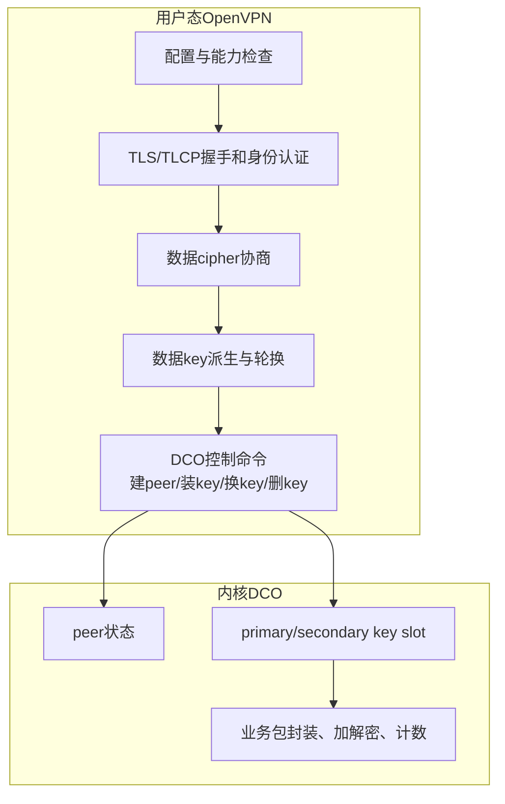
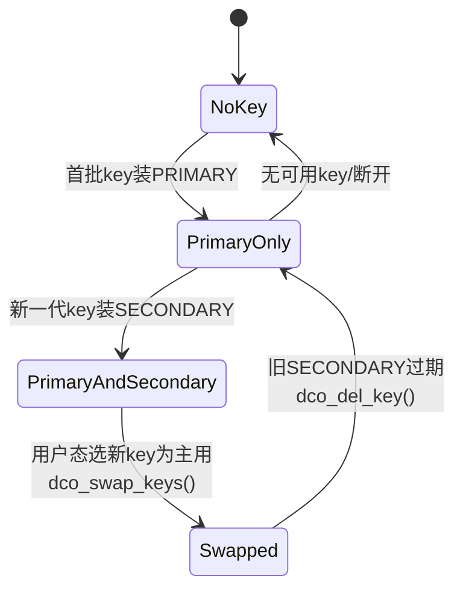

> 源码基线：OpenVPN 2.7.4 上游，官方 tag `v2.7.4` 对应提交 `8e9e91f`  
> 本文只回答：启用 Data Channel Offload（DCO）后，用户态 TLS 控制面如何将数据 cipher、双向 key、IV 与 key-id 安装到内核，并在重协商时管理 primary/secondary key slot。  
> 边界：DCO 是可选数据面，不是 OpenVPN 所有部署的默认事实；Linux、Windows 与 FreeBSD 的平台实现不同。  
> 上一条链：[外层报文到 TUN 明文](OpenVPN%20六链源码精读%2005%20外层报文到TUN明文.md)

## 1. DCO 不是把整个 OpenVPN 搬进内核



保留在用户态的关键职责：

- 解析配置和判断 DCO 是否可用；
- TLS/TLCP 握手、证书/用户认证；
- 协商数据 cipher；
- 派生、轮换和销毁数据 key；
- 把 peer、key 和路由意图下发内核；
- 处理 DCO 状态事件和统计。

内核主要接管建链后的高频业务包路径。这就是为什么 DCO 是数据面优化，不是协议控制面的替代。

## 2. DCO 起点不是装 key，而是先做配置可行性检查

`options.c:3887-3890` 在后处理阶段调用 `dco_check_option()` 和 `dco_check_startup_option()`。`dco.c:237 dco_check_option_ce()` 会检查与 DCO 不兼容的连接选项，例如内部 fragment 会禁用 offload。

这个阶段的目的不是“让所有配置都强行跑 DCO”，而是明确判断：

```text
当前编译是否包含DCO
→ 平台驱动/接口是否存在
→ 当前模式与选项是否可offload
→ 数据cipher是否为DCO支持集
→ 才将dco_enabled传入tls_options
```

所以 `--enable-dco` 编译成功、模块已加载、运行对当前 cipher 支持是三个不同的判定层次。

## 3. 用户态在什么时候决定“这批 key 下发内核”

TLS/Key Method 完成数据 key 派生后，`ssl.c:1377 init_key_contexts()` 检查 `dco_enabled`：

```text
dco_enabled == false
→ init_key_ctx_bi()
→ 用户态cipher/HMAC context

dco_enabled == true
→ init_key_dco_bi()
→ dco_install_key()
→ 内核DCO key slot
```

DCO 分支还会拒绝它不支持的独立 `--auth` HMAC 组合，并在下发失败时报致命错误。它不应静默创建一个“看起来 initialized，实际内核没 key”的状态。

## 4. `init_key_dco_bi()` 怎样对齐发送/接收方向

`dco.c:87 init_key_dco_bi()` 先用 `key_direction_state_init()` 获得 `out_key` 和 `in_key`，再调用：

```text
dco_install_key(
    encrypt_key = key2->keys[out_key].cipher,
    encrypt_iv  = 发送方向IV材料,
    decrypt_key = key2->keys[in_key].cipher,
    decrypt_iv  = 接收方向IV材料,
    ciphername)
```

客户端/服务端的 `key_direction` 相反，因此一端 encrypt 必须对应另一端 decrypt。DCO 不负责从一堆对称材料中自己猜方向；用户态在下发前已经完成方向分配。

## 5. `dco_install_key()` 为什么有两个 slot

OpenVPN 需要在不断流的情况下重协商数据 key。如果内核只保留一组 key，覆盖旧 key 的瞬间可能丢失仍在网络中的旧代数据包。

`dco.c:54 dco_install_key()` 采用：



具体规则：

- `dco_keys_installed == 0`：首个 key 安装到 `OVPN_KEY_SLOT_PRIMARY`；
- 已有 key：新 key 安装到 `OVPN_KEY_SLOT_SECONDARY`；
- 安装成功后，同步 `ks->dco_status`与计数；
- 底层平台接口是 `dco_new_key()`。

## 6. Linux 上下发链走到哪里

Linux 平台实现位于 `src/openvpn/dco_linux.c`。高层 `dco_new_key()` 最终构造 Generic Netlink 消息，调用 ovpn 内核接口建立 key。

```text
ssl.c init_key_contexts()
→ dco.c init_key_dco_bi()
→ dco.c dco_install_key()
→ 平台dco_new_key()
→ dco_linux.c构造OVPN_CMD_KEY_NEW Netlink消息
→ Linux ovpn/DCO内核实现
```

这里建立了类似但不等同于 strongSwan `kernel-netlink → XFRM` 的用户/内核交界：

- strongSwan 默认将 ESP SA/Policy 安装到 Linux XFRM；
- OpenVPN DCO 将 OpenVPN peer/key 安装到 ovpn/DCO 数据面；
- 两者的内核对象、包格式和接口都不同。

## 7. 谁驱动 key slot 切换

用户态 TLS 逻辑会建立新 key state、将它认证并选为当前发送 key。内核 DCO 不自己参与 TLS 轮换决策。

`forward.c:145 check_dco_key_status()` 在 TLS 处理后调用 `dco_update_keys()`。`dco.c:130 dco_update_keys()` 执行：

1. `tls_select_encryption_key()` 获取用户态当前 primary key；
2. 若已无可用 key，删除内核 primary/secondary；
3. 寻找另一个仍可用的 secondary key；
4. 若当前主用 key 原先装在 secondary slot，调用 `dco_swap_keys()`；
5. 若旧 secondary 已不存在，调用 `dco_del_key()`；
6. 同步所有 `key_state.dco_status`。

### 为什么切换失败会重连

`check_dco_key_status()` 如果发现 `dco_update_keys()` 失败，会注册 `SIGUSR1` 软重连。原因是用户态与内核对“当前主 key”的认知已可能分裂，继续传输可能造成持续丢包或用过期 key。

## 8. DCO 时数据包为什么不应经过 `encrypt_sign()`

`forward.c:621 encrypt_sign()` 在发现 DCO 启用时，直接告警并丢弃进入该用户态函数的数据包。这是对架构边界的主动守卫：

```text
未启用DCO：TUN → OpenVPN用户态加密 → socket
启用DCO：内核路径 → DCO内核加密/封装 → socket
```

如果运行时在 DCO 模式经常看到该警告，不应把它当成普通丢包，而应检查内核/用户态路径是否同时误用。

## 9. P_DATA_V1 与 DCO 的边界

`forward.c:1045-1057` 明确说明，DCO 驱动要求对端发 P_DATA_V2。旧 P_DATA_V1 可能被内核传回用户态，但 DCO 模式下用户态密码上下文已清空，因此也无法正常解密，必须丢弃。

这说明 DCO 不只对 cipher 有要求，还对 OpenVPN 数据包版本/能力协商有要求。

## 10. 国密化时的两条可选路线

### 路线 A：先使用用户态 SM4 数据通道

```text
OpenVPN数据协商支持SM4
→ crypto backend能创建SM4上下文
→ 用户态openvpn_encrypt/decrypt处理包
→ 明确禁用DCO或在可用性检查中回退
```

优点是改造边界较小，容易先证明正确性；缺点是业务包继续在用户态加解密，性能上限受拷贝、系统调用与单/多线程架构影响。

### 路线 B：对 DCO 内核数据面增加 SM4

```text
用户态NCP/Key Method协商SM4
→ DCO API表达SM4算法名/参数
→ 内核驱动识别并创建SM4加解密上下文
→ 包格式、nonce/tag/HMAC与用户态定义一致
→ 支持key安装/换代/删除/统计/负面测试
```

该路线不是只在 `dco.c` 字符串列表中加 `SM4-GCM`，而是用户态 API + 平台传输 + 内核实现 + 协议互通的联合改造。

## 11. 密码卡/HSM 与 DCO 不是同一层

| 能力 | 常见位置 | 主要任务 |
| --- | --- | --- |
| HSM/Provider/PKCS#11 | 用户态 TLS/TLCP 控制面 | 保护证书私钥、完成 SM2 签名/解密 |
| DCO | 内核 OpenVPN 数据面 | 高频业务包封装和对称加解密 |
| 密码卡数据面卸载 | 可能在内核驱动、用户态 SDK 或专用数据面 | 批量 SM4 处理，需单独设计提交/队列/异步/回退 |

“TLS 私钥在 HSM 内”不等于“DCO 的每个数据包经过密码卡”。若要证明数据面硬件卸载，必须有数据面调用计数、驱动队列、负载与 CPU/吞吐对比等证据。

## 12. DCO 的证据闭环

```text
编译特性中包含DCO
→ 运行平台驱动/内核接口可用
→ 选项与数据cipher通过dco_check_option
→ 建立peer成功
→ 密钥下发PRIMARY成功
→ 业务包不走用户态encrypt_sign
→ 内核统计/外层流量增长
→ 重协商后SECONDARY安装、swap、旧key删除成功
→ 错误key/无支持cipher的负面测试被正确拒绝
```

只看到 `DCO version` 日志不能证明本次连接真的使用 DCO；只看到 key 下发日志也不能证明换钥与业务包全部正常。

## 13. 跟读练习

打开以下三个文件，只追“安装第一代 key”：

```text
ssl.c
  generate_key_expansion()
  init_key_contexts()

dco.c
  init_key_dco_bi()
  dco_install_key()

dco_linux.c（Linux时）
  dco_new_key()对应的Netlink消息构造
```

记录五个输入：pear/peer id、key-id、slot、cipher name、发/收 key 与 IV。再追一次重协商，观察为什么第二代先进 secondary，然后 swap。

## 14. 掌握检查

1. DCO 接管哪些工作，哪些仍留在用户态？
2. 为什么第二代 key 不能立即覆盖 primary？
3. `dco_update_keys()` 依据什么判断要 swap？
4. 为什么用户态 Tongsuo 支持 SM4 不代表 DCO 支持 SM4？
5. HSM 完成 SM2 签名为什么不能证明 DCO 数据包经过密码卡？
