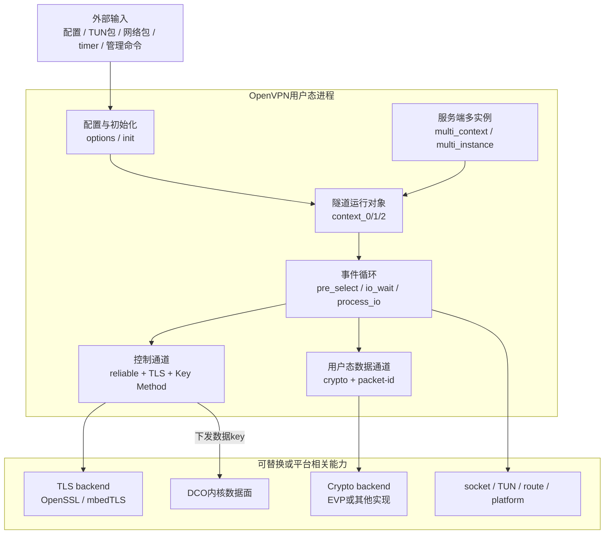
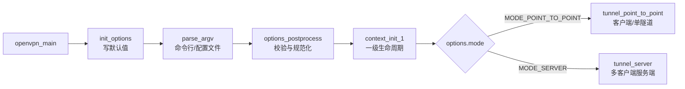
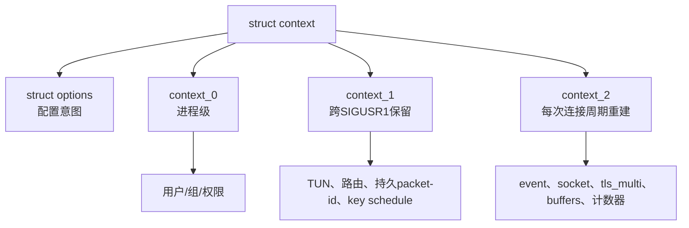
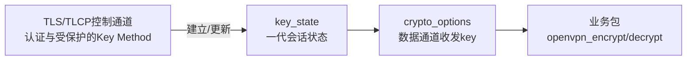
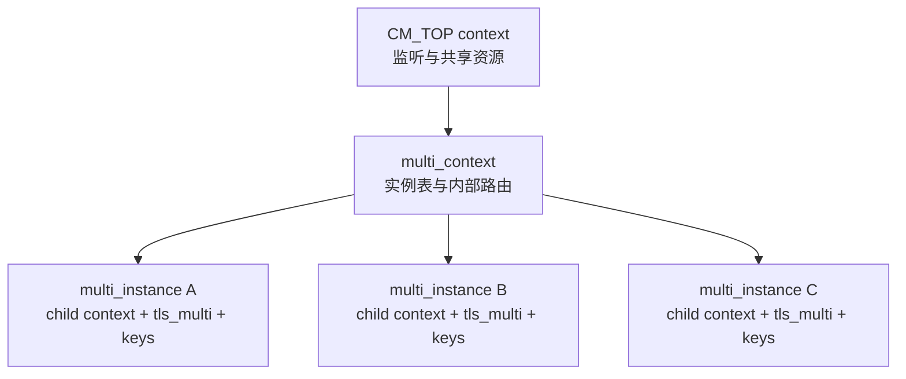
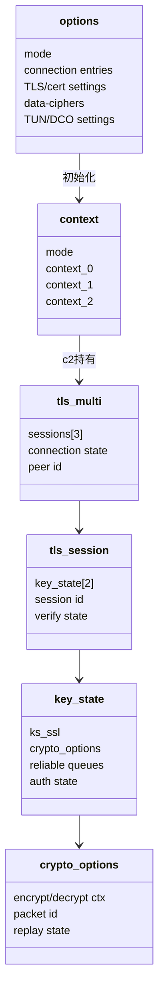
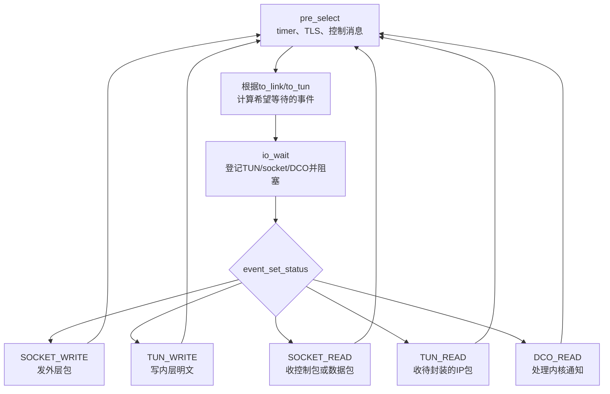
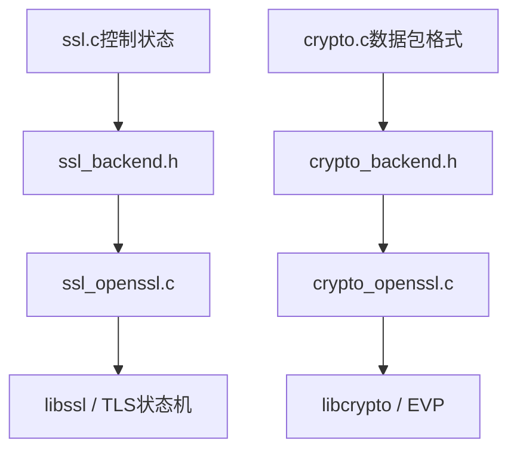
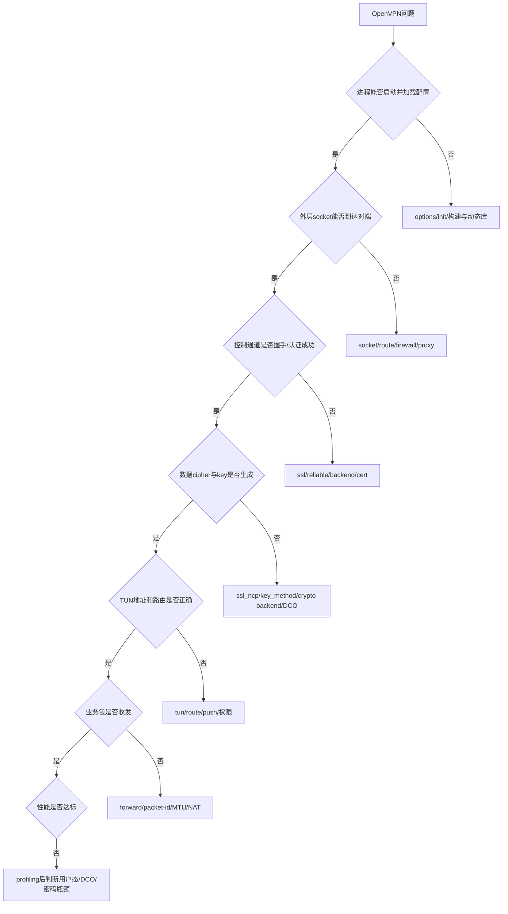
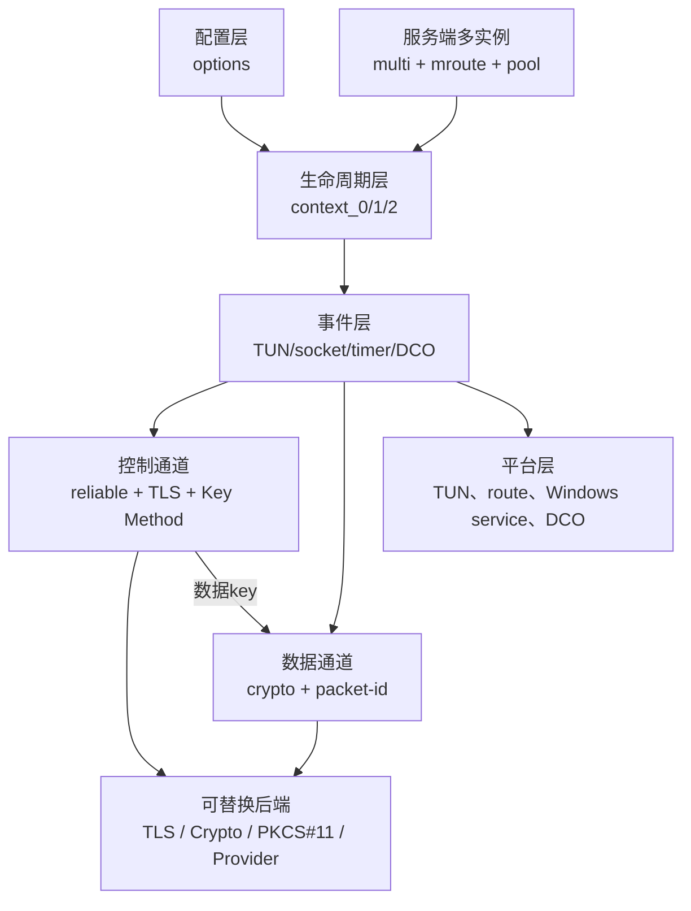

> 适用源码：OpenVPN 2.7.4 上游，官方 tag `v2.7.4` 对应提交 `8e9e91f`<br>
> 本地基线：`/path/to/workspace/learning-sources/openvpn-2.7.4`<br>
> 文档定位：OpenVPN 工程手册的源码全景梳理；先回答“为什么这样设计、每组源码负责什么”，再进入函数级精读。<br>
> 结论边界：只描述公开上游源码，不把历史实验、Tongsuo 补丁或未来供应商实现写成上游事实。

## 1. 为什么已经有调用链，还需要一篇源码梳理

调用链文档回答“一个包接下来经过哪些函数”，但阅读大型工程还需要知道：

- 为什么配置、连接、密钥和临时包不能放在同一个对象中；
- 为什么 OpenVPN 同时拥有 TLS 控制通道和独立数据通道；
- 为什么同一个外层 UDP/TCP socket 中既有控制包又有业务数据包；
- 为什么客户端主循环在 `forward.c`，服务端却还要进入 `multi.c`；
- 为什么 TLS 使用 `ssl_backend`，数据通道又使用 `crypto_backend`；
- 为什么启用 DCO 后，原来读懂的用户态逐包路径可能不再执行；
- 哪些文件必须源码级掌握，哪些只需要知道用途和查询入口。

如果没有这张地图，最容易出现两种极端：

1. 只记住 `openvpn_encrypt()`、`tls_pre_decrypt()` 等函数，却不知道它们属于哪条通道；
2. 试图从 `src/openvpn/` 的第一个文件顺序读到最后一个，投入很大却没有形成系统理解。

正确顺序应当是：

```text
产品必须解决的问题
→ 进程模型与运行对象
→ 控制通道/数据通道分工
→ 目录与文件组
→ 六条核心执行链
→ 再进入一个函数的输入、状态、输出
```

## 2. 假如由我们从零设计一个 SSL VPN 进程

一个可用于真实网关的 OpenVPN 类程序至少要解决十类问题：

| 设计问题 | 全写在一个大循环中的后果 | 上游 OpenVPN 的设计 |
| --- | --- | --- |
| 读取命令行和配置文件 | 文本解析、默认值和运行状态混在一起 | `options*.c` + `struct options` |
| 建立和重启一条隧道 | 软重连时所有资源都被无差别销毁 | `context_0/1/2` 按寿命分层 |
| 同时等待 TUN、socket、timer | 阻塞一处就卡住整个隧道 | `event.c` + `pre_select/io_wait/process_io` |
| 在同一端口承载握手和业务包 | 控制消息和业务包相互误解 | OpenVPN opcode + `tls_pre_decrypt()` 分流 |
| 在 UDP 上可靠传输握手 | TLS ciphertext 丢失后无法重传 | `reliable.c` 的 ACK、排序、重传 |
| 认证并协商业务密钥 | TLS record key 与 VPN 数据 key 混淆 | TLS 控制层 + Key Method + `key_state` |
| 高速处理业务数据 | 所有业务包都进入复杂控制状态机 | 独立 `crypto.c` 数据通道 |
| 同时服务多个客户端 | 多个客户端共享 session、路由和 key | `multi_context` + `multi_instance` |
| 支持不同密码库和平台 | 主流程充斥 OpenSSL/Windows/Linux 分支 | backend 接口 + 平台实现 |
| 提升吞吐并减少用户态开销 | 每包复制、上下文切换成为瓶颈 | 可选 DCO 数据通道卸载 |

由这些需求自然推导出整体骨架：



一句话概括：

> OpenVPN 是一个事件驱动的隧道进程：用 TLS 控制通道完成身份认证和数据密钥管理，用独立数据通道处理业务包，并用 `context`、backend 与 DCO 隔离连接寿命、密码库和平台差异。

## 3. 先确定源码仓库中“有什么”和“没有什么”

### 3.1 这个仓库包含什么

本地 2.7.4 源码主要包含：

```text
openvpn-2.7.4/
├── src/openvpn/       OpenVPN核心进程
├── src/plugins/       官方示例/配套插件
├── src/openvpnserv/   Windows服务组件
├── src/openvpnmsica/  Windows MSI安装辅助
├── src/tapctl/        Windows虚拟网卡管理工具
├── src/compat/        跨平台兼容实现
├── include/           公共/构建相关头文件
├── tests/             单元与集成测试
├── doc/               手册与Doxygen架构说明
├── sample/            示例配置、脚本和插件
├── contrib/           辅助工具及构建集成
├── distro/            systemd、DNS脚本等发行版集成
├── m4/                Autotools特性检测宏
└── CMakeLists.txt等   CMake/Autotools构建入口
```

### 3.2 这个仓库不等于什么

- 它不是完整安全网关产品，不包含 Web 管理、统一策略、审计中心和整机固件的全部实现；
- 它不是 OpenVPN GUI 的完整源码仓库。这里有 Windows service、安装和 TAP 管理组件，但桌面托盘/窗口 GUI 是独立项目；
- 它不是 Tongsuo/TLCP 已完成改造的代码；上游默认 TLS backend 是否支持某能力，要以当前构建和密码库为准；
- 它不代表未来采购的供应商 SSL VPN 一定基于 OpenVPN；拿到代码后必须重新确认组件和版本。

明确边界后，才能避免把“上游学习底座”误写成公司产品架构。

## 4. 进程怎样启动：从入口到运行模式

`src/openvpn/openvpn.c:153` 的 `openvpn_main()` 是源码阅读入口。



这个流程包含两种不同的“模式”：

- `options.mode`：用户配置层决定采用点对点还是服务端模式；
- `context.mode`：运行对象层区分 `CM_P2P`、`CM_TOP`、`CM_CHILD_UDP`、`CM_CHILD_TCP` 等角色。

研究服务端函数时，必须先确认当前 `context` 是顶层监听器还是某个客户端实例。否则容易把共享资源和每连接状态混在一起。

## 5. `context` 为什么按三种寿命拆分

`src/openvpn/openvpn.h:470` 的 `struct context` 是一条隧道的总运行对象，但它内部不是平铺状态。



| 对象 | 源码 | 生命周期 | 典型内容 |
| --- | --- | --- | --- |
| `struct options` | `options.h` | 配置解析后贯穿当前配置周期 | 地址、证书、cipher、TUN、DCO 等意图 |
| `context_0` | `openvpn.h:136` | 整个进程 | 权限、用户和组相关状态 |
| `context_1` | `openvpn.h:156` | 跨 `SIGUSR1` 软重启，`SIGHUP` 时重建 | TUN、路由、持久序号、部分 key schedule |
| `context_2` | `openvpn.h:223` | 每次连接/软重启周期 | socket、event set、TLS、多种 buffer、计时器 |

设计意义：

- 网络抖动导致软重连时，不必无条件销毁所有系统资源；
- 重新读取配置时，可以重建更大范围状态；
- 每客户端实例有自己的 `c2` TLS 和数据通道状态；
- 排障时能判断“重连是否应清掉这个字段”。

## 6. 控制通道和数据通道是整套源码的主分界

### 6.1 控制通道负责什么

```text
会话建立
证书验证与身份认证
TLS握手和控制消息保护
OpenVPN Key Method
数据通道算法协商
数据通道密钥生成与轮换
PUSH配置、重连和错误控制
```

核心文件是 `ssl.c`、`ssl_common.h`、`reliable.c`、`ssl_*backend*`、`ssl_verify*`、`tls_crypt.c`。

### 6.2 数据通道负责什么

```text
从TUN读取业务IP包
选择当前key_state
packet-id与防重放
加密、认证、封装
从外层socket发送
反方向验证、解密并写回TUN
```

传统用户态核心文件是 `forward.c`、`crypto.c`、`crypto_backend.h`、`crypto_openssl.c`、`packet_id.c`。

### 6.3 两条通道怎样连接但不混同



`key_state` 中同时存在：

- `ks_ssl`：TLS 对象与 Memory BIO，服务控制通道；
- `crypto_options`：数据通道收发 cipher/HMAC、packet-id 等状态。

因此：TLCP 握手成功不自动证明数据通道使用 SM4；数据通道是否国密化必须单独沿 `ssl_ncp.c → key_state.crypto_options → crypto.c/backend` 验证。

## 7. `src/openvpn/` 文件职责全景

下面不是建议你依次通读，而是一张“遇到问题时去哪里找”的地图。

### 7.1 入口、配置、初始化和生命周期

| 文件 | 主要职责 | 阅读优先级 |
| --- | --- | --- |
| `openvpn.c` / `openvpn.h` | 进程入口、模式选择、总 `context` 与三层寿命 | 核心掌握 |
| `init.c` / `init.h` | 把 options 转成 socket、TUN、TLS、crypto、route 等运行对象，并负责关闭 | 核心掌握 |
| `options.c` / `options.h` | 配置字段、默认值、语义校验与大部分指令处理 | 核心掌握 |
| `options_parse.c` | 配置文件、命令行、PUSH 选项的词法拆分与统一入口 | 核心掌握 |
| `options_util.c` / `options_util.h` | options 相关辅助、字符串和列表处理 | 工程会用 |
| `helper.c` / `helper.h` | `--server`、`--client` 等高层辅助选项展开 | 工程会用 |
| `argv.c` / `argv.h` | 安全地构造外部命令参数 | 查阅 |
| `env_set.c` / `env_set.h` | 脚本、插件和进程使用的环境变量集合 | 工程会用 |
| `sig.c` / `sig.h` | 信号、软重启、退出原因与状态传播 | 核心掌握 |
| `error.c` / `error.h`、`errlevel.h` | 日志等级、错误输出、致命/非致命处理 | 工程会用 |
| `status.c` / `status.h` | 状态文件和运行统计输出 | 查阅 |

### 7.2 事件循环、外层 socket 与 TUN/TAP

| 文件 | 主要职责 | 阅读优先级 |
| --- | --- | --- |
| `forward.c` / `forward.h` | P2P/单实例主事件循环的包方向、控制/数据分流和收发 | 核心掌握 |
| `event.c` / `event.h` | poll/select/平台事件抽象，返回读写就绪状态 | 核心掌握 |
| `socket.c` / `socket.h` | UDP/TCP 建连、监听、收发、地址与协议状态 | 核心掌握 |
| `socket_util.c` / `socket_util.h` | socket 地址和辅助操作 | 查阅 |
| `tun.c` / `tun.h` | 创建、配置、读取和写入 TUN/TAP | 核心掌握 |
| `tun_afunix.c` / `tun_afunix.h` | AF_UNIX 形式的 TUN backend | 暂不展开 |
| `route.c` / `route.h` | 路由表、redirect-gateway、路由添加/删除 | 核心掌握 |
| `networking.h` | OpenVPN 网络配置操作的抽象接口 | 工程会用 |
| `networking_iproute2.c/.h` | 通过 iproute2 工具执行 Linux 网络配置 | 工程会用 |
| `networking_sitnl.c/.h` | Linux rtnetlink 网络配置实现 | 工程会用 |
| `networking_freebsd.c` | FreeBSD 网络配置实现 | 按平台查阅 |
| `fdmisc.c` / `fdmisc.h` | 文件描述符模式、继承和关闭辅助 | 查阅 |

### 7.3 报文尺寸、时间、保活和协议辅助

| 文件 | 主要职责 | 阅读优先级 |
| --- | --- | --- |
| `mtu.c` / `mtu.h` | frame、headroom、payload size 与封装开销 | 核心掌握 |
| `mss.c` / `mss.h` | TCP MSS 修正，缓解隧道 MTU/分片问题 | 工程会用 |
| `fragment.c` / `fragment.h` | OpenVPN 内部分片与重组 | 按需查阅 |
| `shaper.c` / `shaper.h` | 流量整形与发送节奏 | 暂不展开 |
| `ping.c` / `ping.h` | keepalive/ping 包识别和处理 | 工程会用 |
| `interval.c` / `interval.h`、`otime.c` / `otime.h` | 定时器与时间辅助 | 工程会用 |
| `occ.c` / `occ.h` | Options Compatibility Check 和相关控制消息 | 工程会用 |
| `proto.c` / `proto.h` | IP/协议头辅助与协议显示 | 查阅 |
| `packet_id.c` / `packet_id.h` | 数据包序号、持久化、防重放窗口 | 核心掌握 |
| `session_id.c` / `session_id.h` | OpenVPN 控制会话 ID | 工程会用 |

### 7.4 TLS 控制通道与身份认证

| 文件 | 主要职责 | 阅读优先级 |
| --- | --- | --- |
| `ssl.c` / `ssl.h` | TLS 控制状态机、Key Method、key_state 生成和轮换 | 核心掌握 |
| `ssl_common.h` | `tls_multi`、`tls_session`、`key_state`、`tls_options` 等核心结构 | 核心掌握 |
| `ssl_backend.h` | TLS 库统一接口，是 OpenSSL/Tongsuo 类接入的重要边界 | 核心掌握 |
| `ssl_openssl.c/.h` | OpenSSL 后端：SSL_CTX、证书私钥、SSL、BIO、Exporter | 核心掌握 |
| `ssl_mbedtls.c/.h` | mbedTLS 后端；用于平台构建和对照 backend 边界 | 工程会用 |
| `ssl_verify.c/.h` | 与 TLS 库无关的认证、用户名和证书验证流程 | 核心掌握 |
| `ssl_verify_backend.h` | 证书验证后端接口 | 工程会用 |
| `ssl_verify_openssl.c/.h` | OpenSSL X.509 验证后端 | 核心掌握 |
| `ssl_verify_mbedtls.c/.h` | mbedTLS 证书验证后端 | 按构建查阅 |
| `reliable.c` / `reliable.h` | UDP 上控制包排序、ACK、发送缓存与重传 | 核心掌握 |
| `ssl_pkt.c` / `ssl_pkt.h` | 控制包头、session/opcode 和初始包辅助处理 | 工程会用 |
| `ssl_util.c` / `ssl_util.h` | TLS/证书通用辅助 | 查阅 |
| `tls_crypt.c` / `tls_crypt.h` | `tls-auth`、`tls-crypt`、`tls-crypt-v2` 控制包外层保护 | 工程会用 |
| `auth_token.c` / `auth_token.h` | 服务端认证 token 生成、校验和更新 | 按需查阅 |
| `pkcs11.c/.h`、`pkcs11_backend.h` | PKCS#11 配置、证书/私钥访问接口 | 密码设备方向重点 |
| `pkcs11_openssl.c` / `pkcs11_mbedtls.c` | 不同 TLS backend 的 PKCS#11 适配 | 密码设备方向重点 |
| `cryptoapi.c` / `cryptoapi.h` | Windows CryptoAPI 证书/私钥接入 | Windows方向查阅 |
| `xkey_common.h`、`xkey_helper.c`、`xkey_provider.c` | OpenSSL 3 外部私钥/Provider 辅助 | HSM/Provider方向重点 |

### 7.5 数据通道密码与协商

| 文件 | 主要职责 | 阅读优先级 |
| --- | --- | --- |
| `crypto.c` / `crypto.h` | 数据通道包格式、加解密、认证、key context | 核心掌握 |
| `crypto_backend.h` | cipher/digest/HMAC 等密码后端抽象 | 核心掌握 |
| `crypto_openssl.c/.h` | OpenSSL EVP 数据通道实现 | 核心掌握 |
| `crypto_mbedtls.c/.h` | mbedTLS 数据通道实现 | 按构建查阅 |
| `crypto_mbedtls_legacy.c/.h` | 旧版 mbedTLS 兼容路径 | 暂不展开 |
| `crypto_epoch.c/.h` | epoch data key 的派生、切换和未来 key 管理 | 工程会用 |
| `ssl_ncp.c` / `ssl_ncp.h` | NCP、`data-ciphers` 能力交换和最终 cipher 选择 | 核心掌握 |

国密数据通道的研究主线是：

```text
配置中的data-ciphers
→ ssl_ncp协商
→ key_state数据密钥初始化
→ crypto_options/key_ctx_bi
→ crypto.c包格式
→ crypto backend实际算法调用
```

不能只在 `crypto_openssl.c` 找到 `EVP_CIPHER` 就认为改造完成；算法命名、协商、key 长度、nonce/tag、错误处理和 DCO 都要闭环。

### 7.6 压缩与兼容数据格式

| 文件 | 主要职责 | 阅读优先级 |
| --- | --- | --- |
| `comp.c` / `comp.h` | 压缩框架与协商状态 | 安全边界了解 |
| `comp-lz4.c/.h` | LZ4 实现 | 暂不展开 |
| `lzo.c` / `lzo.h` | LZO 兼容支持 | 暂不展开 |
| `compstub.c` | 无实际压缩/兼容 stub | 查阅 |

压缩曾与多种密码攻击相关，上游也给出弃用警告。研究国密或新数据格式时，原则上不要因为历史兼容而默认开启压缩。

### 7.7 多客户端服务端、内部路由与配置下发

| 文件 | 主要职责 | 阅读优先级 |
| --- | --- | --- |
| `multi.c` / `multi.h` | 服务端多客户端总框架、实例生命周期和内部转发 | 核心掌握 |
| `multi_io.c` / `multi_io.h` | 服务端多路 I/O 事件管理 | 工程会用 |
| `mudp.c` / `mudp.h` | UDP 多客户端入口 | 工程会用 |
| `mtcp.c` / `mtcp.h` | TCP 多客户端入口 | 工程会用 |
| `mroute.c` / `mroute.h` | 虚拟地址/MAC 到客户端实例的内部路由表 | 核心掌握 |
| `mbuf.c` / `mbuf.h` | 多实例转发的包队列/buffer | 工程会用 |
| `pool.c` / `pool.h` | 客户端虚拟地址池 | 工程会用 |
| `push.c` / `push.h` | 服务端向客户端下发配置，客户端接收请求/回复 | 核心掌握 |
| `push_util.c` / `pushlist.h` | PUSH 列表与更新消息辅助 | 查阅 |
| `schedule.c` / `schedule.h` | 多实例定时调度辅助 | 工程会用 |

服务端的对象关系是：



### 7.8 DCO 数据通道卸载

| 文件 | 主要职责 | 阅读优先级 |
| --- | --- | --- |
| `dco.c` / `dco.h` | 平台无关的 peer、key、路由和状态管理 | 核心边界掌握 |
| `dco_internal.h` | DCO 平台实现内部接口 | 工程会用 |
| `dco_linux.c/.h`、`ovpn_dco_linux.h` | Linux ovpn/DCO 控制消息与 key 下发 | Linux性能方向重点 |
| `dco_win.c/.h`、`ovpn_dco_win.h` | Windows DCO 驱动交互 | Windows方向重点 |
| `dco_freebsd.c/.h`、`ovpn_dco_freebsd.h` | FreeBSD DCO 实现 | 按平台查阅 |

启用 DCO 后的职责分工：

```text
用户态OpenVPN：TLS、认证、控制消息、密钥生命周期
          ↓ dco_new_key / swap / delete
内核DCO：业务数据包加解密与快速转发
```

因此 OpenVPN 国密数据面至少有两条产品路线：

1. 先关闭 DCO，在用户态 `crypto_backend` 完成 SM4 数据通道；
2. 同时扩展用户态协商与目标平台 DCO/内核实现。

选择哪条路线属于产品、性能和交付决策，不能仅凭源码存在某个 DCO 文件自行决定。

### 7.9 网络功能、代理和接入辅助

| 文件 | 主要职责 | 阅读优先级 |
| --- | --- | --- |
| `dhcp.c` / `dhcp.h` | DHCP 报文与 Windows/TAP 相关辅助 | 按需查阅 |
| `dns.c` / `dns.h` | DNS 配置数据结构和处理 | 工程会用 |
| `clinat.c` / `clinat.h` | 客户端 NAT 地址改写 | 按需查阅 |
| `vlan.c` / `vlan.h` | TAP/二层 VLAN 处理 | 二层模式查阅 |
| `proxy.c` / `proxy.h` | HTTP 代理连接 | 按需查阅 |
| `socks.c` / `socks.h` | SOCKS 代理封装 | 按需查阅 |
| `httpdigest.c` / `httpdigest.h` | HTTP Digest 认证辅助 | 查阅 |
| `ntlm.c` / `ntlm.h` | NTLM 代理认证兼容 | 查阅 |
| `reflect_filter.c` / `reflect_filter.h` | 反射/递归类报文过滤辅助 | 查阅 |
| `wfp_block.c` / `wfp_block.h` | Windows Filtering Platform 阻断策略 | Windows方向查阅 |

这些文件解释了 OpenVPN 作为跨平台客户端/服务端工具为什么远比“TLS + TUN”复杂，但它们不是当前国密主链的第一阅读优先级。

### 7.10 管理、插件、平台和通用基础设施

| 文件组 | 主要职责 | 阅读优先级 |
| --- | --- | --- |
| `manage.c/.h` | Management Interface，供外部管理程序查询状态和发送命令 | 产品集成重点 |
| `plugin.c/.h` | OpenVPN 插件加载与回调 | 认证/扩展方向重点 |
| `platform.c/.h` | 文件、权限、时间等平台抽象 | 工程会用 |
| `win32.c/.h`、`win32-util.c/.h` | Windows 系统 API 与进程/网络辅助 | Windows方向重点 |
| `console*.c/.h` | 控制台输入与 systemd 交互 | 按平台查阅 |
| `ps.c/.h`、`lladdr.c/.h` | 进程/网络接口地址辅助 | 查阅 |
| `buffer.c/.h` | buffer、headroom、gc_arena，是包处理的基础 | 核心掌握 |
| `list.c/.h`、`circ_list.h`、`ring_buffer.h` | 链表、循环列表和环形缓冲辅助 | 查阅 |
| `base64.c/.h` | Base64 编解码 | 查阅 |
| `misc.c/.h`、`common.h`、`basic.h`、`integer.h`、`syshead.h` | 通用宏、类型、平台 include 和杂项辅助 | 遇到再查 |
| `domain_helper.h` | 域名相关辅助接口 | 查阅 |
| `gremlin.c/.h` | 调试构建中的故障/报文破坏测试 | 测试设计参考 |

## 8. 核心对象关系：配置、连接、会话和密钥不要混在一起



### 8.1 每个对象用一句人话解释

| 对象 | 人话 |
| --- | --- |
| `options` | 用户和配置文件希望程序怎样运行 |
| `context` | 某条隧道/某个服务端角色此刻的总运行现场 |
| `tls_multi` | 一条隧道中所有控制会话与数据密钥代际的总管理者 |
| `tls_session` | 当前、正在接管或已退役的一次控制会话 |
| `key_state` | 某一代握手、认证、可靠队列和数据密钥状态 |
| `crypto_options` | 真正用于数据包收发的 cipher、HMAC、packet-id 和防重放状态 |

### 8.2 为什么一条连接需要多套 session/key

重协商不能简单地先删除旧 key，再等待新握手，否则业务会中断。因此 OpenVPN 保存 active、initial 和 lame-duck 等状态，在新 key 可用后平滑切换，并允许旧 key 在有限时间内处理在途包。

这一设计直接影响：

- 国密 key context 初始化的位置；
- HSM 会话或句柄应绑定到哪一代 key；
- rekey 时旧 key 何时销毁；
- DCO primary/secondary key slot 怎样交换；
- 并发和错误恢复测试怎样设计。

## 9. 事件循环是所有模块协作的中心

点对点模式主循环位于 `openvpn.c:tunnel_point_to_point()`：

```text
pre_select
→ io_wait
→ process_io
→ 回到pre_select
```



从设计者角度，`pre_select()` 与 `process_io()` 分工不同：

- `pre_select()` 让“没有新 socket 包也必须推进的工作”运行，例如 TLS 重传和定时器；
- `io_wait()` 只报告设备是否就绪；
- `process_io()` 才真正执行一次主要 I/O 分支。

这解释了为什么一个控制包或数据包可能跨越多轮循环：上一轮产生 `to_link`，下一轮 socket 可写时才真正发送。

## 10. 六条主链把源码从目录串成系统

### 10.1 配置链

```text
配置文本/命令行
→ options_parse.c:parse_line/parse_argv
→ options.c:add_option
→ struct options
→ options_postprocess
→ init.c:init_instance/do_init_crypto_tls
→ 运行对象
```

这条链解决“配置写了以后，谁真正消费”。

### 10.2 生命周期链

```text
openvpn_main
→ context_init_1
→ tunnel_point_to_point / tunnel_server
→ init_instance
→ 事件循环
→ signal/restart
→ close_instance
```

这条链解决“资源何时创建、软重连后是否还在”。

### 10.3 控制通道链

```text
socket收到控制包
→ tls_pre_decrypt
→ session匹配 + reliable入队
→ pre_select/check_tls
→ tls_multi_process/tls_process
→ Memory BIO驱动TLS
→ Key Method/控制消息
→ reliable发送队列
→ to_link
```

这条链解决“TLS ciphertext 怎样嵌入 OpenVPN 自己的可靠控制协议”。

### 10.4 用户态发送数据链

```text
TUN_READ
→ read_incoming_tun
→ process_incoming_tun
→ encrypt_sign
→ tls_pre_encrypt选择key_state
→ openvpn_encrypt
→ to_link
→ process_outgoing_link
```

### 10.5 用户态接收数据链

```text
SOCKET_READ
→ read_incoming_link
→ tls_pre_decrypt识别P_DATA
→ 选择接收crypto_options
→ openvpn_decrypt
→ to_tun
→ process_outgoing_tun
```

### 10.6 DCO key 管理链

```text
TLS/Key Method得到数据key
→ init_key_contexts判断dco_enabled
→ init_key_dco_bi
→ dco_install_key
→ dco_new_key（平台实现）
→ 内核数据面处理业务包
```

详细逐函数解释见 [OpenVPN 源码阅读实战方法：从配置与事件循环到双通道数据流](OpenVPN%20源码阅读实战方法：从配置与事件循环到双通道数据流.md)。

## 11. TLS backend 与 crypto backend 为什么要分成两套

### 11.1 TLS backend

回答的是：

- 怎样创建客户端/服务端 `SSL_CTX`；
- 怎样加载 CA、证书、私钥；
- 怎样创建 `SSL` 和 Memory BIO；
- 怎样验证证书；
- 怎样导出 keying material；
- 怎样把密码库错误转换成 OpenVPN 错误。

边界：`ssl_backend.h`，OpenSSL 实现在 `ssl_openssl.c`。

### 11.2 Crypto backend

回答的是：

- 怎样按名字获取 cipher/digest；
- 怎样初始化收发 cipher/HMAC context；
- 怎样设置 IV、AAD，执行 update/final；
- 怎样生成或校验 tag；
- 怎样获得 key、IV、block 长度。

边界：`crypto_backend.h`，OpenSSL 实现在 `crypto_openssl.c`。



这两套接口可以使用同一家密码库，却服务不同协议层。国密改造也必须分别评估：

- TLCP/双证书主要触及 TLS backend；
- SM4 数据通道主要触及 NCP、`crypto.c` 和 crypto backend；
- 使用 HSM/密码卡时，还要区分握手私钥、数据面 bulk crypto 和 DCO 的能力边界。

## 12. 仓库其他目录怎样参与完整产品构建

### 12.1 `src/plugins/`

当前包含：

- `auth-pam/`：PAM 用户认证插件；
- `down-root/`：降权场景下执行 down 脚本的插件。

插件接口适合认证、脚本和外部扩展，但不是实现 TLCP 状态机或数据通道 cipher 的首选位置。

### 12.2 Windows 相关组件

| 目录 | 作用 |
| --- | --- |
| `src/openvpnserv/` | Windows OpenVPN Service，包括 interactive/service/校验逻辑 |
| `src/openvpnmsica/` | MSI 安装阶段的自定义动作与安装辅助 |
| `src/tapctl/` | 创建、删除和管理 TAP/Wintun 类虚拟适配器的工具代码 |

这些组件解释了“Windows 客户端不是一个 `openvpn.exe` 就结束”：实际产品还涉及服务权限、虚拟网卡、配置目录和 GUI/管理接口。但完整 OpenVPN GUI 不在本仓库中。

### 12.3 `src/compat/`

为缺少 `basename()`、`daemon()`、`gettimeofday()`、`strsep()` 等接口的平台提供兼容实现。除非遇到特定平台编译问题，不需要作为协议源码主线阅读。

### 12.4 `tests/`

`tests/unit_tests/openvpn/` 是理解函数“怎样被最小构造和调用”的重要入口：

| 测试 | 对应能力 |
| --- | --- |
| `test_options_parse.c` | 配置解析 |
| `test_buffer.c` | buffer/headroom/边界 |
| `test_crypto.c` | cipher、加解密和 key |
| `test_ncp.c` | 数据 cipher 协商 |
| `test_packet_id.c` | packet-id 与防重放 |
| `test_ssl.c` | TLS/控制通道对象 |
| `test_tls_crypt.c` | 控制包外层保护 |
| `test_provider.c` | OpenSSL Provider 行为 |
| `test_pkcs11.c` | PKCS#11 路径 |
| `test_networking.c` | 网络配置 backend |

阅读陌生函数时，不要只搜 `src/`：

```bash
rg -n '目标函数名' src tests
```

测试往往比生产调用者更清楚地展示输入对象和边界条件。

### 12.5 `doc/` 与 `sample/`

- `doc/doxygen/doc_tunnel_state.h`：context 与隧道状态；
- `doc/doxygen/doc_eventloop.h`：事件循环；
- `doc/doxygen/doc_control_tls.h`：TLS 控制层；
- `doc/doxygen/doc_reliable.h`：可靠层；
- `doc/doxygen/doc_data_crypto.h`：数据通道密码；
- `sample/sample-config-files/`：把配置指令与源码字段对应起来。

这些是上游随源码提供的第一手说明，优先级高于非官方博客。

### 12.6 构建与发行目录

| 路径 | 作用 |
| --- | --- |
| `configure.ac`、`Makefile.am`、`m4/` | Autotools 构建与依赖探测 |
| `CMakeLists.txt`、`CMakePresets.json` | CMake 构建入口和预设 |
| `config.h.cmake.in` | 编译特性宏模板 |
| `contrib/vcpkg-*` | Windows/vcpkg 依赖和 triplet 集成 |
| `distro/systemd/` | systemd unit 与 Linux 发行版运行方式 |
| `dev-tools/` | 代码生成、格式、维护工具 |
| `.github/workflows/` | 上游 CI 构建和测试矩阵 |

研究“代码是否编进目标产物”时，不能只看 `.c` 文件；必须继续追构建开关、源文件列表、backend 选择和最终链接库。

## 13. 配置是怎样从字符串变成运行对象的

以 `data-ciphers` 为例：


这条路径展示了一条通用规则：

```text
配置名称
→ 静态字段
→ 后处理/合法性
→ 初始化时复制或派生
→ 运行对象
→ 真实执行分支
```

新增 TLCP 双证书配置时也要回答相同问题：

- 指令名和权限是什么；
- `struct options` 增加哪些字段；
- 客户端/服务端何时加载；
- 怎样进入 TLS backend；
- 失败是否中止而不是回退；
- 配置、日志、运行库和 PCAP 怎样共同证明生效。

## 14. 如何判断一个改造点应放在哪层

| 需求 | 首选层 | 不应首先放在哪里 | 原因 |
| --- | --- | --- | --- |
| 增加 TLCP 协议选择 | options + TLS backend | `forward.c` | 事件循环不应实现 TLS 状态机 |
| 加载签名/加密双证书 | TLS backend/证书配置 | `crypto.c` | 属于握手身份与 TLS 上下文 |
| 数据通道增加 SM4 名称与协商 | `ssl_ncp.c` + key type/backend | TLS cipher-suite 列表 | 两套算法命名空间不同 |
| SM4 数据包格式 | `crypto.c`/backend | `ssl_openssl.c` | 业务包不走 TLS record |
| HSM 中的 SM2 私钥签名 | Provider/PKCS#11/xkey + TLS backend | 数据面逐包函数 | 握手私钥和 bulk data key 不同 |
| DCO 支持 SM4 | 用户态协商 + DCO平台接口/内核 | 只改 `crypto_openssl.c` | DCO 模式绕过用户态逐包实现 |
| Windows 客户端操作界面 | GUI/management/service 集成 | OpenVPN协议核心 | UI 是控制外壳，不应改协议状态机 |

这张表不是产品方案结论，而是上游源码边界给出的初步落点。最终仍需结合供应商实现、目标平台和标准要求确认。

## 15. 最快且不虚的阅读顺序

### 阶段一：建立系统坐标（核心掌握）

阅读：

```text
openvpn.c
openvpn.h
init.c:init_instance
forward.c:pre_select/io_wait/process_io
```

停止条件：能画出进程入口、模式分叉、context 寿命和事件循环。

### 阶段二：打通两条业务数据链（核心掌握）

阅读：

```text
read_incoming_tun → encrypt_sign → openvpn_encrypt → to_link
read_incoming_link → tls_pre_decrypt → openvpn_decrypt → to_tun
```

停止条件：能指出每一步 buffer 中是什么、密钥从哪里选择、失败如何丢包。

### 阶段三：打通控制通道（核心掌握）

阅读：

```text
tls_pre_decrypt
→ reliable
→ tls_multi_process/tls_process
→ key_state_ssl Memory BIO
→ key_method_2
```

停止条件：能解释控制通道为什么不是简单把 socket 交给 OpenSSL。

### 阶段四：进入国密接口边界（工程会用）

阅读：

```text
ssl_backend.h / ssl_openssl.c
crypto_backend.h / crypto_openssl.c
ssl_ncp.c
pkcs11 / xkey / Provider
```

停止条件：能把 TLCP、双证书、数据 SM4、HSM 分别放到正确层。

### 阶段五：服务端、Windows 和 DCO（按任务展开）

在真正需要多客户端、Windows 产品化或性能卸载时，再进入 `multi.c`、`openvpnserv`、`dco*.c`。不要在没有需求和运行证据时平均用力。

## 16. 遇到故障时按源码层次定位



这样排障能避免：TLS 一失败就去查路由，ping 不通就先改 cipher，或者性能低就直接上 DPDK。

## 17. 三层阅读优先级

### 核心掌握

你需要能重新定位、解释输入输出，并读懂关键分支：

```text
openvpn/openvpn.h
init
options/options_parse
forward/event/socket/tun
ssl/ssl_common/reliable
ssl_backend/ssl_openssl
ssl_ncp
crypto/crypto_backend/crypto_openssl
packet_id/buffer
multi（至少对象关系）
dco（至少边界与key下发）
```

### 工程会用

知道职责，遇到任务能借助搜索和文档进入：

```text
route/networking
push/pool/mroute
manage/plugin
pkcs11/xkey/provider
Windows service/tapctl
MTU/MSS/fragment
tests与构建系统
```

### 暂不展开

当前没有任务时只保留查找入口：

```text
老旧压缩兼容
所有代理认证细节
FreeBSD全部实现
每个Windows安装API
所有工具函数和历史兼容宏
```

这种分层不是降低标准，而是把时间集中到决定协议正确性、国密边界和工程闭环的高杠杆位置。

## 18. 阅读一个新文件时填写这张卡

```markdown
### 文件/对象

- 所属进程和模式：
- 所属层：配置 / 生命周期 / 事件 / 控制 / 数据 / backend / DCO
- 为什么需要它：
- 谁创建：
- 谁长期持有：
- 主要输入：
- 保存的状态及寿命：
- 主要输出/副作用：
- 上游调用者：
- 下游依赖：
- 成功怎样观察：
- 失败如何表现：
- 与国密/HSM/PQC的关系：
- 当前未确认假设：
```

仅记录“文件里有哪些函数”是不够的。必须把文件放回系统，说明它解决的设计问题和与其他模块的契约。

## 19. 建议完成的三次代表性源码练习

### 练习一：配置到运行对象

选择 `data-ciphers`，亲自追：

```text
配置文本
→ add_option
→ options字段
→ tls_options
→ NCP
→ key_type/crypto_options
```

### 练习二：一个业务包的一生

选择一枚从 TUN 进入的 IP 包，记录每个阶段：

```text
函数
输入buffer
是否明文
使用哪个key
输出buffer
下一消费者
```

### 练习三：控制包进入 TLS Memory BIO

从 `tls_pre_decrypt()` 追到 `key_state_write_ciphertext()`，再从 `key_state_read_ciphertext()` 追回 `to_link`。最后解释 reliable 层与 TLS 状态机各自负责什么。

完成这三次后，再开始做 TLCP/双证书或 SM4 改造，源码位置就不会只是“AI 给我的行号”。

## 20. 源码锚点

| 主题 | 固定版本源码锚点 |
| --- | --- |
| 进程入口 | `src/openvpn/openvpn.c:153 openvpn_main()` |
| P2P 主循环 | `src/openvpn/openvpn.c:57 tunnel_point_to_point()` |
| 总运行对象 | `src/openvpn/openvpn.h:470 struct context` |
| 生命周期分层 | `openvpn.h:136/156/223 context_0/1/2` |
| 实例初始化 | `src/openvpn/init.c:4436 init_instance()` |
| 主 I/O 分叉 | `src/openvpn/forward.c:2287 process_io()` |
| 发送业务包 | `forward.c:1300/1479/621` |
| 接收业务包 | `forward.c:926/987/1120/1880` |
| TLS 对象层级 | `src/openvpn/ssl_common.h:207/489/611` |
| 控制/数据分流 | `src/openvpn/ssl.c:3565 tls_pre_decrypt()` |
| 发送 key 选择 | `ssl.c:3917/3944` |
| TLS Memory BIO | `src/openvpn/ssl_openssl.c:2218 key_state_ssl_init()` |
| 数据加解密入口 | `src/openvpn/crypto.c:329/779` |
| DCO key 安装 | `src/openvpn/dco.c:dco_install_key()` |

行号只适用于本文固定的 2.7.4 快照。切换版本时，先用符号名重新搜索，不要机械依赖行号。

## 21. 配套阅读

推荐顺序：

1. 本文：建立设计、目录、对象和文件组地图；
2. [OpenVPN 2.7.4 总体框架与关键调用流程](OpenVPN%202.7.4%20总体框架与关键调用流程.md)：把全景进一步展开成主流程；
3. [OpenVPN 源码阅读实战方法：从配置与事件循环到双通道数据流](OpenVPN%20源码阅读实战方法：从配置与事件循环到双通道数据流.md)：学习怎样独立重建执行链；
4. [OpenVPN 上游源码研究与国密改造点定位](OpenVPN%20上游源码研究与国密改造点定位.md)：定位 TLCP 和数据通道国密候选改造点；
5. [OpenVPN Tongsuo 双证书与密钥生命周期附录](OpenVPN%20Tongsuo%20双证书与密钥生命周期附录.md)：进入双证书、Tongsuo 与密钥生命周期。

## 22. 最终要形成的系统认识



一句话总结：

> OpenVPN 源码不是一条从 `main()` 走到底的直线，而是配置和生命周期建立运行现场，事件循环不断驱动控制/数据两条通道，backend 提供密码能力，平台与 DCO 决定数据最终在哪里收发和加解密。

## 23. 权威依据

- OpenVPN 2.7.4 固定上游源码及其 `doc/doxygen/`；
- `Changes.rst` 中的 2.7.4 版本标识；
- 上游源码内对 `context`、事件循环、control processor、data crypto 和 DCO 的接口注释；
- 本文所有源码路径均以本地固定快照复核。
