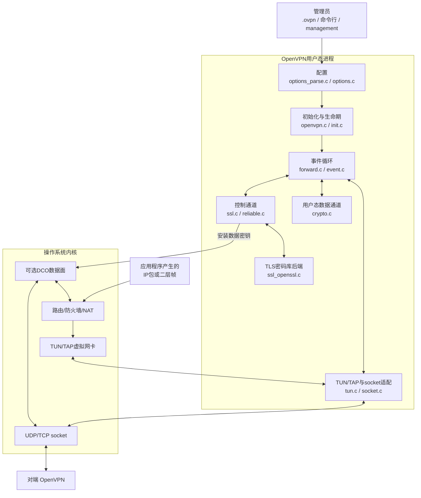
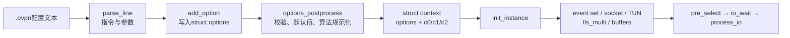
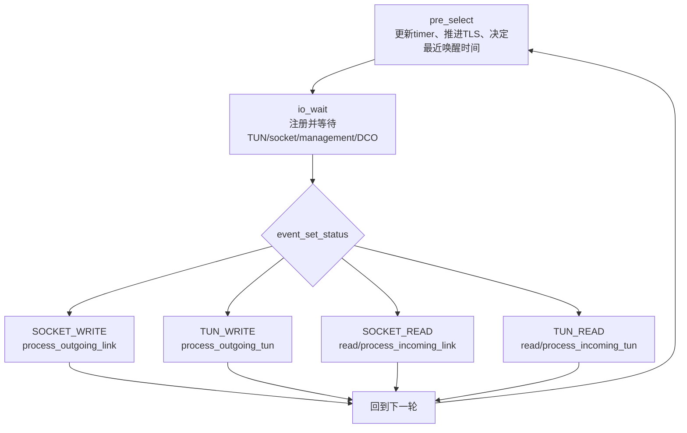
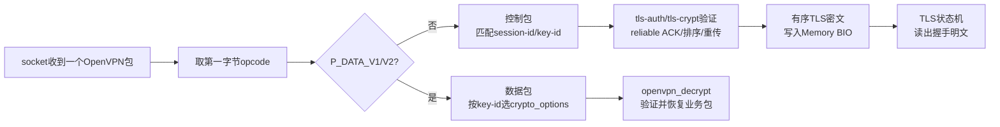
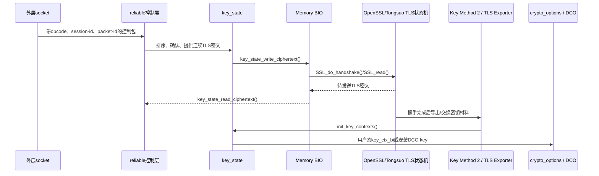
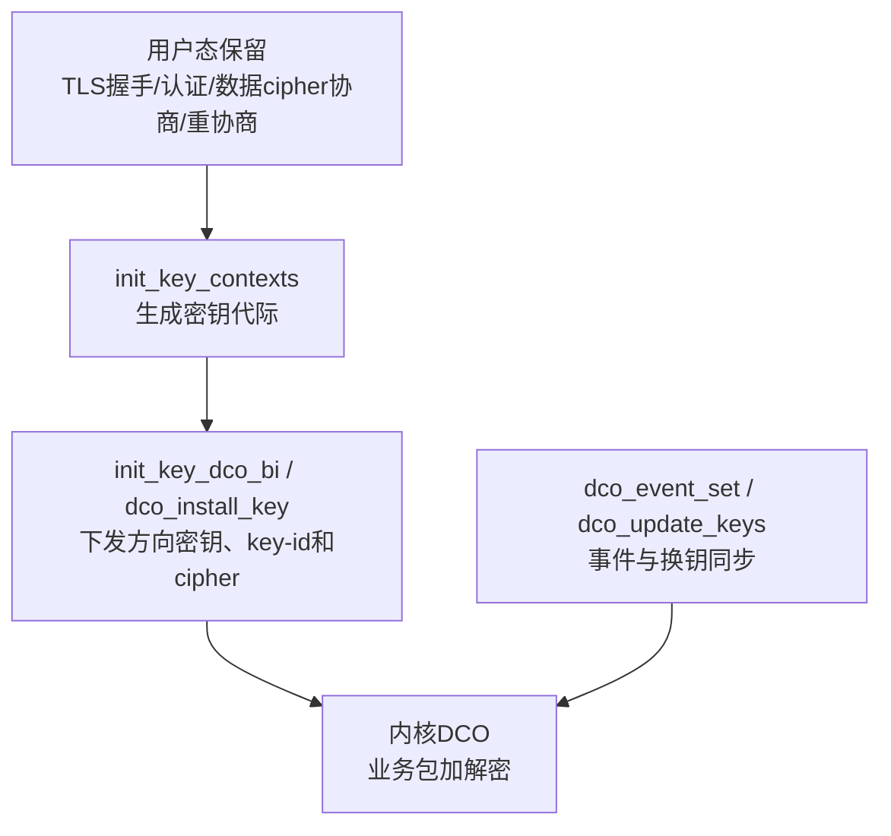

> 源码基线：OpenVPN 2.7.4 上游，官方 tag `v2.7.4` 对应提交 `8e9e91f`  
> 阅读目标：先用图建立“整个系统在做什么”的坐标，再进入六条函数级源码链。  
> 边界：本文描述 OpenVPN 公开上游设计，不代表已实现 TLCP、SM4 数据通道，也不预设供应商产品的内部架构。

## 1. 先分清四种“在 OpenVPN 里流动的数据”

| 数据 | 人话解释 | 主要载体 | 最终去向 |
| --- | --- | --- | --- |
| 配置数据 | 管理员希望连哪里、用什么证书和数据算法 | `struct options` | 初始化 socket、TUN/TAP、TLS 和数据通道对象 |
| 控制通道报文 | 建立身份信任、可靠传输 TLS 密文、交换数据通道密钥 | `tls_multi → tls_session → key_state` | 产生已认证、可用的数据密钥代际 |
| 业务数据报文 | 用户真正要通过 VPN 传输的 IP 包或二层帧 | `buffer + crypto_options` | 用户态 `crypto.c` 或内核 DCO 加解密 |
| 运行时事件 | TUN、socket、计时器或管理接口现在需要处理 | `event_set_status` | `process_io()` 选择这一轮执行的分支 |

一个最容易造成假成功的误解是：

> TLS/TLCP 握手成功，只能证明控制通道走到了某个状态；不能单独证明业务数据包使用了 SM4，也不能证明 DCO 支持该算法。

## 2. 图一：从系统边界看 OpenVPN



这张图先给出三个稳定结论：

1. OpenVPN 本身不是完整安全网关；它解决 VPN 隧道，路由、NAT、Web 管理和审计系统是外部能力。
2. 控制通道和数据通道共用外层 socket，但有不同的协议语义、密钥和函数链。
3. 启用 DCO 后，正常业务包的逐包处理可以不再经过用户态 `openvpn_encrypt()` / `openvpn_decrypt()`。

## 3. 图二：从配置文本到可运行隧道



### 对应源码锚点

| 阶段 | 文件与函数 | 输入 | 输出/下一个消费者 |
| --- | --- | --- | --- |
| 进程入口 | `openvpn.c:153 openvpn_main()` | `argc/argv` | 已初始化的 `context` |
| 读文件 | `options_parse.c:346 read_config_file()` | 文件路径 | 每行 token 数组 `p[]` |
| 写配置 | `options.c:5589 add_option()` | 指令名与参数 | `struct options` 字段 |
| 规范化 | `options.c:3780 mutate_ncp_cipher_list()` | `data-ciphers` 字符串 | 可用的数据 cipher 列表 |
| 实例初始化 | `init.c:4436 init_instance()` | `context.options` | socket、TUN、TLS、buffer、event 对象 |
| 运行 | `openvpn.c:57 tunnel_point_to_point()` | 已初始化的 `context` | 持续处理 I/O、timer 和 TLS |

因此，“配置里写了 SM4”要继续追问：

```text
add_option真的接收了这个名字吗？
→ postprocess有没有判为不支持？
→ NCP双方最终选中了什么？
→ crypto backend能否获取实际cipher？
→ 运行中的key_ctx_bi里是否真是该cipher？
```

## 4. 图三：一轮事件循环怎样调度所有工作



`pre_select()` 的名字不是“预先读包”，而是在真正阻塞等待前：

- 处理粗粒度计时器；
- 调用 `check_tls()`，进而调用 `tls_multi_process()`；
- 处理控制通道内的 PUSH/AUTH 消息；
- 把下一个需要处理的 timer 折算为 `io_wait()` 的超时时间。

`process_io()` 才是就绪事件的分发器。它不做 TLS 数学运算，也不自己实现 TUN 驱动；它只决定“现在该走哪一条链”。

## 5. 图四：外层网络包为什么能同时承载两条通道



决定性分流点是 `ssl.c:3565 tls_pre_decrypt()`：

- opcode 是 `P_DATA_V1` / `P_DATA_V2`：进入 `handle_data_channel_packet()`，根据 key-id 找到 `key_state.crypto_options`，然后返回给 `forward.c` 解密；
- 其他合法 opcode：当作控制包，匹配 session-id，处理包装验证、ACK、排序和重传，然后由 TLS 后端消费。

所以 OpenVPN 不是“先跑完 TLS，以后就不再有控制包”。重协商、密钥轮换和控制命令会与业务数据在同一外层传输上共存。

## 6. 图五：控制通道如何产生数据通道密钥



三类密钥不能混为一个概念：

| 密钥 | 保护什么 | 主要由谁管理 |
| --- | --- | --- |
| TLS/TLCP 握手和 record 密钥 | 控制通道中的 TLS/TLCP 记录 | 密码库内部 `SSL` 对象 |
| `tls-auth` / `tls-crypt` 静态密钥 | 外层 OpenVPN 控制包包装 | OpenVPN `tls_wrap` |
| OpenVPN 数据通道密钥 | `P_DATA` 业务包 | `key_state.crypto_options.key_ctx_bi` 或 DCO |

## 7. 图六：业务包的发送与接收闭环

```mermaid
flowchart LR
    subgraph SEND["发送方向"]
        S1["read_incoming_tun<br/>TUN明文"]
        S2["process_incoming_tun<br/>检查IP头"]
        S3["tls_pre_encrypt<br/>选择已认证key_state"]
        S4["openvpn_encrypt<br/>加密、认证、packet-id"]
        S5["process_outgoing_link<br/>UDP/TCP密文"]
        S1 --> S2 --> S3 --> S4 --> S5
    end

    subgraph RECEIVE["接收方向"]
        R1["read_incoming_link<br/>UDP/TCP密文"]
        R2["tls_pre_decrypt<br/>分流并选密钥"]
        R3["openvpn_decrypt<br/>防重放、验证、解密"]
        R4["process_incoming_link_part2<br/>形成to_tun"]
        R5["process_outgoing_tun<br/>写回TUN"]
        R1 --> R2 --> R3 --> R4 --> R5
    end

    S5 -."网络".-> R1
```



这是后续六链文档中两条数据链的骨架。阅读每个函数时都要记录：

```text
输入buffer叫什么？
进入时是明文还是密文？
谁选择密钥？
函数是改原buffer还是产生新buffer？
失败时是len清零、返回false，还是触发重启？
输出下一步由谁消费？
```

## 8. 图七：DCO 改变的是哪一段



DCO 不是“整个 OpenVPN 都在内核里”。它主要接管已建链后的数据通道；TLS 握手、身份认证、协商和密钥轮换仍需要用户态。

国密改造时必须单独问：

- 用户态 `crypto_openssl.c` 是否支持目标 SM4 模式？
- DCO 驱动和接口是否也支持它？
- 若不支持，程序是明确禁用 DCO，还是会失败或回退？

## 9. 从这张地图进入六条源码链

| 链 | 主要问题 | 终点 |
| --- | --- | --- |
| 01 配置到运行上下文 | 文本如何变成对象并驱动初始化 | 可运行 `context` |
| 02 控制报文到 TLS | 外层控制包如何可靠地喂给 TLS | Memory BIO / TLS 状态机 |
| 03 TLS 到数据密钥 | 握手成功后如何形成双向数据 key | `crypto_options` 或 DCO key |
| 04 TUN 到外层密文 | 明文业务包如何封装 | socket 发出 |
| 05 外层报文到 TUN | 收到的包如何分流、验证和解密 | TUN 明文 |
| 06 密钥到 DCO | 哪些状态留在用户态，哪些下沉内核 | DCO primary/secondary key slot |

## 10. 完成阅读后应能回答

1. 为什么 `tls_pre_decrypt()` 名字里有 TLS，却也是数据包的密钥选择点？
2. `pre_select()`、`io_wait()` 和 `process_io()` 各解决什么问题？
3. TLS record key、`tls-crypt` key 和 OpenVPN 数据通道 key 分别保护什么？
4. 为什么看到 TLS 套件为 SM4 还不能宣称数据通道使用 SM4？
5. 启用 DCO 后，为什么用户态 `openvpn_encrypt()` 不再是真实业务包路径？

## 11. 下一篇

先阅读 [OpenVPN 从系统到函数：TLS、Key State 与双通道分层定位图](OpenVPN%20从系统到函数%EF%BC%9ATLS、Key%20State%20与双通道分层定位图.md)，然后按 01–06 的顺序进入函数级源码链。
