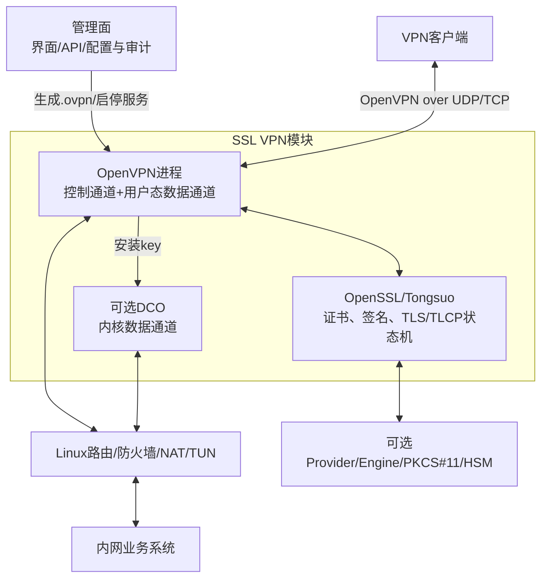
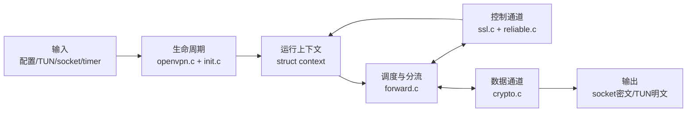
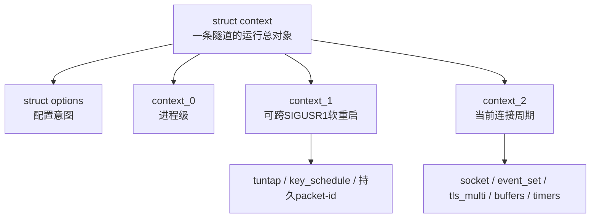
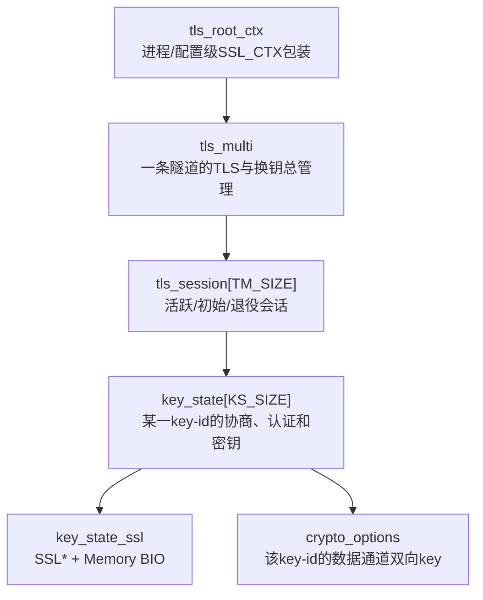
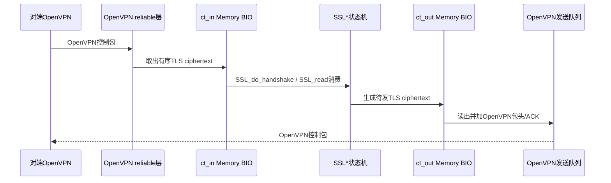
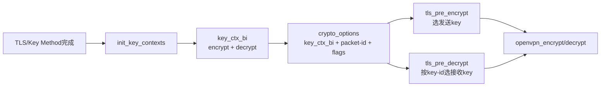

> 源码基线：OpenVPN 2.7.4 上游，官方 tag `v2.7.4` 对应提交 `8e9e91f`  
> 文档定位：这是进入六条源码链前的“空间坐标图”。它不先追求记住函数，而是说清每个对象在系统中的位置、寿命、输入和下一个消费者。

## 1. 一句话心智模型

OpenVPN 的主要运行模型是：

```text
配置先写入options
→ init把配置变成可运行context
→ 事件循环等待TUN、socket和timer
→ 外层包按opcode分为控制通道和数据通道
→ 控制通道管理TLS会话与key_state
→ 数据通道用key_state中的crypto_options加解密业务包
```

对比 strongSwan 时，可以建立一个只用来定位、不要机械等同的类比：

| strongSwan | OpenVPN | 共同点 | 不同点 |
| --- | --- | --- | --- |
| `IKE_SA` | `tls_multi` | 都管理一段长期会话与多代密钥 | `tls_multi` 不是 IKE 协议状态机 |
| IKE task | `tls_session/key_state` 中的状态逻辑 | 都把长会话分成可推进阶段 | OpenVPN 还要对 TLS ciphertext 做自己的可靠传输 |
| CHILD_SA 方向密钥 | `key_state.crypto_options` | 都是实际数据通道的方向密钥 | OpenVPN 默认在用户态逐包加解密 |

## 2. 第一层：在完整安全网关中的位置



这一层要守住四个边界：

1. OpenVPN 消费配置，但 Web 管理系统不属于该上游核心仓库。
2. OpenSSL/Tongsuo 实现 TLS/TLCP 状态机和密码原语；OpenVPN 实现运载、可靠传输、认证策略、数据密钥管理和隧道 I/O。
3. HSM 参与证书私钥签名，不等于业务流量都经过 HSM。
4. TUN 中看到的是内层明文 IP 包；外层网卡上看到的是 OpenVPN/UDP/TCP 包。

## 3. 第二层：进程中的五个主要区域



| 区域 | 核心问题 | 不负责什么 |
| --- | --- | --- |
| `openvpn.c/init.c` | 这次运行应该创建、复用、清理哪些对象 | 不实现数据 cipher |
| `context` | 一条隧道的配置、稳定资源与当前连接状态放在哪里 | 不是一个协议状态枚举 |
| `forward.c` | 现在哪个 fd 就绪，缓冲区应交给哪条链 | 不保存完整 TLS session |
| `ssl.c` | 控制包、TLS 会话、认证和密钥代际如何推进 | 不实现 OpenSSL 内部 TLS 算法 |
| `crypto.c` | 一个业务包怎样使用选定的数据 key | 不做 X.509 证书认证 |

## 4. 第三层：`context` 是运行总索引，不是一块杂乱内存

`src/openvpn/openvpn.h:470` 的 `struct context` 把状态按生命周期分层：



为什么要这样拆？因为“一次连接断了重连”不等于“整个进程从零开始”。例如 `--persist-tun` 希望软重启时保留 TUN，而 socket、本次 TLS 会话和工作 buffer 需要重建。

阅读任意 `c->c1.*` 或 `c->c2.*` 时，先把它翻译成：

```text
c1：这个资源是否应当在软重连后继续存在？
c2：这个状态是否只属于当前连接周期？
```

## 5. 第四层：TLS 对象为什么要有四层



### 5.1 `tls_root_ctx`

- 位置：`context.c1.ks.ssl_ctx` 指向的 TLS 根上下文；
- 内容：CA、本端证书/私钥、协议版本、TLS cipher 等长期配置；
- 目的：避免为每一个 key state 重复加载整套根配置。

### 5.2 `tls_multi`

- 位置：`context.c2.tls_multi`；
- 内容：该 tunnel 的会话集合、业务认证状态、协商结果、DCO peer 信息；
- 目的：在软重协商时同时维持旧 key 和新 key，避免换钥瞬间断流。

### 5.3 `tls_session`

- 它不是直接的 `SSL_SESSION *` 别名；
- 它是 OpenVPN 对“一轮可轮换控制会话”的包装，包含 session-id、reliable 层和 key state。

### 5.4 `key_state`

`src/openvpn/ssl_common.h:207` 开始的 `key_state` 是这套对象中最值得精读的一层。它同时持有：

- `state`：TLS/Key Method 处理现在走到哪一步；
- `key_id`：外层 OpenVPN 包如何找到这一代 key；
- `ks_ssl`：密码库 `SSL *` 与输入/输出 Memory BIO；
- `send_reliable/rec_reliable`：TLS ciphertext 在 UDP 上的可靠传输；
- `crypto_options`：当该 key 成功生成后，供业务包加解密使用。

## 6. 第五层：Memory BIO 是 OpenVPN 和 TLS 状态机的交界处

普通 HTTPS 程序可以让 `SSL` 直接绑定 TCP socket。OpenVPN 不这样做，因为它需要在 TLS ciphertext 外再加 OpenVPN 的 opcode、session-id、ACK、序号、重传以及 `tls-auth/tls-crypt` 包装。



对应后端函数：

| 方向 | 函数 | 它对 buffer 做什么 |
| --- | --- | --- |
| OpenVPN → TLS | `ssl_openssl.c:2317 key_state_write_ciphertext()` | 把收到的 TLS ciphertext 写入输入 BIO |
| TLS → OpenVPN | `ssl_openssl.c:2305 key_state_read_ciphertext()` | 从输出 BIO 读取 TLS ciphertext |
| OpenVPN 应用数据 → TLS | `ssl_openssl.c:2280 key_state_write_plaintext()` | 通过 `SSL_write()` 生成加密控制数据 |
| TLS → OpenVPN 应用数据 | `ssl_openssl.c:2330 key_state_read_plaintext()` | 通过 `SSL_read()` 取出解密后的 Key Method/PUSH 等数据 |

## 7. 第六层：`crypto_options` 是控制面和数据面的交接物



`crypto_options` 不保存“双方证书是否可信”的完整逻辑，而是保存已经完成控制面检查后，数据面逐包处理需要的最小上下文。

这个交界处也是审查国密改造的高价值点：

```text
TLS/TLCP握手成功
→ 密钥材料是怎样导出的？
→ 双方对发送/接收方向的分配是否一致？
→ key_type里最终是什么cipher/auth？
→ 用户态是否真的创建了对应EVP上下文？
→ 启用DCO时同样的key是否成功安装到内核？
```

## 8. 第七层：从某个函数回到系统的固定提问法

遇到 `tls_pre_decrypt()` 这类大函数时，不要立刻逐行陷进去，先回答七个问题：

1. **它属于哪个系统区域？** `ssl.c` 的控制通道/分流边界。
2. **谁调用它？** `forward.c:1070 process_incoming_link_part1()`。
3. **输入是什么形态？** 刚从 socket 读出、尚未分流的 OpenVPN 外层包。
4. **它读取什么关键字段？** 首字节中的 opcode 和 key-id，控制包还读 session-id。
5. **它改变哪个状态？** 可能创建/匹配 session，或选出对应 `crypto_options`。
6. **输出给谁？** 控制包在本层消费；数据包把 `crypto_options *` 返给 `openvpn_decrypt()`。
7. **失败如何显现？** `buf->len = 0`、`*opt = NULL`、软错误计数增加，特定 TCP 解密错误会触发 `SIGUSR1` 重连。

这套问法比“记住这个函数有 300 行”更有价值，因为它能让你把函数放回整个系统。

## 9. 建议的源码打开顺序

| 顺序 | 打开的位置 | 只观察什么 |
| --- | --- | --- |
| 1 | `openvpn.c:57 tunnel_point_to_point()` | 主循环只有哪三步 |
| 2 | `forward.c:2287 process_io()` | 四种 I/O 事件分到哪个函数 |
| 3 | `openvpn.h:136/156/223/470` | `context_0/1/2/context` 的生命周期区别 |
| 4 | `ssl_common.h:207/489/611` | `key_state/tls_session/tls_multi` 的包含关系 |
| 5 | `ssl.c:3565 tls_pre_decrypt()` | 控制包和数据包怎样分流 |
| 6 | `forward.c:621 encrypt_sign()` | 数据包如何选 key 并加密 |
| 7 | `ssl.c:1377 init_key_contexts()` | 数据 key 是建用户态上下文还是下发 DCO |

## 10. 掌握检查

不看文档，尝试画出下列四层包含关系：

```text
context
└─ tls_multi
   └─ tls_session
      └─ key_state
         ├─ key_state_ssl / Memory BIO
         └─ crypto_options / key_ctx_bi
```

然后回答：

1. `key_state` 为什么同时属于控制面和数据面的交界？
2. 为什么 OpenVPN 使用 Memory BIO，而不是把 `SSL *` 直接绑到外层 socket？
3. `context_1` 和 `context_2` 为什么不能合并？
4. 从 socket 来的包在哪个函数第一次被判断为控制包或数据包？
5. 哪个对象能告诉 `openvpn_encrypt()` 当前发送应该使用哪一代密钥？

## 11. 下一步

现在再进入 [OpenVPN 六链源码精读 01：配置如何变成运行上下文](OpenVPN%20六链源码精读%2001%20配置到运行上下文.md)。第一次阅读时不要同时追 TLS 和数据包，先把“文本怎么变成对象”这一条链闭环。
