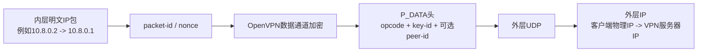
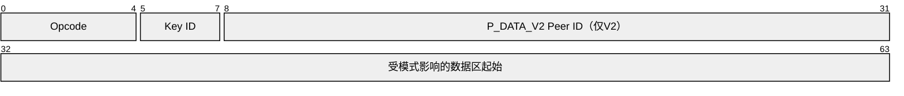
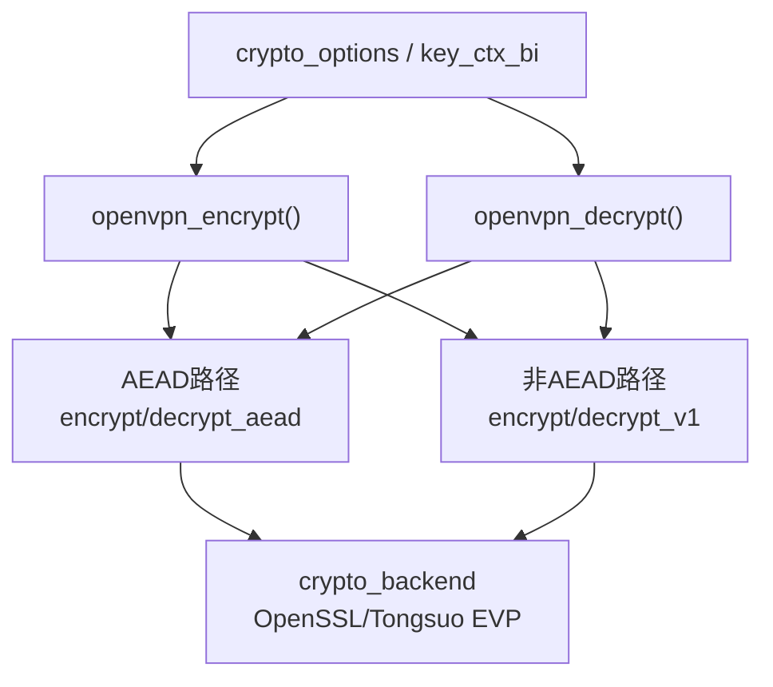
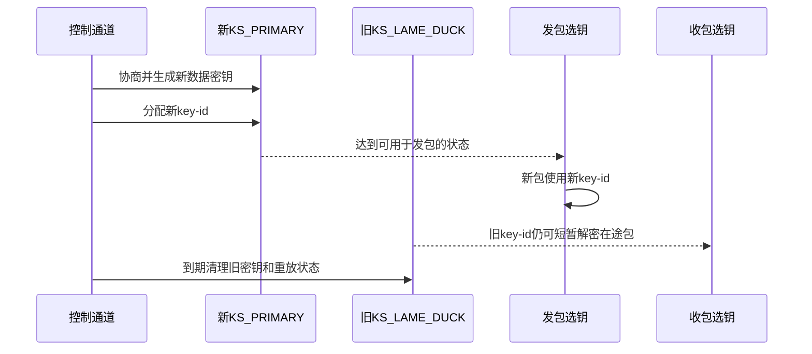
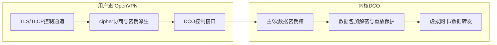

## 1. 这篇附录解决什么问题

控制通道协商完成后，真正承载业务 IP 包的是 OpenVPN 数据通道。判断“数据通道已经国密化”不能看 TLS/TLCP 的 cipher，而必须继续追踪：

```text
明文IP包
-> 选择哪一代OpenVPN数据密钥
-> 使用哪一种数据cipher/auth模式
-> packet-id怎样参与Nonce或重放保护
-> OpenVPN头怎样携带Key ID和Peer ID
-> 密文由用户态还是DCO处理
-> 换钥时新旧密钥怎样切换和淘汰
```

本文基于 OpenVPN 2.7.4，提供数据包格式、用户态加解密和 DCO 密钥生命周期的横向索引。它不是对某个 PCAP 的结果声明，也不代表上游已经支持 SM4/SM3。

## 2. 从 TUN 包到外层 UDP 的分层

以客户端通过 UDP 隧道发送一个 ICMP Echo Request 为例：



外层抓包能看见外层 IP/UDP 和 OpenVPN 的部分头字段，但正常情况下看不见内层 IP 和业务载荷。Wireshark是否把某段字节解释成 OpenVPN，不改变真实加密是否成立；解析器不认识私有算法，也不代表算法未被使用。

## 3. P_DATA_V1 与 P_DATA_V2 头部

协议常量位于 `src/openvpn/ssl_pkt.h`：

- `P_KEY_ID_MASK = 0x07`：首字节低 3 位存 Key ID；
- `P_OPCODE_SHIFT = 3`：opcode 左移 3 位后写入首字节；
- `P_DATA_V1 = 6`：传统数据包；
- `P_DATA_V2 = 9`：带三字节 Peer ID 的数据包。

### 3.1 首字节如何组合

概念上：

```text
首字节 = (opcode << P_OPCODE_SHIFT) | key_id
```

因为 Key ID 只有 3 位，它会循环使用。安全性不能只依赖 Key ID；实际密钥生命周期、Session、packet-id 和重放窗口共同决定一个包能否被接受。

### 3.2 两种数据包头



MkDocs/Mermaid 对 `packet-beta` 的支持可能受前端版本影响，按字节理解可用下表替代：

| 格式 | 明文 OpenVPN 头 | 主要作用 |
| --- | --- | --- |
| P_DATA_V1 | 1 字节 opcode/key-id | 点到点或不需要 Peer ID 的场景 |
| P_DATA_V2 | 1 字节 opcode/key-id + 3 字节 peer-id | 服务端多客户端快速定位 peer |

发送端添加头部的源码入口：

- `tls_prepend_opcode_v1()`：`ssl.c:3976`；
- `tls_prepend_opcode_v2()`：`ssl.c:3990`。

接收端在 `tls_pre_decrypt()`（`ssl.c:3565`）解析首部并区分控制包与数据包，随后由 `handle_data_channel_packet()`（`ssl.c:3465`）定位候选 `key_state`。

## 4. AEAD 数据包：加密和认证一次完成

AEAD 是“带认证的加密”，例如 AES-GCM；若未来接入 SM4-GCM，也必须满足相同的安全语义。OpenVPN 2.7.4 的通用用户态 AEAD 入口为：

- 加密：`openvpn_encrypt_aead()`，`crypto.c:66`；
- 解密：`openvpn_decrypt_aead()`，`crypto.c:435`。

概念格式：

```text
P_DATA头 | packet-id/nonce相关部分 | ciphertext | authentication tag
```

其中具体哪些头字段作为 AAD（附加认证数据）由格式和调用参数决定。`crypto.h:99` 明确说明，GCM 模式下 P_DATA_V2 的 opcode 与 peer-id 也被认证。这意味着攻击者不能在不触发认证失败的情况下随意篡改 Peer ID。

### 4.1 发送链中的职责

`openvpn_encrypt_aead()` 需要完成：

1. 从发送方向 packet-id 状态取得不会重复的序号；
2. 按协议构造 Nonce/IV；
3. 把应受保护但不加密的头部设置为 AAD；
4. 调用后端 AEAD cipher 加密明文；
5. 取出并附加认证 Tag；
6. 更新输出 buffer，仅在全部成功后交给网络层。

### 4.2 接收链中的职责

`openvpn_decrypt_aead()` 需要：

1. 检查最小长度并拆出 packet-id、密文与 Tag；
2. 使用对应 Key ID 的解密密钥重建 Nonce；
3. 设置同样的 AAD；
4. 验证 Tag 并解密；
5. 对 packet-id 做重放检查；
6. 只有所有检查通过才释放明文到 TUN。

“先把明文交给上层，之后再看 Tag 是否正确”是危险错误。认证失败时明文不得进入后续转发。

### 4.3 SM4-GCM 接入时必须验证什么

- 后端 EVP/Provider 能否按 OpenVPN 预期获取 SM4-GCM；
- key 长度、IV 长度和 Tag 长度是否一致；
- packet-id 到 Nonce 的映射不会重复；
- AAD 范围与对端一致；
- Tag 失败严格丢包；
- rekey 前后 Nonce 空间不会因 Key ID 循环产生复用；
- DCO 若启用，内核端是否同样支持该 cipher 和格式。

配置里出现 `SM4-GCM` 只证明字符串被写入，不证明这些条件成立。

## 5. 非 AEAD 数据包：加密与 HMAC 分开

旧式/CBC 路径入口为：

- 加密：`openvpn_encrypt_v1()`，`crypto.c:197`；
- 解密：`openvpn_decrypt_v1()`，`crypto.c:616`。

常见概念格式为：

```text
P_DATA头 | HMAC | IV | ciphertext(packet-id | plaintext)
```

实际字段组织需以所用模式和源码为准。CBC 只提供机密性，不提供完整性，所以必须配套 HMAC。若做 `SM4-CBC + HMAC-SM3`，二者是两个独立的密码角色：

- SM4-CBC：把明文变成密文；
- HMAC-SM3：验证收到的受保护数据未被篡改且来自持钥一方。

### 5.1 收包顺序为什么重要

接收端应先完成长度和 HMAC 等真实性检查，再允许解密结果进入业务路径。错误顺序可能扩大填充预言、错误处理差异或无效密文消耗资源等风险。

### 5.2 HMAC-SM3 不是“直接用 SM3 哈希”

`SM3(message)` 没有秘密密钥，任何人都能重新计算；`HMAC-SM3(key, message)` 使用共享密钥，才具有消息认证能力。接入时还需双方统一输出长度与截断规则，不能只统一算法名称。

## 6. 用户态加密的总分派

`openvpn_encrypt()`（`crypto.c:329`）根据 `crypto_options` 中的 key/cipher 类型分派到 AEAD 或 V1 路径；`openvpn_decrypt()`（`crypto.c:779`）执行对应的接收分派。



这里的关键边界是：

- `crypto.c` 决定 OpenVPN 数据包格式、packet-id、AAD、HMAC与错误处理；
- `crypto_openssl.c` 等后端把统一操作映射到具体密码库；
- Tongsuo 提供 cipher 实现，不替 OpenVPN决定数据包格式和换钥策略。

因此“把 OpenVPN 链接到 Tongsuo”只解决了密码实现来源的一个前提，并不自动完成数据通道 SM4 的命名、协商、初始化、包格式兼容、DCO 支持和回归测试。

## 7. Key ID 如何贯穿换钥

数据密钥由控制通道生成，保存在 `key_state.crypto_options`。每次软重置创建新一代 `key_state`，`tls_session.key_id` 递增，并最终写入 P_DATA 头。



发送端通过 `tls_select_encryption_key()`（`ssl.c:3917`）选择当前可用密钥，`tls_pre_encrypt()`（`ssl.c:3944`）把对应 `crypto_options` 交给数据加密路径。

接收端不能只试一把密钥。`handle_data_channel_packet()` 会根据包头、Peer ID、Session 和 Key ID 在有限候选集中定位密钥。这个有限扫描由 `KEY_SCAN_SIZE` 约束，避免无界尝试。

## 8. packet-id 同时承担什么职责

packet-id 的作用至少有两类：

1. 为 AEAD Nonce/IV 构造提供单调变化的输入，避免同一密钥下 Nonce 重复；
2. 在接收端维护重放窗口，拒绝重复或过旧的包。

重放检查相关逻辑在 `crypto.c` 的数据解密路径和 packet-id 辅助模块中；`crypto.c:375` 附近可看到 `check_replay_iv()`。

错误理解：

> UDP 自己有校验和，所以不用重放保护。

正确理解：

> UDP 校验和主要用于发现传输错误，不能阻止攻击者复制并重新发送一份合法密文。重放保护必须由 VPN 协议基于受认证的 packet-id 完成。

### 8.1 代表性负面测试

将一份已成功接收的 P_DATA 包重新注入网络。正确实现应把第二份识别为重放并丢弃，且不得把内层 IP 包第二次写入 TUN。

## 9. DCO 模式下数据路径发生什么变化

DCO（Data Channel Offload）把 OpenVPN 数据通道处理下沉到内核，以减少用户态/内核态切换和复制。它不是把整个 OpenVPN 进程搬进内核。



用户态仍负责：

- 读取配置；
- 建立 TLS/TLCP；
- 验证证书和用户身份；
- 协商数据 cipher；
- 派生数据通道密钥；
- 触发换钥和向 DCO 下发密钥。

内核 DCO 负责：

- 使用已安装密钥处理高频数据包；
- packet-id、Nonce、Tag/HMAC 和重放窗口；
- 在主/次密钥槽间完成过渡；
- 把解密后的包交给网络栈。

## 10. DCO 密钥安装与轮换调用链

OpenVPN 2.7.4 通用 DCO 层的关键入口位于 `src/openvpn/dco.c`：

| 函数 | 行号 | 职责 |
| --- | ---: | --- |
| `dco_install_key()` | 54 | 整理一代双向密钥和算法参数并请求安装 |
| `init_key_dco_bi()` | 87 | 按客户端/服务端方向选取 out/in key |
| `dco_update_keys()` | 130 | 根据主/次 key 状态执行切换与删除 |

调用关系：

```text
控制通道得到key2
    -> init_key_contexts()                  ssl.c:1377
       -> 若未启用DCO：初始化用户态key_ctx_bi
       -> 若启用DCO：init_key_dco_bi()
          -> dco_install_key()
             -> 平台接口（Linux通常经Netlink）
                -> 内核DCO主/次密钥槽
```

重协商后，`dco_update_keys()` 负责把新一代密钥提升为主密钥并淘汰不再需要的旧密钥。准确的平台消息类型应继续进入对应 `dco_linux.c` 等实现核对，不能停留在通用接口名。

## 11. DCO 与国密数据通道的兼容性判断

如果用户态密码后端已经支持 SM4，不代表 DCO 同时支持 SM4。DCO 是另一套执行环境，至少要逐项确认：

| 层 | 要确认什么 |
| --- | --- |
| OpenVPN配置/NCP | `SM4-GCM` 或 `SM4-CBC` 是否被识别、允许并成功协商 |
| 用户态后端 | Tongsuo/OpenSSL Provider 是否提供算法，参数语义是否匹配 |
| DCO用户态接口 | 能否把国密cipher名称、key、IV/nonce参数表达给内核 |
| 内核DCO实现 | 是否实现对应SM4模式、HMAC-SM3、packet格式和重放保护 |
| 两端兼容 | Key ID、Nonce、AAD、Tag/HMAC与截断规则完全一致 |
| 失败策略 | 不支持时明确失败、明确回退到用户态，不能静默换成AES |

可选路线：

1. **先禁用 DCO，在用户态验证 SM4 数据通道**：改动边界较小，适合功能正确性基线；
2. **扩展 DCO 支持 SM4**：性能潜力更高，但涉及内核接口和驱动；
3. **明确拒绝不支持组合**：避免“控制面国密、数据面偷换 AES”的假成功。

路线选择属于产品和性能决策，不能仅因某条路径代码更容易就替团队决定。

## 12. 密码卡/HSM 不等于数据面卸载

HSM 或密码卡常见于证书私钥签名，例如 TLS/TLCP 握手使用 SM2 私钥。数据面是否经过密码硬件是另一件事。

```text
握手私钥路径：TLS/TLCP -> Provider/Engine/PKCS#11 -> HSM签名

数据通道路径：OpenVPN用户态crypto.c 或 DCO -> SM4批量加解密
```

如果日志只显示握手时调用过密码卡，只能证明控制通道私钥操作进入硬件，不能宣称大量 VPN 业务流量由密码卡加速。后者需要数据面调用计数、吞吐/CPU对比和明确的密钥/包路径证明。

## 13. 从源码、运行时与 PCAP 建立闭环

### 13.1 要证明“用户态使用 SM4-GCM”

```text
配置/NCP候选
-> 双方协商日志显示最终data cipher
-> 运行时二进制与密码库身份
-> 在openvpn_encrypt_aead()/decrypt_aead()设置断点或受控日志
-> 真实业务包通过
-> 不支持SM4的对端连接失败
-> 篡改Tag或重放包被拒绝
```

PCAP 通常能证明数据已被封装且载荷不可直接读取，但不能单独从随机密文字节证明算法一定是 SM4。算法结论应由协商、运行路径和负面测试共同支持。

### 13.2 要证明“DCO 使用 SM4”

```text
用户态协商到SM4
-> dco_install_key()下发的算法和key参数
-> 内核/DCO确认接受
-> 数据面不再经过用户态openvpn_encrypt()
-> 内核计数随业务流量增长
-> 禁用/移除SM4内核支持后连接明确失败或按设计回退
-> 重协商后新旧密钥槽正确切换
```

### 13.3 建议保存的原始材料

- 客户端和服务端原始日志；
- 外层接口 PCAP；
- 运行二进制和动态库 Hash/加载路径；
- NCP 最终选择；
- 用户态或 DCO 的密钥安装结果（不得记录真实密钥值）；
- rekey 前后 Key ID/状态变化；
- 正向业务流与重放、Tag篡改等负面用例结果。

不要把密钥本身写入日志或文档。要证明的是“密钥被正确产生、安装和使用”，不是泄露密钥内容。

## 14. 国密改造审查矩阵

| 结论 | 配置层 | 控制面 | 数据面 | 运行时 | 负面测试 | 当前边界 |
| --- | --- | --- | --- | --- | --- | --- |
| TLCP握手成立 | TLCP/双证书选项 | Tongsuo TLCP状态机 | 不直接证明数据cipher | 实际加载Tongsuo | 单/错证书失败 | 仍需验证数据通道 |
| SM4-GCM用户态数据通道 | data-ciphers含SM4-GCM | NCP选中SM4-GCM | AEAD路径真实执行 | 用户态后端提供算法 | Tag篡改、重放失败 | 不证明DCO支持 |
| SM4-CBC+HMAC-SM3 | 双方配置一致 | NCP/旧协商选中 | V1路径加密+认证 | cipher/HMAC后端可用 | HMAC篡改失败 | 需确认截断与先验顺序 |
| DCO国密数据面 | DCO启用且组合受支持 | 用户态仍派生密钥 | 内核处理SM4/SM3 | DCO状态和计数 | 移除内核支持后失败 | 需具体平台实现 |
| 密码卡数据面加速 | 密码设备数据接口启用 | 与握手签名分开 | 包级/批量调用硬件 | 板卡调用和性能计数 | 软件回退被检测 | 仅HSM签名不算 |

## 15. 常见“假成功”及排除方法

| 假成功 | 为什么不够 | 排除方法 |
| --- | --- | --- |
| `data-ciphers` 写了 SM4 | 候选不等于最终选择 | 查双方 NCP 结果和实际 key context |
| TLCP cipher 显示 SM4 | 那是控制通道 record cipher | 单独追踪 OpenVPN data cipher |
| OpenVPN 显示 Connected | 可能仅控制面成功或没有真实业务 | 发送业务流并核对收发路径 |
| Wireshark 看见“Encrypted Data” | 只能说明解析不到明文 | 配合协商、代码路径和负面测试 |
| 链接 Tongsuo 成功 | 运行时可能加载别的库，数据面也可能仍AES | 核对依赖/符号/运行库和最终cipher |
| DCO模块存在 | 可能未启用或不支持该cipher | 核对密钥安装、计数和用户态旁路 |
| 密码卡被调用 | 可能只做一次SM2签名 | 区分握手调用与每包/批量数据调用 |

## 16. 按调用链阅读源码

### 16.1 发送方向

```text
forward.c: process_incoming_tun()
-> encrypt_sign()
-> ssl.c: tls_pre_encrypt()
-> ssl.c: tls_select_encryption_key()
-> crypto.c: openvpn_encrypt()
   -> openvpn_encrypt_aead() 或 openvpn_encrypt_v1()
-> ssl.c: tls_prepend_opcode_v1/v2()
-> forward.c: process_outgoing_link()
```

### 16.2 接收方向

```text
forward.c: read_incoming_link()
-> process_incoming_link()
-> ssl.c: tls_pre_decrypt()
-> handle_data_channel_packet()
-> crypto.c: openvpn_decrypt()
   -> openvpn_decrypt_aead() 或 openvpn_decrypt_v1()
-> forward.c: process_outgoing_tun()
```

### 16.3 DCO方向

```text
ssl.c: init_key_contexts()
-> dco.c: init_key_dco_bi()
-> dco_install_key()
-> 平台DCO接口
-> dco_update_keys()处理主/次槽轮换
```

阅读每个函数时，不需要逐行背诵。先标出：输入 buffer、当前 key、packet-id、AAD/HMAC范围、输出 buffer、失败是否清空明文、状态/计数如何更新。

## 17. 掌握检查

1. P_DATA 首字节怎样同时表达 opcode 与 Key ID？
2. P_DATA_V2 比 P_DATA_V1 多什么，为什么它应参与 GCM 的 AAD？
3. AEAD 的 Nonce、AAD 和 Tag 分别解决什么问题？
4. 为什么 SM4-CBC 必须另配 HMAC-SM3，而 SM4-GCM 不应再机械叠加同样HMAC？
5. 收包时为什么必须在释放明文前完成认证与重放检查？
6. 软重协商期间新旧 Key ID 如何让业务保持连续？
7. DCO启用后，哪些工作仍由用户态OpenVPN负责？
8. 为什么用户态Tongsuo支持SM4不能证明DCO支持SM4？
9. 用什么证据区分“密码卡只做握手签名”和“密码卡处理数据面”？
10. 如果Wireshark不能显示SM4，怎样仍然严谨证明数据通道算法？

## 18. 关联文档

- [OpenVPN TLS控制通道与Key State生命周期源码精读](OpenVPN%20TLS控制通道与Key%20State生命周期源码精读.md)
- [OpenVPN 六链源码精读 03 TLS握手到数据通道密钥](OpenVPN%20六链源码精读%2003%20TLS握手到数据通道密钥.md)
- [OpenVPN 六链源码精读 04 TUN明文到外层密文](OpenVPN%20六链源码精读%2004%20TUN明文到外层密文.md)
- [OpenVPN 六链源码精读 05 外层报文到TUN明文](OpenVPN%20六链源码精读%2005%20外层报文到TUN明文.md)
- [OpenVPN 六链源码精读 06 数据密钥到DCO](OpenVPN%20六链源码精读%2006%20数据密钥到DCO.md)
