> 适用基线：OpenVPN 2.7.4 上游源码，官方 tag `v2.7.4` 对应提交 `8e9e91f`<br>
> 本地快照：`learning-sources/openvpn-2.7.4/`<br>
> 本文目标：面对一个陌生 OpenVPN C 文件时，能把它放回进程生命周期、运行对象、事件循环、控制通道和数据通道，并追到真实输入、状态变化和输出<br>
> 完整示例：点对点模式下的配置链、主事件循环、`TUN → 加密 → UDP/TCP`、`UDP/TCP → 分流/解密 → TUN` 与 TLS Memory BIO 链<br>
> 配套地图：[OpenVPN 2.7.4 总体框架与关键调用流程](OpenVPN%202.7.4%20总体框架与关键调用流程.md)

## 1. 这篇教程解决什么问题

已有“总体框架”文档回答的是：OpenVPN 由哪些模块组成、重要文件在哪里。

本文回答的是另一个更难的问题：

> 当你打开一个几百行甚至几千行的 OpenVPN C 文件时，怎样判断当前代码在整个系统里扮演什么角色，输入从哪里来，状态保存在谁身上，输出又会被谁消费？

OpenVPN 难读，通常不是因为每一行 C 都复杂，而是因为它把同一条隧道的许多状态装进 `struct context`，再由事件循环反复调用不同处理函数。一次函数调用只完成很短的一段工作；完整流程往往跨越多个函数、多个缓冲区，甚至跨越多轮事件循环。

所以，阅读目标不应是“从第一行读到最后一行”，而应是还原下面这条链：

```text
配置或事件
→ 被解析/检测
→ 找到当前隧道与当前密钥状态
→ 对某个 buffer 做变换
→ 把结果挂到待发送方向
→ 下一轮事件循环真正写出
→ 用日志、抓包和运行状态验证
```

### 1.1 学完后应具备的能力

你应当能做到：

- 看到 `c->options`，知道它主要表示静态配置意图；
- 看到 `c->c1`、`c->c2`，知道它们属于不同重启周期；
- 看到 `c->c2.buf`、`to_link`、`to_tun`，能判断包当前从哪里来、准备到哪里去；
- 看到 `tls_multi`、`tls_session`、`key_state`，能判断当前讨论的是隧道、TLS 会话还是一代密钥；
- 看到 `ks_ssl` 与 `crypto_options`，不会把 TLS 控制通道和业务数据通道混为一件事；
- 看到 `DCO` 分支，知道此时业务包可能已经绕过用户态 `openvpn_encrypt()`；
- 能从配置项追到运行结构，再追到真正消费它的代码；
- 能用运行二进制、日志、PCAP、TUN 状态和负面测试证明代码路径实际执行。

### 1.2 本文不要求什么

本文不要求你：

- 通读 `src/openvpn/` 下全部文件；
- 背诵每个结构体字段；
- 从空白开始手写 OpenVPN；
- 把 OpenSSL、Tongsuo 或 DCO 的全部实现一次学完；
- 仅凭源码位置就宣称某项国密能力已经生效。

专家能力不是“记住所有代码”，而是能在需要时快速重建正确链路、判断边界并找到可验证证据。

## 2. 为什么不能照搬 strongSwan 的阅读方法

strongSwan 大量使用公共接口、私有结构体、构造函数和函数指针模拟对象。阅读它时，常从“接口是谁、私有状态在哪里、谁创建对象”入手。

OpenVPN 也使用抽象接口，但主干更接近：

```text
一个进程
→ 一个或多个 tunnel context
→ 反复运行事件循环
→ 根据就绪事件处理 socket 或 TUN
→ 通过多个 buffer 传递包
→ 控制通道与数据通道共享外层 socket，再在内部分类
```

因此 OpenVPN 源码阅读要额外盯住四件事：

1. **当前 `context` 处于什么模式和生命周期。**
2. **这次函数调用由什么事件触发。**
3. **当前 `buffer` 中装的是什么，处理后交给哪个 buffer。**
4. **当前包属于控制通道、用户态数据通道，还是已经交给 DCO。**

### 2.1 两种源码的阅读中心不同

| 对比项 | strongSwan 常见中心 | OpenVPN 常见中心 |
| --- | --- | --- |
| 顶层运行对象 | `daemon`、`ike_sa_t`、task manager | `struct context`、`tls_multi` |
| 执行驱动 | job/task/消息处理 | 定时器 + I/O 事件循环 |
| 协议状态 | task 与 IKE_SA 状态 | TLS session/key state 与连接状态 |
| 数据路径 | IKE 控制面下发 XFRM，内核处理 ESP | 用户态 TUN/Socket 转发，或 DCO 内核卸载 |
| 阅读关键 | 接口、私有对象、动态分派 | 生命周期、事件位、buffer、方向、通道分流 |

“用同样的方式”应理解为同样强调系统位置、真实执行链和可验证证据，而不是机械套用同一组术语。

## 3. 先建立八层缩放，不要直接钻进函数

阅读陌生函数前，先把它放入下面八层坐标。只有上一层清楚，才继续向下。

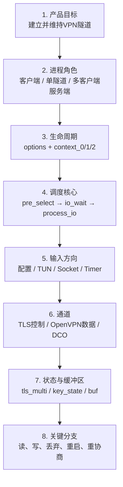

以 `tls_pre_decrypt()` 为例，不能只说“这是解密前处理函数”。完整定位应是：

```text
产品目标：接收对端OpenVPN报文
进程角色：当前context代表一条点对点隧道或一个服务端子实例
生命周期：使用c2中的本轮连接状态
触发来源：Socket可读
输入：c->c2.buf中的一个外层OpenVPN报文
通道判断：根据opcode区分P_DATA与控制报文
状态对象：tls_multi → tls_session → key_state
输出：
  数据包 → 返回对应crypto_options，交给openvpn_decrypt
  控制包 → 写入可靠层并清空buf，交给后续TLS状态机
```

一旦这张图建立起来，函数中的分支才有含义。

## 4. OpenVPN 源码阅读的“八坐标卡”

每打开一个新文件或函数，先填写这八项。第一遍允许有假设，但必须注明待验证。

| 坐标 | 要回答的问题 | 示例答案：`process_incoming_link_part1()` |
| --- | --- | --- |
| 模式 | 客户端、P2P、服务端顶层还是服务端子实例？ | 处理一条具体隧道实例的入站 link 包 |
| 生命周期 | 状态属于 `options`、`c0`、`c1`、`c2` 还是某代 `key_state`？ | 当前连接周期的 `c2`，密钥来自 `key_state` |
| 触发源 | 配置、TUN、socket、定时器还是管理事件？ | `SOCKET_READ` |
| 输入 | 输入对象/缓冲区是什么？ | `c->c2.buf`，由 `read_incoming_link()` 填充 |
| 决策者 | 谁决定下一分支？ | 首字节 opcode、TLS 状态、DCO 和连接状态 |
| 持久状态 | 哪些状态在函数返回后继续存在？ | `tls_multi`、key state、计数器、重放窗口 |
| 输出 | 结果放到哪里，谁继续消费？ | 数据明文留在 `buf`，再转为 `to_tun`；控制包进入可靠层 |
| 失败策略 | 丢包、重试、软重启还是进程退出？ | 解密失败通常丢包；TCP 模式会触发 `SIGUSR1` 重启 |

这张卡比“函数做了解密”更接近工程事实。

## 5. 阅读前必须掌握的四个 C 语言桥梁

### 5.1 `struct context` 不是一个扁平大对象

`src/openvpn/openvpn.h:470` 定义 `struct context`。它既保存配置，也连接三种不同寿命的运行状态：

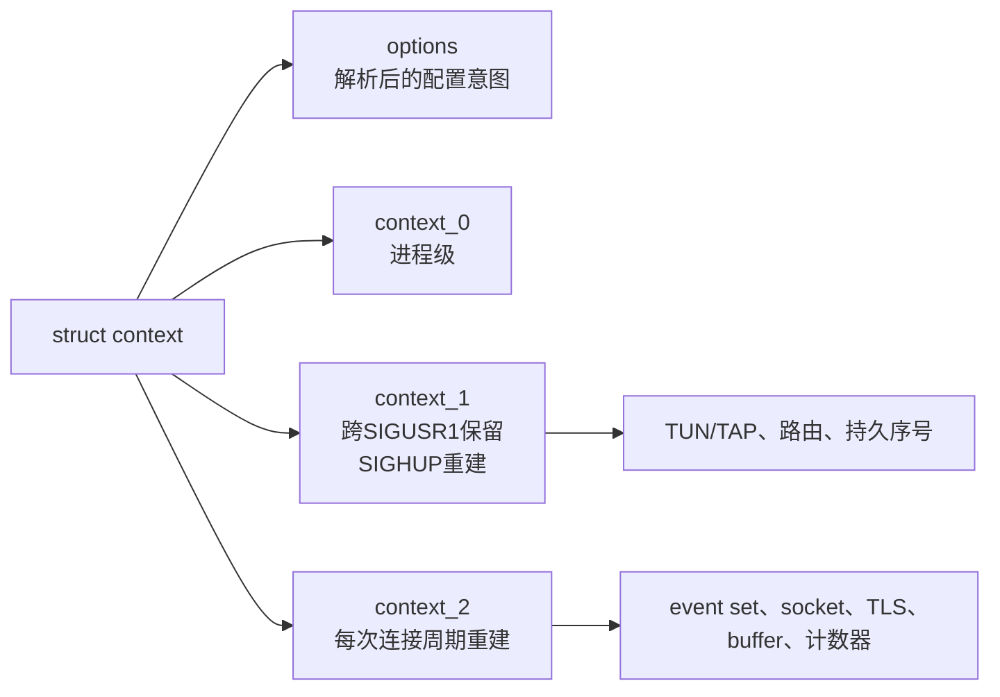

源码依据：

- `openvpn.h:136`：`context_0`，进程生命周期；
- `openvpn.h:156`：`context_1`，跨 `SIGUSR1` 保留、遇 `SIGHUP` 重建；
- `openvpn.h:223`：`context_2`，`SIGUSR1` 与 `SIGHUP` 都会重建；
- `openvpn.h:512-514`：三类状态被装入总 `context`。

这解释了为什么同一字段放在哪一层很重要。例如：

- TUN 设备可在软重启时复用，所以在 `c1`；
- 当前连接的 TLS 状态、socket、事件和临时 buffer 属于 `c2`；
- 静态配置放在 `options`，但这不等于运行时已经采用该配置。

> **常见误解**
> 看到 `struct context` 很大，就把它理解成“所有状态都永久存在”。实际上，它内部刻意按重启边界分层。读清理与重连代码时，必须先问当前字段属于哪一层。
>

### 5.2 `struct buffer` 是“内存视图”，不是固定字节数组

`src/openvpn/buffer.h:59-68` 定义：

```c
struct buffer {
    int capacity;
    int offset;
    int len;
    uint8_t *data;
};
```

实际有效内容不是从 `data[0]` 开始，而是：

```text
内容起点 = data + offset
内容长度 = len
头部可用空间 = offset
尾部可用空间 = capacity - (offset + len)
```

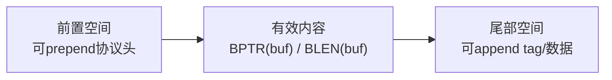

`BPTR(buf)` 得到当前有效内容指针，`BLEN(buf)` 得到有效长度。加密代码之所以反复要求 headroom，是因为后续还要在包前添加 opcode、peer-id、packet-id 等字段。

另一个关键点是：

```c
struct buffer b = *buf;
```

通常只复制 `capacity/offset/len/data` 这些元数据，底层字节仍可能指向同一块内存。不能看到结构体赋值就误以为“整个数据包被复制了一份”。

`openvpn.h:370-377` 甚至明确说明：`c2.buf`、`to_tun`、`to_link` 自身不分配存储，它们是指向 `context_buffers` 中已分配内存的“stub”。

### 5.3 `gc_arena` 是有作用域的批量内存管理

OpenVPN 大量使用：

```c
struct gc_arena gc = gc_new();
...
gc_free(&gc);
```

`buffer.h:105-120` 说明 `gc_arena` 会记录在该作用域中分配的内存，最后统一释放。阅读时要区分：

- 由局部 `gc` 管理的临时字符串或对象；
- 挂在 `context`/`tls_multi` 上、需要跨函数保存的长期对象；
- 仅复制指针的 buffer stub。

如果不区分寿命，容易把临时内存当成会话状态，或误判悬空指针风险。

### 5.4 后端抽象意味着核心代码不一定直接调用 OpenSSL

OpenVPN 用 `ssl_backend.h` 和 `crypto_backend.h` 隔离具体密码库。核心逻辑调用的是统一接口，例如：

```text
ssl.c
  → key_state_write_plaintext()
  → key_state_read_ciphertext()

crypto.c
  → cipher_ctx_reset()
  → cipher_ctx_update()
  → cipher_ctx_get_tag()
```

在 OpenSSL 构建中，这些接口由 `ssl_openssl.c`、`crypto_openssl.c` 实现；其他构建可能使用不同后端。

所以遇到“OpenVPN 是否真正调用 Tongsuo”这个问题，不能只看 `ssl.c`，要继续验证：

```text
编译时选择的backend
→ 链接到哪个libssl/libcrypto
→ 运行时加载哪个共享库
→ 实际握手与数据通道进入哪个backend函数
```

## 6. 六遍阅读法：每一遍只解决一种问题

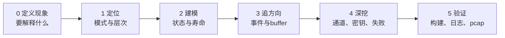

### 第 0 遍：把目标写成一个可停止的问题

好问题：

- `data-ciphers` 怎样从配置文本进入运行时 TLS 选项？
- TUN 读到一个 IP 包后，哪一步选择数据通道发送密钥？
- 一个 socket 入站包怎样区分控制包和数据包？
- 启用 DCO 后，为什么用户态 `openvpn_encrypt()` 不再处理业务包？

坏问题：

- 看懂 `forward.c`；
- 学完 OpenVPN；
- 把 TLS 代码读一遍。

坏问题没有明确输入、输出和停止条件，会让阅读无限展开。

### 第 1 遍：只定位模式和层次

先看路径、文件职责和调用者，不进入算法细节：

```text
openvpn.c       进程入口与模式选择
options*.c      文本配置到struct options
init.c          options到运行对象
forward.c       P2P/单实例事件与包转发
ssl.c           OpenVPN控制通道和密钥状态
ssl_openssl.c   OpenSSL TLS后端
crypto.c        用户态数据通道包加解密
dco*.c          数据通道内核卸载接口
```

### 第 2 遍：只重建状态与寿命

回答：

- 状态保存在 `options`、`c1`、`c2`、`tls_multi` 还是 `key_state`？
- 谁创建它？
- 重连、重协商、软重启后是否仍存在？
- 当前函数拿到的是所有者、借用指针还是 buffer 视图？

### 第 3 遍：只追一个方向

例如只追“一个 TUN 包发送出去”，暂时不追接收、认证、服务端 multi、管理接口和脚本。

```text
TUN_READ
→ read_incoming_tun
→ process_incoming_tun
→ encrypt_sign
→ tls_pre_encrypt
→ openvpn_encrypt
→ to_link
→ SOCKET_WRITE
→ process_outgoing_link
```

### 第 4 遍：再展开关键分支

此时才研究：

- 当前包是控制包还是数据包；
- 当前密钥是 primary 还是 retiring/lame-duck；
- 使用 AEAD 还是旧格式；
- 没有可用密钥时丢包还是重连；
- DCO 是否绕过用户态数据路径。

### 第 5 遍：用证据验证，不停在纸面

至少检查：

```text
源码版本/文件哈希
→ 构建配置和链接库
→ 运行二进制身份
→ 日志中的实际协商结果
→ TUN与路由状态
→ PCAP中的控制/数据包
→ 一个负面测试
```

源码告诉你“可能怎样运行”，证据才告诉你“这次确实怎样运行”。

## 7. 开始阅读前的手工定位步骤

下面的命令不是为了背诵，而是建立一套每次都能复用的定位动作。

### 7.1 进入固定源码目录

```bash
cd /path/to/workspace/learning-sources/openvpn-2.7.4
```

- `cd`：切换当前工作目录；
- 绝对路径从 `/` 开始，不依赖你之前在哪；
- 后续 `src/openvpn/...` 都相对于这个目录。

确认版本：

```bash
head -n 3 Changes.rst
```

预期第一行包含 `Overview of changes in 2.7.4`。

本地快照没有 `.git` 元数据时，可用关键文件哈希帮助识别内容：

```bash
sha256sum src/openvpn/openvpn.c \
          src/openvpn/forward.c \
          src/openvpn/ssl.c
```

当前快照应得到：

```text
e058436cc989fa16ea63623ea42a52e511b798b14a08f923019ef7a0a62cff87  src/openvpn/openvpn.c
1f26f4045ef20307bbd31c7e130af1af2d08c57ecb7b17ae2d7807e9359fb9e7  src/openvpn/forward.c
328dedbe249918f465e21311e0b1ccf87d19e0945715350ed5f83520fe1c8e52  src/openvpn/ssl.c
```

哈希只证明本地文件内容身份，不证明程序运行时一定使用了这份源码构建的二进制。

### 7.2 先搜定义，再搜调用

```bash
rg -n '^openvpn_main\(' src/openvpn/openvpn.c
rg -n 'process_incoming_tun\(' src/openvpn
rg -n 'tls_pre_encrypt\(' src/openvpn
```

- `rg`：递归搜索文本；
- `-n`：显示行号；
- `^`：表示行首，可减少把调用误当定义；
- 最后一个参数是搜索目录或文件。

查看带行号的局部代码：

```bash
nl -ba src/openvpn/openvpn.c | sed -n '150,320p'
```

- `nl -ba`：给所有行编号；
- `|`：把左侧输出交给右侧；
- `sed -n '150,320p'`：只打印 150 到 320 行。

### 7.3 建立“定义—调用者—下游”三列表

每个关键函数至少记录：

```text
定义在哪里
谁直接调用
它直接调用谁/修改什么
```

例如：

| 函数 | 定义 | 直接调用者 | 关键下游/副作用 |
| --- | --- | --- | --- |
| `process_io` | `forward.c:2287` | `tunnel_point_to_point` | 根据事件位调用 link/TUN 读写 |
| `encrypt_sign` | `forward.c:621` | `process_incoming_tun` | 选择密钥、加密，生成 `to_link` |
| `tls_pre_decrypt` | `ssl.c:3565` | 入站 link 处理 | 区分控制/数据，选择解密 key |

这样能防止只记住函数名，却不知道它为什么会执行。

## 8. 精读链一：配置文本怎样变成运行状态

先追一个代表性配置：

```text
data-ciphers AES-256-GCM:AES-128-GCM
```

这一链的目的不是研究每个配置项，而是学会 OpenVPN 的通用配置路径。

### 8.1 全链总图


### 8.2 第一步：进程创建 `struct options`

`src/openvpn/openvpn.c:153-208` 的 `openvpn_main()`：

```c
struct context c;
CLEAR(c);
...
init_options(&c.options);
parse_argv(&c.options, argc, argv, ...);
```

这段代码做了两件不同的事：

1. `init_options()` 给配置对象写入默认值；
2. `parse_argv()` 用命令行和配置文件覆盖这些默认值。

此时配置仍主要是“用户意图”，并不代表 socket、TUN、TLS 会话已经创建。

### 8.3 第二步：配置行被拆成 token

`src/openvpn/options_parse.c:346-398` 的 `read_config_file()`：

```text
fgets读取一行
→ parse_line拆分参数
→ p[0]是指令名
→ p[1...]是参数
→ add_option写入options
```

例如：

```text
原始文本：data-ciphers AES-256-GCM:AES-128-GCM
p[0]：data-ciphers
p[1]：AES-256-GCM:AES-128-GCM
p[2]：NULL
```

命令行也会走同一个 `add_option()`。`options_parse.c:450-509` 的 `parse_argv()` 去掉 `--` 前缀并组织 `p[]`，最终在 `:504` 调用 `add_option()`。

这是一种重要设计：**不同配置输入共享同一语义处理入口**。

### 8.4 第三步：`add_option()` 把字符串写入字段

`src/openvpn/options.c:5589` 是巨大的 `add_option()`。与其从头读到尾，不如直接搜目标字符串：

```bash
rg -n 'data-ciphers' src/openvpn/options.c
```

`options.c:8441-8449` 的目标分支：

```c
else if ((streq(p[0], "data-ciphers") || streq(p[0], "ncp-ciphers"))
         && p[1] && !p[2])
{
    VERIFY_PERMISSION(OPT_P_GENERAL | OPT_P_INSTANCE);
    ...
    options->ncp_ciphers = p[1];
}
```

阅读这类配置分支时固定拆成四问：

| 问题 | 此处分支的答案 |
| --- | --- |
| 识别条件 | 指令名是 `data-ciphers` 或旧名 `ncp-ciphers` |
| 参数约束 | 必须有一个参数，不能有第二个额外参数 |
| 权限/上下文 | `OPT_P_GENERAL | OPT_P_INSTANCE` |
| 状态变化 | `options->ncp_ciphers = p[1]` |

注意，这里只是保存字符串，还没有创建 cipher context，更没有加密任何业务包。

### 8.5 第四步：后处理与运行时派生

`openvpn.c:243` 调用 `options_postprocess()` 做完整性检查和派生处理。随后 `context_init_1()`、`tunnel_point_to_point()` 和 `init_instance()` 才逐步创建运行对象。

`src/openvpn/init.c:4436-4625` 的 `init_instance()` 是“配置意图转成运行对象”的主枢纽：

```text
创建event set
→ 创建link socket对象
→ do_init_crypto
→ 计算frame/MTU
→ 分配工作buffer
→ 初始化socket
→ 打开TUN/TAP（视配置时机而定）
```

在 TLS 模式中，`do_init_crypto_tls()` 会从 `c->options` 组装局部 `struct tls_options to`，再调用 `tls_multi_init()` 创建运行时状态。

### 8.6 这一链真正教会了什么

不要把“找到配置解析代码”当成完成。完整的配置阅读至少有四层：

```text
文本名称
→ options中的静态字段
→ 初始化时派生的运行结构
→ 真正消费该字段的执行路径
```

国密改造时也应使用同样方法。若新增 `tlcp-cert-sign` 之类配置，不能只增加解析分支，还要继续回答：

- 字段放在 `struct options` 的哪里；
- 怎样传入 `tls_options` 或 TLS backend；
- 何时加载证书/私钥；
- 客户端和服务端是否走不同分支；
- 配置非法时在哪一层失败；
- 日志、运行库和握手报文怎样证明它真的生效。

## 9. 精读链二：主事件循环怎样让整个系统动起来

### 9.1 入口到模式选择

`openvpn_main()` 在配置与基础初始化后，根据 `c.options.mode` 选择：

```text
MODE_POINT_TO_POINT → tunnel_point_to_point(&c)
MODE_SERVER         → tunnel_server(&c)
```

本文用点对点链说明核心机制。多客户端服务端会在 `multi.c` 中管理多个实例，但每个实例仍复用许多相同的数据处理函数。

### 9.2 三步循环

`src/openvpn/openvpn.c:56-100`：

```c
while (true)
{
    pre_select(c);
    io_wait(c, p2p_iow_flags(c));
    process_io(c, c->c2.link_sockets[0]);
}
```

三步不要混为一句“等待事件”：

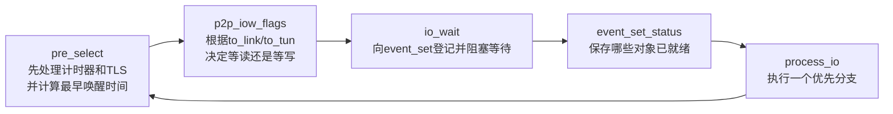

### 9.3 `pre_select()` 不只是“等待前准备”

`forward.c:1966-2029` 中，它会：

- 更新定时器；
- 检查粗粒度超时；
- 调用 `check_tls()` 推进控制通道状态机；
- 检查 TLS 错误；
- 处理已解出的控制消息；
- 计算下一次最晚何时必须醒来。

`check_tls()` 在 `forward.c:178-231` 调用：

```c
tls_multi_process(c->c2.tls_multi,
                  &c->c2.to_link,
                  &c->c2.to_link_addr,
                  ...,
                  &wakeup);
```

因此，即使 socket 此刻没有新报文，TLS 重传、握手推进和定时器也可能在 `pre_select()` 中生成一个待发控制包，放进 `to_link`。

### 9.4 `p2p_iow_flags()` 把“待办状态”变成等待条件

`forward.h:368-379`：

```c
if (c->c2.to_link.len > 0)
    flags |= IOW_TO_LINK;
if (c->c2.to_tun.len > 0)
    flags |= IOW_TO_TUN;
```

人话是：

- 已有 `to_link` 包，就等待外层 socket 可写；
- 已有 `to_tun` 包，就等待 TUN 可写；
- 没有待写包时，主要等待 TUN 或 socket 可读。

“buffer 中有待发送数据”和“设备已经可写”是两个不同事实。

### 9.5 `io_wait()` 只报告就绪，不处理业务

`forward.c:2164-2284`：

```text
event_reset
→ multi_io_process_flags登记socket/TUN
→ 登记DCO/管理事件
→ event_wait阻塞
→ 把返回事件编码进event_set_status
```

`event_set_status` 是位掩码，例如 `SOCKET_READ`、`TUN_READ`、`SOCKET_WRITE`。它表达“现在可以做什么”，并不携带业务包本身。

### 9.6 `process_io()` 一轮只进入一个主要分支

`forward.c:2287-2333` 的主体是 `if / else if`：

```text
SOCKET_WRITE → process_outgoing_link
TUN_WRITE    → process_outgoing_tun
SOCKET_READ  → read_incoming_link + process_incoming_link
TUN_READ     → read_incoming_tun + process_incoming_tun
DCO_READ     → dco_read_and_process
```

> **容易忽略的细节**
> 即使多个事件位同时就绪，这段 `else if` 在一次 `process_io()` 调用中也只执行一个主要分支。剩余工作会回到下一轮循环再次处理。不要把它误读成“一次循环处理全部就绪事件”。
>

## 10. 精读链三：一个 IP 包怎样从 TUN 发到网络

这是理解 OpenVPN 用户态数据面的第一条主链。

### 10.1 全链图

```mermaid
sequenceDiagram
    participant App as 业务应用/内核路由
    participant Tun as TUN设备
    participant Loop as OpenVPN事件循环
    participant TLS as tls_multi/key_state
    participant Crypto as crypto.c/backend
    participant Sock as UDP/TCP Socket

    App->>Tun: 明文IP包被路由到隧道接口
    Tun-->>Loop: TUN_READ就绪
    Loop->>Loop: read_incoming_tun写入c2.buf
    Loop->>Loop: process_incoming_tun检查IP/MTU
    Loop->>TLS: tls_pre_encrypt选择可用发送key_state
    TLS-->>Loop: 返回ks->crypto_options
    Loop->>Crypto: openvpn_encrypt(c2.buf, encrypt_buf, co)
    Crypto-->>Loop: 密文、packet-id、tag/HMAC
    Loop->>Loop: 结果挂到c2.to_link
    Note over Loop,Sock: 通常下一轮等待SOCKET_WRITE
    Loop->>Sock: process_outgoing_link / link_socket_write
    Sock-->>Sock: 外层UDP/TCP报文发往对端
```

### 10.2 阶段一：从 TUN 读明文 IP 包

当 `event_set_status` 含 `TUN_READ`，`process_io()` 调用：

```c
read_incoming_tun(c);
process_incoming_tun(c, sock);
```

`forward.c:1300-1353` 的 `read_incoming_tun()`：

```c
c->c2.buf = c->c2.buffers->read_tun_buf;
buf_init(&c->c2.buf, c->c2.frame.buf.headroom);
c->c2.buf.len = read_tun(..., BPTR(&c->c2.buf), ...);
```

此刻：

```text
输入：TUN文件描述符中的明文IP包
输出：c->c2.buf
内容：仍是明文隧道内层包
状态：尚未选择数据通道密钥
```

### 10.3 阶段二：包检查后进入 `encrypt_sign()`

`forward.c:1479-1524` 的 `process_incoming_tun()`：

- 更新读取计数；
- 检查递归路由；
- 处理 MSS、TOS 等 IP 头逻辑；
- 调用 `encrypt_sign(c, true)`。

函数名包含 `sign` 是历史命名，不要因此断言所有模式都执行数字签名。这里实际负责压缩/分片（如果启用）、数据通道加密与认证、封装和输出 buffer 交接。

### 10.4 阶段三：先判断当前路径是否应该在用户态

`forward.c:621-642`：

```c
if (dco_enabled(&c->options))
{
    ...
    c->c2.buf.len = 0;
}

if (c->c2.tls_multi
    && c->c2.tls_multi->multi_state < CAS_CONNECT_DONE)
{
    c->c2.buf.len = 0;
}
```

这两个 guard 非常重要：

1. DCO 已启用时，正常业务包本来就不该再从用户态 TUN 路径进入这里；若进入就丢弃；
2. TLS 模式尚未完成连接和授权时，不能提前放行业务包。

真正的工程阅读应先找这些“门卫条件”，再看成功路径。

### 10.5 阶段四：选择哪一代数据通道密钥

`encrypt_sign()` 在 `forward.c:665-680` 调用 `tls_pre_encrypt()`。

`ssl.c:3917-3972` 的逻辑是：

```text
扫描可用key_state
→ 状态至少达到S_GENERATED_KEYS
→ authenticated必须为真
→ 选择合适的primary/retiring key
→ 返回&ks_select->crypto_options
→ 没有可用key则清空buf并丢弃
```

这一步把两个世界连接起来：

```text
TLS控制通道产生并维护key_state
                    ↓
             crypto_options
                    ↓
OpenVPN数据通道使用它加密业务包
```

但“由 TLS 过程建立数据密钥”不等于“业务包仍由 TLS record 加密”。业务包随后进入的是 `crypto.c`，不是 `SSL_write()`。

### 10.6 阶段五：`openvpn_encrypt()` 分派具体数据格式

`src/openvpn/crypto.c:329-342`：

```c
if (cipher_ctx_mode_aead(opt->key_ctx_bi.encrypt.cipher))
    openvpn_encrypt_aead(...);
else
    openvpn_encrypt_v1(...);
```

对于 AEAD 路径，`crypto.c:65-184` 会完成：

- 从 `crypto_options.key_ctx_bi.encrypt` 取得发送 cipher context；
- 写入 packet-id，形成唯一 nonce/IV 的显式部分；
- 与 implicit IV 组合；
- 把 opcode/peer-id 等作为 AAD（具体格式取决于数据格式）；
- 加密内层 IP 包；
- 生成 authentication tag；
- 把 `buf` 重新指向输出 `work`。

`key_ctx_bi` 在 `crypto.h:279-286` 分为：

```text
encrypt → 本端发送方向
decrypt → 本端接收方向
```

客户端与服务端会根据 key direction 把双方生成的 key material 映射到相反的收发方向。

### 10.7 阶段六：从 `buf` 交接到 `to_link`

`forward.c:698-701`：

```c
link_socket_get_outgoing_addr(...);
buffer_turnover(orig_buf, &c->c2.to_link, &c->c2.buf, ...);
```

`buffer_turnover()` 并不总是复制整个数据包。它可能通过结构体赋值把 destination stub 指向当前底层存储；只有特定别名条件下才把内容转到指定 storage。

处理结束后的关键状态是：

```text
c2.to_link.len > 0
```

下一轮 `p2p_iow_flags()` 因此加入 `IOW_TO_LINK`，等待 socket 可写。

### 10.8 阶段七：真正写入外层 socket

当事件位变成 `SOCKET_WRITE`，`process_io()` 调用 `process_outgoing_link()`。

`forward.c:1746-1810` 最终执行：

```c
link_socket_write(sock, &c->c2.to_link, to_addr);
```

此时输出才真正进入外层 UDP/TCP socket。

### 10.9 这条链的输入输出表

| 阶段 | 输入 | 处理者 | 输出 | 可观察结果 |
| --- | --- | --- | --- | --- |
| 路由到 TUN | 应用明文 IP 包 | Linux/Windows 网络栈 | TUN 可读 | TUN 地址与路由 |
| 读 TUN | TUN 字节流 | `read_incoming_tun` | `c2.buf` | `TUN READ` 日志 |
| 选密钥 | 明文 `buf` + `tls_multi` | `tls_pre_encrypt` | `crypto_options *` | key-id 调试日志 |
| 加密 | 明文、packet-id、key ctx | `openvpn_encrypt` | OpenVPN 数据密文 | 加密错误/计数 |
| 排队发送 | 密文 `buf` | `buffer_turnover` | `to_link` | 下一轮等待 socket 写 |
| 写网络 | `to_link` | `link_socket_write` | UDP/TCP 外层包 | PCAP 与 link write 计数 |

## 11. 精读链四：一个网络包怎样分流并写回 TUN

### 11.1 控制包与数据包在入口处共享 socket

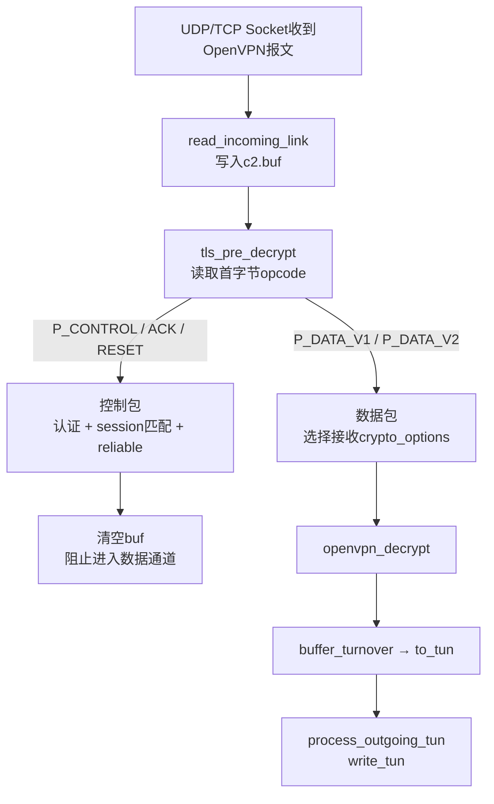

### 11.2 阶段一：socket 数据进入 `c2.buf`

`forward.c:926-984` 的 `read_incoming_link()`：

```c
c->c2.buf = c->c2.buffers->read_link_buf;
buf_init(&c->c2.buf, c->c2.frame.buf.headroom);
link_socket_read(sock, &c->c2.buf, &c->c2.from);
```

此时只知道它来自外层链路，还不知道是控制包还是数据包。

### 11.3 阶段二：`tls_pre_decrypt()` 先做协议分流

`forward.c:1041-1079` 调用 `ssl.c:3565` 的 `tls_pre_decrypt()`。

它从首字节提取 opcode：

```c
uint8_t pkt_firstbyte = *BPTR(buf);
int op = pkt_firstbyte >> P_OPCODE_SHIFT;
```

随后形成两个完全不同的结果。

#### 数据包分支

`ssl.c:3582-3585`：

```c
if (op == P_DATA_V1 || op == P_DATA_V2)
{
    handle_data_channel_packet(..., opt, ...);
    return false;
}
```

`handle_data_channel_packet()` 负责根据 key-id/peer-id 等找到接收 `key_state`，把相应 `crypto_options` 通过 `opt` 返回。真正的业务数据解密仍由调用者稍后执行。

#### 控制包分支

控制包会继续：

- 校验 opcode；
- 根据 session-id 匹配或创建 `tls_session`；
- 处理 `tls-auth`/`tls-crypt` 外层保护；
- 读取 ACK 与 packet-id；
- 把 TLS ciphertext 存入 `rec_reliable`；
- 在结束前把 `buf->len = 0`、`*opt = NULL`。

`ssl.c:3903-3907` 清空 buffer 的含义是：

> 这个包已被控制通道接管，不应继续被当成业务数据解密或写入 TUN。

### 11.4 阶段三：数据包进入 `openvpn_decrypt()`

`forward.c:1096-1098`：

```c
openvpn_decrypt(&c->c2.buf,
                c->c2.buffers->decrypt_buf,
                co,
                &c->c2.frame,
                ad_start);
```

`crypto.c:779-800` 根据接收 cipher 是否为 AEAD，选择 `openvpn_decrypt_aead()` 或旧格式。

成功路径一般包括：

- 解析 packet-id/nonce；
- 验证 AAD 与 tag 或 HMAC；
- 解密密文；
- 执行防重放检查；
- 把 `buf` 指向明文内层 IP 包。

如果认证或解密失败，函数把长度清零，下游就不会写入 TUN。TCP 传输模式下，`forward.c:1100-1107` 还会触发 `SIGUSR1` 软重启，因为字节流中的解密错误可能导致后续边界不可恢复。

### 11.5 阶段四：明文转为 `to_tun`

`process_incoming_link_part2()` 会处理可选解压、ping/OCC，并在 `forward.c:1188` 调用：

```c
buffer_turnover(orig_buf,
                &c->c2.to_tun,
                &c->c2.buf,
                &c->c2.buffers->read_link_buf);
```

之后 `c2.to_tun.len > 0`，下一轮会等待 `TUN_WRITE`。

### 11.6 阶段五：写回 TUN

`forward.c:1880-1963` 的 `process_outgoing_tun()` 最终调用：

```c
write_tun(c->c1.tuntap,
          BPTR(&c->c2.to_tun),
          BLEN(&c->c2.to_tun));
```

写入 TUN 后，操作系统把这个明文内层 IP 包当作从虚拟接口收到的包，继续做本机路由或交付给应用。

### 11.7 读懂 `tls_pre_decrypt()` 的关键结论

错误理解：

> `tls_pre_decrypt()` 名字里有 TLS，所以所有入站包都由 TLS 解密。

正确理解：

> 它首先是 OpenVPN 外层报文的分流器。控制包进入 OpenVPN 的可靠控制层和 TLS 状态机；数据包只在这里选择正确的 `crypto_options`，随后由 `crypto.c` 解密。

## 12. 精读链五：TLS 控制通道如何通过 Memory BIO 运转

这一部分是后续理解 TLS、TLCP 和双证书改造的关键，但必须始终与业务数据通道分开。

### 12.1 先看对象层级

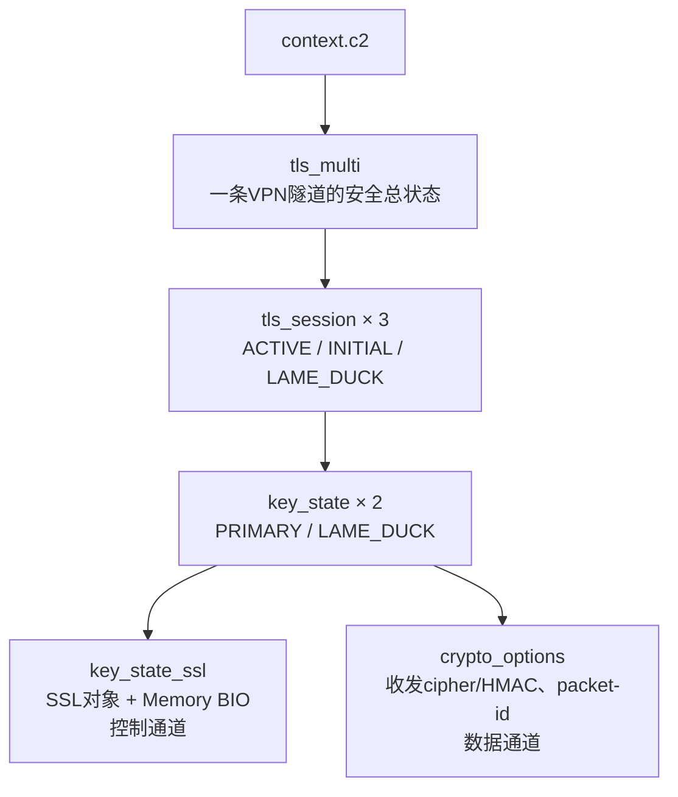

对应源码：

- `openvpn.h:323`：`context_2.tls_multi`；
- `ssl_common.h:611`：`struct tls_multi`；
- `ssl_common.h:489`：`struct tls_session`；
- `ssl_common.h:207`：`struct key_state`；
- `ssl_common.h:225`：`key_state_ssl ks_ssl`；
- `ssl_common.h:237`：`crypto_options`。

这张图是理解 OpenVPN 密钥生命周期的核心：**同一个 `key_state` 同时关联控制通道 TLS 状态和由它协商出的数据通道密码状态，但两者不是同一个加密层。**

### 12.2 为什么 TLS 没有直接接管 UDP/TCP socket

OpenVPN 需要在 TLS 之上再实现：

- 自己的 opcode 和 session-id；
- UDP 上的可靠传输、ACK、重传与排序；
- `tls-auth`/`tls-crypt`；
- 控制包和数据包复用同一外层传输。

因此它没有简单地把网络 socket 直接交给 OpenSSL，而是使用 Memory BIO，把 TLS 状态机嵌入 OpenVPN 自己的包处理系统。

### 12.3 `key_state_ssl_init()` 创建什么

`src/openvpn/ssl_openssl.c:2218-2255`：

```c
ks_ssl->ssl = SSL_new(ssl_ctx->ctx);
ks_ssl->ssl_bio = BIO_new(BIO_f_ssl());
ks_ssl->ct_in = BIO_new(BIO_s_mem());
ks_ssl->ct_out = BIO_new(BIO_s_mem());
...
SSL_set_bio(ks_ssl->ssl, ks_ssl->ct_in, ks_ssl->ct_out);
BIO_set_ssl(ks_ssl->ssl_bio, ks_ssl->ssl, BIO_NOCLOSE);
```

三个 BIO 的角色：

| 对象 | OpenVPN 往哪里写/读 | 人话 |
| --- | --- | --- |
| `ct_in` | 把网络收到的 TLS 密文写进去 | TLS 状态机的密文输入口 |
| `ct_out` | 从中读出 TLS 产生的密文 | TLS 状态机的密文输出口 |
| `ssl_bio` | 写控制明文、读解密后的控制明文 | TLS 状态机的明文侧接口 |

### 12.4 入站 TLS 控制数据流

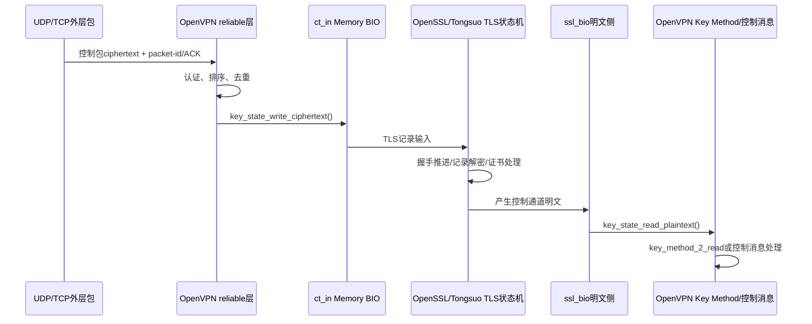

`ssl_openssl.c:2317-2326` 的 `key_state_write_ciphertext()` 把 ciphertext 写入 `ct_in`；`:2330-2338` 的 `key_state_read_plaintext()` 从 `ssl_bio` 读出 TLS 解密后的明文。

### 12.5 出站 TLS 控制数据流

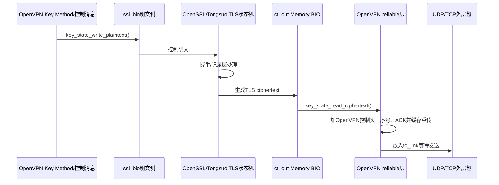

`ssl_openssl.c:2280-2289` 把明文写入 `ssl_bio`；`:2305-2313` 从 `ct_out` 读出 TLS ciphertext。

### 12.6 谁驱动 TLS 状态机

`pre_select()` 调用 `check_tls()`，后者调用 `tls_multi_process()`。它会遍历 session 并推进 `tls_process()`/状态处理。

`ssl.c:2745-2918` 的关键顺序：

```text
检查握手超时与状态迁移
→ 从reliable层取入站TLS ciphertext
→ 写入TLS对象
→ 从TLS对象读取控制明文
→ key_method_2_write/read交换数据通道密钥材料
→ 把待发控制明文写入TLS对象
→ 从TLS对象取出ciphertext
→ 放入reliable发送队列/to_link
```

### 12.7 `key_method_2` 与数据通道的关系

在 TLS 通道完成保护后，OpenVPN 通过 `key_method_2_write()` / `key_method_2_read()` 交换并处理建立数据通道所需的材料。之后 `init_key_contexts()` 把材料初始化为：

- 用户态 `key_ctx_bi`；或
- DCO 所需的内核 key 安装。

因此应区分三层：

```text
TLS/TLCP握手和记录层密钥
        ↓ 保护控制通道
OpenVPN Key Method交换/派生材料
        ↓
OpenVPN数据通道收发密钥
```

TLS/TLCP 使用 SM4，只能直接证明控制通道握手/记录层选择了相应套件；要证明业务数据也使用 SM4，还必须继续验证 `data-ciphers`、`crypto_options`、实际 backend/DCO 支持和数据包路径。

### 12.8 TLCP 改造应该落在哪些层

从这条链可以准确地拆出候选改造层，而不是笼统说“替换 OpenSSL”：

```text
配置层
→ 是否提供TLCP/签名证书/加密证书配置

TLS backend根上下文
→ tls_ctx_server_new / tls_ctx_client_new
→ 创建何种TLS/TLCP方法

证书加载
→ 单证书接口是否扩展为签名+加密双证书

key_state_ssl
→ Memory BIO是否与所用TLCP状态机兼容

OpenVPN控制层
→ 握手输出/输入、证书校验、错误传播是否保持正确

数据通道
→ 是否另行增加/协商SM4，不能由TLCP自动推出
```

本文基于上游 2.7.4 阅读这些扩展边界，不表示上游已经原生实现 TLCP 双证书。

## 13. 精读链六：DCO 为什么会改变你看到的数据路径

DCO（Data Channel Offload，数据通道卸载）把业务数据包的加解密和转发下沉到内核组件。用户态 OpenVPN 仍负责配置、TLS 控制通道、认证、密钥协商和重协商，但不再逐包执行用户态 `openvpn_encrypt()` / `openvpn_decrypt()`。

### 13.1 用户态与 DCO 路径对比

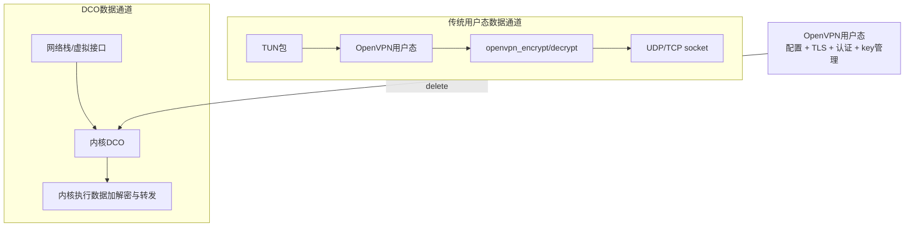

### 13.2 源码如何表明路径已经改变

三组源码共同给出边界：

1. `forward.c:627-632`：DCO 已启用时，用户态 `encrypt_sign()` 收到业务包会警告并丢弃；
2. `forward.c:2327-2332`：事件循环新增 `DCO_READ → dco_read_and_process()` 分支；
3. `ssl.c:1385-1401`：`init_key_contexts()` 在 DCO 模式调用 `init_key_dco_bi()`，随后清空用户态 encrypt/decrypt context，因为它们不再逐包使用。

继续向下可见：

```text
ssl.c:init_key_contexts
→ dco.c:init_key_dco_bi
→ dco.c:dco_install_key
→ 平台实现:dco_new_key
   ├─ dco_linux.c
   ├─ dco_win.c
   └─ dco_freebsd.c
```

### 13.3 对国密改造的直接影响

假设你只在 `crypto_openssl.c` 中增加 SM4 支持：

- 传统用户态数据通道可能使用该实现；
- DCO 模式不一定支持该算法；
- 即使控制通道 TLCP 成功，也不能推出内核 DCO 支持 SM4；
- DCO 若不支持目标 cipher，应该显式拒绝、回退到用户态或禁止启用，不能静默换成 AES。

因此每次读数据通道代码前先问：

> 当前运行配置到底启用了 DCO 吗？如果启用，我现在追的用户态函数是否仍是实际执行路径？

## 14. 怎样读一个很长的 OpenVPN 函数

不要逐行翻译。先把函数切成六种代码块：

| 类型 | 识别线索 | 你要问什么 |
| --- | --- | --- |
| 门卫条件 | `if (...) { len = 0; return; }` | 什么情况下禁止继续？ |
| 状态读取 | `c->...`、`ks->...` | 读的是配置、连接还是一代密钥？ |
| 分支选择 | opcode、mode、cipher、DCO | 哪个输入决定路径？ |
| 核心变换 | read/write/encrypt/decrypt | 输入 buffer 变成了什么？ |
| 副作用 | 计数器、状态、signal、queue | 函数返回后留下什么？ |
| 失败出口 | `goto error`、`len=0`、signal | 丢包、重试、重协商还是重启？ |

以 `encrypt_sign()` 为例，可以先折叠成：

```text
门卫：DCO或连接未完成时丢包
可选预处理：压缩/分片
准备：初始化encrypt_buf及headroom
选密钥：tls_pre_encrypt
核心变换：openvpn_encrypt
封装：prepend opcode/peer-id
交接：buf → to_link
```

只有某一块与当前问题相关时才继续展开。例如研究 AEAD nonce，就进入 `openvpn_encrypt_aead()`；研究“为什么没有发包”，应优先检查门卫和 `to_link.len`，不必先读 AES/SM4 后端。

## 15. 怎样读 OpenVPN 的状态，而不是只读函数

### 15.1 三种状态地图

OpenVPN 阅读中至少同时存在三套状态：

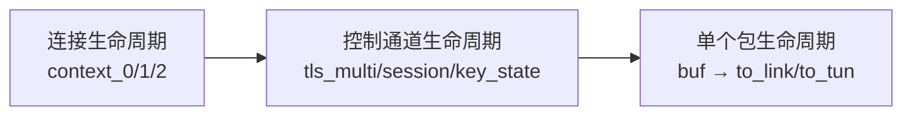

它们不能互相替代：

- `c2` 重建描述连接周期，不等于每次都销毁 `c1.tuntap`；
- `key_state` 重协商描述一代密钥轮换，不等于整个进程重启；
- `buf.len = 0` 只表示当前包停止向下游流动，不一定表示连接失败。

### 15.2 TLS 状态为什么需要多层数组

`tls_multi` 保留多套 session，`tls_session` 又保留 primary 和 lame-duck key，目的是在重协商和异常网络条件下保持数据通道连续性。

简化理解：

```text
tls_multi
├─ ACTIVE：当前可信会话
├─ INITIAL：正在建立、尚未替代当前会话的新会话
└─ LAME_DUCK：旧会话/旧密钥的过渡保存

每个tls_session
├─ PRIMARY：当前主要key_state
└─ LAME_DUCK：即将退役的key_state
```

因此 `tls_select_encryption_key()` 不是简单取数组第一个元素，而是扫描满足状态、认证和时效条件的 key。

### 15.3 `multi_state` 与 `key_state.state` 不同

- `key_state.state` 描述某一代 TLS/key-method 过程进行到哪；
- `tls_multi.multi_state` 描述整条连接是否完成认证、配置导入并允许业务流量。

所以可能出现：TLS 握手相关状态已有进展，但 `multi_state < CAS_CONNECT_DONE`，业务包仍被 `encrypt_sign()` 丢弃。

## 16. 一张函数阅读卡：以后每个关键函数都这样记录

复制下面模板，不要再只摘函数名和行号。

```markdown
### 函数：

- 源码版本：
- 文件与行号：
- 所属模式：client / P2P / server top / server child
- 所属层次：配置 / 初始化 / 事件 / 控制通道 / 数据通道 / backend / DCO
- 直接调用者：
- 触发事件：
- 输入对象：
- 输入buffer当前装的内容：
- 读取的长期状态：
- 修改的长期状态：
- 关键分支及条件：
- 输出对象/buffer：
- 下一个消费者：
- 成功日志或状态：
- 失败策略：丢包 / 重试 / 软重启 / 退出
- PCAP能看到什么：
- 当前尚未确认的假设：
```

### 16.1 填写示例：`tls_pre_encrypt()`

| 字段 | 答案 |
| --- | --- |
| 位置 | `src/openvpn/ssl.c:3944` |
| 所属层次 | TLS 管理状态与数据通道的交界 |
| 调用者 | `forward.c:encrypt_sign()` |
| 触发事件 | TUN 入站明文准备发向对端 |
| 输入 | `tls_multi`、待加密 `buf` |
| 读取状态 | 三类 session/key 中的状态、认证结果、过期时间 |
| 核心分支 | 是否存在已生成密钥且已认证的 `key_state` |
| 输出 | `*opt = &ks_select->crypto_options`；并保存 `save_ks` |
| 下游 | `openvpn_encrypt()` 和 opcode 封装 |
| 失败 | `*opt = NULL`、`buf->len = 0`，当前包丢弃 |
| 边界 | 它选择 key，不执行实际 cipher 运算 |

这类记录能让函数重新进入系统，而不是成为孤立知识点。

## 17. 源码、日志、PCAP 和系统状态如何对应

任何关键结论都建议按下面六格闭环。

### 示例：证明一个用户态数据包完成加密并通过隧道传输

#### 【理论应该发生什么】

内层 IP 包被路由到 TUN；OpenVPN 读取后选择已认证的数据通道 key，加密并从外层 socket 发出；对端解密后写入 TUN。

#### 【源码在哪里实现】

```text
read_incoming_tun
→ process_incoming_tun
→ encrypt_sign
→ tls_pre_encrypt
→ openvpn_encrypt
→ process_outgoing_link
```

#### 【成功日志应该看到什么】

- 连接进入完成状态；
- 数据通道 cipher 的实际协商结果；
- 可选高日志级别下的 `TUN READ`、link write、key-id 选择；
- 没有反复出现 replay、decrypt error 或 reconnect。

#### 【PCAP 能看到什么】

- 外层 UDP/TCP 五元组；
- OpenVPN opcode/数据包形态（解码能力取决于 Wireshark 版本）；
- 无法从普通密文包直接读取内层 IP 内容；
- 对专有或新增 cipher，Wireshark 可能只显示数值或普通 OpenVPN Data，不会自动证明算法名。

#### 【系统状态怎样证明】

- TUN 地址与路由存在；
- 隧道内目标可达；
- 收发计数增长；
- 运行二进制和加载库与目标构建一致；
- 若使用 DCO，能看到 DCO 设备/peer/key 状态，而非只检查用户态函数。

#### 【负面测试应该是什么】

- 两端故意配置无交集 data cipher，连接应明确失败而非静默降级；
- 篡改/损坏一个数据包，接收端应丢弃并记录认证失败；
- 禁用或移除目标 cipher provider，启动或协商应失败；
- DCO 不支持目标 cipher 时，应得到明确行为并验证是否回退。

## 18. 八种最危险的“看懂了”假象

### 18.1 找到配置字段，就认为功能已生效

配置只表达意图。还要追到初始化、协商、运行 key、实际包路径。

### 18.2 TLCP 握手成功，就认为业务数据是 SM4

TLCP 是控制通道方案；OpenVPN 数据通道由 `data-ciphers`、key method、`crypto_options` 和用户态/DCO 实现共同决定。

### 18.3 链接了 Tongsuo，就认为所有密码运算都进入 Tongsuo

需要分别验证 TLS backend、data crypto backend、Provider/Engine、DCO/硬件卸载和运行时加载库。

### 18.4 看见 `struct buffer` 赋值，就认为复制了整个包

很多时候只复制了描述符，底层数据仍共享。必须跟踪 `data` 指针、`offset`、`len` 和 storage。

### 18.5 看到 `tls_pre_decrypt()`，就认为它完成所有解密

它对控制包做认证/入队；对数据包主要完成分流和 key 选择。数据包实际解密在 `openvpn_decrypt()`。

### 18.6 看到连接日志为绿色，就认为数据面闭环

控制通道连通不等于路由、TUN、数据密钥、MTU、NAT 和业务访问都正确。

### 18.7 读通用户态链，就认为 DCO 模式也相同

DCO 会绕过逐包用户态加解密，关键证据转为 key 下发、内核状态和 DCO 计数。

### 18.8 看到 `process_io()` 事件位，就认为所有事件在同一轮处理

主分支是 `else if`。当前轮只处理一个优先事件，其他就绪工作会在后续循环处理。

## 19. 面对陌生 OpenVPN 文件，先判断它属于哪张地图

### 19.1 配置与初始化类

典型文件：

```text
options.c / options_parse.c / options.h / init.c
```

阅读问题：

- 文本字段写到 `struct options` 哪个成员；
- 后处理做了哪些约束；
- 哪个 init 函数第一次消费它；
- 生成哪个长期运行对象。

### 19.2 I/O 与数据转发类

典型文件：

```text
forward.c / event.c / socket.c / tun.c
```

阅读问题：

- 什么事件触发；
- 当前包来自 TUN 还是 link；
- 当前 buffer 是 `buf`、`to_link` 还是 `to_tun`；
- 本轮处理后是否要等待下一次可写事件。

### 19.3 TLS 控制通道类

典型文件：

```text
ssl.c / ssl_common.h / reliable.c / ssl_pkt.c / tls_crypt.c
```

阅读问题：

- 当前是 OpenVPN 控制封装、TLS record，还是 key method 明文；
- 对应哪个 session/key_state；
- 如何排序、ACK、重传；
- TLS 输出怎样回到 `to_link`。

### 19.4 密码库后端类

典型文件：

```text
ssl_backend.h / ssl_openssl.c
crypto_backend.h / crypto_openssl.c
```

阅读问题：

- 核心层调用的抽象接口是什么；
- 当前构建绑定哪个后端；
- TLS 对象、证书、cipher context 怎样创建；
- 错误如何回传到上层。

### 19.5 DCO 与平台类

典型文件：

```text
dco.c / dco_linux.c / dco_win.c / dco_freebsd.c
```

阅读问题：

- 用户态下发了哪些 key、peer 和路由信息；
- 平台接口如何编码；
- 哪些 cipher/功能不支持；
- key 轮换、删除和错误恢复如何处理。

### 19.6 多客户端服务端类

典型文件：

```text
multi.c / mroute.c / mbuf.c / pool.c
```

本文完整示例以 P2P/单隧道链为主。研究服务端时，不要把顶层监听 `CM_TOP` 与每客户端 child context 混在一起。先回答：当前函数操作的是监听器、实例表，还是某个具体客户端 context。

## 20. IDE 中应该怎样实际操作

命令行用于快速定位和保留可复现记录；IDE 用于来回跳转和观察类型。

建议顺序：

1. 用 `rg` 找定义和调用；
2. 在 IDE 中“转到定义”查看结构体；
3. 用“查找引用”确认直接调用者；
4. 只给当前一条链设置书签；
5. 在笔记中记录输入、状态、输出，不大段复制源码；
6. 若运行调试可用，在关键边界打断点，而不是在函数每行单步。

代表性断点：

```text
openvpn_main
init_instance
process_io
read_incoming_tun
encrypt_sign
tls_pre_encrypt
openvpn_encrypt
read_incoming_link
tls_pre_decrypt
openvpn_decrypt
tls_multi_process
key_state_ssl_init
```

每次只围绕一个问题启用 3～5 个断点。例如追发送包时，不必同时断在所有 TLS 初始化函数。

## 21. AI 应该替你做什么，你必须掌握什么

### 21.1 适合交给 AI 的工作

- 在固定版本中搜索函数定义和引用；
- 生成初始调用图；
- 对比两个版本的函数签名；
- 从日志中提取关键时间线；
- 为代表性路径生成断点列表和测试脚本；
- 整理源码位置、文档导航和表格；
- 对机械性 backend 接口做候选补丁。

### 21.2 你必须亲自判断的工作

- 当前追的是实际路径还是未启用分支；
- 控制通道、数据通道和 DCO 的边界；
- 密钥从哪一代 `key_state` 来，何时生效和销毁；
- 失败是否安全、是否发生降级；
- 哪些证据足以支持“国密已生效”；
- AI 给出的代码是否改对版本、编进目标二进制并真实执行。

### 21.3 一次代表性闭环就够，之后再自动化

对每个关键机制，至少亲手完成一次：

```text
提出问题
→ 定位真实函数
→ 画出输入/状态/输出
→ 运行并观察
→ 修改一个受控点或制造一个故障
→ 用日志/pcap/状态解释结果
```

之后相似的批量搜索、日志提取和回归可以交给 AI。这样既快，又不会把自己变成无法验收 AI 输出的人。

## 22. 推荐学习顺序：不是按文件夹，而是按六条链

### 第一条：进程与生命周期（核心掌握）

```text
openvpn_main
→ options
→ context_init_1
→ tunnel_point_to_point / tunnel_server
→ init_instance
→ close/restart
```

掌握门槛：能解释 `options`、`c0`、`c1`、`c2` 的区别。

### 第二条：事件循环（核心掌握）

```text
pre_select
→ p2p_iow_flags
→ io_wait
→ event_set_status
→ process_io
```

掌握门槛：能解释为什么生成 `to_link` 后通常还要等下一次 socket 可写。

### 第三条：用户态发送数据（核心掌握）

```text
TUN_READ
→ read_incoming_tun
→ encrypt_sign
→ tls_pre_encrypt
→ openvpn_encrypt
→ to_link
```

掌握门槛：能指出明文、密钥选择、密文分别出现在哪里。

### 第四条：入站分流与接收数据（核心掌握）

```text
SOCKET_READ
→ read_incoming_link
→ tls_pre_decrypt
→ control/data分流
→ openvpn_decrypt
→ to_tun
```

掌握门槛：能解释控制包为什么被清空，而数据包为什么继续进入 `crypto.c`。

### 第五条：TLS Memory BIO（核心掌握）

```text
reliable ciphertext
↔ ct_in / ct_out
↔ SSL/TLS状态机
↔ ssl_bio plaintext
↔ key method / 控制消息
```

掌握门槛：能在白板上画出四个接口，说明 TLS 为什么不直接占有网络 socket。

### 第六条：DCO 与服务端扩展（工程会用）

```text
用户态控制面
→ key下发
→ 内核DCO数据面
```

掌握门槛：知道何时必须停止追用户态逐包函数，并找到平台 key 安装入口。

暂不展开：所有管理接口、代理模式、脚本插件、压缩算法、每个平台驱动细节。用到时再沿同一方法补图。

## 23. 四个练习：从“能看懂”到“能证明”

### 练习一：追一个配置项

任选 `remote`、`dev` 或 `data-ciphers`：

1. 找到配置文本解析分支；
2. 找到 `struct options` 字段；
3. 找到初始化阶段第一次消费位置；
4. 找到运行阶段真正影响行为的位置；
5. 写出一个非法配置的预期失败。

完成物：一张四列小表，不需要复制大段源码。

### 练习二：手画一个发送包

不得看文档，写出：

```text
TUN → ? → ? → key选择 → ? → to_link → socket
```

然后回到源码补齐函数名，并回答：

- 哪一步还是明文；
- 哪一步产生 packet-id/tag；
- 没有可用 key 时在哪里丢包；
- DCO 开启时为什么这条链不应出现。

### 练习三：分辨一个控制包

从 `process_incoming_link_part1()` 出发，追到 `tls_pre_decrypt()`：

1. opcode 在哪里读取；
2. control packet 怎样匹配 session；
3. ciphertext 放入哪个可靠队列；
4. 为什么返回前把 `buf->len` 设为 0；
5. 下一次由谁推进 TLS 状态机。

### 练习四：制造一个可恢复故障

在实验环境中选择一种：

- 两端 data cipher 无交集；
- 服务端地址/端口错误；
- TUN 路由缺失；
- 证书不受信；
- 篡改或重放数据包。

按层判断失败停在哪里：

```text
进程启动
→ 外层网络
→ 控制通道
→ 身份认证
→ 数据密钥
→ TUN/路由
→ 业务流量
```

完成物：原始日志 + 一句话根因 + 源码入口 + 修复后结果。

## 24. 掌握检查：满足这些再进入国密深改

### 核心掌握

- [ ] 能从 `openvpn_main()` 说到具体 tunnel 模式。
- [ ] 能解释 `context_0/1/2` 的重启边界。
- [ ] 能解释 `buf`、`to_link`、`to_tun` 的方向和底层存储关系。
- [ ] 能手画 `pre_select → io_wait → process_io`。
- [ ] 能从 TUN 包追到 `openvpn_encrypt()` 和 socket。
- [ ] 能从 socket 包追到控制/数据分流和 `write_tun()`。
- [ ] 能解释 `tls_multi → tls_session → key_state`。
- [ ] 能解释 `key_state_ssl` 与 `crypto_options` 的区别。
- [ ] 能画出 Memory BIO 的四向数据流。
- [ ] 能说明 TLCP 成功为什么不能单独证明数据通道 SM4。

### 工程会用

- [ ] 能用 `rg`、IDE 引用搜索和行号定位重新找到上述函数。
- [ ] 能确认运行二进制与动态库身份。
- [ ] 能用日志、PCAP、TUN/路由状态证明一条链。
- [ ] 能识别 DCO 是否改变数据路径。
- [ ] 能给一个关键函数写完整八坐标卡。

### 暂不要求

- [ ] 背出全部 opcode 数值。
- [ ] 逐行掌握 `multi.c`。
- [ ] 手写 TLS、SM2、SM3、SM4 算法。
- [ ] 一次读完全部平台 DCO 驱动。

## 25. 五个由浅入深的自测问题

1. `struct options` 与 `struct context_2` 的本质区别是什么？
2. 为什么 `process_incoming_tun()` 完成后，包不一定在同一轮循环立刻写入 socket？
3. 入站数据包和控制包都从同一个 socket 进入，在哪个函数按什么字段分开？
4. `key_state` 为什么同时包含 `ks_ssl` 与 `crypto_options`，它们分别保护什么？
5. 如果日志显示 TLCP 使用 SM4 套件，但数据通道吞吐仍由 AES-GCM 实现，你会沿哪些源码、配置和证据判断这是正确分层还是“只改了一半”？

能用自己的话回答，并能回到源码重新定位，才算完成本文；只认识函数名不算。

## 26. 一页速记：阅读 OpenVPN 时永远先问这九句

```text
1. 我现在解释的具体现象是什么？
2. 当前context是什么模式？
3. 状态属于options、c1、c2还是key_state？
4. 这次调用由配置、timer、TUN还是socket触发？
5. 当前buffer里装的是明文IP、OpenVPN控制包、TLS密文还是数据密文？
6. 代码在选择通道、选择密钥，还是执行实际加解密？
7. 输出放到哪里，下一个消费者是谁？
8. DCO是否让这条用户态路径失效？
9. 哪组运行证据能证明这次真的走了这里？
```

如果九句都能回答，大型 OpenVPN 源码就不再是“浩如烟海的文件”，而会变成几个可定位、可追踪、可验证的对象和数据流。

## 27. 权威来源与配套文档

### 上游源码基线

- OpenVPN 2.7.4：`learning-sources/openvpn-2.7.4/`
- 入口与生命周期：`src/openvpn/openvpn.c`、`openvpn.h`、`init.c`
- 配置解析：`src/openvpn/options_parse.c`、`options.c`、`options.h`
- 事件与转发：`src/openvpn/forward.c`、`forward.h`、`event.c`
- TLS 控制通道：`src/openvpn/ssl.c`、`ssl_common.h`、`reliable.c`
- OpenSSL TLS 后端：`src/openvpn/ssl_openssl.c`
- 数据通道密码：`src/openvpn/crypto.c`、`crypto.h`、`crypto_openssl.c`
- DCO：`src/openvpn/dco.c`、`dco_linux.c`、`dco_win.c`

### 本知识库的继续阅读顺序

1. [OpenVPN 源码导览](OpenVPN%20源码导览.md)：快速找到已有文档和主题；
2. [OpenVPN 2.7.4 总体框架与关键调用流程](OpenVPN%202.7.4%20总体框架与关键调用流程.md)：扩大系统全景；
3. 本文：掌握可复用的源码阅读法与代表性执行链；
4. [OpenVPN 上游源码研究与国密改造点定位](OpenVPN%20上游源码研究与国密改造点定位.md)：把链路映射到国密候选改造点；
5. [OpenVPN Tongsuo 双证书与密钥生命周期附录](OpenVPN%20Tongsuo%20双证书与密钥生命周期附录.md)：继续分析 TLCP、双证书和密钥边界。

## 28. 最终心智模型

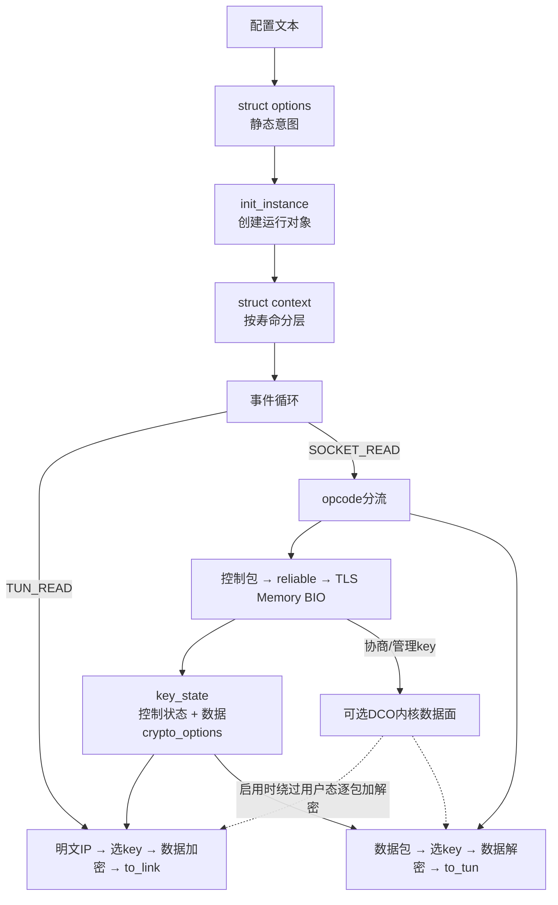

一句话总结：

> 阅读 OpenVPN，不要只追函数调用；要同时追“模式、寿命、事件、buffer、通道、密钥和下一个消费者”，最后用真实运行证据确认你追到的是实际路径。
