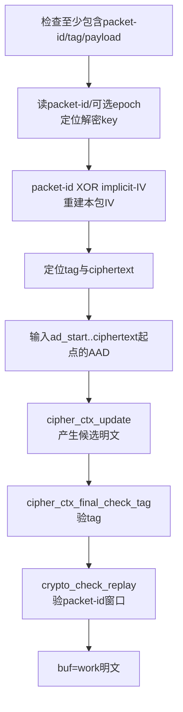

> 源码基线：OpenVPN 2.7.4 上游，官方 tag `v2.7.4` 对应提交 `8e9e91f`  
> 本文跟踪用户态接收链：一个 OpenVPN 外层报文从 socket 读出后，如何分流、匹配 key-id、验证、防重放、解密，最终写入 TUN。  
> 边界：启用 DCO 时，正常 P_DATA_V2 业务包会在内核处理；本文主线是用户态数据通道。  
> 上一条链：[TUN 明文到外层密文](OpenVPN%20六链源码精读%2004%20TUN明文到外层密文.md) · 下一条链：[数据密钥到 DCO](OpenVPN%20六链源码精读%2006%20数据密钥到DCO.md)

## 1. 先看整条链


接收链比发送链更容易出现安全 bug，因为输入由对端或攻击者控制。阅读时必须检查：

```text
长度是否先校验？
包头是否纳入认证？
是否先验证后释放明文？
packet-id是否参与防重放？
失败后buffer是否被清空？
失败包是否可能继续写入TUN？
```

## 2. `read_incoming_link()` 只负责把外层字节读进来

`forward.c:926 read_incoming_link()` 将 `c->c2.buf` 指向 `read_link_buf`，保留 headroom，然后调用：

```c
status = link_socket_read(sock, &c->c2.buf, &c->c2.from);
```

输出有两个：

- `c->c2.buf`：外层 OpenVPN 包字节；
- `c->c2.from`：包的外层来源地址。

该函数还处理 TCP reset、SOCKS 包头和系统 I/O 错误，但它不决定 cipher，也不输出明文。

## 3. `process_incoming_link_part1()` 为什么先分流后解密

`forward.c:987 process_incoming_link_part1()` 是入站主处理函数。它先：

1. 记录原始收包长度和字节计数；
2. 验证外层来源地址是否可接受；
3. 若启用 TLS 模式，调用 `tls_pre_decrypt()` 区分控制包和数据包；
4. 数据包得到 `crypto_options *co`；
5. 再调用 `openvpn_decrypt()`。

不能在 opcode 分流前直接数据解密，因为控制包和数据包的密码层、密钥和包格式不同。

## 4. `handle_data_channel_packet()` 怎样找对 key

`ssl.c:3465 handle_data_channel_packet()` 从第一字节拆出：

```text
op = c >> P_OPCODE_SHIFT
key_id = c & P_KEY_ID_MASK
```

然后扫描 `KEY_SCAN_SIZE` 个候选 key state，同时要求：

```text
ks->state >= S_GENERATED_KEYS
且 key_id == ks->key_id
且 ks->authenticated == KS_AUTH_TRUE
且 来源地址匹配（或已允许float）
```

只有四条同时满足，才将：

```c
*opt = &ks->crypto_options;
```

返回给下游。这不只是“按 key-id 查表”，还把协议状态、认证状态和对端地址纳入授权条件。

### 4.1 P_DATA_V1 与 P_DATA_V2 的指针移动

- P_DATA_V1：跳过 1 字节 opcode/key-id，`ad_start` 指向跳过后的位置；
- P_DATA_V2：`ad_start` 先记录包头起点，再跳过 1 字节 opcode/key-id 与 3 字节 peer-id；
- P_DATA_V2 长度不足 4 字节则立即拒绝。

这个 `ad_start` 之后会交给 AEAD 验证函数，确保必要包头不只是“跳过不看”，而是进入 AAD。

### 4.2 找不到 key 时为什么必须丢包

如果没有候选 key 满足条件，函数输出：

```text
buf->len = 0
*opt = NULL
```

这保证过期 key-id、未认证 key state 或来自错误地址的包不可能作为明文继续向下。

## 5. `openvpn_decrypt()` 的两个分支

`crypto.c:779 openvpn_decrypt()` 根据接收 cipher context 的模式选择：

```text
AEAD → openvpn_decrypt_aead()
非AEAD → openvpn_decrypt_v1()
```

两条分支都约定：

- 成功：`buf` 指向解密后内层明文，返回 `true`；
- 失败：`buf->len = 0`，返回 `false`。

这个“清零长度”是 OpenVPN 数据处理链的重要失败传播协议：下游函数看到长度为 0，就不再处理/输出该包。

## 6. AEAD 路径：验证、解密与防重放的顺序

`crypto.c:435 openvpn_decrypt_aead()` 的主线：



### 6.1 为什么不能看到 `cipher_ctx_update()` 就认为明文已可用

AEAD 解密 API 可能在最终 tag 检查前产生候选明文字节。但只有 `cipher_ctx_final_check_tag()` 成功后，这些字节才获得完整性和真实性保证。

源码在 tag 失败时走 `CRYPT_DROP`，不会将 `work` 赋回 `*buf`。这是“验证后释放”的关键。

### 6.2 为什么 tag 成功后还要防重放

合法密文可以被攻击者完整复制重发，tag 仍然有效。`crypto_check_replay()` 使用 packet-id 和滑动窗口判断这个已验证包是否新鲜。

因此：

```text
tag成功 → 包没被篡改，且来自持key者
packet-id成功 → 这个合法包在允许窗口中且未重放
```

## 7. CBC + HMAC 路径：为什么先验 HMAC

`crypto.c:616 openvpn_decrypt_v1()` 在存在 HMAC context 时先：

```text
从包头取出对端HMAC
→ 对后续IV+ciphertext重算HMAC
→ constant-time比较
→ 失败立即丢包
→ 成功后才解密
```

然后：

1. 检查 IV 与 payload 长度；
2. 用 IV 重置 cipher context；
3. 解密并检查 final/padding；
4. CBC 从解密明文前部读 packet-id，CFB/OFB 从 IV 读 packet-id；
5. `crypto_check_replay()` 检查重放；
6. 最后才 `*buf = work`。

对 SM4-CBC + HMAC-SM3 改造，关键不只是能调用两个算法，还包括 HMAC 长度、覆盖范围、比较方式、IV 与 packet-id 布局全部与对端一致。

## 8. 解密成功后还有一段“语义后处理”

`process_incoming_link_part2()` 只在 `c->c2.buf.len > 0` 时继续：

- 可选重组分片；
- 可选解压；
- 检查解密后 IP 包长；
- 更新已认证接收字节计数；
- 识别并消费 OpenVPN ping/OCC 特殊包；
- 将真正业务明文转移到 `c->c2.to_tun`；
- 若 TUN 未打开，再次清零，防止死锁和错误输出。

“密码验证成功”和“这是一个应写入 TUN 的业务包”仍然是两步。OpenVPN ping 可以密码学合法，但它应由 OpenVPN 本身消费，不写入内层网络。

## 9. `process_outgoing_tun()` 怎样将明文交回操作系统

`forward.c:1880 process_outgoing_tun()` 的输入是 `c->c2.to_tun`。它：

1. 处理接收方向的 MSS/client NAT 等 IP 头逻辑；
2. 检查包长不超 frame payload size；
3. 在 Windows 调用 `tun_write_win32()`，在常规 Unix TUN 路径调用 `write_tun()`；
4. 检查写入长度与截断；
5. 更新活动与 TUN 字节计数；
6. 重置 `to_tun`。

TUN 写入后，内核会把这个 IP 包当成“从虚拟网卡收到”的包，再按路由、本机协议栈或 FORWARD/NAT 处理。OpenVPN 不直接调用内网业务应用。

## 10. TCP 与 UDP 的解密失败为什么处理不同

`process_incoming_link_part1()` 在 `openvpn_decrypt()` 失败后，如果外层是面向连接的 TCP，会触发 `SIGUSR1` 软重连。

直观原因是：

- UDP 中一个坏包可以独立丢弃，下一个 datagram 仍有明确边界；
- TCP 提供字节流，OpenVPN 依赖自己的帧边界。若出现致命解密/帧错误，继续消费同一流的可信度更低，重建连接更安全。

## 11. 接收链的 buffer 变化表

| 位置 | buffer | 形态 | 失败处理 |
| --- | --- | --- | --- |
| socket 读完 | `c2.buf` | 原始 OpenVPN 外层包 | I/O 错误/重连 |
| `tls_pre_decrypt()` 后 | `c2.buf` + `co` + `ad_start` | 已跳过 opcode/peer-id 的数据密文 + 选中 key | 控制包本层消费；无 key 清零 |
| `openvpn_decrypt()` 后 | `c2.buf` | 已验证、已防重放的内层明文 | tag/HMAC/padding/replay 任一失败清零 |
| `part2()` 后 | `c2.to_tun` | 需要交给内核的业务包 | ping/OCC/TUN未就绪时清零 |
| TUN 写入后 | 内核网络栈 | 从虚拟接口收到的 IP 包 | TUN I/O/MTU 错误 |

## 12. 国密数据通道审查的高价值点

| 审查点 | SM4-GCM/AEAD | SM4-CBC + HMAC-SM3 |
| --- | --- | --- |
| 选 key | key-id/session/auth/address 必须全部通过 | 同左 |
| 完整性 | tag + AAD | HMAC-SM3 覆盖范围 |
| IV/nonce | packet-id + implicit IV 不重复 | 每包 IV 随机/合法 |
| 解密释放 | tag 最终检查后才使用明文 | HMAC 先通过，再解密/验 padding |
| 防重放 | tag 通过后检 packet-id | HMAC/解密后检 packet-id |
| 失败 | `buf->len = 0`，不写 TUN | 同左 |

## 13. 最重要的负面测试

1. **翻转密文一个 bit**：应 tag/HMAC 失败，TUN 不得出现包。
2. **重放一个完整合法包**：密码验证可能通过，但 replay window 必须拒绝第二次。
3. **修改 P_DATA_V2 peer-id/opcode**：若该头属于 AAD，应导致 tag 失败或更早的分流拒绝。
4. **用过期 key-id 发包**：应在 `handle_data_channel_packet()` 找 key 阶段失败。
5. **在认证尚未完成时注入数据包**：应因 `KS_AUTH_TRUE`/`CAS_CONNECT_DONE` 门禁被拒绝。

负面测试比单纯 ping 成功更能证明“安全分支真的在运行”。

## 14. 掌握检查

1. `tls_pre_decrypt()` 在数据包路径中返回什么？
2. 收包为什么不能只按 key-id 选 key？
3. AEAD tag 验证和 replay window 各自防什么？
4. CBC + HMAC 路径为什么先验 HMAC 再解密？
5. 解密成功后，为什么还不能直接说所有包都会写入 TUN？
