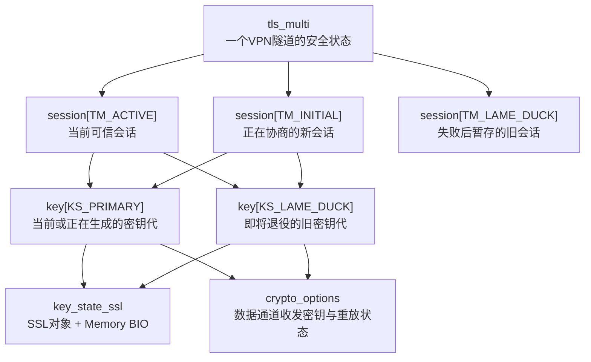
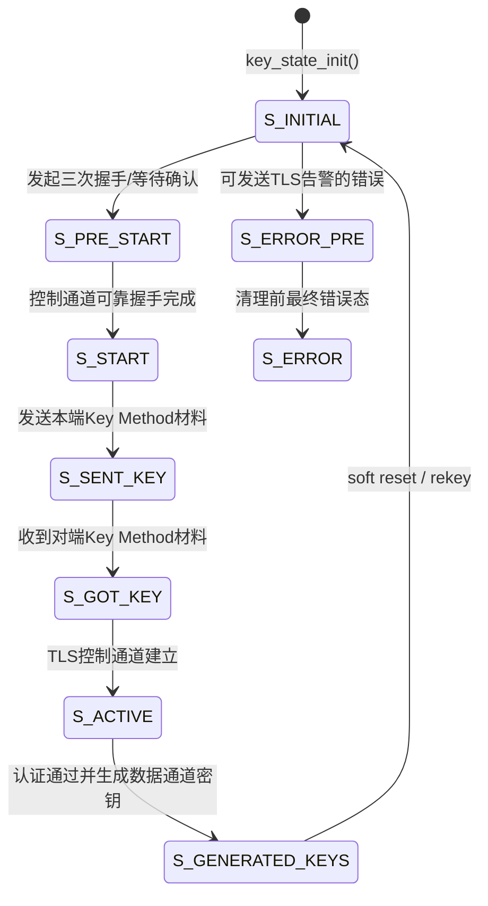
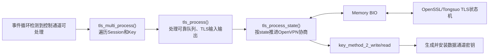
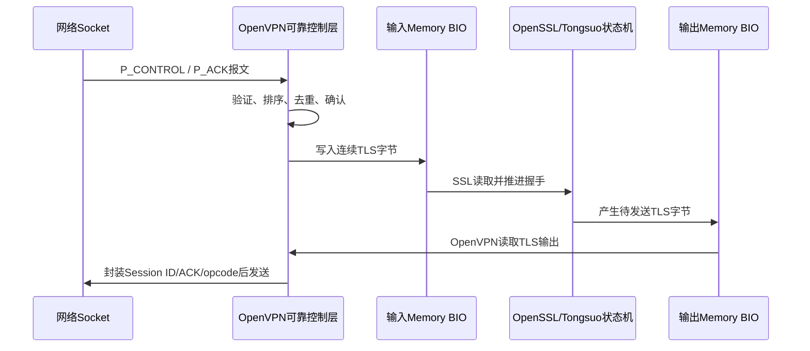
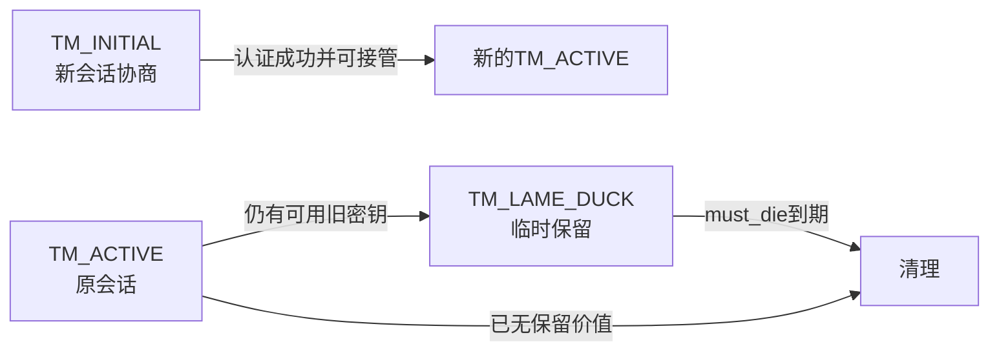

## 1. 这篇文档解决什么问题

OpenVPN 的 TLS 控制通道不是“执行一次 `SSL_connect()`，成功后就永远不变”。一个长期运行的 VPN 隧道需要同时处理初次握手、可靠传输、用户认证、数据密钥生成、定期换钥、旧密钥过渡和失败恢复。为此，OpenVPN 在 TLS 库的 `SSL` 对象外又建立了自己的状态层。

本文基于 OpenVPN 2.7.4 上游源码，回答四个核心问题：

1. `tls_multi`、`tls_session`、`key_state` 各自代表什么，为什么需要三层对象；
2. 一个控制通道报文如何推动 `key_state.state` 变化；
3. 初次握手、软重置和硬重置分别会替换哪些对象；
4. 为什么重协商时旧数据密钥仍能暂时收包，DCO 又如何参与这一生命周期。

本文只解释上游机制。TLCP 改造需要替换或扩展 TLS 后端，但不能破坏本文所述的 OpenVPN 会话、可靠层和数据密钥生命周期。

## 2. 先建立三层对象模型

把一个客户端到服务端的 VPN 隧道想成一个“长期合同”：

- `tls_multi` 是整份长期合同，存放隧道级身份和多个会话；
- `tls_session` 是一次控制通道会话，可因硬重置而被替换；
- `key_state` 是某一代安全参数，包含一个 TLS 状态和一组数据通道密钥。



源码锚点：

| 对象 | 定义位置 | 直接职责 |
| --- | --- | --- |
| `struct tls_multi` | `src/openvpn/ssl_common.h:611` | 一个隧道的 TLS、身份认证和多代密钥总状态 |
| `struct tls_session` | `src/openvpn/ssl_common.h:489` | 一个控制通道会话，保存 Session ID、证书结果和两代 `key_state` |
| `struct key_state` | `src/openvpn/ssl_common.h:207` | 一代 TLS 与数据通道安全参数，包含可靠队列、BIO、数据密钥和认证状态 |
| `struct key_state_ssl` | 由 TLS 后端定义，OpenSSL 实现在 `ssl_openssl.c` | 包装 `SSL *` 与输入/输出 Memory BIO |
| `struct crypto_options` | `crypto.h`，作为 `key_state` 字段 | 数据通道密码上下文、packet-id 与重放保护 |

### 2.1 为什么不能只保留一个 SSL 对象

VPN 连接需要在不中断业务流量的情况下换钥。新一代 TLS/数据密钥协商尚未完成时，老密钥仍要负责已有流量；新密钥可用后，新发包切换过去，但网络中迟到的旧包仍可能需要老密钥解密。因此 OpenVPN 必须短时间同时保存新旧两代状态。

这不是代码冗余，而是“连续服务”和“密钥轮换”之间的结构性要求。

## 3. 两套索引不要混淆

OpenVPN 同时维护 Session 级槽位和 Key 级槽位。

### 3.1 `tls_multi.session[]`：控制通道会话槽位

`ssl_common.h:545-550` 定义：

| 索引 | 含义 | 典型用途 |
| --- | --- | --- |
| `TM_ACTIVE` | 当前已认证会话 | 正常收发控制消息和数据包 |
| `TM_INITIAL` | 尚未信任、正在协商的会话 | 接受新的硬重置或连接尝试 |
| `TM_LAME_DUCK` | 已退场但仍暂存的旧会话 | 新会话失败时保留尚可用的旧数据密钥 |

### 3.2 `tls_session.key[]`：密钥代槽位

`ssl_common.h:465-470` 定义：

| 索引 | 含义 | 典型用途 |
| --- | --- | --- |
| `KS_PRIMARY` | 当前主密钥代 | 初次协商或新一轮重协商 |
| `KS_LAME_DUCK` | 即将退役的旧密钥代 | 接受在途旧包，随后过期销毁 |

### 3.3 三个 Session × 两代 Key 不等于六条永久连接

这些是容纳状态迁移的槽位，不是六条并行的 VPN。绝大多数时间只有当前会话和当前密钥活跃。其他槽位用于协商中或过渡期。

`KEY_SCAN_SIZE` 为 3（`ssl_common.h:567`），意味着收包选钥时最多扫描三份候选密钥：当前 Active 的主密钥、它的旧密钥，以及特殊失败场景下独立保存的 Lame Duck 会话密钥。其目的仍是不中断重协商期间的数据通道。

## 4. 一代 `key_state` 内部到底有什么

`struct key_state` 不是单纯的“密钥结构体”。它把一代协商所需的控制面和数据面状态绑在一起：

| 字段组 | 代表什么 | 后续去向 |
| --- | --- | --- |
| `state` | OpenVPN 自己的控制通道协商阶段 | 被 `tls_process_state()` 读取和推进 |
| `key_id`、`peer_id` | 数据包选钥所需标识 | 编入或匹配 P_DATA 头部 |
| `ks_ssl` | TLS 状态与 Memory BIO | 由 `ssl_openssl.c` 驱动 Tongsuo/OpenSSL |
| `crypto_options` | 数据通道收发密码上下文 | 交给 `openvpn_encrypt()` / `openvpn_decrypt()` |
| `key_src` | Key Method 2 的双方随机材料 | 派生数据通道密钥后释放或清理 |
| `send_reliable` / `rec_reliable` | 控制报文重传、排序 | 衔接不可靠 UDP 与 TLS 字节流 |
| `rec_ack` / `lru_acks` | 控制报文确认状态 | 生成 ACK、抑制重复包 |
| `authenticated` | TLS、账号和异步认证综合结果 | 决定能否进入完整可用状态 |
| `dco_status` | 本代密钥是否已下沉 DCO | 控制安装、切换、删除 |

这张表揭示一个重要事实：TLS 握手成功只说明 `ks_ssl` 中的协议层已完成，不能单独证明用户认证、数据密钥生成、DCO 安装和业务转发全部完成。

## 5. `key_state.state` 如何变化

状态常量位于 `ssl_common.h:80-107`。客户端的主路径可以概括为：



服务端的 `S_SENT_KEY` 和 `S_GOT_KEY` 次序相反，因为服务端通常先收到客户端随机材料，再生成并发送自己的部分。

### 5.1 状态推进函数

核心函数是 `tls_process_state()`（`ssl.c:2735`）。它不是重新实现 TLS，而是处理 OpenVPN 包裹在 TLS 外层的协议阶段：

1. 根据当前 `key_state.state` 确定应读还是应写；
2. 从可靠层取有序控制数据，写入 TLS Memory BIO；
3. 调用 TLS 后端推进握手或读写受保护的 Key Method 消息；
4. 通过 `key_method_2_write()` / `key_method_2_read()` 交换 OpenVPN 数据密钥材料和选项；
5. 条件满足后调用密钥生成路径，初始化 `crypto_options`；
6. 把状态推进到 `S_ACTIVE` 或 `S_GENERATED_KEYS`；
7. 发现超时、协议错误或认证失败时进入错误处理。

外围调用关系为：



源码锚点：`tls_multi_process()` 在 `ssl.c:3206`，`tls_process()` 在 `ssl.c:3009`，`tls_process_state()` 在 `ssl.c:2735`。

## 6. Memory BIO 为什么是理解控制通道的关键

普通 HTTPS 让 TLS 库直接读写 TCP Socket。OpenVPN 不能这样做，因为它还要在 TLS 数据外增加自己的 opcode、Session ID、ACK、重传和 UDP 承载。

所以 `key_state_ssl_init()`（`ssl_openssl.c:2218`）为每个 `key_state` 创建 `SSL` 与 Memory BIO：



因此：

- TLS/TLCP 状态机负责握手密码学与记录保护；
- OpenVPN 负责控制报文分片、可靠传输、会话标识和数据密钥协商；
- 将 OpenSSL 换成 Tongsuo，不等于 OpenVPN 外层状态自动消失；
- TLCP 在 Memory BIO 场景下是否能正确识别和推进，必须由真实握手验证，不能只看链接成功。

## 7. 从 TLS 完成到数据密钥可用

`S_ACTIVE` 与 `S_GENERATED_KEYS` 的区别很重要：

- `S_ACTIVE`：控制通道协议已经可运行，但延期认证或客户端连接脚本仍可能未完成；
- `S_GENERATED_KEYS`：数据通道密钥已生成，且本代状态通过了完整认证条件。

数据密钥路径见：

```text
key_method_2_write()/key_method_2_read()
    -> 收集双方密钥材料和NCP结果
    -> 旧式PRF或TLS Exporter派生key2
    -> init_key_contexts()                  ssl.c:1377
    -> crypto_options.key_ctx_bi
    -> 用户态crypto.c，或dco_install_key()
```

`key_method_2_write()` 位于 `ssl.c:2059`，`key_method_2_read()` 位于 `ssl.c:2214`。TLS 1.3 不能简单套用旧式 TLS PRF，所以支持路径会使用 TLS Exporter；OpenSSL 后端导出函数位于 `ssl_openssl.c:159` 附近。

判断“连接成功”时至少要区分：

1. TLS 握手是否完成；
2. 对端证书和用户身份是否通过；
3. 数据 cipher 是否协商完成；
4. 数据密钥是否生成并安装；
5. 业务包是否确实使用这一代密钥往返。

## 8. 软重置：换数据密钥而不重建整个隧道

软重置用于重协商。触发因素可能是时间、包数、字节数或显式控制条件。核心入口为 `key_state_soft_reset()`（`ssl.c:1757`）。

它的设计目标是：

```text
保留tls_session身份和隧道级状态
    -> 将当前主key_state转为过渡/旧密钥
    -> 初始化新的KS_PRIMARY
    -> 重新执行TLS/Key Method协商
    -> 新密钥可用后切换发包
    -> 旧密钥保留短暂收包窗口
    -> 到期清理旧密钥
```

`key_id` 在每次软重置时递增，并编码进数据包头。收包端用它选择对应 `key_state`，因此新旧两代包在过渡期可以被区分。

### 8.1 为什么旧密钥不能立即删除

UDP 不保证顺序，网络中可能仍有使用旧密钥加密的包。如果切换瞬间删除老密钥，这些合法在途包会全部被丢弃。保留 `KS_LAME_DUCK` 是对这种现实网络行为的适配。

### 8.2 安全边界

保留旧密钥不等于无限期接受旧包。旧状态由 `must_die`、重放窗口和 Key ID 共同约束。超时后必须销毁，否则会扩大攻击窗口。

## 9. 硬重置：替换控制通道会话

硬重置比软重置更彻底。它用于建立新 Session 或重置已有控制会话。相关函数：

- `tls_session_init()`：`ssl.c:984`；
- `move_session()`：`ssl.c:1084`；
- `reset_session()`：`ssl.c:1107`；
- `tls_multi_init()`：`ssl.c:1162`；
- `tls_multi_init_finalize()`：`ssl.c:1177`。

状态迁移的核心不是“删除再新建”这么简单，而是把已经可信的 Active、正在协商的 Initial 和必要时保留的 Lame Duck 安排到正确槽位。

`tls_multi_process()` 在新会话达到可接管条件时，会调用 `move_session()` 完成槽位迁移；源码中的关键调用可在 `ssl.c:3284` 和 `ssl.c:3358` 附近看到。



## 10. 隧道级 `multi_status` 不是 TLS 状态

`enum multi_status` 位于 `ssl_common.h:579-595`。它描述的是连接在认证和配置导入流程中的位置：

| 状态 | 含义 |
| --- | --- |
| `CAS_NOT_CONNECTED` | 尚未建立第一个可用 TLS 会话 |
| `CAS_WAITING_AUTH` | TLS 已建立，但异步认证尚未完成 |
| `CAS_PENDING` | 正在执行连接脚本、插件或客户端专属配置导入 |
| `CAS_PENDING_DEFERRED*` | 等待异步配置导入处理器 |
| `CAS_WAITING_OPTIONS_IMPORT` | 客户端等待服务端 PUSH 选项等导入 |
| `CAS_RECONNECT_PENDING` | 已连接会话重新连接时等待重新初始化 |
| `CAS_CONNECT_DONE` | 连接级初始化完成 |
| `CAS_FAILED` | 认证或配置导入失败 |

这里可以看到三种不同的“状态”：

- TLS 库内部握手状态：由 OpenSSL/Tongsuo 管；
- `key_state.state`：由 OpenVPN 控制通道协议管；
- `tls_multi.multi_state`：由完整 VPN 连接认证与选项导入流程管。

日志中的某一句 “TLS established” 只覆盖第一层或第二层的一部分，不能替代三层状态的闭环判断。

## 11. 数据包进入时如何找到正确密钥

收到网络包后：

```text
process_incoming_link()
    -> tls_pre_decrypt()                    ssl.c:3565
       -> 判断opcode是控制包还是P_DATA
       -> handle_data_channel_packet()      ssl.c:3465
          -> 根据Session/Peer/Key ID扫描候选key_state
          -> 将匹配的crypto_options交给openvpn_decrypt()
```

发包时：

```text
process_incoming_tun()
    -> encrypt_sign()
       -> tls_pre_encrypt()                 ssl.c:3944
          -> tls_select_encryption_key()    ssl.c:3917
       -> openvpn_encrypt()
       -> tls_prepend_opcode_v1/v2()        ssl.c:3976/3990
```

这解释了为什么 `key_state` 同时持有 TLS 和数据通道状态：控制通道建立本代密钥，数据通道随后按照 Key ID 选择并使用它。

## 12. DCO 如何接入生命周期

启用 DCO 后，用户态仍负责 TLS、认证、NCP 和密钥派生，但数据密钥需要被安装到内核数据通道：

```text
init_key_contexts()
    -> dco_install_key()                    dco.c:54
       -> init_key_dco_bi()                 dco.c:87
       -> 平台DCO接口/Netlink
    -> dco_update_keys()                    dco.c:130
       -> 主/次密钥槽切换与旧密钥删除
```

因此 DCO 模式下审查重协商，不能只看用户态 `key_state`：还要确认新密钥成功下发、主次槽切换正确、老密钥按时删除。否则可能出现“控制面显示换钥成功，数据面仍使用旧密钥”或直接断流。

## 13. TLCP/国密改造应守住哪些边界

将 TLS 后端替换为 Tongsuo/TLCP 时，真正需要改造的主要是：

- TLS 根上下文采用哪种 method；
- 单证书还是签名/加密双证书；
- 密码套件、曲线和 Provider/Engine 选择；
- `key_state_ssl_init()` 创建的单连接对象如何启用 TLCP；
- Memory BIO 驱动下 TLCP 状态机能否正确自动识别；
- 握手完成后 Exporter 或其他数据密钥派生语义是否可用。

不应随意改写：

- `tls_multi` / `tls_session` / `key_state` 的职责；
- OpenVPN 的可靠控制层；
- Key Method、NCP、Key ID 与新旧密钥轮换逻辑；
- 用户态和 DCO 的数据密钥安装边界。

如果 Tongsuo 已完整提供 TLCP 状态机，OpenVPN 一般不需要重写 TLCP 报文状态机；但仍需完成 API 接入、配置表达、双证书装载、BIO 兼容、错误处理和端到端验证。

## 14. 如何用日志、抓包和源码证明生命周期成立

| 要证明的结论 | 建议证据 | 不能单独作为证明的内容 |
| --- | --- | --- |
| TLS/TLCP 握手成功 | 双方日志 + PCAP握手字段 + 运行时库身份 | 仅配置写了TLCP |
| 认证完整通过 | 证书验证结果、认证插件/账号结果、`multi_state` 后续行为 | 仅出现TLS established |
| 数据密钥生成 | NCP选择、Key Method完成、密钥安装日志/断点 | 仅TLS cipher名称 |
| 重协商不中断 | 触发rekey后的连续业务流量、Key ID变化、双方日志 | 第一次连接成功 |
| DCO换钥正确 | 用户态安装请求、内核/DCO状态、持续收发与旧钥删除 | DCO模块加载成功 |
| 旧密钥被淘汰 | 超时后旧Key ID包被拒绝的负面测试 | 代码中有删除函数 |

### 14.1 代表性负面测试

1. 将服务端与客户端可接受数据 cipher 配置为无交集，确认 NCP 失败而不是静默回退；
2. 让 TLCP 双证书中的签名证书和加密证书对调，确认握手失败并给出明确原因；
3. 缩短 renegotiation 周期，持续发送 ping 或业务流，确认 Key ID 变化但隧道不断；
4. 重放旧数据包，确认 packet-id/replay 逻辑拒绝；
5. DCO 模式下故意让密钥安装失败，确认不会报告假连接成功或偷偷走错误路径。

## 15. 建议的源码阅读顺序

不要从 `ssl.c` 第一行顺读。按对象生命周期阅读：

1. `ssl_common.h:80-107`：先记住 `key_state.state`；
2. `ssl_common.h:207`：读 `struct key_state` 字段；
3. `ssl_common.h:465-633`：读两层槽位和 `tls_multi`；
4. `ssl.c:821`：看 `key_state_init()` 如何建立一代状态；
5. `ssl.c:984-1183`：看 Session 与 Multi 如何建立；
6. `ssl.c:2735`：看状态如何被推进；
7. `ssl.c:3206`：看多个 Session/Key 如何被调度和迁移；
8. `ssl.c:3465-3999`：看数据包如何按 Key ID 选钥；
9. `dco.c:54-150`：看用户态密钥如何交给 DCO。

每读一个函数，只回答四个问题：输入对象是谁、修改了哪些字段、下一个消费者是谁、失败后进入什么状态。这样不会陷入局部语句。

## 16. 掌握检查

能回答以下问题，才算真正理解本专题：

1. 为什么一个 `tls_multi` 里需要三个 `tls_session` 槽位？
2. `TM_LAME_DUCK` 与 `KS_LAME_DUCK` 有什么层级差异？
3. TLS 握手完成为何不等于 `S_GENERATED_KEYS`？
4. Memory BIO 在 OpenVPN 控制通道中解决了什么问题？
5. 重协商时旧密钥为什么要保留，怎样限制其有效期？
6. 收到 P_DATA 包时，OpenVPN如何找到正确的数据密钥？
7. DCO启用后，控制通道和数据通道的职责怎样重新分配？
8. TLCP改造哪些位置必须变化，哪些OpenVPN上层机制应保持不变？

## 17. 关联文档

- [OpenVPN 全链路数据流与模块协作图解](OpenVPN%20全链路数据流与模块协作图解.md)
- [OpenVPN 从系统到函数：TLS、Key State 与双通道分层定位图](OpenVPN%20从系统到函数：TLS、Key%20State%20与双通道分层定位图.md)
- [OpenVPN 六链源码精读 02 控制报文到TLS状态机](OpenVPN%20六链源码精读%2002%20控制报文到TLS状态机.md)
- [OpenVPN 六链源码精读 03 TLS握手到数据通道密钥](OpenVPN%20六链源码精读%2003%20TLS握手到数据通道密钥.md)
- [OpenVPN 数据通道包格式、密钥轮换与DCO源码精读附录](OpenVPN%20数据通道包格式、密钥轮换与DCO源码精读附录.md)
