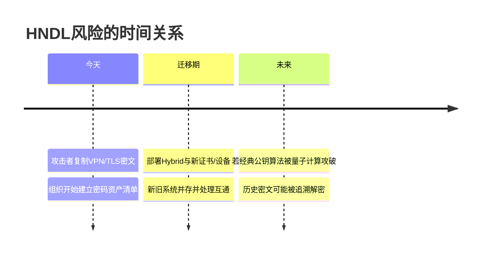
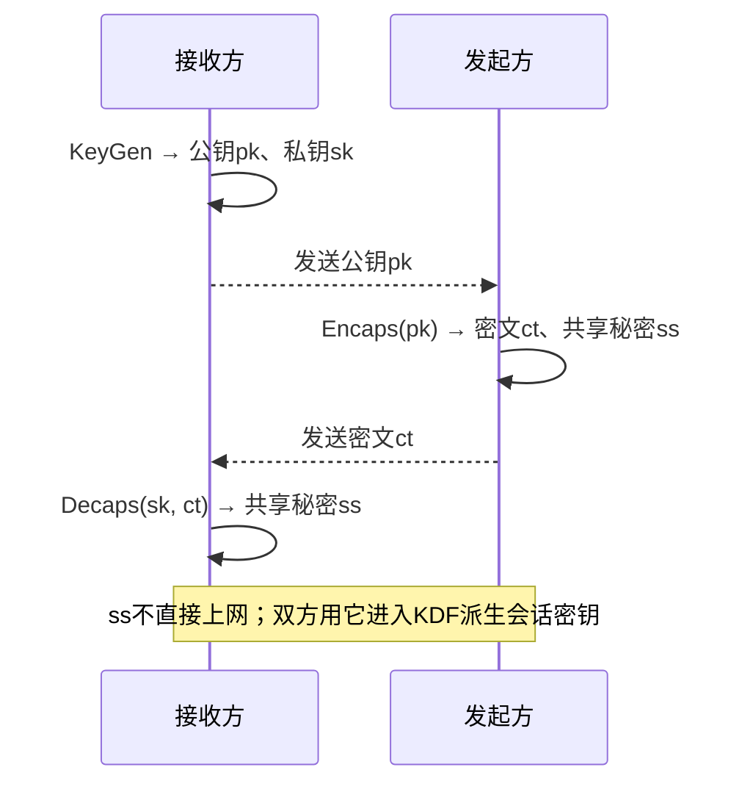
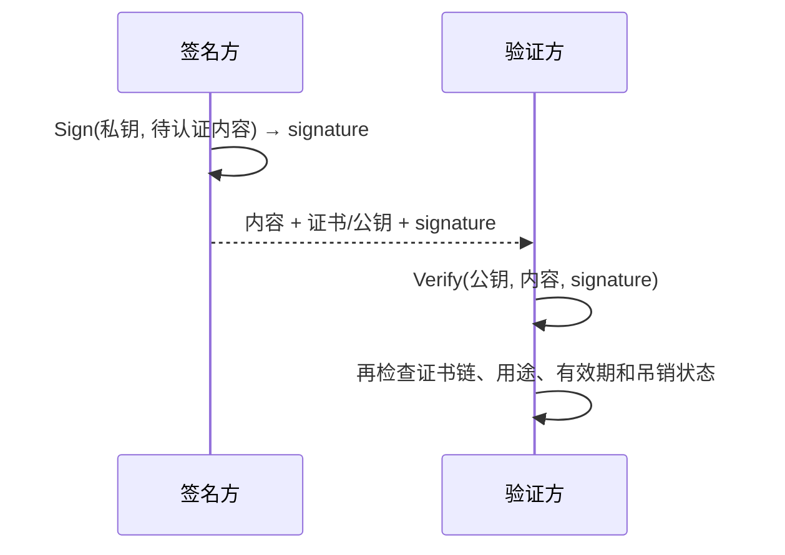
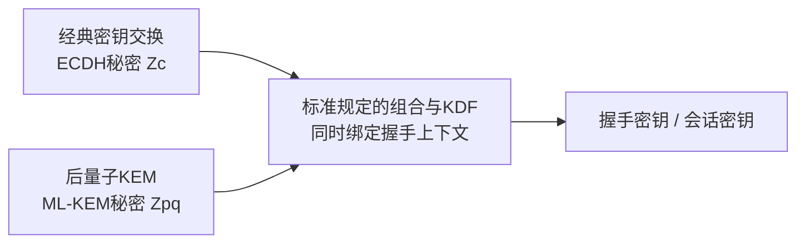
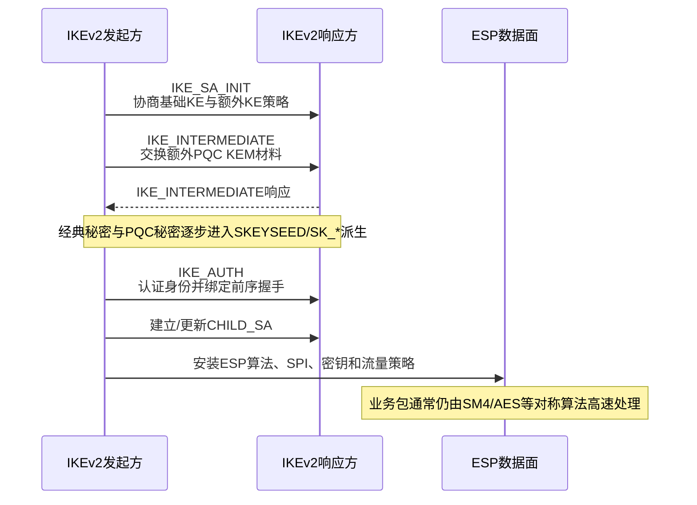
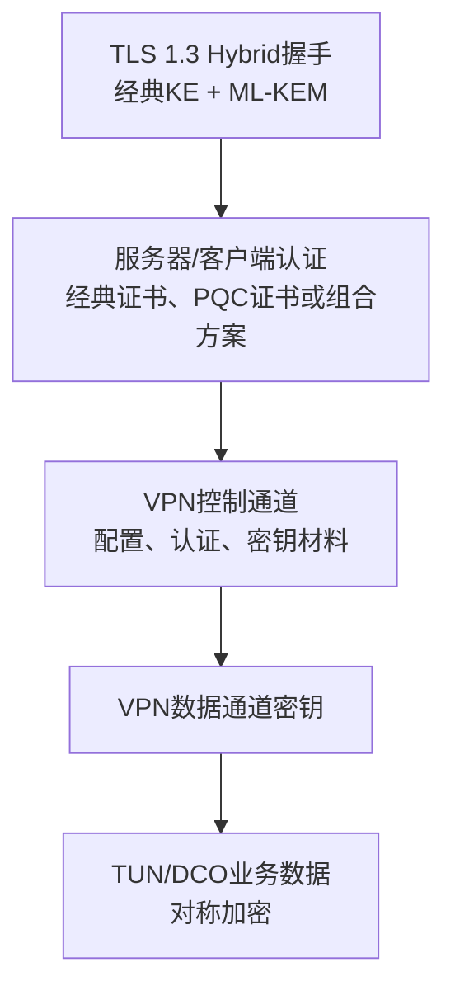
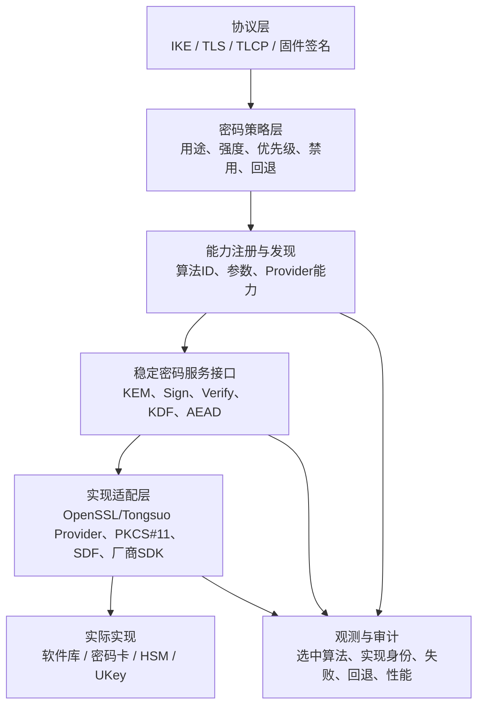
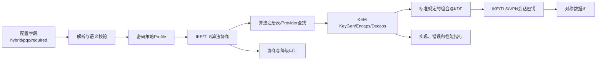
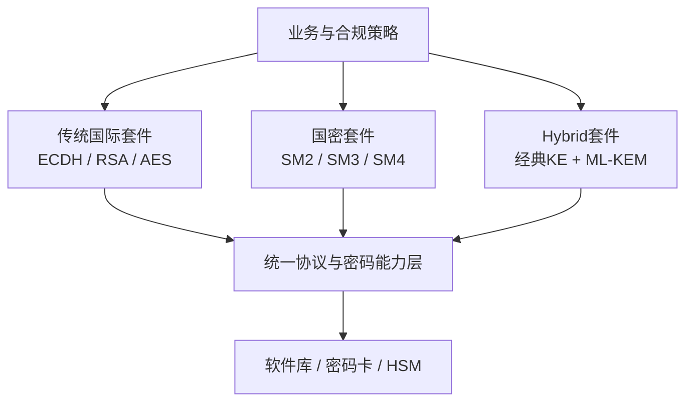

> 本文从零解释后量子密码（PQC）的目标、KEM 与签名的工作方式、Hybrid 的必要性，以及它们怎样进入 IPsec、SSL VPN 和综合安全网关。本文给出目标架构和验证方法，不代表采购产品已经具备相应能力；实际接口、版本和协议扩展必须以交付源码、标准状态和互通测试为准。

## 1. 先给出六个结论

1. **后量子密码不是量子通信**：它仍然运行在普通 CPU、操作系统和网络上，只是采用目前认为可抵抗量子攻击的数学问题。
2. **量子威胁主要冲击现有公钥密码**：足够强的量子计算机会威胁 RSA、DH、ECDH、ECDSA 和 SM2；SM3、SM4、AES 等对称/哈希算法受到的影响不同，通常通过足够密钥长度和安全参数应对。
3. **PQC 不直接替代 VPN 数据面的所有加密**：ML-KEM 主要建立共享秘密，ML-DSA/SLH-DSA 主要做签名；大量业务数据仍通常使用对称算法加密。
4. **当前迁移优先使用 Hybrid**：把经典 ECDH/DH 与 PQC KEM 的秘密组合后进入 KDF，只要组合设计正确且至少一个分量安全，最终会话密钥就仍有保护。
5. **密码敏捷比“接入一个算法”更重要**：产品必须能发现、选择、替换、禁用算法和实现，并控制回退、版本、密钥边界和观测证据。
6. **协议、库、设备和产品是四层不同工作**：库中有 ML-KEM，不代表 IKE/TLS 已协商；协商成功不代表认证已 PQ 化；握手 PQ 化也不代表数据面进入密码卡。

## 2. 为什么量子计算会改变公钥密码

### 2.1 经典密码依赖“正向容易、逆向困难”

公钥密码通常依赖某类在经典计算机上难以求解的问题：

| 现有体系 | 依赖的困难问题 | 典型用途 |
| --- | --- | --- |
| RSA | 大整数分解 | 加密、签名 |
| DH / ECDH | 离散对数问题 | 密钥交换 |
| ECDSA / SM2 | 椭圆曲线离散对数问题 | 签名、密钥交换 |

应用并不是直接把所有业务数据都交给这些慢速公钥算法。更常见的流程是：先通过公钥密码建立或保护一个短小的共享秘密，再派生出高速对称密钥处理大量数据。

### 2.2 Shor 与 Grover 的影响不同

- **Shor 算法**：在足够强、可纠错的量子计算机上，可高效处理整数分解和离散对数，因此直接威胁 RSA、DH/ECDH、ECDSA、SM2 等公钥体系。
- **Grover 算法**：对穷举搜索提供平方级加速。它不会像 Shor 那样直接摧毁对称密码，但会降低暴力搜索的安全裕度，因此需要足够的密钥长度和参数。

正确理解不是“量子计算会破解一切”，而是：

```text
现有公钥密码面临结构性迁移
对称密码与哈希需要重新评估安全参数
协议、证书、设备、软件和运维必须一起迁移
```

### 2.3 为什么现在就要处理

攻击者可以今天保存高价值加密流量，未来获得能力后再解密，这称为 **Harvest Now, Decrypt Later（先收集、后解密，HNDL）**。如果数据需要保密十年以上，而系统迁移又需要多年，就不能等量子计算机真正出现才开始。



## 3. 后量子密码的两类核心工具

### 3.1 KEM：建立共享秘密

**KEM（Key Encapsulation Mechanism，密钥封装机制）**不是直接加密任意长文件，而是在双方之间建立一段共享秘密。

以 ML-KEM 为例，用三个动作理解：

1. `KeyGen`：接收方生成公钥 `pk` 和私钥 `sk`；
2. `Encaps(pk)`：发送方使用公钥产生密文 `ct` 和共享秘密 `ss`；
3. `Decaps(sk, ct)`：接收方使用私钥从密文恢复出同一个 `ss`。



这里最重要的区别是：

| 概念 | 双方各自做什么 | 网络上传什么 |
| --- | --- | --- |
| 经典 DH/ECDH | 双方都生成临时密钥并计算共享秘密 | 双方的公钥/Key Share |
| KEM | 一方发布公钥，另一方封装，持私钥方解封装 | KEM 公钥和密文 |
| 普通公钥加密 | 用公钥加密一段应用明文 | 被加密的应用明文 |

KEM 的失败行为也属于安全设计。解封装失败不能随意泄露“哪一位不对”等可被利用的细节；实现还需要考虑随机数、常数时间、密钥清零和错误传播。

### 3.2 数字签名：证明身份和完整性

数字签名解决的是“这段内容确实由持有私钥的人签发，并且没有被修改”，不是隐藏内容。



NIST 已正式发布：

| 标准 | 算法 | 作用 | 当前正确定位 |
| --- | --- | --- | --- |
| FIPS 203 | ML-KEM | 密钥建立/KEM | PQC 密钥建立的主要标准 |
| FIPS 204 | ML-DSA | 数字签名 | 通用 PQC 签名主选项之一 |
| FIPS 205 | SLH-DSA | 基于哈希的无状态签名 | 数学基础不同，签名较大，提供多样性 |

截至本文更新日，FALCON 对应的 FIPS 206 仍在制定过程中；HQC 已被 NIST 选中作为额外 KEM 方向，但“被选中”不等于已经成为最终 FIPS。产品能力表必须区分已发布标准、草案、实验算法和私有算法编号。

### 3.3 名字背后是不同的数学家族

初学阶段不需要推导格密码公式，但要知道算法来自不同困难问题，因为这关系到“多样性”和备选方案：

| 家族 | 直观理解 | 代表方向 | 工程特点 |
| --- | --- | --- | --- |
| 基于格 | 在高维、带噪声的结构中解决困难问题 | ML-KEM、ML-DSA | 当前标准化和部署主线，公钥/密文比ECC大 |
| 基于哈希 | 主要依靠哈希函数构造签名 | SLH-DSA | 依赖假设较朴素，但签名和性能权衡明显 |
| 基于编码 | 从带错误的编码问题恢复信息很困难 | HQC | NIST选作ML-KEM的不同数学基础备选，最终标准仍需跟踪 |
| 其他研究方向 | 多变量、同源等不同数学问题 | 多种候选/历史方案 | 有的仍在研究，有的曾被攻破，不能看到“PQC”标签就默认成熟 |

`ML` 表示 Module-Lattice（模格）。`ML-KEM-512/768/1024` 中的数字是参数集名称和安全等级标识的一部分，不是“直接用512/768/1024位密钥加密业务数据”。PQC 的公钥、密文和签名通常达到 KB 级，而 X25519 Key Share 只有几十字节，因此握手报文、MTU、分片、内存和建链性能都是网关必须测试的工程问题。

## 4. Hybrid为什么是迁移主线

PQC 算法相对较新，经典算法部署广、研究时间长。Hybrid 的目的不是把两个算法名字写在一起，而是让最终密钥**同时依赖两份独立秘密**。



不能自行发明 `Zc || Zpq`、异或或哈希顺序，然后宣称“Hybrid”。组合方式必须来自所用协议规范，并满足：

- 两端使用完全相同的算法标识、编码和组合规则；
- 协商结果受到完整性保护，防止降级；
- 任何一个分量失败时不能静默使用不符合策略的较弱模式；
- 重协商、恢复、0-RTT、会话票据和 rekey 仍保持预期安全属性；
- 日志能说明选择了什么，但不能泄露共享秘密和会话密钥。

## 5. PQC进入VPN后，究竟改变了哪一段

### 5.1 IPsec/IKEv2：改变密钥建立，不替代ESP逐包加密

典型链路：



标准边界要看清：

- [RFC 9242](https://www.rfc-editor.org/info/rfc9242/) 定义 `IKE_INTERMEDIATE`，为认证前增加受保护的中间交换；
- [RFC 9370](https://www.rfc-editor.org/info/rfc9370/) 定义 IKEv2 多重密钥交换框架和额外 KE 的组合过程；
- 具体怎样把 ML-KEM 映射到 IKEv2、使用哪些 Transform ID 和编码，需要继续跟踪相应 IETF 规范及实现版本；
- [RFC 8784](https://www.rfc-editor.org/info/rfc8784/) 使用离线分发的 Post-quantum Preshared Key（PPK）增强 IKEv2，是一种迁移方案，但密钥分发和轮换压力不能忽略。

PQC IKEv2 与某些国密 IPsec 规范采用的 IKEv1 路线是两个不同维度。不能因为已有国密实现使用 IKEv1，就把 IKEv2 的 PQC 扩展硬塞入 IKEv1；也不能因为 IKEv2 支持 Hybrid，就自动宣称符合特定国密 VPN 规范。

### 5.2 TLS与SSL VPN：先区分控制通道和数据通道

TLS 1.3 的 Hybrid 密钥交换可组合 X25519/ECDH 与 ML-KEM。对 SSL VPN 产品，还要追问数据通道密钥怎样产生：



必须分开证明：

1. TLS 是否真的协商了 Hybrid Key Share；
2. 身份认证是否仍只依赖 RSA/ECDSA/SM2；
3. VPN 数据通道密钥是通过控制通道安全传输、由 Exporter 派生，还是由自有协议生成；
4. 数据通道实际采用什么对称算法；
5. 会话恢复、重连、rekey 是否继承 PQC 保护；
6. 客户端、网关、密码库和硬件是否支持相同参数和编码。

“TLS 使用了 ML-KEM”是重要进展，但不等于整个 SSL VPN 的认证、数据通道和证书体系已经全面后量子化。

## 6. 综合安全网关中需要PQC保护的资产

PQC 接入不应只盯着一条 VPN 隧道。综合安全网关至少包含以下密码使用点：

| 位置 | 当前常见密码用途 | PQC迁移问题 |
| --- | --- | --- |
| IPsec/IKE | KE、身份签名、CHILD_SA派生 | Hybrid KE、PQC认证、rekey、互通、报文放大 |
| SSL VPN/TLS | TLS Key Share、证书签名、数据密钥保护 | Hybrid TLS、证书链、客户端兼容、控制/数据通道边界 |
| Web管理面 | HTTPS、管理员证书 | 浏览器支持、管理客户端升级、不能先破坏可管理性 |
| API与组件通信 | mTLS、Token签名 | 服务间证书、轮换和灰度升级 |
| 软件升级 | 固件/软件包签名 | 引导链是否识别PQC签名，旧版本如何过渡 |
| 配置备份 | 备份加密和签名 | 长期保密数据优先迁移，恢复端必须兼容 |
| 审计日志 | 日志签名、时间戳 | 长期验证、签名体积、归档格式 |
| CA/PKI | 证书签发、吊销和信任锚 | PQC证书、双证书/组合证书、HSM能力和生命周期 |
| HA状态同步 | SA、Session、策略和密钥状态 | 节点间通道、瞬时密钥复制边界、混合版本兼容 |

这就是为什么“密码资产盘点”必须先于大规模接入。系统里不知道的密码依赖，未来就无法可靠替换。

## 7. 密码敏捷到底是什么

NIST 将密码敏捷描述为：系统能够在不破坏运行连续性的前提下替换和调整协议、应用、软件、硬件或基础设施中的密码算法，以获得韧性。

它至少包含八种能力：

1. **资产可发现**：知道哪些组件、协议、证书、密钥和设备在使用哪些算法；
2. **接口可替换**：协议主体不直接绑定某一密码库或厂商 SDK；
3. **能力可发现**：运行时知道软件/硬件支持哪些算法、参数和操作；
4. **策略可表达**：能够配置允许、首选、禁止、截止日期和兼容例外；
5. **协商可保护**：对端选择受到完整性保护，并能阻止不允许的降级；
6. **密钥可治理**：密钥有类型、用途、句柄、来源、生命周期和销毁规则；
7. **迁移可观测**：能统计实际协商结果，而不是只看配置；
8. **变更可回归**：升级、回滚、混合版本、故障和互通都有测试矩阵。

### 7.1 一个适合网关的目标分层



协议层应该提出“我要执行 ML-KEM-768 解封装”或“用某个不可导出密钥句柄签名”，而不是直接调用某厂商 `Vendor_Sign()`。否则换密码卡、换 Provider 或增加 PQC 时，会在 IKE、SSL VPN、CA 和管理面重复修改。

### 7.2 敏捷不等于无限开放

支持越多算法并不一定越安全。算法太多会扩大代码、配置和测试面，也会让弱算法长期无法清理。正确做法是：

```text
少量经过批准的配置档（Profile）
→ 明确首选和最低强度
→ 有截止日期的兼容例外
→ 默认禁止静默降级
→ 用运行数据推动旧算法退出
```

## 8. 从源码角度怎样落地

在尚未拿到产品源码前，以下只能作为目标检查链：



源码到货后应逐项建立：

| 要回答的问题 | 应找到的代码或证据 |
| --- | --- |
| 算法名字从哪里进入系统 | 配置 schema、解析函数、默认值、错误信息 |
| 协议怎样携带算法标识 | IKE Transform / TLS Named Group 编解码与注册表 |
| KEM由谁创建和调用 | Provider/插件/密码抽象接口、具体实现和运行库 |
| 两份秘密怎样组合 | 协议状态机、KDF函数、上下文绑定和测试向量 |
| 失败后发生什么 | 必选/可选策略、错误路径、是否回退、告警 |
| 数据密钥到哪里 | SA/Session结构、内核/用户态/硬件下发接口 |
| 运行时怎样证明 | 双方日志、PCAP字段、二进制/库身份、正负测试 |

## 9. 推荐的分阶段接入路线

### 阶段0：建立密码资产与能力清单

- 盘点所有 RSA、ECC、SM2、DH/ECDH、证书、SSH、TLS、IKE 和代码签名依赖；
- 标出长期保密数据、外部互通对象、不可升级终端和认证合规约束；
- 为软件库、协议栈、客户端、密码设备建立版本矩阵。

完成标志：能回答“哪个资产为什么需要迁移、由谁调用、何时失效”。

### 阶段1：建立统一密码能力层

- 稳定算法注册、Provider/设备适配和密钥句柄模型；
- 定义明确错误语义：不支持、参数错误、设备离线、策略拒绝、运算失败；
- 建立 Known Answer Test、互通测试和性能基线。

完成标志：同一测试用例可切换软件实现与设备实现，协议主体不改。

### 阶段2：先做Hybrid密钥建立

- 选择标准化程度和生态兼容性较高的 ML-KEM 参数；
- 在实验环境接入 TLS 1.3 Hybrid 或 IKEv2 Additional KE；
- 默认不把“可选回退”当作安全完成，策略必须记录实际结果。

完成标志：双方真实协商、KDF依赖两份秘密、降级负面测试通过、rekey可用。

### 阶段3：迁移认证与PKI

- 评估 ML-DSA/SLH-DSA 证书、签名体积、HSM/密码卡能力和 CA 生命周期；
- 设计经典与 PQC 身份并存期间的信任和升级策略；
- 覆盖 VPN、管理面、组件 mTLS 和软件升级签名。

完成标志：不仅会生成证书，还能完成签发、验证、吊销、轮换、回滚和审计。

### 阶段4：产品化与规模验证

- 测量握手 CPU、内存、报文体积、分片、建链速率、并发和 P99；
- 测试 DoS、畸形密文、重复报文、设备故障、HA、混合版本；
- 建立算法退出机制和远程升级策略。

完成标志：功能、安全、性能、运维和合规形成闭环，而不是只通过单次握手。

## 10. 如何证明“PQC真的生效”

| 层次 | 正向证据 | 负面测试 |
| --- | --- | --- |
| 需求/策略 | 配置档明确要求 Hybrid/PQC，禁止未授权回退 | 对端只支持经典算法时必须按策略失败或明确告警 |
| 源码/构建 | 协议扩展、算法注册、KEM调用与KDF链可定位 | 移除插件/Provider后构建或启动应给出明确错误 |
| 运行身份 | 进程加载的二进制、库、Provider版本和Hash | 换成旧库后不能伪装成支持 |
| 协商 | PCAP与双方日志显示一致的算法标识和交换顺序 | 篡改/未知ID/不匹配参数必须失败 |
| 密钥派生 | 测试向量或插桩证明最终密钥依赖经典与PQC秘密 | 固定或破坏任一分量，结果应变化或握手失败 |
| 数据面 | SA/Session重建、业务双向通过、rekey后继续 | 只建控制通道、不安装数据面时不能报告成功 |
| 性能 | 建链速率、吞吐、P99、CPU、内存、报文大小 | 高并发、丢包、分片、设备离线下行为可解释 |

不要把共享秘密或会话密钥写入生产日志。密钥依赖关系应通过测试构建、测试向量、断言、受控插桩和结果差异证明。

## 11. 最常见的“假成功”

- 密码库列出了 ML-KEM，但协议没有对应注册和协商入口；
- 日志打印 `PQC enabled`，PCAP 和双方协商结果仍是纯 ECDH；
- TLS 控制通道使用 Hybrid，VPN 数据密钥路径和会话恢复没有核对；
- IKE 使用 Hybrid，但只验证初始 IKE SA，没有验证 CHILD_SA rekey；
- 设备能生成 PQC 密钥，却无法处理真实证书、密文格式或并发负载；
- 配置为 `preferred` 时回退到经典算法，却仍显示“量子安全”；
- 只验证同厂商互通，未固定标准版本和编码；
- 只测平均耗时，没有测大包导致的分片、DoS面和 P99 尾延迟；
- 把 SM2/SM3/SM4 的“国密”属性直接等同于“后量子安全”；
- 把接入 Provider 等同于完成协议、产品和认证工作。

## 12. 与国密能力怎样共存

综合安全网关未来可能同时面对经典国际算法、国密算法和 PQC：



需要特别注意：

- SM2 仍属于基于椭圆曲线的公钥体系，不能因为“国密”二字就视为抗量子；
- SM3/SM4 属于哈希/对称算法，量子影响与 SM2 不同；
- “国密 + PQC”需要明确协议组合、算法标识、KDF、证书、设备和认证要求，不能自行拼接；
- 在没有正式产品规范或互通约束前，应把多种方案作为候选，不替公司提前作最终决策。

## 13. 掌握门槛与自测

学完后应能完成：

- 用自己的话解释 Shor、Grover 和 HNDL 分别意味着什么；
- 画出 ML-KEM 的 `KeyGen → Encaps → Decaps`；
- 解释 KEM、签名、对称加密各自解决什么问题；
- 画出经典 KE 与 ML-KEM 组合进入 KDF 的 Hybrid 流程；
- 说明 PQC 在 IKEv2 和 TLS/SSL VPN 中改变了哪一段、没有改变哪一段；
- 给出一条从配置、源码、构建、运行、PCAP到负面测试的证明链；
- 解释密码敏捷为什么不仅是 Provider 插件或算法注册表。

自测题：

1. ML-KEM 为什么叫“密钥封装”，而不是“用公钥加密所有 VPN 流量”？
2. TLS 协商 `X25519MLKEM768` 后，为什么仍要单独检查认证算法？
3. IPsec 的 IKE 使用 PQC 后，ESP 为什么通常仍使用对称算法？
4. `optional` 或 `preferred` 策略会引入什么降级风险？
5. 为什么密码资产清单是密码敏捷的第一步？
6. 什么证据可以排除“只打印了成功日志、实际未调用KEM”？

## 参考资料

- [NIST Post-Quantum Cryptography Project](https://csrc.nist.gov/projects/post-quantum-cryptography)
- [NIST FIPS 203：ML-KEM](https://csrc.nist.gov/pubs/fips/203/final)
- [NIST FIPS 204：ML-DSA](https://csrc.nist.gov/pubs/fips/204/final)
- [NIST FIPS 205：SLH-DSA](https://csrc.nist.gov/pubs/fips/205/final)
- [NIST Crypto Agility Project](https://csrc.nist.gov/projects/crypto-agility)
- [NIST Migration to Post-Quantum Cryptography](https://www.nccoe.nist.gov/applied-cryptography/migration-to-pqc)
- [RFC 7696：Guidelines for Cryptographic Algorithm Agility](https://www.rfc-editor.org/info/rfc7696/)
- [RFC 8784：Mixing Preshared Keys in IKEv2](https://www.rfc-editor.org/info/rfc8784/)
- [RFC 9242：Intermediate Exchange in IKEv2](https://www.rfc-editor.org/info/rfc9242/)
- [RFC 9370：Multiple Key Exchanges in IKEv2](https://www.rfc-editor.org/info/rfc9370/)
