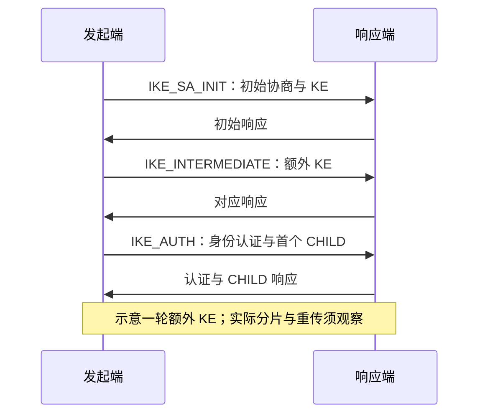

## 算法接入之后，网络条件会进入结论

在局域网里完成一次混合密钥交换，还没有回答高 RTT、较小路径 MTU 或丢包下的行为。PQC 引入的报文体积和额外交换，可能改变建链成本；到底改变多少，要看算法、认证材料、协议流程与实现。

RFC 9370 定义 IKEv2 多重密钥交换，并使用 IKE_INTERMEDIATE 等机制承载相应交换。具体消息顺序与派生关系必须按协议解释，不能把多个秘密随意拼接后称为兼容实现。[RFC 9370](https://www.rfc-editor.org/rfc/rfc9370.html)

## 用消息边界观察，而不是只看最终耗时



图中没有把每个箭头视为一个 IP 包。一个 IKE 消息可能形成多个分片；一次请求也可能重传。要分别统计逻辑 Exchange、IKE fragment、IP 分片和实际线上包数。

## IKE 分片与 IP 分片不是同一件事

RFC 7383 的 IKE 分片针对含 Encrypted payload 的消息，因此不能据此推断 `IKE_SA_INIT` 可以使用该机制。初始交换消息的大小仍需要单独考虑。它也不是对所有网络中间设备行为的保证。[RFC 7383 §2](https://www.rfc-editor.org/rfc/rfc7383.html#section-2)

证书链变长和额外 KE 数据变大可能影响不同的 Exchange。出现建链超时时，先定位最后成功的消息，再检查分片、重组和重传；不能看见 ML-KEM 配置就直接归因于算法计算慢。

## 一个用于估算的模型

**估算模型，不是测量结果**：

```text
建链时间 ≈ 按协议依赖串行等待的往返时间
         + 两端密码与证书处理
         + 排队与调度
         + 丢包后的重传与恢复
```

这里故意不写成固定的 `N × RTT` 性能承诺。消息是否可并行、认证流程、重传定时器和实现处理都会影响总时间。高 RTT 时一次额外串行交换可能值得关注；高并发时签名、KEM 或队列也可能先成为热点。

因此测试要同时收集 PCAP 时间戳、进程/设备处理统计与协议日志，仅凭应用层总耗时无法拆解原因。

## 待验证矩阵：每次只改变一个条件

以下参数是**实验设计示例**，没有运行结果，也不是某个网络的真实参数。

| 维度 | 示例对照 | 记录内容 |
| --- | --- | --- |
| 密钥交换 | 传统基线 / 一种明确的混合组合 | Proposal、实现提供方、实际 Exchange |
| 往返延迟 | 无额外延迟 / 每方向增加相同受控延迟 | 实际 RTT 与各阶段时长 |
| 丢包 | 不注入 / 一个声明概率与随机种子的条件 | 请求重传、分片重组、成功率 |
| MTU | 固定大 MTU / 较小 MTU | IKE 与 IP 分片分别出现在哪里 |
| 认证 | 同一身份模型下固定证书链 | 证书长度、认证耗时与失败原因 |
| 生命周期 | 初始建链 / IKE rekey / CHILD rekey | 新旧密钥、业务中断与清理 |

给出实验参数时，还要记录网络损伤施加在一个方向还是两个方向。只在一个出口设置延迟，不等于双向各增加相同延迟。

## 失败时不能偷偷降低要求

在策略要求混合交换的场景下，移除全部目标 KEM 实现、让对端不支持该组合，或注入不合法输入，都应检查失败位置与最终协商结果。是否允许回退必须来自显式策略，而不是超时之后由实现临时选择。

[PQC-IKE 原稿](/articles/pqc-ike-reference/)已经提供具体参考链路与原稿实验边界；这里补充的是网络条件和生命周期的测试维度，不把原有单环境结果扩展为广域网性能结论。

## 本轮研究的边界

尚未执行高 RTT、丢包、MTU、并发与长稳测试。下一份可以称为实验文章的输出，应至少包含固定版本、双方配置、损伤位置、原始 PCAP 与日志、正负用例和重复运行结果。当前这一篇保留为研究稿。
