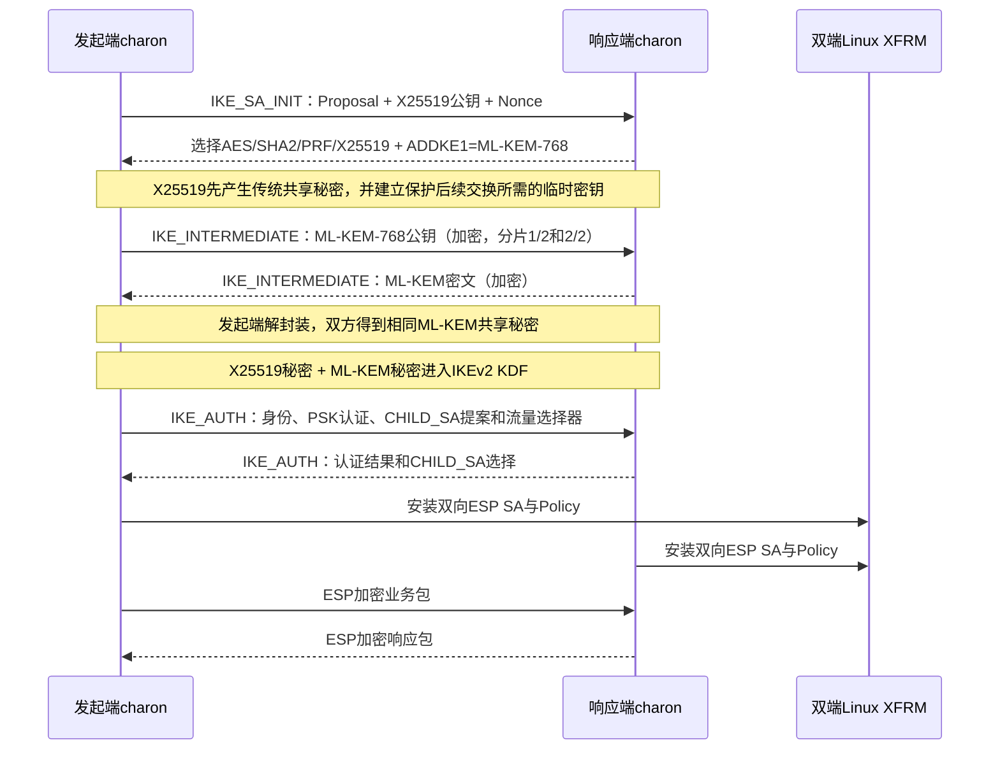
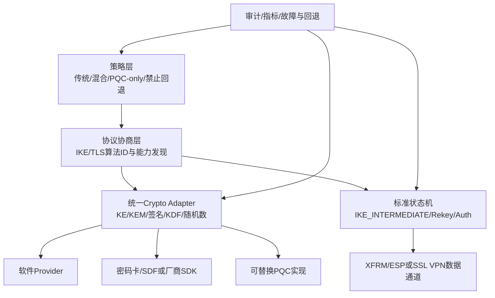

> **原稿实验记录**：以下保留原稿中的实验方法、观察与结果。本页未提供完整原始证据包，脚本路径是原实验资产的定位信息，不是本站下载地址。本次整理没有重跑实验，也不把这些记录标为已公开复核的实测结果。


## 1. 先说清楚这次做成了什么

固定源码基线为strongSwan 6.0.3，Commit `472dcd8bb50a91f156b725ff56992352b573f7dd`。在一台Linux虚拟机的两个隔离网络命名空间中，已经真实跑通：

```text
X25519主密钥交换
+ ML-KEM-768额外密钥交换
→ IKE_INTERMEDIATE
→ PSK身份认证
→ IKE_SA和CHILD_SA
→ Linux XFRM
→ 双向ESP业务流量
```

同时完成负向测试：配置保持`ke1_mlkem768`不变，但移除所有ML-KEM实现提供方，系统明确报错并停止建链，没有静默退回纯X25519。

这证明strongSwan上游的多重密钥交换、ML-KEM实现、IKE KDF和后续IPsec数据面已经形成一条可运行链路。它不证明目标产品产品、国密IPsec、PQC签名或密码卡已经完成。

## 2. 报文流程与每一步的意义



要点有三个：

1. ML-KEM不是把整个IKE协议替换掉，而是作为额外KE加入标准IKEv2状态机；
2. PQC保护的是密钥建立，本次身份认证仍由PSK完成；
3. 最终业务流量仍走ESP，是否使用国密数据面算法是另一项独立改造。

## 3. 从配置走到源码

实验proposal：

```text
aes256-sha256-prfsha256-x25519-ke1_mlkem768
```

| 环节 | 文件/函数 | 输入 | 输出和下一站 |
| --- | --- | --- | --- |
| 读取配置 | `src/libcharon/plugins/vici/vici_config.c:637 parse_proposal()` | proposal文本 | 调用proposal解析器 |
| 识别关键字 | `src/libstrongswan/crypto/proposal/proposal_keywords_static.txt:175-182` | `x25519`、`mlkem768` | 主KE=31、额外KE1=36 |
| 定义方法ID | `src/libstrongswan/crypto/key_exchange.h:69-75` | 内部枚举 | `CURVE_25519=31`、`ML_KEM_768=36` |
| 注册实现 | `src/libstrongswan/plugins/ml/ml_plugin.c:42 get_features()` | 插件feature表 | 把方法36绑定到`ml_kem_create()` |
| 创建KEM对象 | `src/libstrongswan/plugins/ml/ml_kem.c:982 ml_kem_create()` | 方法36 | 带公钥、密文和shared secret操作的`key_exchange_t` |
| 收集多轮KE | `src/libcharon/sa/ikev2/tasks/ike_init.c:558 determine_key_exchanges()` | 已选proposal | 主KE和ADDKE1顺序表 |
| 处理额外KE | `ike_init.c:618 process_ke_payload()`及`:1083 build_r_multi_ke()` | IKE_INTERMEDIATE中的KE Payload | 创建/调用对应KE对象并推进轮次 |
| 限制状态 | `src/libcharon/sa/ikev2/task_manager_v2.c:1726` | Exchange Type 43 | 只允许在IKE_CONNECTING且IKE_INIT任务未完成时处理 |
| 合并秘密 | `src/libstrongswan/crypto/key_exchange.c:720 key_exchange_concat_secrets()` | 多个`key_exchange_t` | 第一个secret与按顺序拼接的additional secrets |
| 派生IKE密钥 | `src/libcharon/sa/ikev2/keymat_v2.c:239 derive_ike_keys()` | proposal、共享秘密、Ni/Nr、SPI | SKEYSEED及SK_d、SK_a、SK_e、SK_p |
| 建CHILD_SA | `src/libcharon/sa/ikev2/tasks/child_create.c` | SK_d、Nonce、CHILD proposal | 双向ESP密钥和SA参数 |
| 下发内核 | `src/libcharon/plugins/kernel_netlink/kernel_netlink_ipsec.c:add_sa()` | SPI、算法、密钥、方向 | Linux XFRM state/policy |

## 4. ML-KEM对象内部到底做什么

`ml_kem.c`把KEM包装成strongSwan统一的`key_exchange_t`：

```text
发起端 get_public_key()
→ 生成ML-KEM密钥对并发公钥

响应端 set_public_key(public)
→ validate_public_key()
→ encaps_shared_secret()
→ 生成shared secret和ciphertext

响应端 get_public_key()
→ 返回ciphertext

发起端 set_public_key(ciphertext)
→ decaps_shared_secret()
→ 得到相同shared secret

双端 get_shared_secret()
→ 交给key_exchange_concat_secrets()
```

关键函数是：

- `get_public_key():774`：发起端产生密钥对；响应端返回已生成的密文；
- `encaps_shared_secret():859`：响应端针对公钥封装；
- `set_public_key():903`：按当前角色把输入解释为公钥或密文，并严格检查长度；
- `decaps_shared_secret():795`：发起端解封装，并按FIPS 203执行隐式拒绝；
- `get_shared_secret():942`：向上层返回共享秘密副本。

这里最值得掌握的不是ML-KEM多项式数学，而是接口语义：同一个抽象如何容纳传统DH和KEM两种不同消息方向，并让状态机只关心“发送值、接收值、取得共享秘密”。

## 5. 多个秘密怎样真正影响会话密钥

`key_exchange_concat_secrets()`遍历KE数组：第一个秘密作为`secret`，后续轮次按协议顺序拼进`add_secret`。`keymat_v2.c:derive_ike_keys()`随后使用proposal中的PRF、双方Nonce、SPI和这些共享秘密产生新的SKEYSEED与IKE密钥材料。

因此判断“PQC真的进入IKE”至少要同时看到：

```text
proposal选中ADDKE1=ML-KEM-768
→ IKE_INTERMEDIATE真实交换
→ ML-KEM实现被调用
→ 多个共享秘密进入derive_ike_keys()
→ IKE_AUTH能用新密钥成功解密和认证
→ CHILD_SA与ESP正常工作
```

只看到`ml`插件加载或配置中出现`mlkem768`，不能证明后四步发生。

## 6. 真实运行证据

### 6.1 正向实验

运行编号：`psk-20260929-095024`。

| 观察面 | 结果 |
| --- | --- |
| 运行身份 | 自编译strongSwan 6.0.3，ML-KEM由`ml`插件提供 |
| 协商日志 | `CURVE_25519/KE1_ML_KEM_768` |
| 状态机 | IKE_INTERMEDIATE请求被分成两个加密分片，响应包含KE |
| SA | 双端IKE_SA和CHILD_SA均建立 |
| 数据面 | 5/5内层Ping成功，XFRM双向各增长5包 |
| PCAP | 2个INIT、3个INTERMEDIATE、2个AUTH、10个ESP、2个删除报文 |
| PCAP Hash | `76a1c61f8460281ac7fe7c0a0f2c7e86e5f6f7952e35221ce314d14af0b1e331` |

### 6.2 负向实验

运行编号：`pqc-no-ml-20260929-095251`。

配置仍要求ML-KEM，但加载列表同时排除`ml`和`openssl`，保留AES、SHA2/3、HMAC、KDF和X25519软件实现。日志出现：

```text
selected proposal: ... CURVE_25519/KE1_ML_KEM_768
negotiated key exchange method ML_KEM_768 not supported
```

没有IKE_SA或CHILD_SA建立。这个用例排除了“算法缺失时悄悄退回纯X25519”。

首次只移除`ml`插件时，实验意外仍能成功，因为本机OpenSSL 3.5也能通过`openssl`插件提供ML-KEM。这是一个很有价值的纠错：验证某个算法是否来自指定实现时，必须排查所有Provider路径，而不是只观察一个插件。

## 7. 手工复现路径

### 7.1 进入工作目录

```bash
cd /path/to/workspace
```

`cd`只改变当前终端的工作目录；后续相对路径都从这里计算。

### 7.2 构建固定版本

```bash
./artifacts/2026-W40/task-pqc-gateway-four-outcomes/scripts/build-strongswan-ml.sh
```

脚本从固定的6.0.3源码树独立构建，不覆盖系统strongSwan。重点检查最终插件列表中是否同时存在`curve25519`、`ml`、`sha3`、`kdf`、`kernel-netlink`和`vici`。

### 7.3 跑正向实验

```bash
sudo ./artifacts/2026-W40/task-pqc-gateway-four-outcomes/lab/run-pqc-ike-lab.sh positive
```

之所以需要`sudo`，是因为实验要创建network namespace、veth和XFRM SA。通过条件不是最后一行单独显示PASS，而是proposal、IKE_INTERMEDIATE、SA、XFRM计数、Ping和PCAP同时成立。

### 7.4 用Wireshark检查

打开正向目录中的`ikev2-psk.pcap`，显示过滤器输入：

```text
isakmp || esp
```

依次检查：

1. 第1帧展开`Internet Key Exchange v2 > Security Association > Proposal > Transform`，看到DH ID 31和`ADDKE1` ID 36；
2. 第3～5帧的Exchange Type为43，即IKE_INTERMEDIATE，其中请求因体积增大分成两个Encrypted Fragment；
3. 第6～7帧为IKE_AUTH；
4. 第8～17帧为双向ESP。

Wireshark看到Transform ID 36和Exchange Type 43是报文证据；算法名称、实现提供方和最终KDF路径仍需源码与日志补足。

### 7.5 跑负向实验

```bash
sudo ./artifacts/2026-W40/task-pqc-gateway-four-outcomes/lab/run-pqc-ike-lab.sh no-ml
```

该命令以“建链失败且错误原因正好是ML-KEM实现缺失”为PASS。如果建链成功，脚本反而返回FAIL，提示存在未隔离的提供方或回退路径。

## 8. 进入综合网关时的改造方案

这是一条候选工程路线，不是在目标产品源码未到时替产品作出的架构决定。



### 阶段A：先映射真实底座

确认目标产品是否使用strongSwan、具体版本和补丁；从配置入口追到proposal、KE对象、KDF、认证和XFRM；记录自研封装和第三方边界。

### 阶段B：建立密码抽象

抽象层至少表达算法能力、创建/销毁、同步或异步调用、密钥句柄、不可导出属性、错误码、超时、会话池、设备健康、软件回退策略和审计。协议主体不应散落调用特定板卡SDK。

### 阶段C：实现混合策略

首选标准化的多重KE语义：传统KE保持现有安全基线，PQC KEM作为额外KE；双方必须对每一轮达成一致。对端不支持时是否允许传统模式，要由策略显式决定并记录审计，不能静默处理。

### 阶段D：补身份认证与生命周期

ML-KEM只解决密钥建立。还要分别决定现阶段沿用SM2/证书认证，还是引入ML-DSA/混合证书；并覆盖初始建链、IKE rekey、CHILD rekey、DPD、重连、HA和升级回滚。

### 阶段E：进入产品验证

建立互通矩阵、算法缺失、错误密文、证书错误、Provider失败、板卡离线、禁止回退、大包分片、高RTT、丢包、并发、长稳和性能测试。每条结论要闭合：

```text
需求 → 配置/策略 → 源码函数 → 构建和运行身份
→ 日志/PCAP/设备统计 → 负向测试 → 回归 → 剩余边界
```

## 9. 当前边界

- 本原型遵循IKEv2多重密钥交换思路，不是GM/T 0022国密协商模式；
- ESP仍使用AES/SHA2，PQC不会自动决定数据面使用SM4/SM3；
- ML-KEM由软件插件实现，未接入密码卡；
- PSK认证没有后量子签名能力；
- 单虚拟机实验不提供产品性能、互通、合规或稳定性结论；
- 目标产品代码到货后，必须重新确认版本、协议栈、扩展点和实际运行路径。

## 10. 权威参考

- [strongSwan 6.0.0 Release：RFC 9370多重KE、IKE_INTERMEDIATE与ML-KEM](https://github.com/strongswan/strongswan/releases/tag/6.0.0)
- [strongSwan项目能力说明](https://www.strongswan.org/)
- [RFC 9370：Multiple Key Exchanges in IKEv2](https://www.rfc-editor.org/rfc/rfc9370.html)
- [RFC 9242：Intermediate Exchange in IKEv2](https://www.rfc-editor.org/rfc/rfc9242.html)
- [NIST FIPS 203：ML-KEM](https://csrc.nist.gov/pubs/fips/203/final)
