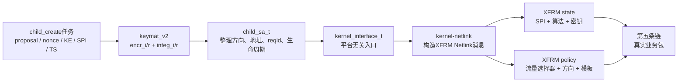

> strongSwan源码基线：6.0.3，commit `472dcd8bb50a91f156b725ff56992352b573f7dd`<br>
> 本章讲的是“控制面如何把协商结果交给内核”，不是每个业务包如何加解密。业务包路径见[第五条链](strongSwan%20五链源码精读%2005%20业务IP包到ESP.md)。<br>
> 上一条链：[Proposal、KE与Nonce如何变成密钥](strongSwan%20五链源码精读%2003%20Proposal与KE到密钥.md)

## 1. 这一条链解决什么问题

IKE协商结束时，`charon`手里已经有了：

- 双方同意的ESP算法组合；
- 本端和对端各自选择的SPI；
- 发往两个方向的加密密钥和完整性密钥；
- 哪些内网地址允许进入隧道的Traffic Selector；
- 隧道两端公网地址、隧道模式、生命周期、NAT-T等参数。

这些仍然只是用户态对象。默认的`kernel-netlink`数据面必须把它们变成Linux内核里的两类对象：

| 内核对象 | strongSwan常用叫法 | 回答的问题 |
| --- | --- | --- |
| XFRM state | SAD / SA | 这个方向用哪个SPI、算法、密钥和外层地址处理包？ |
| XFRM policy | SPD / policy | 哪一类明文流量必须使用哪条SA？ |

一句话概括：

```text
CHILD_SA协商结果
→ child_create分配双向密钥
→ child_sa整理成与平台无关的内核参数
→ kernel_interface选择内核后端
→ kernel-netlink编码XFRM Netlink消息
→ Linux内核建立state和policy
→ 后续业务包才能命中ESP数据面
```

## 2. 输入从哪里来，输出去哪里



### 本链的直接输入

| 输入 | 上一阶段在哪里得到 | 本链怎样使用 |
| --- | --- | --- |
| 选中的ESP proposal | `child_create`解析和选择SA Payload | 提取加密、完整性、ESN算法 |
| `encr_i/r`、`integ_i/r` | `keymat_v2->derive_child_keys()` | 按方向安装到两条state |
| `my_spi`、`other_spi` | 本端分配、对端在proposal中发送 | 成为入站和出站SA的索引 |
| `TSi`、`TSr` | 配置候选与对端TS Payload收窄 | 生成in/out/fwd策略选择器 |
| 两端外层地址 | `ike_sa`当前主机地址 | 生成XFRM state的src/dst |
| mode、lifetime、NAT-T等 | CHILD配置和协商结果 | 写入state、policy模板和附加属性 |

### 本链的直接输出

输出不是新的协议报文，而是内核状态：

```text
ip xfrm state   ← 双向SA：SPI、算法、密钥、外层地址、计数器
ip xfrm policy  ← 入站/出站/转发策略：源/目的网段、方向、reqid、模板
```

下游消费者是Linux XFRM。普通业务IP包不会再次回到`child_create.c`查询密钥，而是直接查询这些内核对象。

## 3. 第一段：`child_create`把协议结果交给`child_sa`

入口位于[`install_child_sa()`](https://github.com/strongswan/strongswan/blob/472dcd8bb50a91f156b725ff56992352b573f7dd/src/libcharon/sa/ikev2/tasks/child_create.c#L698-L850)。

### 3.1 先固定“谁是发起方”

`nonce_i`永远表示发起方Nonce，`nonce_r`永远表示响应方Nonce。代码不能直接假设`my_nonce`就是`nonce_i`：

```text
本端是initiator：nonce_i = my_nonce，nonce_r = other_nonce
本端是responder：nonce_i = other_nonce，nonce_r = my_nonce
```

Traffic Selector也按同样原则映射。本端是发起方时，`TSi`通常对应本端流量；本端是响应方时，本端策略视角需要反过来使用，并允许插件在`NARROW_RESPONDER_POST`阶段继续收窄。

### 3.2 把协商属性写进`child_sa_t`

`install_child_sa()`依次执行：

```text
child_sa->set_ipcomp()
→ child_sa->set_mode()
→ child_sa->set_protocol()
→ child_sa->update()          刷新当前内外端地址和NAT状态
→ child_sa->set_policies()    保存本端/对端TS
→ child_sa->set_state(CHILD_INSTALLING)
```

此时的`child_sa_t`是用户态对一个CHILD_SA的总账，但内核中还没有真正可用的state/policy。

### 3.3 派生并按方向分配密钥

```text
keymat->derive_child_keys(proposal, KEs, nonce_i, nonce_r)
→ encr_i, integ_i, encr_r, integ_r
```

后缀`i/r`表示“该方向的发送者角色”，不是“本机/对端”：

| 本端角色 | 入站state使用 | 出站state使用 |
| --- | --- | --- |
| 发起方 | `encr_r`、`integ_r`、`my_spi` | `encr_i`、`integ_i`、`other_spi` |
| 响应方 | `encr_i`、`integ_i`、`my_spi` | `encr_r`、`integ_r`、`other_spi` |

为什么入站用`my_spi`？因为SPI由接收方选择，用来告诉发送方：“以后发给我的ESP包，请带上这个编号，我才能查到正确的入站SA。”

随后两次调用：

```text
child_sa->install(... inbound = TRUE)
child_sa->install(... inbound = FALSE)
```

如果是rekey，出站SA可能先通过`register_outbound()`登记，等旧SA切换时再正式安装，避免切换窗口中的丢包和竞态。

## 4. 第二段：`child_sa`生成平台无关的SA参数

`child_sa->install()`只是薄封装，实际进入[`install_internal()`](https://github.com/strongswan/strongswan/blob/472dcd8bb50a91f156b725ff56992352b573f7dd/src/libcharon/sa/child_sa.c#L965-L1164)。

### 4.1 根据方向确定地址、SPI和TS

| `inbound` | 外层src/dst | SPI | 明文流量方向 |
| --- | --- | --- | --- |
| `TRUE` | 对端 → 本端 | `my_spi` | `other_ts → my_ts` |
| `FALSE` | 本端 → 对端 | `other_spi` | `my_ts → other_ts` |

这一步很关键：同一个CHILD_SA在内核里不是“一条双向记录”，而是两条单向state。

### 4.2 从proposal取出算法编号

```text
proposal->get_algorithm(ENCRYPTION_ALGORITHM, &enc_alg)
proposal->get_algorithm(INTEGRITY_ALGORITHM, &int_alg)
proposal->get_algorithm(EXTENDED_SEQUENCE_NUMBERS, &esn)
```

这里取得的仍是strongSwan内部算法ID，还不是Linux Crypto API名称。名称映射要到`kernel-netlink`后端才发生。

### 4.3 形成两个结构体

`kernel_ipsec_sa_id_t id`描述“如何唯一找到这条SA”：

```text
src / dst / SPI / ESP或AH协议 / mark / XFRM interface ID
```

`kernel_ipsec_add_sa_t sa`描述“怎样使用这条SA”：

```text
reqid / mode / TS / lifetime
enc_alg + enc_key
int_alg + int_key
replay_window / ESN
NAT-T encap / TFC / IPComp
硬件卸载、mark、接口等平台参数
```

最终调用：

```c
charon->kernel->add_sa(charon->kernel, &id, &sa);
```

注意，密钥在这一刻仍由`charon`传给内核接口。调用完成后，`install_child_sa()`会用`chunk_clear()`清理临时密钥块，减少用户态残留；但内核必须保留SA所需密钥，直到state被删除或过期。

## 5. 第三段：`kernel_interface`选择真正的内核后端

[`kernel_interface.c`](https://github.com/strongswan/strongswan/blob/472dcd8bb50a91f156b725ff56992352b573f7dd/src/libcharon/kernel/kernel_interface.c#L481-L545)提供稳定接口：

```text
charon->kernel->add_sa()
→ this->ipsec->add_sa()

charon->kernel->add_policy()
→ this->ipsec->add_policy()
```

它的价值是隔离平台差异。上层`child_sa.c`只组织通用语义，不必知道Linux Netlink报文格式；在默认Linux部署中，`this->ipsec`通常由`kernel-netlink`插件实现。

因此看到`child_sa.c`调用`add_sa()`，只能证明“请求已经提交到抽象内核接口”，还要继续追踪实际加载了哪个内核插件、后端是否返回成功。

## 6. 第四段：`kernel-netlink`把SA编码成`XFRM_MSG_NEWSA`

Linux实现入口是[`kernel_netlink_ipsec.c:add_sa()`](https://github.com/strongswan/strongswan/blob/472dcd8bb50a91f156b725ff56992352b573f7dd/src/libcharon/plugins/kernel_netlink/kernel_netlink_ipsec.c#L1736-L2274)。

### 6.1 写入固定头部

函数建立：

```text
Netlink消息类型：XFRM_MSG_NEWSA 或 XFRM_MSG_UPDSA
主体：xfrm_usersa_info
关键字段：family / saddr / id.daddr / id.spi / id.proto
         mode / reqid / replay_window / lifetime
```

### 6.2 把strongSwan算法映射为内核算法名称

后端先查静态映射表；没有时可通过`charon->kernel->lookup_algorithm()`查询其他注册的算法映射，然后附加：

```text
AEAD算法   → XFRMA_ALG_AEAD
普通加密   → XFRMA_ALG_CRYPT
完整性算法 → XFRMA_ALG_AUTH_TRUNC 或 XFRMA_ALG_AUTH
```

每个属性包含Linux认识的算法名、密钥长度和密钥字节。这里是“协议协商算法”与“Linux Crypto API实现”真正接上的位置。

### 6.3 发送并等待内核确认

```text
this->socket_xfrm->send_ack()
→ 内核校验算法、参数、SPI、地址等
→ 成功：state进入XFRM SAD
→ 失败：返回errno，charon记录安装失败
```

因此日志中出现`CHILD_SA established`之前，不能只看IKE协商成功；内核必须接受双向SA与策略。

## 7. 第五段：Traffic Selector变成XFRM policy

双向state成功后，`install_child_sa()`调用：

```text
child_sa->install_policies()
```

[`install_policies()`](https://github.com/strongswan/strongswan/blob/472dcd8bb50a91f156b725ff56992352b573f7dd/src/libcharon/sa/child_sa.c#L1485-L1545)先分配或复用`reqid`，然后枚举本端TS与对端TS的组合。

每组TS进入：

```text
install_policies_internal()
├─ install_policies_inbound()  → POLICY_IN，隧道模式通常再装POLICY_FWD
└─ install_policies_outbound() → POLICY_OUT，必要时再装POLICY_FWD
```

policy ID携带方向、源/目的TS、mark和interface ID；policy内容携带外层地址、优先级、硬件卸载配置以及指向SA的模板信息。

随后：

```text
kernel_interface->add_policy()
→ kernel-netlink add_policy()
→ add_policy_internal()
→ XFRM_MSG_NEWPOLICY / XFRM_MSG_UPDPOLICY
→ xfrm_userpolicy_info + xfrm_user_tmpl
→ send_ack()
```

[`add_policy_internal()`](https://github.com/strongswan/strongswan/blob/472dcd8bb50a91f156b725ff56992352b573f7dd/src/libcharon/plugins/kernel_netlink/kernel_netlink_ipsec.c#L3032-L3211)中的模板把policy与SA语义关联起来，关键字段包括协议、mode、reqid、外层地址和可选SPI。

## 8. 完整函数链与每一步产物

| 顺序 | 函数 | 输入 | 新增/改变的对象 | 输出给谁 |
| --- | --- | --- | --- | --- |
| 1 | `child_create.install_child_sa()` | proposal、KE、Nonce、SPI、TS | 固定角色方向，设置`child_sa`属性 | `keymat`、`child_sa` |
| 2 | `keymat_v2.derive_child_keys()` | `SK_d`、KE secret、Nonce、proposal | 四段双向密钥 | `child_sa.install()` |
| 3 | `child_sa.install()` | 单方向密钥、SPI、方向 | 转入`install_internal()` | `install_internal()` |
| 4 | `child_sa.install_internal()` | CHILD配置和单向材料 | `kernel_ipsec_sa_id_t`、`kernel_ipsec_add_sa_t` | `kernel_interface.add_sa()` |
| 5 | `kernel_interface.add_sa()` | 平台无关SA结构 | 选择实际IPsec后端 | `kernel-netlink.add_sa()` |
| 6 | `kernel_netlink_ipsec.add_sa()` | SA结构 | `XFRM_MSG_NEWSA/UPDSA`及算法属性 | Linux XFRM state |
| 7 | `child_sa.install_policies()` | TS数组、SA配置 | 枚举TS组合和方向 | policy安装函数 |
| 8 | `install_policies_inbound/outbound()` | TS、方向、reqid | `kernel_ipsec_policy_id_t`与policy结构 | `kernel_interface.add_policy()` |
| 9 | `kernel_netlink_ipsec.add_policy_internal()` | policy结构 | `XFRM_MSG_NEWPOLICY/UPDPOLICY`及模板 | Linux XFRM policy |

## 9. 成功、失败和可观察结果

### 成功时

`charon`日志应出现类似：

```text
CHILD_SA <name>{id} established with SPIs ... and TS ... === ...
```

系统状态应同时存在：

```bash
swanctl --list-sas --raw
ip -s xfrm state
ip -s xfrm policy
```

对应关系：

| 观察位置 | 应核对内容 |
| --- | --- |
| `swanctl --list-sas` | proposal、双向SPI、TS、安装状态 |
| `ip xfrm state` | 两条方向SA、SPI、外层地址、算法、计数器 |
| `ip xfrm policy` | `in/out/fwd`方向、内层网段、reqid、模板 |
| 公网PCAP | ESP包SPI与state一致；若NAT-T则外层通常为UDP/4500 |

> **保护密钥材料**
> `ip xfrm state`在某些输出形式中会显示密钥。生产环境保存日志、截图和报告时必须脱敏，不要把完整密钥提交到仓库。
>

### 典型失败怎样定位

| 失败点 | 现象 | 下一步 |
| --- | --- | --- |
| CHILD密钥派生失败 | 没有进入SA安装或任务失败 | 检查proposal、Nonce、KE和`SK_d` |
| 内核不认识算法名 | Netlink返回错误，日志显示无法安装SAD | 查映射、内核Crypto API和模块 |
| 只有state没有policy | IKE看似成功，业务包不进入ESP | 检查TS、policy安装回执和优先级 |
| 只有一个方向state | 单向通或完全不通 | 对照本端角色、SPI和`encr_i/r`映射 |
| policy选择器错误 | 某些网段不加密或误加密 | 对照TSi/TSr、`ip route get`和policy |
| reqid/mode/mark不一致 | policy存在但找不到正确state | 比较policy模板与state字段 |

## 10. 国密改造必须守住的边界

在本基线的上游`kernel-netlink`静态映射表中，不能仅凭“proposal里出现SM4/SM3”就推断Linux XFRM已经可用。真正闭环至少需要：

```text
strongSwan内部算法ID
→ kernel-netlink可解析的Linux算法名称
→ 目标内核Crypto API存在对应实现
→ XFRM接受state安装
→ 真实业务包计数增长并可被对端解密
```

同理，`charon`链接Tongsuo只直接影响它在用户态执行的IKE密码操作；默认`kernel-netlink + XFRM`路径中的ESP逐包加解密由Linux内核完成，并不会因为`charon`链接Tongsuo而自动改用Tongsuo或密码卡。

## 11. 读完后应能回答

1. 为什么一个CHILD_SA在内核中至少需要两条单向state？
2. 为什么发起方的入站state使用`encr_r`和`my_spi`？
3. `proposal_t`里的算法ID在哪里变成Linux算法名称？
4. state存在而policy不存在时，为什么业务包通常不会自动进入ESP？
5. 哪一条证据能证明内核接受了SA，而不只是IKE协商同意了算法？

## 12. 源码锚点

- [`child_create.c: install_child_sa()`](https://github.com/strongswan/strongswan/blob/472dcd8bb50a91f156b725ff56992352b573f7dd/src/libcharon/sa/ikev2/tasks/child_create.c#L698-L850)
- [`child_sa.c: install_internal()`](https://github.com/strongswan/strongswan/blob/472dcd8bb50a91f156b725ff56992352b573f7dd/src/libcharon/sa/child_sa.c#L965-L1164)
- [`child_sa.c: policy方向与安装`](https://github.com/strongswan/strongswan/blob/472dcd8bb50a91f156b725ff56992352b573f7dd/src/libcharon/sa/child_sa.c#L1238-L1347)
- [`child_sa.c: install_policies()`](https://github.com/strongswan/strongswan/blob/472dcd8bb50a91f156b725ff56992352b573f7dd/src/libcharon/sa/child_sa.c#L1485-L1545)
- [`kernel_interface.c: add_sa()/add_policy()`](https://github.com/strongswan/strongswan/blob/472dcd8bb50a91f156b725ff56992352b573f7dd/src/libcharon/kernel/kernel_interface.c#L481-L545)
- [`kernel_netlink_ipsec.c: add_sa()`](https://github.com/strongswan/strongswan/blob/472dcd8bb50a91f156b725ff56992352b573f7dd/src/libcharon/plugins/kernel_netlink/kernel_netlink_ipsec.c#L1736-L2274)
- [`kernel_netlink_ipsec.c: add_policy_internal()`](https://github.com/strongswan/strongswan/blob/472dcd8bb50a91f156b725ff56992352b573f7dd/src/libcharon/plugins/kernel_netlink/kernel_netlink_ipsec.c#L3032-L3211)
