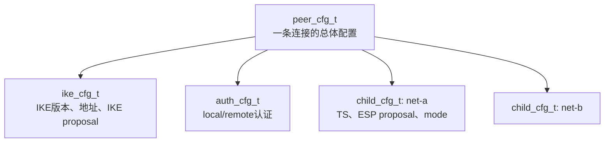

> 源码基线：strongSwan 6.0.3，commit `472dcd8bb50a91f156b725ff56992352b573f7dd`<br>
> 本文只回答一件事：`swanctl.conf` 中的一段连接配置，怎样变成 charon 可查询的配置对象，并在发起连接时变成运行中的 `IKE_SA`。<br>
> 下一条链：[IKE 网络报文如何进入具体协议任务](strongSwan%20五链源码精读%2002%20IKE报文到协议任务.md)

## 1. 先看结论

配置不是被 charon “逐行执行”的。它经历两次性质不同的转换：

```text
第一次：配置文本 → 长期保存的配置对象
swanctl.conf → settings_t → VICI message
→ ike_cfg / peer_cfg / child_cfg → VICI backend

第二次：配置对象 → 一次连接的运行对象
VICI initiate → peer_cfg + child_cfg
→ ike_sa_manager → IKE_SA → task 队列
```

三类对象的职责必须分清：

| 对象 | 输入中的典型内容 | 以后由谁消费 |
| --- | --- | --- |
| `ike_cfg_t` | IKE版本、两端地址、IKE proposal、端口、分片策略 | `IKE_SA`、`ike_init`或IKEv1 Phase 1任务 |
| `peer_cfg_t` | 连接名、认证策略、DPD、rekey、对`ike_cfg`和children的引用 | `ike_sa_manager`与`IKE_SA` |
| `child_cfg_t` | ESP proposal、Traffic Selector、隧道模式、生命周期 | `child_create`或`quick_mode` |

因此：

> “配置加载成功”只说明这些对象已建立并进入配置后端；它还没有发送IKE报文，也没有创建XFRM State。

## 2. 全链图

```mermaid
flowchart LR
    F["swanctl.conf<br/>文本配置"]
    S["settings_t<br/>配置树"]
    CLI["load_conns_cfg()<br/>枚举connections"]
    REQ["load_conn()<br/>VICI load-conn树"]
    DISP["VICI dispatcher<br/>load_conn回调"]
    PARSE["config_sn / peer_sn / child_sn<br/>字段解析"]
    OBJ["ike_cfg + peer_cfg + child_cfg"]
    STORE["merge_config()<br/>this->conns哈希表"]

    CMD["swanctl --initiate"]
    FIND["find_child_cfg()<br/>从backend取配置"]
    CTRL["controller->initiate()<br/>interface job"]
    MGR["checkout_by_config()<br/>复用或创建IKE_SA"]
    SA["ike_sa->initiate()"]
    TASK["queue_ike + queue_child<br/>task_manager->initiate()"]

    F --> S --> CLI --> REQ --> DISP --> PARSE --> OBJ --> STORE
    STORE -.提供配置.-> FIND
    CMD --> FIND --> CTRL --> MGR --> SA --> TASK
```



## 3. 输入到底从哪里来

### 3.1 人写下的输入

输入起点是`swanctl.conf`中的`connections.<连接名>`。例如：

```ini
connections {
    gw-a {
        version = 2
        local_addrs = 192.0.2.10
        remote_addrs = 198.51.100.20
        proposals = aes256-sha256-modp2048

        local { auth = pubkey }
        remote { auth = pubkey }

        children {
            net-a {
                local_ts = 10.10.0.0/24
                remote_ts = 10.20.0.0/24
                esp_proposals = aes256-sha256
            }
        }
    }
}
```

这一刻只有文本，没有`IKE_SA`，也没有密钥。

### 3.2 `load_swanctl_conf()`把文本变成配置树

`src/swanctl/commands/load_conns.c:428-468`中的`load_conns()`先调用：

```c
cfg = load_swanctl_conf(file);
ret = load_conns_cfg(conn, format, cfg);
```

输入是配置文件路径，输出是`settings_t *cfg`。可以把`settings_t`理解为一棵已经按section和key组织好的内存树；后续代码不再自己切割原始文本。

## 4. 第一段：配置树如何过VICI

### 4.1 枚举每个连接

`load_conns_cfg()`在`load_conns.c:385-395`调用：

```c
enumerator = cfg->create_section_enumerator(cfg, "connections");
while (enumerator->enumerate(enumerator, &section))
{
    load_conn(conn, cfg, section, format);
}
```

对象变化：

```text
settings_t整棵树
→ 当前连接名section，例如"gw-a"
→ load_conn()只处理connections.gw-a子树
```

### 4.2 `load_conn()`构造VICI消息树

`src/swanctl/commands/load_conns.c:233-276`：

1. `snprintf()`形成路径`connections.gw-a`；
2. `vici_begin("load-conn")`创建命令；
3. `vici_begin_section(req, section)`创建名为`gw-a`的顶层section；
4. `add_key_values()`写入普通键值；
5. `add_sections()`递归写入`local`、`remote`和`children`等子section；
6. `vici_submit(req, conn)`把序列化请求送给charon的VICI接口。

此处输出不是C配置对象，而是一个VICI消息树：

```text
load-conn
└── gw-a
    ├── version = 2
    ├── proposals = ...
    ├── local {...}
    ├── remote {...}
    └── children
        └── net-a {...}
```

下游消费者是charon内的VICI dispatcher。

### 4.3 charon如何找到处理函数

`src/libcharon/plugins/vici/vici_config.c:3094-3109`把字符串命令与回调绑定：

```c
manage_command(this, "load-conn", load_conn, reg);
```

所以VICI的`load-conn`并不会神奇地变成配置；dispatcher最终调用同文件`3018-3034`的`load_conn()`回调。这个同名函数属于服务端，与swanctl中的客户端`load_conn()`不是同一个函数。

## 5. 第二段：VICI字段如何变成三个配置对象

### 5.1 总解析入口`config_sn()`

服务端`load_conn()`调用：

```c
message->parse(message, NULL, config_sn, NULL, NULL, &request)
```

`config_sn()`收到的`name`就是连接名。它在栈上维护一个`peer_data_t peer`作为“半成品容器”：地址、认证、proposal、children等解析结果先放在这里，校验完成后再构造正式对象。

这种两阶段设计的原因是：解析中途可能失败，不能让半成品配置直接进入全局后端。

### 5.2 Proposal字符串如何进入对象

`vici_config.c:643-681`的`parse_proposal()`：

```text
VICI字符串chunk_t v
→ vici_stringify()得到C字符串
→ proposal_create_from_string(proto, buf)
→ proposal_t
→ 插入peer.proposals或child.proposals
```

IKE proposal使用`PROTO_IKE`；ESP proposal使用`PROTO_ESP`。`proposal_create_from_string()`怎样继续拆分算法，会在第三条链展开。

失败点：字符串无法转换，或包含strongSwan不认识的算法关键字时，函数返回`FALSE`，最终`load-conn`返回`parsing request failed`，不会保存半成品。

### 5.3 每个child如何形成`child_cfg_t`

`vici_config.c:2245-2288`的child解析收尾逻辑：

1. 缺省TS时建立动态selector；
2. 缺省ESP proposal时加入默认proposal；
3. `child_cfg_create(name, &child.cfg)`创建对象；
4. `add_traffic_selector()`写入本端和对端TS；
5. `add_proposal()`写入ESP proposal；
6. 把`child_cfg_t`放入`peer.children`临时列表。

输出去向：它暂时属于当前`peer_data_t`，稍后被挂到`peer_cfg_t`。

### 5.4 连接级对象怎样组装

`vici_config.c:2928-3015`完成最终组装：

```text
peer中的地址/版本/端口
→ ike_cfg_create(&ike)
→ ike_cfg_t

连接总体参数 + ike_cfg引用
→ peer_cfg_create(name, ike_cfg, &cfg)
→ peer_cfg_t

peer.local / peer.remote
→ peer_cfg->add_auth_cfg()

peer.children
→ peer_cfg->add_child_cfg()

peer.proposals
→ ike_cfg->add_proposal()
```

这里能看出对象的所有权关系：



### 5.5 配置保存在哪里

`merge_config()`位于`vici_config.c:2738-2780`：

```c
this->conns->put(this->conns, peer_cfg->get_name(peer_cfg), peer_cfg);
```

`this->conns`是VICI配置后端的哈希表，key是连接名，value是`peer_cfg_t *`。若同名配置存在，它会比较新旧对象，选择更新children或替换整条配置。

后端接口在`vici_config.c:157-203`暴露：

- `create_peer_cfg_enumerator()`：枚举`this->conns`中的peer配置；
- `create_ike_cfg_enumerator()`：从peer配置取出`ike_cfg`；
- `get_peer_cfg_by_name()`：按名字取配置并增加引用。

至此第一段结束。输出是可被charon后端管理器查询的配置对象，不是运行中的SA。

## 6. 第三段：发起命令如何取得配置

### 6.1 `swanctl --initiate`提供什么输入

发起命令通过VICI传入`child=<child名>`或`ike=<连接名>`。`src/libcharon/plugins/vici/vici_control.c:173-226`的`initiate()`读取这些字段。

### 6.2 `find_child_cfg()`怎样回到配置后端

`vici_control.c:142-170`：

1. `charon->backends->create_peer_cfg_enumerator(...)`枚举所有配置后端；
2. 用`peer_cfg->get_name()`匹配指定IKE配置名；
3. 若指定child，则`get_child_from_peer()`枚举该peer下的children；
4. 返回带引用的`peer_cfg_t`和`child_cfg_t`。

输入输出：

```text
输入：命令中的字符串名称
输出：真正的peer_cfg_t* / child_cfg_t*
下游：controller->initiate()
```

若配置名不存在，VICI直接返回`config '<name>' not found`，流程不会进入`IKE_SA`。

## 7. 第四段：配置对象如何变成运行对象

### 7.1 controller把控制请求变成工作任务

`vici_control.c:212-213`调用`charon->controller->initiate(...)`。
`src/libcharon/control/controller.c:521-550`创建`interface_job_t`，把`peer_cfg`、`child_cfg`和回调信息放入job。

这么做的原因是：VICI控制线程不直接跑完整IKE状态机，真正工作由processor中的工作线程执行。

### 7.2 `checkout_by_config()`决定复用还是创建

工作线程在`controller.c:436-518`的`initiate_execute()`中调用：

```c
ike_sa = charon->ike_sa_manager->checkout_by_config(..., peer_cfg);
```

`src/libcharon/sa/ike_sa_manager.c:1517-1644`的逻辑是：

1. 根据配置和策略判断是否允许复用IKE_SA；
2. 枚举现有SA，比较`peer_cfg`与`ike_cfg`；
3. 找到可用SA时把它标记为当前线程checkout；
4. 没找到时调用`create_new()`建立新的`ike_sa_t`；
5. `ike_sa->set_peer_cfg()`把配置挂入运行对象；
6. 返回被checkout的`IKE_SA`。

`checkout`不是网络协议步骤，而是并发控制：同一个IKE_SA的可变状态不能被多个工作线程同时随意修改。

### 7.3 `ike_sa->initiate()`把目标拆成协议任务

`controller.c:500`调用`ike_sa->initiate()`。
`src/libcharon/sa/ike_sa.c:1577-1655`执行：

```text
IKE_CREATED
→ resolve_hosts()解析本端/对端地址
→ 设置COND_ORIGINAL_INITIATOR
→ task_manager->queue_ike()

如果带child_cfg
→ task_manager->queue_child(child_cfg)

最后
→ task_manager->initiate()
```

`queue_ike()`创建IKE版本对应的任务集合；`queue_child()`创建建立CHILD_SA所需任务。下一条链会从这些任务怎样收发报文继续追踪。

### 7.4 最终输出是什么

链一的最终输出不是“隧道已建立”，而是：

```text
一个带有peer_cfg / ike_cfg / keymat / task_manager的IKE_SA运行对象
+ 一组等待build/process的IKE任务
+ 可选的CHILD任务
```

下游消费者是`task_manager_v1`或`task_manager_v2`。它们会让具体task构造第一条IKE消息。

## 8. 一张逐跳对象表

| 跳数 | 函数 | 输入 | 本跳产生/改变什么 | 输出去向 |
| --- | --- | --- | --- | --- |
| 1 | `load_swanctl_conf()` | 配置文件路径 | 文本变成`settings_t`树 | `load_conns_cfg()` |
| 2 | `load_conns_cfg()` | `settings_t` | 枚举连接section | 客户端`load_conn()` |
| 3 | `load_conn()` | section与配置树 | 构造VICI `load-conn`消息 | `vici_submit()` |
| 4 | 服务端`load_conn()` | `vici_message_t` | 触发`config_sn()`递归解析 | `peer_data_t` |
| 5 | `parse_proposal()`等 | 字符串字段 | proposal、auth、TS等中间对象 | `peer_data_t` |
| 6 | `child_cfg_create()` | child字段集合 | `child_cfg_t` | `peer.children` |
| 7 | `ike_cfg_create()` | IKE地址与选项 | `ike_cfg_t` | `peer_cfg_create()` |
| 8 | `peer_cfg_create()` | 名称、IKE配置、策略 | `peer_cfg_t`并挂接auth/children | `merge_config()` |
| 9 | `merge_config()` | `peer_cfg_t` | 保存进`this->conns` | charon backend |
| 10 | `find_child_cfg()` | initiate中的名称 | 找到`peer_cfg`/`child_cfg` | controller |
| 11 | `controller->initiate()` | 配置对象 | 创建异步interface job | `initiate_execute()` |
| 12 | `checkout_by_config()` | `peer_cfg_t` | 复用或创建`IKE_SA` | `ike_sa->initiate()` |
| 13 | `ike_sa->initiate()` | `IKE_SA`+可选child | 解析地址、排队IKE/CHILD任务 | task manager |

## 9. 失败时链条停在哪里

| 现象 | 首要检查点 | 为什么 |
| --- | --- | --- |
| `parsing request failed` | VICI字段解析、proposal关键字 | 正式cfg对象还未构造 |
| `config '<name>' not found` | `merge_config()`是否成功、命令名称 | initiate未从backend找到对象 |
| `unable to resolve ...` | `ike_sa.c:resolve_hosts()` | 配置存在，但运行时地址无法解析 |
| `initiate aborted` | manager限制或job load | 配置已变成运行对象，但启动条件不满足 |
| 已加载但无任何IKE包 | initiate是否执行、任务是否被queue/build | 加载配置本来就不会自动等于发包，除非配置含start action |

## 10. 如何验证这一条链

### 10.1 手工命令

```bash
swanctl --load-conns --raw
swanctl --list-conns --raw
swanctl --initiate --child net-a
swanctl --list-sas --raw
```

观察逻辑：

1. `--load-conns`证明VICI解析和`merge_config()`成功；
2. `--list-conns`证明配置后端能返回对象；
3. `--initiate`证明能按名字找到配置并进入controller；
4. `--list-sas`证明运行对象已经建立或已进入连接过程。

### 10.2 日志与源码对应

| 日志或结果 | 对应源码位置 | 能证明什么 |
| --- | --- | --- |
| `loaded connection` | swanctl客户端`load_conn()` | 服务端返回success |
| `added/replaced vici connection` | `merge_config()` | `peer_cfg`已进入`this->conns` |
| `vici initiate CHILD_SA` | `vici_control.c:initiate()` | 控制请求已找到目标名称 |
| `initiating IKE_SA` | `ike_init.c`或`main_mode.c` | task已经开始build，不再只是配置对象 |

### 10.3 负面测试

把proposal中的一个关键字改为不存在的名称，再执行`--load-conns`。预期结果是加载失败，且原来的有效配置不应被一个半成品对象替换。这个测试能验证“先完整解析，再merge”的原子性边界。

## 11. IKEv1、IKEv2和国密边界

- 配置加载、VICI、`peer_cfg/ike_cfg/child_cfg`和controller这段框架由IKEv1/IKEv2共用。
- 真正的版本分叉发生在`IKE_SA`内部的task manager和后续协议task。
- 在proposal字符串中增加SM算法，只改变“配置能否表达算法”；它不自动实现GM/T 0022的IKEv1 1.1协议画像、双证书、数字信封和专用keymat。
- 本文分析的是固定上游源码，不代表未来目标产品产品采用同一配置入口或对象结构。

## 12. 源码锚点

- [`load_conns.c:233-276`](https://github.com/strongswan/strongswan/blob/472dcd8bb50a91f156b725ff56992352b573f7dd/src/swanctl/commands/load_conns.c#L233-L276)：构造并提交VICI请求
- [`load_conns.c:380-468`](https://github.com/strongswan/strongswan/blob/472dcd8bb50a91f156b725ff56992352b573f7dd/src/swanctl/commands/load_conns.c#L380-L468)：读取配置并枚举connections
- [`vici_config.c:643-681`](https://github.com/strongswan/strongswan/blob/472dcd8bb50a91f156b725ff56992352b573f7dd/src/libcharon/plugins/vici/vici_config.c#L643-L681)：proposal解析
- [`vici_config.c:2245-2288`](https://github.com/strongswan/strongswan/blob/472dcd8bb50a91f156b725ff56992352b573f7dd/src/libcharon/plugins/vici/vici_config.c#L2245-L2288)：构造child配置
- [`vici_config.c:2738-2780`](https://github.com/strongswan/strongswan/blob/472dcd8bb50a91f156b725ff56992352b573f7dd/src/libcharon/plugins/vici/vici_config.c#L2738-L2780)：保存或替换连接配置
- [`vici_config.c:2928-3015`](https://github.com/strongswan/strongswan/blob/472dcd8bb50a91f156b725ff56992352b573f7dd/src/libcharon/plugins/vici/vici_config.c#L2928-L3015)：组装`ike_cfg/peer_cfg/child_cfg`
- [`vici_control.c:142-226`](https://github.com/strongswan/strongswan/blob/472dcd8bb50a91f156b725ff56992352b573f7dd/src/libcharon/plugins/vici/vici_control.c#L142-L226)：按名字取配置并发起连接
- [`controller.c:436-550`](https://github.com/strongswan/strongswan/blob/472dcd8bb50a91f156b725ff56992352b573f7dd/src/libcharon/control/controller.c#L436-L550)：异步发起任务
- [`ike_sa_manager.c:1517-1644`](https://github.com/strongswan/strongswan/blob/472dcd8bb50a91f156b725ff56992352b573f7dd/src/libcharon/sa/ike_sa_manager.c#L1517-L1644)：按配置checkout或创建IKE_SA
- [`ike_sa.c:1577-1655`](https://github.com/strongswan/strongswan/blob/472dcd8bb50a91f156b725ff56992352b573f7dd/src/libcharon/sa/ike_sa.c#L1577-L1655)：排队IKE与CHILD任务

## 13. 掌握检查

不看正文，尝试回答：

1. 为什么`loaded connection`不能证明隧道建立？
2. `peer_cfg`、`ike_cfg`、`child_cfg`分别被谁消费？
3. VICI消息在客户端和服务端分别由哪个`load_conn()`处理？
4. `checkout_by_config()`为什么既可能返回旧IKE_SA，也可能创建新IKE_SA？
5. 从配置字符串到第一个协议task，中间至少经过哪些对象？
