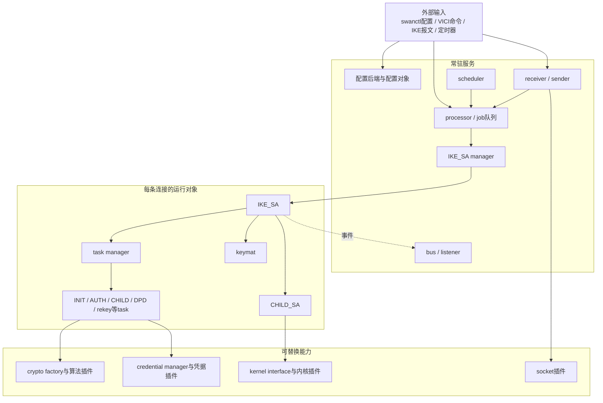
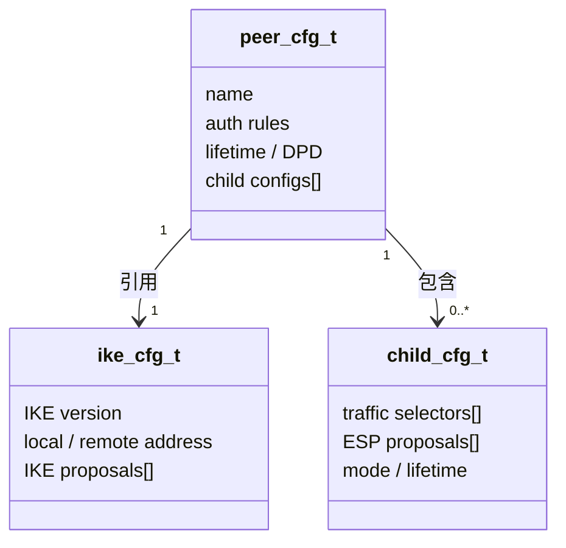
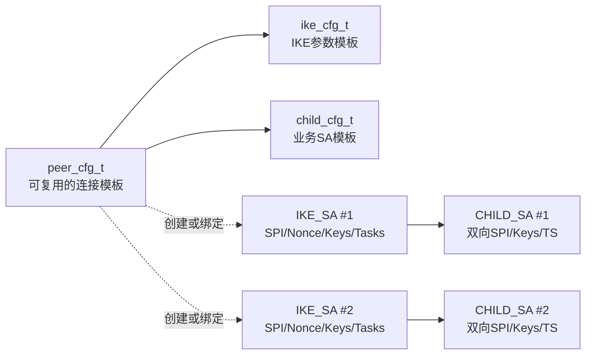
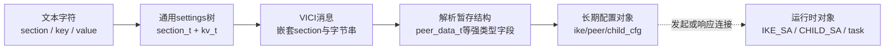
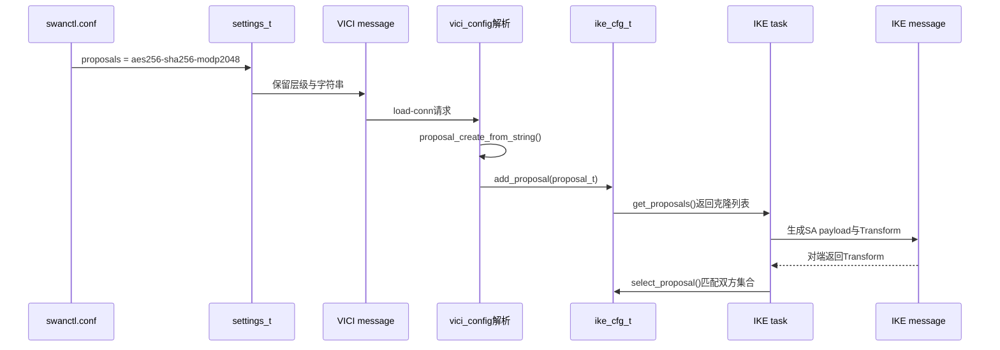
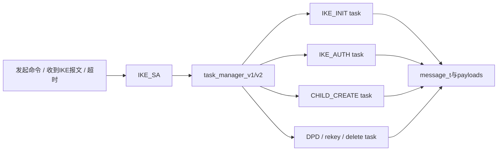
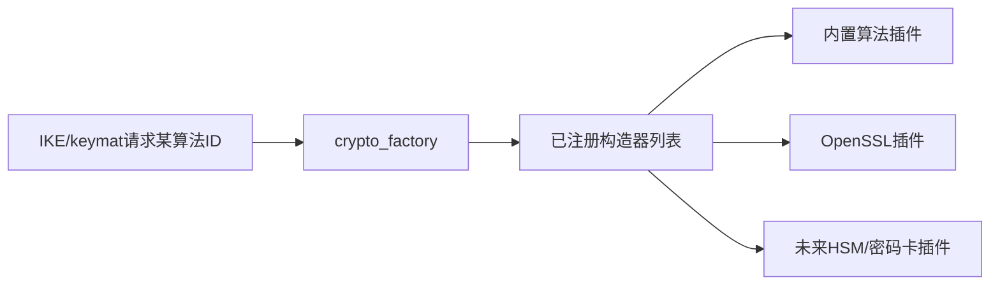
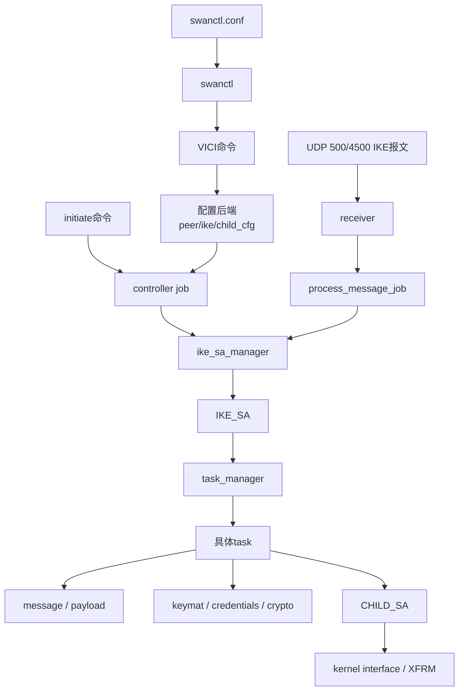
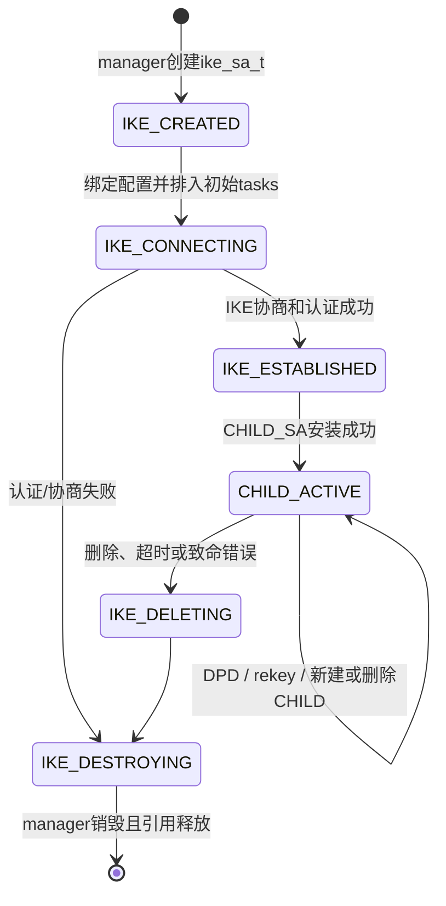

> 适用源码：strongSwan 6.0.3 上游，commit `472dcd8bb50a91f156b725ff56992352b573f7dd`<br>
> 本地基线：`/path/to/workspace/learning-sources/strongswan-6.0.3`<br>
> 目标：先理解“为什么系统必须这样设计”，再阅读具体调用链；不要求通读数十万行源码。

## 1. 为什么看懂函数后仍看不懂系统

五条调用链回答的是“程序接下来调用谁”，但它们默认读者已经知道：

- 哪些对象是配置模板，哪些对象是一条连接的实时状态；
- 一个指针指向的是接口、实现、共享对象还是临时对象；
- 为什么 C 代码里会出现 `cfg->get_proposals(cfg)`；
- 为什么同一功能分散在 manager、task、plugin、factory 和 backend 中；
- 对象由谁创建、谁持有、谁修改、何时销毁。

缺少这张“对象与所有权地图”时，函数名越多，脑中越容易只剩碎片。正确顺序应改为：

```text
设计需求
→ 系统组件
→ 核心对象及生命周期
→ 一个字段如何穿过这些对象
→ 一次连接如何驱动状态变化
→ 再进入五条完整调用链
```

## 2. 假如由我们从零设计一个IKE守护进程

一个可用于真实网关的 IKE 程序至少要解决八类问题：

| 需求 | 如果只写在一个大函数里会怎样 | 应当出现的设计 |
| --- | --- | --- |
| 同时保存多份连接配置 | 文本、默认值和运行状态混在一起 | 独立的配置对象与配置后端 |
| 同一配置建立多条连接 | 第二条连接会覆盖第一条的SPI、密钥和计时器 | 每条连接独立的运行时 `IKE_SA` |
| 处理收包、发包、超时和控制命令 | 阻塞一个事件会卡住全部隧道 | job、线程池、scheduler、receiver、sender |
| 支持IKEv1和IKEv2多个交换 | 一个巨型状态机难以维护 | task manager与可组合的协议task |
| 支持多种算法和密码库 | 协议代码充斥OpenSSL/硬件SDK分支 | 稳定接口、factory和plugin注册 |
| 支持不同系统或用户态IPsec | 协议逻辑绑死某个内核API | kernel interface与不同后端 |
| 支持证书、PSK、EAP等认证 | 每种认证修改核心状态机 | credential manager与认证插件 |
| 允许日志、审计、HA和控制工具观察状态 | 各模块互相硬编码调用 | bus/listener与VICI控制接口 |

由这些需求自然推导出 strongSwan 的系统骨架：



一句话概括：`charon` 是一个由事件驱动、用任务组合 IKE 状态机、用插件取得密码与系统能力、并为每个对端维护独立 SA 生命周期的长期运行服务。

```text
事件驱动      → receiver / scheduler / processor / job
任务组合      → task_manager_v1 / task_manager_v2 / 各种task
IKE状态机     → IKE_SA + message + payload + task状态
插件能力      → plugin loader + crypto/credential/kernel/socket接口
独立SA        → ike_sa_t / child_sa_t及其manager
长期运行服务  → daemon、bus、VICI、重传、rekey、销毁
```

## 3. 配置模板不等于运行连接

### 3.1 三类配置对象

| 对象 | 人话解释 | 典型内容 |
| --- | --- | --- |
| `ike_cfg_t` | 怎样找到对端、怎样保护IKE控制通道 | IKE版本、地址、端口、IKE proposal、分片 |
| `peer_cfg_t` | 这个对端是谁、连接整体怎样管理 | 双方认证、重连/rekey、虚拟IP、唯一性策略 |
| `child_cfg_t` | 哪些业务流量受保护、ESP怎样保护 | TS、ESP proposal、生命周期、隧道模式 |



### 3.2 运行时对象

真正发起连接或收到报文时，系统还要保存双方 SPI、当前状态、已选 proposal、Nonce、密钥、消息ID、重传计时器、活动任务、CHILD_SA、实际地址和统计。这些属于 `ike_sa_t`，不能写回配置模板。



正确理解：一份配置是模具，`IKE_SA` 是一次正在发生的连接。配置加载成功只代表模具存在，不能证明已经建链。

## 4. C语言里为什么看起来像“对象”

strongSwan 大量使用“公开接口结构体 + 私有实现结构体 + 函数指针”模拟面向对象。这是阅读源码前必须掌握的桥梁。

### 4.1 一个等价的最小模型

下面不是项目原码，而是等价的简化写法：

```c
typedef struct config_t config_t;

struct config_t {
    int (*get_version)(config_t *this);
    void (*destroy)(config_t *this);
};

typedef struct {
    config_t public;     /* 必须放在开头 */
    int version;         /* 私有数据 */
    int refcount;
} private_config_t;

static int get_version(private_config_t *this)
{
    return this->version;
}
```

调用 `cfg->get_version(cfg)`时：

```text
cfg->get_version   → 取出对象中保存的函数地址
(cfg)              → 把对象自己作为首参数传入，相当于C++的this
返回值             → 具体实现读取私有字段后给出
```

### 4.2 映射到真实 `ike_cfg_t`

| 层次 | 源码 | 作用 |
| --- | --- | --- |
| 公共接口 | `src/libcharon/config/ike_cfg.h` | 声明调用者可以使用的方法 |
| 私有实现 | `src/libcharon/config/ike_cfg.c:37` | 首字段是 `ike_cfg_t public`，随后保存地址、proposal和引用计数 |
| 构造与绑定 | `ike_cfg_create()`，约在`:600` | `INIT()`分配对象并把接口函数绑定到具体实现 |

真实调用 `cfg->get_proposals(cfg)`中，`cfg`的静态类型是 `ike_cfg_t*`，真正分配的内存却是 `private_ike_cfg_t`。因为 `public`是私有结构体的第一个成员，二者起始地址相同；`METHOD()`宏负责把公共接口指针交给私有实现。

源码 `src/libstrongswan/utils/utils/object.h`中的宏可先这样理解：

```text
INIT                  ≈ malloc + 字段初始化
METHOD                ≈ 定义一个以this为首参数的普通C函数
obj->method(obj, ...) ≈ method实现(obj, ...)
DESTROY_IF            ≈ 非空时调用对象自己的destroy
```

### 4.3 引用、克隆与所有权

```text
get_ref() → 引用计数加1，调用者取得共享所有权
destroy() → 引用计数减1，最后一个持有者才真正释放
clone()   → 创建独立副本，修改和销毁不影响原对象
```

`ike_sa.c:set_peer_cfg()`会先对新配置调用 `get_ref()`，再销毁旧引用。这说明运行中的 `IKE_SA`持有配置对象，而不是把所有字段复制一遍。`ike_cfg_t.get_proposals()`则返回克隆列表，避免协商任务修改配置对象内部的原始列表。

## 5. 配置文本怎样变成数据结构

### 5.1 示例输入与五次形态变化

```ini
connections {
    demo {
        version = 2
        proposals = aes256-sha256-modp2048
        local_addrs = 10.0.0.1
        remote_addrs = 10.0.0.2
        local { auth = psk }
        remote { auth = psk }
        children {
            net {
                local_ts = 192.168.1.0/24
                remote_ts = 192.168.2.0/24
                esp_proposals = aes256-sha256
            }
        }
    }
}
```



### 5.2 字符变成通用settings树

```text
src/swanctl/swanctl.c: load_swanctl_conf()
→ src/libstrongswan/settings/settings.c: settings_create()
→ settings_lexer.l / settings_parser.y
→ settings_types.h: section_t / kv_t
```

此时 `demo`是一个 `section_t`，`version = 2`是一个 `kv_t`；值基本仍是字符串。通用解析器只负责语法和层级，不负责判断proposal里有哪些算法。

### 5.3 settings树变成VICI请求

`src/swanctl/commands/load_conns.c`中的主链：

```text
load_conns()
→ load_swanctl_conf()
→ load_conns_cfg()
→ load_conn()
→ vici_begin("load-conn")
→ add_key_values() / add_sections()
→ vici_submit()
```

VICI是 `swanctl`与 `charon`之间的控制接口，不是IKE网络协议。分离以后，`swanctl`负责文件和用户交互，`charon`只接收结构化控制消息，其他管理程序也可使用同一控制接口。

### 5.4 VICI消息变成有类型的暂存字段

接收端在 `src/libcharon/plugins/vici/vici_config.c`：

```text
load_conn()回调
→ message->parse(..., config_sn, ...)
→ config_sn()建立peer_data_t并应用默认值
→ peer_sn / peer_kv / peer_li解析section、键值和列表
```

这一步开始发生领域类型转换：

```text
"2"                              → ike_version_t IKEV2
"yes"                            → bool
"aes256-sha256-modp2048"         → proposal_t中的Transform列表
"192.168.1.0/24"                 → traffic_selector_t
"1h"                             → 秒数形式的生命周期
```

proposal入口是：

```text
parse_ike_proposal()
→ parse_proposal(..., PROTO_IKE, value)
→ proposal_create_from_string(PROTO_IKE, text)
→ proposal_t
```

`peer_data_t`是施工脚手架：它暂存解析后的地址、认证、proposal和child；全部字段检查完后才组装长期对象。

### 5.5 暂存字段组装成配置对象

`config_sn()`后半段依次执行：

```text
ike_cfg_create(&ike)
peer_cfg_create(name, ike_cfg, &cfg)
child_cfg_create(...)              # child section解析期间完成
peer_cfg->add_auth_cfg(...)
peer_cfg->add_child_cfg(...)
ike_cfg->add_proposal(...)
merge_config(..., peer_cfg)
```

临时链表中的proposal和child对象被交给长期配置对象，随后清理 `peer_data_t`剩余资源。`merge_config()`按名称加入VICI配置后端，同名连接可能更新或替换，并处理 `start_action`。

### 5.6 配置对象触发运行时连接

典型手动发起链：

```text
swanctl --initiate
→ VICI控制插件
→ controller_t.initiate()
→ initiate_execute() job
→ ike_sa_manager.checkout_by_config(peer_cfg)
→ 创建或复用ike_sa_t
→ ike_sa.set_peer_cfg(peer_cfg)
→ ike_sa.initiate(child_cfg)
→ task_manager排入相关task
```

这里才从“连接模板”进入“协议正在运行”。配置使用 `start_action = start/trap`时启动时机不同，但配置对象与运行对象的边界不变。

## 6. 用 `proposals` 贯穿整条链



| 位置 | 表示 | 作用 |
| --- | --- | --- |
| 配置文本 | `aes256-sha256-modp2048` | 给人和管理工具使用 |
| 内存对象 | `proposal_t`中的类型、算法ID、密钥长度 | 供程序匹配、克隆和查询 |
| IKE报文 | SA payload中的Proposal/Transform字段 | 与对端在网络上协商 |

新增国密或PQC算法时，只改配置关键字远远不够。还要确认文本映射、线上标识、对端一致性、factory构造、keymat角色以及最终数据面支持。

## 7. 读完前半章应能回答

1. 为什么同一 `peer_cfg_t`可以创建多条 `IKE_SA`？
2. `cfg->get_proposals(cfg)`里的两个 `cfg`分别是什么？
3. proposal字符串在哪一步第一次成为强类型对象？
4. 为什么 `get_proposals()`返回克隆列表，而不是暴露内部链表？
5. 配置加载成功后，为什么还不能说明IKE或ESP已经工作？

## 8. task为什么是状态机的核心

### 8.1 为什么不写一个巨大状态机

IKEv2包含初始交换、认证、CHILD_SA创建、删除、rekey、DPD和MOBIKE；IKEv1又有不同交换和阶段。若全部写进一个 `switch(state)`，增加功能就会不断修改中心代码，重传与并发交换也难以组合和测试。

strongSwan把一次协议职责封装为 `task_t`：

```text
build()    → 本端生成消息时添加payload，并更新本端阶段
process()  → 收到对端消息时读取payload、校验并更新对象
migrate()  → SA重建或切换时迁移任务上下文
destroy()  → 释放任务拥有的临时状态
```

### 8.2 task manager负责调度而非具体协议语义

`task_manager_create()`根据 `IKE_SA`版本创建 `task_manager_v1`或 `task_manager_v2`。task manager维护主动、被动和待执行任务，决定某个Exchange由哪些task参与，并处理消息ID、重传、并发交换和任务销毁。



阅读一个task时，只问五件事：

1. 它在哪种Exchange和角色下创建？
2. 它从 `IKE_SA`或配置对象读取什么？
3. `build()`放入哪些payload？
4. `process()`读取什么并把结果写到哪里？
5. 返回值怎样影响task manager和SA生命周期？

## 9. 插件、factory和接口怎样实现扩展

### 9.1 插件要向系统声明能力

一个算法插件通常声明：

```text
能力类别
→ 算法ID与参数
→ 创建能力对象的构造函数
→ 所需依赖
```

例如 `src/libstrongswan/plugins/aes/aes_plugin.c`使用：

```text
PLUGIN_REGISTER(CRYPTER, aes_crypter_create)
PLUGIN_PROVIDE(CRYPTER, ENCR_AES_CBC, 16/24/32)
```

含义是：“调用方请求AES-CBC且密钥长度匹配时，factory可以尝试 `aes_crypter_create()`。”

### 9.2 协议代码只依赖稳定接口

协议与keymat层使用 `crypter_t`、`aead_t`、`prf_t`、`signer_t`、`key_exchange_t`等接口，而不直接依赖某个AES或OpenSSL实现。



插件架构只解决“程序怎样找到实现”。协议是否允许该算法、线上标识是否一致、密钥派生是否正确、内核ESP是否支持，是另外几层问题。

### 9.3 三个最重要的可替换边界

| 边界 | 上层接口 | 可能后端 | 为什么重要 |
| --- | --- | --- | --- |
| 密码能力 | crypter/aead/prf/signer/key_exchange等 | 内置、OpenSSL、PKCS#11、密码设备插件 | 国密、HSM和PQC接入点 |
| 内核数据面 | `kernel_interface_t` | kernel-netlink、kernel-libipsec、平台后端 | IKE与ESP实现解耦 |
| 凭据 | credential manager / credential set | 文件、PKCS#11、数据库、外部服务 | 私钥和证书来源可替换 |

## 10. manager、job、scheduler和bus为什么存在

### manager：找到对象并保护它

`ike_sa_manager`按SPI、配置或内部ID找到 `IKE_SA`。常见操作可先理解为：

```text
checkout → 找到对象并取得本次独占处理权
处理SA   → 修改状态、task、地址或计时器
checkin  → 归还对象，允许下一个工作线程处理
```

这不是IKE协议步骤，而是并发保护；否则收包、超时和控制命令可能同时修改同一SA。

### job与scheduler：把事件安全交给工作线程

网络收包、发起、重传、删除等动作被包装成 `job_t`放入processor线程池。重传、DPD、rekey和生命周期到期由scheduler在指定时间产生job，而不是持续轮询。

### bus：让观察者订阅事件

日志、审计、状态通知和HA需要观察SA变化，却不应全部硬编码进 `ike_sa.c`。bus发布事件，listener按需订阅，从而降低核心协议与外围功能的耦合。

## 11. 从设计问题理解目录

### 11.1 第一圈：现在必须熟悉

| 设计问题 | 目录/文件 | 第一遍只看什么 |
| --- | --- | --- |
| 守护进程如何装配服务？ | `src/libcharon/daemon.c` | manager、kernel、sender/receiver和插件初始化 |
| 用户怎样提交配置？ | `src/swanctl/`、`src/libcharon/plugins/vici/` | `load_conns.c`与`vici_config.c` |
| 配置怎样成为对象？ | `src/libcharon/config/` | `ike_cfg`、`peer_cfg`、`child_cfg` |
| 每条连接状态在哪里？ | `src/libcharon/sa/` | `ike_sa`、`child_sa`、manager、task_manager |
| IKEv1和IKEv2怎样分开？ | `src/libcharon/sa/ikev1/`、`ikev2/` | 两套task manager及关键task |
| 报文怎样编码解析？ | `src/libcharon/encoding/`、`encoding/payloads/` | `message_t`与具体payload |
| 网络报文怎样进入线程？ | `src/libcharon/network/`、`processing/jobs/` | receiver、sender、process_message_job |
| IKE怎样控制ESP数据面？ | `src/libcharon/kernel/`、`plugins/kernel_netlink/` | kernel interface与SA/policy下发 |

### 11.2 第二圈：理解扩展时进入

| 设计问题 | 目录 | 用途 |
| --- | --- | --- |
| 通用容器、线程、地址在哪里？ | `src/libstrongswan/collections`、`threading`、`networking`、`utils` | 全项目基础设施 |
| proposal和算法接口在哪里？ | `src/libstrongswan/crypto/` | 算法ID、proposal、factory和接口 |
| 算法实现怎样注册？ | `src/libstrongswan/plugins/` | AES、OpenSSL、PKCS#11、ML-KEM等插件 |
| 证书和密钥怎样抽象？ | `src/libstrongswan/credentials/` | 证书、公私钥、credential set/manager |
| IKE事件怎样被订阅？ | `src/libcharon/bus/` | listener和日志事件 |
| 虚拟IP怎样分配？ | `src/libcharon/attributes/` | 地址池和配置属性 |

### 11.3 第三圈：知道存在，按需查

| 目录 | 何时进入 |
| --- | --- |
| `src/starter`、`src/stroke` | 维护旧式 `ipsec.conf` / stroke路线时 |
| `src/libipsec`、`kernel_libipsec` | 研究用户态ESP时 |
| `src/charon-nm`、`charon-svc`、`charon-cmd`等 | 对应特定前端或平台时 |
| `src/libtnc*`、大量EAP插件 | 产品明确采用相应认证方案时 |
| `testing/`、`fuzz/` | 建立集成回归、安全测试或上游贡献时 |

不需要把第三圈当成“掌握strongSwan之前必须读完”的内容。

## 12. 两张图把数据与对象串起来

### 12.1 控制命令和报文汇入同一个IKE_SA



### 12.2 一条运行对象的生命周期



该图是便于学习的模型。具体状态和多个CHILD并存情况以 `ike_sa.c`及对应task为准。

## 13. 阅读每个对象只填写一张卡

| 问题 | 需要找到的内容 |
| --- | --- |
| 它解决什么设计问题？ | 没有它会产生什么耦合或状态混乱 |
| 谁创建它？ | 构造函数和调用者 |
| 输入是什么？ | 配置、报文、其他对象或系统状态 |
| 它长期保存什么？ | 私有结构体中的关键字段 |
| 谁调用它？ | 最重要的2到3个调用者 |
| 输出到哪里？ | 返回对象、修改SA、生成报文或下发内核 |
| 谁拥有它？ | 借用、引用计数、clone还是所有权转移 |
| 何时销毁？ | 正常结束、替换、错误或守护进程退出 |
| 怎样证明执行？ | 日志、断点、PCAP、XFRM或小修改 |

以 `ike_cfg_t`为例：

| 问题 | 答案 |
| --- | --- |
| 设计问题 | 保存可复用的IKE端点和proposal模板 |
| 创建者 | VICI配置解析等配置后端调用 `ike_cfg_create()` |
| 关键输入 | IKE版本、地址、端口、分片、proposal |
| 关键字段 | `version`、`me/other`、端口、`proposals`、refcount |
| 主要调用者 | `peer_cfg`、`IKE_SA`、IKE协商task |
| 主要输出 | 地址解析、proposal列表与选择结果 |
| 所有权 | `get_ref()`共享；`get_proposals()`返回克隆列表 |
| 销毁 | 最后一个引用调用 `destroy()`后释放 |
| 运行证据 | 配置日志、IKE SA payload和最终协商结果 |

## 14. 最快且不虚的学习顺序

不再安排数十天通读，而是8个可验收回合。每回合手动走一条代表路径，其余机械搜索和整理交给AI。

| 回合 | 核心掌握 | 手动动作 | 掌握门槛 |
| --- | --- | --- | --- |
| 0 | C接口结构体、函数指针、`INIT/METHOD` | 展开并解释 `ike_cfg_create()` | 能把 `cfg->method(cfg)`翻译成普通C调用 |
| 1 | 文本到配置对象 | 手动追 `proposals`字段 | 能说出五种数据形态及所有权变化 |
| 2 | 配置到运行对象 | 追 `controller → manager → ike_sa` | 能区分cfg与SA，并解释复用/新建 |
| 3 | 报文与task | 选一个IKE_SA_INIT包追到具体task | 能解释build/process和task manager职责 |
| 4 | proposal、KE与keymat | 从Transform追到factory和密钥派生 | 能区分协议选择与实现创建 |
| 5 | CHILD_SA与XFRM | 从child task追到SA/policy下发 | 能解释控制面成功为何不等于数据面成功 |
| 6 | 插件扩展 | 阅读一个小插件并改一处可见行为 | 能解释注册、factory、接口和实现 |
| 7 | 故障闭环 | 制造proposal不匹配并定位 | 能指出失败对象、函数层和未发生的后续步骤 |

学习循环：

```text
本章建立对象地图
→ 单虚拟机实验建立配置/日志/PCAP/XFRM参照
→ 每次只选一个字段或事件
→ 定位源码并填写对象卡
→ 在运行证据中找结果
→ 做一个小改动或负面测试
→ 用五链文档补齐完整路径
```

## 15. 第一项源码练习：手动追 `proposals`

先进入固定基线并确认版本：

```bash
cd /path/to/workspace/learning-sources/strongswan-6.0.3
git rev-parse HEAD
git status --short
```

再定位四次关键变化：

```bash
rg -n "load_swanctl_conf|settings_create" src/swanctl src/libstrongswan/settings
rg -n "static bool load_conn|vici_begin\(\"load-conn\"" src/swanctl/commands/load_conns.c
rg -n "parse_ike_proposal|parse_proposal|proposal_create_from_string" src/libcharon/plugins/vici src/libstrongswan/crypto
rg -n "ike_cfg_create|add_proposal|get_proposals|select_proposal" src/libcharon/config src/libcharon/sa/ikev2
```

四条命令分别定位文件解析、VICI发送、字符串转对象、配置对象被协议task使用。只回答六个问题：

1. proposal文本最早保存在哪里？
2. 哪一步把字符串转成 `proposal_t`？
3. `ike_cfg_t`保存原指针还是复制？
4. `get_proposals()`为什么返回克隆？
5. 哪个task读取本端proposal并写入IKE报文？
6. proposal不匹配时，运行对象停在哪个阶段？

完成六问后再进入五链01—03，会比继续堆函数名有效。

## 16. 源码锚点与配套阅读

| 主题 | 6.0.3源码位置 |
| --- | --- |
| settings树的数据结构 | `src/libstrongswan/settings/settings_types.h` |
| settings文件入口 | `src/libstrongswan/settings/settings.c:1145` |
| swanctl读取配置 | `src/swanctl/swanctl.c:34` |
| 构造load-conn请求 | `src/swanctl/commands/load_conns.c:233` |
| VICI proposal解析 | `src/libcharon/plugins/vici/vici_config.c:643` |
| VICI组装cfg对象 | `src/libcharon/plugins/vici/vici_config.c:2784`附近 |
| `ike_cfg_t`接口与实现 | `src/libcharon/config/ike_cfg.h`、`ike_cfg.c` |
| C对象宏 | `src/libstrongswan/utils/utils/object.h:44`、`:99` |
| 发起连接job | `src/libcharon/control/controller.c:436` |
| 按配置取得SA | `src/libcharon/sa/ike_sa_manager.c:1517` |
| `IKE_SA`状态与构造 | `src/libcharon/sa/ike_sa.c:86`、`:3167` |
| IKEv1/v2 task分流 | `src/libcharon/sa/task_manager.c:89` |
| 算法插件注册示例 | `src/libstrongswan/plugins/aes/aes_plugin.c` |
| 密码对象factory | `src/libstrongswan/crypto/crypto_factory.c` |
| 守护进程服务装配 | `src/libcharon/daemon.c` |

配套顺序：

```text
本章：为什么有这些对象和目录
→ 单虚拟机实操：建立真实参照
→ 五链01—05：逐函数解释执行路径
→ 国密改造文档：定位算法、协议和数据面扩展点
```

- [strongSwan单虚拟机IKEv2/IPsec实操](strongSwan%20单虚拟机%20IKEv2%20IPsec%20配置与验证实操.md)
- [五链01：配置到IKE_SA](strongSwan%20五链源码精读%2001%20配置到%20IKE_SA.md)
- [五链02：IKE报文到协议任务](strongSwan%20五链源码精读%2002%20IKE报文到协议任务.md)
- [五链03：Proposal与KE到密钥](strongSwan%20五链源码精读%2003%20Proposal与KE到密钥.md)
- [五链04：CHILD_SA到XFRM](strongSwan%20五链源码精读%2004%20CHILD_SA到XFRM.md)
- [五链05：业务IP包到ESP](strongSwan%20五链源码精读%2005%20业务IP包到ESP.md)

最终掌握标准不是背目录，而是拿到一个配置、日志、PCAP或故障后，能判断它属于哪类对象，沿正确边界进入源码，并用运行结果验证结论。

## 官方资料

- [strongSwan 6.0：VICI插件](https://docs.strongswan.org/docs/6.0/plugins/vici.html)：确认VICI是外部程序配置、控制和监控charon的稳定IPC接口。
- [strongSwan 6.0：swanctl.conf](https://docs.strongswan.org/docs/6.0/swanctl/swanctlConf.html)：核对配置层级、字段语义和版本差异。
- [strongSwan开发者文档](https://docs.strongswan.org/docs/latest/devs/devs.html)：源码、Doxygen、面向对象C风格和测试入口。该页面当前面向最新版本，具体源码结论仍以本文固定的6.0.3 commit为准。
- [strongSwan插件加载说明](https://docs.strongswan.org/docs/latest/plugins/pluginLoad.html)：理解编译期插件选择、运行时加载和feature注册；使用时注意最新文档与6.0.3之间的版本边界。
