> 研究基线：strongSwan 6.0.3 上游源码，commit `472dcd8bb50a91f156b725ff56992352b573f7dd`<br>
> 研究目标：用由粗到细的流程图串起配置、IKE、密码、CHILD_SA、Linux XFRM 与业务报文<br>
> 边界：本文描述默认的 `charon + kernel-netlink + Linux XFRM` 路线；`kernel-libipsec` 用户态 ESP 是另一条可选路线

## 1. 先纠正一个最重要的理解

“数据在 strongSwan 中流动”其实包含四种完全不同的数据：

| 数据类型 | 例子 | 主要经过哪里 | 最终作用 |
| --- | --- | --- | --- |
| 配置数据 | 地址、证书、IKE/ESP proposal、流量选择器 | `swanctl → VICI → config objects` | 告诉 charon 应建立什么连接 |
| IKE 控制报文 | IKE_SA_INIT、IKE_AUTH、Main Mode、Quick Mode | `socket → receiver/sender → task_manager → task` | 协商算法、认证身份、建立 SA |
| 密钥与 SA 元数据 | SPI、方向密钥、算法、Traffic Selector | `keymat → child_sa → kernel interface` | 把协商结果安装到内核 |
| 业务 IP 报文 | 用户访问内网的 TCP/UDP/IP 包 | Linux 路由与 XFRM | 匹配策略后封装成 ESP |

必须牢记：

> **charon 主要处理前三类数据。采用默认 Linux XFRM 数据面时，隧道建立后的每个业务包不会再回到 charon。**

这就是后面所有图的总线索。

## 2. 图一：一张全景图先建立坐标

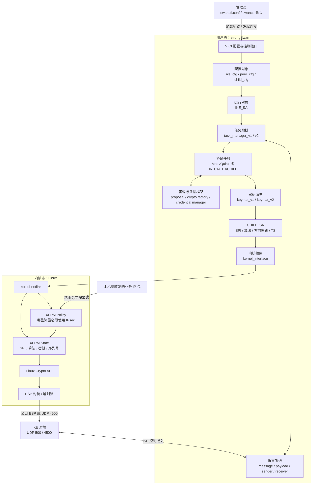

### 这张图应该看懂什么

1. 配置先变成对象，不会直接变成内核规则。
2. `IKE_SA` 是一次 IKE 会话的总运行对象；`task_manager` 在其中编排多个协议任务。
3. 密码插件提供“怎么算”，task 和 keymat 决定“什么时候算、输入是什么、结果用于哪里”。
4. `CHILD_SA` 把协商结果组织成内核能安装的形式。
5. XFRM 安装完成后，业务报文走内核，不经过 IKE 状态机。

## 3. 图二：配置怎样变成运行中的 IKE_SA

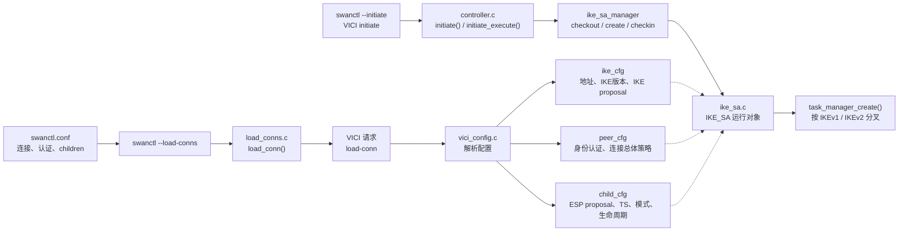

### 配置对象为什么分成三个

- `ike_cfg`：回答“跟谁建立哪一种 IKE SA”。
- `peer_cfg`：回答“双方如何证明身份，以及整条连接采用什么策略”。
- `child_cfg`：回答“哪些业务网段进入隧道，ESP 使用什么算法和模式”。

因此一个常见排障规律是：

```text
IKE proposal 错误 → 看 ike_cfg
身份认证错误     → 看 peer_cfg
ESP/网段/模式错误 → 看 child_cfg
```

### 源码锚点

```text
src/swanctl/commands/load_conns.c
  load_conn()

src/libcharon/plugins/vici/vici_config.c
  parse_proposal()
  parse_rules / parse_sections 相关配置解析

src/libcharon/control/controller.c
  initiate()
  initiate_execute()

src/libcharon/sa/ike_sa_manager.c
src/libcharon/sa/ike_sa.c
  initiate()
```

## 4. 图三：一个 IKE 报文怎样进入、处理并发回网络

### 4.1 接收方向

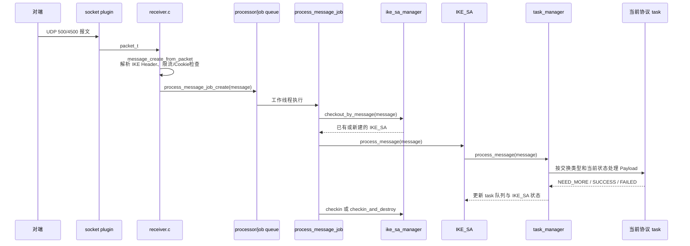

### 4.2 发送方向

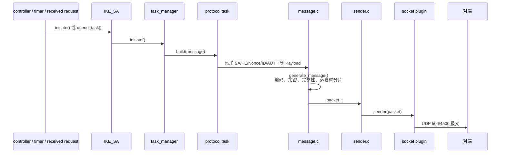

### `task_manager` 为什么是核心

`task_manager` 不是密码算法，也不是单个协议状态机。它更像一个项目经理：

- 根据 IKE 版本选择 v1 或 v2 实现；
- 维护主动、被动和排队中的 task；
- 把收到的消息交给正确 task；
- 处理重传、并发交换、失败和任务销毁；
- 让多个 task 共同完成一次 IKE/CHILD_SA 生命周期。

### 源码锚点

```text
src/libcharon/network/receiver.c
  receive_packets()

src/libcharon/processing/jobs/process_message_job.c
  execute()

src/libcharon/sa/ike_sa_manager.c
  checkout_by_message()

src/libcharon/sa/ike_sa.c
  process_message()
  generate_message()

src/libcharon/sa/ikev1/task_manager_v1.c
src/libcharon/sa/ikev2/task_manager_v2.c
  initiate()
  process_message()

src/libcharon/network/sender.c
  send()
```

## 5. 图四：IKEv1 与 IKEv2 在哪里分叉，又在哪里汇合

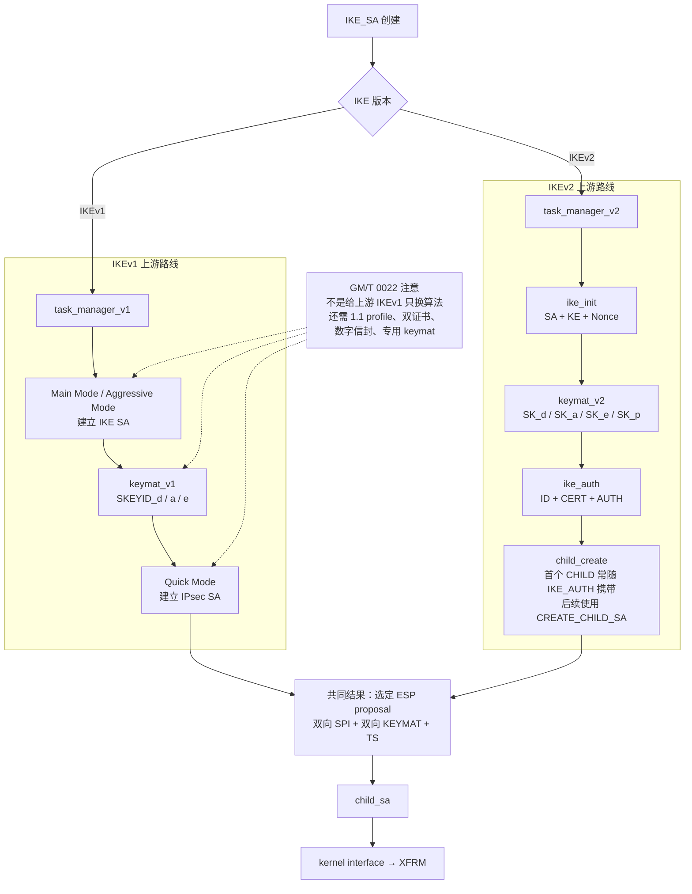

### 分叉与汇合的本质

分叉的是控制面协议：

```text
IKEv1：Main/Aggressive + Quick Mode + keymat_v1
IKEv2：IKE_SA_INIT + IKE_AUTH + CREATE_CHILD_SA + keymat_v2
```

汇合的是结果表达：两条路线最终都要产生 `CHILD_SA` 所需的 proposal、SPI、方向密钥和 Traffic Selector，再交给统一的 kernel interface。

这就是为什么：

- 改 IKEv1 状态机不会自动改 IKEv2；
- 增加一个密码插件可能被 v1/v2 共用；
- ESP/XFRM 数据面可由 v1/v2 共同复用；
- GM/T 0022 的 IKEv1 深改与“IKEv2 加 SM 算法”必须分开描述。

## 6. 图五：Proposal、密码插件、证书和 keymat 怎样协作

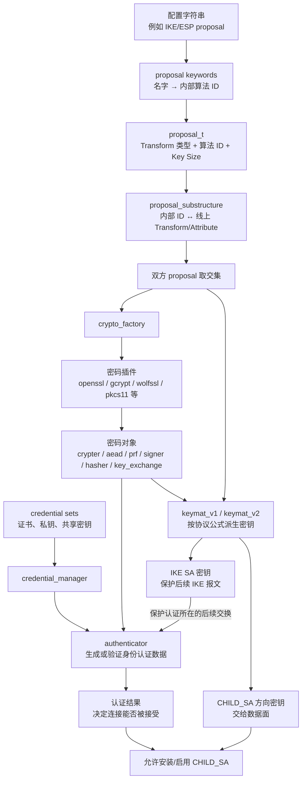

### 四个对象各自负责什么

| 对象 | 负责 | 不负责 |
| --- | --- | --- |
| `proposal_t` | 表达希望/选中了什么算法 | 不执行密码运算 |
| `crypto_factory` + plugin | 根据算法 ID 创建真实密码对象 | 不决定协议消息顺序和 KDF 输入 |
| `credential_manager` + authenticator | 找证书/私钥并完成身份认证；认证结果决定连接能否被接受 | 不负责 IKE 初始密钥的 KDF，也不安装 ESP SA |
| `keymat_v1/v2` | 在认证完成前就可按对应协议公式生成 IKE 密钥，并继续生成 CHILD 密钥 | 不替代身份认证，默认也不逐包处理 ESP 业务流量 |

这里的时间顺序很重要：密钥交换和 Nonce 先让双方派生保护 IKE 后续消息所需的密钥，身份认证再在受保护的上下文中证明“对端是谁”。不能把“身份认证通过”误解成 IKE 初始密钥的输入条件；它是接受连接和启用协商结果的安全门槛。

因此“OpenSSL/Tongsuo 支持 SM4”最多证明密码原语可用。要证明国密 IPsec，还要继续证明 proposal、线上编号、协议公式、CHILD_SA 和 XFRM 全链成立。

## 7. 图六：CHILD_SA 如何把协商结果安装进 Linux

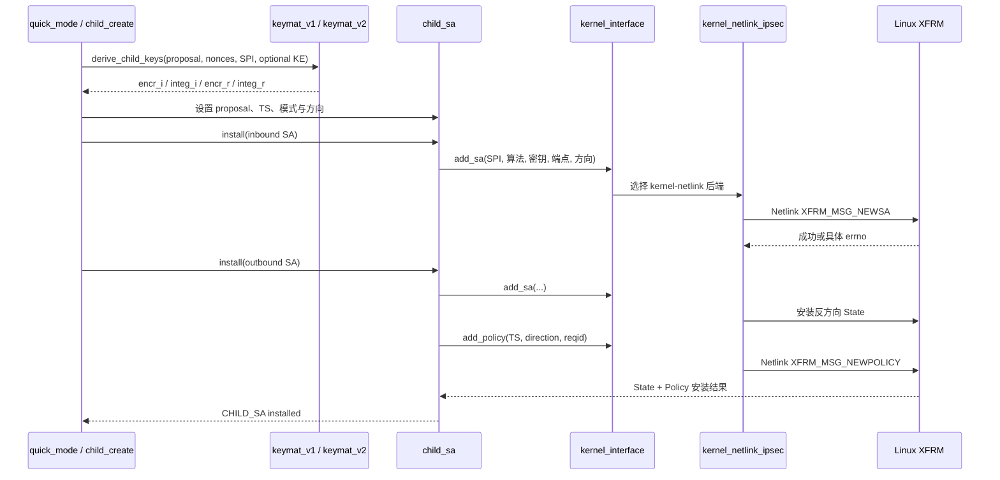

### 为什么至少要两条 State

IPsec SA 是单向的。双向通信通常需要：

```text
出站 SA：本机加密 → 对端解密
入站 SA：对端加密 → 本机解密
```

它们具有不同 SPI、方向密钥和序列号状态。Traffic Selector 则进一步生成/关联 XFRM Policy，决定哪些业务包可以使用这些 State。

### 源码锚点

```text
src/libcharon/sa/ikev1/tasks/quick_mode.c
src/libcharon/sa/ikev2/tasks/child_create.c

src/libcharon/sa/child_sa.c
  install() / install_internal()

src/libcharon/kernel/kernel_interface.c
  add_sa()
  add_policy()

src/libcharon/plugins/kernel_netlink/kernel_netlink_ipsec.c
  add_sa()
  add_policy()
```

## 8. 图七：隧道建立后，一个业务包的一生

### 8.1 出站方向

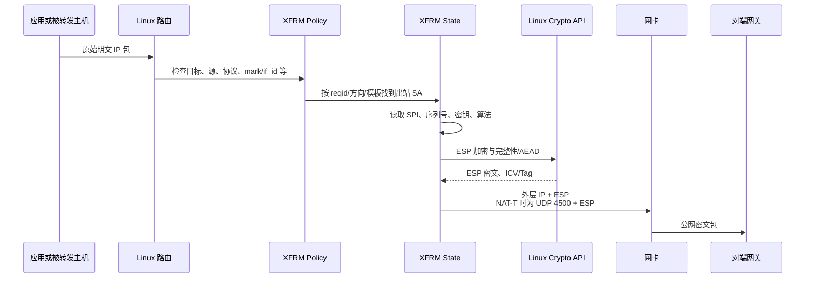

### 8.2 入站方向

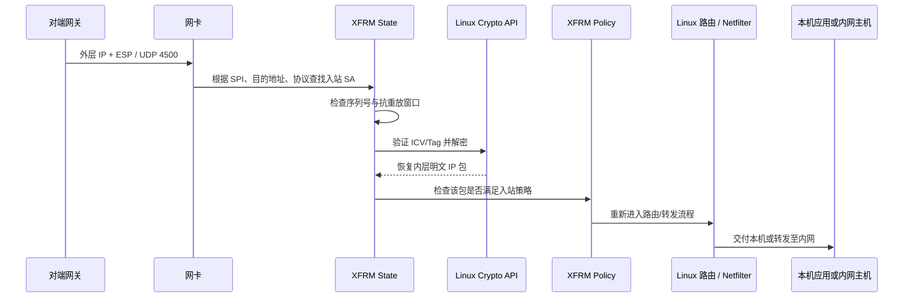

### 这张图最关键的结论

`charon` 没有出现在图中。这不是遗漏，而是默认架构本身：

```text
charon 负责谈判并安装规则
Linux XFRM 负责长期逐包执行
```

因此：

- `IKE_SA established` 只证明控制面走到一定阶段；
- `CHILD_SA established` 还应结合 `ip xfrm state/policy` 证明内核安装；
- `ping` 成功仍需结合外层 PCAP，排除流量绕路；
- strongSwan 链接 Tongsuo 不代表内核 ESP 自动调用 Tongsuo。

## 9. 图八：运行期间谁负责 rekey、DPD 和删除

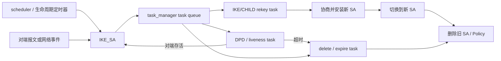

首次建链成功并不代表实现完整。协议、国密算法或 HSM 接入都必须继续验证：

- CHILD_SA rekey 后是否仍使用目标算法；
- 新旧 SPI 是否平滑切换；
- DPD、删除和重连是否清理旧 XFRM 状态；
- 并发 rekey 时是否出现重复 SA、锁竞争或短时断流；
- HSM/密码卡会话是否随 SA 生命周期正确释放。

## 10. 图九：看到故障时，从哪一层开始查

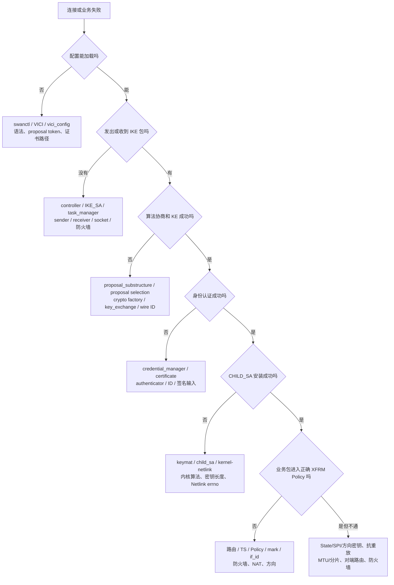

### 最小证据组合

| 层 | 最有用的证据 |
| --- | --- |
| 配置层 | `swanctl --list-conns`、加载错误、最终 proposal |
| IKE 报文层 | 双方 charon 日志、UDP 500/4500 PCAP |
| 认证层 | 证书链、ID、AUTH 验证日志；不得记录私钥 |
| CHILD_SA 层 | `swanctl --list-sas`、协商后的 ESP proposal |
| 内核层 | `ip xfrm state`、`ip xfrm policy`、Netlink 错误 |
| 业务层 | 内外接口 PCAP、路由、计数器、MTU/分片结果 |

## 11. 把九张图压缩成一句调用链

```text
swanctl 配置/命令
→ VICI
→ ike_cfg / peer_cfg / child_cfg
→ controller
→ IKE_SA
→ task_manager_v1/v2
→ 具体协议 task
→ message/payload + crypto/credential
→ keymat
→ CHILD_SA
→ kernel_interface
→ kernel-netlink
→ XFRM State/Policy
→ Linux Crypto API
→ ESP 业务流量
```

如果你能够对着这条链回答下面五个问题，就已经建立了 strongSwan 的整体源码坐标：

1. 当前处理的是配置、IKE 报文、密钥元数据还是业务包？
2. 当前在用户态 charon，还是已经进入 Linux 内核？
3. 当前对象是 `IKE_SA` 还是 `CHILD_SA`？
4. 当前失败属于协商、认证、派生、安装还是流量命中？
5. 应该用源码、日志、PCAP 还是 XFRM 状态证明结论？

## 12. 建议的源码阅读顺序

不要按目录从头通读。按照数据流逐段进入：

```text
第一遍：图一 + 图四 + 图七
        只建立控制面/数据面与 v1/v2 分叉

第二遍：vici_config.c → controller.c → ike_sa.c
        看配置怎样变成运行对象

第三遍：receiver.c → process_message_job.c → task_manager
        看一个 IKE 报文怎样被调度

第四遍：一个具体 task + keymat
        IKEv2 可选 ike_init；IKEv1 可选 main_mode

第五遍：child_sa.c → kernel_interface.c → kernel_netlink_ipsec.c
        看协商结果怎样进入 XFRM
```

## 13. 本文结论的边界

### 已由上游源码确认

- 配置经 swanctl/VICI 进入三类配置对象；
- `IKE_SA` 持有按版本创建的 task manager；
- receiver 将消息交给工作队列，随后按 IKE_SA 串行处理；
- v1/v2 使用不同 task 与 keymat，但最终汇合到 `CHILD_SA`；
- `child_sa` 经 kernel interface 和 kernel-netlink 安装 XFRM SA/Policy；
- 默认内核数据面中，业务 ESP 包不逐包经过 charon。

### 尚待采购代码核查

- 厂商实际 strongSwan 版本、补丁和目录结构；
- 是否使用 `kernel-netlink`、`kernel-libipsec` 或自研/硬件数据面；
- GM/T 0022、IKEv2 SM 扩展、密码卡和 HSM 的实际落点；
- Web 管理配置如何映射到 strongSwan 配置对象；
- 产品是否改写 task、keymat、credential 或 XFRM 安装路径。

## 关联文档

- [strongSwan 源码导览](strongSwan%20源码导览.md)
- [strongSwan 6.0.3 总体框架与关键调用流程](strongSwan%206.0.3%20总体框架与关键调用流程.md)
- [strongSwan IKEv2 状态机与密钥生命周期源码精读](strongSwan%20IKEv2%20状态机与密钥生命周期源码精读.md)
- [GM/T 0022—2023 与 strongSwan 6.0.3 上游差距分析](GM-T%200022-2023%20与%20strongSwan%206.0.3%20上游差距分析.md)
- [strongSwan Proposal 到 XFRM 源码精读附录](strongSwan%20Proposal%20到%20XFRM%20源码精读附录.md)
