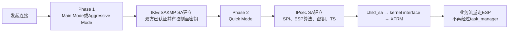
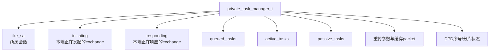
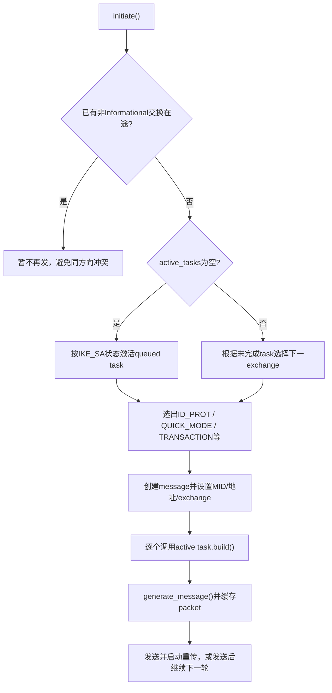
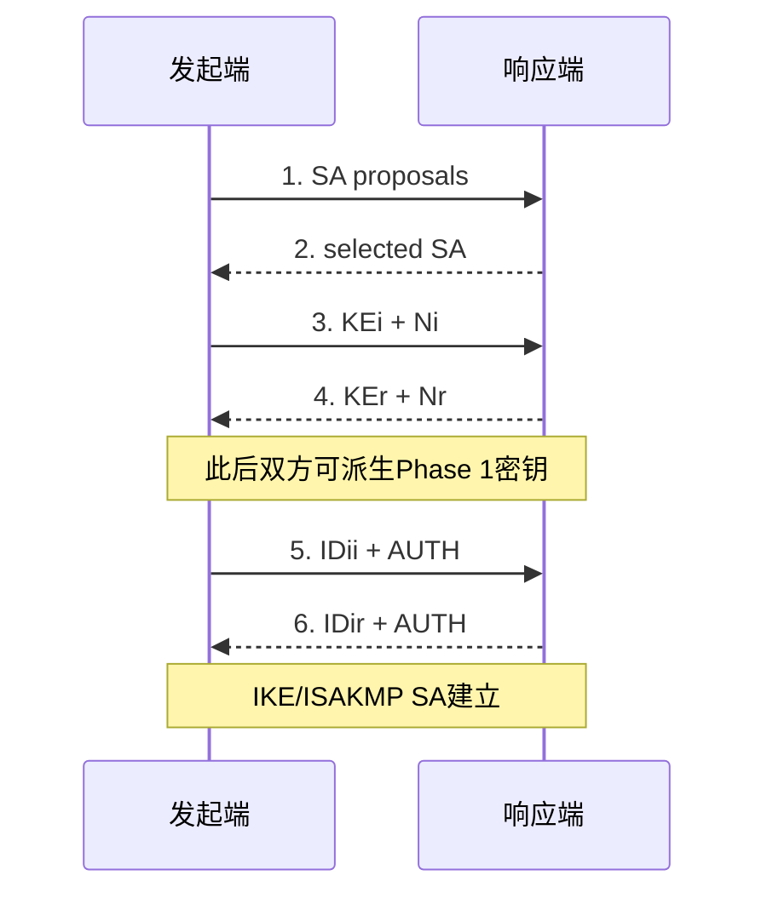
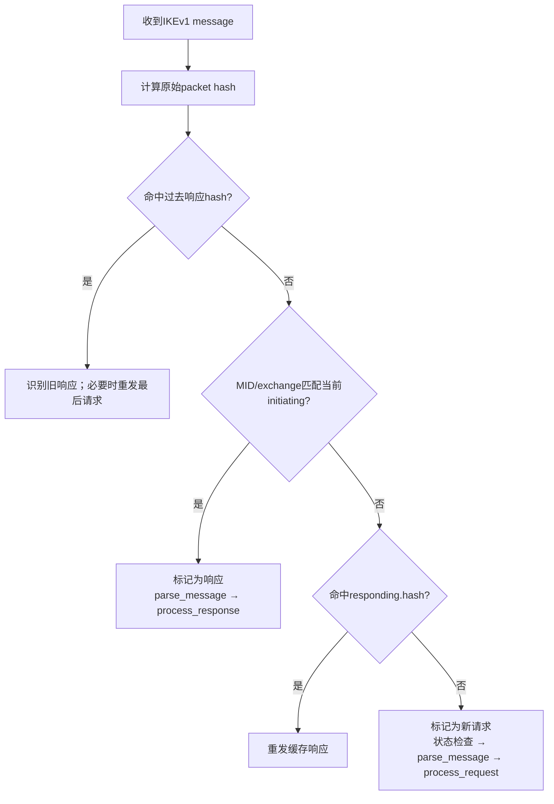
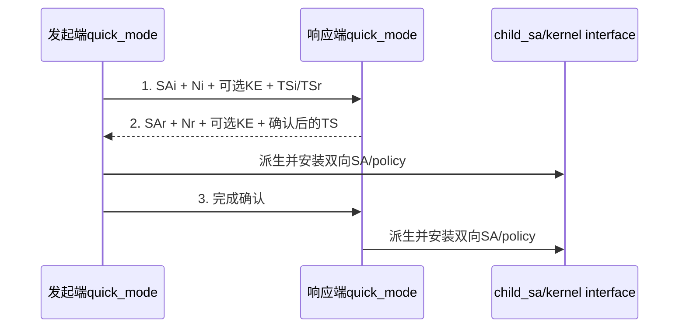

> 源码基线：strongSwan 6.0.3，commit `472dcd8bb50a91f156b725ff56992352b573f7dd`<br>
> 前置阅读：[Task Manager 分层定位图](strongSwan%20从系统到函数：Task%20Manager%20分层定位图.md)<br>
> 本文目的：从“它在系统哪里”开始，追踪 IKEv1 Main Mode 与 Quick Mode 怎样被 manager 和具体 task 共同执行。本文是上游 IKEv1 分析，不把它表述为 GM/T 0022 的现成实现。

## 1. 先给 IKEv1 Task Manager 定位

| 问题 | 回答 |
| --- | --- |
| 在哪里 | charon 进程 → 一个 `IKE_SA` 对象内部 |
| 负责什么 | 选择 IKEv1 Exchange、调度 task、区分请求/响应、Message ID、缓存与重传 |
| 上游实现 | `src/libcharon/sa/ikev1/task_manager_v1.c` |
| 上游具体状态机 | `ikev1/tasks/main_mode.c`、`aggressive_mode.c`、`quick_mode.c` 等 |
| 输入 | 建链/删链等意图，或对端 IKEv1 `message_t` |
| 输出 | 下一条 IKEv1 消息、更新后的 IKE_SA、最终可安装的 CHILD_SA |
| 不负责 | 算法本体、Payload通用编解码、ESP逐包处理 |

一句话理解：

> `task_manager_v1` 决定“现在跑 Main、Quick 还是 Informational，以及这条消息属于哪次交换”；`main_mode`、`quick_mode` 等 task 决定“本轮具体读取/写入哪些 Payload，协议状态怎样前进”。

## 2. 先看 IKEv1 的两阶段结构



在源码里：

| 协议阶段 | manager 选择的 exchange | 主要 task |
| --- | --- | --- |
| Phase 1 标准主模式 | `ID_PROT` | `main_mode` |
| Phase 1 激进模式 | `AGGRESSIVE` | `aggressive_mode` |
| Phase 2 | `QUICK_MODE` | `quick_mode` |
| 扩展认证/配置 | `TRANSACTION` | `xauth` / `mode_config` |
| DPD、Notify、删除 | `INFORMATIONAL_V1` | `isakmp_dpd` / `informational` / delete task |

## 3. manager 内部保存的“长期上下文”

`task_manager_v1.c:84` 的私有结构不是协议报文本身，而是调度一段会话所需的账本。



### 3.1 `initiating`

记录本端当前发出的交换：

- `mid`：Message ID；
- `type`：当前 exchange；
- `packets`：已编码请求的缓存，用于重传；
- `old_hashes`：已收到过的响应哈希，避免旧响应重复推进状态；
- `seqnr/retransmitted`：重传调度状态。

### 3.2 `responding`

记录对端请求的处理上下文：

- 当前请求的 `mid` 与消息哈希；
- 已生成的响应 packet 缓存；
- 收到相同请求时直接重发缓存响应。

### 3.3 为什么 v1 代码看起来比想象中复杂

IKEv1 没有像 IKEv2 那样依靠一个清晰的 Request 位和双方独立递增 MID 来完成全部分类。Phase 1、Quick Mode、三消息交换、XAuth/Mode Config 和兼容行为各有特例，所以 manager 还要结合：

```text
exchange type
+ Message ID
+ 当前active task
+ 原始消息hash
+ IKE_SA状态
```

来判断一条消息到底是当前响应、新请求还是重传。

## 4. 主动发起 IKEv1：从意图到第一条 Main Mode 消息

### 4.1 `queue_ike()`只创建工作，不立即发包

`task_manager_v1.c:1552-1588` 依次排入：

```text
isakmp_vendor
→ isakmp_cert_pre
→ main_mode 或 aggressive_mode
→ isakmp_cert_post
→ isakmp_natd
```

是否选择 Aggressive Mode 来自 `peer_cfg` 的 `OPT_IKEV1_AGGRESSIVE`；否则使用 Main Mode。

这里的输出是 `queued_tasks` 变多，还没有网络包。

### 4.2 `initiate()`把意图变成一次 exchange

`task_manager_v1.c:441-704` 的主逻辑是：



关键代码关系：

- `task_manager_v1.c:465-478`：`IKE_CREATED` 时激活 Main/Aggressive 及辅助任务；
- `task_manager_v1.c:468-475`：选择 `ID_PROT` 或 `AGGRESSIVE`；
- `task_manager_v1.c:596-610`：必要时生成 MID，并建立 `message_t`；
- `task_manager_v1.c:614-652`：调用所有 active task 的 `build()`；
- `task_manager_v1.c:665-680`：编码、缓存并进入重传。

## 5. Main Mode 六条消息怎样在源码中向前推进

Main Mode 是三轮请求/响应。manager 一直负责“发哪一轮、等待哪一轮”；`main_mode` task 的 `state` 负责记住协议已走到哪里。



### 5.1 第一轮：协商 IKE Proposal

#### 发起端

```text
task_manager_v1.initiate()
→ main_mode.build_i(state=MM_INIT)
→ 从ike_cfg读取proposals
→ sa_payload_create_from_proposals_v1()
→ message.add_payload(SA)
→ state = MM_SA
→ 返回NEED_MORE
```

源码：`ikev1/tasks/main_mode.c:238-296`。

输入：`IKE_SA` 中的 `ike_cfg/peer_cfg`。<br>
对象变化：`main_mode.state` 从 `MM_INIT` 变为 `MM_SA`。<br>
输出：第一条带 SA Payload 的 `ID_PROT` 消息。<br>
为什么 task 没被销毁：返回 `NEED_MORE`，表示后面还要处理响应。

#### 响应端

```text
task_manager_v1.process_message()
→ 识别为新请求
→ process_request()
→ 创建main_mode等passive task
→ main_mode.process_r(state=MM_INIT)
→ 读取SA Payload并选择proposal
→ state = MM_SA
→ build_response()
→ main_mode.build_r(state=MM_SA)
→ 返回选中的SA
```

源码：

- `task_manager_v1.c:963-1002`：按 `ID_PROT` 创建被动 task；
- `main_mode.c:356-416`：读取并选择 proposal；
- `main_mode.c:498-512`：构造响应 SA Payload。

### 5.2 第二轮：交换 KE 与 Nonce并派生密钥

发起端收到第 2 条消息：

```text
process_response()
→ main_mode.process_i(state=MM_SA)
→ 校验并保存对端选择的proposal
→ 返回NEED_MORE
→ manager清理本轮缓存后再次initiate()
→ 发现main_mode仍在active_tasks
→ 继续选择ID_PROT
→ main_mode.build_i(state=MM_SA)
→ 创建hasher和DH对象，加入KEi与Ni
→ state = MM_KE
```

源码：`main_mode.c:628-680` 与 `298-328`。

响应端处理第 3 条消息并构造第 4 条：

```text
main_mode.process_r(state=MM_SA)
→ 读取KEi/Ni
→ state = MM_KE

main_mode.build_r(state=MM_KE)
→ 加入KEr/Nr
→ ph1->derive_keys(...)
→ 返回NEED_MORE
```

源码：`main_mode.c:418-442` 与 `514-524`。

这里必须区分：manager 只保证 task 按正确轮次被调用；共享秘密、Nonce 和 Phase 1 密钥派生由 `main_mode` 通过 `ph1`/`keymat_v1` 完成。

### 5.3 第三轮：交换身份并认证

发起端处理第 4 条消息后：

```text
main_mode.process_i(state=MM_KE)
→ 读取KEr/Nr
→ 派生本端Phase 1密钥
→ 返回NEED_MORE

main_mode.build_i(state=MM_KE)
→ 加入本端ID
→ ph1->build_auth(...)
→ state = MM_AUTH
```

响应端：

```text
main_mode.process_r(state=MM_KE)
→ 读取发起端ID
→ 选择peer_cfg
→ ph1->verify_auth(...)
→ 授权检查
→ state = MM_AUTH

main_mode.build_r(state=MM_AUTH)
→ 加入响应端ID与AUTH
→ establish()
→ 返回SUCCESS
```

发起端收到第 6 条消息后由 `main_mode.process_i(state=MM_AUTH)` 校验响应端身份并完成建立。

关键点：

- manager 看见 `SUCCESS` 后移除并销毁 `main_mode` task；
- `IKE_SA` 的长期密钥和身份状态仍保留；
- 后续 Quick Mode 使用这条 IKE/ISAKMP SA 保护 Phase 2 交换。

## 6. 收到 IKEv1 消息时，manager 怎样判断请求、响应和重传

入口是 `task_manager_v1.c:1320-1493` 的 `process_message()`。



### 6.1 为什么不能只看 MID

Phase 1 的 MID 常为 0，而后续 Quick/Transaction/Informational 使用新 MID；此外三消息交换和一些兼容行为需要结合当前 exchange 与 active task。因此代码同时查看：

- `initiating.mid`；
- `initiating.type`；
- active task 是否存在；
- 原始消息哈希；
- `responding.hash`；
- 当前 IKE_SA 状态。

### 6.2 解析发生在分类之后

`parse_message()` 位于 `task_manager_v1.c:1245`。它使用当前 `keymat` 解析/验证消息正文并处理分片。只有分类、解析和校验通过后，具体 task 才会处理 Payload。

## 7. `process_request()`怎样把 exchange 映射为 task

`task_manager_v1.c:963-1131` 的核心映射是：

| 收到的 exchange | 前置条件 | 创建/选择的 task |
| --- | --- | --- |
| `ID_PROT` | 新建或连接中的 IKE_SA | vendor、cert_pre、`main_mode`、cert_post、NATD |
| `AGGRESSIVE` | 新建或连接中的 IKE_SA | vendor、cert_pre、`aggressive_mode`、cert_post、NATD |
| `QUICK_MODE` | IKE_SA 必须已建立 | `quick_mode` |
| `INFORMATIONAL_V1` | 依消息内容 | DPD 或 `informational` |
| `TRANSACTION` | 依状态 | `xauth` 或 `mode_config` |

然后 manager 对 passive task 调用：

```text
task.process(request)
→ 根据返回值保留/移除/失败
→ 若需要响应，build_response()
→ task.build(response)
→ 编码、缓存并发送
```

## 8. Quick Mode 如何把 Phase 2 变成 CHILD_SA

### 8.1 任务从哪里来

`task_manager_v1.c:1693-1720` 的 `queue_child()` 创建 `quick_mode` task 并排入队列。`initiate()` 在 IKE_SA 已建立时激活它，选择 `QUICK_MODE` 并为后续交换生成新的随机 MID。

### 8.2 三消息结构



### 8.3 第一条消息：发起端准备 CHILD_SA 候选

`quick_mode.c:826-959` 的 `build_i(QM_INIT)`：

1. 从 `child_cfg` 读取 mode、proposal 与 TS；
2. 创建尚未安装的 `child_sa` 对象；
3. 向内核申请本端 SPI；
4. 准备 Proposal、Nonce、可选 PFS KE 和 TS；
5. 返回 `NEED_MORE`，等待响应。

注意：此时“创建了 `child_sa` 对象”不等于“XFRM 已安装完成”。

### 8.4 第二条消息：响应端选择并返回结果

`quick_mode.c:1079-1277` 的 `process_r(QM_INIT)` 解析 SA、TS、Nonce、可选 KE，选择匹配的 `child_cfg` 与 proposal；随后 `build_r(QM_INIT)` 在 `1283-1347`：

1. 向内核申请响应端 SPI；
2. 构造选定的 SA Payload；
3. 加入响应端 Nonce、可选 KE 和 TS；
4. 把 task 状态改为 `QM_NEGOTIATED`。

### 8.5 安装发生在哪里

发起端处理第 2 条消息时，`quick_mode.c:1361-1431`：

```text
选择对端返回的proposal
→ 保存对端SPI、Nonce、KE与TS
→ install()
→ state = QM_NEGOTIATED
→ 返回NEED_MORE
```

`quick_mode.c:272-367` 的 `install()` 调用 `keymat_v1->derive_child_keys()`，再调用 `child_sa->install()` 安装两个方向的 SA/policy。

响应端在收到第 3 条消息时，`process_r(QM_NEGOTIATED)` 再执行 `install()`。至此双方数据面才具备成立条件。

## 9. 重传为什么属于 manager 而不是具体 task

task 负责协议语义，但重传需要重新发送**完全相同的已编码 packet**，不能让 task 重新随机生成 Nonce、SPI 或签名。因此 manager 在生成消息后缓存 packet：

```text
task.build()
→ message.generate()
→ 缓存packet数组
→ 定时器触发retransmit()
→ 原样重发缓存packet
```

对端重复发送同一个请求时，也优先重发缓存响应，而不是再次执行可能带副作用的 task。

## 10. 错误理解与正确理解

### 错误：`task_manager_v1.c`包含整个 IKEv1 协议

正确：它包含调度、方向判断、Exchange/MID、重传和队列；Main/Quick 的 Payload 与阶段逻辑在具体 task。

### 错误：Main Mode完成后 IPsec隧道已经能传业务

正确：Main Mode只建立 IKE/ISAKMP SA；还要由 Quick Mode 建立并安装 IPsec SA。

### 错误：新增 SM4 需要重写 Main Mode

正确：若只增加可协商算法，主要改 proposal/Transform、crypto factory、keymat及内核映射；只有协议消息语义或认证/派生阶段变化时才深入 Main/Quick task 和 manager。

### 错误：上游 IKEv1 等于 GM/T 0022

正确：上游代码提供 IKEv1 框架与扩展点；GM/T 0022 的协议画像、证书/身份认证、算法标识、密钥派生和 ESP 要求仍要逐项做差距分析。

## 11. 最小源码阅读练习

只追 Main Mode 第一轮，不要一次读完整文件：

```bash
cd /path/to/workspace/learning-sources/strongswan-6.0.3

sed -n '1552,1588p' src/libcharon/sa/ikev1/task_manager_v1.c
sed -n '441,680p' src/libcharon/sa/ikev1/task_manager_v1.c
sed -n '238,355p' src/libcharon/sa/ikev1/tasks/main_mode.c
sed -n '356,527p' src/libcharon/sa/ikev1/tasks/main_mode.c
```

阅读时只记录四列：

| 函数 | 输入从哪里来 | 改了哪个对象 | 输出交给谁 |
| --- | --- | --- | --- |
| `queue_ike()` | `IKE_SA`/`peer_cfg` | `queued_tasks` | `initiate()` |
| `initiate()` | 队列、IKE_SA状态 | active队列、initiating上下文 | `task.build()`/sender |
| `main_mode.build_i(MM_INIT)` | `ike_cfg` proposal | message、task state | message生成层 |
| `main_mode.process_r(MM_INIT)` | 收到的SA Payload | IKE_SA proposal、task state | `build_response()` |

## 12. 掌握检查

1. 为什么 Main Mode 已完成仍不能证明 ESP 可用？
2. `queue_ike()` 与 `initiate()` 的区别是什么？
3. Main Mode 的三轮中，`main_mode.state` 如何从 `MM_INIT` 走到 `MM_AUTH`？
4. 为什么 responder 收到第二轮请求时不需要重新创建 `main_mode` task？
5. IKEv1 manager 为什么同时使用 MID、exchange type 和消息哈希？
6. Quick Mode 的 `child_sa_create()` 与 `child_sa->install()` 分别表示什么？
7. 若只新增一种加密算法，为什么通常不应先修改 `task_manager_v1`？

## 13. 上游源码入口

- [`task_manager_v1.c`](https://github.com/strongswan/strongswan/blob/472dcd8bb50a91f156b725ff56992352b573f7dd/src/libcharon/sa/ikev1/task_manager_v1.c)
- [`main_mode.c`](https://github.com/strongswan/strongswan/blob/472dcd8bb50a91f156b725ff56992352b573f7dd/src/libcharon/sa/ikev1/tasks/main_mode.c)
- [`quick_mode.c`](https://github.com/strongswan/strongswan/blob/472dcd8bb50a91f156b725ff56992352b573f7dd/src/libcharon/sa/ikev1/tasks/quick_mode.c)
- [`keymat_v1.c`](https://github.com/strongswan/strongswan/blob/472dcd8bb50a91f156b725ff56992352b573f7dd/src/libcharon/sa/ikev1/keymat_v1.c)
