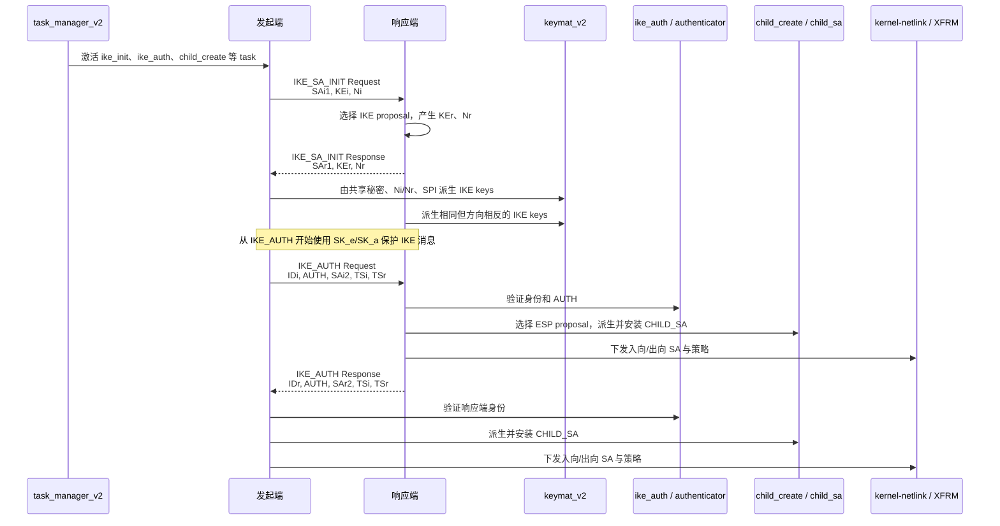

> 文档类型：源码精读 / 接管准备基线<br>
> 研究基线：strongSwan 6.0.3，官方 release commit `472dcd8bb50a91f156b725ff56992352b573f7dd`<br>
> 研究范围：IKEv2 建链主路径、IKE 密钥、身份认证、首个 CHILD_SA、Linux XFRM 下发<br>
> 边界：本文描述固定上游版本，不代表目标产品产品采用相同版本、相同文件或相同改造方式

> **路线边界：本文不是 GM/T 0022 合规实现说明**
> GM/T 0022—2023 规定的是 IKEv1/ISAKMP 衍生的 1.1 两阶段协议画像，包含双证书、SM2 数字信封和专用密钥派生。本文研究的是 strongSwan 上游 **IKEv2** 状态机，用于掌握国际协议底座及未来 IKEv2 + SM/PQC 扩展。即使在本链路中加入 SM2、SM3、SM4，也只能证明“IKEv2 国密算法扩展”；没有另一份适用标准或双方 profile 时，不能称为 GM/T 0022 国密 IPsec。
>

---

## 1. 这篇文档解决什么问题

前几篇文档已经回答了 strongSwan 有哪些目录、Proposal 如何进入 Transform、CHILD_SA 如何走到 XFRM。本文补上中间最容易断开的部分：

> 收到“发起连接”的要求以后，strongSwan 究竟如何驱动多个 task，完成 IKE_SA_INIT、派生 IKE 密钥、用 IKE_AUTH 证明身份，并在同一次建链过程中建立首个 CHILD_SA？

先记住一条主链：

```text
task_manager_v2
  → ike_init：协商 IKE proposal、交换 KE/Nonce
  → keymat_v2：派生 IKE SA 七组密钥
  → message：用 IKE SA 密钥保护后续 IKE 消息
  → ike_auth + authenticator：身份与签名验证
  → child_create：协商并派生首个 CHILD_SA 密钥
  → child_sa：组织双向 SA 与策略
  → kernel-netlink：下发 Linux XFRM
```

这条链解释了三个经常混淆的结论：

1. `IKE_SA_INIT` 成功，只能说明 IKE proposal、KE、Nonce 和 IKE 密钥阶段走通；它还没有完成对端身份认证。
2. `IKE_AUTH` 成功，说明身份认证和 IKE SA 建立完成；首个 CHILD_SA 可以同时建立，也可能因数据面安装失败而没有建立。
3. 日志出现 `IKE_SA established`，不能单独证明 ESP 正在使用目标算法；还要核对 `CHILD_SA established`、XFRM state/policy 和真实业务流量。

---

## 2. 证据口径与源码基线

本文使用以下标记：

- **【上游源码确认】**：能从 strongSwan 6.0.3 固定提交直接确认；
- **【协议确认】**：能从 RFC 7296 直接确认；
- **【改造判断】**：根据上游扩展点得出的工程判断，不等于产品现状；
- **【产品待核对】**：必须等交付源码、构建产物或运行证据后才能确认。

本地学习源码树存在历史实验修改。为避免把实验代码误当作上游能力，本文行号使用以下方法从固定提交导出干净源码后复核：

```bash
git -C learning-sources/strongswan-6.0.3 rev-parse HEAD
git -C learning-sources/strongswan-6.0.3 archive HEAD | tar -x -C <临时目录>
```

输出提交应为：

```text
472dcd8bb50a91f156b725ff56992352b573f7dd
```

行号是版本相关的辅助定位；真正稳定的锚点始终是“文件路径 + 函数名”。

---

## 3. 先看全景：四个 IKE 消息并不是四段孤立代码

RFC 7296 的常规建链只有两次 request/response exchange，共四个消息。strongSwan 没有为每个报文写一个从头到尾的巨大函数，而是让多个 task 在同一条消息上依次增加或处理自己的 payload。



【协议确认】`IKE_SA_INIT` 协商 IKE SA 参数并交换 Nonce 与 Diffie-Hellman 值；`IKE_AUTH` 传输身份、证明对应秘密的持有，并通常建立首个 ESP/AH CHILD_SA。

【上游源码确认】strongSwan 的 task manager 把这些职责拆成并列 task。`ike_init`、`ike_auth` 和 `child_create` 会在同一轮建链中被激活，但只在适合自己的 exchange 上工作。

---

## 4. 第一层：`task_manager_v2` 怎样驱动状态机

### 4.1 关键文件

```text
src/libcharon/sa/ikev2/task_manager_v2.c
```

### 4.2 发起端从哪里开始

核心入口是：

```c
METHOD(task_manager_t, initiate, status_t, ...)
```

【上游源码确认】在 `task_manager_v2.c:516-564`，当 IKE_SA 处于 `IKE_CREATED` 时，`initiate()` 激活一组任务：

```text
TASK_IKE_VENDOR
TASK_IKE_INIT
TASK_IKE_NATD
TASK_IKE_CERT_PRE
TASK_IKE_AUTH
TASK_IKE_CERT_POST
TASK_IKE_CONFIG
TASK_IKE_AUTH_LIFETIME
TASK_IKE_MOBIKE
TASK_IKE_ESTABLISH
TASK_CHILD_CREATE
```

这并不表示所有 task 都会立刻完成。每个 task 的 `build()`/`process()` 根据当前 exchange 决定：

- `SUCCESS`：这个 task 已完成，可以移除；
- `NEED_MORE`：这一轮做了一部分，后续 exchange 还要继续；
- `FAILED` 或 `DESTROY_ME`：建链不能继续。

在 `task_manager_v2.c:692-705`，task manager 创建消息、设置 exchange type，然后依次调用活动 task 的 `build()`。这就是“多个 task 共同拼成一个 IKE 报文”的实现基础。

### 4.3 为什么先发 IKE_SA_INIT，下一轮自动进入 IKE_AUTH

`initiate()` 根据活动 task 类型选择 exchange：

```text
TASK_IKE_INIT       → IKE_SA_INIT
TASK_IKE_AUTH       → IKE_AUTH
TASK_CHILD_CREATE   → CREATE_CHILD_SA（后续单独建 CHILD_SA 时）
```

初始建链时，`ike_auth` 和 `child_create` 已经排队，但它们在 IKE_SA_INIT 阶段只收集必要信息或返回 `NEED_MORE`。`ike_init` 完成并被移除后，下一次 `initiate()` 才选择 IKE_AUTH。

### 4.4 响应是怎样回到对应 task 的

在 `task_manager_v2.c:792-923`，`process_response()`：

1. 先检查收到的 exchange type 是否与当前等待的一致；
2. 依次执行 task 的 `pre_process()`；
3. 再执行 `process()`；
4. 最后执行 `post_process()`；
5. 消息处理完成后递增 Message ID，并再次调用 `initiate()` 推进下一轮。

在 `task_manager_v2.c:1850` 的 `process_message()` 中，request 与 response 都先按 Message ID 判断是否为重传，再解析消息并送入请求或响应处理路径。

这说明 task manager 不只是“顺序调用函数”，还承担：

- exchange 与 Message ID 对应；
- 重传识别与响应重发；
- task 生命周期管理；
- 状态推进与失败销毁。

---

## 5. 第二层：`ike_init` 如何完成 IKE_SA_INIT

### 5.1 关键文件与入口

```text
src/libcharon/sa/ikev2/tasks/ike_init.c
```

四个角色相关入口：

| 角色 | 函数 | 6.0.3 行号 |
| --- | --- | --- |
| 发起端构造 Request | `build_i()` | 831 |
| 发起端处理 Response | `process_r()` | 960 |
| 响应端构造 Response | `build_r()` | 1116 |
| 响应端处理 Request | `process_i()` | 1316 |

函数名中的 `i/r` 不是 input/output，而是 initiator/responder 视角：

- `build_i`：initiator 构建；
- `process_r`：initiator 处理 responder 的消息；
- `build_r`：responder 构建；
- `process_i`：responder 处理 initiator 的消息。

### 5.2 发起端怎样构造 SA、KE、Nonce

`ike_init.c:345-415` 的主过程是：

```text
ike_cfg->get_proposals()
  → 按当前 KE 方法调整 proposal 顺序
  → sa_payload_create_from_proposals_v2()
  → ke_payload_create_from_key_exchange()
  → nonce_payload->set_nonce()
  → 三类 payload 加入 message
```

输入与输出：

| 项目 | 输入 | 输出 |
| --- | --- | --- |
| SA | `ike_cfg` 中的 IKE proposal | IKEv2 SA payload |
| KE | `key_exchange_t` 生成的本端公开值 | KE payload |
| Nonce | `nonce_gen` 生成的随机数 | Nonce payload |

这里要区分：

- SA payload 提供算法组合；
- KE payload 携带密钥交换公开值，不携带最终共享秘密；
- Nonce 防止旧会话材料被直接复用，并参与密钥派生。

### 5.3 响应端怎样选择 proposal

`ike_init.c:490-552` 的 `process_sa_payload()` 从收到的 SA payload 取出 proposals，再调用：

```c
this->proposal = ike_cfg->select_proposal(ike_cfg, proposal_list, flags);
```

如果没有交集，代码会尝试其他匹配配置；仍失败时触发 proposal mismatch 告警。

因此“配置中写了某个算法”只证明它可能进入候选集合。真正的协商结果是 `select_proposal()` 返回的 `this->proposal`。

### 5.4 共享秘密何时变成 IKE 密钥

`ike_init.c:992-1034` 的 `derive_keys_internal()` 收集：

```text
选中的 proposal
+ 一个或多个 key_exchange_t
+ Ni / Nr
+ IKE SPIi / SPIr
```

随后调用：

```c
this->keymat->derive_ike_keys(...)
```

失败时，`ike_init.c:1058-1061` 明确记录 `key derivation failed` 并返回 `FAILED`。

---

## 6. 第三层：`keymat_v2` 如何生成 IKE SA 密钥

### 6.1 关键文件

```text
src/libcharon/sa/ikev2/keymat_v2.c
```

核心入口：

```c
derive_ike_keys()
```

位置：`keymat_v2.c:239`。

### 6.2 先根据 proposal 创建实际密码对象

`keymat_v2.c:255-303` 先从选中的 proposal 取出 PRF、加密和完整性算法，再通过 `lib->crypto` 创建对应对象。

```text
proposal 中的 PRF ID
  → lib->crypto->create_prf()

proposal 中的加密/完整性 ID
  → create_ike_traditional() 或 create_ike_aead()
```

如果 proposal 能解析，但运行时没有插件提供真实算法对象，代码会在这里失败。这是“协议标识存在”与“密码实现可用”之间的边界。

### 6.3 IKE 密钥的实际派生顺序

首次建链时：

```text
SKEYSEED = prf(Ni | Nr, g^ir)

KEYMAT = prf+(SKEYSEED, Ni | Nr | SPIi | SPIr)

KEYMAT 切分为：
SK_d | SK_ai | SK_ar | SK_ei | SK_er | SK_pi | SK_pr
```

代码锚点：

- `keymat_v2.c:305-339`：取密钥交换共享秘密并组织 Nonce；
- `keymat_v2.c:339-358`：计算 `SKEYSEED`；
- `keymat_v2.c:391-425`：执行 PRF+ 并切分 KEYMAT；
- `keymat_v2.c:437`：把 IKE 加密/完整性密钥设置到双向 AEAD 包装对象；
- `keymat_v2.c:441-454`：按本端角色保存构建与验证 AUTH 所需的 `SK_p`。

### 6.4 七组密钥分别做什么

| 密钥 | 作用 | 是否用于 ESP |
| --- | --- | --- |
| `SK_d` | 派生 CHILD_SA 密钥，以及 IKE SA rekey | 间接用于派生，不直接加密 ESP |
| `SK_ai` / `SK_ar` | 传统 IKE 加密套件的双向完整性保护 | 否 |
| `SK_ei` / `SK_er` | IKE 消息双向加密 | 否 |
| `SK_pi` / `SK_pr` | 构造双方身份认证所需的 AUTH 输入 | 否 |

正确理解是：

```text
IKE SA keys 保护 IKE 控制面
CHILD_SA keys 保护 ESP/AH 数据面
```

二者来自同一条信任链，但不是同一组密钥。

### 6.5 密钥何时清理

`keymat_v2.c:809-819` 的 `destroy()` 会销毁双向 AEAD、PRF，并调用 `chunk_clear()` 清理 `SK_d` 与两侧 `SK_p`。

这只能证明对象销毁路径包含内存清理。产品验收仍应检查异常退出、插件/HSM 句柄和崩溃路径中的密钥生命周期。

---

## 7. 第四层：为什么 IKE_AUTH 的内容在抓包里是加密的

任务代码负责把 ID、AUTH、SA、TS 等 payload 加进逻辑消息；真正把它们包装成 Encrypted payload 的是消息编码层。

关键文件：

```text
src/libcharon/encoding/message.c
```

【上游源码确认】`message.c:1760-1864` 的 `generate_message()`：

1. 根据消息规则判断当前 IKEv2 exchange 是否要求加密；
2. 从 `keymat->get_aead(keymat, FALSE)` 取得出向 IKE 保护对象；
3. 用 `wrap_payloads()` 把需要保护的 payload 包入 Encrypted payload；
4. 如果需要加密却没有可用 transform，直接失败。

`message.c:1906-1936` 的 `finalize_message()` 才真正调用 `encrypted->encrypt()`。

接收方向在 `message.c:2502-2590` 的 `decrypt_and_extract()`：

1. 通过 `keymat->get_aead(keymat, TRUE)` 取得入向保护对象；
2. 验证并解密 Encrypted payload；
3. 把内部 payload 重新插回 message 的 payload 列表；
4. task 随后处理已经验证和解密的逻辑 payload。

因此 `ike_auth.c` 看起来主要在处理明文 ID/AUTH 对象，并不表示这些字段在线路上明文传输。加密边界位于 message 编解码层。

---

## 8. 第五层：`ike_auth` 如何完成身份认证

### 8.1 关键文件

```text
src/libcharon/sa/ikev2/tasks/ike_auth.c
src/libcharon/sa/authenticator.c
src/libcharon/sa/ikev2/authenticators/pubkey_authenticator.c
```

`ike_auth.c` 仍然提供四个角色入口：

| 角色 | 函数 | 6.0.3 行号 |
| --- | --- | --- |
| 发起端构建 IKE_AUTH Request | `build_i()` | 807 |
| 响应端处理 IKE_AUTH Request | `process_r()` | 985 |
| 响应端构建 IKE_AUTH Response | `build_r()` | 1193 |
| 发起端处理 IKE_AUTH Response | `process_i()` | 1479 |

### 8.2 `ike_auth` 不是直接写死某一种认证算法

`ike_auth.c:883-917` 先构造 IDi，然后调用 `authenticator_create_builder()`。对端在 `ike_auth.c:1044-1110` 读取 IDi，并通过 `authenticator_create_verifier()` 创建验证器。

`src/libcharon/sa/authenticator.c:57-113` 是认证类别分发点：

```text
AUTH_CLASS_PUBKEY → pubkey_authenticator
AUTH_CLASS_PSK    → psk_authenticator
AUTH_CLASS_EAP    → eap_authenticator
```

这说明状态机只关心“构建认证”或“验证认证”，具体是证书签名、PSK 还是 EAP，由 authenticator 对象承担。

### 8.3 公钥认证的真实调用链

构建端：

```text
ike_auth::build_i/build_r
  → authenticator_create_builder()
  → pubkey_authenticator::build()
  → credmgr->get_private()
  → keymat_v2::get_auth_octets()
  → private_key_t::sign()
  → AUTH payload
```

源码锚点：

- `pubkey_authenticator.c:519-545`：从 credential manager 取私钥并选择签名路径；
- `pubkey_authenticator.c:409-433`：向 keymat 请求待签名 octets；
- `pubkey_authenticator.c:486-490`：调用 `private->sign()` 并写入 AUTH payload；
- `keymat_v2.c:693-730`：构造 `IKE_SA_INIT message + Nonce + prf(SK_p, ID') + IntAuth`。

验证端：

```text
ike_auth::process_r/process_i
  → authenticator_create_verifier()
  → pubkey_authenticator::process()
  → 解析 AUTH method
  → credmgr 枚举匹配公钥/证书
  → public_key_t::verify()
```

源码锚点：`pubkey_authenticator.c:571-689`。

### 8.4 身份认证成功到底证明了什么

签名不是只覆盖当前 ID 字段。AUTH 输入绑定：

- 对应方向的 IKE_SA_INIT 原始消息；
- 对端 Nonce；
- 由 `SK_pi/SK_pr` 和身份计算出的值；
- 可选中间认证数据。

所以它把“这次密钥交换”与“这个身份”绑定起来，阻止攻击者把别人的证书签名简单搬到另一条会话。

---

## 9. 第六层：首个 CHILD_SA 怎样在 IKE_AUTH 中建立

### 9.1 它不是一定要等到 CREATE_CHILD_SA

【协议确认】首个 CHILD_SA 通常随 IKE_AUTH 建立；`CREATE_CHILD_SA` 用于后续新增或 rekey IKE/CHILD SA。

【上游源码确认】初始建链时，task manager 已经激活 `TASK_CHILD_CREATE`。因此 IKE_AUTH 消息中的 `SAi2/SAr2`、`TSi/TSr` 由 `child_create` task 参与构造和处理。

### 9.2 CHILD_SA 密钥怎样派生

关键文件：

```text
src/libcharon/sa/ikev2/tasks/child_create.c
src/libcharon/sa/ikev2/keymat_v2.c
```

`child_create.c:698-885` 的 `install_child_sa()` 是最关键的收口函数。

它先在 `child_create.c:770-771` 调用：

```c
keymat->derive_child_keys(...)
```

`keymat_v2.c:536-656` 实现 CHILD_SA key material：

```text
KEYMAT = prf+(SK_d, [新的 KE shared secret] | Ni | Nr)
```

随后按双方方向切分成：

```text
encr_i | integ_i | encr_r | integ_r
```

这里的 `i/r` 表示“由 initiator 发出的方向”和“由 responder 发出的方向”，不是“本机入向/出向”。`child_create` 会根据本机是发起端还是响应端，把正确方向的 key 交给本机入向和出向 SA。

### 9.3 从密钥到 XFRM 的完整调用链

```text
child_create::install_child_sa()
  → keymat_v2::derive_child_keys()
  → child_sa::install(入向)
  → child_sa::install(出向)
  → child_sa::install_policies()
  → kernel interface
  → kernel_netlink_ipsec::add_sa()
  → kernel_netlink_ipsec::add_policy()
  → Linux XFRM state / policy
```

关键源码锚点：

- `child_create.c:775-815`：按角色安装双向 SA；
- `child_create.c:818-837`：区分 SAD 安装失败和 SPD 安装失败；
- `child_create.c:867-880`：打印 CHILD_SA、SPI、TS 并进入 `CHILD_INSTALLED`；
- `child_sa.c:1040-1135`：从 proposal 取算法 ID，组装 SPI、算法、key、mode、reqid 后调用 kernel interface；
- `child_sa.c:1485-1537`：按 traffic selector 安装策略；
- `kernel_netlink_ipsec.c:1736`：`add_sa()` 生成 XFRM netlink 请求；
- `kernel_netlink_ipsec.c:3214`：`add_policy()` 生成策略请求。

### 9.4 上游 6.0.3 对国密数据面的直接启示

`kernel_netlink_ipsec.c:220-269` 是上游算法 ID 到 Linux Crypto API 名称的静态映射。该固定基线中没有 SM4/SM3 条目。

【改造判断】即使用户态 crypto plugin 能完成 IKE 阶段的 SM4/SM3 计算，ESP 走 Linux XFRM 时仍至少需要：

1. strongSwan 内部能表示并协商目标 ESP Transform；
2. kernel-netlink 能把内部 ID 映射到正确的 Linux Crypto API 名称；
3. 目标 Linux 内核真的注册该算法；
4. key 长度、ICV/截断长度和两端协议约定一致。

只完成 Tongsuo/OpenSSL 用户态接入，不能自动让 Linux ESP 数据面变成国密。

---

## 10. 第七层：什么时候才叫“建立成功”

`src/libcharon/sa/ikev2/tasks/ike_establish.c:54-85` 的 `establish()` 只有在：

```text
当前 exchange 是 IKE_AUTH
并且 IKE_SA 已设置 COND_AUTHENTICATED
```

时才把状态设为 `IKE_ESTABLISHED` 并通知监听者。

CHILD_SA 则有独立状态：`child_create.c:880` 才设置 `CHILD_INSTALLED`。

所以运行结论应拆开：

| 结论 | 最低源码/运行条件 |
| --- | --- |
| IKE proposal 已协商 | `ike_init` 选中 proposal，双方日志/PCAP 一致 |
| IKE 密钥已生成 | `derive_ike_keys()` 成功，IKE_AUTH 能被正确保护和解析 |
| 身份认证成功 | authenticator 成功，`COND_AUTHENTICATED` 成立 |
| IKE SA 已建立 | `IKE_ESTABLISHED` |
| CHILD_SA 已建立 | 双向 SA、策略安装成功并进入 `CHILD_INSTALLED` |
| ESP 业务真实可用 | XFRM state/policy 存在，计数增长，业务流量通过 |

---

## 11. 后续 CREATE_CHILD_SA、Rekey 与 Delete 在哪里

IKE SA 建立后，`task_manager_v2.c:566-616` 根据排队任务选择后续 exchange：

- `TASK_CHILD_CREATE` / `TASK_CHILD_REKEY` / `TASK_IKE_REKEY` → `CREATE_CHILD_SA`；
- DPD、MOBIKE、Delete 等 → `INFORMATIONAL`。

关键文件：

```text
src/libcharon/sa/ikev2/tasks/child_rekey.c
src/libcharon/sa/ikev2/tasks/ike_rekey.c
src/libcharon/sa/ikev2/tasks/child_delete.c
src/libcharon/sa/ikev2/tasks/ike_delete.c
```

重要工程含义：首次连接成功仍不代表实现完整。国密算法接入还必须验证：

- CHILD_SA rekey 后新旧 SA 是否平滑切换；
- IKE SA rekey 是否重新派生正确密钥；
- 双方同时 rekey 的 collision 是否正确处理；
- 删除旧 SA 后是否残留 XFRM state/policy；
- 算法对象或 HSM 会话是否泄漏。

---

## 12. IKEv2 算法扩展到底要不要改状态机

### 12.1 一般不需要重写的部分

如果另行定义的 IKEv2 + SM 算法方案仍保持 IKEv2 的 exchange 语义，仅替换或扩展算法，则这些框架通常可以复用：

- task manager 的 request/response、Message ID 与重传框架；
- `IKE_SA_INIT → IKE_AUTH → CREATE_CHILD_SA/INFORMATIONAL` 的阶段划分；
- `ike_init` 的 SA/KE/Nonce 组织框架；
- `keymat_v2` 的 SKEYSEED、PRF+ 和方向性密钥切分框架；
- `child_create → child_sa → kernel interface` 的数据面安装框架。

这就是“不要先改大状态机”的依据：strongSwan 已经把算法能力抽象在 proposal、crypto factory、credential 和 kernel interface 后面。

### 12.2 仍必须逐点确认或修改的部分

| 国密能力 | 主要落点 | 关键问题 |
| --- | --- | --- |
| SM4 保护 IKE | 算法枚举、proposal/Transform、crypto plugin | Transform ID、key/IV/ICV 语义是否与对端一致 |
| HMAC-SM3 / PRF-HMAC-SM3 | signer、PRF、keymat | 二者用途不同，输出与截断长度不能混用 |
| SM2 密钥交换 | key exchange plugin、proposal、KE payload | 曲线/组标识、共享秘密编码、错误校验 |
| SM2 身份认证 | credential、签名 scheme、authenticator | SM2 ID、签名格式、AUTH method/签名算法标识 |
| SM4/SM3 ESP | CHILD proposal、kernel-netlink、Linux Crypto API | 用户态成功不代表内核支持 |
| 密码卡/HSM | private/public key/provider/PKCS#11/SDF 适配层 | 私钥不可导出、失败不得静默回退 |

### 12.3 为什么“链接 Tongsuo”还不够

链接 Tongsuo只能说明进程具备调用某些密码原语的可能性。它不能自动完成：

```text
配置关键字
→ IKE 线上 Transform 编号
→ 对端相同语义
→ keymat 选择正确 PRF/加密对象
→ SM2 AUTH 编码
→ CHILD_SA 算法和密钥长度
→ Linux XFRM 算法名
→ 目标内核运行时支持
```

【产品待核对】目标产品产品是否改动大状态机、采用哪个密码库、怎样表示 SM2/SM3/SM4、ESP 是否走 XFRM，必须等产品源码后按此链逐项映射，不能从上游结构反推。

---

## 13. 一张“源码—日志—PCAP—系统状态”核查表

| 阶段 | 源码锚点 | 运行日志关注点 | PCAP 可见内容 | 系统状态 | 失败表现 |
| --- | --- | --- | --- | --- | --- |
| task 调度 | `task_manager_v2::initiate/process_response` | exchange、重传、Message ID | request/response 顺序 | IKE SA 状态 | 重复重传、exchange 不匹配 |
| IKE proposal | `ike_init::process_sa_payload` | selected proposal | IKE_SA_INIT 的 SA Transform | 无 | `NO_PROPOSAL_CHOSEN` |
| KE/Nonce | `ike_init::build/process` | selected KE group | KEi/KEr、Ni/Nr | 无 | `INVALID_KE_PAYLOAD`、派生失败 |
| IKE keys | `keymat_v2::derive_ike_keys` | IKE_AUTH 能正常保护/解析 | IKE_AUTH 显示 Encrypted payload | 无 | 无法加密或完整性失败 |
| 身份认证 | `ike_auth` + `pubkey_authenticator` | authentication successful/failed | 身份内容通常不可直接看到 | IKE SA condition/state | `AUTHENTICATION_FAILED` |
| CHILD keys | `keymat_v2::derive_child_keys` | ESP proposal、SPI、TS | 加密的 IKE_AUTH/CREATE_CHILD_SA | 无 | CHILD_SA 安装失败 |
| SA 下发 | `child_sa::install` → `kernel-netlink::add_sa` | inbound/outbound SAD | 后续出现 ESP/UDP 4500 | `ip xfrm state` | kernel algorithm unsupported |
| 策略下发 | `child_sa::install_policies` | SPD 安装结果 | 业务流是否进入 ESP | `ip xfrm policy` | 有 SA 但业务不走隧道 |
| 数据面 | Linux XFRM | packet/byte counters | ESP payload 不可读 | state counters、路由、防火墙 | 单向、丢包、MTU/replay 问题 |

Wireshark 能显示线上协议字段，但不能仅凭“Encrypted payload”证明内部具体实现来自 Tongsuo、OpenSSL 还是 HSM。库与硬件路径需要运行二进制依赖、provider/engine 加载记录、调用统计和负面测试共同证明。

---

## 14. 最容易误判的五种“成功”

1. **配置接受算法名**：只到 proposal parser，不代表对端协商成功。
2. **IKE_SA_INIT 有响应**：还没有证明身份认证和 CHILD_SA 安装。
3. **`IKE_SA established`**：不自动等于 ESP 数据面存在或业务可达。
4. **用户态插件支持 SM4/SM3**：不自动等于 Linux XFRM 支持相同算法。
5. **第一次连接可用**：不代表 rekey、重传、异常报文和并发场景正确。

最低可接受的闭环应是：

```text
固定源码/版本
→ 配置和实际 proposal
→ 双方协商日志
→ 原始 PCAP
→ 运行二进制/插件身份
→ ip xfrm state/policy
→ 业务流量与计数
→ 不匹配/篡改/重启/rekey 负面测试
```

---

## 15. 建议的源码阅读顺序

不要逐文件通读。按一个连接的生命周期阅读：

```text
第一遍：task_manager_v2.c
只回答“谁决定下一条 exchange，task 怎样推进”。

第二遍：ike_init.c
只回答“SA、KE、Nonce 从哪里来，proposal 在哪里选中”。

第三遍：keymat_v2.c
只回答“IKE keys 与 CHILD keys 分别怎样派生和分方向”。

第四遍：message.c
只回答“IKE_AUTH 为什么在线路上加密，收包后在哪里解密”。

第五遍：ike_auth.c + authenticator.c + pubkey_authenticator.c
只回答“身份怎样映射到私钥、公钥以及 AUTH 签名”。

第六遍：child_create.c + child_sa.c + kernel_netlink_ipsec.c
只回答“ESP proposal 和 key 怎样成为 XFRM state/policy”。
```

用于重新定位的命令：

```bash
rg -n 'METHOD\(task_manager_t, initiate|process_response|process_message' \
  src/libcharon/sa/ikev2/task_manager_v2.c

rg -n 'METHOD\(task_t, (build_i|process_r|build_r|process_i)|derive_keys_internal' \
  src/libcharon/sa/ikev2/tasks/ike_init.c \
  src/libcharon/sa/ikev2/tasks/ike_auth.c

rg -n 'derive_ike_keys|derive_child_keys|get_auth_octets' \
  src/libcharon/sa/ikev2/keymat_v2.c

rg -n 'install_child_sa|install_policies|add_sa|add_policy' \
  src/libcharon/sa/ikev2/tasks/child_create.c \
  src/libcharon/sa/child_sa.c \
  src/libcharon/plugins/kernel_netlink/kernel_netlink_ipsec.c
```

---

## 16. 接管产品源码时怎样使用本文

产品源码到货后，不要先假设它仍是原版 strongSwan。按下面顺序建立差异表：

| 核查项 | 上游基线 | 产品实际 | 需要的证据 |
| --- | --- | --- | --- |
| 版本与提交 | 6.0.3 / `472dcd8…` | 待填 | 仓库、版本文件、构建日志 |
| IKEv2 task 主链 | 本文函数链 | 待填 | 目录与 diff |
| 国密 Transform | 上游无本文目标实现 | 待填 | enum、映射、PCAP |
| SM2/SM3/SM4 提供者 | 上游插件框架 | 待填 | 插件/provider/SDK 源码 |
| IKE AUTH | 上游 authenticator 抽象 | 待填 | 签名 scheme、SM2 ID、证书处理 |
| ESP 下发 | child_sa → kernel-netlink → XFRM | 待填 | 内核映射、目标内核能力、`ip xfrm` |
| rekey/delete | 上游独立 task | 待填 | 回归用例与原始日志 |

如果产品把厂商 SDK 直接散落在 `ike_init.c`、`ike_auth.c`、`child_create.c` 等状态机主体中，应重点评估：

- 更换密码卡是否需要修改协议主体；
- 失败时是否存在软件回退；
- 上游升级时冲突范围；
- 单元测试和 Mock provider 是否可用。

---

## 17. 掌握检查

能够回答以下问题，才算读懂本文主链：

1. 为什么 `TASK_IKE_AUTH` 在 IKE_SA_INIT 前就被激活，却不会把 AUTH 直接放进第一条消息？
2. `SK_ei/SK_er` 与 CHILD_SA 的 `encr_i/encr_r` 有什么区别？
3. `ike_auth.c` 没直接调用某个具体密码库，签名最后是怎样发生的？
4. 为什么 IKE_AUTH 在线路上是 Encrypted payload，但 task 代码处理的是 ID/AUTH 对象？
5. 为什么 IKE SA 建立成功后，ESP 仍可能完全不可用？
6. 如果目标是加入 SM4/SM3，哪些框架通常可复用，哪些映射与运行能力必须补齐？
7. 如何用源码、日志、PCAP 和 `ip xfrm` 排除“只改了控制面”的假成功？

---

## 参考资料

- strongSwan 6.0.3 源码提交：<https://github.com/strongswan/strongswan/tree/472dcd8bb50a91f156b725ff56992352b573f7dd>
- strongSwan 官方 `charon` 架构说明：<https://docs.strongswan.org/docs/latest/daemons/charon.html>
- strongSwan 官方 IPsec 协议介绍：<https://docs.strongswan.org/docs/latest/howtos/ipsecProtocol.html>
- RFC 7296，Internet Key Exchange Protocol Version 2：<https://www.rfc-editor.org/rfc/rfc7296.html>

本文只建立固定上游源码基线。目标产品产品的组件版本、国密算法编号、密码库、HSM 接口和数据面实现，必须在源码交付后重新闭环验证。
