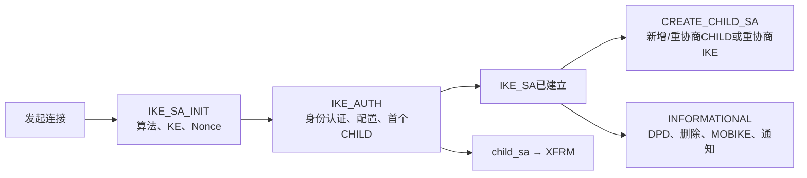
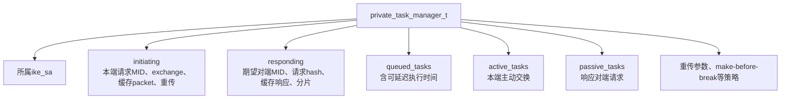
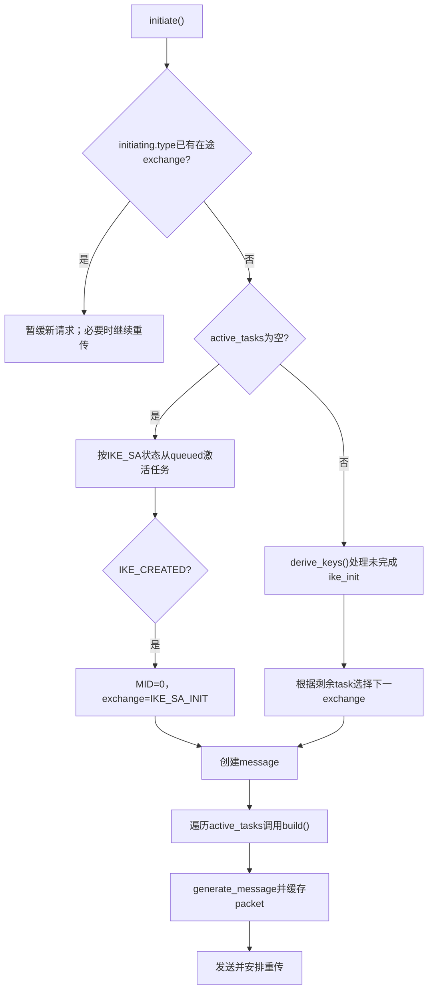
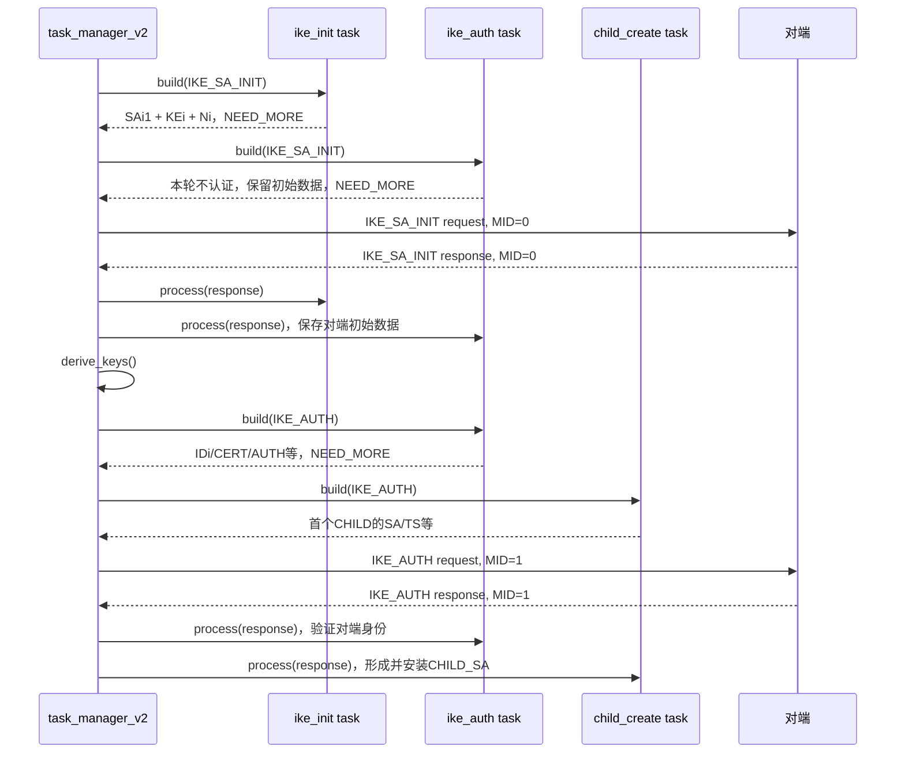
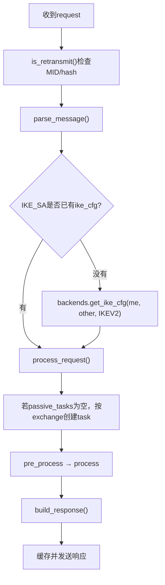
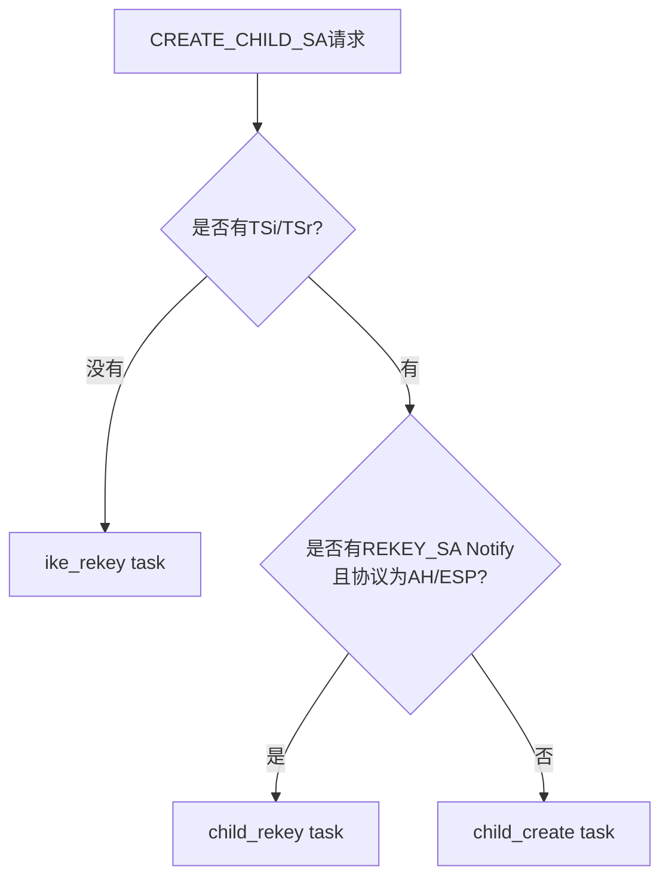

> 源码基线：strongSwan 6.0.3，commit `472dcd8bb50a91f156b725ff56992352b573f7dd`<br>
> 前置阅读：[Task Manager 分层定位图](strongSwan%20从系统到函数：Task%20Manager%20分层定位图.md)<br>
> 本文目的：解释 `task_manager_v2` 怎样把管理意图和对端消息编排成 IKE_SA_INIT、IKE_AUTH、CREATE_CHILD_SA 与 INFORMATIONAL，并明确 manager、具体 task、keymat 和数据面的边界。

## 1. 先给 IKEv2 Task Manager 定位

| 问题 | 回答 |
| --- | --- |
| 在哪里 | charon 进程 → 一个 `IKE_SA` 对象内部 |
| 负责什么 | Exchange选择、task队列、请求/响应、Message ID、重传、碰撞处理 |
| 上游实现 | `src/libcharon/sa/ikev2/task_manager_v2.c` |
| 具体协议状态 | `ikev2/tasks/ike_init.c`、`ike_auth.c`、`child_create.c` 等 |
| 输入 | 发起/重协商/删除等意图，或对端 IKEv2 `message_t` |
| 输出 | 下一条 IKEv2 消息、更新后的 IKE_SA、CHILD_SA 安装动作 |
| 不负责 | 算法实现、通用Payload编解码、ESP逐包处理 |

一句话理解：

> `task_manager_v2` 是每条 IKE 会话的“Exchange 编排器”；task 是“某一协议职责的有状态执行者”。

## 2. IKEv2 的四类核心 Exchange



| Exchange | 解决的问题 | 常见 task |
| --- | --- | --- |
| `IKE_SA_INIT` | Proposal、KE、Nonce、能力通知 | `ike_init`、vendor、NATD，以及为后续阶段收集输入的辅助task |
| `IKE_AUTH` | 双方身份认证、配置与首个 CHILD_SA | `ike_auth`、cert、config、establish、`child_create` |
| `CREATE_CHILD_SA` | 新建/重协商 CHILD_SA，或重协商 IKE_SA | `child_create`、`child_rekey`、`ike_rekey` |
| `INFORMATIONAL` | DPD、删除、MOBIKE、错误与状态通知 | `ike_dpd`、delete、mobike、redirect等 |

## 3. manager 内部保存什么

`task_manager_v2.c:63` 的私有结构主要保存四类状态。



IKEv2 的重要特征是：

- 本端同一时刻只保留一个在途请求；
- 本端发起方向和响应方向分别有自己的 MID 上下文；
- 正常请求/响应由 IKE 头中的 Request 位区分；
- 成功处理一轮响应后，本端 `initiating.mid++`；
- 成功处理一轮请求后，期望的 `responding.mid++`。

## 4. 主动建链：为什么 `queue_ike()`不是“发送 IKE_SA_INIT”

### 4.1 `queue_ike()`先组建协议工作组

`task_manager_v2.c:2084-2132` 排入：

```text
ike_vendor
→ ike_init
→ ike_natd
→ ike_cert_pre
→ ike_auth
→ ike_cert_post
→ ike_config
→ ike_auth_lifetime
→ ike_mobike
→ ike_establish
```

首个 CHILD_SA 的 `child_create` 由 `ike_sa->initiate()` 根据 `child_cfg` 另行排入。

这些 task 不是都只服务一条消息。它们会检查当前 `message->exchange_type`，只在自己关心的阶段读写 Payload，并用 `NEED_MORE` 跨越下一轮交换。

### 4.2 `initiate()`按 IKE_SA 状态激活 task

入口：`task_manager_v2.c:516-786`。



关键锚点：

- `task_manager_v2.c:526-538`：不允许同方向同时有两个普通请求在途；
- `545-564`：`IKE_CREATED` 时激活建链 task，MID 设为 0，exchange 设为 `IKE_SA_INIT`；
- `648-679`：active task 未完成时先派生密钥，再按 task 类型选择下一 exchange；
- `692-705`：创建消息并逐个调用 `task.build()`；
- `742-786`：编码、缓存并发送/重传。

## 5. 发起端完整建链：IKE_SA_INIT怎样自动过渡到 IKE_AUTH



上图画的是最常见的单轮认证路径。若使用 EAP、多重认证、IKE_INTERMEDIATE 或额外 KE，相关 task 会继续返回 `NEED_MORE`，manager 仍以相同机制保留 task 并驱动后续轮次。

### 5.1 第一步：构造 IKE_SA_INIT

`ike_init.c:831-928` 的 `build_i()`：

1. 读取 `ike_cfg`；
2. 选择初始 KE 方法并从 crypto factory 创建 KE 对象；
3. 生成 Nonce；
4. 构造 SA、KE、Nonce 等 Payload；
5. 返回 `NEED_MORE`。

与此同时，`ike_auth` 等 task 也收到本轮 `build()` 调用，但会检查 exchange。比如 `ike_auth.c:807-823` 发现当前不是 `IKE_AUTH` 时只返回 `NEED_MORE`，不在 IKE_SA_INIT 中提前放入身份认证 Payload。

这正是“多个 task 共同参与一次 exchange”的含义：manager 广播式调用 active task，task 自己判断本轮职责。

### 5.2 第二步：处理 IKE_SA_INIT 响应

收到响应后：

```text
process_message()
→ 发现Request位为0、MID等于initiating.mid
→ parse_message()
→ process_response()
→ 对每个active task调用process()
```

`process_response()` 位于 `task_manager_v2.c:792-923`。它：

1. 核对响应 exchange 是否与当前请求一致；
2. 执行各 task 的 `pre_process()`；
3. 执行 `task.process()`；
4. `SUCCESS` 的 task 被移除，`NEED_MORE` 的 task 保留；
5. 执行 `post_process()`；
6. `initiating.mid++`，清除当前请求缓存；
7. 再次调用 `initiate()`。

### 5.3 第三步：派生 IKE 密钥

第二次进入 `initiate()` 时 active task 仍未清空。`task_manager_v2.c:485-513` 的 `derive_keys()` 查找 `TASK_IKE_INIT` 并调用：

```text
ike_init->derive_keys()
```

`ike_init` 持有双方 Proposal、KE 与 Nonce，最终调用 `keymat_v2` 派生 IKE SA 密钥。派生成功后，`TASK_IKE_INIT` 从 active 队列移除。

manager 本身不实现 KDF；它只把“必须先派生密钥，才能构造受保护的下一交换”这一顺序固定下来。

### 5.4 第四步：为什么下一条变成 IKE_AUTH

`task_manager_v2.c:653-679` 遍历剩余 active task：

```text
发现TASK_IKE_AUTH
→ exchange = IKE_AUTH
```

然后重新创建 `message_t`，这一次：

- `ike_auth.build_i()` 加入 ID、证书/认证相关 Payload；
- `child_create.build()` 可在首个 IKE_AUTH 中加入首个 CHILD_SA 的 SA/TS；
- message 生成层使用已经派生的 IKE 密钥保护 IKE_AUTH。

所以“自动进入 IKE_AUTH”不是一个隐藏跳转，而是：

```text
前一轮task返回NEED_MORE被保留
→ IKE_INIT密钥派生完成并退出
→ 剩余TASK_IKE_AUTH决定下一exchange
```

## 6. 响应端怎样处理首次 IKE_SA_INIT

入口仍是 `process_message()`，但 Request 位为 1。



### 6.1 按 exchange 创建被动 task

`task_manager_v2.c:1126-1429` 在第一次收到 `IKE_SA_INIT` 时创建：

```text
ike_vendor
→ ike_init
→ ike_natd
→ ike_cert_pre
→ ike_auth
→ ike_cert_post
→ ike_config
→ ike_mobike
→ ike_establish
→ ike_auth_lifetime
→ child_create
```

关键设计点：这些 passive task 在 IKE_SA_INIT 响应后不一定被全部销毁。返回 `NEED_MORE` 的 task 留在 `passive_tasks`，下一条 IKE_AUTH 请求到来时继续使用同一批 task 和之前保存的上下文。

### 6.2 为什么 IKE_AUTH 到来时通常不重新创建全部 task

`process_request()` 最外层条件是：

```c
if (array_count(this->passive_tasks) == 0)
```

如果 IKE_SA_INIT 后还有未完成 task，IKE_AUTH 会直接交给它们继续 `process()`。例如 `ike_auth.process_r()` 在 IKE_SA_INIT 阶段只收集初始报文数据，在 IKE_AUTH 阶段才实际处理身份与认证。

这就是 task 跨 exchange 保存状态的具体体现。

## 7. `process_message()`怎样保证消息顺序

入口：`task_manager_v2.c:1850-2044`。

### 7.1 收到请求

```text
Request位 = 1
→ is_retransmit()比较请求hash和responding.mid
→ 已处理过：重发缓存响应
→ MID不符合预期：忽略
→ MID正确：解析、分片重组、process_request()
→ 成功后responding.mid++
```

### 7.2 收到响应

```text
Request位 = 0
→ MID必须等于initiating.mid
→ 解析/重组
→ process_response()
→ 成功后initiating.mid++
```

### 7.3 为什么先查 MID 再深入处理

错误或重复 MID 不应该再次触发认证、重协商、删除或 SA 安装等有副作用的 task。manager 在进入 task 前完成顺序控制，是协议可靠性和抗重放语义的一部分，但它不等同于 ESP 数据面的 anti-replay window。

## 8. CREATE_CHILD_SA 如何选择具体 task

当 IKE_SA 已建立，`initiate()` 在 `task_manager_v2.c:592-605` 将以下任务映射到 `CREATE_CHILD_SA`：

- `TASK_CHILD_CREATE`；
- `TASK_CHILD_REKEY`；
- `TASK_IKE_REKEY`。

响应端收到 `CREATE_CHILD_SA` 后，`process_request()` 检查 Payload：



源码：`task_manager_v2.c:1175-1233`。

这说明 manager 只根据“消息长什么样”选出负责者；真正的 Proposal、TS、Nonce、KE、密钥派生和 `child_sa` 安装由选中的 task 完成。

## 9. INFORMATIONAL 如何选择 DPD、删除或 MOBIKE

响应端收到 `INFORMATIONAL` 后，`process_request()` 枚举 Payload：

- MOBIKE相关 Notify → `ike_mobike`；
- `AUTH_LIFETIME` → `ike_auth_lifetime`；
- 认证/语法失败 Notify → `ike_delete`；
- `REDIRECT` → `ike_redirect`；
- DELETE(IKE) → `ike_delete`；
- DELETE(AH/ESP) → `child_delete`；
- 没有更具体的内容 → `ike_dpd`。

因此 INFORMATIONAL 只是一个 exchange 容器，真正语义由 Payload 与当前状态共同决定。

## 10. 响应是怎样构造和缓存的

`build_response()` 位于 `task_manager_v2.c:980-1120`：

1. 创建与请求相同 exchange 的响应消息；
2. 使用 `responding.mid`；
3. 交换源/目的地址并设置 `request = FALSE`；
4. 遍历 passive task 调用 `build()`；
5. 编码并把 packet 缓存到 `responding.packets`；
6. 发送响应；
7. 对端若重传同一请求，manager 直接重发缓存响应。

缓存已编码 packet 的原因是：重传必须保持同一协议消息，不应重新执行可能生成随机数、签名、SPI或副作用的 task。

## 11. task、manager、message与keymat的精确边界

| 层 | 读取什么 | 改变什么 | 向哪里输出 |
| --- | --- | --- | --- |
| `task_manager_v2` | IKE_SA状态、MID、队列、exchange | active/passive队列、重传上下文、MID | task、message生成层 |
| `ike_init` | ike_cfg、对端SA/KE/Nonce | proposal、KE/Nonce上下文 | `keymat_v2`派生输入 |
| `ike_auth` | auth_cfg、证书/ID/AUTH Payload | 身份与认证状态 | IKE_SA认证结果 |
| `child_create` | child_cfg、SA/TS/Nonce/KE | child_sa候选、密钥与安装状态 | child_sa/kernel interface |
| `message.c` | Payload对象、keymat | 字节编码、加密/完整性、分片 | packet_t |
| `keymat_v2` | shared secret、Nonce、SPI、算法 | IKE/CHILD方向密钥 | message保护或child_sa安装 |

## 12. 与国密/PQC改造的关系

### 12.1 只替换算法或新增标准可表达的算法

如果 IKEv2 交换顺序不变，通常优先检查：

```text
配置名称/算法ID
→ Proposal/Transform编解码
→ crypto factory/插件
→ ike_init创建KE或算法对象
→ keymat_v2派生
→ child_sa/kernel-netlink映射
```

仅因为算法从 AES/SHA/ECDH 换成 SM4/SM3/SM2，不代表一定要重写 `task_manager_v2`。

### 12.2 什么时候才需要进入 manager/task

当改造改变以下语义时才下钻：

- 需要新的 exchange 或额外轮次；
- 某阶段必须新增/重排 Payload；
- 认证输入或证书处理流程变化；
- 多 KE/Hybrid KE 改变共享秘密组合与状态推进；
- 失败、回退或重协商规则发生变化。

PQC Hybrid 若能使用现有多 KE 扩展承载，重点可能落在 `ike_init`、KE对象和 `keymat_v2`；若协议定义超出现有 exchange 语义，才可能进一步修改 manager。

## 13. 错误理解与正确理解

### 错误：`task_manager_v2`就是 IKEv2 状态机的全部

正确：它管理 exchange、方向、MID、队列和重传；具体协议状态分布在各 task 内部。

### 错误：所有 task 在 IKE_SA_INIT 都会写 Payload

正确：manager 会调用 active task，但 task 根据 exchange 判断本轮是否工作；很多 task 只收集上下文并返回 `NEED_MORE`。

### 错误：IKE_AUTH成功就必然有可用ESP数据面

正确：还要确认 `child_create` 成功、`child_sa` 双向安装成功、XFRM state/policy存在并且业务流量真实命中。

### 错误：国密算法可用就等于 IKEv2国密改造完成

正确：仍需证明 Proposal真实协商、运行时库/插件身份、密钥派生、CHILD_SA算法下发、内核支持与负面测试；若声称符合某项标准，还要逐条核对协议语义。

## 14. 最小源码阅读练习

第一次只回答：“为什么 IKE_SA_INIT 后自动进入 IKE_AUTH？”

```bash
cd /path/to/workspace/learning-sources/strongswan-6.0.3

sed -n '2084,2132p' src/libcharon/sa/ikev2/task_manager_v2.c
sed -n '516,786p' src/libcharon/sa/ikev2/task_manager_v2.c
sed -n '792,923p' src/libcharon/sa/ikev2/task_manager_v2.c
sed -n '485,513p' src/libcharon/sa/ikev2/task_manager_v2.c
sed -n '807,981p' src/libcharon/sa/ikev2/tasks/ike_auth.c
```

只填写这张表：

| 阶段 | 哪个函数 | 输入 | 保留/改变的状态 | 下一步 |
| --- | --- | --- | --- | --- |
| 排队 | `queue_ike()` | 建链意图 | queued task集合 | `initiate()` |
| 第一条请求 | `initiate()` | `IKE_CREATED` | active tasks、MID=0 | task.build |
| 第一条响应 | `process_response()` | IKE_SA_INIT response | 未完成task保留、MID++ | 再次`initiate()` |
| 密钥阶段 | `derive_keys()` | `ike_init`上下文 | IKE keymat | 移除完成的ike_init |
| 第二条请求 | `initiate()` | 剩余`TASK_IKE_AUTH` | exchange=IKE_AUTH | `ike_auth.build_i()` |

## 15. 掌握检查

1. `queue_ike()`为什么不等于“发送 IKE_SA_INIT”？
2. manager 为什么会在 IKE_SA_INIT 阶段同时激活 `ike_auth`？
3. `NEED_MORE` 如何让一个 task 跨越 IKE_SA_INIT 和 IKE_AUTH？
4. IKE密钥派生为什么发生在两次 exchange 之间？
5. 响应端为什么通常不在 IKE_AUTH 到来时重新创建一套 passive task？
6. `CREATE_CHILD_SA` 请求怎样区分 IKE rekey、CHILD create 和 CHILD rekey？
7. IKEv2 Message ID检查与ESP anti-replay有什么不同？
8. 只新增 SM4/SM3 时，优先修改哪些层，为什么不是先改 manager？

## 16. 上游源码入口

- [`task_manager_v2.c`](https://github.com/strongswan/strongswan/blob/472dcd8bb50a91f156b725ff56992352b573f7dd/src/libcharon/sa/ikev2/task_manager_v2.c)
- [`ike_init.c`](https://github.com/strongswan/strongswan/blob/472dcd8bb50a91f156b725ff56992352b573f7dd/src/libcharon/sa/ikev2/tasks/ike_init.c)
- [`ike_auth.c`](https://github.com/strongswan/strongswan/blob/472dcd8bb50a91f156b725ff56992352b573f7dd/src/libcharon/sa/ikev2/tasks/ike_auth.c)
- [`child_create.c`](https://github.com/strongswan/strongswan/blob/472dcd8bb50a91f156b725ff56992352b573f7dd/src/libcharon/sa/ikev2/tasks/child_create.c)
- [`keymat_v2.c`](https://github.com/strongswan/strongswan/blob/472dcd8bb50a91f156b725ff56992352b573f7dd/src/libcharon/sa/ikev2/keymat_v2.c)
