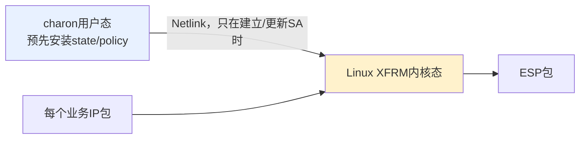
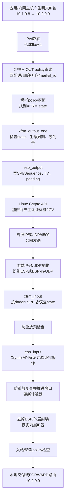

> strongSwan源码基线：6.0.3，commit `472dcd8bb50a91f156b725ff56992352b573f7dd`<br>
> Linux数据面教学基线：Linux v6.6官方源码。它用于解释默认`kernel-netlink + XFRM`行为，不等于目标产品内核版本。<br>
> 上一条链：[CHILD_SA如何变成Linux XFRM状态与策略](strongSwan%20五链源码精读%2004%20CHILD_SA到XFRM.md)

## 1. 最重要的边界：这条链主要不在`charon`里

前四条链完成了：

```text
配置 → IKE任务 → 协商与密钥 → XFRM state/policy
```

从第五条链开始，输入是一个普通业务IP包。默认Linux内核数据面中，每个包不经过`charon`，也不会逐包调用strongSwan或Tongsuo：



因此要分清两个问题：

| 问题 | 主要负责者 |
| --- | --- |
| 双方协商什么算法、密钥、SPI和TS？ | `charon`的IKE控制面 |
| 每个业务包怎样查策略、加密、封装、解密、防重放？ | Linux XFRM、ESP与Crypto API数据面 |

## 2. 先看一个具体包

假设网关A和网关B已经建立隧道：

```text
网关A公网：203.0.113.10      网关B公网：198.51.100.20
网关A内网：10.1.0.0/24      网关B内网：10.2.0.0/24
业务包：10.1.0.8 → 10.2.0.9，ICMP Echo Request
```

第四条链已经在网关A内核安装：

- 出站policy：`10.1.0.0/24 → 10.2.0.0/24`必须使用IPsec；
- 出站state：外层`203.0.113.10 → 198.51.100.20`、对端选择的SPI、算法和出站密钥。

在网关B安装了方向相反、SPI和密钥相匹配的入站state及policy。

## 3. 全程总图



下面把每个箭头落到函数和数据对象。

## 4. 出站第一段：明文包进入路由与XFRM策略查询

### 4.1 输入从哪里来

输入是内核中的`struct sk_buff`，简称`skb`。它可能来自：

- 本机应用通过socket发送；
- 内网网卡收到后，被网关转发；
- 更上层隧道或虚拟接口交付。

`skb`此时包含内层明文IP头和业务负载；`10.1.0.8 → 10.2.0.9`等五元组会被整理为路由/XFRM查询使用的`flowi4`。

### 4.2 路由把查询交给XFRM

Linux v6.6的[`ip_route_output_flow()`](https://github.com/torvalds/linux/blob/v6.6/net/ipv4/route.c#L2869-L2886)先取得普通IPv4路由，再调用：

```text
xfrm_lookup_route()
→ xfrm_lookup()
→ xfrm_lookup_with_ifid()
```

[`xfrm_lookup_with_ifid()`](https://github.com/torvalds/linux/blob/v6.6/net/xfrm/xfrm_policy.c#L3113-L3263)查询`XFRM_POLICY_OUT`。如果没有XFRM policy，使用原始路由继续明文发送；如果policy要求IPsec，则进入bundle解析。

### 4.3 policy怎样找到state

[`xfrm_bundle_lookup()`](https://github.com/torvalds/linux/blob/v6.6/net/xfrm/xfrm_policy.c#L3025-L3086)执行：

```text
xfrm_policy_lookup()
→ xfrm_expand_policies()
→ xfrm_resolve_and_create_bundle()
→ 根据policy template查找可用xfrm_state
→ 创建带XFRM变换链的dst/bundle
```

输入是flow、方向、地址族、`if_id`等；输出是与`skb`路由关联的`xfrm_dst`。其中既保存原始路由，也串起即将使用的`xfrm_state`。

这里可能出现三种结果：

| 查询结果 | 后续行为 |
| --- | --- |
| 无匹配policy | 按普通路由明文发送，是否允许由默认策略决定 |
| policy要求IPsec且state存在 | 建立XFRM bundle，进入ESP输出 |
| policy要求IPsec但state不存在 | 触发acquire/等待密钥管理器，或返回错误/丢包 |

所以“`ip xfrm policy`存在”不等于“已经能加密”；policy模板还必须解析到有效state。

## 5. 出站第二段：XFRM检查状态并调用ESP

[`xfrm_output_one()`](https://github.com/torvalds/linux/blob/v6.6/net/xfrm/xfrm_output.c#L490-L582)从`skb_dst(skb)->xfrm`取得本包的`xfrm_state`，依次完成：

```text
xfrm_skb_check_space()       确保封装头部空间
→ xfrm_outer_mode_output()   准备隧道/传输模式外层
→ 检查state是否VALID
→ xfrm_state_check_expire()  检查生命周期
→ xfrm_replay_overflow()     分配/检查出站序列号
→ 更新bytes/packets计数器
→ x->type->output(x, skb)    调用具体协议实现
```

对ESP state，`x->type->output`指向IPv4 ESP实现的`esp_output()`。

输入是“明文`skb` + 已选中的`xfrm_state`”；输出要么是准备好的ESP包，要么是明确的错误并增加相应XFRM统计项。

## 6. 出站第三段：`esp_output()`构造ESP并执行密码运算

Linux v6.6的[`esp_output()`](https://github.com/torvalds/linux/blob/v6.6/net/ipv4/esp4.c#L654-L702)完成：

```text
保存原始next header
→ 把外层协议标记为IPPROTO_ESP
→ 从xfrm_state取得AEAD上下文和参数
→ 计算padding、认证标签长度和密文长度
→ esp_output_head()准备空间、IV和scatterlist
→ ESP header.spi = x->id.spi
→ ESP header.seq_no = 本包序列号
→ esp_output_tail()
→ crypto_aead_encrypt()
```

### 6.1 输入与输出

| 阶段 | 输入 | 输出 |
| --- | --- | --- |
| ESP头构造 | state中的SPI、本包序列号 | `SPI + Sequence Number` |
| 密码上下文 | state安装时建立的算法与密钥 | Linux Crypto API的`crypto_aead`对象 |
| 加密请求 | 明文负载、IV/Nonce、AAD、padding | 密文 + 认证Tag/ICV |
| 隧道封装 | 内层IP包和外层地址 | 外层IP + ESP；NAT-T时再套UDP/4500 |

`crypto_aead_encrypt()`可能同步返回，也可能返回`-EINPROGRESS`，异步完成后再恢复发送流程。这正是软件实现、异步密码驱动和硬件卸载能够接在同一Crypto API抽象下的原因之一。

### 6.2 包之后去哪里

[`xfrm_output_resume()`](https://github.com/torvalds/linux/blob/v6.6/net/xfrm/xfrm_output.c#L584-L610)继续处理可能存在的多层变换，经过`POST_ROUTING`等网络栈阶段，最终交给外层路由和网卡发送。

公网抓包能看到：

```text
外层src = 203.0.113.10
外层dst = 198.51.100.20
协议 = ESP(50)，或UDP/4500内的ESP
ESP SPI = 对端为入站方向选择的SPI
ESP Sequence逐包增长
业务IP和负载不可见
```

抓包看不到会话密钥，也通常不能仅凭密文字节判断底层具体调用了哪个软件/硬件密码实现。

## 7. 入站第一段：先区分IKE、原生ESP和NAT-T ESP

对端网关收到包后有两种常见入口：

### 原生ESP

IPv4协议号50进入[`xfrm4_rcv()`](https://github.com/torvalds/linux/blob/v6.6/net/ipv4/xfrm4_input.c#L169-L171)，继而调用`xfrm4_rcv_spi()`和通用`xfrm_input()`。

### UDP封装ESP

[`xfrm4_udp_encap_rcv()`](https://github.com/torvalds/linux/blob/v6.6/net/ipv4/xfrm4_input.c#L82-L167)检查UDP负载：

- 1字节`0xff`是NAT keepalive，直接消费；
- 非零起始字段且长度足够，按ESP-in-UDP处理；
- IKE报文则留给UDP socket和`charon`；
- 对ESP去掉UDP头/可选marker后，调用`xfrm4_rcv_encap()`。

这说明UDP/4500上IKE控制报文和ESP数据报文可以共存，但内核会在这里把两条路径重新分开。

## 8. 入站第二段：`xfrm_input()`按SPI找SA并防重放

通用入口[`xfrm_input()`](https://github.com/torvalds/linux/blob/v6.6/net/xfrm/xfrm_input.c#L447-L735)依次执行：

```text
xfrm_parse_spi()              从ESP头取SPI和Sequence
→ xfrm_state_lookup()         用mark + daddr + SPI + proto + family查state
→ 检查state为VALID
→ 检查NAT-T封装类型匹配
→ xfrm_replay_check()         解密前先拒绝明显重放
→ xfrm_state_check_expire()   检查生命周期
→ x->type->input(x, skb)      对ESP即调用esp_input()
```

为什么SPI不能单独唯一定位SA？内核查询还使用目的地址、协议、地址族以及mark等上下文，避免不同隧道或命名空间中的编号冲突。

如果找不到state，增加`XFRMInNoStates`；序列号不合法增加`XFRMInStateSeqError`；封装类型不匹配增加`XFRMInStateMismatch`。这些统计比“ping不通”更接近根因。

## 9. 入站第三段：`esp_input()`解密并验证完整性

[`esp_input()`](https://github.com/torvalds/linux/blob/v6.6/net/ipv4/esp4.c#L878-L969)执行：

```text
检查ESP头和IV长度
→ 计算密文长度、AAD长度、ESN附加字段
→ 把skb整理成scatterlist
→ 设置回调、IV、AAD
→ crypto_aead_decrypt()
→ esp_input_done2()校验并去掉padding/trailer
```

如果密文或认证标签被篡改，密码实现返回失败，`xfrm_input()`会把`-EBADMSG`记为完整性失败，并丢弃包。失败包不会以明文形式继续向上层交付。

密码操作成功后，`xfrm_input()`还会：

```text
xfrm_replay_recheck()   异步解密完成后再次检查竞态
→ xfrm_replay_advance() 推进防重放窗口
→ 更新SA bytes/packets和lastused
→ xfrm_inner_mode_input()处理隧道/传输模式
→ 恢复内层协议和IP包
```

先预检查、解密后复查的原因是：异步密码运算期间可能有另一个同序列号包完成，必须在正式推进窗口前再次确认。

## 10. 入站第四段：恢复的明文包还要通过policy检查

解密成功只说明“这个包使用某条SA通过了密码校验”，内核还要验证该SA是否符合入站/转发policy，防止攻击者利用一条有效SA发送超出Traffic Selector范围的流量。

XFRM把经历过的state记录在`sec_path`中。后续`__xfrm_policy_check()`根据：

```text
恢复后的内层源/目的地址和协议
+ 入站或转发方向
+ sec_path中实际经过的SA
+ policy模板、reqid、mark/if_id等
```

判断是否允许交给本机协议栈或进入FORWARD。隧道模式IPv4包随后通过[`xfrm4_transport_finish()`](https://github.com/torvalds/linux/blob/v6.6/net/ipv4/xfrm4_input.c#L47-L72)等路径重新进入`PRE_ROUTING`，再由普通路由决定本地交付或转发到`10.2.0.9`。

所以完整入站成立需要同时满足：

```text
找得到state
∧ 防重放通过
∧ 完整性验证和解密成功
∧ 入站/转发policy允许
∧ 普通路由与防火墙允许
```

## 11. 函数链总表

### 出站

| 顺序 | 函数/模块 | 输入 | 输出给下一步 |
| --- | --- | --- | --- |
| 1 | 应用或转发路径 | 明文IP包 | `skb`与flow信息 |
| 2 | `ip_route_output_flow()` | flow + 普通路由 | `xfrm_lookup_route()` |
| 3 | `xfrm_lookup_with_ifid()` | flow、方向、mark、if_id | 匹配的OUT policy |
| 4 | `xfrm_bundle_lookup()` | policy模板 | 解析出的state与XFRM bundle |
| 5 | `xfrm_output_one()` | `skb + xfrm_state` | 已检查状态/序列号的包 |
| 6 | `esp_output()` | SPI、序列号、密钥上下文、明文 | ESP头、IV、padding、加密请求 |
| 7 | `crypto_aead_encrypt()` | plaintext/AAD/IV/key | ciphertext + Tag/ICV |
| 8 | `xfrm_output_resume()` | ESP包 | Netfilter、外层路由、网卡 |

### 入站

| 顺序 | 函数/模块 | 输入 | 输出给下一步 |
| --- | --- | --- | --- |
| 1 | `xfrm4_rcv()`或`xfrm4_udp_encap_rcv()` | 原生ESP或UDP/4500包 | 去除可选UDP封装后的ESP |
| 2 | `xfrm_input()` | ESP头、外层目的地址、mark | SPI/Sequence及匹配state |
| 3 | `xfrm_replay_check()` | state窗口 + Sequence | 是否允许尝试解密 |
| 4 | `esp_input()` | ESP密文、IV、AAD、state密钥上下文 | Crypto API解密请求 |
| 5 | `crypto_aead_decrypt()` | ciphertext/Tag/IV/key | 已认证明文或错误 |
| 6 | `xfrm_replay_recheck/advance()` | 解密成功包 | 更新后的防重放窗口和计数器 |
| 7 | `xfrm_inner_mode_input()` | 已解密载荷 | 恢复后的内层IP包 |
| 8 | XFRM policy check | 内层flow + `sec_path` | 允许本地交付/转发或丢弃 |
| 9 | 路由/Netfilter | 明文内层包 | 目标主机或本机应用 |

## 12. 怎样证明链条真的在运行

### 12.1 状态与计数器

```bash
ip -s xfrm state
ip -s xfrm policy
cat /proc/net/xfrm_stat
```

执行一次隧道内`ping`或真实业务请求，前后比较：

- 对应state的packets/bytes是否增长；
- 对应policy的使用时间和统计是否变化；
- `XfrmOutNoStates`、`XfrmInNoStates`、`XfrmInStateProtoError`、`XfrmInStateSeqError`等是否增长。

### 12.2 公网与内网双点抓包

```text
内网侧：应看到 10.1.0.8 → 10.2.0.9 的明文业务包
公网侧：应看到 203.0.113.10 → 198.51.100.20 的ESP或UDP/4500
对端内网侧：应重新看到 10.1.0.8 → 10.2.0.9
```

Wireshark核对：

1. 公网接口显示过滤器使用`esp || udp.port == 4500`；
2. 展开`Encapsulating Security Payload`，核对SPI与`ip xfrm state`一致；
3. 连续包的Sequence Number应递增；
4. 不能仅凭Wireshark显示“ESP”就断言算法为SM4；算法结论必须联合协商结果、XFRM state、内核算法实现和计数器。

### 12.3 最小负面测试

| 测试 | 预期现象 | 能证明什么 |
| --- | --- | --- |
| 删除出站state但保留policy | 新业务流量失败，`XfrmOutNoStates`等变化 | policy不会凭空完成加密 |
| 发送重复ESP包 | 防重放计数增加，重复包不交付 | replay window真正生效 |
| 篡改ESP密文或Tag | 完整性失败并丢包 | 不是“能解出什么就收什么” |
| 访问TS之外的内网地址 | 不应被该policy接受 | Traffic Selector边界生效 |
| SA到期或rekey | 新旧SPI和计数按预期切换 | 生命周期与切换路径有效 |

## 13. 国密与硬件卸载的正确结论

若第四条链安装的XFRM state使用目标SM4/SM3算法名称，并且目标内核Crypto API提供真实实现，那么本链的ESP密码操作才可能走该实现。仍需分别证明：

```text
协商选择了国密算法
→ XFRM state确实安装为目标算法
→ 目标Crypto API实现被实际选择
→ 真实业务包触发该state且计数增长
→ 对端成功验证并还原
```

如果底层算法由密码卡驱动实现，还需要驱动统计、调用跟踪或硬件侧证据。仅有以下现象都不足以证明“ESP流量经过密码卡”：

- `charon`链接了Tongsuo；
- IKE握手使用了SM2/SM3/SM4；
- Provider或Engine加载成功；
- `ip xfrm state`里写着某个算法名；
- 隧道能够ping通。

## 14. 常见“假成功”与定位顺序

| 表面现象 | 可能停在哪一层 | 优先检查 |
| --- | --- | --- |
| IKE_SA已建立，业务不通 | 没有CHILD_SA或XFRM安装失败 | `swanctl --list-sas`、state/policy |
| CHILD_SA显示建立，只有单向流量 | 某方向state、路由或policy错误 | 双向SPI、计数器、TS、抓包 |
| 公网有ESP，对端无明文 | 对端找不到state、重放或完整性失败 | `xfrm_stat`、SPI、密钥方向、Tag |
| 双端都能看到ESP但业务仍失败 | 解密后policy、路由、FORWARD或防火墙 | 入站policy、`sec_path`、路由/Netfilter |
| 配置写SM4但数据面身份不明 | 只证明了配置或控制面 | state算法、Crypto API实现、计数器/驱动 |
| 首次连接正常，rekey后断流 | 新旧state/policy切换问题 | SPI变化、rekey日志、安装/删除时序 |

## 15. 读完后应能回答

1. 为什么业务包在默认XFRM数据面中不需要逐包经过`charon`？
2. policy和state分别在“选流量”和“做变换”中承担什么职责？
3. ESP入站为什么先按SPI找state，再做完整性校验和解密？
4. 为什么解密成功后仍要检查入站policy？
5. 怎样用三处抓包和XFRM计数器证明一个明文包确实经过ESP往返？
6. 为什么`charon`链接Tongsuo不能证明ESP数据面正在使用Tongsuo或密码卡？

## 16. 源码锚点

strongSwan负责提前安装本链使用的内核对象：

- [`child_sa.c: install_internal()`](https://github.com/strongswan/strongswan/blob/472dcd8bb50a91f156b725ff56992352b573f7dd/src/libcharon/sa/child_sa.c#L965-L1164)
- [`kernel_netlink_ipsec.c: add_sa()`](https://github.com/strongswan/strongswan/blob/472dcd8bb50a91f156b725ff56992352b573f7dd/src/libcharon/plugins/kernel_netlink/kernel_netlink_ipsec.c#L1736-L2274)

Linux v6.6负责逐包数据面：

- [`route.c: ip_route_output_flow()`](https://github.com/torvalds/linux/blob/v6.6/net/ipv4/route.c#L2869-L2886)
- [`xfrm_policy.c: xfrm_bundle_lookup()`](https://github.com/torvalds/linux/blob/v6.6/net/xfrm/xfrm_policy.c#L3025-L3086)
- [`xfrm_policy.c: xfrm_lookup_with_ifid()`](https://github.com/torvalds/linux/blob/v6.6/net/xfrm/xfrm_policy.c#L3113-L3263)
- [`xfrm_output.c: xfrm_output_one()`](https://github.com/torvalds/linux/blob/v6.6/net/xfrm/xfrm_output.c#L490-L582)
- [`esp4.c: esp_output()`](https://github.com/torvalds/linux/blob/v6.6/net/ipv4/esp4.c#L654-L702)
- [`xfrm4_input.c: NAT-T与xfrm4_rcv()`](https://github.com/torvalds/linux/blob/v6.6/net/ipv4/xfrm4_input.c#L82-L171)
- [`xfrm_input.c: xfrm_input()`](https://github.com/torvalds/linux/blob/v6.6/net/xfrm/xfrm_input.c#L447-L735)
- [`esp4.c: esp_input()`](https://github.com/torvalds/linux/blob/v6.6/net/ipv4/esp4.c#L878-L969)
