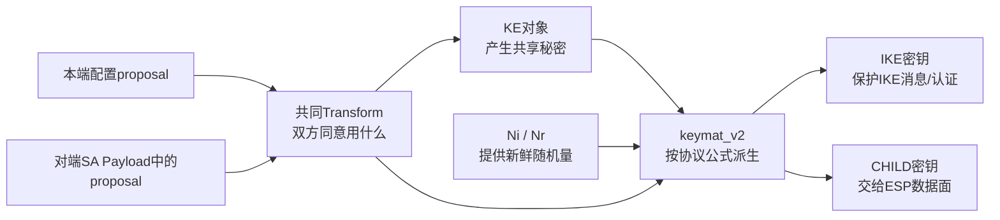

> 源码基线：strongSwan 6.0.3，commit `472dcd8bb50a91f156b725ff56992352b573f7dd`<br>
> 主线采用IKEv2讲清输入、选择、密钥交换和KDF；文末单独给出IKEv1对应路径，避免把两套公式混在一起。<br>
> 上一条链：[IKE报文如何进入协议任务](strongSwan%20五链源码精读%2002%20IKE报文到协议任务.md) · 下一条链：[CHILD_SA如何安装为XFRM](strongSwan%20五链源码精读%2004%20CHILD_SA到XFRM.md)

## 1. 先把四件事分开



四者职责：

| 层 | 回答的问题 | 不负责什么 |
| --- | --- | --- |
| Proposal | 双方同意什么加密、完整性、PRF和KE算法 | 不执行密码运算 |
| `key_exchange_t` | 双方公钥材料怎样得到同一共享秘密 | 不决定整套密钥布局 |
| `keymat_v2` | 怎样把共享秘密、Nonce和SPI派生成多把方向密钥 | 不决定对端身份是否可信 |
| authenticator | 使用证书/PSK等证明对端身份 | 不替代KE和KDF |

## 2. 输入来自哪里

IKEv2初始密钥派生需要四组输入：

| 输入 | 来源 | 在代码中的对象 |
| --- | --- | --- |
| 本端候选算法 | `swanctl.conf`的IKE proposal | `ike_cfg_t`中的`proposal_t`列表 |
| 对端候选算法 | 收到的IKE_SA_INIT SA Payload | `sa_payload_t`解析出的proposal列表 |
| 共享秘密 | 本端KE私密状态 + 对端KE public value | 一个或多个`key_exchange_t` |
| 随机量与会话标识 | 本端Nonce、对端Nonce、SPIi、SPIr | `chunk_t nonce_i/r`与`ike_sa_id_t` |

后续CHILD_SA密钥派生再使用：

- 已经生成并保存在`keymat_v2`中的`SK_d`；
- CHILD交换的Nonce；
- 可选的新KE共享秘密（PFS或Multiple KE）；
- 选中的ESP proposal决定密钥长度和布局。

## 3. 第一段：配置字符串如何成为算法集合

链一中的`vici_config.c:643-681`调用：

```c
proposal_create_from_string(proto, buf);
```

`src/libstrongswan/crypto/proposal/proposal.c:1390-1419`执行：

```text
"aes256-sha256-modp2048"
→ enumerator_create_token(algs, "-", " ")
→ add_string_algo(this, alg)
→ proposal_t内部Transform集合
→ check_proposal()检查组合是否合法
```

`proposal_t`记录的是“算法标识和参数”，例如：

```text
ENCRYPTION_ALGORITHM = ENCR_AES_CBC, key size = 256
INTEGRITY_ALGORITHM  = AUTH_HMAC_SHA2_256_128
PSEUDO_RANDOM_FUNCTION = PRF_HMAC_SHA2_256
KEY_EXCHANGE_METHOD = MODP_2048_BIT
```

它不是密码对象。此时没有AES上下文、没有DH私钥、没有会话密钥。

## 4. 第二段：本端proposal如何进入报文

IKEv2发起端的`src/libcharon/sa/ikev2/tasks/ike_init.c:831-906`执行`build_i()`：

1. 从`ike_cfg`取首选KE方法；
2. `keymat.create_ke(method)`向crypto factory申请KE实现；
3. `generate_nonce()`申请本端Nonce；
4. `build_payloads()`创建SA、KE和Nonce Payload。

### 4.1 KE对象从哪里来

关键调用：

```c
this->ke = this->keymat->keymat.create_ke(..., this->ke_method);
```

`create_ke()`最终由libstrongswan crypto factory按算法ID选择已注册插件，例如OpenSSL插件或其他KE插件。返回的`key_exchange_t`内部持有本端私密状态，并能给出需要发给对端的public value。

### 4.2 Nonce从哪里来

`ike_init.c:160-173`的`generate_nonce()`调用nonce generator：

```c
this->nonceg->allocate_nonce(this->nonceg, NONCE_SIZE, &this->my_nonce)
```

Nonce不是密钥，也不是加密后的随机数。它是公开发送的随机输入，用来确保每次协商派生不同的结果并参与抗重放语义。

### 4.3 三个Payload怎样形成

`ike_init.c:350-415`：

```text
ike_cfg.get_proposals()
→ sa_payload_create_from_proposals_v2()
→ SA Payload

key_exchange_t
→ ke_payload_create_from_key_exchange()
→ KE Payload（公开值）

my_nonce
→ nonce_payload.set_nonce()
→ Nonce Payload
```

输出去向：这些Payload交给第二条链中的`message.generate()`编码成IKE_SA_INIT请求。

## 5. 第三段：收到对端输入后怎样选择共同proposal

### 5.1 从SA Payload取对端列表

`ike_init.c:490-530`的`process_sa_payload()`调用：

```c
proposal_list = sa_payload->get_proposals(sa_payload);
this->proposal = ike_cfg->select_proposal(ike_cfg, proposal_list, flags);
```

`ike_cfg.c:361-366`继续调用`proposal_select()`。
`proposal.c:1424`开始的`proposal_select()`逐个比较本端configured与对端supplied proposal，并调用`proposal->select()`求可接受的Transform组合。

输出`this->proposal`是已经选定的单个proposal，后续KE和keymat必须与它一致。

### 5.2 对端KE和Nonce怎样进入task状态

`ike_init.c:658`开始的`process_payloads()`遍历Payload：

```text
SA Payload    → process_sa_payload() → this->proposal
KE Payload    → this->ke_method
Nonce Payload → this->other_nonce
```

随后`process_ke_payload()`在`618-653`：

1. 比较收到的KE方法与选中的方法；
2. Responder侧按该方法创建自己的`key_exchange_t`；
3. `ke->set_public_key()`把对端public value写入KE对象；
4. 若曲线/群组、长度或public value非法，设置`ke_failed`。

输入的对端public value不是共享秘密。只有本端KE对象结合自己的私密状态，稍后调用`get_shared_secret()`才得到共享秘密。

## 6. 第四段：共享秘密如何进入IKEv2 KDF

### 6.1 `ike_init`整理输入顺序

`ike_init.c:992-1063`的`derive_keys_internal()`负责角色与顺序：

```text
发起方：nonce_i = my_nonce，nonce_r = other_nonce
响应方：nonce_i = other_nonce，nonce_r = my_nonce
```

无论本机是什么角色，传给KDF的语义顺序始终是`Ni, Nr`，不能简单按“我的、对端的”拼接。

它取得当前`ike_sa_id`，然后调用：

```c
keymat->derive_ike_keys(proposal, kes, nonce_i, nonce_r, id, ...)
```

### 6.2 多个KE对象怎样变成秘密输入

`src/libstrongswan/crypto/key_exchange.c:720-754`的`key_exchange_concat_secrets()`遍历KE数组：

```c
ke->get_shared_secret(ke, &secret)
```

第一个秘密进入`first`，额外KE秘密依次拼入`others`。任何一个KE无法计算共享秘密，整个派生失败并清除已经得到的秘密。

## 7. 第五段：`derive_ike_keys()`内部到底做了什么

核心函数是`src/libcharon/sa/ikev2/keymat_v2.c:239-464`。

### 7.1 从proposal取得算法

函数首先读取：

```text
PSEUDO_RANDOM_FUNCTION → prf_alg
ENCRYPTION_ALGORITHM    → enc_alg + enc_size
INTEGRITY_ALGORITHM     → int_alg（非AEAD时需要）
```

然后通过crypto factory创建：

- `this->prf`；
- 入方向和出方向AEAD封装对象；
- 传统“加密+完整性”组合或真正AEAD对象。

如果proposal声称选中了某算法，但没有插件注册实现，`create_prf()`或AEAD创建会返回NULL，派生在这里失败。这正是“能解析算法名”不等于“能实际运行算法”。

### 7.2 计算`SKEYSEED`

首次建SA时，代码`337-359`对应：

```text
SKEYSEED = prf(Ni | Nr, g^ir)
```

在strongSwan KDF接口中：

```c
prf->set_param(KDF_PARAM_KEY, secret);
prf->set_param(KDF_PARAM_SALT, fixed_nonce);
prf->allocate_bytes(..., &skeyseed);
```

接口中的`KEY/SALT`命名是KDF实现约定；协议语义仍以上面的IKEv2公式为准。

重建IKE_SA时公式不同，使用旧`SK_d`和新的KE/Nonce；代码在`360-383`单独处理，不能把初始建链公式机械套到rekey。

### 7.3 扩展成七组IKE密钥

代码`391-425`构造seed：

```text
Ni | Nr | SPIi | SPIr
```

再执行：

```text
KEYMAT = prf+(SKEYSEED, Ni | Nr | SPIi | SPIr)

KEYMAT按顺序切分为：
SK_d | SK_ai | SK_ar | SK_ei | SK_er | SK_pi | SK_pr
```

每把密钥的去向：

| 密钥 | 作用 | 代码保存/消费方式 |
| --- | --- | --- |
| `SK_d` | 派生CHILD_SA或新IKE_SA的密钥材料 | 保存为`this->skd` |
| `SK_ai/SK_ar` | 非AEAD IKE报文的完整性，分别对应发起/响应方向 | 与`SK_e*`一起装入方向AEAD封装对象 |
| `SK_ei/SK_er` | IKE消息加密，分别对应发起/响应方向 | `set_aead_keys()`写入`aead_in/out` |
| `SK_pi/SK_pr` | IKE_AUTH认证计算需要的PRF key | 按本机角色保存为`skp_build/skp_verify` |

方向不是“本端/对端”的固定字面：`set_aead_keys()`根据`this->initiator`把initiator/responder密钥映射到本机`aead_out/aead_in`。

### 7.4 IKE密钥接下来去哪

`keymat_v2`保留：

- `aead_out`：生成本机发出的受保护IKE消息；
- `aead_in`：验证并解密对端IKE消息；
- `SK_d`：后续CHILD密钥派生；
- `skp_build/skp_verify`：身份认证数据的生成和验证。

第二条链的`message.generate(keymat)`和`message.parse_body(keymat)`分别取出这些对象。因此密钥派生的直接下游是IKE_AUTH等后续控制报文，而不是Linux XFRM。

## 8. 第六段：CHILD_SA方向密钥如何产生

### 8.1 谁调用

`src/libcharon/sa/ikev2/tasks/child_create.c:698-850`的`install_child_sa()`先确定：

- 选中的ESP proposal；
- `nonce_i`与`nonce_r`的语义顺序；
- 可选的CHILD KE数组；
- 双方SPI与TS。

然后调用`keymat_v2.derive_child_keys()`。

### 8.2 keymat如何计算长度

`keymat_v2.c:536-656`从ESP proposal取：

```text
enc_alg + enc_size
int_alg + int_size
```

若使用GCM/CCM/CTR等模式，还要把salt字节计入方向加密密钥材料长度。这个细节说明“SM4密钥是128 bit”不必然意味着传给XFRM的`enc_key.len`永远只有16字节；具体模式可能需要额外salt，必须按实现和内核接口核对。

### 8.3 CHILD KDF输入与切分

IKEv2 CHILD密钥使用：

```text
seed = [可选KE秘密] | Ni | Nr | [额外KE秘密]
KEYMAT = prf+(SK_d, seed)
```

代码分配总长度：

```text
2 × encryption key length + 2 × integrity key length
```

再按顺序切分：

```text
encr_i | integ_i | encr_r | integ_r
```

这里的`i/r`表示由Initiator发送方向和由Responder发送方向，不是简单的本机入/出。`child_create.install_child_sa()`根据本机角色把它们映射到：

```text
本机入站SA：使用对端发送方向的key
本机出站SA：使用本端发送方向的key
```

输出去向就是第四条链的`child_sa->install()`。

## 9. 一张逐跳对象表

| 跳数 | 函数 | 输入 | 本跳结果 | 下游消费者 |
| --- | --- | --- | --- | --- |
| 1 | `proposal_create_from_string()` | 配置字符串 | 本端`proposal_t`列表 | `ike_cfg` |
| 2 | `ike_init.build_i()` | `ike_cfg` | 选首选KE、生成Nonce | `build_payloads()` |
| 3 | `sa_payload_create_from_proposals_v2()` | proposal列表 | SA Payload | 对端 |
| 4 | `ke_payload_create_from_key_exchange()` | `key_exchange_t` | KE public value Payload | 对端 |
| 5 | `process_sa_payload()` | 对端SA Payload | 单个共同proposal | `ike_init`/keymat |
| 6 | `process_ke_payload()` | 对端KE public value | 写入本端KE对象 | `get_shared_secret()` |
| 7 | `process_payloads()` | 对端Nonce Payload | `other_nonce` | KDF |
| 8 | `key_exchange_concat_secrets()` | KE对象数组 | 共享秘密 | `derive_ike_keys()` |
| 9 | `keymat_v2.derive_ike_keys()` | proposal、秘密、Ni/Nr、SPI | 七组IKE密钥/方向对象 | IKE消息保护、认证、CHILD KDF |
| 10 | `child_create.install_child_sa()` | ESP proposal、CHILD Nonce/KE | 整理角色与方向 | `derive_child_keys()` |
| 11 | `keymat_v2.derive_child_keys()` | `SK_d`、seed、密钥长度 | 四组CHILD方向密钥 | `child_sa.install()` |

## 10. IKEv1对应路径：相同框架，不同公式

不要把IKEv2的`SKEYSEED/SK_*`术语套到IKEv1。

### 10.1 Proposal与Main Mode

`src/libcharon/sa/ikev1/tasks/main_mode.c`：

- `build_i()`在`238-297`从`ike_cfg`取proposals并创建IKEv1 SA Payload；
- `process_r()`在约`356-430`解析并选择proposal；
- `build_r()`的`MM_KE`分支调用`phase1->add_nonce_ke()`和`phase1->derive_keys()`。

### 10.2 IKEv1 Phase 1密钥

`src/libcharon/sa/ikev1/keymat_v1.c:316-470`的`derive_ike_keys()`输入包括：

```text
proposal + DH对象/对端值 + Ni/Nr + Cookies(SPI) + 认证方式 + 可选PSK
```

输出是IKEv1语义的：

```text
SKEYID
→ SKEYID_d
→ SKEYID_a
→ SKEYID_e
```

它们分别服务于后续IPsec keymat、IKE认证/完整性和IKE加密。

### 10.3 Quick Mode密钥

`keymat_v1.c:541-650`的`derive_child_keys()`使用：

```text
SKEYID_d
+ 可选Quick Mode DH秘密
+ protocol
+ 单向SPI
+ Ni/Nr
```

Initiator SA和Responder SA分别用不同SPI派生，因此生成两套方向key。调用者是`quick_mode.c`，而不是IKEv2的`child_create.c`。

### 10.4 与GM/T 0022的边界

本文的IKEv1路径是strongSwan上游标准IKEv1实现。GM/T 0022不是“把这里的AES/SHA替换为SM4/SM3”这么简单；还涉及协议画像、双证书、数字信封和专用消息/派生语义。上游函数是定位改造点的基线，不是已实现国密协议的证明。

## 11. 典型失败与“假成功”

| 现象 | 真正断点 | 容易作出的错误结论 |
| --- | --- | --- |
| 配置能加载SM名称 | 只证明关键字和proposal解析存在 | 误认为算法已能运算 |
| 报文能发送该Transform ID | 只证明线上编码存在 | 误认为对端接受且KDF实现正确 |
| proposal选中但派生失败 | crypto factory缺PRF/KE/AEAD实现或输入非法 | 误认为协商成功就一定有密钥 |
| IKE_AUTH可解密 | 证明IKE方向密钥可用 | 误认为ESP方向密钥和XFRM已安装 |
| CHILD key已派生 | 仍需`child_sa`和内核接受算法/密钥 | 误认为业务包已加密 |
| 日志打印密钥名称 | 可能只到选择或调试输出 | 误认为密码运算确实走目标实现/硬件 |

## 12. 如何验证这一条链

### 12.1 运行结果

```bash
swanctl --list-sas --raw
```

核对IKE proposal与CHILD proposal；它证明最终选择结果，但默认不会也不应该显示真实密钥。

### 12.2 PCAP

IKE_SA_INIT未加密部分可直接观察：

```text
SA Payload → Proposal → Transform
KE Payload → DH Group / public value
Nonce Payload → Ni或Nr字节
```

IKE_AUTH能被双方正常处理可以间接证明两端导出的IKE报文保护密钥兼容，但Wireshark没有密钥时不能看到内部明文。

### 12.3 代表性负面测试

让两端IKE proposal没有交集。预期链条停在`process_sa_payload()/proposal_select()`，出现`NO_PROPOSAL_CHOSEN`，不应继续产生可用IKE keymat。

再让双方proposal一致但本端禁用相应crypto插件。预期proposal可能选中，但`keymat_v2.derive_ike_keys()`在创建PRF/AEAD/KE实现时失败。两个测试分别验证“协商标识层”和“实现层”不是一回事。

## 13. 源码锚点

- [`proposal.c:1390-1455`](https://github.com/strongswan/strongswan/blob/472dcd8bb50a91f156b725ff56992352b573f7dd/src/libstrongswan/crypto/proposal/proposal.c#L1390-L1455)：配置解析与proposal选择入口
- [`ike_cfg.c:320-366`](https://github.com/strongswan/strongswan/blob/472dcd8bb50a91f156b725ff56992352b573f7dd/src/libcharon/config/ike_cfg.c#L320-L366)：取得和选择配置proposal
- [`ike_init.c:831-906`](https://github.com/strongswan/strongswan/blob/472dcd8bb50a91f156b725ff56992352b573f7dd/src/libcharon/sa/ikev2/tasks/ike_init.c#L831-L906)：发起端创建KE与Nonce
- [`ike_init.c:350-415`](https://github.com/strongswan/strongswan/blob/472dcd8bb50a91f156b725ff56992352b573f7dd/src/libcharon/sa/ikev2/tasks/ike_init.c#L350-L415)：构造SA/KE/Nonce Payload
- [`ike_init.c:490-530`](https://github.com/strongswan/strongswan/blob/472dcd8bb50a91f156b725ff56992352b573f7dd/src/libcharon/sa/ikev2/tasks/ike_init.c#L490-L530)：选择共同proposal
- [`ike_init.c:618-688`](https://github.com/strongswan/strongswan/blob/472dcd8bb50a91f156b725ff56992352b573f7dd/src/libcharon/sa/ikev2/tasks/ike_init.c#L618-L688)：读取对端KE与Nonce
- [`ike_init.c:992-1063`](https://github.com/strongswan/strongswan/blob/472dcd8bb50a91f156b725ff56992352b573f7dd/src/libcharon/sa/ikev2/tasks/ike_init.c#L992-L1063)：整理输入并触发IKE KDF
- [`key_exchange.c:720-754`](https://github.com/strongswan/strongswan/blob/472dcd8bb50a91f156b725ff56992352b573f7dd/src/libstrongswan/crypto/key_exchange.c#L720-L754)：取得一个或多个共享秘密
- [`keymat_v2.c:239-464`](https://github.com/strongswan/strongswan/blob/472dcd8bb50a91f156b725ff56992352b573f7dd/src/libcharon/sa/ikev2/keymat_v2.c#L239-L464)：派生IKEv2密钥
- [`keymat_v2.c:536-656`](https://github.com/strongswan/strongswan/blob/472dcd8bb50a91f156b725ff56992352b573f7dd/src/libcharon/sa/ikev2/keymat_v2.c#L536-L656)：派生CHILD方向密钥
- [`child_create.c:698-850`](https://github.com/strongswan/strongswan/blob/472dcd8bb50a91f156b725ff56992352b573f7dd/src/libcharon/sa/ikev2/tasks/child_create.c#L698-L850)：角色映射和密钥安装入口
- [`keymat_v1.c:316-470`](https://github.com/strongswan/strongswan/blob/472dcd8bb50a91f156b725ff56992352b573f7dd/src/libcharon/sa/ikev1/keymat_v1.c#L316-L470)：IKEv1 Phase 1派生
- [`keymat_v1.c:541-650`](https://github.com/strongswan/strongswan/blob/472dcd8bb50a91f156b725ff56992352b573f7dd/src/libcharon/sa/ikev1/keymat_v1.c#L541-L650)：IKEv1 Quick Mode方向keymat

## 14. 掌握检查

1. 为什么`proposal_t`存在不等于对应算法能运行？
2. 对端KE Payload里传的是共享秘密还是public value？
3. 为什么Responder也必须把参数按`Ni, Nr`而不是`my, other`传给KDF？
4. `SK_d`与`SK_ei/SK_er`的下游用途有什么不同？
5. `encr_i`表示“本机入站密钥”吗？如果不是，谁负责映射？
