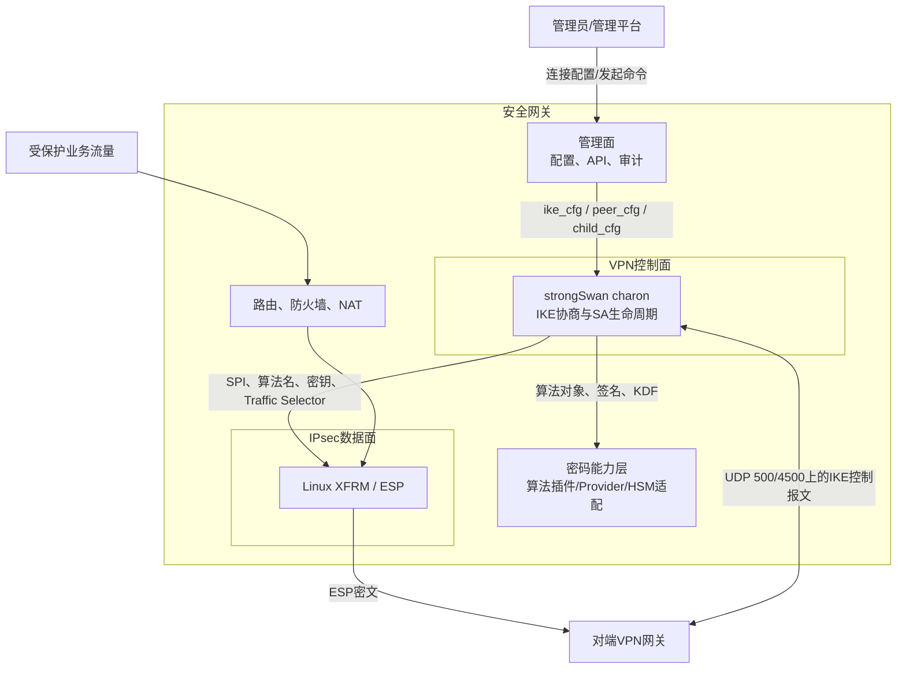
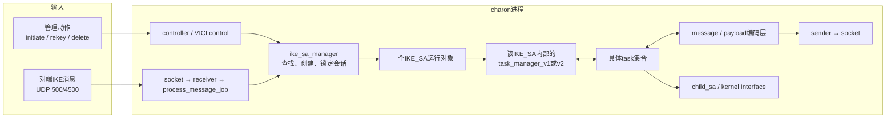
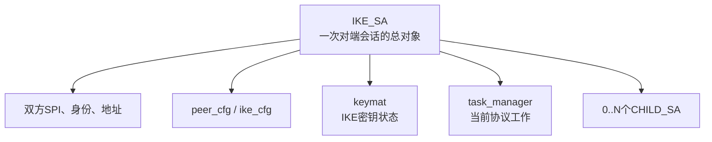
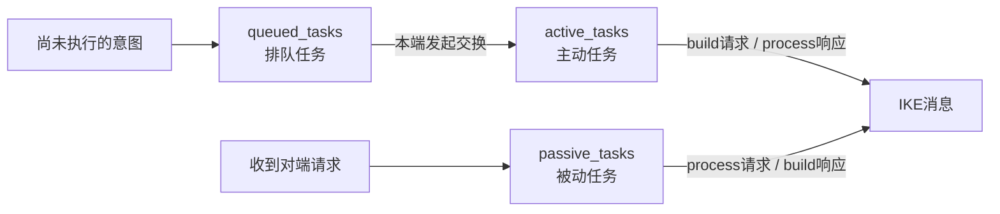
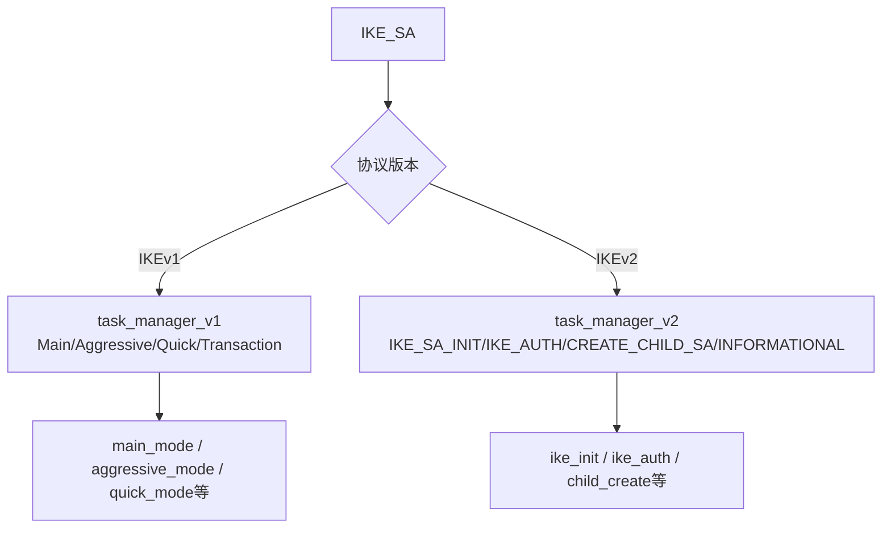

> 源码基线：strongSwan 6.0.3，commit `472dcd8bb50a91f156b725ff56992352b573f7dd`<br>
> 文档定位：这是进入五条源码链和 IKEv1/IKEv2 Task Manager 专题前的“空间坐标图”。它先回答模块在系统哪里、为什么存在、输入从哪里来、输出到哪里去，再进入函数。<br>
> 边界：本文分析上游 strongSwan，不代表未来采购网关一定使用相同版本或保持相同结构。

## 1. 先建立一句话心智模型

`task_manager` 位于 **charon 的 IKE 控制面**，并且是 **每个 `IKE_SA` 私有的一名协议编排器**：

```text
外部的“建链/删链意图”或收到的IKE消息
→ 找到对应IKE_SA
→ task_manager判断现在该执行哪些协议任务
→ 具体task读取或构造Payload并改变会话状态
→ 生成下一条IKE消息，或产生密钥/CHILD_SA等内部结果
```

最重要的纠正是：

> `task_manager` 不是整个 IKE 协议的唯一状态机。它负责“编排”；`main_mode`、`quick_mode`、`ike_init`、`ike_auth`、`child_create` 等 task 才保存具体交换阶段并处理协议语义。

它也不是：

- UDP 收包模块；
- IKE 报文编解码器；
- SM2/SM3/SM4 算法实现；
- ESP 逐包加解密模块；
- Linux XFRM 数据面。

## 2. 第一层：在完整安全网关中的位置

先不看 strongSwan 文件，先看它在网关中的位置。



从这里先得出三个边界：

1. `task_manager` 处理的是 **IKE 控制报文**，不是业务 IP 包。
2. 它最终可能推动 `CHILD_SA` 安装到 XFRM，但安装后每个 ESP 包不再经过它。
3. “IKE 协商成功”和“ESP 数据面可用”是两个需要分别验证的阶段。

## 3. 第二层：在 charon 进程中的位置

charon 同时接收两类输入：管理动作和网络消息。两类输入最终都汇入某个 `IKE_SA`。



### 3.1 管理动作从哪里来

例如用户执行发起连接，调用链最终进入：

```text
controller
→ ike_sa->initiate()
→ task_manager->queue_ike()
→ task_manager->queue_child()
→ task_manager->initiate()
```

上游锚点：

- `src/libcharon/sa/ike_sa.c:1577-1655`：`ike_sa_t.initiate()`；
- `src/libcharon/sa/ike_sa.c:1611`：排入 IKE 建链任务；
- `src/libcharon/sa/ike_sa.c:1631`：排入首个 CHILD_SA 任务；
- `src/libcharon/sa/ike_sa.c:1655`：让 task manager 开始执行。

此时 task manager 的输入不是网络包，而是：

```text
“请建立IKE_SA，并按child_cfg建立一个CHILD_SA”
```

### 3.2 网络消息从哪里来

收到 UDP 500/4500 数据后，前半段调用链是：

```text
socket plugin读出字节
→ receiver构造message并解析IKE头
→ process_message_job异步执行
→ ike_sa_manager按SPI查找/创建并checkout IKE_SA
→ ike_sa->process_message()
→ task_manager->process_message()
```

上游锚点：

- `src/libcharon/sa/ike_sa.c:1669-1688`：`IKE_SA` 把消息交给自己的 task manager；
- `src/libcharon/sa/task_manager.c:89-105`：根据版本创建 v1 或 v2 实现。

此时 task manager 得到的是已经有 IKE 头和源/目的地址的 `message_t`，但正文是否已解密、Payload 是否已完整解析，仍由它调用 `parse_message()` 继续完成。

## 4. 第三层：`IKE_SA` 为什么必须包住 Task Manager

`IKE_SA` 可以理解为“一段长期存在的 IKE 会话档案”。一次会话会跨越多条请求、响应、重传、重协商和删除消息，因此不能只靠单个报文对象保存状态。



所以：

- `message_t` 的生命周期通常是一条消息；
- `task_t` 的生命周期通常是一个协议职责跨越若干消息；
- `task_manager_t` 的生命周期通常跟随该 `IKE_SA`；
- `IKE_SA` 还持有 task 之外的身份、密钥材料、地址和 CHILD_SA。

`task_manager` 必须放在 `IKE_SA` 内部，因为它需要持续知道：

- 当前会话是 IKEv1 还是 IKEv2；
- 当前 `IKE_SA` 处于 CREATED、CONNECTING、ESTABLISHED 还是 REKEYING；
- 本端发出的哪一个请求还在等待响应；
- 对端的消息 ID 是否符合预期；
- 哪些 task 已完成，哪些还需要下一轮交换；
- 哪些请求或响应需要缓存以处理重传。

## 5. 第四层：Task Manager 内部到底管理什么

公共接口在 `src/libcharon/sa/task_manager.h`，三个队列是理解源码的钥匙。



### 5.1 `queued_tasks`

表示“将来要做，但还没进入某次交换”的工作，例如建立 IKE_SA、创建 CHILD_SA、DPD、删除或重协商。

### 5.2 `active_tasks`

表示本端正在主动发起的工作。调用顺序通常是：

```text
task.build(请求)
→ 发出请求并等待
→ task.process(响应)
```

### 5.3 `passive_tasks`

表示由对端请求触发、当前由本端响应的工作。调用顺序通常是：

```text
task.process(请求)
→ task.build(响应)
```

### 5.4 返回值就是 task 与 manager 的“控制语言”

`src/libcharon/sa/task.h` 定义 `task_t` 的 `build()`、`process()` 等接口。常见返回值的含义是：

| 返回值 | manager 的理解 | 对 task 的影响 |
| --- | --- | --- |
| `SUCCESS` | 这个 task 已完成 | 从队列移除并销毁 |
| `NEED_MORE` | 本轮已处理，但后面还有消息/交换 | 保留 task 状态 |
| `FAILED` | 协议工作失败 | 通常结束或清理 IKE_SA |
| `DESTROY_ME` | 会话不能继续 | 销毁 IKE_SA |
| `ALREADY_DONE` | 当前动作被取消或已由别处处理 | 依上下文停止当前处理 |

这解释了为什么一个 task 能跨越多条报文：它把内部阶段保存在自己的 `state` 字段中，每次 `build()` 或 `process()` 后用 `NEED_MORE` 告诉 manager“先别销毁我”。

## 6. 第五层：Task Manager 与具体 task 怎样分工

以下分界必须牢牢记住。

| 问题 | 主要负责模块 |
| --- | --- |
| 这是请求还是响应、Message ID 是否正确 | `task_manager_v1/v2` |
| 是否为重传、要不要重发缓存报文 | `task_manager_v1/v2` |
| 当前应使用 IKE_SA_INIT、IKE_AUTH、Main Mode 还是 Quick Mode | `task_manager_v1/v2` |
| SA Payload 里放哪些 Proposal | `ike_init`、`main_mode`、`quick_mode` 等 task |
| 如何处理 KE、Nonce、ID、AUTH | 具体 task 与 `keymat`/认证辅助对象 |
| Payload 怎样序列化、加密、分片 | `message.c` 与 encoding 层 |
| 算法对象从哪里创建 | crypto factory 与插件 |
| CHILD_SA 怎样安装进内核 | `child_create`/`quick_mode` → `child_sa` → kernel interface |
| 业务包怎样变成 ESP | Linux XFRM；不经过 task manager |

因此源码阅读不能只看 `task_manager_v1.c` 或 `task_manager_v2.c`。正确方式是：

```text
先在manager里确认“哪个交换、激活哪个task”
→ 跳到该task确认“本轮读写哪些Payload、状态怎样变化”
→ 需要密钥时再跳到keymat/crypto
→ 需要数据面时再跳到child_sa/kernel-netlink
```

## 7. 第六层：版本分叉发生在哪里

`src/libcharon/sa/task_manager.c:89-105` 只做一件关键工作：

```text
IKE_SA.version == IKEv1
→ task_manager_v1_create()

IKE_SA.version == IKEv2
→ task_manager_v2_create()
```



公共接口相同，是为了让 `ike_sa.c` 不必在每次调用时写一遍 `if (v1) ... else ...`。版本差异被封装在两个 manager 以及各自 task 目录里。

## 8. 一条消息经过 Task Manager 时，哪些东西会变化

用 IKEv2 响应为例：

| 时刻 | 输入 | 被修改的对象 | 输出/下游 |
| --- | --- | --- | --- |
| 进入 `process_message()` | `message_t`、当前 IKE_SA | 重传判断、期望 MID | 决定丢弃、重发或继续 |
| `parse_message()` | 原始正文、当前 keymat | `message_t` 的 Payload 列表 | 可被 task 读取的结构化 Payload |
| `process_response()` | active task 列表、消息 | 每个 task 的内部 state、IKE_SA属性 | `SUCCESS`任务销毁，`NEED_MORE`保留 |
| `initiate()` | 尚未完成的 active task | 选择下一 exchange，递增/设置 MID | 新的 `message_t` |
| `task.build()` | 空消息与 task 内部状态 | 向消息加入 Payload | 完整逻辑消息 |
| `generate_message()` | message、keymat | 编码/保护后的 packet缓存 | sender/socket |

不要只问“这个函数返回什么”，还要问：

1. 它读取了哪个长期对象？
2. 它改变了 task、IKE_SA 还是 message？
3. 变化会由下一次哪个函数继续使用？

## 9. IKEv1 与 IKEv2 的结构差异先看什么

| 维度 | IKEv1 manager | IKEv2 manager |
| --- | --- | --- |
| 建立 IKE SA | Main Mode 或 Aggressive Mode | IKE_SA_INIT + IKE_AUTH |
| 建立数据 SA | Quick Mode | 首个 IKE_AUTH 内可带 CHILD，后续用 CREATE_CHILD_SA |
| task 粒度 | `main_mode`、`quick_mode` 等“大交换任务”较突出 | `ike_init`、`ike_auth`、`child_create` 等职责更细并可共同参与交换 |
| Message ID | Phase 1 与后续交换规则不同，存在随机 MID 与兼容处理 | 请求/响应位明确，双方各自维护递增 MID |
| 重传识别 | 较多依赖交换类型、MID和消息哈希 | 主要围绕方向、期望 MID、请求哈希和缓存响应 |
| 并发/碰撞 | 更多历史兼容和三消息交换特例 | 显式处理 rekey/delete 等 exchange collision |

这张表只是导航。源码级细节分别进入：

- [IKEv1 Task Manager 源码精读](strongSwan%20IKEv1%20Task%20Manager%20源码精读.md)
- [IKEv2 Task Manager 源码精读](strongSwan%20IKEv2%20Task%20Manager%20源码精读.md)

## 10. 与国密改造的关系

### 10.1 只替换算法时

如果目标只是让标准 IKEv2 继续使用原有交换语义，但新增 SM2/SM3/SM4 的 Proposal、算法对象和密钥派生支持，通常重点在：

```text
算法标识/名称映射
→ proposal与Transform编解码
→ crypto factory与算法插件
→ keymat调用可用算法
→ kernel-netlink与Linux算法名称映射
```

此时不应因为“使用国密算法”就默认重写 `task_manager_v2`。

### 10.2 协议语义发生变化时

若标准要求改变：

- 使用哪些交换；
- 某条消息必须出现哪些 Payload；
- 身份认证和证书处理顺序；
- 密钥派生输入与阶段；
- 错误处理或兼容规则；

那么改造会进入 manager 和具体 task。对 GM/T 0022 的分析重点落在 IKEv1 协议画像，但本文源码仍是普通上游 IKEv1，不能把它直接写成已符合 GM/T 0022 的实现。

## 11. 建议阅读顺序

不要再直接从五链 01 一路硬读。按以下顺序：

```text
本文：先建立模块坐标
→ IKEv2 Task Manager：先理解较规整的请求/响应模型
→ IKEv1 Task Manager：再理解Main/Quick与历史兼容
→ 五链02：把收包前半段补齐
→ 五链03：深入Proposal、KE、Nonce与keymat
→ 五链04/05：进入CHILD_SA、XFRM和ESP数据面
```

每次只追一个问题。例如第一次只追：

> IKEv2 发起端收到 IKE_SA_INIT 响应后，为什么下一条消息会自动变成 IKE_AUTH？

答案必须同时指出：

1. manager 中保留了哪些 active task；
2. 哪些 task 返回 `NEED_MORE`；
3. `derive_keys()` 在哪里执行；
4. `initiate()` 怎样从 `TASK_IKE_AUTH` 选择 `IKE_AUTH` exchange。

## 12. 掌握检查

如果能不用看文档回答下面六题，才适合继续逐函数下钻：

1. `task_manager` 在网关、charon 和 `IKE_SA` 中分别处于什么位置？
2. 管理动作和网络报文怎样从两个方向进入同一个 manager？
3. `queued_tasks`、`active_tasks`、`passive_tasks` 分别表示什么？
4. 为什么说 manager 不是唯一的 IKE 状态机？
5. task 返回 `NEED_MORE` 后，谁保存状态，谁决定下一条 exchange？
6. CHILD_SA 安装完成后，为什么业务 ESP 包不再经过 task manager？

## 13. 上游源码入口

- [`task_manager.h`](https://github.com/strongswan/strongswan/blob/472dcd8bb50a91f156b725ff56992352b573f7dd/src/libcharon/sa/task_manager.h)：公共编排接口与三个队列语义
- [`task.h`](https://github.com/strongswan/strongswan/blob/472dcd8bb50a91f156b725ff56992352b573f7dd/src/libcharon/sa/task.h)：task 类型与 `build/process` 合同
- [`task_manager.c`](https://github.com/strongswan/strongswan/blob/472dcd8bb50a91f156b725ff56992352b573f7dd/src/libcharon/sa/task_manager.c#L89-L105)：IKEv1/IKEv2 实现分叉
- [`ike_sa.c`](https://github.com/strongswan/strongswan/blob/472dcd8bb50a91f156b725ff56992352b573f7dd/src/libcharon/sa/ike_sa.c#L1577-L1688)：管理意图和网络消息汇入 task manager
