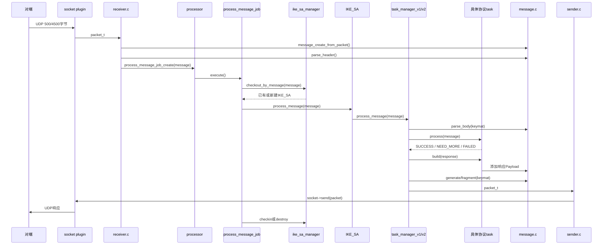
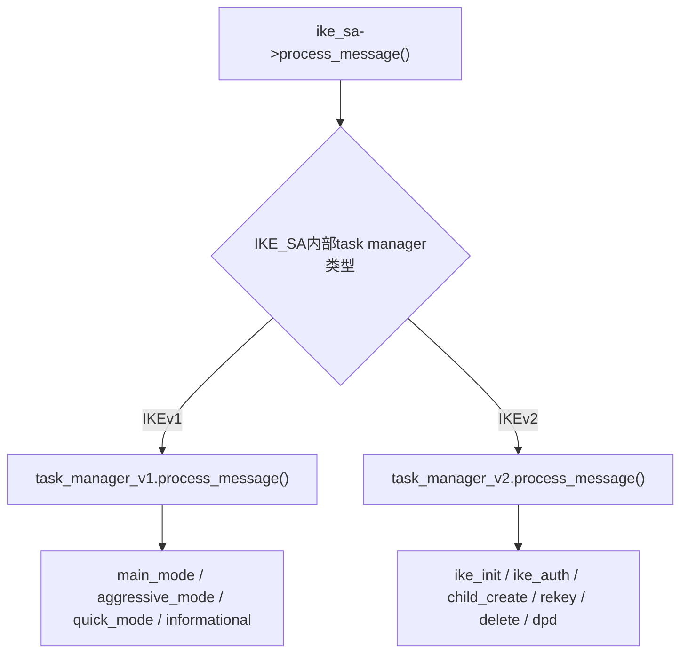

> 源码基线：strongSwan 6.0.3，commit `472dcd8bb50a91f156b725ff56992352b573f7dd`<br>
> 本文跟踪一个从网卡到达的IKE请求：它怎样从`packet_t`变成`message_t`，怎样找到`IKE_SA`，怎样被交给具体task，以及响应怎样重新发到网络。<br>
> 上一条链：[配置如何变成IKE_SA](strongSwan%20五链源码精读%2001%20配置到%20IKE_SA.md) · 下一条链：[Proposal、KE与Nonce如何变成密钥](strongSwan%20五链源码精读%2003%20Proposal与KE到密钥.md)

> **如果你还没有稳定的系统坐标**
> 先看[Task Manager分层定位图](strongSwan%20从系统到函数：Task%20Manager%20分层定位图.md)，再按版本进入[IKEv2 Task Manager](strongSwan%20IKEv2%20Task%20Manager%20源码精读.md)或[IKEv1 Task Manager](strongSwan%20IKEv1%20Task%20Manager%20源码精读.md)。本页随后只用于补齐“UDP报文怎样抵达manager”的前半段。
>

## 1. 先看结论

一个IKE包不会直接调用`ike_init.process()`。它先经过五层分工：

```text
socket负责收字节
→ receiver负责识别包类型和解析IKE头
→ processor job负责异步调度
→ ike_sa_manager用SPI找到并锁定会话
→ task_manager按版本、交换类型和当前状态选择task
```

处理完成后，方向相反：

```text
task.build()写Payload
→ message生成/加密/分片
→ sender排队
→ socket发送UDP包
```

这里最容易误解的是：

- `message_t`是“一条IKE消息”的对象；
- `ike_sa_t`是“跨越多条消息的一次IKE会话”的对象；
- `task_t`只负责会话中的一个协议职责；
- `task_manager_t`负责让消息与当前任务、重传状态和消息ID对应起来。

## 2. 全链时序



## 3. 输入：网卡字节怎样成为`packet_t`

本文从`src/libcharon/network/receiver.c:464`开始。socket plugin已经把操作系统socket读到的数据包装成`packet_t`，其中至少包含：

- 源地址与源端口；
- 目的地址与目的端口；
- 原始UDP payload字节。

`receive_packets()`调用：

```c
status = charon->socket->receive(charon->socket, &packet);
```

所以它的输入不是结构化IKE Payload，而是一块网络字节和地址元数据。

## 4. receiver先判断“这到底是不是IKE”

### 4.1 最早的过滤

`receiver.c:464-635`依次处理：

1. `0xFF`单字节NAT-T keepalive：直接丢弃，不进入状态机；
2. 长度过短：直接丢弃；
3. 目的接口被配置为忽略：丢弃；
4. 非UDP 500端口时，检查开头四字节。

第四步区分NAT-T场景中的两类流量：

```text
UDP 4500 payload以00 00 00 00开头
→ 这是Non-ESP Marker
→ 跳过4字节，继续按IKE解析

UDP 4500 payload不是00 00 00 00开头
→ 看起来是ESP-in-UDP
→ 交给ESP callback；默认内核XFRM路线通常不由这里逐包处理
```

因此，抓到UDP 4500后不能只看端口判断是IKE还是ESP，必须看Non-ESP Marker。

### 4.2 `message_create_from_packet()`建立消息外壳

receiver调用：

```c
message = message_create_from_packet(packet);
message->parse_header(message);
```

此时`message_t`拥有原始`packet_t`，但正文Payload尚未完整解析。

### 4.3 `parse_header()`到底提取了什么

`src/libcharon/encoding/message.c:2321-2374`：

```text
原始字节
→ parser->parse_payload(..., PL_HEADER)
→ 校验IKE Header
→ ike_sa_id_create(version, SPIi, SPIr, initiator_flag)
→ 保存exchange_type、message_id、版本、request/response、first_payload
```

输出去向：这些头字段足以让manager查找会话，也足以决定job优先级；正文稍后才会结合`keymat`解密和解析。

这样分两次解析是必要的：在找到正确`IKE_SA`以前，程序还不知道应该用哪套IKE密钥解密受保护Payload。

## 5. receiver为什么不直接处理协议

receiver最后创建`process_message_job_t`并放入processor队列：

```c
lib->processor->queue_job(
    lib->processor,
    (job_t*)process_message_job_create(message));
```

`src/libcharon/processing/jobs/process_message_job.c:88-116`根据交换类型设置优先级：

- `IKE_AUTH`、IKEv1 Main/Aggressive涉及认证，通常低优先级；
- `INFORMATIONAL`包含DPD，希望响应快，使用高优先级；
- `IKE_SA_INIT`、`CREATE_CHILD_SA`、`QUICK_MODE`通常中优先级。

对象变化：

```text
receiver线程拥有message
→ job取得message所有权
→ processor工作线程稍后执行execute()
```

这避免socket接收线程被证书验证、密钥交换或外部认证长期阻塞。

## 6. job如何找到正确的IKE_SA

### 6.1 `execute()`调用manager

`process_message_job.c:46-85`：

```c
ike_sa = charon->ike_sa_manager->checkout_by_message(..., message);
if (ike_sa)
{
    status = ike_sa->process_message(ike_sa, message);
    checkin或checkin_and_destroy;
}
```

job自己不理解IKE状态机。它只负责取得运行对象、调用它、再归还或销毁。

### 6.2 `checkout_by_message()`怎样使用SPI

`src/libcharon/sa/ike_sa_manager.c:1326-1502`先从消息头取`ike_sa_id_t`：

```c
id = message->get_ike_sa_id(message);
id = id->clone(id);
id->switch_initiator(id);
```

`switch_initiator()`不是修改报文，而是把“报文发送方视角的initiator标志”转换成本机manager查表使用的视角。

随后分两类：

#### 已有会话

当SPI组合已存在时，manager找到表中的entry，等待它不再被其他线程checkout，然后把`checked_out`标记为当前线程并返回同一个`IKE_SA`。

#### 新的初始请求

IKEv2满足：

```text
request + IKE_SA_INIT + message_id=0 + responder SPI=0
```

IKEv1 Main/Aggressive初始请求满足对应的零Responder Cookie条件。manager还会：

1. 对初始包计算hash，识别重复初始请求；
2. 生成本端Responder SPI；
3. `ike_sa_create(id, FALSE, ike_version)`创建Responder侧运行对象；
4. 建立manager entry并标记half-open。

输出是被当前工作线程独占的`ike_sa_t *`。

## 7. `IKE_SA`在什么地方分流版本

`src/libcharon/sa/ike_sa.c:1669-1700`的`process_message()`只做薄封装：

1. 拒绝`IKE_PASSIVE`状态；
2. 校验消息主版本与该SA版本一致；
3. 调用`this->task_manager->process_message(...)`。

`IKE_SA`创建时已经根据版本持有`task_manager_v1`或`task_manager_v2`，所以这里通过接口调用自然分流，无需大段`if (v1) ... else ...`。



## 8. IKEv2：消息怎样到达具体task

### 8.1 先解析正文

`src/libcharon/sa/ikev2/task_manager_v2.c:1616-1665`的`parse_message()`调用：

```c
msg->parse_body(msg, this->ike_sa->get_keymat(this->ike_sa));
```

`message.c:2797-2836`依次：

1. 根据版本和交换类型取得消息规则；
2. `parse_payloads()`把字节变成Payload对象；
3. `decrypt_payloads(keymat)`解密受保护Payload；
4. `verify()`检查Payload组合、必选项和长度。

输入是`message_t + 当前IKE_SA的keymat`，输出是可枚举的具体Payload对象，例如SA、KE、Nonce、IDi、AUTH。

### 8.2 Message ID和重传先于业务处理

`task_manager_v2.c:1850-1924`先比较`message_id`：

- 如果是上一请求的重传，直接重发缓存响应，不重复跑task；
- 如果ID不是期望值，记录并忽略；
- 只有ID与当前窗口一致才继续。

这说明同一个网络包即使语法正确，也不一定进入协议task。

### 8.3 Responder首次收到请求时创建哪些task

`process_request()`位于`task_manager_v2.c:1126-1429`。当`passive_tasks`为空且收到`IKE_SA_INIT`时，它依次创建：

```text
ike_vendor
→ ike_init
→ ike_natd
→ ike_cert_pre
→ ike_auth
→ ike_cert_post
→ ike_config
→ ike_mobike
→ ike_establish
→ ike_auth_lifetime
→ child_create
```

这些task并非都在同一条消息里完成。它们各自查看自己关心的Payload和状态，返回：

- `SUCCESS`：该task本阶段或全部工作完成；
- `NEED_MORE`：还需后续消息/响应；
- `FAILED`或`DESTROY_ME`：失败并可能销毁SA。

### 8.4 task的`process()`怎样被调用

同函数`1338-1429`分三轮：

1. 可选`pre_process()`；
2. 每个task的`process(message)`读取输入Payload并更新自己的内部状态；
3. 可选`post_process()`；
4. 最后调用`build_response()`。

以`IKE_SA_INIT`为例，`ike_init.process_r()`会读取SA、KE、Nonce；`ike_natd`处理NAT检测；其余面向后续IKE_AUTH的task通常保留为`NEED_MORE`。

## 9. IKEv1有什么相同和不同

`src/libcharon/sa/ikev1/task_manager_v1.c:1245-1295`同样调用`message->parse_body(keymat)`；`1320`开始的`process_message()`同样负责hash/重传、地址更新和task调用。

不同点来自协议本身：

| 项 | IKEv1 | IKEv2 |
| --- | --- | --- |
| 初始交换 | Main Mode或Aggressive Mode | IKE_SA_INIT |
| IPsec SA交换 | Quick Mode | IKE_AUTH内首个CHILD或CREATE_CHILD_SA |
| 请求关联 | Phase 1部分场景无普通MID，manager可能用整包hash | 严格按递增Message ID窗口 |
| task文件 | `main_mode.c`、`aggressive_mode.c`、`quick_mode.c` | `ike_init.c`、`ike_auth.c`、`child_create.c` |

但网络入口、job、manager checkout、`IKE_SA`委托和sender仍由两者共用。

## 10. 响应怎样从task回到网络

### 10.1 `build_response()`建立响应消息

`task_manager_v2.c:980-1120`：

1. `message_create()`创建响应`message_t`；
2. 从请求反转source/destination；
3. 复制exchange type和message ID，设置`request=FALSE`；
4. 依次调用被动task的`task->build(task, message)`；
5. task向message加入响应Payload；
6. `generate_message()`生成一个或多个`packet_t`；
7. `send_packets()`发送并保存副本供重传。

### 10.2 `message->generate()`做什么

调用链：

```text
task_manager_v2.generate_message()
→ ike_sa.generate_message_fragmented()
→ ike_sa.generate_message()
→ message.generate(keymat)
→ generate_message() + finalize_message()
→ packet_t
```

`message.c:1962-1985`把Payload编码成字节；如当前交换需要保护，则使用`keymat`提供的入/出方向AEAD对象完成IKE报文加密与完整性；必要时由上层分片。

输出是已经可发送的`packet_t`，不是业务ESP包。

### 10.3 sender为什么还有一个队列

`task_manager_v2.c:326-345`把packet交给`charon->sender->send()`。
`src/libcharon/network/sender.c:93-135`处理UDP 4500 Non-ESP Marker并加入发送队列；`sender.c:141-164`的发送job最终调用：

```c
charon->socket->send(charon->socket, packet);
```

这又把协议处理线程与可能阻塞的socket发送解耦。

## 11. 一张逐跳对象表

| 跳数 | 函数 | 输入 | 对象/状态变化 | 输出去向 |
| --- | --- | --- | --- | --- |
| 1 | `socket->receive()` | UDP字节 | 创建`packet_t` | receiver |
| 2 | `receive_packets()` | `packet_t` | 过滤keepalive、区分IKE/ESP、去Non-ESP Marker | `message_create_from_packet()` |
| 3 | `message.parse_header()` | IKE头字节 | 形成SPI、版本、exchange、MID | receiver/job |
| 4 | `process_message_job_create()` | `message_t` | 消息所有权进入job并分配优先级 | processor |
| 5 | `checkout_by_message()` | 头字段 | 查找或创建并checkout `IKE_SA` | job |
| 6 | `ike_sa.process_message()` | SA+message | 校验版本并委托 | v1/v2 task manager |
| 7 | `message.parse_body()` | message+keymat | 解密/解析成Payload对象 | task manager |
| 8 | `process_request/response()` | Payload+会话状态 | 创建/匹配task、处理重传与MID | 具体task |
| 9 | `task.process()` | 当前消息 | 更新task/IKE_SA状态 | task manager |
| 10 | `task.build()` | 空响应message+task状态 | 添加响应Payload | message |
| 11 | `message.generate()` | Payload+keymat | 编码、保护、形成`packet_t` | sender |
| 12 | `sender.send()` | `packet_t` | NAT-T marker、异步排队 | socket plugin |
| 13 | `socket->send()` | UDP packet | 交给操作系统网络栈 | 对端 |

## 12. 失败分支怎样定位

| 失败点 | 源码行为 | 外部现象 |
| --- | --- | --- |
| IKE头非法 | `parse_header()`失败，receiver直接丢弃 | 可能只有`invalid IKE header`，无响应 |
| 初始包过载或Cookie限制 | receiver/manager拒绝创建half-open SA | 对端重传或收到Cookie |
| SPI找不到SA | `checkout_by_message()`返回NULL | job结束，报文不进入task |
| IKE版本不一致 | `ike_sa.process_message()`返回失败 | 日志出现wrong exchange/version，状态不推进 |
| 受保护Payload验证失败 | `parse_body()`返回`VERIFY_ERROR/FAILED` | IKE_AUTH或后续交换终止 |
| Message ID不在窗口 | task manager忽略 | 报文语法正确但状态不变 |
| task返回`DESTROY_ME` | job调用`checkin_and_destroy()` | SA被清理，后续包找不到会话 |
| 生成响应失败 | `generate_message()`失败 | 已处理请求但无合法响应包 |

## 13. 如何用日志和PCAP证明

### 13.1 原始证据

```bash
journalctl -u strongswan --since "5 minutes ago" --no-pager
tcpdump -ni any -s0 -w ike-flow.pcap 'udp port 500 or udp port 4500'
```

`journalctl`保留charon真实日志；`tcpdump`保留原始报文，不要用手工拼接的文本代替。

### 13.2 Wireshark映射

显示过滤器：

```text
isakmp || udp.port == 4500
```

选择一个包后展开：

```text
Internet Key Exchange
├── Initiator SPI
├── Responder SPI
├── Exchange Type
├── Flags
├── Message ID
└── Payloads
```

这些字段分别对应`message.parse_header()`写入`ike_sa_id`、`exchange_type`、`is_request`和`message_id`的结果。

### 13.3 一次代表性负面测试

捕获一条合法IKE请求后，构造或重放一个错误Message ID的请求。预期：receiver和header解析仍成功，但`task_manager_v2.process_message()`在期望MID判断处忽略它，具体task不应重复执行。

## 14. 边界与国密含义

- 这条链负责“把包送进正确状态机”，不是实现某个具体密码算法。
- 新增SM算法通常不会改变receiver、job、manager和sender骨架；它会影响Payload中的Transform、task的协商结果、keymat和报文保护对象。
- GM/T 0022的IKEv1改造可能改变Main Mode具体task、Payload集合和消息语义，但仍会复用大部分网络入口和并发调度框架。
- 抓到IKE协商成功不等于ESP数据面成功；后者必须继续验证第四、第五条链。

## 15. 源码锚点

- [`receiver.c:464-635`](https://github.com/strongswan/strongswan/blob/472dcd8bb50a91f156b725ff56992352b573f7dd/src/libcharon/network/receiver.c#L464-L635)：收包、NAT-T区分、头解析与job投递
- [`message.c:2321-2374`](https://github.com/strongswan/strongswan/blob/472dcd8bb50a91f156b725ff56992352b573f7dd/src/libcharon/encoding/message.c#L2321-L2374)：解析IKE Header
- [`process_message_job.c:46-85`](https://github.com/strongswan/strongswan/blob/472dcd8bb50a91f156b725ff56992352b573f7dd/src/libcharon/processing/jobs/process_message_job.c#L46-L85)：checkout、处理、checkin
- [`ike_sa_manager.c:1326-1502`](https://github.com/strongswan/strongswan/blob/472dcd8bb50a91f156b725ff56992352b573f7dd/src/libcharon/sa/ike_sa_manager.c#L1326-L1502)：按SPI查找或创建SA
- [`ike_sa.c:1669-1700`](https://github.com/strongswan/strongswan/blob/472dcd8bb50a91f156b725ff56992352b573f7dd/src/libcharon/sa/ike_sa.c#L1669-L1700)：委托给版本化task manager
- [`task_manager_v2.c:1126-1429`](https://github.com/strongswan/strongswan/blob/472dcd8bb50a91f156b725ff56992352b573f7dd/src/libcharon/sa/ikev2/task_manager_v2.c#L1126-L1429)：创建并执行被动task
- [`task_manager_v2.c:1616-1665`](https://github.com/strongswan/strongswan/blob/472dcd8bb50a91f156b725ff56992352b573f7dd/src/libcharon/sa/ikev2/task_manager_v2.c#L1616-L1665)：正文解析和验证
- [`task_manager_v2.c:1850-2044`](https://github.com/strongswan/strongswan/blob/472dcd8bb50a91f156b725ff56992352b573f7dd/src/libcharon/sa/ikev2/task_manager_v2.c#L1850-L2044)：Message ID、请求/响应分流
- [`message.c:1962-1985`](https://github.com/strongswan/strongswan/blob/472dcd8bb50a91f156b725ff56992352b573f7dd/src/libcharon/encoding/message.c#L1962-L1985)：消息生成
- [`sender.c:93-164`](https://github.com/strongswan/strongswan/blob/472dcd8bb50a91f156b725ff56992352b573f7dd/src/libcharon/network/sender.c#L93-L164)：发送排队与socket输出

## 16. 掌握检查

1. 为什么只解析IKE Header以后就能查找SA，而正文要等拿到keymat后再解析？
2. UDP 4500中的IKE和ESP怎样区分？
3. `checkout_by_message()`创建新Responder SA的条件是什么？
4. task manager与具体task分别负责什么？
5. 一条响应从`task.build()`到网卡，至少经过哪些函数层？
